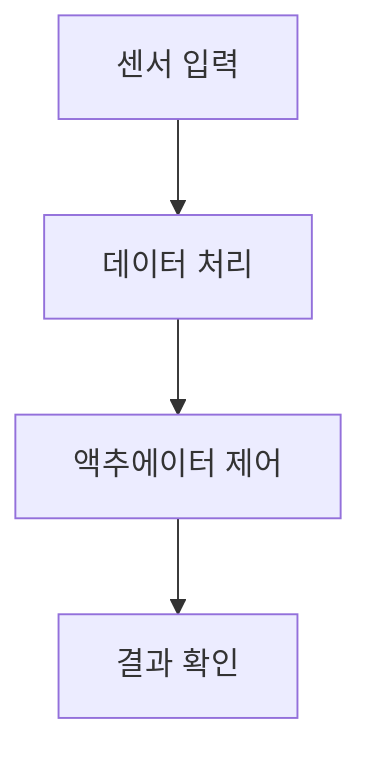

# 한국어 교육 커리큘럼 작성 규칙

## 응답 형식

### 1. 비교표 중심
- 교구재, 가격, 준비사항을 표로 정리
- 장단점 비교표 제공

### 2. 알고리즘 설명
- 동작 순서도를 Mermaid 다이어그램으로 제공
- 단계별 플로우차트 작성

### 3. 프로젝트 기반 학습 (PBL)
- 피지컬 컴퓨팅 중심 (아두이노, 라즈베리파이 등)
- 프로젝트 메이커 기반 설명
- 실습 중심 커리큘럼

### 4. 역공학 방식
- 완성된 프로젝트를 먼저 보여주고
- 역으로 분석하며 학습하는 "그림자 프로젝트" 방식

## 예시 구조

```markdown
## 교구재 비교표

| 항목 | 아두이노 우노 | 라즈베리파이 4 | 마이크로비트 |
|------|--------------|----------------|--------------|
| 가격 | 30,000원 | 70,000원 | 25,000원 |
| 난이도 | 중 | 고 | 하 |
| 확장성 | 높음 | 매우 높음 | 중간 |

## 프로젝트 순서도


```
