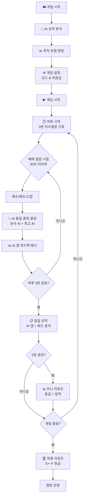
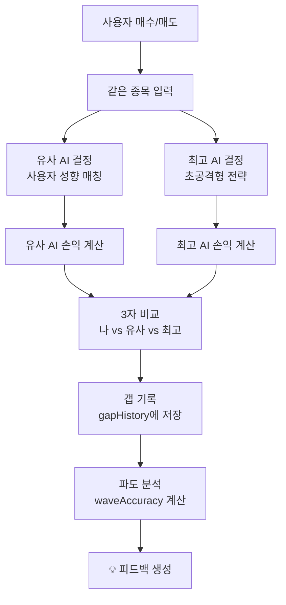
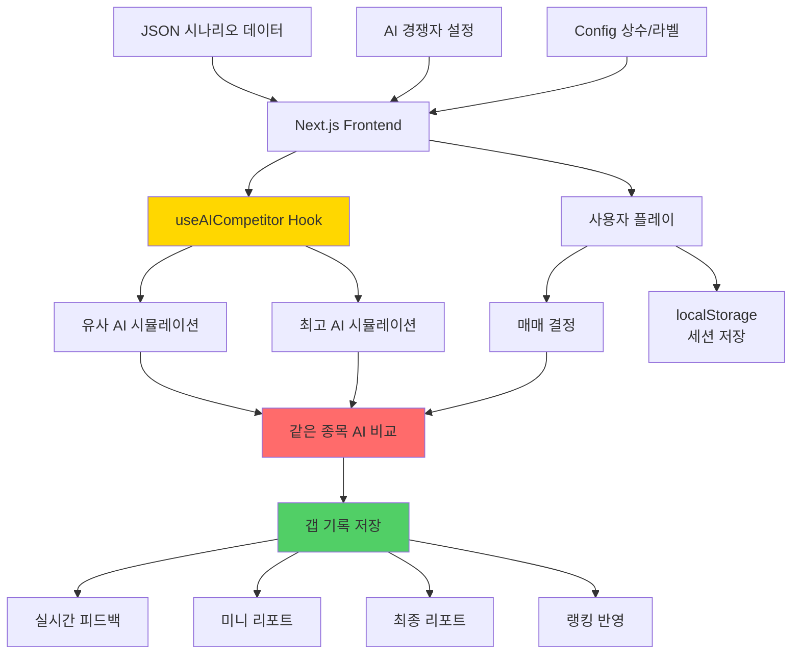

# 파도를 타라 🌊 - 주식 시뮬레이션 게임
## "생각하는 투자자를 만듭니다"

---

## 📑 목차

1. [프로젝트 개요](#프로젝트-개요)
2. [핵심 차별점: AI 경쟁자 비교 시스템](#-핵심-차별점-ai-경쟁자-비교-시스템)
3. [유저 시나리오: 이렇게 성장합니다](#-유저-시나리오-이렇게-성장합니다)
4. [3대 핵심 모드](#-3대-핵심-모드)
5. [AI 갭 분석 — 모든 순간에 AI와 비교](#-ai-갭-분석--모든-순간에-ai와-비교)
6. [보고서 시스템 — 3일/최종/종목별 분석](#-보고서-시스템--3일최종종목별-분석)
7. [랭킹 & 경쟁 시스템](#-랭킹--경쟁-시스템)
8. [파도(엘리엇 파동) 학습 시스템](#-파도엘리엇-파동-학습-시스템)
9. [게임 알고리즘 및 순서도](#️-게임-알고리즘-및-순서도)
10. [시스템 아키텍처](#-시스템-아키텍처)
11. [시작하기](#-시작하기)
12. [구현 현황](#-구현-현황)

---

## 프로젝트 개요

**"파도를 타라"**는 AI 경쟁자와 실시간으로 대결하며 주식 투자 감각을 체득하는 **모바일 실전 투자 시뮬레이션 앱**입니다.

### 왜 이 앱인가?

기존 주식 시뮬레이션 앱은 **혼자 연습**합니다. "파도를 타라"는 다릅니다.

> **매 거래마다 "최고 AI"와 "나와 유사한 AI"가 같은 종목에서 어떤 결정을 내렸는지 즉시 비교합니다.**
> 
> 내가 카카오를 매수할 때, 최고 AI는 이미 매도했을 수 있습니다.
> 그 차이가 곧 학습입니다.

### 핵심 가치

| 특징 | 설명 |
|:---:|:---|
| **🤖 AI 듀얼 비교** | 최고 AI + 유사 AI, 두 기준으로 내 실력을 실시간 측정 |
| **📊 갭 분석** | 매 거래, 매일, 3일마다, 게임 종료 시 — 모든 시점에서 AI와의 격차 시각화 |
| **🌊 파도 체득** | 엘리엇 파동 기반 시나리오 + 패턴 연습으로 변동성 감각 훈련 |
| **🏆 공정한 랭킹** | 실전 시뮬레이션만 랭킹 반영, 도전자 점수 공식으로 공정 경쟁 |
| **📱 모바일 최적화** | 세로 모드 전용, 30초 타이머 기반 턴제 의사결정 |

### 게임 모드 한눈에 보기

```
📱 파도를 타라
├── 🎓 연습 (Learn)
│   ├── 시나리오 학습 — 5턴 투자 시나리오, AI와 턴별 비교
│   └── 패턴 연습 — 엘리엇 파동 패턴 인식 훈련
│
├── 🎮 실전 시뮬레이션 (Practice)
│   ├── 스프린트 (30턴) / 스탠다드 (100턴) / 마라톤 (200턴)
│   ├── 하루 3번 의사결정 × 30초 타이머
│   ├── 3일마다 미니 리포트 + 최종 종합 리포트
│   └── 실시간 AI 갭 피드백
│
└── 🏆 도전 (Compete)
    ├── 주간/누적 랭킹
    ├── 투자 DNA 분석
    ├── 갭 분석 (최고 플레이어 vs 유사 AI vs 나)
    └── 주간 챌린지
```

---

## 🤖 핵심 차별점: AI 경쟁자 비교 시스템

### "같은 종목, 다른 선택" — 이것이 핵심입니다

다른 시뮬레이션 앱은 AI가 별도로 거래합니다. **"파도를 타라"는 내가 거래한 바로 그 종목에서 AI가 어떤 결정을 내렸는지 비교합니다.**

```
내가 카카오 10주 매수 (72,000원)
  ├── 유사 AI: 카카오 5주 매수 (분할 매수 전략)
  │   └── 이유: "지지선 확인 후 분할 매수"
  └── 최고 AI: 카카오 15주 매수 (공격적 진입)
      └── 이유: "모멘텀 상승 초기 공격 매수"

→ 3일 후 결과: 최고 AI +8.2%, 유사 AI +5.1%, 나 +3.8%
→ 학습 포인트: "투자 비중을 높였다면 최고 AI 수준 가능"
```

### 듀얼 AI 시스템

**1. 유사 AI (Similar AI)** — 나와 비슷한 성향의 AI

사용자의 현금 비율, 보유 종목 수를 실시간 분석하여 5단계 중 가장 가까운 성향의 AI를 자동 매칭합니다.

| 성향 | 투자 비중 | 손절 | 익절 | 현금 비율 |
|:---:|:---:|:---:|:---:|:---:|
| 🛡️ 보수형 | 30% | -3% | +8% | 50%+ |
| 🧘 안정형 | 50% | -5% | +10% | 35%+ |
| ⚖️ 균형형 | 60% | -7% | +12% | 25%+ |
| ⚡ 공격형 | 70% | -8% | +15% | 15%+ |
| 🔥 초공격형 | 90% | -10% | +20% | 5%+ |

**2. 최고 AI (Best AI)** — 항상 초공격형 전략

최고 AI는 항상 `ultra_aggressive` 전략으로 운영됩니다. 높은 리스크를 감수하며 최대 수익을 추구하는 기준점 역할을 합니다.

### AI 의사결정 로직

```
매 턴마다 AI가 동일한 종목에서 독립적으로 결정:

1. 보유 종목 체크
   ├── 수익률 ≥ 익절 기준 → 50% 매도 (이유: "목표가 달성 익절")
   └── 수익률 ≤ 손절 기준 → 전량 매도 (이유: "손절선 하회 즉시 매도")

2. 매수 조건 체크
   ├── 현금 비율 > 최소 기준
   ├── 포지션 비율 < 최대 기준
   └── 랜덤 확률 × 투자 비중 → 매수 결정

3. 결과 비교
   └── 사용자 vs 유사 AI vs 최고 AI → 갭 기록
```

### 파도 흐름 분석 (Wave Analysis)

AI 비교에 더해, 매일 시장의 파도 흐름을 분석합니다:

- **상승 파도**: 매수 타이밍을 잘 잡았는지 평가
- **하락 파도**: 손절/현금 비중 관리를 잘 했는지 평가
- **횡보 구간**: 인내심 있게 기다렸는지 평가

파도 정확도(0~100점)가 매일 기록되어 성장 추이를 확인할 수 있습니다.

---

## 🎯 유저 시나리오: 이렇게 성장합니다

### 시나리오 1: 초보 투자자 민수의 하루

```
1️⃣ [연습] 시나리오 학습 시작
   → "AI 반도체 시나리오" 선택
   → 5턴 동안 매수/매도/관망 결정 (턴당 30초)
   → 매 턴마다 AI가 같은 상황에서 뭘 했는지 확인
   → "아, 최고 AI는 1턴에서 이미 매수했구나..."

2️⃣ [연습] 패턴 연습
   → "3파 상승 패턴" 선택
   → 15초 타이머로 빠른 판단 훈련
   → 패턴 점수 + 콤보 보너스 획득

3️⃣ [실전] 스프린트 모드 (30턴) 도전
   → 하루 3번 의사결정 × 30초 타이머
   → 매 거래 후 AI 갭 피드백 배너 확인
   → 3일마다 미니 리포트로 중간 점검
   → 최종 리포트에서 S~F 등급 확인
   → "유사 AI보다 +2.3%p 앞서고 있지만, 최고 AI에는 -5.1%p 뒤처짐"

4️⃣ [도전] 주간 랭킹 확인
   → 도전자 점수: 수익률(50%) + 파도정확도(25%) + 승률(15%) + 일관성(10%)
   → 투자 DNA 분석: "3파 집중형 / 공격형 투자자"
   → 갭 분석: 최고 플레이어 대비 주간 추이 확인
```

### 시나리오 2: 중급 투자자 지은의 성장 과정

```
Week 1: 스탠다드 모드 (100턴) 첫 도전
  → 최종 등급: C (수익률 +5.2%, 최고 AI 대비 -12.8%p)
  → 약점 발견: "매수 타이밍은 좋지만 익절이 너무 빠름"

Week 2: 약점 보완 후 재도전
  → 미니 리포트(3일차): "유사 AI 추월 성공!"
  → 최종 등급: B (수익률 +11.5%, 최고 AI 대비 -6.2%p)

Week 3: 마라톤 모드 (200턴) 도전
  → 파도 정확도 78점 달성
  → 업적 획득: "AI 킬러" (유사 AI 3회 연속 추월)

Week 4: 주간 랭킹 상위 10% 진입
  → 도전자 점수: 82점
  → 투자 DNA: "선점형 / 공격형" 확정
```

### 이 앱이 강화하는 5가지 투자 능력

| 능력 | 훈련 방법 | 측정 지표 |
|:---|:---|:---|
| **의사결정 속도** | 30초 타이머 강제 결정 | 턴당 반응 시간 |
| **손익 관리** | AI 손절/익절 기준과 실시간 비교 | 최고 AI 대비 갭 |
| **파도 감각** | 엘리엇 파동 시나리오 반복 | 파도 정확도 (0~100) |
| **포지션 관리** | 유사 AI의 현금/주식 비율 참고 | 투자 비중 최적화 |
| **일관성** | 주간 랭킹 연속 참여 보너스 | 일관성 점수 |

---

## 📱 3대 핵심 모드

### 1. 🎓 연습 모드 (Learn)

투자의 기본기를 다지는 학습 모드입니다.

#### 시나리오 학습

실제 시장 상황을 기반으로 한 5턴 투자 시나리오를 플레이합니다.

- **턴당 30초** 타이머 — 제한 시간 내 매수/매도/관망 결정
- **비율 선택** — 25%(조금), 50%(반반), 75%(많이), 100%(전부)
- **턴별 AI 비교** — 같은 턴에서 최고 AI와 유사 AI가 뭘 했는지 확인
- **거래 내역 카드** — 확장형 카드로 매 턴의 결과와 AI 갭 분석

**제공 시나리오:**
- AI 반도체 / 방산 / 유틸리티 / 바이오 / 금융 등 다양한 섹터
- 난이도별 분류 (초급 → 중급 → 고급)

#### 패턴 연습

엘리엇 파동 패턴을 빠르게 인식하는 훈련입니다.

- **턴당 15초** — 시나리오보다 빠른 판단 요구
- **패턴 점수** — 정확한 패턴 인식 시 점수 획득
- **콤보 시스템** — 연속 정답 시 보너스 점수

### 2. 🎮 실전 시뮬레이션 (Practice)

본격적인 주식 거래 시뮬레이션입니다. **AI 경쟁자와 동시에 같은 시장에서 투자합니다.**

#### 게임 구조

```
하루 = 3번의 의사결정 기회 (오전/점심/저녁)
각 결정 = 30초 타이머

스프린트:  30턴 (10일) — 빠른 체험
스탠다드: 100턴 (33일) — 균형 잡힌 경험 ⭐ 추천
마라톤:   200턴 (66일) — 심화 학습
```

#### 실시간 AI 비교 요소

| 시점 | 비교 내용 | UI 위치 |
|:---|:---|:---|
| **매 거래 직후** | AI 갭 피드백 배너 (수익률 갭 + 파도 정확도) | 하단 플로팅 |
| **매일 종료** | 일일 요약 + AI 갭 분석 + 파도 흐름 분석 | 오버레이 |
| **3일마다** | 미니 게임 리포트 (등급 + 업적 + 종목별 분석) | 전체 화면 |
| **게임 종료** | 최종 리포트 (S+~F 등급 + 자산 흐름 차트 + 순위) | 전체 화면 |

#### 게임 헤더 정보

게임 중 상단에 항상 표시되는 정보:
- 총 자산 / 수익률
- 현재 일차 / 주차
- **최고 AI 수익률** + 갭
- **유사 AI 수익률** + 갭

#### 세션 저장

게임 진행 상태가 `localStorage`에 자동 저장됩니다. 앱을 닫았다 열어도 이어서 플레이할 수 있습니다.

### 3. 🏆 도전 모드 (Compete)

실전 시뮬레이션 결과를 기반으로 전국 플레이어와 경쟁합니다.

#### 도전자 점수 (0~100점)

```
도전자 점수 = 수익률 백분위 × 50%
            + 파도 정확도   × 25%
            + 승률          × 15%
            + 일관성 보너스  × 10%

일관성 보너스: 3주 연속 참여 +5점, 5주 연속 +10점
```

#### 랭킹 반영 기준

- **반영 O**: 실전 시뮬레이션 — 동일 시나리오를 플레이한 참여자끼리 공정 비교
- **반영 X**: 한종목 연습 / 파도 연습 — 개인 성장 지표로만 활용

#### 투자 DNA 프로필

도전 페이지에서 나만의 투자 DNA를 확인할 수 있습니다:

- **투자 성향**: 공격형 ⚡ / 균형형 ⚖️ / 안정형 🛡️
- **파도 패턴**: 3파 집중형 🌊 / 선점형 🚀 / 꼭대기형 🏔️ / 조정파 활용형 📉
- **관심 종목 TOP 5**
- **파도 통계**: 1파 포착률, 3파 집중도, 5파 탈출, 조정 대응

---

## 📊 AI 갭 분석 — 모든 순간에 AI와 비교

### 1. 실시간 AI 갭 피드백 (AIGapFeedback)

매수/매도 직후 하단에 나타나는 접이식 배너입니다.

```
┌─────────────────────────────────────────┐
│ 📊 AI 갭 현황                    [숨기기]│
├─────────────────────────────────────────┤
│                                         │
│  내 수익률     최고 AI 대비   유사 AI 대비│
│  +5.2%        -3.8%p         +1.2%p    │
│                                         │
│  파도 읽기: ████████░░ 78%              │
│                                         │
│  💡 최고 AI의 매수 타이밍을 참고하세요   │
│                                         │
└─────────────────────────────────────────┘
```

- 갭이 클수록 빨간색, 앞서면 초록색으로 표시
- 파도 정확도 프로그레스 바 (초록/노랑/빨강)
- 상황별 동적 팁 메시지

### 2. 일일 요약 (DaySummaryOverlay)

매일 종료 시 표시되는 오버레이:
- 총 자산 / 수익률 / 거래량 / 수익금
- **AI 갭 분석**: 최고 AI 대비, 유사 AI 대비 수치
- **갭 추이 (최근 7일)**: 갭이 줄어들고 있는지 확인
- **파도 흐름 분석**: 오늘의 파도 방향과 내 대응 평가

### 3. 미니 게임 리포트 (3일마다)

3일 간격으로 중간 점검 리포트가 표시됩니다.

```
┌─────────────────────────────────────────┐
│ 📊 6일차 중간 리포트                     │
│                                         │
│ 등급: A    수익률: +8.5%                │
│                                         │
│ ┌─────────────────────────────────────┐ │
│ │ 나: +8.5%  유사AI: +6.2%  최고AI: +12.1% │
│ └─────────────────────────────────────┘ │
│                                         │
│ [종합]  [주식 상세]                      │
│                                         │
│ 종합 탭:                                │
│ • 총 거래: 12회 (매수 8 / 매도 4)       │
│ • 승률: 75%                             │
│ • 실현 수익: +45,000원                  │
│ • 평가 손익: +23,000원                  │
│ • 업적: "첫 수익 달성!" 🏅              │
│                                         │
│ 주식 상세 탭:                           │
│ • 종목별 카드 (클릭 시 StockDetailPanel) │
│ • 매도 완료 종목 섹션                   │
│                                         │
│ [확인 완료 — 다음 날 시작]              │
└─────────────────────────────────────────┘
```

### 4. 최종 게임 리포트 (FinalGameReport)

게임 종료 시 표시되는 종합 분석 리포트입니다.

**등급 시스템 (S+ ~ F)**:
- 수익률, 최고 AI 대비 갭, 거래 횟수, 플레이 일수를 종합 평가
- 5단계 애니메이션으로 등급 공개

**자산 흐름 차트**:
- Recharts AreaChart로 나 / 유사 AI / 최고 AI 3개 라인 동시 표시
- 어느 시점에서 AI를 추월했는지 한눈에 확인

**업적 시스템**:
| 등급 | 예시 |
|:---:|:---|
| Common | 첫 거래 완료, 3일 연속 수익 |
| Rare | 유사 AI 추월, 파도 정확도 70+ |
| Epic | 최고 AI 추월, 승률 80%+ |
| Legendary | S+ 등급 달성, 전 종목 수익 |

**최종 순위**: 나 / 유사 AI / 최고 AI 포디움 스타일 순위 표시

### 5. 종목별 상세 분석 (StockDetailPanel)

미니 리포트와 최종 리포트에서 종목을 클릭하면 열리는 드릴다운 패널입니다.

- **가격 차트 + 거래 마커**: 내 매수(빨강)/매도(파랑) 지점과 최고 AI의 매수(노랑)/매도(보라) 지점을 차트 위에 표시
- **평균 매입가 기준선**: ReferenceLine으로 내 평균 단가 표시
- **3자 수익 비교**: 이 종목에서 나 vs 유사 AI vs 최고 AI 수익률
- **내 거래 내역**: 매수/매도 시점, 가격, 수량, 손익
- **AI 거래 내역**: 유사 AI와 최고 AI의 거래 + 이유
- **파도 분석 코멘트**: 이 종목의 파도 흐름 해석
- **개선 포인트**: AI 대비 갭에 따른 맞춤 조언

### 6. 경쟁 페이지 갭 분석 (GapAnalysisSection)

도전 페이지에서 장기적인 갭 추이를 분석합니다.

- **주간 수익률 비교 바 차트**: 최고 플레이어 vs 유사 AI vs 나
- **주간 갭 추이 미니 차트**: SVG 폴리라인으로 3자 주간 트렌드
- **상세 스탯 비교**: 파도 정확도, 승률, 평균 보유일 등 유사 AI와 항목별 비교
- **인사이트 카드**: 실행 가능한 개선 제안 + 추천 액션

---

## 📈 보고서 시스템 — 3일/최종/종목별 분석

### 보고서 타임라인

```
Day 1  Day 2  Day 3  Day 4  Day 5  Day 6  ...  Day N
  │      │      │      │      │      │           │
  │      │      ├── 미니 리포트 #1               │
  │      │      │      │      │      ├── 미니 리포트 #2
  │      │      │      │      │      │           │
  └──────┴──────┴──────┴──────┴──────┴───────────┤
                                                  └── 최종 리포트
```

### 미니 리포트 구성 (MiniGameReport)

| 탭 | 내용 |
|:---|:---|
| **종합** | 등급(S~D), 자산 흐름 미니 차트, 3자 수익 비교, 4열 스탯 그리드, 실현/평가 손익, 현금/주식 비율, 업적(최대 3개), 최근 3거래 |
| **주식 상세** | 보유 종목 카드 (클릭 시 StockDetailPanel), 매도 완료 종목 |

### 최종 리포트 구성 (FinalGameReport)

| 탭 | 내용 |
|:---|:---|
| **종합** | 등급(S+~F), 자산 흐름 차트(3라인), 3자 수익 비교, 스탯 그리드, 매수/매도 횟수, 승률, 최고/최악 거래, 업적, 최종 순위 |
| **주식 상세** | 종목별 분석 카드, 가격 차트 + 거래 마커, AI 거래 비교, 파도 분석, 개선 포인트 |

---

## 🏆 랭킹 & 경쟁 시스템

### 도전자 점수 공식

```
도전자 점수 (0~100) =
  수익률 백분위  × 0.50   (해당 주 참여자 중 상위 몇 %)
+ 파도 정확도    × 0.25   (매매 타이밍이 엘리엇 파동 기준에 맞는 비율)
+ 승률           × 0.15   (수익 거래 / 전체 거래)
+ 일관성 보너스  × 0.10   (3주 연속 +5점, 5주 연속 +10점)
```

### 랭킹 탭

| 탭 | 설명 |
|:---|:---|
| **주간 랭킹** | 이번 주 시나리오 결과 기준 |
| **누적 랭킹** | 최근 4주 도전자 점수 평균 |

### 단계별 필터

1단계(500만원) → 2단계(1,000만원) → 3단계(5,000만원) → 4단계(1억원) → 5단계(5억원) → 6단계(10억원)

### 주간 챌린지

매주 새로운 챌린지가 제공됩니다:
- 🌅 조건부 주문 마스터 — 아침 타임에 완벽한 주문 설정
- 🤖 AI 멘토 추월하기 — 김철수 또는 박영희 수익률 넘기
- 🌊 5턴 시나리오 완주 — 3개 시나리오 모두 4성 이상

### 히스토리 & DNA

- **역대 기록**: 실전 시뮬레이션, 한종목 연습, 파도 연습 결과 모두 기록
- **순위 변화 추이**: 주간 순위 변동 그래프
- **투자 DNA**: 성향 + 파도 패턴 + 관심 종목 분석

---

## 🌊 파도(엘리엇 파동) 학습 시스템

### 파도의 3가지 유형

| 유형 | 변동성 | 대표 종목 | 학습 목표 |
|:---:|:---:|:---|:---|
| 💚 안정형 | ±1~3% | 삼성전자, KB금융 | 기본 매매 타이밍 |
| 💛 변동형 | ±3~7% | 카카오, 네이버 | 파도 리듬 감각 |
| ❤️ 고변동형 | ±7~15% | 에코프로, 엔비디아 | 위험 관리 |

### 엘리엇 파동 이론

```
상승 5파: 1파 → 2파(조정) → 3파(폭발) → 4파(조정) → 5파(마무리)
하락 3파: A파(하락) → B파(반등, 함정!) → C파(본격 하락)

핵심: B파 함정을 피하고 3파 상승을 포착하는 것!
```

### 파도 패턴 유형 (투자 DNA)

| 패턴 | 설명 |
|:---:|:---|
| 🌊 3파 집중형 | 상승 3파에서 최대 수익 추구 |
| 🚀 선점형 | 1파 초기 진입 전문 |
| 🏔️ 꼭대기형 | 5파 고점에서 탈출 |
| 📉 조정파 활용형 | 2/4파 조정 저가 매수 |

### 파도 정확도 측정

매일 자동으로 측정되는 파도 정확도:
- 상승장에서 매수했는지
- 하락장에서 매도/현금 확보했는지
- 최고 AI의 매매 패턴과 얼마나 유사한지

---

## ⚙️ 게임 알고리즘 및 순서도

### 전체 게임 플로우



### AI 비교 알고리즘



### 게임 상수

| 상수 | 값 | 설명 |
|:---|:---:|:---|
| `DECISIONS_PER_DAY` | 3 | 하루 의사결정 횟수 |
| `DECISION_TIMER_SECONDS` | 30 | 결정 제한 시간 |
| `AI_REPORT_INTERVAL` | 3 | 미니 리포트 간격 (일) |
| `DAYS_PER_WEEK` | 7 | 주간 리포트 간격 |
| `EXCHANGE_RATE` | 1300 | 환율 (USD 종목용) |

---

## 🏗 시스템 아키텍처

### 기술 스택

```
Frontend:
├── Next.js 14+ (App Router)
├── TypeScript
├── Tailwind CSS
├── Shadcn/ui Components
└── Recharts (차트 시각화)

State Management:
├── React Hooks (useState, useEffect, useMemo, useCallback)
├── Custom Hooks (useAICompetitor, useLivePrices)
└── localStorage (세션 저장)

Data:
├── JSON 파일 (시나리오, AI 전략, 리더보드)
├── Config 파일 (라벨, 상수, 규칙)
└── TypeScript 타입 정의
```

### 폴더 구조

```
stock_simulation/
├── frontend/
│   ├── app/
│   │   ├── page.tsx                        # 홈
│   │   ├── onboarding/                     # AI 성격 분석
│   │   │
│   │   ├── learn/                          # 🎓 연습 모드
│   │   │   ├── page.tsx                    # 연습 메인 (시나리오/패턴 탭)
│   │   │   ├── components/
│   │   │   │   ├── InvestorDNAHero.tsx     # 투자자 DNA 히어로
│   │   │   │   ├── LearningProcessSteps.tsx # 학습 프로세스 시각화
│   │   │   │   ├── ScenarioTab.tsx         # 시나리오 목록
│   │   │   │   ├── PatternTab.tsx          # 패턴 목록
│   │   │   │   └── MiniPatternChart.tsx    # 미니 차트
│   │   │   ├── scenarios/[id]/
│   │   │   │   ├── page.tsx               # 시나리오 상세
│   │   │   │   └── play/
│   │   │   │       ├── page.tsx           # 시나리오 플레이
│   │   │   │       └── components/
│   │   │   │           └── TradeHistoryCard.tsx  # 거래 내역 카드 (AI 비교)
│   │   │   └── patterns/[id]/
│   │   │       ├── page.tsx               # 패턴 상세
│   │   │       └── practice/page.tsx      # 패턴 연습
│   │   │
│   │   ├── practice/                       # 🎮 실전 시뮬레이션
│   │   │   └── stock/[id]/
│   │   │       ├── page.tsx               # 게임 메인 (1600+ lines)
│   │   │       ├── config.ts              # 게임 상수 & 라벨
│   │   │       ├── types.ts               # 타입 정의
│   │   │       ├── trade/page.tsx         # 거래 화면
│   │   │       └── components/
│   │   │           ├── GameHeader.tsx      # 게임 헤더 (AI 갭 표시)
│   │   │           ├── StockListSection.tsx # 종목 리스트
│   │   │           ├── BottomActionBar.tsx # 타이머 & 액션
│   │   │           ├── StockDetailPanel.tsx # 종목별 상세 분석 ⭐
│   │   │           ├── DaySummaryOverlay.tsx # 일일 요약
│   │   │           ├── AIGapFeedback.tsx   # AI 갭 피드백 배너 ⭐
│   │   │           ├── MiniGameReport.tsx  # 3일 미니 리포트 ⭐
│   │   │           ├── FinalGameReport.tsx # 최종 리포트 ⭐
│   │   │           ├── WeeklyReportModal.tsx # 주간 리포트
│   │   │           └── hooks/
│   │   │               └── useAICompetitor.ts # AI 경쟁자 시뮬레이션 ⭐
│   │   │
│   │   ├── compete/                        # 🏆 도전 모드
│   │   │   ├── page.tsx                   # 도전 메인
│   │   │   ├── config.ts                  # 랭킹 규칙 & 라벨
│   │   │   ├── [userId]/page.tsx          # 유저 프로필
│   │   │   ├── challenge/[challengeId]/   # 챌린지 상세
│   │   │   ├── result/                    # 결과 페이지들
│   │   │   └── components/
│   │   │       ├── HeroSection.tsx        # 도전자 카드
│   │   │       ├── MyPatternSection.tsx   # 투자 DNA
│   │   │       ├── GapAnalysisSection.tsx # 갭 분석 ⭐
│   │   │       ├── HistorySection.tsx     # 역대 기록
│   │   │       ├── LeaderboardSection.tsx # 리더보드
│   │   │       ├── StatsSection.tsx       # 실시간 통계
│   │   │       └── WeeklyChallengeSection.tsx # 주간 챌린지
│   │   │
│   │   ├── analysis/                       # 분석
│   │   └── profile/                        # 프로필
│   │
│   ├── components/
│   │   ├── game-play-ui.tsx               # 공용 게임 UI (액션바, 비율 모달) ⭐
│   │   ├── mobile-nav.tsx                 # 모바일 네비게이션
│   │   ├── stock-chart.tsx                # 차트 컴포넌트
│   │   ├── stock-card.tsx                 # 종목 카드
│   │   └── ui/                            # Shadcn UI
│   │
│   ├── data/
│   │   ├── ai-competitors.json            # AI 경쟁자 정의
│   │   ├── compete-history.json           # 경쟁 히스토리
│   │   ├── leaderboard.json               # 리더보드 데이터
│   │   ├── report-preview-dummy.json      # 리포트 프리뷰
│   │   ├── game-scenarios.json            # 게임 시나리오
│   │   ├── stock-100days-data.json        # 100일 주식 데이터
│   │   ├── chart-patterns.json            # 차트 패턴
│   │   ├── legendary-scenarios.json       # 레전더리 시나리오
│   │   ├── pattern-practice.ts            # 패턴 연습 데이터
│   │   ├── scenario-play-content.json     # 시나리오 플레이 콘텐츠
│   │   └── scenarios/                     # 섹터별 시나리오 JSON
│   │       ├── ai-semiconductor.json
│   │       ├── defense.json
│   │       ├── bio.json
│   │       ├── finance.json
│   │       └── ...
│   │
│   └── lib/
│       ├── storage.ts                     # localStorage 관리
│       └── utils.ts                       # 유틸리티
│
├── document/                               # 설계 문서
└── scripts/                                # 데이터 생성 스크립트
```

### 데이터 플로우



---

## 🚀 시작하기

### 1. 설치

```bash
git clone https://github.com/kimjongphil/stock_simulation.git
cd stock_simulation/frontend

pnpm install
# 또는
npm install
```

### 2. 개발 서버 실행

```bash
cd frontend
pnpm dev
# 또는
npm run dev

# 브라우저에서 http://localhost:3000 접속
```

### 3. 주요 페이지

| 페이지 | URL | 설명 |
|:---|:---|:---|
| 홈 | `/` | 메인 페이지 |
| 연습 | `/learn` | 시나리오 & 패턴 학습 |
| 시나리오 플레이 | `/learn/scenarios/[id]/play` | 시나리오 게임 |
| 패턴 연습 | `/learn/patterns/[id]/practice` | 패턴 훈련 |
| 실전 시뮬레이션 | `/practice/stock/[id]` | 메인 게임 |
| 도전 | `/compete` | 랭킹 & 경쟁 |
| 온보딩 | `/onboarding` | AI 성격 분석 |

### 4. 빌드

```bash
pnpm build
# 또는
npm run build
```

---

## ✅ 구현 현황

### 구현 완료

**연습 모드 (Learn)**
- [x] 시나리오 학습 (5턴, 30초 타이머, AI 비교)
- [x] 패턴 연습 (15초 타이머, 점수/콤보)
- [x] 거래 내역 카드 (확장형, AI 갭 분석)
- [x] 투자자 DNA 히어로
- [x] 학습 프로세스 시각화
- [x] 공용 게임 UI (GameActionBar, RatioModal)

**실전 시뮬레이션 (Practice)**
- [x] 다중 종목 실시간 거래
- [x] 하루 3번 의사결정 (30초 타이머)
- [x] 3가지 속도 모드 (스프린트/스탠다드/마라톤)
- [x] **🤖 듀얼 AI 경쟁자 (유사 AI + 최고 AI)**
- [x] **📊 실시간 AI 갭 피드백 배너**
- [x] **📋 3일 미니 리포트 (등급 + 업적)**
- [x] **🏆 최종 게임 리포트 (S+~F 등급)**
- [x] **📈 종목별 상세 분석 (가격 차트 + AI 거래 마커)**
- [x] **🌊 파도 흐름 분석 (매일 자동 측정)**
- [x] 일일 요약 오버레이
- [x] 주간 리포트
- [x] 세션 저장/복원 (localStorage)
- [x] 수익 분석 모달

**도전 모드 (Compete)**
- [x] **🏅 도전자 점수 시스템 (공식 기반)**
- [x] **📊 갭 분석 (최고 플레이어 vs 유사 AI vs 나)**
- [x] **🧬 투자 DNA 프로필**
- [x] 주간/누적 랭킹
- [x] 역대 기록 & 순위 추이
- [x] 주간 챌린지
- [x] 리더보드 (단계별 필터)
- [x] 실시간 통계

**공통**
- [x] AI 성격 분석 (온보딩)
- [x] 모바일 최적화 UI (다크 테마)
- [x] 100일 시나리오 데이터
- [x] 다양한 섹터 시나리오 (AI반도체, 방산, 바이오, 금융 등)

### 🚧 향후 계획

- [ ] 실시간 전국 랭킹 (서버 연동)
- [ ] 친구 대결 모드
- [ ] 전략 마켓플레이스
- [ ] 모바일 앱 출시 (React Native)
- [ ] 실제 역사적 데이터 통합
- [ ] 섹터별 상관관계 반영

---

## 📞 문의 및 지원

- **GitHub**: https://github.com/kimjongphil/stock_simulation
- **이메일**: support@stock-simulation.com

---

## 📄 라이선스

MIT License

---

## 🙏 감사의 말

- **Next.js**: React 프레임워크
- **Shadcn/ui**: UI 컴포넌트
- **Recharts**: 차트 시각화
- **Tailwind CSS**: 스타일링
- **Mermaid**: 플로우차트

---

**Last Updated**: 2025.02.27
**Version**: v3.0 — AI 듀얼 비교 시스템 + 갭 분석 + 리포트 시스템
**Author**: Kim Jong Phil
