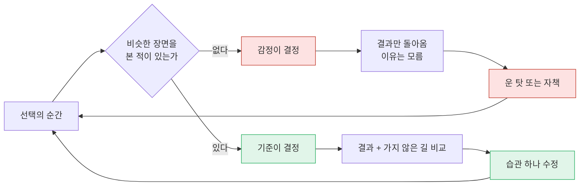
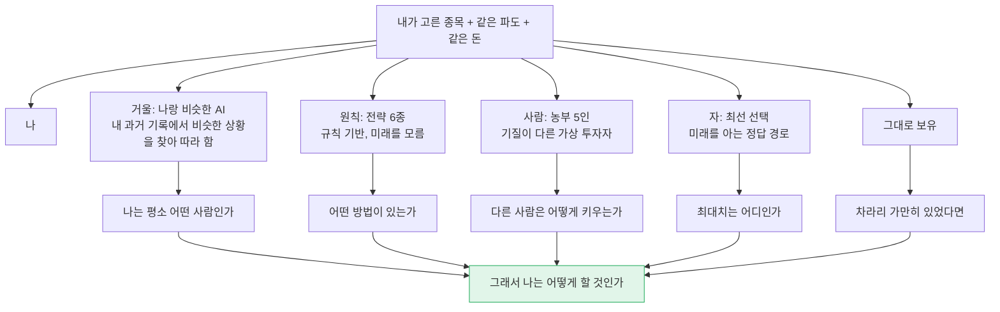
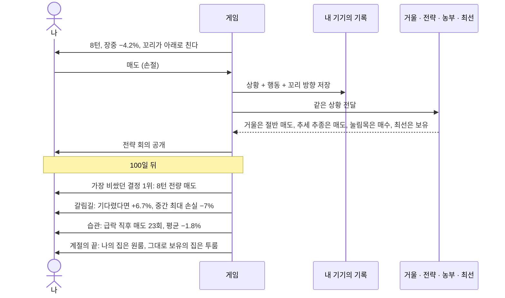
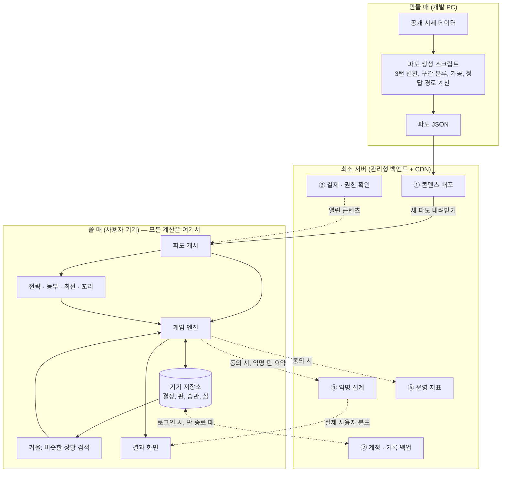
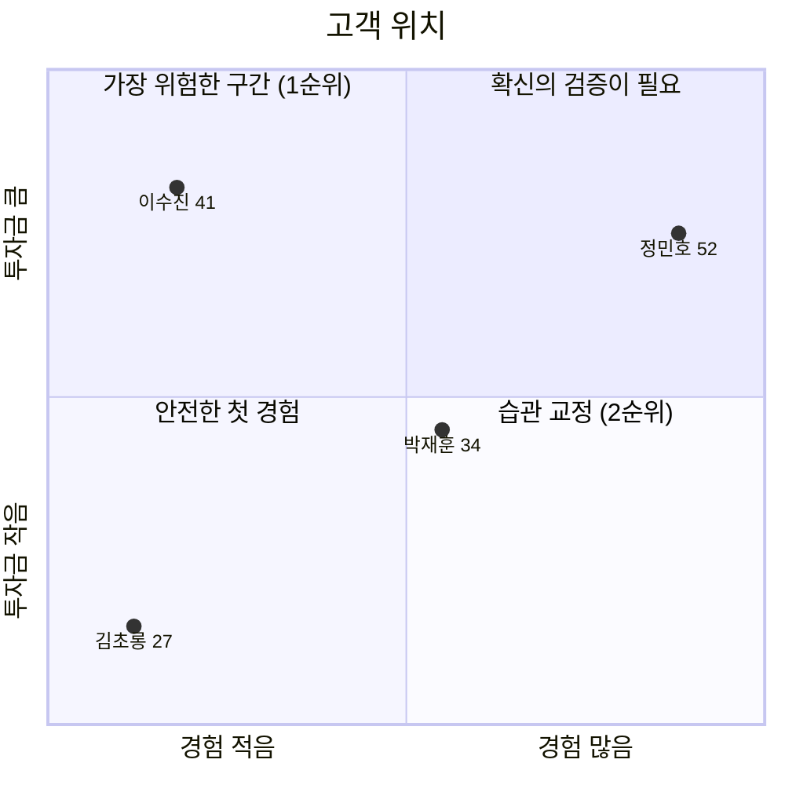
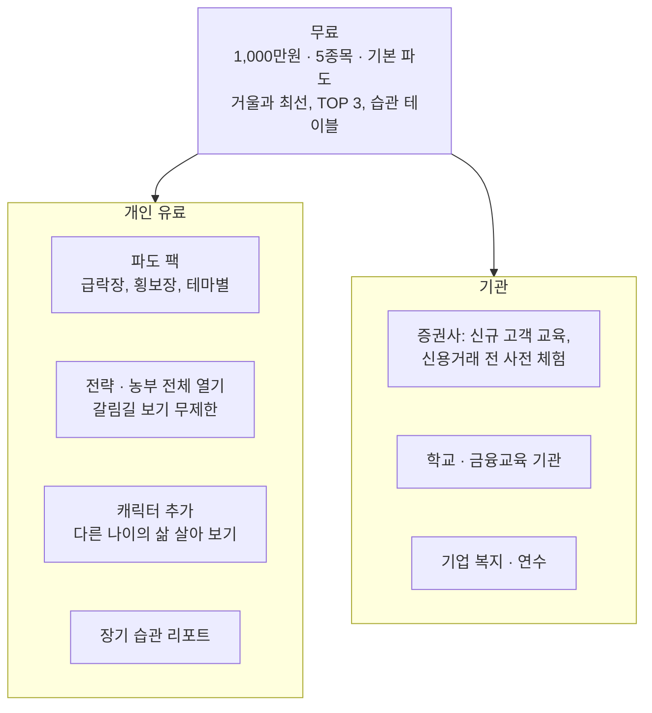
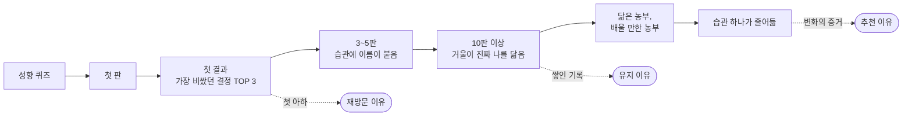
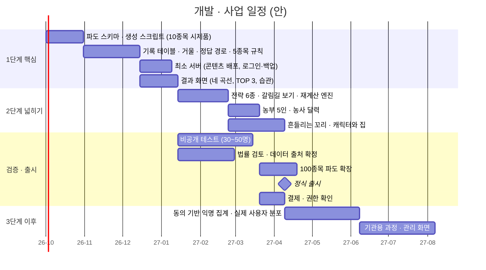

# 사업계획서 — 파도를 타라 🌊

## 가지 않은 길을 보여주는 투자 행동 시뮬레이션

> 작성일: 2026-09-20 · 버전 1.1 (초안 — 기기 우선 + 최소 서버 구조로 변경)
> 설계 근거 문서: [GAME_AI_COMPARE_DESIGN.md](GAME_AI_COMPARE_DESIGN.md) (이하 "설계서")
> 구성: 문제(Problem) → 해결(Solution) → 성장(Scale-up) → 팀(Team)
> `[작성 필요]` 표시는 대표자가 직접 채워야 하는 칸이다. 금액·전환율 등 **가정**으로 표시된 수치는 검증 전 값이다.
> 기존 [투자 유치 제안서](../document/최종-INVESTMENT_PITCH.md)와 다른 점: 랭킹·실시간 경쟁을 빼고 "나와의 비교"로 중심을 옮겼으며, 실제 시세 대신 가공 파도를 쓴다.

---

## 0. 한 장 요약

| 항목 | 내용 |
|---|---|
| 한 문장 | 같은 돈, 같은 종목, 같은 순간에서 **내가 가지 않은 길**을 보여주는 투자 시뮬레이션 |
| 문제 | 개인투자자 손실의 원인은 정보가 아니라 **행동**인데, 자기 행동을 볼 수 있는 도구가 없다 |
| 고객 | 1순위: 큰돈을 처음 넣으려는 사람 (경험 적음 × 금액 큼) · 2순위: 같은 실수를 반복하는 2~5년차 |
| 해결 | 나 · 거울(나를 닮은 AI) · 원칙(전략 6종) · 사람(농부 5인) · 자(최선 선택)를 같은 조건에서 나란히 보여주고, 선택마다 가격표를 붙인다 |
| 몰입 장치 | 연령별 캐릭터의 삶(집)이 결과에 따라 변한다 · 차트 끝의 흔들리는 꼬리와 "꼬리 추종" 통계 |
| 차별점 | 남과의 순위가 아니라 **나와의 비교** (실제 사용자는 순위가 아닌 **익명 분포**로만) · 정답만이 아니라 **따라 할 수 있는 전략과 기질** · 같은 장면의 재현 |
| 구조적 강점 | **기기 우선 + 최소 서버**: 모든 계산은 기기에서 하므로 운영비가 낮고 서버가 멈춰도 게임이 된다. 서버는 백업·결제·콘텐츠 배포·익명 집계·운영 지표만 맡는다 |
| 지금인 이유 | 주식 소유자 약 1,456만 명, 사상 최고 지수와 사상 최대 신용융자가 동시에 나타난 시점 |
| 현재 단계 | 웹(Next.js)·앱(Expo) 시제품 보유. 핵심 비교 엔진은 설계 완료, 구현 전 |
| 필요한 것 | `[작성 필요: 요청 금액 / 기간 / 용도]` |

> **시장을 아는 것은 AI가 도와준다. 나를 아는 것은 아무도 대신해 주지 않는다.**

---

# 1. 문제 (Problem)

## 1.1 출발점 — 창업 동기

> "나는 매번 선택할 때마다 궁금했다. 이 선택이 올바른지, 다른 선택을 했다면 어떻게 됐을지.
> 이런 경험이 없으면 매번 감정으로 선택하게 되고, 특히 1,000만원 이상을 투자할 때는 현실적으로 판단하지 못하고 엉뚱한 선택을 하게 된다.
> 이것을 막기 위해 계획했다."

`[작성 필요: 대표자 본인의 구체적인 경험 한 단락 — 언제, 얼마를, 어떤 선택을 했고, 무엇이 궁금했는가]`

## 1.2 문제의 구조

실제 투자는 **결과**만 돌려주고 **이유**는 돌려주지 않는다. 가지 않은 길은 차트에 남지 않는다.

| # | 문제 | 지금 고객이 겪는 일 |
|---|---|---|
| 1 | 선택의 피드백이 없다 | 잃었을 때 선택이 틀렸는지 운이 나빴는지 구분하지 못한다 |
| 2 | 금액이 커지면 다른 사람이 된다 | 100만원에서는 버티던 −5%를 1,000만원에서는 못 버틴다 |
| 3 | 자기 습관에 이름이 없다 | 같은 실수를 "그때그때 판단한 것"으로 기억한다 |
| 4 | 전략을 글로만 안다 | 내 종목, 내 순간에 적용된 모습을 본 적이 없다 |
| 5 | 떨림에 반응한다 | 분석이 아니라 차트 끝의 움직임을 보고 버튼을 누른다 |

## 1.3 근거 데이터

| 사실 | 수치 | 출처 |
|---|---|---|
| 국내 주식 소유자 | 약 1,456만 명 (2025년 말, 전년 대비 +33만 명) | 한국예탁결제원, [조세일보 2026-03-18](http://www.joseilbo.com/news/htmls/2026/03/20260318564821.html) |
| 그중 개인 | 약 99% | 한국예탁결제원 (2024년 기준), [브릿지경제](https://www.viva100.com/article/20250317500583) |
| 개인투자자 손실 비율 | 46%, 신규 투자자 62% (2020년 3~10월, 20만 명 표본, 상승장) | 자본시장연구원, [파이낸셜뉴스 2021-04-13](https://www.fnnews.com/news/202104131912345956) |
| 지목된 원인 | 과잉확신, 높은 거래회전율, 복권형 종목 선호, 처분효과 | 같은 연구 |
| 2026년 시장 | 코스피 장중 8,046 (5월 15일, 사상 첫 8,000 돌파) | [나무위키 코스피/역사/2026년](https://namu.wiki/w/%EC%BD%94%EC%8A%A4%ED%94%BC/%EC%97%AD%EC%82%AC/2026%EB%85%84) |
| 빚내서 투자 | 신용융자 잔고 사상 최대 경신, 일부 증권사 신용거래 제한 | [뉴시스 2026-04-30](https://www.newsis.com/view/NISX20260430_0003612801), [서울신문 2026-04-23](https://www.seoul.co.kr/news/economy/securities/2026/04/23/20260423030003) |
| 한 종목의 1년 | 삼성전자 52주 최저 81,100원 → 최고 374,500원 → 현재 261,000원 | Yahoo Finance 조회, 2026-09-20 |

(보도·조회 기준 수치다. 제출 전 원문을 다시 확인한다.)

**해석**

1. 연구가 지목한 손실 원인 네 가지는 모두 "무엇을 모르는가"가 아니라 "어떻게 행동하는가"다.
2. 폭등장은 나쁜 습관이 실력으로 기록되는 시기다. 빚을 내어 들어온 사람은 급락 앞의 자신을 **실제 돈으로 처음** 만난다.
3. AI가 정보와 분석을 평준화했다. 같은 정보 앞에서의 **행동**만이 차이로 남는다.

## 1.4 기존 대안의 한계

| 대안 | 주는 것 | 주지 못하는 것 |
|---|---|---|
| 책·강의·유튜브 | 지식, 전략의 설명 | 내 종목·내 순간에 적용된 모습, 내 습관 |
| 일반적인 모의투자 | 주문 연습, 순위 | 다른 선택의 결과, 같은 장면의 재현, 원인 분석 |
| 소액 실전 | 진짜 감정 | 가지 않은 길. 그리고 소액의 감정은 큰돈의 감정과 다르다 |
| AI 종목 분석 | 시장에 대한 앎 | 나에 대한 앎 |

`[작성 필요: 경쟁 서비스 2~3개를 직접 써 보고 기능 비교표 확정]`

---

# 2. 해결 (Solution)

## 2.1 제품 개요

같은 시작 자금, 내가 고른 종목(1,000만원 기준 최대 5종목), 같은 파도, 하루 3턴(시가·장중·종가), 100일.
이 조건을 **모든 비교 대상에 똑같이** 적용한다. 그래서 차이는 오직 선택에서 나온다.

## 2.2 핵심 기능

| # | 기능 | 고객이 얻는 것 | 설계서 |
|---|---|---|---|
| 1 | 네 곡선 비교 (나, 거울, 최선, 그대로 보유) | 내가 어디쯤인지, 매매가 도움이 됐는지 | 7장 |
| 2 | 가장 비쌌던 결정 TOP 3 | 선택마다 붙은 가격표 | 13장 |
| 3 | 습관 테이블 | 내 습관의 이름과 누적 비용 (급락 손절, 조기 익절, 추격매수, 물타기, 꼬리 추종) | 12장 |
| 4 | 전략 회의 | 매 턴 내가 결정한 **뒤** 전략 6종의 선택이 공개된다 | 8.4 |
| 5 | 갈림길 보기 | 지나간 턴의 매수·매도·기다림 세 갈래를 +3턴, +8턴, 종료까지 | 8.3 |
| 6 | 농사 달력 | 같은 종목을 기질이 다른 5인이 어떻게 키웠는지, 수확과 마음고생 일수 | 9장 |
| 6-2 | 실제 사용자 분포 | 같은 파도에서 실제 사람들이 턴마다 어떻게 했는지 (익명, 동의 기반) | 9.6 |
| 7 | 연령별 캐릭터와 집 | 숫자가 삶의 변화로 번역된다. 집은 자산을, 지혜는 과정을 따른다 | 10장 |
| 8 | 흔들리는 꼬리 | 실전의 가장 큰 유혹을 재현하고, 따라갔을 때의 결과를 통계로 돌려준다 | 11장 |
| 9 | 가공 파도 | 종목당 여러 개, 시드 고정. 같은 장면 재현, 약한 유형 반복 | 6장 |

## 2.3 고객이 겪는 한 판

## 2.4 설계 원칙

| 원칙 | 이유 |
|---|---|
| 남이 아니라 나와 비교한다 | 남은 다른 종목, 다른 돈, 다른 시점이다. 원인을 알려주지 않는다 |
| 변수를 줄인다 (같은 종목, 5종목 제한, 하루 3턴) | 변수를 줄여야 원인이 보인다 |
| 먼저 묻고 나서 보여준다 | 먼저 보여주면 남는 기록은 내 판단이 아니라 남의 판단이다 |
| 삶은 자산을, 지혜는 과정을 따른다 | 수익만 보상하면 운 좋은 무모함을 가르친다 |
| 꼬리는 미래를 흘리지 않는다 (상관 0) | 떨림을 읽는 법이 아니라 떨림이 아무것도 가리키지 않음을 가르친다 |
| 최선은 수익률이 아니라 포착률로 | 미래를 아는 답은 목표가 아니라 자다 |
| 같은 입력이면 같은 결과 (시드 고정, 랜덤 없음) | "만약에"가 성립하려면 재현이 가능해야 한다 |

## 2.5 기술 구조 — 기기가 계산하고, 서버는 최소한만 돕는다

실선은 게임에 꼭 필요한 흐름, 점선은 없어도 게임이 되는 흐름이다.

**서버의 다섯 역할과 필요한 이유**

| # | 역할 | 없으면 생기는 문제 | 사업적 의미 |
|---|---|---|---|
| ① | 콘텐츠 배포 | 파도·사건을 추가할 때마다 앱을 새로 내야 한다 | 유료 파도 팩 판매의 통로 |
| ② | 계정 · 기록 백업 | 기기를 바꾸면 기록과 거울이 사라진다 | 쌓인 기록이 유지의 핵심 자산이다. 잃으면 고객도 잃는다 |
| ③ | 결제 · 권한 확인 | 구독 상태를 믿을 수 없고, 기기 간 구매 복원이 안 된다 | 매출의 전제 |
| ④ | 익명 집계 | "실제 사람들은 어떻게 했나"에 답할 수 없다 | "이 급락에서 68%가 팔았다" — 공유되는 콘텐츠이자 차별 기능 |
| ⑤ | 운영 지표 | 제품이 작동하는지 운영자가 모른다 | 효과 검증, 투자자·기관 설득의 근거 |

**서버가 하지 않는 일**: 게임 계산과 AI 판단, 실시간 시세, 순위표, LLM 호출, 턴마다의 통신, 동의 없는 수집.

| 항목 | 내용 |
|---|---|
| 현재 자산 | 웹 시제품 (Next.js 16, React 19), 앱 시제품 (Expo), 성향 퀴즈, 시나리오·패턴 학습, 연습 모드, 종목 유니버스 100선 기획 |
| 현재의 한계 | AI 비교가 성향 고정 수치 + 랜덤으로 동작. 하루 6턴. 6종목 데이터. 서버 없음 |
| 개발할 것 (기기) | 파도 생성 스크립트, 기록 테이블, 거울(k-NN), 정답 경로, 전략 6종, 농부 5인, 재계산 엔진, 꼬리 생성기, 캐릭터·집 |
| 개발할 것 (서버) | 관리형 백엔드 설정 (인증, 저장, 함수), 백업·복원, 콘텐츠 목록, 영수증 검증, 익명 집계 |
| 이 구조의 장점 | 판당 서버 호출이 1~3회라 비용이 사용자 수에 완만하게 비례한다. 오프라인에서 한 판 전체가 된다. 서버 장애가 게임을 막지 않는다 |
| 개인정보 | 게스트로 시작 가능. 백업은 본인만 읽는다. 익명 집계와 운영 지표는 각각 따로 동의받고, 계정과 분리해 보낸다. 삭제 가능 |

> **서버는 무대 뒤에 있어야 한다.** 고객이 서버를 느끼는 순간은 두 번이다 — 새 기기에서 기록이 돌아올 때, 그리고 "68%가 당신처럼 팔았다"를 볼 때.

## 2.6 차별점 요약

| | 일반적인 모의투자 | 파도를 타라 |
|---|---|---|
| 비교 대상 | 다른 참가자 (순위) | 같은 조건의 나, 전략, 농부, 최선 |
| 끝나고 남는 것 | 수익률과 순위 | 선택별 가격표, 습관의 이름과 비용 |
| "다른 선택을 했다면" | 알 수 없음 | 갈림길 보기, 만약에 분석 |
| 데이터 | 실시간 시세 | 가공 파도 (재현 가능, 약한 유형 반복) |
| 결과의 무게 | 숫자 | 연령별 캐릭터의 집과 생활 |
| 단기 떨림 | 노출만 됨 | 꼬리 추종 통계로 되돌려줌 |
| 서버 의존 | 서버가 멈추면 서비스가 멈춤 | 서버 없이도 한 판 전체 가능 |
| 실제 다른 사람들 | 순위 | 같은 파도의 턴별 익명 분포 (결정한 뒤에만 공개) |

---

# 3. 성장 (Scale-up)

## 3.1 목표 고객

| 페르소나 (가상) | 상황 | 필요 | 핵심 화면 |
|---|---|---|---|
| 🧊 이수진 (41) — 1순위 | 적금 만기 3,000만원, 예금만 해 봄 | 최악의 장면을 가짜 돈으로 먼저 | 급락 파도, 캐릭터의 집 |
| 🔥 박재훈 (34) — 2순위 | 3년차, 추격매수와 급락 손절 반복 | 습관의 이름과 비용 | TOP 3, 습관 테이블 |
| 🌱 김초롱 (27) | 계좌만 개설 | 첫 장면들을 안전하게 | 그대로 보유 기준선 |
| 🧭 정민호 (52) | 10년 넘게 직접 투자 | 감의 성적표 | 유형별 포착률, 전략 일치율 |

페르소나는 설계 검증용 가상 인물이다. `[작성 필요: 실제 잠재 고객 10명 이상 인터뷰 결과]`

## 3.2 시장 규모

| 구분 | 정의 | 규모 | 근거 |
|---|---|---|---|
| 전체 시장 | 국내 개인 주식 투자자 | 약 1,400만 명 | 한국예탁결제원 |
| 유효 시장 | 그중 투자 학습·연습에 시간을 쓸 의향이 있는 사람 | `[작성 필요]` | 설문 또는 유사 서비스 이용자 수로 추정 |
| 초기 목표 시장 | 출시 1~2년 안에 도달 가능한 사용자 | `[작성 필요]` | 마케팅 예산과 채널로 역산 |

**예시 계산 (가정, 검증 필요)** — 구조만 보여주기 위한 것이다.

| 단계 | 가정 | 값 |
|---|---|---|
| 개인 투자자 | — | 1,400만 명 |
| 설치 | 1% | 14만 명 |
| 10판 도달 (거울이 나를 닮는 지점) | 설치의 20% | 2.8만 명 |
| 유료 전환 | 10판 도달자의 15% | 4,200명 |
| 1인당 연 매출 | 40,000원 | 연 약 1.7억원 (마켓 수수료 차감 전) |

전환율과 단가는 시제품 검증으로 바꿔 넣는다. 기관 매출은 별도다.

## 3.3 수익 모델

| 모델 | 가격 (가정) | 장점 | 주의 |
|---|---|---|---|
| 개인: 일회성 팩 | 팩당 3,300~5,500원 | 계산을 기기가 하므로 원가가 낮다. 구독 피로가 없다 | 앱 마켓 인앱결제 + 서버 권한 확인 |
| 개인: 전체 열기 | 1회 19,000원 또는 월 4,900원 | 단순하다. 기록 백업·장기 리포트가 구독의 이유가 된다 | 영수증 검증 필요 |
| 기관 | 인원·기간 단위 계약 | "빚내서 투자" 문제와 맞닿아 명분이 분명하다 | 영업 기간이 길다. 기관용 관리 화면은 최소 서버 위에 추가한다 |
| 광고 | — | — | 하지 않는다. 종목·상품 광고는 "투자 자문이 아니다"라는 입장과 충돌한다 |

**무료에 핵심을 둔다.** 첫 "아하"(가장 비쌌던 결정 TOP 3)와 습관 테이블은 무료다. 돈을 받는 것은 **넓히기**(더 많은 장면, 전략, 사람, 나이)다.

## 3.4 고객 여정과 유지 구조

판이 쌓일수록 거울이 나를 더 닮는다. **기록 자체가 떠나기 어려운 자산**이 된다.

## 3.5 시장 진입 전략

| 단계 | 채널 | 내용 |
|---|---|---|
| 0. 검증 | 지인·커뮤니티 테스트 30~50명 | 기록 내보내기 파일로 습관 지표 변화 수집 (동의 기반) |
| 1. 콘텐츠 | 짧은 영상·글 | "같은 8턴, 세 갈래의 결말", "당신은 동전을 71% 따라갔다" 같은 결과 화면 자체가 콘텐츠 |
| 2. 공유 | 결과 카드 | 나의 집, 닮은 농부, 습관 한 줄. 수익률이 아니라 **유형**을 공유 |
| 3. 제휴 | 금융교육 기관, 증권사 | 교육 과정용 파도 묶음 |

`[작성 필요: 채널별 예산과 목표 수치]`

## 3.6 로드맵

일정은 1인 또는 소규모 팀 기준의 안이다. `[작성 필요: 실제 인력에 맞춰 조정]`

## 3.7 성과 지표

수익률은 지표로 삼지 않는다. 가상 수익률은 파도 난이도에 따라 달라지고, 이 제품의 약속도 아니다.

| 구분 | 지표 | 의미 | 목표 |
|---|---|---|---|
| 핵심 | 습관 비용 감소율 (첫 5판 대비 최근 5판, 사용자별 상위 습관 1개) | 제품이 실제로 작동하는가 | `[작성 필요]` |
| 핵심 | "나 < 그대로 보유"인 판의 비율 변화 | 과잉거래가 줄고 있는가 | `[작성 필요]` |
| 행동 | 꼬리 추종률의 변화 | 떨림에 덜 반응하게 되는가 | `[작성 필요]` |
| 행동 | 갈림길 보기 열람 수 / 판 | 궁금증을 실제로 풀고 있는가 | `[작성 필요]` |
| 유지 | 10판 도달률 | 거울이 나를 닮는 지점까지 오는가 | `[작성 필요]` |
| 사업 | 유료 전환율, 기관 계약 수 | — | `[작성 필요]` |

지표는 **수집에 동의한 사용자의 요약값**만 최소 서버로 받는다. 개별 결정의 원문은 받지 않는다.

## 3.8 자금 계획

`[작성 필요: 총 소요 금액, 자기 부담, 요청 금액]`

| 항목 | 내용 | 비중 (안) | 금액 |
|---|---|---|---|
| 개발 인건비 | 엔진, 화면, 파도 생성 스크립트, 최소 서버 연동 | 47% | `[작성 필요]` |
| 디자인 | 캐릭터 5인 × 표정, 집 7단계, 결과 화면 | 20% | `[작성 필요]` |
| 법률·데이터 | 투자자문 해당 여부 검토, 데이터 이용 조건, 상표 | 10% | `[작성 필요]` |
| 검증·마케팅 | 테스트 운영, 콘텐츠 제작 | 15% | `[작성 필요]` |
| 서버·인프라 | 관리형 백엔드, CDN | 3% | `[작성 필요]` |
| 기타 | 앱 마켓 등록, 도구 | 5% | `[작성 필요]` |

계산을 기기가 하므로 서버 비용은 백업 저장과 판당 1~3회 호출 수준이다. 매출에서 빠지는 주요 비용은 앱 마켓 수수료다.

## 3.9 위험과 대응

| 위험 | 내용 | 대응 |
|---|---|---|
| 법·규제 | 특정 종목의 매매를 권하는 것으로 읽히면 투자자문·유사투자자문 관련 검토가 필요할 수 있다 | 가공 파도 명시, 실제 종목 추천 없음, "교육용 시뮬레이션" 표기. **출시 전 법률 검토 필수** |
| 데이터 약관 | 비공식 시세 출처의 재배포 제한 | 출시용 원본은 공공데이터, 앱에는 가공 파도만 |
| 상표·실명 | 실제 기업명 사용 | 실명 + 가공 표기 또는 가명. 법률 검토 결과에 따름 |
| 효과 미검증 | 훈련이 실전 행동을 바꾼다는 증거가 아직 없다 | 핵심 지표로 직접 측정, 과장 없는 문구 |
| 과신 유발 | 가상에서 잘한 사람이 실전 금액을 키울 수 있다 | 한계 상시 표기, 수익과 최대 손실을 항상 함께 표시 |
| 기록 소실 | 기기에 묶인 저장소 | 로그인 시 서버 백업, 게스트는 기록 내보내기 파일 |
| 개인정보 | 투자 습관 기록이 서버에 저장된다 | 본인만 읽는 백업, 동의 기반·계정 분리 익명 집계, 삭제 기능, 처리방침. **출시 전 법률 검토** |
| 서버 비용·장애 | 사용자 증가 시 비용, 장애 시 영향 | 판당 호출 1~3회로 제한. 장애 시에도 게임은 기기에서 계속된다 |
| 모방 | 기능은 따라 할 수 있다 | 쌓인 개인 기록(거울)은 옮겨 갈 수 없다. 파도·사건·문장 콘텐츠의 축적 |

---

# 4. 팀 (Team)

| 항목 | 내용 |
|---|---|
| 대표자 | `[작성 필요: 이름, 경력, 이 문제를 풀 수 있는 이유]` |
| 보유 역량 | 웹·앱 시제품을 직접 구현 (Next.js, Expo). 게임 기획 문서 다수 (시나리오, 종목 유니버스, 이벤트 설계) |
| 필요 인력 | 캐릭터·UI 디자이너, (2단계 이후) 금융교육 자문, 법률 자문 |
| 협력 후보 | `[작성 필요: 금융교육 기관, 증권사, 자문위원]` |

---

# 5. 맺음 — 이 사업이 약속하는 것과 약속하지 않는 것

| 약속하지 않는 것 | 약속하는 것 |
|---|---|
| 수익 | 자기 행동의 가시화 |
| 종목 추천 | 선택마다의 가격표 |
| 시장 예측 | 내 습관의 이름과 비용 |
| 정답 | 따라 할 수 있는 다른 길들 |

> 실전은 한 번에 하나의 길만 보여준다. 그래서 우리는 결과로 선택을 판단한다.
> 하지만 옳은 선택이 잃을 수도 있고, 틀린 선택이 벌 수도 있다.
>
> 이 제품이 주려는 것은 큰돈 앞에 섰을 때 **"이 장면, 본 적 있다"** 고 말할 수 있는 경험,
> 그리고 **"이럴 때 나는 보통 이렇게 하고, 그건 평균 −1.8%였다"** 는 자기 자신에 대한 숫자다.
>
> **감정은 없어지지 않는다. 다만 감정보다 먼저 떠오르는 기억을 만들 수는 있다.**

본 제품은 교육용 시뮬레이션이며 투자 자문이 아니다.

---

## 부록 A. 제출 전 점검표

| # | 할 일 | 상태 |
|---|---|---|
| 1 | `[작성 필요]` 칸 채우기 (창업 동기, 팀, 자금, 목표 수치) | ☐ |
| 2 | 1.3의 수치를 원문에서 재확인 | ☐ |
| 3 | 경쟁 서비스 직접 체험 후 1.4, 2.6 비교표 확정 | ☐ |
| 4 | 잠재 고객 인터뷰 10명 이상 | ☐ |
| 5 | 3.2의 전환율·단가 가정을 시제품 테스트 값으로 교체 | ☐ |
| 6 | 법률 검토 (투자자문 해당 여부, 실명 사용, 데이터 이용 조건) | ☐ |
| 7 | 화면 시안 3장 (결과 화면, 갈림길 보기, 캐릭터의 집) 첨부 | ☐ |
| 8 | 지원 사업 양식에 맞춰 장 순서·분량 조정 | ☐ |

## 부록 B. 설계서 대응표

| 사업계획서 | 설계서 |
|---|---|
| 1. 문제 | 0장, 1장 |
| 2.1~2.3 제품 | 4장, 7~11장, 13~14장 |
| 2.4 설계 원칙 | 2장 |
| 2.5 기술 구조 | 6장, 12장, 15장 |
| 3.1 고객 | 3장 |
| 3.3~3.7 | 18장 |
| 3.6 일정 | 16장 |
| 3.9 위험 | 18.8, 19장 |
