# 가지 않은 길을 보여주는 시뮬레이션 — 기기 우선 · 최소 서버 기반 AI 비교 설계

> 작성일: 2026-09-20 (6차 개정: 서버 없음 → **기기 우선 + 최소 서버**로 변경. 파일명도 GAME_SERVERLESS_AI_COMPARE.md 에서 변경)
> 범위: 왜 만드는가 → 누구를 위해 → 어떤 경험으로 → 어떤 종목·데이터·구조로 → 사업계획서로 옮기는 법
> 관련 문서: [GAME_STOCK_UNIVERSE_100.md](GAME_STOCK_UNIVERSE_100.md) · [user_scenarios.md](../document/user_scenarios.md)

---

## 0. 출발점

이 기획은 기능 목록이 아니라 한 사람의 질문에서 시작했다.

> "나는 매번 선택할 때마다 궁금했다. 이 선택이 올바른지, 다른 선택을 했다면 어떻게 됐을지.
> 이 선택 하나로 나의 운명이 어떻게 바뀌는지.
> 이런 경험이 없으면 매번 감정으로 선택하게 되고, 특히 1,000만원 이상을 투자할 때는 현실적으로 판단하지 못하고 엉뚱한 선택을 하게 된다.
> 이것을 막기 위해 계획했다."

**한 문장 정의**

> 같은 돈, 같은 종목, 같은 순간에서 **내가 가지 않은 길 두 개**를 나란히 보여주는 시뮬레이션.

| 길 | 누구 | 답하는 질문 |
|---|---|---|
| 내가 간 길 | 나 | 나는 실제로 무엇을 했는가 |
| 가지 않은 길 ① | 나랑 비슷한 AI | 평소의 나라면 어떻게 했을까 |
| 가지 않은 길 ② | 최선 선택 | 이 순간 가장 옳은 선택은 무엇이었나 |
| 아무것도 안 한 길 | 그대로 보유 | 차라리 가만히 있었다면 |
| 다른 전략들의 길 | 전략 6종 (8장) | 같은 장면을 다른 원칙으로 보면 무엇을 했을까 |
| 다른 사람들의 길 | 농부 5인 (9장) | 내가 고른 이 종목을, 기질이 다른 사람들은 어떻게 키우고 거두는가 |

> **시장은 내 선택의 반대편을 보여주지 않는다. 가지 않은 길은 차트에 남지 않는다.**
> 이 프로젝트가 만드는 것은 그 남지 않는 차트다.

---

## 1. 왜 만드는가

### 1.1 문제: 피드백이 없는 선택은 감정으로 굳는다

실제 투자에서는 결과(벌었다/잃었다)만 돌아오고, **이유**는 돌아오지 않는다.
내 선택이 틀려서 잃었는지, 선택은 옳았는데 운이 나빴는지 구분할 수 없다.
구분할 수 없으면 배울 수 없고, 배울 수 없으면 다음 선택도 감정이 한다.

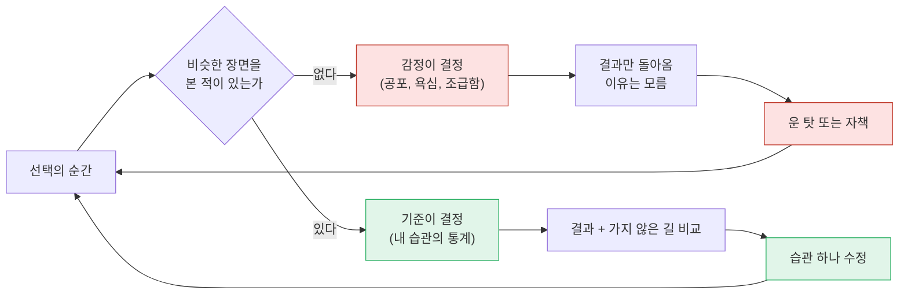

위쪽 고리(빨강)가 지금의 현실이고, 아래쪽 고리(초록)가 이 프로젝트가 만들려는 경험이다.

### 1.2 금액이 커지면 같은 사람이 다른 사람이 된다

−5%는 같은 −5%인데, 금액에 따라 사람이 받는 무게가 다르다.

| 투자금 | −5%의 금액 | 흔한 반응 |
|---|---|---|
| 100만원 | −5만원 | "공부했다 치자" → 계획대로 버팀 |
| 500만원 | −25만원 | 신경 쓰이기 시작, 앱을 자주 엶 |
| 1,000만원 | −50만원 | 한 달 생활비의 일부 → 계획을 잊고 매도 |
| 3,000만원 | −150만원 | 월급 → 판단 정지, 극단적 선택 (전량 손절 또는 물타기) |

> **1,000만원 앞에서 흔들리는 것은 지식이 아니라 경험이다.**
> 본 적 없는 장면 앞에서 사람은 계산하지 않고 반응한다.

그래서 이 시뮬레이션은 금액을 키우기 **전에**, 작은 금액에서 "내가 급락 앞에서 어떤 사람인지"를 숫자로 먼저 알게 한다.
기존 기획의 단계별 자금 규모 시스템([user_scenarios.md](../document/user_scenarios.md))과 연결되는 지점이다.

### 1.3 이 시스템이 막으려는 것과 주려는 것

| 막으려는 것 | 주려는 것 |
|---|---|
| 감정으로 한 선택을 "판단"이라고 착각하는 것 | 내 선택 하나하나의 가격표 |
| 결과만 보고 운/실력을 구분 못 하는 것 | 같은 조건의 비교 대상 (운을 제거한 비교) |
| 같은 실수를 이름도 모른 채 반복하는 것 | 내 습관의 이름과 누적 비용 |
| 큰돈에서 처음 겪는 장면 | 작은 돈에서 미리 겪은 장면 |

### 1.4 또 하나의 이유: 전략을 알고 싶다

궁금한 것은 "맞았나 틀렸나"만이 아니다. **같은 장면을 다르게 보는 방법이 몇 가지나 있는지**도 알고 싶다.

| 알고 싶은 것 | 지금은 왜 알 수 없는가 | 이 시스템의 답 |
|---|---|---|
| 한 종목에서 매수·매도·기다림이 각각 어떤 전략적 의미인가 | 실전에서는 셋 중 하나만 해 볼 수 있다 | 세 선택을 모두 끝까지 돌려서 보여준다 (8.3 갈림길 보기) |
| 세상에 어떤 전략들이 있고, 이 장면에서 각자 무엇을 하는가 | 책으로는 알아도 **내 종목, 내 순간**에 적용된 모습은 본 적이 없다 | 전략 6종이 매 턴 같은 장면에서 각자의 선택을 한다 (8.2) |
| 예를 들어 8턴에서의 내 선택이 어느 방향으로 가는가 | 가지 않은 방향은 기록되지 않는다 | 8턴에서 갈라지는 세 갈래를 +3턴, +8턴, 종료 시점까지 그린다 |
| 나는 어떤 전략에 가까운 사람인가 | 스스로는 "그때그때 판단한다"고 믿는다 | 내 선택과 각 전략의 일치율을 계산한다 (8.4) |

> **전략이 없는 사람은 없다. 자기 전략을 모르는 사람이 있을 뿐이다.**
> 모르는 전략은 고칠 수도, 믿을 수도 없다.

선택지를 아는 것이 전략의 시작이다. 매 턴 "사거나 팔거나"만 보이던 화면에 **다른 원칙들의 선택이 함께 보이면**, 선택은 반응이 아니라 판단이 된다.

### 1.5 그리고: 같은 종목을 다른 사람들은 어떻게 키우는가

내가 고른 종목을 **다른 사람들은 어떻게 판단하고, 어떻게 농사짓는지**도 궁금하다.
같은 밭(종목)에 같은 날씨(파도)인데, 누구는 씨를 한 번에 뿌리고 누구는 나눠 뿌린다. 누구는 첫 열매에 거두고 누구는 가을까지 기다린다.

주식을 "맞히는 게임"으로 보면 매 턴이 시험이 된다. **"농사"로 보면 매 턴은 밭을 돌보는 하루가 된다.** 이 관점의 전환이 감정적 매매를 줄이는 가장 부드러운 방법이다. (9장)

### 1.6 몰입: 숫자가 아니라 삶이 흔들려야 한다

가짜 돈의 −150만원은 아프지 않다 (19장의 첫 번째 한계). 그래서 **숫자 대신 한 사람의 삶**을 보여준다.
나이가 다른 캐릭터가 내 투자 결과에 따라 집을 넓히기도 하고 줄여 이사 가기도 한다. −150만원이 "아이 학원을 하나 끊는 일"이 되면, 같은 숫자가 다른 무게를 갖는다. (10장)

그리고 차트 끝에서 **파르르 떨리는 꼬리**. 실전에서 사람을 가장 많이 움직이는 것은 뉴스도 분석도 아니고, 지금 막 위로 치는 것 같은 그 끝의 움직임이다. 이것을 그대로 재현하되, 그 떨림을 따라갔을 때의 결과를 숫자로 돌려준다. (11장)

### 1.7 왜 지금 중요한가

| 사실 | 수치 | 출처 |
|---|---|---|
| 국내 주식 소유자 | 약 1,456만 명 (2025년 말 기준, 전년 대비 +33만 명) | 한국예탁결제원 발표, [조세일보 2026-03-18](http://www.joseilbo.com/news/htmls/2026/03/20260318564821.html) |
| 그중 개인 | 약 99% | 한국예탁결제원 (2024년 기준), [브릿지경제](https://www.viva100.com/article/20250317500583) |
| 개인투자자 중 손실 비율 | 46%. 신규 투자자는 62% (2020년 3~10월, 4개 증권사 20만 명 표본. **상승장이었는데도**) | 자본시장연구원, [파이낸셜뉴스 2021-04-13](https://www.fnnews.com/news/202104131912345956) |
| 손실의 원인으로 지목된 것 | 과잉확신, 높은 거래회전율, 복권형 종목 선호, 처분효과(이익은 빨리 팔고 손실은 들고 있음) | 같은 연구 |
| 2026년 시장 | 코스피 장중 8,046 (5월 15일, 사상 첫 8,000 돌파). 반도체 주도 | [나무위키 코스피/역사/2026년](https://namu.wiki/w/%EC%BD%94%EC%8A%A4%ED%94%BC/%EC%97%AD%EC%82%AC/2026%EB%85%84) |
| 빚내서 투자 | 신용융자 잔고 사상 최대 경신, 일부 증권사 신용거래 제한 | [뉴시스 2026-04-30](https://www.newsis.com/view/NISX20260430_0003612801), [서울신문 2026-04-23](https://www.seoul.co.kr/news/economy/securities/2026/04/23/20260423030003) |
| 한 종목의 1년 | 삼성전자 52주 최저 81,100원 → 최고 374,500원 → 현재 261,000원 (고점 대비 약 −30%) | Yahoo Finance 조회값, 2026-09-20 |

(수치는 보도·조회 기준이다. 사업계획서에 넣기 전 원문을 다시 확인한다.)

이 숫자들이 말하는 것:

1. **손실의 원인은 정보 부족이 아니라 행동이다.** 연구가 지목한 네 가지(과잉확신, 과잉거래, 복권형 선호, 처분효과)는 전부 "무엇을 모르는가"가 아니라 "어떻게 행동하는가"의 문제다. 이 문서의 습관 태그(12장)와 정확히 겹친다.
2. **폭등장은 가장 위험한 교실이다.** 오르는 장에서는 무엇을 해도 벌기 때문에 나쁜 습관이 "실력"으로 기록된다. 4.6배 오른 종목이 고점 대비 −30%가 되는 장에서, 빚을 내어 들어온 사람은 자기가 급락 앞에서 어떤 사람인지 **실제 돈으로 처음** 알게 된다.
3. **AI 시대에 정보는 공짜가 되었다.** 종목 분석, 뉴스 요약, 차트 해석은 누구나 AI로 얻는다. 모두가 같은 정보를 가지면 차이를 만드는 것은 **같은 정보 앞에서 내가 어떻게 행동하는가**뿐이다. AI가 대신해 줄 수 없는 마지막 영역이 자기 자신에 대한 앎이다.

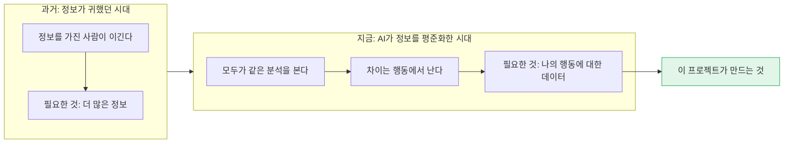

> **시장을 아는 것은 AI가 도와준다. 나를 아는 것은 아무도 대신해 주지 않는다.**
> 폭등장에서 가장 비싼 무지는 종목에 대한 무지가 아니라, 나에 대한 무지다.

**정직한 단서**: 시뮬레이션 훈련이 실제 수익을 올려준다는 것은 아직 증명된 사실이 아니다. 이 프로젝트가 약속할 수 있는 것은 수익이 아니라 **자기 행동의 가시화**이고, 효과는 습관 지표의 변화로 직접 측정해야 한다. (18.7 KPI)

---

## 2. 왜 이렇게 설계했는가 — 결정과 이유

모든 설계 결정은 하나의 기준으로 걸렀다: **"내 선택이 결과에 미친 영향이 더 선명해지는가?"**

| # | 결정 | 이유 | 버린 대안과 버린 이유 |
|---|---|---|---|
| 1 | 랭킹 없음. 계산은 기기에서, 서버는 최소한만 (15장) | 남과의 순위는 "내 선택의 영향"을 알려주지 않는다. 비교 대상은 **같은 조건의 나**여야 한다. 다만 기록 백업, 결제 확인, 콘텐츠 배포, 동의 기반 익명 집계, 운영 지표는 서버 없이는 풀리지 않는다. 그래서 **게임은 기기가 하고, 서버는 뒤에서 돕는다** | 서버 중심 구조: 비용이 사용자 수에 비례하고, 서버가 멈추면 게임이 멈추고, 민감한 기록이 기본으로 밖에 나간다. 서버 완전 배제: 기기 변경 시 기록 소실, 구독 검증 불가, 운영자가 제품이 작동하는지 알 수 없음 |
| 2 | 실제 시세 대신 가공한 파도 | ① 결과를 아는 차트는 기억으로 풀게 된다 ② 약관·재배포 위험 회피 ③ 난이도와 장면(급락, 횡보)을 의도대로 배치 가능 | 실시간 시세: 상시 서버·시세 계약 필요, 같은 장면 반복 불가. 과거 실데이터 그대로: 암기 가능, 약관 위험 |
| 3 | 종목당 파도 JSON 여러 개 | "삼성전자는 오른다"를 외우는 게 아니라 "이런 움직임에서 나는 이렇게 반응한다"를 알게 하려고. 같은 성격, 다른 전개 | 종목당 1개: 두 번째 판부터 답을 안다 |
| 4 | AI·최선 선택을 내가 고른 종목으로 제한 | 변수를 줄여야 원인이 보인다. 종목이 같으면 차이는 **타이밍**과 **비중**뿐이다 | 전 종목 자유 선택 AI: 차이가 종목 운인지 매매 실력인지 분리 불가 |
| 5 | 하루 3턴 고정 | 나와 AI의 기회 횟수가 같아야 공정하다. 시가·장중·종가는 실제 하루의 리듬과도 맞는다. 6턴은 결정 피로가 크고 판당 시간이 길다 | 실시간 틱: 반응속도 게임이 된다. 하루 1턴: 장중 흔들림(가장 감정적인 순간)을 못 겪는다 |
| 6 | 비슷한 AI = 내 기록 검색(k-NN) | "나를 이기는 AI"가 아니라 "나를 비추는 AI"가 필요하다. 내 과거 결정에서 비슷한 상황을 찾아 그대로 따라 하게 하면 설명도 가능하다 | 성향 5종 고정 수치 + 랜덤(현재 구현): 내가 아님. LLM: 호출 비용 발생, 재현 불가, 민감한 기록을 외부로 보내야 함 |
| 7 | 최선 선택 = 미리 계산한 정답 경로 | 시뮬레이션은 미래가 JSON에 있다. 정답을 계산할 수 있다는 것이 실전에 없는 시뮬레이션만의 장점 | 공격적 랜덤 AI(현재 구현): 최선이 아님 |
| 8 | 최선은 수익률이 아니라 **포착률**로 표시 | 미래를 아는 AI는 +300%가 나온다. 그 숫자는 목표가 아니라 **자**다 | 수익률 그대로 표시: 의욕을 꺾고 "어차피 불가능"으로 읽힌다 |
| 9 | "그대로 보유"를 4번째 기준선으로 | 매매를 많이 한 것이 도움이 됐는지 확인하는 유일한 방법 | 생략: 열심히 매매한 것 자체를 실력으로 착각 |
| 10 | 시드 고정, 랜덤 제거 | 같은 판을 다시 돌려 같은 결과가 나와야 "만약에"가 성립한다 | `Math.random`: 돌릴 때마다 AI 결과가 달라 비교가 무의미 |
| 11 | 결정마다 영향 금액 계산 | 곡선은 "차이가 났다"까지만 말한다. 어느 선택이 원인인지는 결정별 계산이 있어야 한다 | 최종 수익률만 비교: 무엇을 고쳐야 할지 모른다 |
| 12 | 규칙 기반 전략 6종을 같은 조건으로 함께 운용 | 전략을 설명으로 배우면 남의 이야기다. **내 종목, 내 파도**에서 돌아가는 것을 봐야 내 선택지가 된다. 규칙 기반이라 미래를 모르는 상태로 판단하므로 실전에서도 따라 할 수 있다 | 전략 설명 글·강의: 적용된 모습을 못 본다. 최선 선택만 제시: 미래를 알아야 가능해서 따라 할 수 없다 |
| 13 | 갈림길 보기: 한 턴의 매수·매도·기다림 세 갈래를 끝까지 계산 | "다른 선택을 했다면"에 대한 가장 직접적인 답. 세 갈래를 나란히 보면 선택이 방향임을 체감한다 | 최선 하나만 표시: "정답"만 알고 나머지 두 길의 모습은 모른다 |
| 14 | 다른 전략의 선택은 **내가 결정한 뒤에** 공개 (기본) | 먼저 보여주면 내 기록이 남의 판단으로 오염되고, 비슷한 AI가 나를 닮지 못한다 | 항상 먼저 공개: 편하지만 "나의 패턴"이 사라진다. 학습 모드에서만 허용 |
| 15 | 1,000만원 기준 보유 종목 최대 5개 | ① 종목당 평균 200만원 이상이어야 한 선택의 무게가 느껴진다 ② 5개를 넘으면 매 턴 판단 수가 늘어 감정 대신 피로로 결정한다 ③ 결정별 영향 분석이 읽을 수 있는 크기로 유지된다 | 무제한: 조금씩 다 사 두는 "선택 회피"가 가능해지고, 어떤 선택이 영향을 줬는지 흐려진다 |
| 16 | "다른 사람들"은 두 겹: 가상 농부 5인(기본) + 실제 사용자의 익명 분포(동의 기반, 최소 서버) | 농부 5인은 기질별 농사를 **재현 가능하게** 보여준다 (기존 코드의 성향 5종 수치, 랜덤 제거). 실제 분포는 "이 급락에서 68%가 팔았다"처럼 **내가 다수와 같았는지**를 알려준다. 둘은 답하는 질문이 다르다 | 실제 사용자만: 초기에는 표본이 없고, 재현이 안 된다. 가상만: "진짜 사람들은?"에 답하지 못한다 |
| 17 | 매매를 "농사" 언어로 다시 부른다 | 맞히기 게임의 언어(적중, 실패)는 매 턴을 시험으로 만들어 감정을 키운다. 농사의 언어(씨, 물, 수확, 휴경)는 기다림에 의미를 준다 | 기존 트레이딩 용어만 사용: 기다림이 "아무것도 안 함"으로 느껴진다 |
| 18 | 연령별 캐릭터의 삶이 자산에 따라 변한다 (집, 생활, 표정) | 가짜 돈에 무게를 주는 방법. 금액을 "삶의 변화"로 번역하면 손실이 추상적인 숫자가 아니게 된다. 나이마다 돈의 목적과 회복할 시간이 다르다는 것도 함께 배운다 | 숫자만 표시: 아프지 않아서 실전과 다르게 행동한다. 순위·배지 보상: 결과만 칭찬해 나쁜 습관을 강화한다 |
| 19 | 삶은 **자산**을 따르고, 성장(지혜)은 **과정**을 따른다 — 두 축 분리 | 운으로 번 판에 집만 커지면 "무모함 = 성공"을 가르친다. 집은 잃을 수도 있지만 지혜는 쌓이기만 한다 | 수익만으로 성장: 도박을 보상하게 된다 |
| 20 | 흔들리는 꼬리: 현재가 끝의 떨림을 시드 기반 노이즈로 표현. 다음 턴 방향과 **상관 0** | 실전에서 가장 강한 유혹을 재현하고, 그것을 따랐을 때의 결과를 통계로 돌려준다. 꼬리가 미래를 흘리면 게임이 "꼬리 읽기"가 되므로 상관을 0으로 고정한다 | 떨림 없음: 실전의 조급함이 빠진다. 미래와 상관 있는 떨림: 잘못된 교훈(꼬리를 믿어라)을 준다 |

> **변수를 줄이는 것은 기능을 줄이는 것이 아니다. 질문을 하나로 만드는 것이다.**

---

## 3. 페르소나

설계 검증용 가상 인물이다. 실제 사용자 조사 결과가 아니다.

### 3.1 요약

| | 🌱 김초롱 (27) | 🔥 박재훈 (34) | 🧊 이수진 (41) | 🧭 정민호 (52) |
|---|---|---|---|---|
| 상황 | 사회초년생, 주식 계좌만 개설 | 3년차 투자자, 1,200만원 운용 | 적금 만기 3,000만원, 예금만 해 봄 | 퇴직 준비, 10년 넘게 직접 투자 |
| 성향 | 뭘 모르는지 모름 | 추격매수 → 급락 손절 반복 | 손실 공포로 시작을 못 함 | 자기 방식에 확신 |
| 속마음 | "사도 되는 건지 모르겠다" | "내가 팔면 오른다" | "잃으면 어떡하지" | "내 감이 맞는지 한 번은 확인하고 싶다" |
| 필요한 것 | 첫 장면들을 안전하게 겪기 | 내 습관의 이름과 비용 | 최악의 장면을 미리 보기 | 감의 성적표 |
| 핵심 화면 | 그대로 보유 기준선 | 가장 비쌌던 결정 TOP 3, 습관 테이블 | 급락 파도 + 비슷한 AI | 포착률, 같은 거래 횟수 내 최선 |
| 성공 기준 | "가만히 있는 것도 선택"임을 안다 | 급락 손절 횟수가 줄어든다 | 급락 장면에서 계획대로 버틴 판이 생긴다 | 자기 방식의 강점·약점 유형을 말할 수 있다 |

### 3.2 페르소나별 감정과 금액의 위치

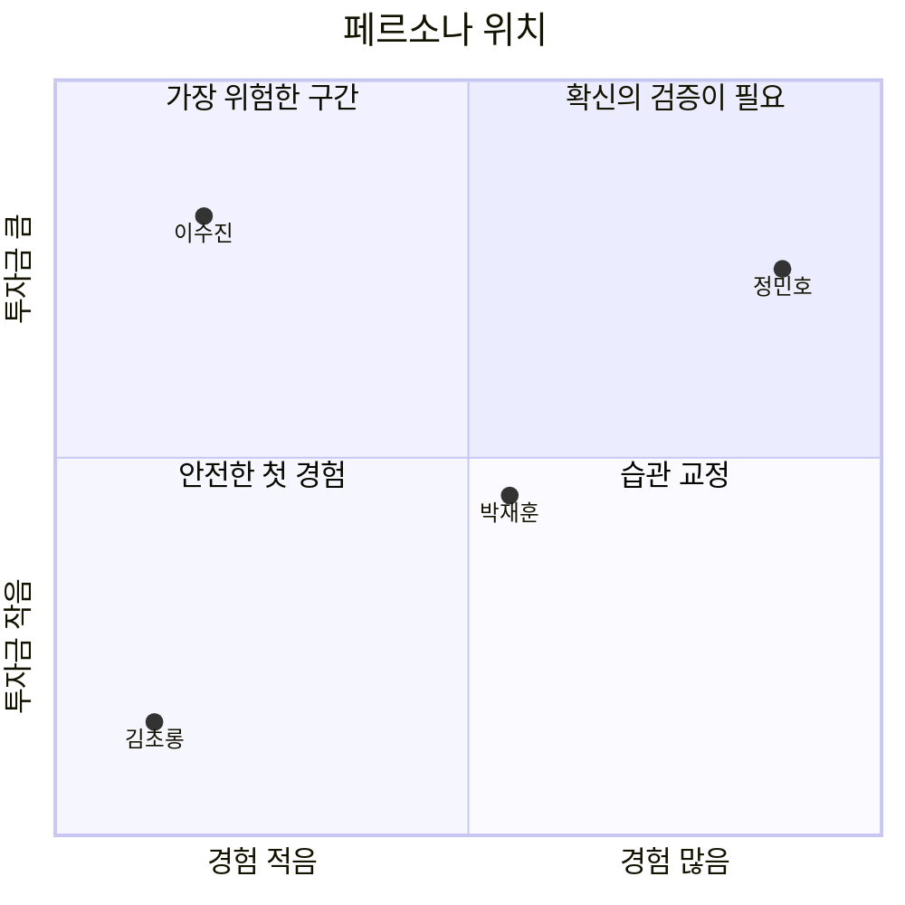

왼쪽 위(경험은 적은데 돈은 큰 구간)가 출발점의 문제의식, 즉 "1,000만원 이상에서 비현실적인 판단"이 일어나는 자리다. **이수진**이 이 기획의 1순위 페르소나이고, **박재훈**이 가장 자주 쓰게 될 페르소나다.

### 3.3 대표 페르소나 상세 — 박재훈 (34)

| 항목 | 내용 |
|---|---|
| 하루 | 출근길에 시세 확인, 점심에 커뮤니티, 퇴근 후 미국장 |
| 반복되는 장면 | 급등 뉴스 → 매수 → 다음 날 −4% → 불안 → 매도 → 이틀 뒤 반등 |
| 스스로의 해석 | "운이 없다", "세력이 나만 본다" |
| 실제 원인 (가설) | 진입이 늦고, 손절 기준이 가격이 아니라 기분 |
| 이 앱에서 처음 보는 것 | "급락 직후 매도: 23회, 평균 영향 −1.8%" |
| 그 순간의 반응 | "운이 아니었네. 23번 똑같이 했네" |

> **같은 실수를 반복하는 이유는 의지가 약해서가 아니다. 그 실수에 아직 이름이 없어서다.**

---

## 4. 유저 시나리오

### 4.1 한 판의 흐름

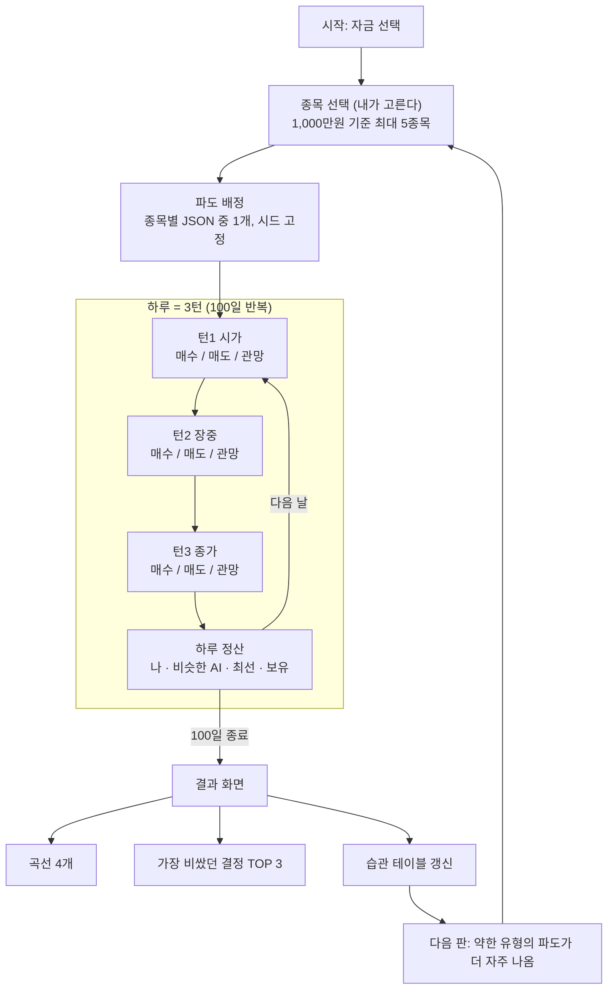

### 4.2 한 턴 안에서 일어나는 일

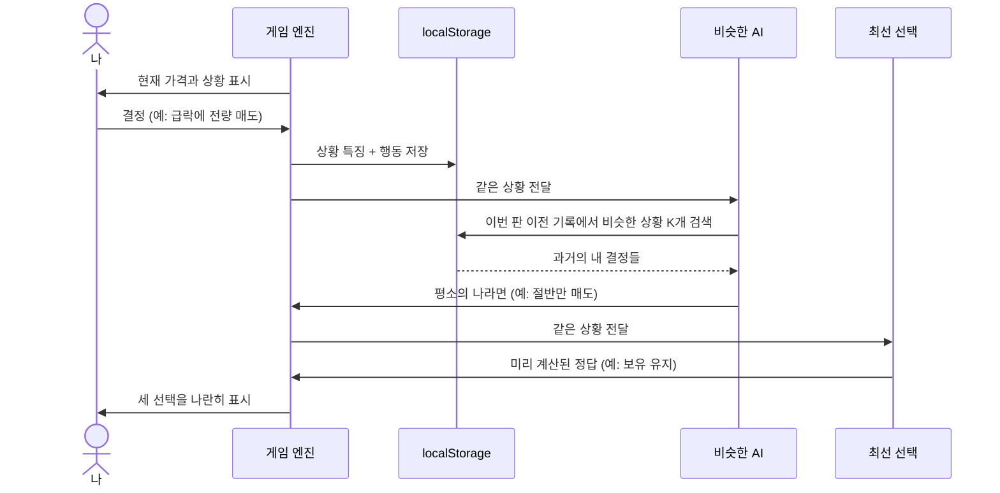

### 4.3 감정 여정 — 이수진의 첫 주

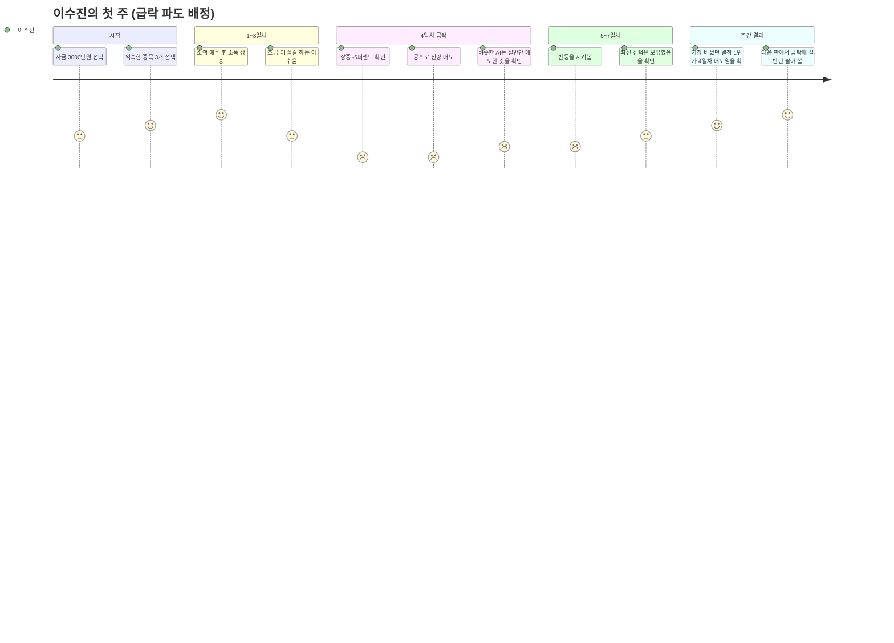

### 4.4 시나리오 3선

**시나리오 A — 이수진: "최악의 장면을 가짜 돈으로 먼저"**

| 단계 | 장면 | 시스템이 하는 일 |
|---|---|---|
| 1 | 3,000만원으로 시작, 아는 종목 3개 선택 | 종목별 파도 중 `crash_rebound` 유형 배정 |
| 2 | 4일차 턴2, −6% 급락에 전량 매도 | 결정 저장, 태그 `급락 손절` |
| 3 | 하루 정산 | 나 −5.8% / 비슷한 AI −3.1% / 최선 −0.4% / 보유 −6.0% |
| 4 | 7일차, 주가 반등 | 보유 곡선이 내 곡선을 추월 |
| 4-2 | 전략 함수 6개, 재계산 엔진 | 전략 함수에 미래 데이터를 넣으면 테스트가 실패한다. 6번째 종목 매수가 나·AI·전략 모두에서 막힌다 |
| 4-3 | 꼬리 생성기, 캐릭터·집·사건 데이터, `life` 테이블 | 꼬리 생성기에 다음 턴 가격을 넣으면 테스트가 실패한다. 1,000판 시뮬레이션에서 꼬리 적중률이 50% ± 2% 안에 든다 |
| 4-4 | 관리형 백엔드 설정, 백업·복원, 콘텐츠 목록 | 비행기 모드에서 한 판을 끝까지 할 수 있다. 새 기기에서 로그인하면 기록과 거울이 돌아온다 |
| 5 | 결과 화면 | "가장 비쌌던 결정 1위: 4일차 턴2 전량 매도 −₩1,420,000" |
| 6 | 깨달음 | "급락이 무서운 게 아니라, 급락에서 내가 하는 행동이 비쌌다" |

**시나리오 B — 박재훈: "23번 똑같이 했네"**

| 단계 | 장면 | 시스템이 하는 일 |
|---|---|---|
| 1 | 10판째 플레이 | `decisions` 테이블에 약 600건 누적 |
| 2 | 급등 종목 추격매수 | 비슷한 AI도 똑같이 추격매수 (내 기록을 따라 하므로) |
| 3 | 결과: 나 ≈ 비슷한 AI, 둘 다 보유보다 낮음 | "이번 판은 실수가 아니라 평소의 나였다"로 해석 |
| 4 | 습관 테이블 | `급등 추격매수 31회 평균 −2.1%`, `급락 손절 23회 평균 −1.8%` |
| 5 | 깨달음 | 고칠 것은 이번 판이 아니라 습관 두 개 |

**시나리오 C — 정민호: "감의 성적표"**

| 단계 | 장면 | 시스템이 하는 일 |
|---|---|---|
| 1 | 유형별로 20판 플레이 | 판마다 `regime` 과 포착률 저장 |
| 2 | 유형별 포착률 확인 | 상승 41% / 횡보 8% / 급락 후 반등 35% / 하락 −12% |
| 3 | 깨달음 | "내 방식은 추세장에서만 통한다. 횡보에서는 매매할수록 잃는다" |
| 4 | 다음 판 | 횡보 파도가 더 자주 배정됨 |

---

## 5. 종목 — 무엇을, 왜

종목 목록의 원본은 [GAME_STOCK_UNIVERSE_100.md](GAME_STOCK_UNIVERSE_100.md) 이다. 여기서는 **왜 그렇게 고르는지**만 정리한다.

### 5.1 왜 "우수기업 100개"인가

| 이유 | 설명 |
|---|---|
| 아는 이름이어야 감정이 생긴다 | 삼성전자가 −6% 되는 것과 "A기업"이 −6% 되는 것은 다르게 느껴진다. 이 앱이 훈련하려는 것은 바로 그 감정이다 |
| 실제로 사게 될 종목이다 | 초보가 실전에서 처음 사는 종목은 대부분 시가총액 상위 종목이다 |
| 데이터가 길고 깨끗하다 | 상장 기간이 길어 상승기·급락기·횡보기 구간을 모두 확보할 수 있다 |
| 100개면 섹터가 다 들어간다 | 반도체 12, 바이오 12, 금융 10, 플랫폼 10 등 12개 섹터 |

### 5.2 왜 종목에 "캐릭터"를 붙이는가

종목은 이름이 아니라 **움직이는 버릇**으로 구분된다. 내가 어떤 버릇의 종목에서 약한지 알아야 한다.

| 캐릭터 | 움직임 | 100종 중 | 여기서 드러나는 내 습관 |
|---|---|---|---|
| 🐢 블루칩 | ±1%, 완만 상승 | 24 | 지루함을 못 견디고 매매하는가 |
| 🐂 성장 | ±3%, 상승 후 조정 | 14 | 너무 일찍 파는가 (조기 익절) |
| 🎢 변동 | ±5%, 등락 반복 | 49 | 흔들릴 때 던지는가 (급락 손절) |
| 🦂 작전 | ±8%, 상승 뒤 폭락 | 6 | 급등을 쫓아가는가 (추격매수) |
| 💀 부실 | ±3%, 완만 하락 | 7 | 손실을 인정 못 하고 더 사는가 (물타기) |

매판 5종은 `블루 1 + 성장 2 + 변동 1 + 작전/부실 1` 고정 비율로 제시하고, 그 안에서 **내가 고른다**.

### 5.3 종목 → 파도 → 비교의 관계

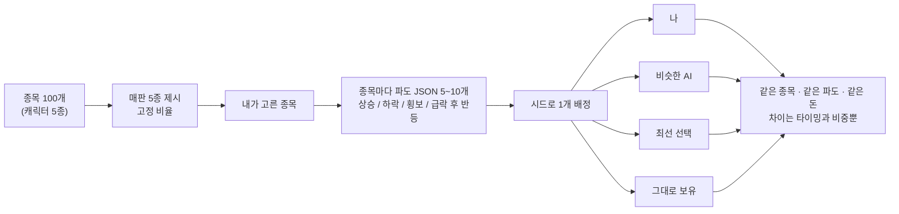

### 5.4 왜 AI도 내 종목만 쓰는가

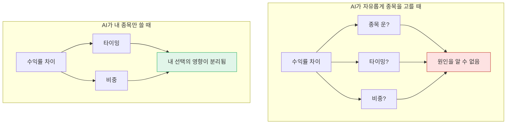

종목 선택의 영향은 AI 없이 한 줄로 따로 보여준다.
예: "내가 고른 종목을 그냥 들고 있었을 때 +8% / 제시된 5종 평균 +3%"

### 5.5 보유 종목 수 제한 — 1,000만원이면 5종목까지 (기본 규칙)

**규칙: 시작 자금 1,000만원에서는 동시에 보유하는 종목이 5개를 넘을 수 없다.**

| 항목 | 내용 |
|---|---|
| 적용 시점 | 매수 주문 시. 이미 5종목 보유 중이면 새 종목 매수 불가 (기존 보유 종목 추가 매수는 가능) |
| 6번째를 사고 싶을 때 | 보유 종목 하나를 전량 매도해야 자리가 난다 → "무엇을 포기할 것인가"가 선택이 된다 |
| 적용 대상 | 나, 비슷한 AI, 최선 선택, 전략 6종 모두 동일 |
| 화면 표시 | 보유 슬롯 5칸 (예: ●●●○○ 3/5) |

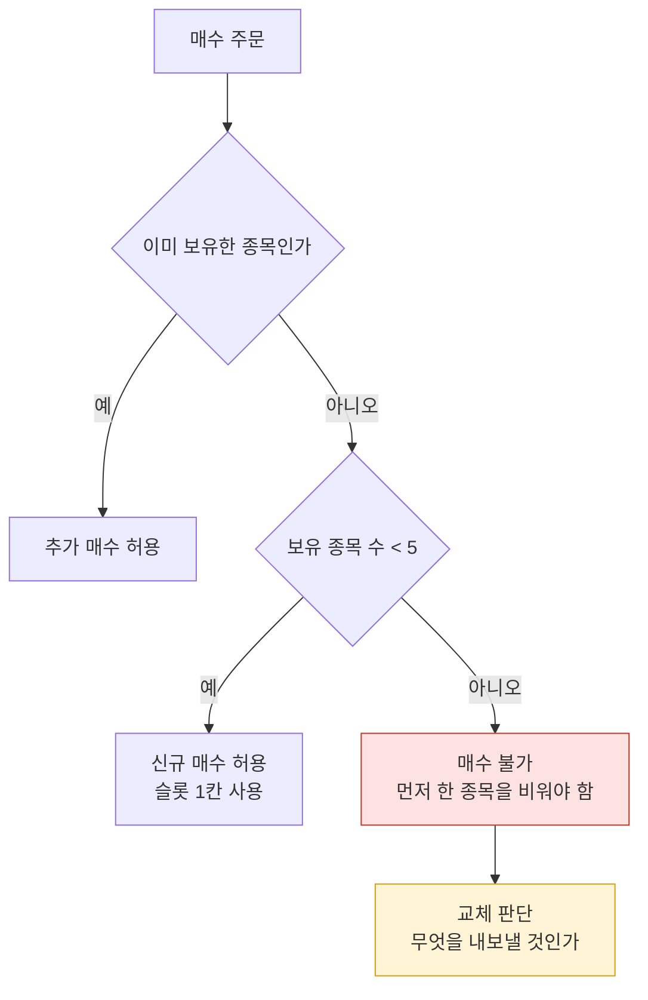

**왜 5인가**

| 보유 종목 수 | 종목당 평균 금액 (1,000만원) | 일어나는 일 |
|---|---|---|
| 1~2 | 500만~1,000만원 | 한 종목의 급락이 전부가 된다. 집중의 무게를 배운다 |
| 3~5 | 200만~333만원 | 한 선택의 무게가 느껴지면서도 비교·교체 판단이 가능하다 |
| 6~10 | 100만~167만원 | 매 턴 판단이 6~10개. 피로해져서 대충 결정한다 |
| 10 초과 | 100만원 미만 | "다 조금씩 사 두기"로 선택 자체를 피한다. 영향 분석이 의미를 잃는다 |

> **제한은 불편이 아니라 질문이다. "이것을 사려면 무엇을 놓을 것인가."**
> 실전의 돈도 언제나 한정되어 있다.

**AI와 전략들의 자금 배분 (안)**: 최선 선택과 전략 6종은 내가 고른 종목에 균등 배분(1/N)하고 종목별로 독립 운용한다. 이렇게 해야 종목별 비교가 1:1로 맞는다. 비슷한 AI만 내 과거 기록의 비중 습관을 따른다.

다른 자금 규모(500만원, 3,000만원 등)의 한도는 17장에서 정한다.

### 5.6 실명인가 가명인가

| 선택 | 장점 | 위험 |
|---|---|---|
| 실명 + "가공 파도" 표기 | 감정 몰입, 실전 연결 | 실제 주가로 오해할 수 있음. 표기 필수 |
| 가명 | 법적으로 가장 안전 | 감정이 약해져 훈련 효과 감소 |
| 블라인드 모드 (선택형) | 선입견 없이 움직임만 보고 판단하는 훈련 | 초보에게는 어렵다 |

권장: 기본은 실명 + 표기, 블라인드는 선택 모드. (최종 결정은 17장)

---

## 6. 파도(wave) 데이터

### 6.1 원본 데이터 출처 (2026-09-20 호출 확인)

| 출처 | 결과 | 비고 |
|---|---|---|
| 네이버 `api.finance.naver.com/siseJson.naver` | 정상. 일봉 시가·고가·저가·종가, 거래량, 외국인 소진율 | 비공식, 국내 종목만 |
| 네이버 `fchart.stock.naver.com/sise.nhn` | 정상. XML, 1990년부터 | 비공식, EUC-KR |
| Yahoo `query1.finance.yahoo.com/v8/finance/chart/{심볼}` | 정상. 일봉 2000년부터 | 국내(.KS/.KQ)·미국 모두 가능. 60분봉의 과거 제공 기간은 미확인 |
| Stooq CSV | 봇 검증 페이지에 막힘 | 우회하지 않고 제외 |

공식 경로 (이번에 직접 호출해 보지는 않음): 공공데이터포털 "금융위원회_주식시세정보" API, KRX 정보데이터시스템 CSV, 한국투자증권 KIS Open API, DART. 미국은 Alpha Vantage, Twelve Data 무료 구간.

**원칙**

- 브라우저에서 직접 호출하지 않는다. 개발 PC에서 스크립트로 한 번 수집해 정적 JSON으로 굽는다.
- 네이버·Yahoo는 비공식이고 약관상 재배포 제한이 있다. 출시용 원본은 공공데이터포털/KRX를 쓰고, 앱에는 **가공된 파도만** 넣는다. (법률 자문 아님. 출시 전 확인 필요)
- 화면에 "실제 흐름을 바탕으로 가공한 가상 파도"라고 표기한다.

### 6.2 생성 파이프라인

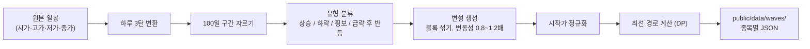

**일봉 → 3턴**

| 턴 | 값 | 의미 |
|---|---|---|
| 턴1 | 시가 | 밤사이 뉴스가 반영된 출발 |
| 턴2 | 고가·저가 중 시가–종가 직선에서 더 먼 값 | 장중 가장 크게 흔들린 순간 (감정이 가장 큰 순간) |
| 턴3 | 종가 | 하루의 결론 |

**가공 방법**

| 방법 | 설명 | 사용 |
|---|---|---|
| 구간 자르기 | 같은 종목의 서로 다른 100일 구간 | 기본 |
| 블록 섞기 | 수익률을 5~10일 단위로 잘라 순서 재배열. 변동성이 몰려 나오는 성질 유지 | 변형 수를 늘릴 때 |
| 변동성 조절 + 미세 노이즈 | 등락폭 0.8~1.2배 | 난이도 조절 |
| 상하 반전, 완전 랜덤 생성 | 실제 주식 같은 움직임이 사라짐 | 사용 안 함 |

### 6.3 생존 편향 보완

지금의 우수기업을 과거로 돌리면 대부분 오른 차트만 남는다. 그러면 "아무거나 사서 버티면 이긴다"만 배운다.

- 2020년 3월, 2022년 같은 급락 구간을 반드시 포함한다.
- 유형 4가지를 골고루 출제한다.

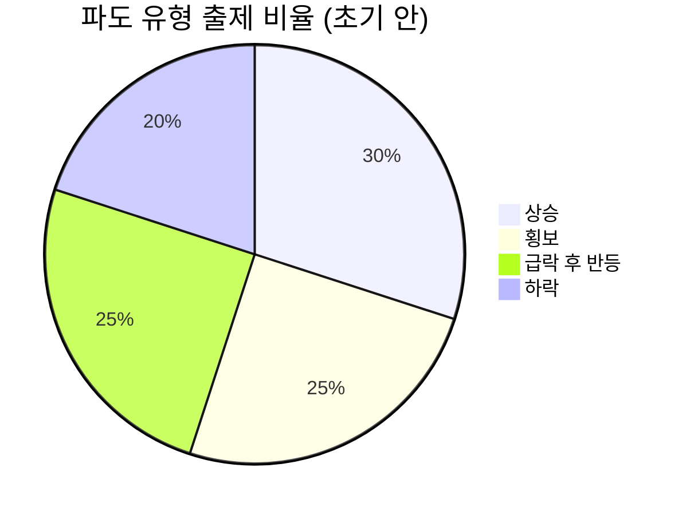

기록이 쌓이면 내 포착률이 낮은 유형의 비율을 올린다.

### 6.4 파도 JSON 스키마 (안)

위치: `public/data/waves/{stockId}/{waveId}.json` + `public/data/waves/index.json`

```json
{
  "waveId": "samsung-w03",
  "stockId": "samsung",
  "stockName": "삼성전자",
  "character": "bluechip",
  "regime": "crash_rebound",
  "difficulty": 3,
  "patternTags": ["double_bottom", "gap_down"],
  "turnsPerDay": 3,
  "days": 100,
  "initialPrice": 70000,
  "turns": [[70000, 3186439], [69800, 2854578]],
  "bestPath": [0, 1, 1, 0]
}
```

- `turns`: `[가격, 거래량]` 배열 300개. `bestPath`: 턴별 최선 포지션 (0 = 현금, 1 = 보유).
- 파도 1개 약 3KB. 100종목 × 5~10개 ≈ 3MB. 종목별 지연 로딩.
- 현재 `stock-100days-data.json` 은 6종목 596KB 를 번들에 통째로 import 하므로 이 구조로 교체한다.

### 6.5 선택 규칙

- 시드 고정: 네 곡선이 반드시 같은 파도에서 돈다.
- 게임 기록에 `waveId`, `seed` 저장 → 같은 판 재현 가능.

---

## 7. 비교 대상 4개와 차이의 해석

### 7.1 네 곡선

| 곡선 | 정의 | 구현 |
|---|---|---|
| 나 | 실제 내 매매 | — |
| 나랑 비슷한 AI | 이번 판 **이전**의 내 기록에서 비슷한 상황을 찾아 따라 함 | k-NN 검색 |
| 최선 선택 | 미래를 아는 상태의 정답 경로 | `bestPath` 재생 |
| 그대로 보유 | 첫 턴에 사서 끝까지 보유 | 계산 한 줄 |

### 7.2 차이를 읽는 법

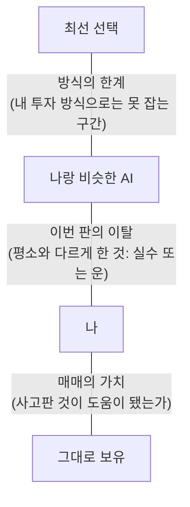

| 비교 | 결과 | 읽는 법 |
|---|---|---|
| 나 < 비슷한 AI | 평소보다 못했다 | 이번 판에 감정이 끼어들었다. TOP 3 결정을 본다 |
| 나 ≈ 비슷한 AI | 평소대로 했다 | 고칠 것은 이번 판이 아니라 습관이다. 습관 테이블을 본다 |
| 나 > 비슷한 AI | 평소보다 잘했다 | 무엇을 다르게 했는지 확인하고 반복한다 |
| 나 < 그대로 보유 | 매매가 손해였다 | 덜 움직이는 것이 이 유형에서의 답이다 |
| 포착률 낮음 | 최선과 거리가 멀다 | 유형별 포착률로 약한 장면을 찾는다 |

> **최선은 도달할 목표가 아니다. 내가 어디에 서 있는지 재는 자다.**

> **가만히 있는 것보다 못한 매매는, 노력한 만큼 잃는 일이다.**

### 7.3 나랑 비슷한 AI — 테이블 검색 (RAG 방식)

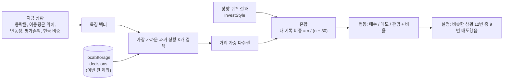

- 기록이 적은 초반에는 성향 퀴즈 결과가 대신한다. 기록 n 이 늘수록 내 기록이 지배한다.
- 이번 판 기록을 보면 나를 그대로 복사해 차이가 0이 되므로 제외한다.
- LLM·임베딩·서버 호출 없이 기기 안에서 계산하고, 같은 입력이면 항상 같은 결과가 나온다.

> **나를 이기는 AI는 많다. 필요한 것은 나를 비추는 AI다.**

### 7.4 최선 선택

- 기본: 매 턴 "다음 턴에 오르면 보유, 내리면 현금". 수수료를 넣으면 동적계획법(DP)이지만 상태 수가 적어 즉시 끝난다.
- 파도 생성 시 미리 계산해 `bestPath` 로 넣는다.
- `파도 포착률 = 내 수익 ÷ 최선 수익`
- 이후 보완: "나와 같은 거래 횟수 안에서의 최선" (최대 k회 거래 DP).

---

## 8. 전략으로 보기 — 다른 선택들의 분위기

7장이 "나를 비추는 비교"라면, 8장은 **"선택지를 넓히는 비교"** 다.
비슷한 AI는 내가 누구인지 알려주고, 전략들은 내가 **누가 될 수 있는지** 알려준다.

### 8.1 한 종목에서 매수·매도·기다림의 전략적 의미

행동은 3개지만, 내 상태(보유/미보유)와 상황(수익/손실)에 따라 의미는 달라진다.

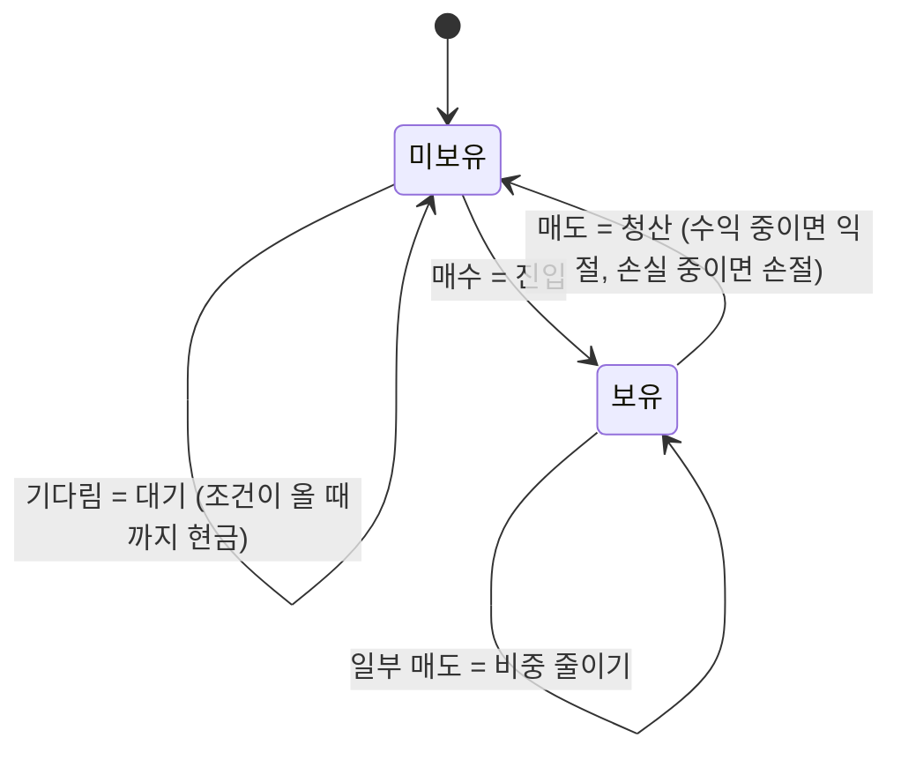

| 내 상태 | 매수 | 매도 | 기다림 |
|---|---|---|---|
| 미보유 | **진입**: 지금이 시작점이라는 판단 | (해당 없음) | **대기**: 조건이 안 왔다는 판단. 현금도 포지션이다 |
| 보유 · 수익 중 | **불타기**: 추세가 계속된다는 판단 | **익절**: 충분하다는 판단 | **수익 버티기**: 더 간다는 판단 |
| 보유 · 손실 중 | **물타기**: 내 판단이 맞고 시장이 틀렸다는 판단 | **손절**: 내 판단이 틀렸다는 인정 | **손실 버티기**: 판단인가, 회피인가 |

> **기다림에는 두 종류가 있다. 조건을 기다리는 것과, 결정을 미루는 것.**
> 화면에서는 똑같이 "관망" 버튼이지만, 결과는 정반대로 간다.

기다림을 구분하는 방법: 관망을 누를 때 (선택 사항으로) "무엇을 기다리는가"를 한 번 탭하게 한다 — `가격 조건` / `추세 확인` / `모르겠다`. `모르겠다` 관망의 누적 영향이 습관 테이블에 따로 잡힌다.

### 8.2 전략 6종 — 같은 장면, 다른 원칙

모두 **규칙 기반**이다. 미래를 모르는 상태에서 지금까지의 가격만 보고 판단하므로, 최선 선택과 달리 **실전에서 따라 할 수 있다**.
같은 시작 자금, 내가 고른 종목, 같은 파도, 최대 5종목 규칙을 똑같이 적용한다.

| 전략 | 한 줄 원칙 | 매수 조건 | 매도 조건 | 기다림의 의미 |
|---|---|---|---|---|
| 🪨 그대로 보유 | 사서 잊는다 | 첫 턴 | 없음 | 전부 |
| 🧱 분할 매수 | 시점을 나눈다 | 정해진 간격마다 같은 금액 | 없음 (종료 시) | 다음 회차 대기 |
| 🏄 추세 추종 | 오르는 것을 산다 | 이동평균 상향 돌파 | 이동평균 하향 이탈 | 추세 없음 = 현금 |
| 🎣 눌림목 (역추세) | 떨어진 것을 산다 | 단기 급락 후 과매도 | 평균 회귀 시 | 덜 떨어졌다 |
| ✂️ 손절·익절 규칙 | 숫자로 끊는다 | 진입 후 | −5% 또는 +10% 도달 | 기준 미도달 |
| 🚪 돌파 매매 | 새 고점을 산다 | 최근 N일 고점 돌파 + 거래량 | 돌파 실패 시 즉시 | 박스권 안 |

(수치는 초기 안이며 구현 시 확정한다.)

**전략과 파도 유형의 궁합** — 일반적인 경향이다. 실제 값은 파도마다 계산해서 보여준다.

| 전략 | 상승 | 횡보 | 급락 후 반등 | 하락 |
|---|---|---|---|---|
| 🪨 그대로 보유 | 강함 | 보통 | 보통 | 약함 |
| 🧱 분할 매수 | 보통 | 보통 | 강함 | 약함 |
| 🏄 추세 추종 | 강함 | 약함 (잦은 속임) | 보통 | 강함 (현금 대피) |
| 🎣 눌림목 | 보통 | 강함 | 강함 | 약함 (계속 받아냄) |
| ✂️ 손절·익절 | 보통 (일찍 내림) | 보통 | 약함 (바닥에서 끊김) | 강함 |
| 🚪 돌파 매매 | 강함 | 약함 | 보통 | 강함 (진입 안 함) |

> **모든 장에서 이기는 전략은 없다. 그래서 중요한 것은 최고의 전략이 아니라, 지금이 어떤 장인지 아는 것과 내 전략이 무엇인지 아는 것이다.**

### 8.3 갈림길 보기 — 8턴에서의 선택은 어디로 가는가

지나간 턴 아무거나 누르면, 그 턴에서 갈라지는 **세 갈래**를 보여준다.
그 턴의 선택만 바꾸고 이후 내 결정은 그대로 둔다. (바뀐 상황에서 불가능해진 주문은 가능한 만큼만 실행한다.)

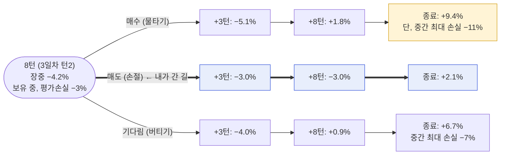

(숫자는 예시)

| 표시 항목 | 이유 |
|---|---|
| +3턴 (다음 날) | 선택 직후의 기분. 손절 직후에는 "잘 팔았다"고 느낀다 |
| +8턴 (약 3일 뒤) | 기분이 뒤집히는 지점. 단기 판단과 중기 결과가 갈린다 |
| 종료 시점 | 그 선택의 최종 가격표 |
| 중간 최대 손실 | 수익이 높은 갈래가 **견딜 수 있는 길이었는지** 함께 본다. +9.4%도 −11%를 못 버티면 내 것이 아니다 |
| 각 전략이 고른 갈래 | "추세 추종은 매도, 눌림목은 매수, 그대로 보유는 기다림" → 갈래마다 이름이 붙는다 |

> **선택은 점이 아니라 방향이다.** 8턴의 버튼 하나가 100일 뒤의 위치를 정한다.
> 그리고 가장 많이 번 길이 언제나 내가 갈 수 있었던 길은 아니다.

갈림길 보기는 **지나간 턴에만** 열린다. 아직 오지 않은 턴의 미래는 보여주지 않는다.

### 8.4 플레이 중의 분위기 — 전략 회의

매 턴, 내가 결정한 **직후** 전략 6종의 선택이 한 줄씩 펼쳐진다.

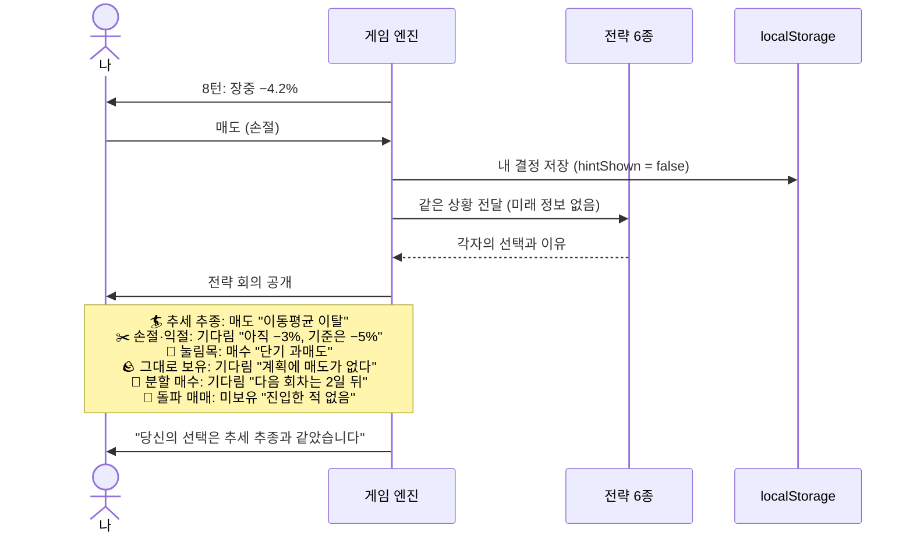

| 모드 | 전략 회의 공개 시점 | 내 기록 | 용도 |
|---|---|---|---|
| 기본 | 내가 결정한 뒤 | `hintShown = false`, 비슷한 AI 학습에 사용 | 나의 패턴을 알기 |
| 학습 | 내가 결정하기 전 | `hintShown = true`, 비슷한 AI 학습에서 제외 | 전략을 배우기 |
| 집중 | 하루 정산 때 한 번에 | `hintShown = false` | 방해 없이 몰입 |

> 먼저 묻고 나서 보여준다. **먼저 보여주면, 남는 기록은 내 판단이 아니라 남의 판단이다.**

### 8.5 나는 어떤 전략에 가까운가

| 지표 | 계산 | 예시 |
|---|---|---|
| 전략 일치율 | 내 행동이 그 전략의 행동과 같았던 턴의 비율 | 추세 추종 61%, 손절·익절 48%, 눌림목 22% |
| 이탈 지점 | 가장 가까운 전략과 다르게 행동한 턴들 | "추세 추종이 버틴 12번 중 9번, 당신은 먼저 팔았다" |
| 이탈의 비용 | 이탈한 턴들의 영향 금액 합계 | −3.4% |
| 유형별 최적 전략 | 파도 유형별로 가장 성과가 좋았던 전략 | 횡보에서는 눌림목, 당신은 횡보에서도 추세 추종 |

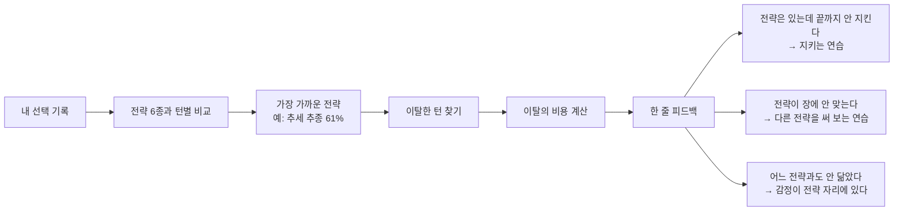

> **전략을 아는 것과 전략을 지키는 것은 다른 능력이다.** 이탈 지점은 그 사이의 거리를 보여준다.

### 8.6 구현 메모

- 전략 6종은 순수 함수 `(지금까지의 가격, 내 포지션) → 행동` 이다. 서버 호출·랜덤 없음, 기기에서 즉시 계산.
- 미래 정보를 쓰지 않는지 테스트로 보장한다 (입력에 현재 턴 이후 데이터가 들어가면 실패).
- 갈림길 보기의 세 갈래 재계산은 13장의 "만약에" 분석과 같은 엔진을 쓴다.
- 결과 화면의 곡선은 기본 4개를 유지하고, 전략 6종은 토글로 겹쳐 본다. (10개를 한 번에 그리면 읽을 수 없다)

---

## 9. 농사로 보기 — 다른 사람들은 내 종목을 어떻게 키우는가

### 9.1 세 개의 렌즈 정리

비교 대상이 늘었으므로 역할을 먼저 구분한다.

| 렌즈 | 누구 | 무엇이 다른가 | 답하는 질문 |
|---|---|---|---|
| 거울 (7장) | 나랑 비슷한 AI | 나와 같다 | 나는 평소 어떤 사람인가 |
| 원칙 (8장) | 전략 6종 | **언제** 사고파는가의 규칙 | 어떤 방법들이 있는가 |
| 사람 (9장) | 농부 5인 | **얼마나, 얼마 동안, 어디까지 견디며** 하는가의 기질 | 같은 종목을 다른 사람은 어떻게 키우는가 |
| 자 (7장) | 최선 선택 | 미래를 안다 | 최대치는 어디인가 |

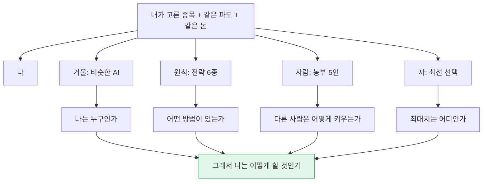

화면에서는 기본으로 거울과 자만 보이고, 원칙과 사람은 탭으로 연다.

### 9.2 농사의 언어

| 농사 | 투자 행동 | 이 말이 바꾸는 것 |
|---|---|---|
| 밭 고르기 | 종목 선택 (최대 5밭) | 밭은 한정되어 있다. 아무 데나 심지 않는다 |
| 씨 뿌리기 | 첫 매수 | 한 번에 다 뿌릴 것인가, 나눠 뿌릴 것인가 |
| 물 주기 | 추가 매수 | 자라는 것에 주는가(불타기), 시드는 것에 주는가(물타기) |
| 솎아내기 | 일부 매도 | 전부 아니면 전무가 아니다 |
| 잡초 뽑기 | 손절 | 실패가 아니라 밭 관리다 |
| 계절 견디기 | 보유하며 기다림 | 아무것도 안 하는 것이 아니라, 자라는 시간을 주는 것이다 |
| 수확 | 익절 | 첫 열매에 거둘 것인가, 다 익을 때까지 둘 것인가 |
| 휴경 | 현금 보유 | 쉬는 밭도 농사의 일부다 |
| 농사 일지 | `decisions` 기록 | 내년 농사는 올해 일지에서 나온다 |

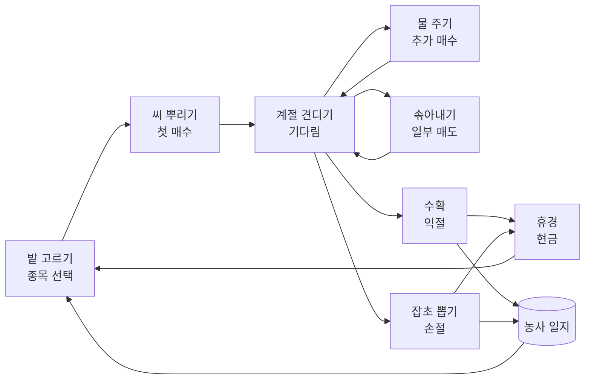

> **씨를 뿌린 다음 날 땅을 파 보는 농부는 없다.**
> 그런데 매수한 다음 턴에 −2%를 보고 파는 것은 정확히 그 일이다.

### 9.3 농부 5인

기존 코드 `useAICompetitor.ts` 의 `STRATEGY_PARAMS` 수치를 그대로 쓴다. 바뀌는 것은 두 가지다: **랜덤 제거**(같은 조건이면 같은 결과), **내 종목에서만 농사**(5밭 규칙 동일).

| 농부 | 코드상 성향 | 기질 | 투입 비율 | 손절 | 익절 | 한 밭 최대 | 남기는 현금 |
|---|---|---|---|---|---|---|---|
| 🌳 과수원 농부 | `conservative` | 나무를 심고 몇 해를 본다. 웬만해선 움직이지 않는다 | 30% | −3% | +8% | 15% | 50% |
| 🌾 벼농사 농부 | `stable` | 절기대로 한다. 정해진 때에 정해진 만큼 | 50% | −5% | +10% | 20% | 35% |
| 🥬 텃밭 농부 | `balanced` | 이것저것 조금씩, 상황 봐서 | 60% | −7% | +12% | 25% | 25% |
| 🌶️ 하우스 농부 | `aggressive` | 회전이 빠르다. 자주 심고 자주 거둔다 | 70% | −8% | +15% | 35% | 15% |
| 🎰 한철 농부 | `ultra_aggressive` | 올해 뜨는 작물 하나에 밭을 다 건다 | 90% | −10% | +20% | 50% | 5% |

농부 = 진입 규칙(8장의 전략 중 기질에 맞는 것) + 위 표의 비중·손절·익절·현금 기질. 순수 함수이고 미래 정보를 쓰지 않는다.

### 9.4 농사 달력 — 내 종목 하나를 다섯 사람이 키우면

종목 하나를 고르면, 같은 100일 동안 각자가 언제 씨를 뿌리고 언제 거뒀는지를 달력으로 보여준다.

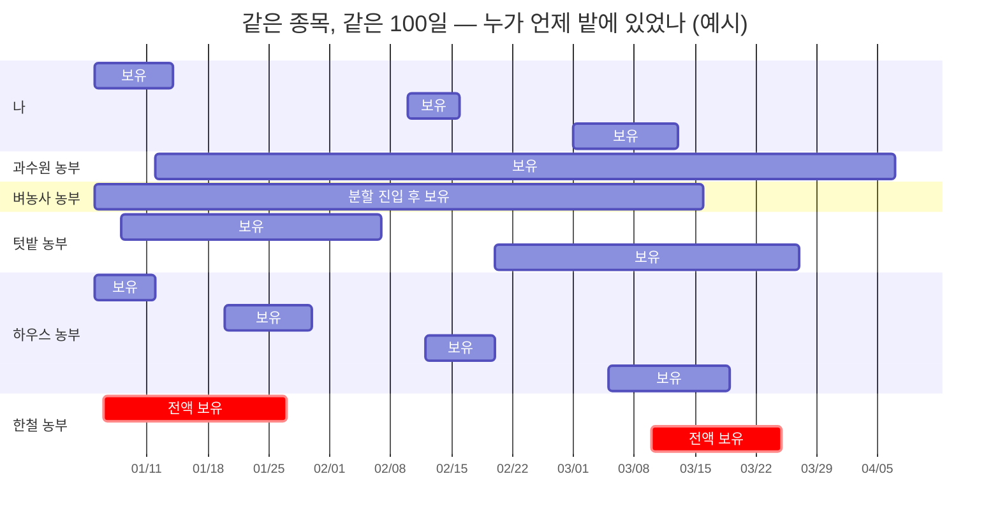

달력 아래에 수확 비교표가 붙는다 (숫자는 예시).

| | 수확 (수익률) | 가장 힘들었던 순간 (최대 손실) | 밭에 있던 날 | 거래 횟수 | 마음고생 일수 (평가손실 상태였던 날) |
|---|---|---|---|---|---|
| 나 | +2.1% | −6% | 27일 | 14회 | 19일 |
| 🌳 과수원 | +7.8% | −4% | 85일 | 2회 | 31일 |
| 🌾 벼농사 | +6.2% | −5% | 70일 | 6회 | 24일 |
| 🥬 텃밭 | +4.0% | −7% | 65일 | 8회 | 28일 |
| 🌶️ 하우스 | +1.2% | −8% | 39일 | 22회 | 17일 |
| 🎰 한철 | +11.5% | −19% | 36일 | 5회 | 22일 |

이 표가 보여주려는 것은 순위가 아니다.

- **한철 농부가 가장 많이 거뒀지만 −19%를 견뎠다.** 나는 −6%에서 팔았던 사람이다. 그 길은 내 길이 아니다.
- **과수원 농부는 마음고생 일수가 가장 길다.** 오래 들고 있다는 것은 오래 불안하다는 뜻이다. 장기 보유는 쉬운 길이 아니다.
- **하우스 농부는 나와 가장 닮았고, 거래가 가장 많고, 수확이 가장 적다.**

> **남의 수확을 부러워하기 전에, 그 사람이 견딘 겨울을 먼저 본다.**
> 견딜 수 없는 전략은 아무리 수익이 높아도 내 전략이 아니다.

### 9.5 "나와 가장 닮은 농부" 그리고 "배울 만한 농부"

| 지표 | 계산 | 용도 |
|---|---|---|
| 닮은 농부 | 보유 기간, 거래 횟수, 평균 비중, 손절 지점이 가장 가까운 농부 | "당신은 하우스 농부에 가깝습니다" |
| 배울 만한 농부 | 내가 **실제로 견딘 최대 손실 범위 안에서** 수확이 가장 좋은 농부 | 따라 할 수 있는 다음 단계만 제시 |
| 한 가지 차이 | 닮은 농부와 배울 만한 농부 사이에서 가장 크게 다른 기질 하나 | "차이는 하나: 익절 기준 +3% 대 +10%" |

배울 만한 농부를 **견딜 수 있는 범위 안에서** 고르는 것이 핵심이다. −6%에서 파는 사람에게 −19%를 견디는 농부를 보여주면 좌절이나 무모함만 남는다.

### 9.6 실제 다른 사람들은? — 익명 분포 (최소 서버)

농부 5인은 "기질이 다르면 어떻게 다른가"에 답한다. 하지만 **"진짜 사람들은 이 순간 어떻게 했나"** 는 실제 기록이 있어야 답할 수 있다. 이것이 서버가 필요한 이유 중 하나다 (15장).

| 겹 | "다른 사람들"의 정체 | 답하는 질문 | 서버 |
|---|---|---|---|
| 기본 | 가상 농부 5인 + 전략 6종 | 기질과 원칙이 다르면 어떻게 다른가 | 불필요 (기기에서 계산) |
| 확장 | 같은 파도를 플레이한 실제 사용자의 **익명 분포** | 나는 다수와 같았는가, 달랐는가 | 최소 서버 (집계 전용) |
| 선택 | 친구와 같은 `waveId`·`seed` 로 플레이 후 나란히 복기 | 아는 사람과 나는 어떻게 다른가 | 공유 링크 (서버) 또는 기록 파일 (서버 없이) |

```mermaid
sequenceDiagram
    actor U as 나
    participant G as 게임 (기기)
    participant S as 최소 서버

    Note over U,G: 한 판은 서버 없이 끝까지 진행된다
    U->>G: 100일 플레이 종료
    G->>G: 결과 계산 (거울, 전략, 농부, 최선)
    alt 익명 집계에 동의한 경우
        G->>S: 판 요약 전송 (파도 ID, 턴별 행동, 계정 정보 없음)
        S-->>G: 이 파도의 턴별 분포
        G->>U: "8턴 급락에서 68%가 팔았습니다. 당신도 그중 하나였습니다"
    else 동의하지 않은 경우
        G->>U: 농부 5인과 전략만 표시
    end
```

| 규칙 | 이유 |
|---|---|
| 분포는 **내가 결정한 뒤**, 판이 끝난 뒤에만 보여준다 | 다수의 선택이 힌트가 되면 내 기록이 오염된다 (결정 14번과 같은 원칙) |
| 순위가 아니라 **분포**만 보여준다 | "몇 등"이 아니라 "나는 다수와 같았나"가 질문이다 |
| 표본이 일정 수(안: 30명) 미만이면 표시하지 않는다 | 소수 표본은 의미가 없고, 개인을 추정할 여지를 없앤다 |
| 계정과 분리해 보낸다 | 집계 테이블에서 개인을 되짚을 수 없게 한다 |

> **다수가 판 자리에서 나도 팔았다는 것을 아는 것만으로도, 다음 급락에서 한 번 더 생각하게 된다.**
> 군중 속에 있을 때는 군중이 보이지 않는다.

---

## 10. 캐릭터와 삶 — 숫자 대신 한 사람이 흔들린다

### 10.1 넣을 것인가: 넣는다, 단 두 가지 조건으로

| 질문 | 답 |
|---|---|
| 몰입도를 높이는가 | 그렇다. 그리고 몰입보다 중요한 효과가 있다: **가짜 돈에 무게가 생긴다.** 19장의 가장 큰 한계에 대한 가장 직접적인 대응이다 |
| 위험은 없는가 | 있다. 집이 커지는 재미가 "수익 = 성공"을 가르치면, 운 좋은 몰빵이 가장 큰 보상을 받는다. 이 기획의 목적(행동을 바꾼다)과 정면으로 충돌한다 |
| 조건 ① | **두 축을 분리한다.** 삶(집, 생활)은 자산을 따르고, 성장(지혜)은 과정을 따른다 (10.4) |
| 조건 ② | **가난을 벌이나 조롱으로 그리지 않는다.** 좁아진 집에서도 캐릭터는 품위를 지킨다. 보여주려는 것은 비참함이 아니라 **선택의 결과가 삶에 닿는 거리**다 |

> **계좌의 숫자는 잊힌다. 이삿짐을 싸던 날은 잊히지 않는다.**

### 10.2 연령별 캐릭터 5인

나이가 다르면 같은 −10%의 뜻이 다르다. **회복할 시간**과 **돈의 목적**이 다르기 때문이다.

| | 🎒 스물여섯 한결 | 💍 서른넷 도윤·서아 | 🏫 마흔셋 정우 | 🧳 쉰다섯 미경 | 🌿 예순일곱 영수 |
|---|---|---|---|---|---|
| 삶의 장면 | 첫 직장 2년차, 월세 원룸 | 신혼, 전세 만기 2년 남음 | 초등생 둘, 대출 있는 아파트 | 은퇴 10년 전, 부모 부양 | 은퇴, 연금 생활 |
| 시작 자금 | 500만원 | 1,000만원 | 3,000만원 | 5,000만원 | 1억원 (퇴직금 일부) |
| 매달 들어오는 씨앗 | +50만원 | +80만원 | +100만원 | +150만원 | 없음. 매달 −100만원 생활비 인출 |
| 이 돈의 목적 | 종잣돈 만들기 | 전세 보증금 증액분 | 아이 교육비 | 노후 자금 | 남은 삶의 생활비 |
| 회복할 시간 | 아주 길다 | 길다 | 보통 | 짧다 | 거의 없다 |
| −10%의 의미 | 두 달 저축 | 전세 연장 차질 | 학원 하나 | 은퇴 1년 연기 | 생활비 10개월 |
| 배우는 것 | 실수는 일찍, 작게 | 기한이 있는 돈의 무게 | 지키는 것도 실력 | 위험을 줄여 가는 법 | 인출하면서 버티는 법 |
| 보유 종목 한도 | 3 (안) | **5 (확정)** | 7 (안) | 7 (안) | 7 (안) |

(시작 자금·월 입금·한도는 1,000만원 = 5종목만 확정이고 나머지는 초기 안이다. 17장에서 정한다.)

3장의 페르소나와의 연결: 사용자는 자기 나이의 캐릭터로 시작하도록 권하되, **다른 나이로도 플레이할 수 있다.** 서른넷이 예순일곱의 돈을 굴려 보는 경험은 부모의 퇴직금을 이해하는 가장 빠른 길이다.

```mermaid
flowchart LR
    A20["🎒 26세<br/>시간이 자산"] --> A30["💍 34세<br/>기한이 생김"]
    A30 --> A40["🏫 43세<br/>지킬 것이 생김"]
    A40 --> A50["🧳 55세<br/>위험을 줄임"]
    A50 --> A60["🌿 67세<br/>꺼내 쓰며 버팀"]
    A20 -.- N1(["잃어도 다시 번다"])
    A60 -.- N2(["잃으면 다시 못 번다"])
    style N1 fill:#e1f5e9,stroke:#27ae60
    style N2 fill:#fde2e2,stroke:#c0392b
```

> **같은 −10%가 스물여섯에게는 수업료이고, 예순일곱에게는 생활비 열 달이다.**
> 위험을 감당할 수 있는 크기는 성격이 아니라 남은 시간이 정한다.

### 10.3 삶의 단계 — 집이 자라고, 줄어든다

한 판(100일)은 **한 계절**이다. 캐릭터의 자산은 판과 판 사이에 이어진다 (캠페인). 집은 한 턴에 바뀌지 않고, 계절이 끝날 때 바뀐다.

| 단계 | 집 | 생활의 표시 | 기준 (시작 자금 대비, 안) |
|---|---|---|---|
| 1 | 고시원 | 컵라면, 접이식 책상 | 50% 미만 |
| 2 | 반지하 원룸 | 작은 창, 빨래 건조대 | 50~80% |
| 3 | 원룸 (시작) | 화분 하나 | 80~120% |
| 4 | 투룸 빌라 | 식탁, 책장 | 120~160% |
| 5 | 전세 아파트 | 소파, 가족사진 | 160~220% |
| 6 | 내 집 | 베란다 정원 | 220~300% |
| 7 | 마당 있는 집 | 나무 한 그루 (9장의 과수원) | 300% 이상 |

시작 단계는 캐릭터마다 다르다 (26세는 3단계, 43세는 5단계에서 시작). **올라가는 것도, 내려가는 것도 겪는다.**

```mermaid
stateDiagram-v2
    direction LR
    [*] --> 시작집
    시작집 --> 넓은집: 계절 종료, 자산 기준 넘음
    넓은집 --> 더넓은집: 계절 종료, 자산 기준 넘음
    더넓은집 --> 넓은집: 자산 기준 아래로
    넓은집 --> 시작집: 자산 기준 아래로
    시작집 --> 좁은집: 자산 기준 아래로
    좁은집 --> 시작집: 회복
    좁은집 --> 고시원: 자산 기준 아래로
    고시원 --> 좁은집: 회복
```

**하루 단위의 작은 변화 (턴마다)**: 집은 그대로지만 표정, 식탁 위의 음식, 창밖 날씨, 혼잣말이 바뀐다.

| 상황 | 캐릭터의 한마디 (예) |
|---|---|
| 급락 중 보유 | "…오늘은 앱 그만 볼까." |
| 급락에 전량 매도 직후 | "후, 일단 마음은 편하네." → (+8턴 뒤 반등 시) "아…" |
| 5일째 기다림 | "밭은 가만히 있어도 자란다고 했지." |
| 추격매수 직후 | "이번엔 다르겠지?" |
| 이사 (하향) | "짐이 줄어드니 생각도 줄어드네. 다시 하면 되지." |
| 이사 (상향) | "여기 창이 크다. 근데 이게 실력이었나, 운이었나." |

**삶의 사건 (계절마다 1~2개)**: 나이에 맞는 지출 사건이 돈을 강제로 꺼내 간다.

| 캐릭터 | 사건 예 | 가르치는 것 |
|---|---|---|
| 26세 | 노트북 고장 −120만원 | 비상금 없이 전액 투자하면 저점에서 팔게 된다 |
| 34세 | 전세 만기, 보증금 +2,000만원 증액 | 기한 있는 돈은 주식에 두면 안 된다 |
| 43세 | 학원비 인상, 자동차 수리 | 현금 비중의 의미 |
| 55세 | 부모님 병원비 | 하필 급락장에 돈이 필요하다 |
| 67세 | 매달 생활비 인출 | 하락장에서 꺼내 쓰면 회복이 안 된다 (인출 순서의 위험) |

> **돈이 필요한 날은 시장이 좋은 날을 기다려 주지 않는다.**

### 10.4 두 개의 축 — 삶과 지혜

```mermaid
quadrantChart
    title 삶과 지혜의 두 축
    x-axis "과정이 나쁨" --> "과정이 좋음"
    y-axis "자산 줄어듦" --> "자산 늘어남"
    quadrant-1 "실력으로 번 계절"
    quadrant-2 "운으로 번 계절 (가장 위험)"
    quadrant-3 "대가를 치른 계절"
    quadrant-4 "옳게 하고 잃은 계절 (가장 값짐)"
```

| 축 | 무엇을 따르는가 | 어떻게 보이는가 | 줄어드는가 |
|---|---|---|---|
| 삶 (집, 생활) | 자산 | 집 단계, 가구, 식탁 | 줄어든다 |
| 지혜 (성장) | 과정: 습관 비용 감소, 전략 이탈 감소, 매매하지 않고 기다린 좋은 판단, 5밭 규칙 안에서의 교체 판단 | 책장의 책, 농사 일지 두께, 캐릭터의 눈빛·호칭 (새내기 → 일꾼 → 농부 → 어른 농부) | **줄지 않는다** |

| 계절 결과 | 집 | 지혜 | 화면의 메시지 |
|---|---|---|---|
| 과정 좋음 + 벌었음 | ↑ | ↑ | "이 집은 당신이 지은 집입니다." |
| 과정 나쁨 + 벌었음 | ↑ | — | "집은 커졌지만, 같은 방식이면 다음 계절에 돌려줘야 할 수 있습니다." + 가장 위험했던 결정 TOP 3 |
| 과정 좋음 + 잃었음 | ↓ | ↑ | "옳은 선택이 늘 보답받지는 않습니다. 책장에 책이 한 권 늘었습니다." |
| 과정 나쁨 + 잃었음 | ↓ | — | "가장 비쌌던 결정 TOP 3를 봅시다." |

> **집은 시장이 빼앗아 갈 수 있다. 지혜는 빼앗아 가지 못한다.**
> 그래서 고시원으로 내려간 캐릭터의 책장에도 책은 그대로 꽂혀 있다.

### 10.5 다른 길들의 집

계절이 끝나면 **같은 캐릭터가 다른 길을 갔을 때의 집**을 나란히 보여준다.

```mermaid
flowchart LR
    SEASON["한 계절 종료"] --> H1["나의 집<br/>원룸"]
    SEASON --> H2["거울(비슷한 AI)의 집<br/>원룸"]
    SEASON --> H3["그대로 보유의 집<br/>투룸 빌라"]
    SEASON --> H4["🌳 과수원 농부의 집<br/>투룸 빌라"]
    SEASON --> H5["🎰 한철 농부의 집<br/>고시원 (지난 계절엔 아파트)"]
```

곡선 4개가 말하던 것을 집 4채가 말한다. 그래프를 못 읽는 사람도 집은 읽는다.

### 10.6 구현 범위

| 항목 | 방식 | 1차 범위 |
|---|---|---|
| 캐릭터·집 그림 | 정적 이미지 또는 SVG, `data/characters.json` 확장 (기존 파일 있음) | 캐릭터 5 × 표정 4, 집 7단계 |
| 삶의 상태 | 기기의 `life` 테이블 (로그인 시 서버에 백업) | 자산, 집 단계, 지혜 단계, 계절 수 |
| 사건 | `data/life-events.json`, 시드로 선택 | 캐릭터당 3개 |
| 한마디 | 상황 태그 → 문장 표 (JSON) | 상황 12개 × 캐릭터 5 |

---

## 11. 흔들리는 꼬리 — 손가락을 믿지 말라

### 11.1 무엇을 표현하는가

차트의 맨 끝, 현재가는 가만히 있지 않는다. 위로 툭 치고, 아래로 툭 떨어지고, 파르르 떤다.
실전에서 사람은 분석이 아니라 **이 떨림을 보고** 버튼을 누른다. "지금 막 올라가는 것 같아서."

> 달을 가리키면 달을 봐야지, 손가락을 보아서는 안 된다.
> **꼬리는 손가락이다.** 방향을 가리키는 것처럼 보이지만, 그것은 방향이 아니라 떨림이다.

이 기능의 목적은 꼬리를 읽는 법을 가르치는 것이 아니다. **꼬리가 아무것도 가리키지 않는다는 것을 자기 기록으로 확인하게 하는 것**이다.

### 11.2 동작

내가 결정을 고민하는 동안, 차트 끝의 현재가가 현재 턴 가격 주변에서 흔들린다.

```mermaid
sequenceDiagram
    actor U as 나
    participant C as 차트
    participant T as 꼬리 생성기 (시드)
    participant L as localStorage

    C->>U: 8턴 가격 표시 (확정값)
    loop 내가 결정할 때까지
        T->>C: 다음 떨림 (현재가 ± 흔들림)
        C->>U: 꼬리가 위로 툭, 아래로 툭
    end
    U->>C: 매수 (꼬리가 위로 칠 때 누름)
    C->>L: 결정 + 누른 순간의 꼬리 방향 + 고민한 시간 저장
    C->>U: 9턴 가격 공개 (꼬리와 무관하게 이미 정해져 있던 값)
```

**꼬리의 몸짓 5가지** — 시드로 무작위 선택되며, 종목 캐릭터(5.2)에 따라 크기가 다르다 (블루칩은 잔잔하게, 작전주는 거칠게).

| 몸짓 | 모양 | 사람이 읽는 (잘못된) 의미 |
|---|---|---|
| ⤴ 위로 치기 | 짧게 솟고 그 근처에서 머묾 | "간다, 지금 사야 해" |
| ⤵ 아래로 치기 | 짧게 꺾이고 머묾 | "무너진다, 지금 팔아야 해" |
| 〰 떨림 | 위아래 잔진동 | "불안하다" |
| ↗↘ 속임 | 위로 쳤다가 되돌림 (또는 반대) | "어? 어?" |
| ⎯ 고요 | 거의 안 움직임 | "지루하다, 뭐라도 하자" |

### 11.3 절대 규칙: 꼬리는 미래를 흘리지 않는다

| 규칙 | 이유 |
|---|---|
| 꼬리의 방향과 다음 턴의 방향은 **상관 0** 으로 생성한다 (다음 턴 가격을 입력으로 쓰지 않음) | 꼬리가 힌트가 되면 게임이 "꼬리 읽기"가 되고, 실전에서 가장 해로운 습관을 훈련시키게 된다 |
| 체결 가격은 꼬리가 아니라 **턴의 확정 가격** | 누르는 타이밍으로 유불리가 생기면 반응속도 게임이 된다 |
| 시드 고정 (`seed + 턴 번호`) | 같은 판을 다시 열면 같은 꼬리가 나온다. 복기 가능 |
| 거울·전략·농부·최선은 꼬리를 보지 않는다 | 꼬리에 흔들리는 것은 사람뿐이다. 그 차이가 곧 측정값이다 |
| 끌 수 있다 (집중 모드) | 꼬리 없이 했을 때와 있을 때의 내 성과 차이도 하나의 데이터다 |

```mermaid
flowchart TD
    SEED["시드 + 턴 번호"] --> GEN["꼬리 생성<br/>몸짓 선택 + 평균 회귀 노이즈"]
    VOL["종목 캐릭터의 변동성"] --> GEN
    NEXT["다음 턴 가격"] -. "연결 없음 (테스트로 보장)" .-x GEN
    GEN --> DRAW["차트 끝에 그리기"]
    DRAW --> EYE["내 눈"]
    EYE --> ACT["내 결정"]
    ACT --> LOG["기록: 꼬리 방향, 내 행동, 고민 시간"]
    style NEXT fill:#fde2e2,stroke:#c0392b
```

### 11.4 돌려주는 것 — 꼬리 추종 통계

| 지표 | 계산 | 예시 |
|---|---|---|
| 꼬리 추종률 | 꼬리가 위일 때 매수 + 아래일 때 매도한 비율 | 71% |
| 꼬리의 적중률 | 꼬리 방향과 다음 턴 방향이 같았던 비율 | 49% (설계상 50% 근처) |
| 꼬리를 따른 결정의 평균 영향 | 12장의 `impact` 평균 | −1.3% |
| 꼬리를 거스른·무시한 결정의 평균 영향 | 〃 | +0.2% |
| 고민 시간과 결과 | 3초 안에 누른 결정 대 10초 이상 본 결정 | 빠른 결정일수록 꼬리 추종률이 높다 |

결과 화면의 한 줄:

> "당신은 71%의 결정에서 꼬리가 가리키는 쪽으로 움직였습니다. 꼬리가 맞은 것은 49%였습니다. **동전이 가리키는 쪽으로 71% 움직인 것과 같습니다.**"

새 습관 태그 `꼬리 추종` 이 12장의 습관 테이블에 추가된다.

### 11.5 캐릭터와 꼬리가 만나는 곳

꼬리가 거칠게 아래로 칠 때 10장의 캐릭터가 식은땀을 흘린다. 위로 칠 때는 눈이 커진다.
지혜 단계가 오르면 **캐릭터가 꼬리에 덜 반응한다.** 어른 농부는 꼬리가 쳐도 차를 마신다.
사용자는 자기 캐릭터의 침착함이 늘어 가는 것을 보면서, 그것이 자기 자신의 변화임을 안다.

> **흔들리는 것은 가격이 아니라 가격의 끝이다. 흔들리는 것은 시장이 아니라 시장을 보는 나다.**

---

## 12. 기록 설계 — 기기 저장소와 백업

```mermaid
erDiagram
    GAMES ||--o{ DECISIONS : "한 판에 여러 결정"
    DECISIONS }o--|| HABITS : "태그별로 누적"

    GAMES {
        string gameId
        string waveIds
        number seed
        string stockIds
        number startCash
        number myReturn
        number similarReturn
        number bestReturn
        number holdReturn
        number captureRate
        string regime
        number maxHoldings
        string strategyReturns
        string nearestStrategy
    }
    DECISIONS {
        string gameId
        string stockId
        number day
        number turn
        number ret1
        number ret3
        number maGap
        number vol
        number posPnl
        number cashRatio
        string action
        number sizeRatio
        string tag
        number impact
        boolean hintShown
        string tailDir
        number decisionMs
        string waitReason
        string strategyMatch
    }
    HABITS {
        string tag
        number count
        number impactSum
        number avgImpactPct
    }
```

| 테이블 | 역할 | 용량 |
|---|---|---|
| `decisions` | 비슷한 AI의 검색 대상이자 습관 테이블의 원천 | 한 줄 약 100바이트. 최근 2,000건 ≈ 0.2MB |
| `games` | 판별 결과, 유형별 포착률 | 판당 약 300바이트 |
| `habits` | 습관별 누적 비용 | 태그 5~10개, 무시할 수준 |
| `life` | 캐릭터별 자산, 집 단계, 지혜 단계, 계절 수, 겪은 사건 (10장) | 캐릭터당 1KB 미만 |

localStorage 한도 5MB 대비 여유가 크다. Expo 는 AsyncStorage 로 같은 구조를 쓴다.

**기기가 원본이고 서버는 백업이다.** 로그인한 사용자는 판이 끝날 때 변경분이 본인 계정에 백업된다 (15.4). 거울(k-NN)은 언제나 기기의 기록을 읽으므로 네트워크가 없어도 동작한다. 최근 2,000건 제한은 기기에만 적용하고, 서버 백업에는 전체를 보관해 장기 습관 리포트에 쓴다.

**습관 태그**

| 태그 | 조건 (예) | 드러나는 감정 |
|---|---|---|
| 급등 추격매수 | `ret3` 가 크게 양수인데 매수 | 놓칠까 봐 두려움 |
| 급락 손절 | `ret1` 이 크게 음수인데 매도 | 더 잃을까 봐 두려움 |
| 조기 익절 | `posPnl` +3% 이내에서 매도 | 번 것을 뺏길까 봐 두려움 |
| 물타기 | `posPnl` 음수인데 추가 매수 | 틀렸음을 인정하기 싫음 |
| 꼬리 추종 | 꼬리가 위일 때 매수, 아래일 때 매도 (11장) | 지금 아니면 늦는다는 조급함 |
| 관망 | skip | — |

> **다섯 가지 습관의 뿌리는 모두 두려움이다. 이름이 다를 뿐이다.**

---

## 13. 결정별 "만약에" 분석

출발점의 질문("다른 선택을 했다면 어떻게 됐을까")에 직접 답하는 부분이다.

```mermaid
flowchart TD
    D["내 결정 N개"] --> LOOP["결정 i 를 하나 고른다"]
    LOOP --> SWAP["그 턴만 최선 행동으로 바꾼다<br/>나머지 결정은 그대로"]
    SWAP --> RUN["끝까지 다시 계산"]
    RUN --> DIFF["최종 금액 차이 = impact i"]
    DIFF --> NEXT{"남은 결정?"}
    NEXT -- "있음" --> LOOP
    NEXT -- "없음" --> RANK["impact 큰 순으로 정렬"]
    RANK --> TOP["가장 비쌌던 결정 TOP 3"]
    RANK --> TAG["태그별로 habits 에 누적"]
```

- 300턴 × 결정 수가 작아 즉시 끝난다.
- 출력 예: "① 12일차 턴2 급락 때 전량 매도 −₩184,000 ② 31일차 턴1 추격매수 −₩97,000 ③ …"

> **후회는 결과를 알려주지만, 가격표는 알려주지 않는다.**
> 선택마다 가격표가 붙으면 후회는 정보가 된다.

---

## 14. 결과 화면 구성

| 순서 | 블록 | 답하는 질문 |
|---|---|---|
| 1 | 곡선 4개 | 나는 어디쯤인가 |
| 2 | 차이 요약: 타이밍 효과, 비중 효과, 포착률 | 차이는 어디서 났는가 |
| 3 | 가장 비쌌던 결정 TOP 3 | 어느 선택이 운명을 바꿨는가 |
| 4 | 누적 습관 테이블 | 나는 어떤 사람인가 |
| 5 | 전략 비교: 전략 6종 곡선(토글), 전략 일치율, 이탈의 비용 | 나는 어떤 전략에 가깝고, 어디서 벗어났는가 |
| 6 | 갈림길 보기: 턴을 눌러 세 갈래 확인 | 그 턴에서 다른 선택을 했다면 |
| 7 | 농사 달력과 수확 비교: 농부 5인, 닮은 농부, 배울 만한 농부 | 같은 종목을 다른 사람은 어떻게 키웠는가 |
| 8 | 꼬리 추종 통계 | 나는 떨림에 얼마나 움직였고, 그 값은 얼마였나 |
| 9 | 계절의 끝: 나의 집과 다른 길들의 집, 지혜 단계 | 이 계절이 한 사람의 삶에 무엇을 남겼나 |
| 10 | 다음 판 제안 | 그래서 무엇을 연습할 것인가 |

습관 테이블 예시 (숫자는 예시):

| 내 습관 | 횟수 | 평균 영향 | 추세 |
|---|---|---|---|
| 급락 직후 매도 | 23회 | −1.8% | 최근 5판 감소 중 |
| 조기 익절 (+3% 이내) | 17회 | −2.4% | 변화 없음 |
| 횡보 중 관망 | 40회 | +0.3% | — |

---

## 15. 전체 구조 — 기기가 계산하고, 서버는 최소한만 돕는다

### 15.1 원칙: 기기 우선

| 원칙 | 내용 |
|---|---|
| 게임은 기기가 한다 | 파도 재생, 거울, 전략, 농부, 최선, 갈림길, 꼬리 — 모든 계산은 기기 안에서 끝난다 |
| 서버가 멈춰도 게임은 멈추지 않는다 | 네트워크 없이 한 판 전체를 할 수 있다. 서버와는 **판이 끝날 때** 한 번 이야기한다 |
| 게스트로 시작한다 | 로그인 없이 첫 판을 한다. 로그인은 백업·결제가 필요해질 때 |
| 보내는 것은 최소한으로 | 백업은 본인만 읽는다. 집계는 동의한 사람의 익명 요약만 |

```mermaid
flowchart TB
    subgraph BUILD["만들 때 (개발 PC)"]
        SRC["공개 시세 데이터"] --> SCRIPT["scripts/fetch-waves"]
        SCRIPT --> WAVES["파도 JSON + 최선 경로"]
    end

    subgraph SERVER["최소 서버 (관리형 백엔드 + CDN)"]
        CDN["① 콘텐츠 배포<br/>파도, 사건, 문장"]
        AUTH["② 계정 · 기록 백업"]
        PAY["③ 결제 · 권한 확인"]
        AGG["④ 익명 집계<br/>턴별 분포"]
        MET["⑤ 운영 지표"]
    end

    subgraph APP["쓸 때 (사용자 기기) — 모든 계산은 여기서"]
        CACHE["파도 캐시"] --> ENGINE["게임 엔진<br/>하루 3턴"]
        ENGINE <--> LS[("기기 저장소<br/>decisions / games / habits / life")]
        LS --> KNN["거울 (k-NN)"]
        CACHE --> ETC["전략 6종 · 농부 5인 · 최선 · 꼬리"]
        KNN --> ENGINE
        ETC --> ENGINE
        ENGINE --> RESULT["결과 화면"]
    end

    WAVES --> CDN
    CDN -->|"새 파도 내려받기"| CACHE
    LS <-.->|"로그인 시, 판 종료 때 동기화"| AUTH
    PAY -.->|"열린 콘텐츠 목록"| CACHE
    ENGINE -.->|"동의 시, 판 요약 (익명)"| AGG
    AGG -.->|"이 파도의 실제 분포"| RESULT
    ENGINE -.->|"동의 시, 사용 지표"| MET
```

실선은 게임에 꼭 필요한 흐름, 점선은 있으면 좋고 없어도 게임이 되는 흐름이다.

### 15.2 서버가 하는 일 다섯 가지 — 그리고 왜 필요한가

| # | 역할 | 서버 없이는 안 되는 이유 | 기기 → 서버로 가는 것 | 호출 시점 |
|---|---|---|---|---|
| ① | 콘텐츠 배포 | 파도·사건·문장을 앱 업데이트 없이 추가하려면 내려받을 곳이 필요하다. 유료 파도 팩도 여기서 나간다 | 없음 (내려받기만) | 앱 시작 시 목록 확인 |
| ② | 계정 · 기록 백업 | 기기를 바꾸면 기록이 사라진다. 쌓인 기록이 이 제품의 핵심 자산(거울)이므로 잃으면 안 된다 | 내 기록 전체 (본인만 읽기) | 판 종료 시 |
| ③ | 결제 · 권한 확인 | 구독·구매 상태를 기기만으로는 신뢰할 수 없다. 기기 간 구매 복원도 필요하다 | 마켓 영수증 | 구매 시, 앱 시작 시 |
| ④ | 익명 집계 | "실제 사람들은 어떻게 했나"는 여러 사람의 기록이 모여야 나온다 (9.6) | 동의한 사람의 판 요약 (계정과 분리) | 판 종료 시 |
| ⑤ | 운영 지표 | 제품이 작동하는지(습관 비용이 줄고 있는지) 운영자가 알 수 없으면 개선도 사업 검증도 못 한다 (18.7) | 동의한 사람의 습관 지표 요약 | 판 종료 시 |

### 15.3 서버가 하지 않는 일

| 하지 않는 것 | 이유 |
|---|---|
| 게임 계산, AI 판단 | 기기에서 즉시·무료·재현 가능하게 된다. 서버로 옮기면 비용과 지연만 생긴다 |
| 실시간 시세 | 가공 파도를 쓴다 (결정 2번) |
| 순위표 | 결정 1번. 분포는 보여주되 등수는 매기지 않는다 |
| LLM 호출 | 거울은 k-NN 으로 충분하다. 민감한 기록을 외부 모델에 보내지 않는다 |
| 턴마다 통신 | 판 종료 시 한 번. 호출 수가 적어야 비용이 낮고 오프라인이 된다 |
| 동의 없는 수집 | 투자 습관은 민감한 정보다 |

### 15.4 오가는 데이터

| 데이터 | 저장 위치 | 서버로 가는가 | 누가 볼 수 있나 |
|---|---|---|---|
| `decisions` (결정 하나하나) | 기기 | 로그인 시 백업 | 본인만 |
| `games`, `habits`, `life` | 기기 | 로그인 시 백업 | 본인만 |
| 판 요약 (파도 ID, 턴별 행동 3종) | — | 집계 동의 시, 계정과 분리 | 집계된 분포로만, 누구나 |
| 습관 지표 요약 | — | 지표 동의 시 | 운영자 (통계로만) |
| 결제 영수증 | 마켓 | 검증용 | 시스템 |

```mermaid
flowchart LR
    Q1{"로그인했는가"} -- "아니오" --> LOCAL["기기에만 저장<br/>게스트 모드"]
    Q1 -- "예" --> BACKUP["본인 계정에 백업"]
    BACKUP --> Q2{"익명 집계에<br/>동의했는가"}
    Q2 -- "아니오" --> ONLY["백업만"]
    Q2 -- "예" --> ANON["판 요약을 계정과 분리해 전송"]
    ANON --> DIST["실제 사용자 분포를 볼 수 있음"]
    style LOCAL fill:#eef2f7,stroke:#64748b
    style DIST fill:#e1f5e9,stroke:#27ae60
```

동의는 백업, 익명 집계, 운영 지표를 **각각 따로** 받는다. 언제든 철회하고 서버의 내 기록을 삭제할 수 있어야 한다. 개인정보 처리방침과 동의 절차는 출시 전 법률 검토 대상이다.

### 15.5 최소 API (안)

| 용도 | 호출 | 비고 |
|---|---|---|
| 콘텐츠 목록 | `GET /content/manifest` | 버전, 파도 목록, 내가 열 수 있는 팩 |
| 파도 내려받기 | `GET /waves/{stockId}/{waveId}.json` | CDN 정적 파일 |
| 로그인 | 관리형 인증 (소셜 로그인) | 직접 구현하지 않는다 |
| 백업 올리기·받기 | `PUT /backup`, `GET /backup` | 판 종료 시 변경분만 |
| 권한 확인 | `GET /entitlements` | 마켓 영수증 검증 결과 |
| 판 요약 보내기 | `POST /stats/game` | 익명, 동의 시 |
| 파도 분포 받기 | `GET /stats/wave/{waveId}` | 표본 30 미만이면 빈 값 |

### 15.6 구현 방식 (안)

| 항목 | 선택 | 이유 |
|---|---|---|
| 서버 형태 | 관리형 백엔드 (예: Supabase, Firebase) + CDN | 서버를 직접 운영하지 않는다. 인증·저장·함수가 묶여 있어 1인 개발에 맞다 |
| 비용 구조 | 판당 호출 1~3회, 파도는 CDN 캐시 | 사용자 수가 늘어도 비용이 완만하게 늘어난다. 구체 금액은 서비스 선택 후 산정 |
| 기기 저장소 | 웹: localStorage (용량이 커지면 IndexedDB), 앱: AsyncStorage | 기존 구조 유지 |
| 충돌 처리 | 기록은 추가만 되는 구조(결정, 판)라 합치기가 단순하다. `gameId` 기준 합집합 | 두 기기에서 번갈아 해도 기록이 섞이지 않는다 |

> **서버는 무대 뒤에 있어야 한다.** 사용자가 서버의 존재를 느끼는 순간은 두 번뿐이어야 한다 — 새 기기에서 기록이 돌아왔을 때, 그리고 "68%가 당신처럼 팔았다"를 볼 때.

### 현재 코드에서 바꿀 지점

대상: `frontend/app/practice/stock/[id]/components/hooks/useAICompetitor.ts`

| 항목 | 현재 | 변경 |
|---|---|---|
| 나랑 비슷한 AI | 성향 5종 고정 수치 + `Math.random()` | 내 기록 k-NN, 시드 고정 |
| 최고 AI | `ultra_aggressive` + 랜덤 | `bestPath` 재생 |
| 턴 구조 | 하루 6턴, 총 540턴 | 하루 3턴, 총 300턴 |
| 데이터 | 6종목 596KB 통째 import | 종목별 파도 JSON 지연 로딩 |
| 같은 종목 비교 | `simulateSameStockDecisions` 뼈대 있음 | 이것을 기본 모드로 승격 |
| 보유 종목 수 | 제한 없음 | 1,000만원 기준 최대 5종목, AI·전략에도 동일 적용 |
| 전략 비교 | 없음 | 규칙 기반 전략 6종 + 전략 회의 + 갈림길 보기 |
| `leaderboard.json` | 가상 랭킹 | 제거. 실제 사용자 분포(9.6)로 대체 |
| 서버 | 없음 | 최소 서버 5역할 (15.2). 게임 계산은 옮기지 않는다 |

---

## 16. 작업 순서

```mermaid
flowchart LR
    P1["1. 파도 스키마 확정"] --> P2["2. 생성 스크립트<br/>10종목 × 5변형 시제품"]
    P2 --> P3["3. storage.ts<br/>decisions / games / habits"]
    P3 --> P4["4. useAICompetitor 개편<br/>k-NN, bestPath, 3턴,<br/>랜덤 제거, 5종목 제한"]
    P4 --> P4B["4-2. 전략 6종, 농부 5인,<br/>재계산 엔진 (갈림길, 만약에 공용)"]
    P4B --> P4C["4-3. 흔들리는 꼬리,<br/>연령별 캐릭터와 집"]
    P4C --> P4D["4-4. 최소 서버<br/>콘텐츠 배포, 로그인·백업,<br/>권한 확인"]
    P4D --> P5["5. 결과 화면<br/>곡선 4개, 포착률, TOP 3, 습관,<br/>전략 회의, 갈림길 보기"]
    P5 --> P6["6. 보완<br/>익명 집계·실제 분포, 운영 지표,<br/>같은 거래 횟수 내 최선,<br/>약한 유형 가중, 블라인드"]
```

| 단계 | 산출물 | 끝났다는 기준 |
|---|---|---|
| 1 | 스키마 문서, 타입 정의 | 필드 확정 |
| 2 | `scripts/fetch-waves`, 파도 50개 | 눈으로 봐서 실제 주식처럼 보이고, 유형 분류가 맞다 |
| 3 | 저장·조회 함수 | 2,000건 저장 후 조회 속도 문제 없음 |
| 4 | 새 훅 | 같은 시드로 두 번 돌려 결과가 같다 |
| 5 | 결과 화면 | 시나리오 A·B·C 를 화면에서 재현할 수 있다 |
| 6 | 보완 기능 | — |

---

## 17. 남은 결정

| # | 결정 | 선택지 | 권장 |
|---|---|---|---|
| 1 | 출시용 원본 데이터 | 공공데이터포털 API 키 발급 / 네이버·Yahoo 유지 | 시제품은 네이버·Yahoo, 출시는 공공데이터포털 |
| 2 | 종목명 | 실명 + 가공 표기 / 가명 / 블라인드 | 실명 + 표기, 블라인드는 선택 모드 |
| 3 | `leaderboard.json` | 제거 / 가상 표기 후 유지 | 제거하고 실제 사용자 분포로 대체 |
| 3-2 | 관리형 백엔드 선택 | Supabase / Firebase / 기타 | 시제품에서 인증·저장·함수·가격을 비교해 결정 |
| 3-3 | 익명 분포 표시 최소 표본 | 30명 (안) | 출시 초기 표본 수를 보고 조정 |
| 4 | 한 판 종목 수 | 1 / 3 / 5 | 5종 제시 후 자유 선택 |
| 5 | 자금 규모별 보유 종목 한도 | 1,000만원 = 5종목은 확정. 그 외 금액은 미정 | 안: 500만원 3종목 / 1,000만원 5종목 / 3,000만원 이상 7종목. 종목당 최소 150만원 안팎을 유지하는 선 |
| 6 | 전략 6종의 수치 | 이동평균 기간, 손절·익절 %, 돌파 기간 N | 시제품 파도 50개에서 돌려 보고 확정 |
| 7 | 농부의 진입 규칙 | 농부마다 8장의 어느 전략을 진입 규칙으로 쓸지 | 과수원=그대로 보유, 벼농사=분할 매수, 텃밭=눌림목, 하우스=손절·익절, 한철=돌파 매매 |
| 8 | 연령별 캐릭터의 시작 자금·월 입금·종목 한도 | 10.2의 표 | 1,000만원 = 5종목만 확정. 나머지는 시제품에서 조정 |
| 9 | 집 단계 기준 | 시작 자금 대비 비율 (10.3) | 한 계절에 한 단계 이상 움직이지 않게 제한 |
| 10 | 꼬리 기본값 | 켬 / 끔 | 켬. 첫 3판 뒤 꼬리 추종 통계를 보여주고 끌지 물어봄 |
| 11 | 자금 단계와 연동 | 금액별 습관 테이블 분리 여부 | 분리 (500만원의 나와 3,000만원의 나는 다른 사람일 수 있다) |

---

## 18. 사업계획서로 옮기기

이 문서의 각 장이 사업계획서의 어느 칸에 들어가는지 정리한다. 빈칸(직접 채워야 할 것)도 표시한다.

### 18.1 목차 대응표

| 사업계획서 항목 | 가져올 곳 | 추가로 채울 것 |
|---|---|---|
| 1. 문제 인식 (왜) | 0장, 1.1~1.3, 1.7 | 창업자 본인의 경험 서술 (0장의 인용문이 출발점) |
| 2. 시장 (누가, 얼마나) | 1.7, 3장 | 목표 고객 수 추정, 지불 의사 조사 |
| 3. 해결책 (무엇을) | 0장 표, 7~11장, 11~14장 | 화면 시안 |
| 4. 차별점 (왜 우리) | 2장, 18.3 | 경쟁 서비스 직접 체험 후 비교표 확정 |
| 5. 제품 구조·기술 | 6장, 12장, 15장 | — |
| 6. 수익 모델 | 18.4 | 가격 검증 |
| 7. 실행 계획 | 16장, 18.6 | 인력, 일정, 예산 |
| 8. 성과 지표 | 18.7 | 목표 수치 |
| 9. 위험과 대응 | 19장, 18.8 | 법률 검토 결과 |
| 10. 팀·자금 | (없음) | 전부 |

### 18.2 한 장 요약 (사업계획서 첫 페이지용)

| 항목 | 내용 |
|---|---|
| 한 문장 | 같은 돈, 같은 종목, 같은 순간에서 내가 가지 않은 길을 보여주는 투자 시뮬레이션 |
| 문제 | 개인투자자 손실의 원인은 정보가 아니라 행동인데, 자기 행동을 볼 수 있는 도구가 없다 |
| 고객 | 1순위: 큰돈을 처음 넣으려는 사람 (경험 적음 × 금액 큼). 2순위: 같은 실수를 반복하는 2~5년차 |
| 해결 | 나·거울·원칙·사람·자, 다섯 개의 길을 같은 조건에서 나란히 보여주고 선택마다 가격표를 붙인다. 결과는 숫자가 아니라 연령별 캐릭터의 삶(집)으로 보여준다 |
| 차별점 | 남과의 순위가 아니라 **나와의 비교**. 미래를 아는 정답뿐 아니라 **따라 할 수 있는 전략과 기질**을 보여준다 |
| 구조적 강점 | 기기 우선 + 최소 서버 → 계산은 기기가 하므로 운영비가 낮고, 서버가 멈춰도 게임이 된다. 민감한 기록은 본인 백업과 동의 기반 익명 집계로만 나간다 |
| 지금인 이유 | 주식 소유자 1,456만 명, 사상 최고 지수와 사상 최대 신용융자가 동시에 나타난 시점 (1.7) |

### 18.3 차별점 — 일반적인 모의투자와의 비교

| | 일반적인 모의투자 | 이 프로젝트 |
|---|---|---|
| 비교 대상 | 다른 참가자 (순위) | 같은 조건의 나, 전략, 농부, 최선 |
| 끝나고 남는 것 | 수익률과 순위 | 선택별 가격표, 습관의 이름과 비용, 나와 닮은 전략·농부 |
| 데이터 | 실시간 시세 (같은 장면 반복 불가) | 가공 파도 (같은 장면 재현, 약한 유형 반복 훈련) |
| "다른 선택을 했다면" | 알 수 없음 | 갈림길 보기 (8.3), 만약에 분석 (13장) |
| 기다림의 가치 | 드러나지 않음 | 그대로 보유 기준선, 농사 달력 |
| 결과의 무게 | 숫자 | 연령별 캐릭터의 집과 생활 (10장) |
| 단기 떨림 | 실시간 호가에 그대로 노출, 피드백 없음 | 흔들리는 꼬리 + 꼬리 추종 통계 (11장) |
| 서버 의존 | 서버가 멈추면 서비스가 멈춤 | 서버 없이도 한 판 전체 가능. 서버는 백업·결제·배포·익명 집계만 |
| 실제 다른 사람들 | 순위 | 같은 파도의 턴별 익명 분포 (9.6) |

(경쟁 서비스의 구체적 기능은 사업계획서 작성 전에 직접 확인해 채운다. 위 표는 일반적인 형태를 기준으로 한 것이다.)

### 18.4 수익 모델 (안)

```mermaid
flowchart TD
    FREE["무료<br/>1,000만원 · 5종목 · 기본 파도 · 거울과 자"] --> PAID
    subgraph PAID["유료 (개인)"]
        P1["파도 팩<br/>급락장, 횡보장, 테마별"]
        P2["전략·농부 전체 열기<br/>갈림길 보기 무제한"]
        P3["자금 단계 확장<br/>3,000만원, 1억"]
        P4["장기 습관 리포트"]
        P5["캐릭터 추가<br/>다른 나이의 삶 살아 보기"]
    end
    FREE --> B2B
    subgraph B2B["기관"]
        B1["증권사: 신규 고객 교육,<br/>신용거래 전 사전 체험"]
        B2["학교·금융교육 기관"]
        B3["기업 복지·연수"]
    end
```

| 모델 | 장점 | 주의 |
|---|---|---|
| 개인 유료 (일회성 팩 또는 구독) | 계산을 기기가 하므로 원가가 낮다 | 앱 마켓 인앱결제 + 서버의 권한 확인 (15.2 ③) |
| 기관 제휴 | 1.7의 "빚내서 투자" 문제와 직접 맞닿아 있어 명분이 분명하다 | 영업 기간이 길다 |
| 광고 | — | 권장하지 않는다. 종목·상품 광고는 "투자 자문이 아니다"라는 입장과 충돌한다 |

### 18.5 고객 여정과 가치 전달

```mermaid
flowchart LR
    A1["성향 퀴즈<br/>(기존 기능)"] --> A2["첫 판<br/>거울은 아직 퀴즈 기반"]
    A2 --> A3["첫 결과<br/>가장 비쌌던 결정 TOP 3"]
    A3 --> A4["3~5판<br/>습관에 이름이 붙음"]
    A4 --> A5["10판 이상<br/>거울이 진짜 나를 닮음"]
    A5 --> A6["닮은 농부, 배울 만한 농부"]
    A6 --> A7["습관 하나가 줄어듦"]
    A3 -.->|"첫 '아하' 순간"| V1(["재방문 이유"])
    A5 -.->|"쌓인 기록 = 떠나기 어려운 자산"| V2(["유지 이유"])
    A7 -.->|"변화의 증거"| V3(["추천 이유"])
```

### 18.6 단계별 로드맵

```mermaid
flowchart LR
    R1["1단계: 핵심 + 최소 서버<br/>파도, 거울, 자, 5종목 규칙,<br/>TOP 3, 습관, 백업, 콘텐츠 배포"] --> R2["2단계: 넓히기<br/>전략 6종, 갈림길 보기,<br/>농부 5인, 농사 달력"]
    R2 --> R3["3단계: 나누기<br/>동의 기반 익명 집계,<br/>실제 사용자 분포, 친구와 복기"]
    R3 --> R4["4단계: 기관<br/>교육용 관리 화면,<br/>과정별 파도 묶음"]
```

16장의 작업 순서가 1~2단계의 세부 일정이다.

### 18.7 성과 지표 (KPI)

수익률을 KPI로 삼지 않는다. 가상 수익률은 파도 난이도에 따라 달라지고, 이 프로젝트의 약속도 아니다.

| 구분 | 지표 | 의미 |
|---|---|---|
| 핵심 | 습관 비용 감소율: 사용자별 상위 습관 1개의 평균 영향(%)이 첫 5판 대비 최근 5판에서 얼마나 줄었나 | 이 프로젝트가 실제로 작동하는가 |
| 핵심 | "나 < 그대로 보유"인 판의 비율 변화 | 과잉거래가 줄고 있는가 |
| 행동 | 갈림길 보기 열람 수 / 판 | 궁금증을 실제로 풀고 있는가 |
| 행동 | 전략 이탈의 비용 추이 | 전략을 지키는 힘이 생기고 있는가 |
| 유지 | 10판 도달률 | 거울이 나를 닮는 지점까지 오는가 |
| 주의 | 포착률 | 참고만. 파도마다 달라 비교가 어렵다 |

이 지표는 사용자 본인에게 앱 안에서 보여주고, 운영자는 **지표 수집에 동의한 사용자의 요약값**만 최소 서버로 받는다 (15.2 ⑤). 개별 결정 원문은 받지 않는다.

### 18.8 위험과 대응

| 위험 | 내용 | 대응 |
|---|---|---|
| 법·규제 | 특정 종목의 매매를 권하는 것으로 읽히면 투자자문·유사투자자문 관련 규제 검토가 필요할 수 있다 | 가공 파도임을 명시, 실제 종목 추천 없음, "교육용 시뮬레이션" 표기. **출시 전 법률 검토 필수** |
| 데이터 약관 | 비공식 시세 출처의 재배포 제한 | 출시용 원본은 공공데이터, 앱에는 가공 파도만 (6.1) |
| 상표·실명 | 실제 기업명 사용 | 실명 + 가공 표기 또는 가명 (5.6, 17장) |
| 효과 미검증 | 훈련이 실전 행동을 바꾼다는 증거가 아직 없다 | KPI로 직접 측정, 과장 없는 문구 |
| 과신 유발 | 가상에서 잘한 사람이 실전에서 금액을 키울 수 있다 | 결과 화면에 19장의 한계를 상시 표기, 최대 손실을 수익과 항상 함께 표시 |
| 기기 변경 시 기록 소실 | 기기 저장소는 기기에 묶인다 | 로그인 시 서버 백업 (15.2 ②). 게스트는 기록 내보내기 파일 |
| 개인정보 | 투자 습관 기록이 서버에 저장된다 | 본인만 읽는 백업, 동의 기반·계정 분리 익명 집계, 삭제 기능, 처리방침. **출시 전 법률 검토** |
| 서버 비용·장애 | 사용자 증가 시 비용, 장애 시 영향 | 판당 호출 1~3회로 제한, 장애 시에도 게임은 기기에서 계속됨 |

---

## 19. 한계 — 정직하게

| 한계 | 설명 | 대응 |
|---|---|---|
| 가짜 돈은 진짜 공포를 만들지 못한다 | 시뮬레이션의 −150만원은 실제 −150만원만큼 아프지 않다 | 숫자를 캐릭터의 삶으로 번역해 무게를 준다 (10장). 그래도 실제 공포와 같지는 않다. 남기려는 것은 **장면을 본 경험**과 **내 습관의 통계**다 |
| 최선 선택은 실전에 없다 | 미래를 아는 사람은 없다 | 목표가 아니라 자로만 쓴다 (포착률) |
| 가공 파도는 실제 미래가 아니다 | 여기서 잘했다고 실전에서 버는 것은 아니다 | 수익이 아니라 습관 교정을 성과 지표로 삼는다 |
| 기록이 적으면 비슷한 AI가 나답지 않다 | 초반 몇 판은 성향 퀴즈가 대신한다 | `n / (n + 30)` 혼합, 화면에 "아직 당신을 배우는 중 (기록 n건)" 표기 |

이 앱은 교육용 시뮬레이션이며 투자 자문이 아니다.

---

## 20. 맺음

> 실전은 한 번에 하나의 길만 보여준다.
> 그래서 우리는 결과를 보고 선택을 판단한다. 벌었으면 옳았고, 잃었으면 틀렸다고.
> 하지만 옳은 선택이 잃을 수도 있고, 틀린 선택이 벌 수도 있다.
>
> 이 시뮬레이션이 주려는 것은 수익이 아니다.
> **큰돈 앞에 섰을 때 "이 장면, 본 적 있다"고 말할 수 있는 경험**,
> 그리고 **"이럴 때 나는 보통 이렇게 하고, 그건 평균 −1.8%였다"는 자기 자신에 대한 숫자**다.
>
> 감정은 없어지지 않는다. 다만 감정보다 먼저 떠오르는 기억을 만들 수는 있다.
