# 투자 전쟁: 시장의 지배자들 (Stock Warfare)
## 주식 × RPG × 전략 시뮬레이션 게임 디자인 문서

**버전**: v1.0  
**작성일**: 2026년 2월 1일  
**장르**: 실시간 전략 시뮬레이션 (RTS) × 투자 교육 RPG  
**컨셉**: "스타크래프트를 만나 현실 투자 세계"

---

## 📋 목차

1. [게임 핵심 컨셉](#게임-핵심-컨셉)
2. [세계관과 스토리](#세계관과-스토리)
3. [경쟁자 시스템](#경쟁자-시스템)
4. [전투(거래) 메커니즘](#전투거래-메커니즘)
5. [주식 유닛 시스템](#주식-유닛-시스템)
6. [리소스 관리](#리소스-관리)
7. [게임 모드](#게임-모드)
8. [실시간 대전 시스템](#실시간-대전-시스템)
9. [성장과 진화](#성장과-진화)
10. [UI/UX 디자인](#uiux-디자인)

---

## 게임 핵심 컨셉

### 🎯 기본 아이디어

**"당신은 신입 투자자. 시장의 거물들을 쫓아가고, 넘어서고, 지배하라!"**

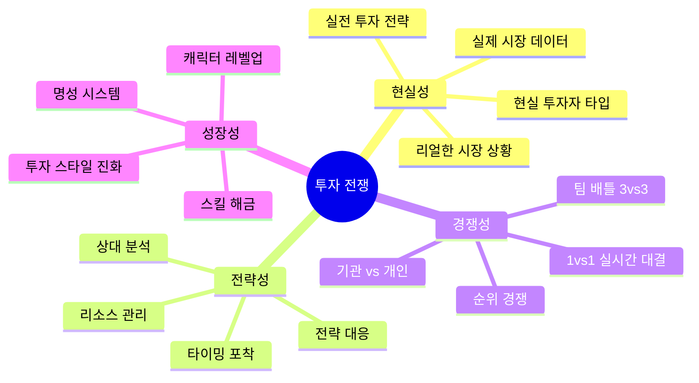

### 🌍 세계관 핵심

**"주식 시장은 전장이다. 당신의 무기는 주식, 당신의 적은... 바로 그들이다."**

```
시장 = 전장
자본금 = HP (생명력)
주식 = 유닛 (병력)
수익률 = 전투력
정보 = 자원
시간 = 턴
경쟁자 = 적군
```

---

## 세계관과 스토리

### 📖 배경 스토리

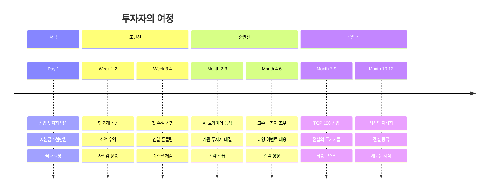

### 🎭 당신의 정체성

**신입 투자자 "홍길동" (플레이어 커스터마이징 가능)**

- **배경**: 
  - 평범한 직장인, 자본금 1천만원으로 투자 입문
  - 목표: 3년 안에 1억 달성, 시장의 상위 1%가 되는 것
  - 성격: 초반 서툴지만 빠르게 성장하는 학습형 투자자

- **시작 능력치**:
  - 분석력: 30/100
  - 판단력: 40/100
  - 담력: 50/100
  - 정보력: 20/100
  - 명성: 0/100

- **성장 방향**: 플레이어의 선택에 따라 진화
  - 공격형 트레이더 (단타, 고위험고수익)
  - 방어형 투자자 (장기, 안정 수익)
  - 균형형 전략가 (포트폴리오 분산)

---

## 경쟁자 시스템

### 👥 적(경쟁자)의 정체 - "괴물이 아닌, 현실의 투자자들"

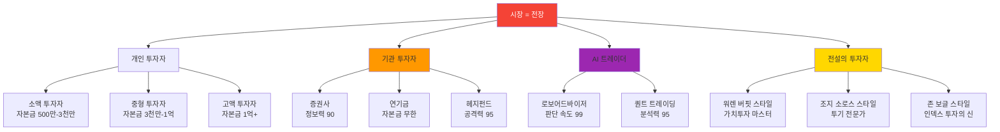

### 🎮 스테이지 1: 초급 경쟁자 (주변 개인 투자자들)

#### 경쟁자 #1: "대학생 투자자 김영수"

```
┌─────────────────────────────────────────┐
│  👨‍🎓 김영수 (22세, 대학생)              │
├─────────────────────────────────────────┤
│  💰 자본금: 500만원                     │
│  📊 투자 성향: 초보 공격형              │
│  ⚡ 전략: 테마주 단타                   │
│                                         │
│  능력치:                                │
│  분석력: 25/100 ⭐                      │
│  판단력: 30/100 ⭐                      │
│  담력: 70/100 ⭐⭐⭐                   │
│  정보력: 40/100 ⭐⭐                   │
│                                         │
│  특징:                                  │
│  ✅ 빠른 진입/청산 속도                 │
│  ✅ 테마주 후킹 능력 뛰어남             │
│  ❌ 손절 못함 (70% 확률로 물타기)       │
│  ❌ 변동성 높은 종목만 선호             │
│                                         │
│  AI 패턴:                               │
│  • 장 시작 후 급등주에 즉시 진입        │
│  • 수익 +5% 도달 시 절반 매도           │
│  • 손실 -10% 이하 시 물타기 시작        │
│  • 물타기 2회 이후 -20% 손절            │
│                                         │
│  약점:                                  │
│  🎯 박스권 종목으로 유인 → 지루함 유발  │
│  🎯 손실 -8% 구간에서 심리 흔들림       │
│  🎯 정보 부족으로 뉴스에 쉽게 흔들림    │
└─────────────────────────────────────────┘
```

**대결 방식**:
- **목표**: 3일간 수익률 경쟁 (선착순 +10% 도달 시 승리)
- **맵**: 코스닥 테마주 시장 (고변동성)
- **초기 자본**: 둘 다 1천만원
- **승리 조건**: 
  - 1순위: 먼저 +10% 달성
  - 2순위: 3일 후 높은 수익률
  - 패배 조건: -20% 이하 (파산)

**플레이어 전략 예시**:
```
[당신의 선택]
1. 🔥 맞불 작전: 같은 테마주 매수 → 속도 경쟁
2. 🧊 냉정 작전: 안정 종목 → 김영수 자멸 유도
3. 🎣 함정 작전: 가짜 호재 유포 → 잘못된 진입 유도
```

---

#### 경쟁자 #2: "직장인 투자자 박철수"

```
┌─────────────────────────────────────────┐
│  👔 박철수 (35세, 회사원)               │
├─────────────────────────────────────────┤
│  💰 자본금: 3천만원                     │
│  📊 투자 성향: 보수 안정형              │
│  ⚡ 전략: 우량주 장기 보유              │
│                                         │
│  능력치:                                │
│  분석력: 60/100 ⭐⭐⭐                 │
│  판단력: 70/100 ⭐⭐⭐⭐              │
│  담력: 40/100 ⭐⭐                     │
│  정보력: 50/100 ⭐⭐⭐                 │
│                                         │
│  특징:                                  │
│  ✅ 손절 철저 (-5%)                    │
│  ✅ 분할 매수 3단계 실행                │
│  ✅ 리스크 관리 우수                    │
│  ❌ 기회 포착 느림 (신중함 과다)        │
│  ❌ 급등주 놓침                         │
│                                         │
│  AI 패턴:                               │
│  • 장 시작 전 미리 종목 선정            │
│  • 지지선 근처에서만 매수               │
│  • 3회 분할 매수 (33%씩)                │
│  • 목표 수익 +12% 도달 시 전량 매도     │
│  • -5% 도달 시 무조건 손절              │
│                                         │
│  약점:                                  │
│  🎯 변동성 폭발 시장 → 기회 놓침        │
│  🎯 속도전에 약함                       │
│  🎯 단기 이벤트 대응력 부족             │
└─────────────────────────────────────────┘
```

**대결 방식**:
- **목표**: 1주일 수익률 경쟁
- **맵**: 코스피 대형주 시장 (안정형)
- **특수 룰**: 하루 거래 횟수 제한 (각자 3회)
- **승리 조건**: 
  - 높은 수익률 + 낮은 변동성 (샤프 비율)
  - MDD(최대 낙폭) -10% 이하 유지

---

#### 경쟁자 #3: "주부 투자자 이영희"

```
┌─────────────────────────────────────────┐
│  👩 이영희 (42세, 주부)                 │
├─────────────────────────────────────────┤
│  💰 자본금: 5천만원                     │
│  📊 투자 성향: 정보형 투자자            │
│  ⚡ 전략: 뉴스/공시 기반 매매           │
│                                         │
│  능력치:                                │
│  분석력: 50/100 ⭐⭐⭐                 │
│  판단력: 55/100 ⭐⭐⭐                 │
│  담력: 60/100 ⭐⭐⭐                   │
│  정보력: 80/100 ⭐⭐⭐⭐⭐            │
│                                         │
│  특징:                                  │
│  ✅ 뉴스 반응 속도 최고                 │
│  ✅ 커뮤니티 정보 활용 능숙             │
│  ✅ 호재/악재 빠르게 포착               │
│  ❌ 가짜 뉴스에 속음 (30%)              │
│  ❌ 과도한 정보 의존                    │
│                                         │
│  AI 패턴:                               │
│  • 뉴스 발표 후 3분 내 진입             │
│  • 공시 확인 후 즉시 반응               │
│  • 커뮤니티 추천주 적극 매수            │
│  • 악재 발생 시 선제적 청산             │
│                                         │
│  약점:                                  │
│  🎯 가짜 뉴스 유포 → 잘못된 진입 유도   │
│  🎯 정보 차단 전략 → 판단력 저하        │
│  🎯 반대 전략 (악재를 기회로)           │
└─────────────────────────────────────────┘
```

---

### 🏢 스테이지 2: 중급 경쟁자 (기관 투자자들)

#### 경쟁자 #4: "증권사 트레이딩 팀"

```
┌─────────────────────────────────────────┐
│  🏦 KB증권 트레이딩팀                   │
├─────────────────────────────────────────┤
│  💰 자본금: 100억원                     │
│  📊 투자 성향: 기관 전문가              │
│  ⚡ 전략: 프로그램 매매                 │
│                                         │
│  능력치:                                │
│  분석력: 90/100 ⭐⭐⭐⭐⭐            │
│  판단력: 85/100 ⭐⭐⭐⭐⭐            │
│  담력: 75/100 ⭐⭐⭐⭐                │
│  정보력: 95/100 ⭐⭐⭐⭐⭐            │
│  자본력: 100/100 ⭐⭐⭐⭐⭐           │
│                                         │
│  특징:                                  │
│  ✅ 실시간 빅데이터 분석                │
│  ✅ 0.1초 단위 주문 실행                │
│  ✅ 무제한 거래 가능 (자본력)           │
│  ✅ 시장 흐름 선도                      │
│  ❌ 예상치 못한 변수에 약함             │
│  ❌ 개인의 창의적 전략에 취약           │
│                                         │
│  AI 패턴:                               │
│  • 알고리즘 기반 자동 매매              │
│  • 대량 주문으로 시장 움직임 주도       │
│  • 지수 연동 매매                       │
│  • 차익거래 (아비트라지)                │
│                                         │
│  약점:                                  │
│  🎯 소형주로 피신 → 추적 불가           │
│  🎯 비정형 패턴 → 알고리즘 혼란         │
│  🎯 반대 매매 → 큰 물량에 맞서기        │
└─────────────────────────────────────────┘
```

**대결 방식**: **"다윗과 골리앗 전투"**

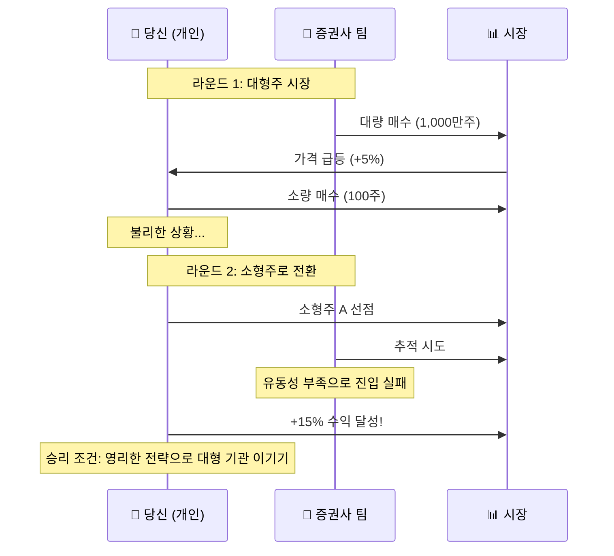

**플레이어 전략**:
1. **게릴라 전략**: 소형주, 테마주로 피신
2. **역발상 전략**: 증권사가 팔 때 사고, 살 때 팔기
3. **정보 선점**: 증권사보다 빠른 뉴스 포착
4. **심리전**: 가짜 매수/매도 호가로 혼란 유발

---

#### 경쟁자 #5: "외국인 투자자 (헤지펀드)"

```
┌─────────────────────────────────────────┐
│  🌍 글로벌 헤지펀드 "블랙스톤"          │
├─────────────────────────────────────────┤
│  💰 자본금: 1조원                       │
│  📊 투자 성향: 공격적 투기자            │
│  ⚡ 전략: 공매도 + 레버리지             │
│                                         │
│  능력치:                                │
│  분석력: 95/100 ⭐⭐⭐⭐⭐            │
│  판단력: 90/100 ⭐⭐⭐⭐⭐            │
│  담력: 99/100 ⭐⭐⭐⭐⭐            │
│  정보력: 99/100 ⭐⭐⭐⭐⭐            │
│  자본력: 100/100 ⭐⭐⭐⭐⭐           │
│  공격력: 100/100 ⭐⭐⭐⭐⭐           │
│                                         │
│  특징:                                  │
│  ✅ 시장 조작 수준의 영향력             │
│  ✅ 공매도로 하락장도 수익              │
│  ✅ 레버리지 10배 활용                  │
│  ✅ 글로벌 정보망                       │
│  ❌ 개인의 민첩성 부족                  │
│  ❌ 규제 리스크                         │
│                                         │
│  특수 능력:                             │
│  • 🔴 공매도 공격: 특정 종목 -20% 폭락  │
│  • 💰 레버리지: 수익 2배, 손실도 2배    │
│  • 🌊 시장 파동: 전체 시장 ±5% 조작     │
│  • 📰 정보 독점: 3일 앞 뉴스 미리보기   │
│                                         │
│  약점:                                  │
│  🎯 소형주로 피신 (공매도 불가)         │
│  🎯 단기 변동성에 약함                  │
│  🎯 감정적 매매로 알고리즘 교란         │
└─────────────────────────────────────────┘
```

**대결 방식**: **"생존 서바이벌"**

```
미션: 헤지펀드의 공매도 공격에서 살아남기

턴 1: 🔴 공매도 공격 시작! 시장 -15%
      → 당신의 선택:
         A. 손절하고 현금 확보
         B. 물타기로 평단가 낮춤
         C. 공매도 타겟 아닌 종목으로 피신
         
턴 2: 🌊 시장 조작으로 +5% 반등
      → 당신의 선택:
         A. 반등에 매도 (작은 수익)
         B. 추가 상승 기대하고 보유
         C. 추가 매수로 승부
         
턴 3: 📰 악재 뉴스 폭탄! -10%
      → 최종 선택:
         A. 패닉 매도
         B. 침착하게 분할 매도
         C. 역으로 추가 매수 (큰 배팅)

결과: 턴 5까지 생존 + 수익 0% 이상이면 승리!
```

---

### 🤖 스테이지 3: 고급 경쟁자 (AI 트레이더)

#### 경쟁자 #6: "AI 로보어드바이저"

```
┌─────────────────────────────────────────┐
│  🤖 AI 로보어드바이저 "알파제로"        │
├─────────────────────────────────────────┤
│  💰 자본금: 무제한 (가상)               │
│  📊 투자 성향: 완벽한 효율성            │
│  ⚡ 전략: 머신러닝 기반 최적화          │
│                                         │
│  능력치:                                │
│  분석력: 99/100 ⭐⭐⭐⭐⭐            │
│  판단력: 99/100 ⭐⭐⭐⭐⭐            │
│  담력: 50/100 ⭐⭐⭐ (감정 없음)       │
│  정보력: 100/100 ⭐⭐⭐⭐⭐           │
│  속도: 100/100 ⭐⭐⭐⭐⭐            │
│                                         │
│  특징:                                  │
│  ✅ 0.001초 판단 및 실행                │
│  ✅ 모든 데이터 실시간 분석             │
│  ✅ 감정 없는 기계적 매매               │
│  ✅ 24시간 쉬지 않고 모니터링           │
│  ❌ 예측 불가능한 이벤트 취약           │
│  ❌ 인간의 직관적 판단 못 따라감        │
│                                         │
│  AI 패턴:                               │
│  • 과거 100만 건 데이터 학습            │
│  • 패턴 인식률 98%                      │
│  • 리스크 자동 조절                     │
│  • 포트폴리오 실시간 최적화             │
│                                         │
│  약점:                                  │
│  🎯 비정형 이벤트 (블랙스완)            │
│  🎯 인간의 직관과 창의성                │
│  🎯 감정적 투자자들의 집단 행동         │
└─────────────────────────────────────────┘
```

**대결 방식**: **"인간 vs 기계 최종전"**

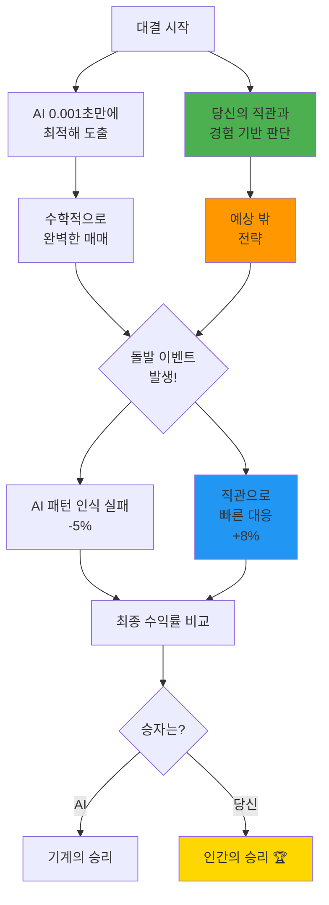

**승리 조건**: 10라운드 중 6라운드 승리

---

### 👑 스테이지 4: 보스 경쟁자 (전설의 투자자들)

#### 최종 보스: "워렌 버핏 스타일 투자자"

```
┌─────────────────────────────────────────┐
│  👴 전설의 투자자 "강산" (60세)         │
│  (Warren Buffett 오마주)                │
├─────────────────────────────────────────┤
│  💰 자본금: 100억원                     │
│  📊 투자 성향: 가치투자 마스터          │
│  ⚡ 전략: 장기 보유 + 복리 효과         │
│                                         │
│  능력치: (모든 능력 최고치)             │
│  분석력: 100/100 ⭐⭐⭐⭐⭐           │
│  판단력: 100/100 ⭐⭐⭐⭐⭐           │
│  담력: 100/100 ⭐⭐⭐⭐⭐            │
│  정보력: 100/100 ⭐⭐⭐⭐⭐           │
│  인내력: 100/100 ⭐⭐⭐⭐⭐           │
│  명성: 100/100 ⭐⭐⭐⭐⭐            │
│                                         │
│  특수 능력: "복리의 마법"               │
│  • 📈 시간이 지날수록 수익률 가속       │
│  • 🛡️ 시장 폭락에도 흔들리지 않음      │
│  • 💎 가치를 정확히 판별               │
│  • 🏆 40년 경력의 완벽한 판단력         │
│                                         │
│  전략:                                  │
│  1. 저평가 우량주 발굴 (DCF 분석)       │
│  2. 5년 이상 장기 보유                  │
│  3. 배당 재투자로 복리 효과             │
│  4. 절대 손절 안 함 (가치 확신)         │
│  5. 공포 시 매수, 탐욕 시 매도          │
│                                         │
│  약점: (거의 없음)                      │
│  🎯 단기 변동성에는 반응 느림           │
│  🎯 속도전에서는 불리                   │
│  🎯 초단타로 승부 가능 (3일 이내)       │
└─────────────────────────────────────────┘
```

**최종 대결**: **"3년 투자 시뮬레이션"**

```
미션: 3년(36개월)간 강산을 이겨라!

룰:
• 초기 자본: 둘 다 1억원
• 기간: 36개월 (게임 내 시간)
• 목표: 최종 자산 비교
• 특수 이벤트: 매년 1회 시장 대폭락

강산의 전략:
• Month 1-12: 우량주 10종목 분산 매수
• Month 13-24: 배당금 재투자 + 추가 매수
• Month 25-36: 복리 효과로 자산 가속 증가

당신의 전략:
• 선택 A: 장기 투자로 정면 승부
• 선택 B: 단타로 빠른 수익 추구
• 선택 C: 하이브리드 (중기 + 단타)

예상 결과:
강산: 1억 → 2.5억 (+150%)
당신: 1억 → ? (당신의 실력)

승리 조건: 2.5억 이상 또는 강산보다 높은 수익률
```

---

## 전투(거래) 메커니즘

### ⚔️ 전투 = 실시간 거래 경쟁

**스타크래프트 스타일 인터페이스**

```
┌──────────────────────────────────────────────────────────────┐
│  [미니맵]        [타이머: 09:42]         [대결 정보]        │
│  ┌────────┐                                                  │
│  │ 🟢🟢   │     VS                                          │
│  │ 🟢🔴   │                                                  │
│  │ 🔴🔴   │     👤 당신: 10,250,000원 (+2.5%)              │
│  └────────┘     👨‍🎓 김영수: 10,120,000원 (+1.2%)          │
├──────────────────────────────────────────────────────────────┤
│  [당신의 포트폴리오]          [상대 포트폴리오 (일부 공개)] │
│  ┌──────────────────────┐    ┌──────────────────────┐      │
│  │ 삼성전자 100주        │    │ ???주 ??주            │      │
│  │ 72,000원 (+8.3%)      │    │ ????? (+3.2%)         │      │
│  │                       │    │                       │      │
│  │ 현금: 3,000,000원     │    │ 현금: ???             │      │
│  └──────────────────────┘    └──────────────────────┘      │
├──────────────────────────────────────────────────────────────┤
│  [시장 현황 - 실시간 차트]                                    │
│  ┌────────────────────────────────────────────────────────┐ │
│  │  [삼성전자]  [SK하이닉스]  [카카오]  [NAVER]           │ │
│  │                                                        │ │
│  │  📊 72,000원 ▲ +2,500 (+3.60%)                        │ │
│  │  거래량: 145% ↑↑                                       │ │
│  │                                                        │ │
│  │      /\      /\                                        │ │
│  │     /  \    /  \    /\    ← 지금                      │ │
│  │    /    \  /    \  /  \                                │ │
│  │   /      \/      \/    \                               │ │
│  │  ────────────────────────                              │ │
│  │  9:00   10:00  11:00 12:00                             │ │
│  └────────────────────────────────────────────────────────┘ │
├──────────────────────────────────────────────────────────────┤
│  [빠른 액션]                                                  │
│  ┌─────┐ ┌─────┐ ┌─────┐ ┌─────┐ ┌────────────┐         │
│  │ 매수 │ │ 매도 │ │ 전량│ │정보 │ │특수 능력   │         │
│  └─────┘ └─────┘ └─────┘ └─────┘ │ (쿨타임 30초)│        │
│  (단축키: Q) (W)    (E)    (R)    └────────────┘         │
└──────────────────────────────────────────────────────────────┘
```

### 🎮 전투 진행 방식

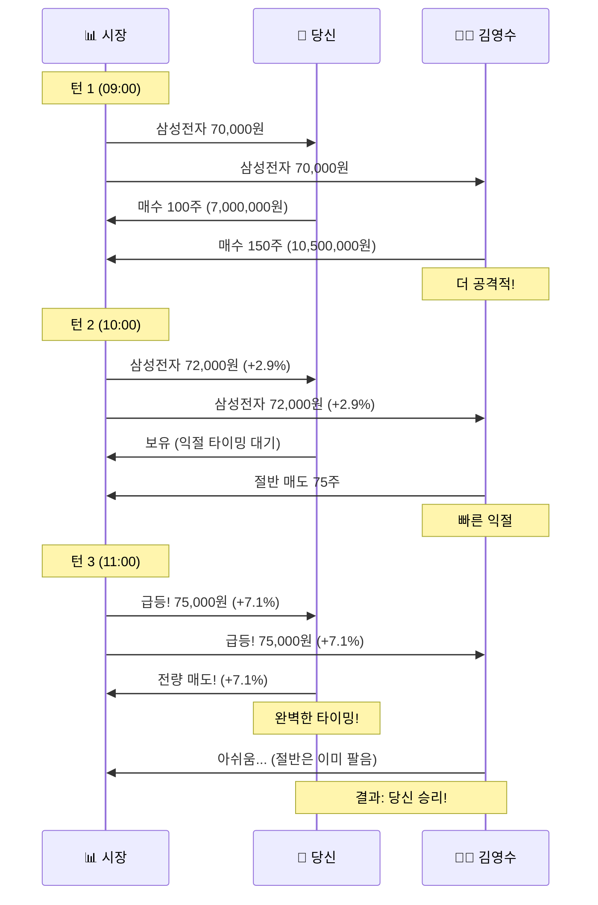

---

### ⚡ 액션 포인트 (AP) 시스템

**"시간 = 자원"**

```
초기 AP: 100 포인트
회복: 1분마다 +5 AP

행동별 AP 소모:
┌─────────────────┬────────┬──────────┐
│ 행동            │ AP 소모│ 쿨타임   │
├─────────────────┼────────┼──────────┤
│ 종목 조회       │ 5 AP   │ 없음     │
│ 차트 분석       │ 10 AP  │ 없음     │
│ 매수 주문       │ 20 AP  │ 10초     │
│ 매도 주문       │ 20 AP  │ 10초     │
│ 전량 매도       │ 30 AP  │ 30초     │
│ 정보 탐색       │ 15 AP  │ 1분      │
│ 특수 능력 사용  │ 50 AP  │ 5분      │
│ 상대 정찰       │ 25 AP  │ 2분      │
└─────────────────┴────────┴──────────┘

전략:
• AP를 아껴서 중요한 순간에 사용
• 상대의 AP를 소진시키는 전략
• AP 회복 타이밍을 계산한 플레이
```

---

### 🎯 특수 능력 (Ultimate Skills)

**플레이어별 고유 스킬**

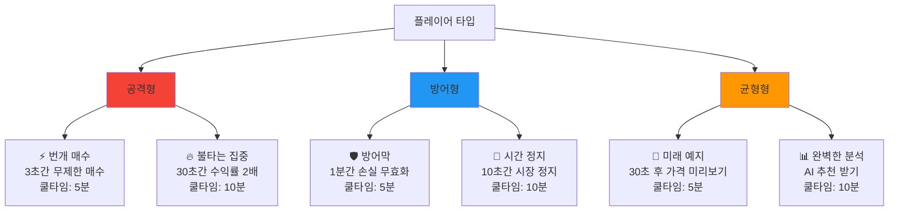

---

### 🎲 랜덤 이벤트 (Fog of War)

**"안개 속의 기회와 위험"**

```
┌─────────────────────────────────────────┐
│  ⚠️ 긴급 이벤트 발생!                   │
├─────────────────────────────────────────┤
│                                         │
│  📰 뉴스 속보:                           │
│  "삼성전자, 신규 반도체 공장 건설 발표" │
│                                         │
│  영향:                                  │
│  • 삼성전자 +5% 상승 예상               │
│  • SK하이닉스 동반 상승 +3%             │
│                                         │
│  제한 시간: 30초                        │
│                                         │
│  [대응 선택]                            │
│  A. 즉시 매수 (빠른 대응)               │
│  B. 차트 확인 후 매수 (신중함)          │
│  C. 무시하고 원래 전략 유지             │
│                                         │
│  ⏱️ 29초... 28초... 27초...            │
└─────────────────────────────────────────┘
```

**이벤트 종류**:

| 이벤트 | 빈도 | 영향 | 대응 시간 |
|--------|------|------|----------|
| 📰 호재 뉴스 | 10분마다 | 특정 종목 +5~10% | 30초 |
| 📉 악재 뉴스 | 10분마다 | 특정 종목 -5~10% | 30초 |
| ⚡ 시장 급변 | 20분마다 | 전체 ±3% | 즉시 |
| 🎰 럭키 타임 | 30분마다 | 수수료 0% | 5분간 |
| 🌪️ 블랙스완 | 60분마다 | 전체 -15% | 즉시 |

---

## 주식 유닛 시스템

### 📦 주식 = 유닛 (병력)

**"주식을 전투 유닛처럼 관리하라!"**

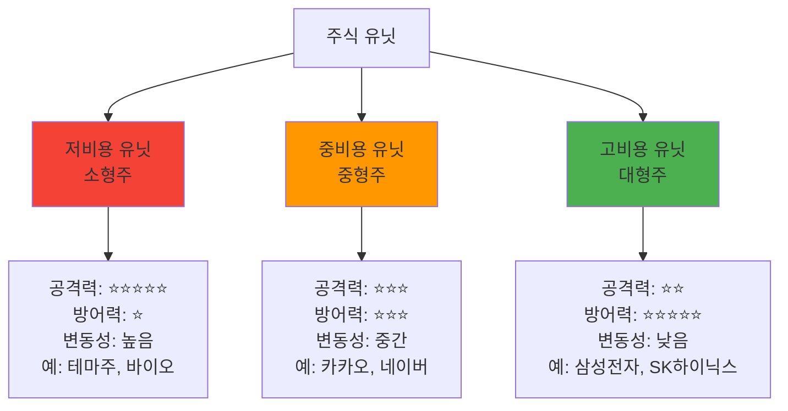

### 📊 주식 유닛 상세 스펙

#### 🔴 고변동 유닛 (공격형)

```
┌─────────────────────────────────────────┐
│  🧬 바이오 주식 "셀트리온"              │
├─────────────────────────────────────────┤
│  유형: 고변동 공격 유닛                 │
│  비용: 200,000원/주                     │
│                                         │
│  능력치:                                │
│  공격력: 95/100 ⭐⭐⭐⭐⭐            │
│  (하루 +15% 가능)                       │
│                                         │
│  방어력: 20/100 ⭐                      │
│  (하루 -15% 가능)                       │
│                                         │
│  속도: 90/100 ⭐⭐⭐⭐⭐              │
│  (호재 반응 즉각)                       │
│                                         │
│  특수 능력:                             │
│  💊 "신약 개발": 20% 확률로 +30% 급등   │
│  ⚠️ "임상 실패": 15% 확률로 -20% 급락  │
│                                         │
│  추천 상황:                             │
│  ✅ 공격적으로 빠른 수익 필요           │
│  ✅ 단기 이벤트 대응                    │
│  ❌ 안정적 장기 투자                    │
│  ❌ 초보자                              │
│                                         │
│  카운터:                                │
│  🛡️ 안정주로 리스크 헷지               │
│  📊 분산 투자로 리스크 관리             │
└─────────────────────────────────────────┘
```

#### 🟡 중변동 유닛 (균형형)

```
┌─────────────────────────────────────────┐
│  💬 IT 주식 "카카오"                    │
├─────────────────────────────────────────┤
│  유형: 중변동 균형 유닛                 │
│  비용: 50,000원/주                      │
│                                         │
│  능력치:                                │
│  공격력: 60/100 ⭐⭐⭐                 │
│  (하루 +7% 가능)                        │
│                                         │
│  방어력: 60/100 ⭐⭐⭐                 │
│  (하루 -5% 정도)                        │
│                                         │
│  속도: 70/100 ⭐⭐⭐⭐                │
│  (뉴스 반응 빠름)                       │
│                                         │
│  특수 능력:                             │
│  💼 "사업 다각화": 섹터 변동에 덜 민감  │
│  📱 "플랫폼 확장": 꾸준한 성장세        │
│                                         │
│  추천 상황:                             │
│  ✅ 중장기 투자                         │
│  ✅ 포트폴리오 핵심                     │
│  ✅ 초중급자                            │
│  ❌ 단타 목적                           │
│                                         │
│  카운터:                                │
│  📰 규제 리스크 주의                    │
│  📊 섹터 로테이션 활용                  │
└─────────────────────────────────────────┘
```

#### 🟢 저변동 유닛 (방어형)

```
┌─────────────────────────────────────────┐
│  🏭 대형 주식 "삼성전자"                │
├─────────────────────────────────────────┤
│  유형: 저변동 방어 유닛                 │
│  비용: 70,000원/주                      │
│                                         │
│  능력치:                                │
│  공격력: 40/100 ⭐⭐                   │
│  (하루 +3% 정도)                        │
│                                         │
│  방어력: 95/100 ⭐⭐⭐⭐⭐            │
│  (하루 -2% 정도)                        │
│                                         │
│  속도: 30/100 ⭐                        │
│  (느린 움직임)                          │
│                                         │
│  특수 능력:                             │
│  🛡️ "시장 방패": 폭락 시 덜 떨어짐     │
│  💰 "배당 지급": 분기마다 보너스        │
│  🏆 "브랜드 파워": 장기 상승 보장       │
│                                         │
│  추천 상황:                             │
│  ✅ 장기 투자 (1년+)                    │
│  ✅ 안정적 수익 추구                    │
│  ✅ 초보자 필수                         │
│  ❌ 빠른 수익 목적                      │
│                                         │
│  카운터:                                │
│  (거의 없음 - 최고 안정성)              │
└─────────────────────────────────────────┘
```

---

### 🎖️ 유닛 조합 전략 (Build Order)

**"스타크래프트의 빌드 오더처럼!"**

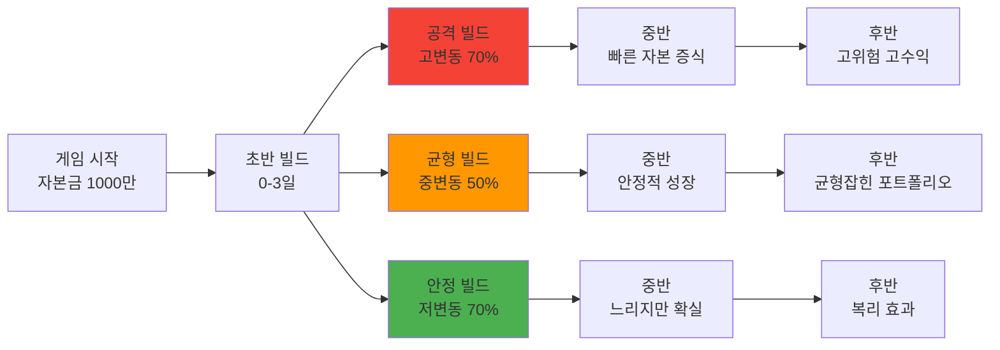

#### 빌드 #1: "치즈 러쉬" (초반 올인)

```
목표: 3일 안에 +20% 달성

DAY 1:
  09:00 - 고변동주 3종목 집중 매수 (90%)
  10:00 - 급등 종목 발견 시 추가 매수
  15:00 - 목표 달성 시 전량 매도

리스크: ⚠️⚠️⚠️⚠️⚠️ (매우 높음)
성공률: 40%
실패 시: -15% 손실 가능

카운터:
  • 상대가 안정 빌드 시 후반 역전당함
  • 블랙스완 이벤트 발생 시 파산
```

#### 빌드 #2: "표준 빌드" (균형)

```
목표: 1주일 안에 +10% 달성

DAY 1-2:
  중형주 3종목 분산 매수 (60%)
  현금 40% 보유
  
DAY 3-5:
  조정 시 추가 매수
  수익 +10% 시 절반 매도
  
DAY 6-7:
  나머지 정리 및 수익 확정

리스크: ⚠️⚠️⚠️ (중간)
성공률: 70%
실패 시: -5% 손실

추천: 초중급자
```

#### 빌드 #3: "거북이 전략" (장기)

```
목표: 1개월 안에 +15% 달성

WEEK 1:
  대형주 5종목 분산 매수 (50%)
  배당주 포함
  
WEEK 2-3:
  추가 현금으로 분할 매수
  배당금 재투자
  
WEEK 4:
  복리 효과로 목표 달성

리스크: ⚠️ (매우 낮음)
성공률: 90%
실패 시: -2% 손실

추천: 초보자, 안정 추구형
```

---

## 리소스 관리

### 💰 3가지 핵심 리소스

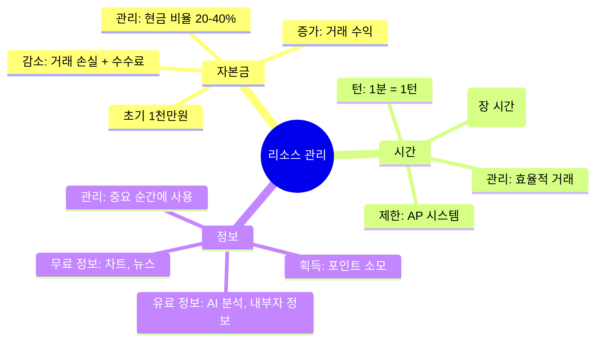

### ⚖️ 리소스 트레이드오프

```
시나리오: 중요한 선택의 순간

A. 정보 구매 (1000 포인트)
   → AI 분석 보고서 획득
   → 100% 정확한 추천
   → 하지만 포인트 소진
   
B. 시간 투자 (30분)
   → 직접 차트 분석
   → 70% 정확도
   → 하지만 시간 소모
   
C. 직관 의존 (즉시)
   → 빠른 결정
   → 50% 정확도
   → 하지만 리스크 높음

전략: 상황에 따라 최적 선택!
```

---

## 게임 모드

### 🎮 4가지 플레이 모드

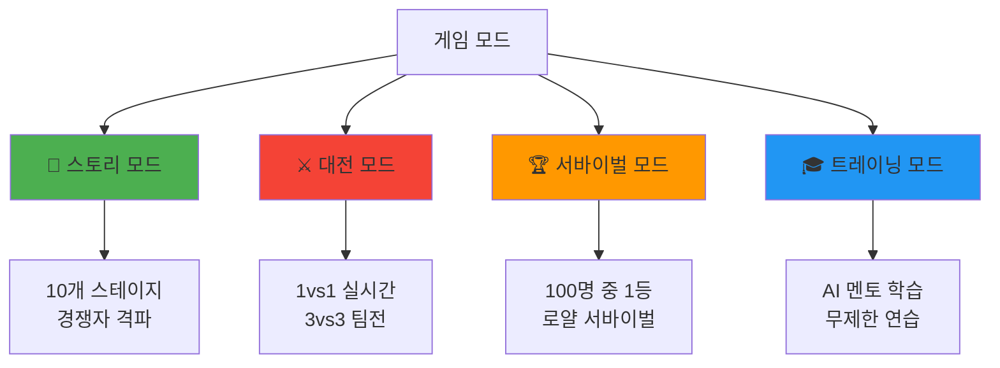

### 📖 모드 1: 스토리 모드 (메인)

**"신입 투자자의 성장기"**

```
스테이지 구성:

[튜토리얼] 기본 거래 학습
    ↓
[Stage 1] 대학생 김영수 격파
    ↓
[Stage 2] 직장인 박철수 격파
    ↓
[Stage 3] 주부 이영희 격파
    ↓
[Stage 4] 증권사 트레이딩팀 격파 (보스 1)
    ↓
[Stage 5] 외국인 헤지펀드 생존
    ↓
[Stage 6] AI 로보어드바이저 격파 (보스 2)
    ↓
[Stage 7-9] 고수 투자자 3인방
    ↓
[Stage 10] 전설의 투자자 격파 (최종 보스)
    ↓
[엔딩] 당신도 전설이 되다
```

**진행 방식**:
- 각 스테이지마다 고유한 미션
- 클리어 조건 달성 시 다음 스테이지 해금
- 별점 시스템 (⭐⭐⭐ 완벽 클리어)
- 재도전 가능 (더 높은 별점 획득)

---

### ⚔️ 모드 2: 대전 모드 (PvP)

#### 1vs1 듀얼

```
┌─────────────────────────────────────────┐
│  ⚔️ 1 vs 1 듀얼                         │
├─────────────────────────────────────────┤
│                                         │
│  [매칭 중...]                           │
│                                         │
│  당신: 레벨 15 (상위 5%)                │
│  전적: 47승 23패 (67% 승률)             │
│                                         │
│  상대 검색 중...                        │
│  ▓▓▓▓▓░░░░░ 50%                        │
│                                         │
│  [매칭 완료!]                           │
│                                         │
│  상대: "차트마법사" (레벨 14)           │
│  전적: 52승 30패 (63% 승률)             │
│  스타일: 공격형 트레이더                │
│                                         │
│  맵: 코스닥 고변동 시장                 │
│  룰: 10분 타임 어택                     │
│  승리 조건: 높은 수익률                 │
│                                         │
│  [대전 시작] [거절]                     │
└─────────────────────────────────────────┘
```

**듀얼 특징**:
- 실시간 10분 대결
- 동일한 초기 자본 (1천만원)
- 동일한 시장 환경
- 순수 실력 겨루기

---

#### 3vs3 팀 배틀

```
┌─────────────────────────────────────────┐
│  🎖️ 3 vs 3 팀 배틀                     │
├─────────────────────────────────────────┤
│                                         │
│  팀 A (블루팀)     vs    팀 B (레드팀)  │
│  ─────────────────────────────────────  │
│  👤 당신 (공격형)        🤖 AI_1 (균형) │
│  👤 동료1 (방어형)       👤 상대1 (공격)│
│  👤 동료2 (균형형)       👤 상대2 (방어)│
│                                         │
│  팀 전략:                               │
│  • 당신: 고변동주 공격                  │
│  • 동료1: 안정주로 방어                 │
│  • 동료2: 중형주로 균형                 │
│                                         │
│  합산 목표: 팀 평균 +15% 달성           │
│  제한 시간: 30분                        │
│                                         │
│  특수 룰:                               │
│  • 팀원 간 정보 공유 가능               │
│  • 합동 공격 (동시 매수) 가능           │
│  • 한 명이 파산하면 팀 전체 불리        │
│                                         │
│  [대전 시작]                            │
└─────────────────────────────────────────┘
```

**팀 배틀 전략**:
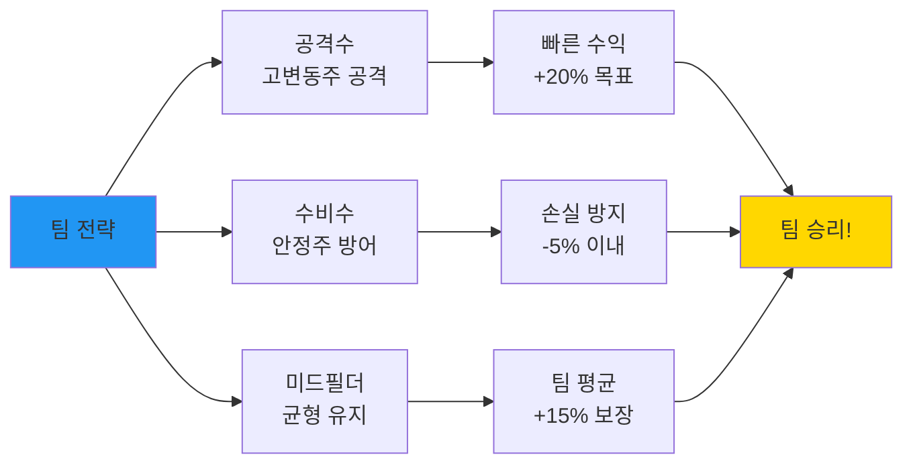

---

### 🏆 모드 3: 서바이벌 모드

**"100명 중 1등만 살아남는다"**

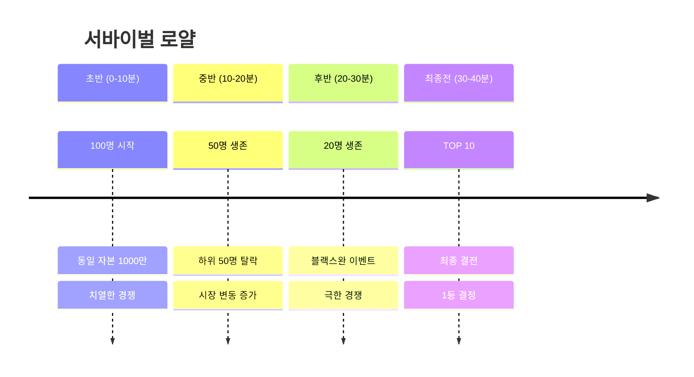

**진행 방식**:

```
턴 1-10 (10분):
  • 100명 동시 시작
  • 자유롭게 거래
  • 10분 후 하위 50명 탈락

턴 11-20 (10분):
  • 50명 생존
  • 시장 변동성 2배 증가
  • 10분 후 하위 30명 탈락

턴 21-30 (10분):
  • 20명 생존
  • 블랙스완 이벤트 (-20%)
  • 10분 후 하위 10명 탈락

턴 31-40 (10분):
  • TOP 10 최종전
  • 극한의 변동성
  • 최종 1등 결정

보상:
1위: 100,000 포인트 + 전설 칭호
2-3위: 50,000 포인트
4-10위: 20,000 포인트
```

---

### 🎓 모드 4: 트레이닝 모드

**"AI 멘토와 함께 무제한 연습"**

```
┌─────────────────────────────────────────┐
│  🎓 트레이닝 센터                        │
├─────────────────────────────────────────┤
│                                         │
│  선택하세요:                            │
│                                         │
│  1. 📚 기초 학습                        │
│     • 거래 방법                         │
│     • 차트 보는 법                      │
│     • 리스크 관리                       │
│                                         │
│  2. 🤖 AI 멘토와 연습                   │
│     • 김철수 (안정형)                   │
│     • 박영희 (공격형)                   │
│     • 이준호 (균형형)                   │
│                                         │
│  3. 🎯 시나리오 연습                    │
│     • 급등장 대응                       │
│     • 급락장 대응                       │
│     • 박스권 돌파                       │
│                                         │
│  4. 🔄 과거 차트 복기                   │
│     • 2020년 코로나 폭락                │
│     • 2021년 테마주 광풍                │
│     • 2023년 금리 인상기                │
│                                         │
│  무제한 연습 가능 (실제 자본 소모 X)    │
└─────────────────────────────────────────┘
```

---

## 실시간 대전 시스템

### ⚡ 실시간 동기화

**"스타크래프트처럼 끊김 없는 실시간 대결"**

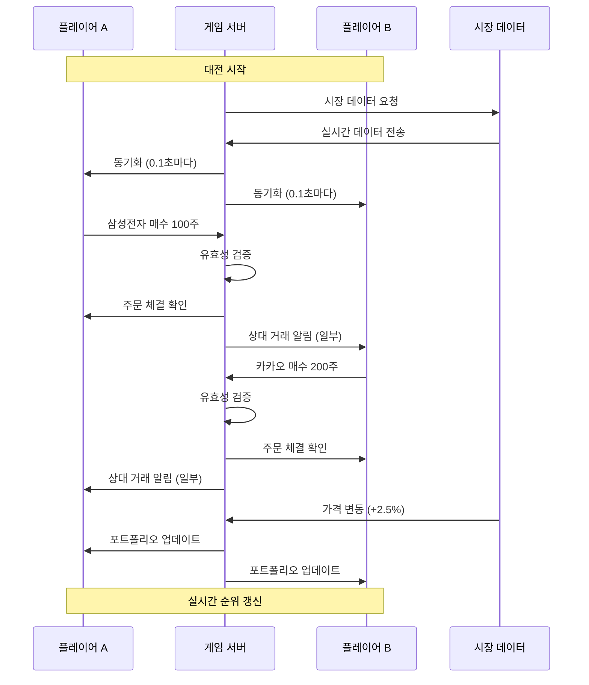

### 📡 정보 공개 레벨

**"상대의 전략을 어디까지 볼 수 있나?"**

```
기본 공개 (무료):
  ✅ 상대 총 자산
  ✅ 수익률
  ✅ 거래 횟수
  ❌ 종목명 (???로 표시)
  ❌ 매매 타이밍
  ❌ 전략

레벨 1 정찰 (100 포인트):
  ✅ 보유 종목 섹터 (IT, 바이오 등)
  ✅ 포트폴리오 비중 (%)
  ❌ 구체적 종목명

레벨 2 정찰 (300 포인트):
  ✅ 보유 종목명 공개
  ✅ 최근 3거래 내역
  ❌ 실시간 추적

레벨 3 정찰 (500 포인트):
  ✅ 실시간 거래 알림
  ✅ 전략 메모 엿보기
  ✅ 다음 타겟 예측

전략:
• 정찰에 포인트 쓸 것인가?
• 아니면 거래에 집중할 것인가?
```

---

### 🎤 실시간 채팅 및 심리전

```
┌─────────────────────────────────────────┐
│  💬 대전 채팅                           │
├─────────────────────────────────────────┤
│                                         │
│  [09:05] 상대: "ㅋㅋ 삼성 샀냐?"       │
│  [09:06] 당신: "..."                    │
│  [09:10] 상대: "나 +5% ㅎㅎ"           │
│  [09:12] 당신: "축하해" (거짓말)        │
│  [09:15] 상대: "!! 폭락한다 팔아!"      │
│  [09:16] 당신: (무시하고 보유)          │
│  [09:20] 시장: 삼성 +8% 급등!           │
│  [09:21] 당신: "+8% 감사합니다 ^^"      │
│  [09:22] 상대: "..."                    │
│                                         │
│  [이모티콘] [빠른 채팅] [음소거]        │
└─────────────────────────────────────────┘

빠른 채팅:
• "굿!"//"나이스!"
• "아쉽네요"
• "ㅋㅋㅋㅋㅋ"
• "???"
• "GG" (Good Game)
```

**심리전 요소**:
- 상대를 흔들기 위한 블러핑
- 가짜 정보 유포 (윤리적 범위 내)
- 타이밍 심리 싸움
- 침착함 유지가 승패 갈림

---

## 성장과 진화

### 📈 레벨 시스템

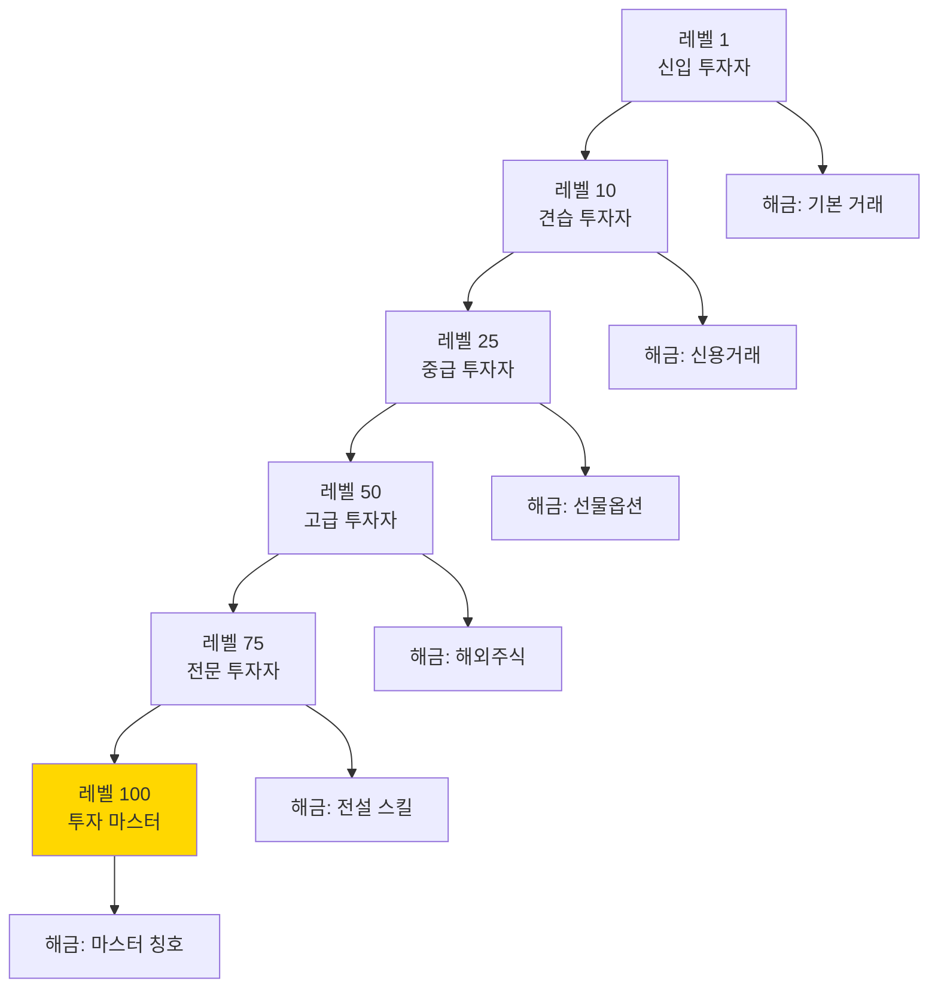

### 🎖️ 칭호 시스템

```
획득 조건별 칭호:

[수익률 기반]
• 📈 수익왕: 주간 +50% 달성
• 💎 다이아손: 월간 +100% 달성
• 🏆 전설의 수익률: 연간 +500% 달성

[승률 기반]
• 🎯 저격수: 10연승 달성
• 🔥 연승왕: 20연승 달성
• 👑 무패신화: 50연승 달성

[스타일 기반]
• 🛡️ 철벽 수비: MDD -5% 이하 유지
• ⚡ 번개손: 평균 거래 시간 3초 이하
• 🧊 아이스맨: 손절 100% 실행

[특수 업적]
• 🐋 고래잡이: 기관투자자 격파
• 🤖 AI 킬러: AI 트레이더 3회 격파
• 👨‍🏫 멘토: 초보자 10명 지도
```

---

## UI/UX 디자인

### 🎨 메인 배틀 화면

```
┌──────────────────────────────────────────────────────────────┐
│  [로고]  투자 전쟁  [레벨 15] [골드: 15,230]  [설정]  [?]    │
├──────────────────────────────────────────────────────────────┤
│                                                              │
│  ┌──────────────────┐              ┌──────────────────┐     │
│  │ 👤 당신           │      VS      │ 👨‍🎓 김영수      │     │
│  │ 10,850,000원      │              │ 10,120,000원      │     │
│  │ +8.5% 🔥         │              │ +1.2%            │     │
│  │                  │              │                  │     │
│  │ 🟢🟢🟡 (건강)     │              │ 🟡🔴🔴 (위험)    │     │
│  └──────────────────┘              └──────────────────┘     │
│                                                              │
│  ⏱️ 남은 시간: 07:42                                         │
│  🎯 목표: 먼저 +10% 달성 또는 더 높은 수익률                  │
│                                                              │
├──────────────────────────────────────────────────────────────┤
│  [당신의 포트폴리오]                                          │
│  ┌──────────────────────────────────────────────────────┐   │
│  │ 📊 삼성전자 100주  72,000원  +8.3% 🔥                 │   │
│  │ 📊 카카오 50주     52,000원  +4.0%                    │   │
│  │ 💰 현금 2,850,000원 (26%)                            │   │
│  └──────────────────────────────────────────────────────┘   │
│                                                              │
│  [시장 현황]                                                  │
│  ┌──────────────────────────────────────────────────────┐   │
│  │  [삼성] [SK하이닉스] [카카오] [NAVER] [현대차]       │   │
│  │                                                      │   │
│  │  📈 실시간 차트                                       │   │
│  │       /\      /\                                     │   │
│  │      /  \    /  \    /\    ← 지금                   │   │
│  │     /    \  /    \  /  \                             │   │
│  │    /      \/      \/    \                            │   │
│  │  ──────────────────────────                          │   │
│  │  거래량: 145% ↑↑  뉴스: 🟢 호재 발표                 │   │
│  └──────────────────────────────────────────────────────┘   │
│                                                              │
│  [빠른 액션] (단축키)                                         │
│  [Q 매수] [W 매도] [E 전량매도] [R 정보] [T 스킬]           │
│                                                              │
│  💬 채팅: 상대 "ㅋㅋ 나 +5% ㅎㅎ" [답장하기]                 │
└──────────────────────────────────────────────────────────────┘
```

---

### 🎯 주문 실행 화면

```
┌─────────────────────────────────────────┐
│  ⚡ 빠른 주문 - 삼성전자                │
├─────────────────────────────────────────┤
│                                         │
│  현재가: 72,000원 ▲ +2.5%              │
│  보유: 100주                            │
│  평균단가: 66,200원                     │
│                                         │
│  ┌───────────────────────────────────┐  │
│  │ [매수]          [매도]           │  │
│  └───────────────────────────────────┘  │
│                                         │
│  수량: [50주] [100주] [전량] [직접입력] │
│                                         │
│  주문 방식:                             │
│  ● 시장가 (즉시 체결)                  │
│  ○ 지정가 (가격 지정)                  │
│                                         │
│  예상 금액: 3,600,000원                 │
│  수수료: 900원                          │
│  실수령: 3,599,100원                    │
│                                         │
│  [확인 (Enter)] [취소 (ESC)]           │
│                                         │
│  💡 AI 조언:                            │
│  "좋은 타이밍입니다! 지지선 근처입니다"  │
└─────────────────────────────────────────┘
```

---

## 🎊 최종 정리

### 게임의 핵심 가치

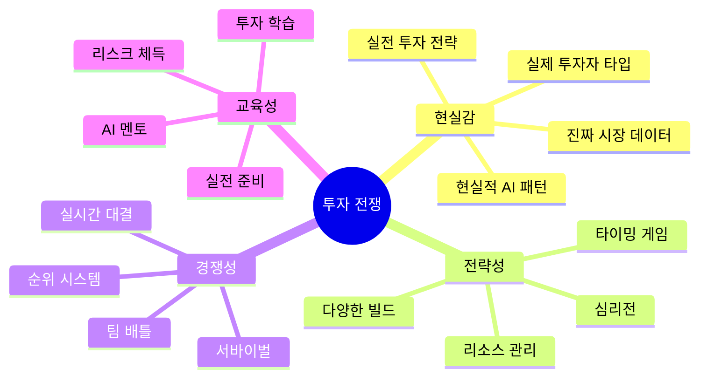

### 🎮 왜 이 게임이 특별한가?

**1. 현실성**: 괴물이 아닌 현실의 투자자들과 대결
**2. 전략성**: 스타크래프트처럼 다양한 전략과 빌드
**3. 몰입감**: 실시간 대결로 긴장감 극대화
**4. 교육성**: 게임하면서 자연스럽게 투자 학습
**5. 성장성**: 레벨업, 칭호, 스킬로 캐릭터 육성

### 💪 플레이어의 성장 곡선

```
Day 1: "주식이 뭐지?" → 신입 투자자
  ↓
Week 1: "차트 볼 줄 안다!" → 기초 학습 완료
  ↓
Month 1: "김영수 이겼다!" → 개인 투자자 수준
  ↓
Month 3: "증권사도 이긴다?" → 준전문가 수준
  ↓
Month 6: "AI도 이길 수 있어" → 전문가 수준
  ↓
Year 1: "나도 전설이다" → 마스터 등급
  ↓
Real Life: "실전 투자 성공!" → 진짜 투자자
```

---

## 🚀 개발 로드맵

### Phase 1: 프로토타입 (3개월)

```
✅ 기본 전투 시스템
✅ 3명의 AI 경쟁자
✅ 1vs1 대전 모드
✅ 주식 유닛 10종
✅ 리소스 관리
✅ UI/UX 기본 디자인
```

### Phase 2: 코어 시스템 (6개월)

```
✅ 스토리 모드 10스테이지
✅ AI 경쟁자 10명
✅ 3vs3 팀 배틀
✅ 서바이벌 모드
✅ 레벨/성장 시스템
✅ 칭호/업적 시스템
```

### Phase 3: 완성 (12개월)

```
✅ 실시간 대전 서버
✅ 랭킹 시스템
✅ 친구 시스템
✅ 리플레이 기능
✅ 모바일 최적화
✅ 정식 런칭
```

---

## 📚 참고 자료

**게임 디자인 영감**:
- 스타크래프트: RTS 대전 구조
- 리그 오브 레전드: 역할 분담, 팀 배틀
- 배틀그라운드: 서바이벌 로얄
- 파도를 타라: 투자 교육 시스템

**투자 전략 참고**:
- 워렌 버핏: 가치투자
- 조지 소로스: 투기 전략
- 피터 린치: 성장주 투자

---

**문서 버전**: v1.0  
**최종 업데이트**: 2026년 2월 1일  
**작성자**: 게임 기획팀  
**상태**: 컨셉 디자인 완료 ✅

**다음 단계**: 프로토타입 개발 시작! 🚀
