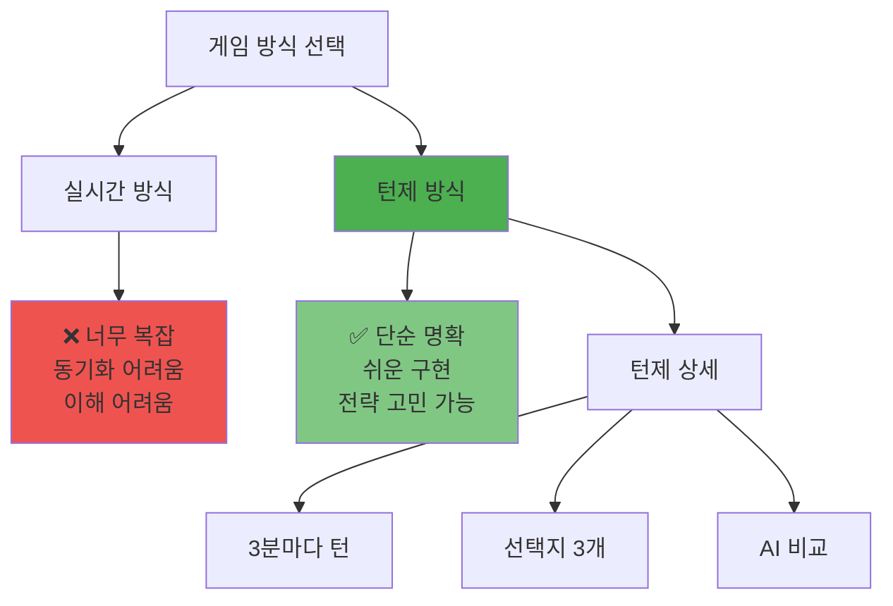
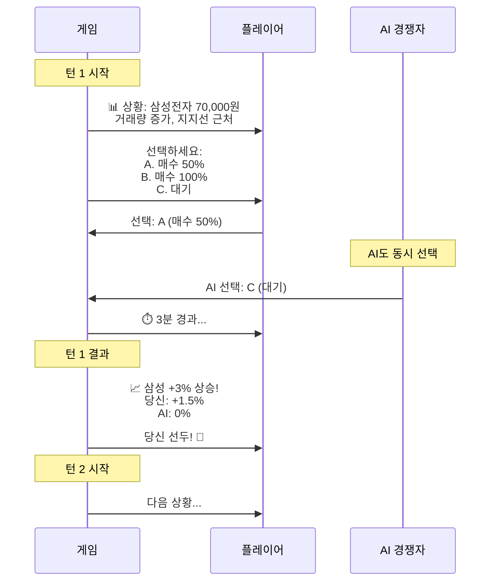
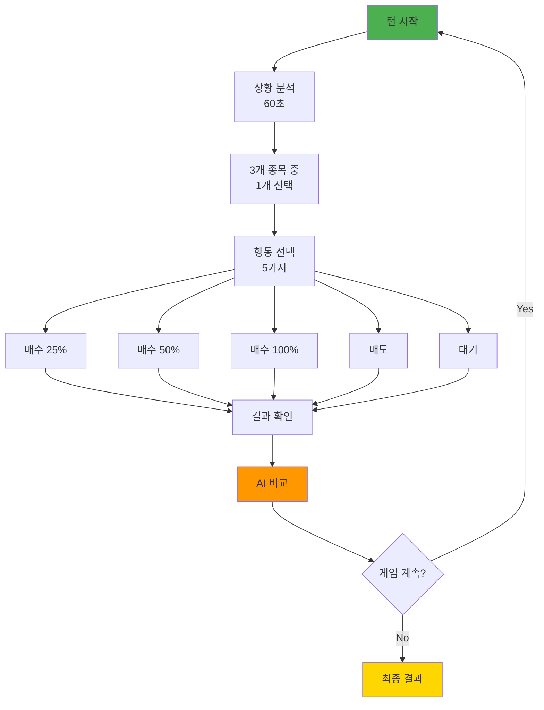
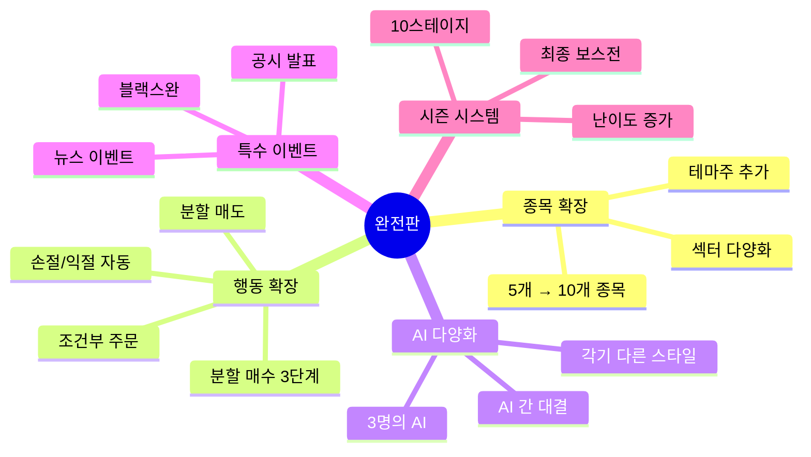
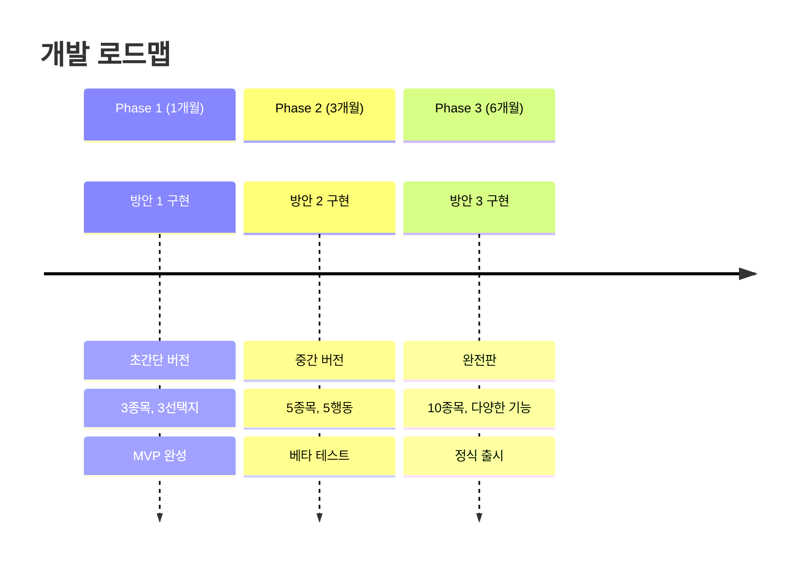
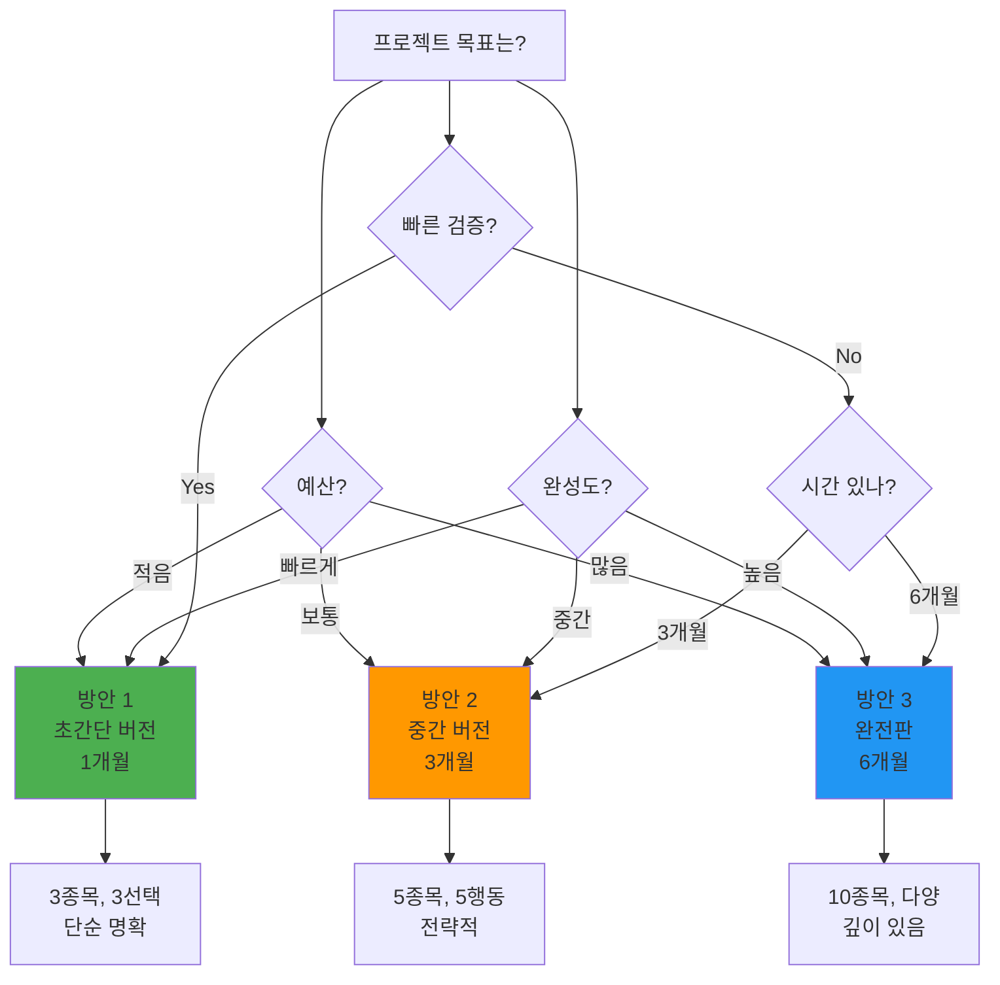

# 투자 대결 게임 - 단순화 및 구현 가능 버전
## "3분 투자 대결" - 턴제 전략 게임

**버전**: v1.0 (구현 가능 버전)  
**작성일**: 2026년 2월 1일  
**목표**: 실제 구현 가능하고 이해하기 쉬운 게임

---

## 🎯 핵심 질문에 대한 답변

### Q1: 이게 가능할까요?
**A: 네! 하지만 단순화가 필요합니다.**

### Q2: 대결 구도를 만들 수 있을까요?
**A: 네! 턴제 방식으로 가능합니다.**

### Q3: 주식을 제한적으로 해야 할까요?
**A: 네! 3-5개 종목으로 제한합니다.**

### Q4: 매 타임 끊어서 묻는 형태로?
**A: 네! 턴제가 가장 좋습니다.**

---

## 📊 게임 방식 비교



---

## 🎮 최종 추천: 턴제 방식

### 기본 구조

```
┌─────────────────────────────────────────┐
│  턴 1 (Day 1, 09:00)                    │
│  ─────────────────────────────────────  │
│  상황 제시 → 3가지 선택지 → 결과 확인  │
│  ─────────────────────────────────────  │
│  턴 2 (Day 1, 12:00)                    │
│  ─────────────────────────────────────  │
│  상황 제시 → 3가지 선택지 → 결과 확인  │
│  ─────────────────────────────────────  │
│  ...                                    │
│  ─────────────────────────────────────  │
│  턴 10 (Day 3, 15:00) - 최종 결과       │
└─────────────────────────────────────────┘
```

---

## 🎯 구현 방안 3가지 (난이도별)

### 방안 1️⃣: 초간단 버전 (개발 1개월)

**"3분 선택, 3일 승부"**



#### 게임 플레이

```
┌─────────────────────────────────────────────────────────┐
│  📅 DAY 1 / 턴 1 (09:00)                                │
├─────────────────────────────────────────────────────────┤
│                                                         │
│  📊 종목: 삼성전자                                       │
│  현재가: 70,000원 (전일 대비 -2.0%)                     │
│                                                         │
│  📈 상황 분석:                                           │
│  • 거래량: 145% 증가 ⬆️                                │
│  • 지지선: 68,000원 (3번 반등) ⭐⭐⭐⭐⭐             │
│  • 패턴: 3파 상승 초기 가능성                           │
│                                                         │
│  💬 AI 조언:                                            │
│  "지지선 근처에서 매수 기회입니다.                      │
│   하지만 추가 조정 가능성 40%"                          │
│                                                         │
│  ⏱️ 제한 시간: 60초                                     │
│                                                         │
│  🎯 당신의 선택은?                                       │
│  ┌─────────────┬─────────────┬─────────────┐           │
│  │ A. 매수 50% │ B. 매수 100%│ C. 대기     │           │
│  │             │             │             │           │
│  │ 안정적      │ 공격적      │ 신중        │           │
│  │ 리스크 ⭐⭐│ 리스크 ⭐⭐⭐⭐│ 리스크 없음│           │
│  └─────────────┴─────────────┴─────────────┘           │
│                                                         │
│  [선택 확정] (Enter)                                     │
└─────────────────────────────────────────────────────────┘
```

#### 결과 화면

```
┌─────────────────────────────────────────────────────────┐
│  ⏱️ 3분 경과... 결과 공개!                              │
├─────────────────────────────────────────────────────────┤
│                                                         │
│  📈 삼성전자: 70,000원 → 72,100원 (+3.0%)               │
│                                                         │
│  ┌───────────────────┬──────────────────────────────┐   │
│  │ 👤 당신           │ 🤖 AI (김철수)               │   │
│  ├───────────────────┼──────────────────────────────┤   │
│  │ 선택: A (매수 50%)│ 선택: C (대기)               │   │
│  │                   │                              │   │
│  │ 결과: +1.5% 🎉   │ 결과: 0%                     │   │
│  │                   │                              │   │
│  │ 총 자산:          │ 총 자산:                     │   │
│  │ 10,150,000원      │ 10,000,000원                 │   │
│  └───────────────────┴──────────────────────────────┘   │
│                                                         │
│  💡 학습 포인트:                                         │
│  당신은 지지선 매수를 선택했습니다.                     │
│  AI는 조정 가능성을 우려해 대기했습니다.                │
│  이번에는 당신의 판단이 옳았습니다! 👍                  │
│                                                         │
│  🏆 현재 순위: 1위 (당신 선두!)                         │
│                                                         │
│  [다음 턴으로 →]                                         │
└─────────────────────────────────────────────────────────┘
```

#### 특징

```
✅ 장점:
• 매우 단순 - 1분이면 이해 가능
• 빠른 개발 - 1개월이면 완성
• 명확한 학습 - 즉각적 피드백
• 부담 없음 - 한 턴에 1분

❌ 단점:
• 단조로울 수 있음
• 자유도 낮음
• 전략 깊이 부족

💡 추천 대상: MVP, 프로토타입, 초보자
```

---

### 방안 2️⃣: 중간 버전 (개발 3개월)

**"10턴 전략 대결"**

#### 핵심 개선



#### 게임 플레이

```
┌─────────────────────────────────────────────────────────┐
│  📅 DAY 1 / 턴 3 (12:00)                                │
│  🏆 현재 순위: 2위 (AI 김철수 1위)                      │
│  💰 당신: 10,350,000원 (+3.5%)                          │
│  🤖 AI: 10,450,000원 (+4.5%)                            │
├─────────────────────────────────────────────────────────┤
│                                                         │
│  [보유 종목]                                             │
│  • 삼성전자 100주 (72,000원) +3.0% 💚                   │
│  • 현금: 3,150,000원                                    │
│                                                         │
│  [선택 가능 종목] (3개 제한)                             │
│  ┌─────────────────────────────────────────────────┐   │
│  │ 1. 삼성전자 72,000원 (+3.0%)                    │   │
│  │    거래량 ⬆️ 지지선 근처 ⭐⭐⭐⭐⭐             │   │
│  │                                                 │   │
│  │ 2. SK하이닉스 98,000원 (-1.5%)                  │   │
│  │    거래량 ⬇️ 조정 중 ⭐⭐⭐                    │   │
│  │                                                 │   │
│  │ 3. 카카오 52,000원 (+0.5%)                      │   │
│  │    거래량 보통 횡보 중 ⭐⭐                     │   │
│  └─────────────────────────────────────────────────┘   │
│                                                         │
│  📰 뉴스: "반도체 섹터 호재 발표"                        │
│  → SK하이닉스에 긍정적 영향 예상                        │
│                                                         │
│  💡 AI 분석:                                            │
│  • 삼성전자: 보유 유지 추천 (상승 지속 가능성)          │
│  • SK하이닉스: 매수 기회 (뉴스 호재 반영 전)            │
│  • 카카오: 관망 (명확한 신호 없음)                      │
│                                                         │
│  ⏱️ 제한 시간: 90초                                     │
│                                                         │
│  🎯 당신의 선택은?                                       │
│  [1] 삼성전자 선택                                       │
│  [2] SK하이닉스 선택 ⭐ (AI 추천)                       │
│  [3] 카카오 선택                                         │
│                                                         │
│  → 선택: [2] SK하이닉스                                 │
│                                                         │
│  행동:                                                  │
│  [A] 매수 25% (245만원) - 안전                          │
│  [B] 매수 50% (490만원) - 균형 ⭐                       │
│  [C] 매수 100% (전액) - 공격                            │
│  [D] 대기                                               │
│                                                         │
│  [선택 확정]                                             │
└─────────────────────────────────────────────────────────┘
```

#### AI 대결 결과

```
┌─────────────────────────────────────────────────────────┐
│  ⏱️ 2시간 경과... (게임 시간)                            │
├─────────────────────────────────────────────────────────┤
│                                                         │
│  📈 시장 변화:                                           │
│  • 삼성전자: 72,000 → 73,500 (+2.1%)                    │
│  • SK하이닉스: 98,000 → 102,900 (+5.0%) 🔥              │
│  • 카카오: 52,000 → 51,500 (-1.0%)                      │
│                                                         │
│  ┌────────────────────────────────────────────────┐     │
│  │ 👤 당신의 선택                                 │     │
│  ├────────────────────────────────────────────────┤     │
│  │ 종목: SK하이닉스                               │     │
│  │ 행동: 매수 50% (50주)                          │     │
│  │ 진입가: 98,000원                               │     │
│  │ 현재가: 102,900원                              │     │
│  │ 수익: +245,000원 (+5.0%) 🎉                    │     │
│  │                                                │     │
│  │ 턴 결과: +2.4% (245만/1035만)                  │     │
│  │ 총 자산: 10,795,000원 (+7.95%)                 │     │
│  └────────────────────────────────────────────────┘     │
│                                                         │
│  ┌────────────────────────────────────────────────┐     │
│  │ 🤖 AI 김철수의 선택                            │     │
│  ├────────────────────────────────────────────────┤     │
│  │ 종목: 삼성전자                                 │     │
│  │ 행동: 보유 유지                                │     │
│  │ 수익: +150,000원 (+2.1%)                       │     │
│  │                                                │     │
│  │ 턴 결과: +1.4%                                 │     │
│  │ 총 자산: 10,600,000원 (+6.0%)                  │     │
│  └────────────────────────────────────────────────┘     │
│                                                         │
│  🏆 결과: 당신이 이번 턴 승리! (+1.0% 격차 벌림)        │
│                                                         │
│  💡 학습 포인트:                                         │
│  뉴스 호재를 빠르게 포착하여 SK하이닉스를 매수했습니다.  │
│  AI는 안정적으로 삼성전자를 보유했지만,                 │
│  당신의 적극적 판단이 더 높은 수익을 냈습니다!          │
│                                                         │
│  🎯 현재 순위: 1위 (당신 역전!) 🎊                      │
│                                                         │
│  [다음 턴으로 →]                                         │
└─────────────────────────────────────────────────────────┘
```

#### 특징

```
✅ 장점:
• 적당한 복잡도 - 이해 가능한 수준
• 전략 선택 - 3종목 × 5행동 = 15가지
• 뉴스 반영 - 현실감 증가
• AI 비교 학습 - 전략 차이 명확

❌ 단점:
• 개발 시간 필요 (3개월)
• 밸런싱 필요

💡 추천 대상: 정식 버전, 교육 목적
```

---

### 방안 3️⃣: 완전판 (개발 6개월)

**"포트폴리오 전략 대결"**

#### 추가 요소



#### 게임 플레이 (예시)

```
┌─────────────────────────────────────────────────────────┐
│  📅 DAY 2 / 턴 6 (10:00) - STAGE 3: 주부 이영희와 대결  │
│  🏆 2위 (이영희 1위)                                     │
│  💰 당신: 11,250,000원 (+12.5%)                         │
│  👩 이영희: 11,580,000원 (+15.8%) ⚡ 정보력 강함!        │
├─────────────────────────────────────────────────────────┤
│                                                         │
│  [당신의 포트폴리오]                                     │
│  ┌───────────────────────────────────────────────────┐  │
│  │ 삼성전자 100주    7,350,000원 (+5.0%) 💚          │  │
│  │ SK하이닉스 50주   5,145,000원 (+5.0%) 💚          │  │
│  │ 현금             3,755,000원 (33%)                │  │
│  │ ─────────────────────────────────────────────────│  │
│  │ 총 자산          11,250,000원                     │  │
│  │ 수익률           +12.5%                           │  │
│  └───────────────────────────────────────────────────┘  │
│                                                         │
│  [선택 가능 종목] (10개로 확장)                          │
│  📱 IT  | 삼성전자 ⭐⭐⭐ | SK하이닉스 ⭐⭐⭐          │
│  💬 플랫폼 | 카카오 ⭐⭐ | 네이버 ⭐⭐⭐               │
│  🚗 자동차 | 현대차 ⭐⭐⭐ | 기아 ⭐⭐                 │
│  🧬 바이오 | 셀트리온 ⭐⭐⭐⭐⭐ | 삼성바이오 ⭐⭐⭐ │
│  🔋 2차전지 | LG에너지솔루션 ⭐⭐⭐⭐                   │
│  🎮 게임 | 넷마블 ⭐                                   │
│                                                         │
│  ⚠️ 특수 이벤트 발생!                                   │
│  ┌───────────────────────────────────────────────────┐  │
│  │ 📰 속보: "정부, 2차전지 지원책 발표"             │  │
│  │                                                   │  │
│  │ 영향 예상:                                        │  │
│  │ • LG에너지솔루션 +10% 예상 🔥                    │  │
│  │ • 삼성SDI +8% 예상                                │  │
│  │                                                   │  │
│  │ ⏰ 제한 시간: 30초 (빠른 결정 필요!)             │  │
│  └───────────────────────────────────────────────────┘  │
│                                                         │
│  💡 AI 조언:                                            │
│  "뉴스 발표 직후입니다. 빠르게 진입하면                 │
│   수익 가능성 높지만, 이미 반영되었을 수도..."          │
│                                                         │
│  🎯 당신의 선택은?                                       │
│  [1] LG에너지솔루션 즉시 매수 (공격적)                  │
│  [2] 기존 종목 보유 (안정적)                            │
│  [3] 일부 매도 후 현금 확보 (방어적)                    │
│                                                         │
│  ⏱️ 29초... 28초... 27초...                            │
│                                                         │
│  [빠른 선택!]                                            │
└─────────────────────────────────────────────────────────┘
```

#### 특징

```
✅ 장점:
• 높은 자유도 - 10종목, 다양한 전략
• 깊은 전략성 - 섹터 로테이션, 포트폴리오 관리
• 특수 이벤트 - 긴장감, 재미
• 다양한 AI - 각기 다른 스타일 학습

❌ 단점:
• 복잡도 높음 - 초보자 진입 장벽
• 개발 시간 많이 필요 (6개월+)
• 밸런싱 어려움

💡 추천 대상: 정식 출시, 고급 사용자
```

---

## 🎯 최종 추천: 단계별 접근



### 📋 Phase 1: MVP (1개월)

```
목표: 빠르게 프로토타입 만들고 검증

구현 범위:
✅ 10턴 게임
✅ 3개 종목 (삼성전자, SK하이닉스, 카카오)
✅ 3가지 선택 (매수 50%, 매수 100%, 대기)
✅ 1명의 AI (김철수 - 안정형)
✅ 기본 UI
✅ 결과 비교 및 학습 포인트

기술 스택:
• Frontend: React
• Backend: Node.js + Express
• DB: SQLite (간단)
• 데이터: 사전 녹화된 시나리오

예상 결과:
• 게임 플레이 가능
• 사용자 피드백 수집
• 재미 검증
```

### 📋 Phase 2: 베타 (3개월)

```
목표: 게임성 강화, 사용자 확대

추가 구현:
✅ 5개 종목으로 확대
✅ 5가지 행동 (매수 25/50/100%, 매도, 대기)
✅ 3명의 AI (김철수, 박영희, 이영희)
✅ 뉴스 이벤트 시스템
✅ 포트폴리오 관리
✅ 순위 시스템
✅ 데이터 시각화 (차트)

기술 업그레이드:
• DB: PostgreSQL
• 실시간 데이터 연동 (API)
• WebSocket (실시간 업데이트)

예상 결과:
• 1,000명 베타 테스터
• 평균 플레이 시간 30분
• 재방문율 40%+
```

### 📋 Phase 3: 정식 출시 (6개월)

```
목표: 완성도 높은 게임, 수익화

완전 구현:
✅ 10개 종목
✅ 고급 주문 (조건부, 분할)
✅ 10개 스테이지 (난이도 증가)
✅ 특수 이벤트 (블랙스완 등)
✅ 시즌 시스템
✅ 리더보드
✅ 친구 대전
✅ 리플레이 기능

수익화:
• Freemium (기본 무료)
• 프리미엄 구독 (월 9,900원)
• 특수 아이템

예상 결과:
• 10만+ 다운로드
• MAU 2만+
• 연 매출 2.5억+
```

---

## 💡 핵심 설계 결정

### 1. 종목 수 제한

```
❌ 나쁜 예: 100개 종목
   → 선택 마비, 복잡도 과다

✅ 좋은 예: 3-10개 종목 (단계별)
   → Phase 1: 3개
   → Phase 2: 5개
   → Phase 3: 10개
```

### 2. 턴제 vs 실시간

```
❌ 실시간 방식:
   • 구현 복잡도 ⭐⭐⭐⭐⭐
   • 동기화 문제
   • 사용자 피로도 높음
   • 압박감 과다

✅ 턴제 방식:
   • 구현 복잡도 ⭐⭐
   • 천천히 생각 가능
   • 명확한 학습
   • 전략 고민 시간
```

### 3. 선택지 수

```
❌ 나쁜 예: 무제한 자유도
   → 매수 1%, 2%, 3%... 복잡

✅ 좋은 예: 3-5가지 명확한 선택
   → 매수 25%, 50%, 100%
   → 매도, 대기
   → 명확하고 이해하기 쉬움
```

---

## 🎮 실제 게임 플레이 시나리오

### 시나리오: 3일간의 대결 (10턴)

```
┌─────────────────────────────────────────┐
│  STAGE 1: 김철수(안정형)와 대결         │
│  목표: 3일간 더 높은 수익률             │
│  난이도: ⭐⭐                          │
└─────────────────────────────────────────┘

📅 DAY 1
─────────────────────────────────────────

턴 1 (09:00): 삼성전자 70,000원
  → 당신: 매수 50% (A 선택)
  → 김철수: 대기 (C 선택)
  → 결과: 72,100원 (+3.0%)
  → 당신 +1.5%, 김철수 0%
  → 당신 선두! 🎉

턴 2 (12:00): SK하이닉스 98,000원
  → 뉴스: 반도체 호재
  → 당신: 매수 50% (B 선택)
  → 김철수: 매수 25% (A 선택)
  → 결과: 102,900원 (+5.0%)
  → 당신 +2.5%, 김철수 +1.25%
  → 격차 확대! 💪

턴 3 (15:00): 카카오 52,000원
  → 횡보 중
  → 당신: 대기 (C 선택)
  → 김철수: 대기 (C 선택)
  → 결과: 51,800원 (-0.4%)
  → 변화 없음
  → 무난한 선택 👍

📅 DAY 2
─────────────────────────────────────────

턴 4 (09:00): 삼성전자 급등!
  → 72,100원 → 74,500원 (+3.3%)
  → 보유 종목 자동 평가
  → 당신 +3.3% 추가!
  → 총 +7.3%
  → 김철수 +0%
  → 큰 격차! 🔥

턴 5 (12:00): 위기 발생!
  → SK하이닉스 급락 -5%
  → 당신: 손절 (D 선택)
  → 김철수: 보유 (C 선택)
  → 당신 -2.5% 손실
  → 김철수 -1.25% 손실
  → 손절로 피해 최소화 🛡️

... (계속)

📅 DAY 3 (최종 결과)
─────────────────────────────────────────

턴 10 (15:00): 최종 정산

당신:   10,850,000원 (+8.5%) 🏆
김철수: 10,620,000원 (+6.2%)

승리! ⭐⭐⭐ (3성 달성)

학습 포인트:
✅ 호재 뉴스에 빠르게 반응
✅ 손절로 손실 최소화
✅ 김철수보다 공격적 전략이 유효

다음 스테이지 해금!
```

---

## 🔧 기술 구현 상세

### 데이터 구조

```javascript
// 게임 턴 데이터
const gameTurn = {
  turnNumber: 1,
  day: 1,
  time: "09:00",
  
  // 현재 상황
  situation: {
    stock: "삼성전자",
    currentPrice: 70000,
    previousPrice: 71400,
    change: -2.0,
    volume: "+145%",
    support: 68000,
    resistance: 75000,
    pattern: "3파 상승 초기",
    news: null
  },
  
  // AI 조언
  aiAdvice: "지지선 근처에서 매수 기회입니다. 하지만 추가 조정 가능성 40%",
  
  // 선택지
  choices: [
    { id: "A", label: "매수 50%", risk: 2 },
    { id: "B", label: "매수 100%", risk: 4 },
    { id: "C", label: "대기", risk: 0 }
  ],
  
  // 제한 시간
  timeLimit: 60
};

// 플레이어 데이터
const player = {
  cash: 10000000,
  portfolio: [
    { stock: "삼성전자", shares: 100, avgPrice: 70000 }
  ],
  totalAsset: 10000000,
  returnRate: 0
};

// AI 데이터
const aiOpponent = {
  name: "김철수",
  style: "안정형",
  cash: 10000000,
  portfolio: [],
  totalAsset: 10000000,
  returnRate: 0,
  
  // AI 판단 로직
  decisionPattern: {
    riskTolerance: 0.3, // 낮음
    preferredAction: "wait", // 대기 선호
    buyThreshold: 0.6 // 60% 확신 시에만 매수
  }
};
```

### 턴 진행 로직

```javascript
// 턴 진행 함수
async function processTurn(playerChoice, aiOpponent) {
  // 1. 플레이어 선택 처리
  const playerAction = executeAction(player, playerChoice);
  
  // 2. AI 선택 (동시)
  const aiChoice = aiOpponent.makeDecision(gameTurn.situation);
  const aiAction = executeAction(aiOpponent, aiChoice);
  
  // 3. 시간 경과 (3분 = 게임 시간)
  await wait(3000); // 실제로는 3초
  
  // 4. 시장 변화 계산
  const marketChange = calculateMarketChange(gameTurn.situation);
  
  // 5. 결과 적용
  applyResult(player, playerAction, marketChange);
  applyResult(aiOpponent, aiAction, marketChange);
  
  // 6. 결과 표시
  showResult(player, aiOpponent, marketChange);
  
  // 7. 학습 포인트 생성
  const learningPoint = generateLearningPoint(
    playerAction, 
    aiAction, 
    marketChange
  );
  
  return {
    player: player,
    ai: aiOpponent,
    learningPoint: learningPoint
  };
}
```

---

## 📊 최종 의사결정 가이드

### 어떤 방식을 선택할까?



### 체크리스트

```
□ 목표가 명확한가? (검증 vs 완성도)
□ 개발 기간이 정해져 있는가?
□ 팀 규모는 얼마인가?
□ 예산은 충분한가?
□ 타겟 사용자는 초보자인가 고급자인가?

추천:
→ 처음이라면: 방안 1 (초간단)
→ 확신 있다면: 방안 2 (중간)
→ 장기 프로젝트: 방안 3 (완전판)
```

---

## 🎊 결론

### 핵심 답변 요약

```
Q: 이게 가능할까요?
A: 네! 턴제 방식으로 충분히 가능합니다.

Q: 대결 구도를 만들 수 있나요?
A: 네! 플레이어 vs AI를 턴마다 비교하면 됩니다.

Q: 주식을 제한해야 하나요?
A: 네! 3-10개로 제한하는 것이 좋습니다.

Q: 매 타임 끊어서 물어야 하나요?
A: 네! 턴제가 가장 명확하고 구현하기 쉽습니다.
```

### 💡 최종 추천

**"방안 2 (중간 버전)"을 추천합니다!**

이유:
1. ✅ 1개월짜리는 너무 단순할 수 있음
2. ✅ 6개월짜리는 리스크가 큼
3. ✅ 3개월이면 충분한 게임성 확보
4. ✅ 교육 효과와 재미 모두 가능
5. ✅ 이후 확장 가능

### 다음 단계

```
1. 이 문서 검토
2. 방안 1 프로토타입 개발 (2주)
3. 테스트 및 피드백 (1주)
4. 방안 2로 확장 결정
5. 정식 개발 시작
```

**시작하시겠습니까? 🚀**
