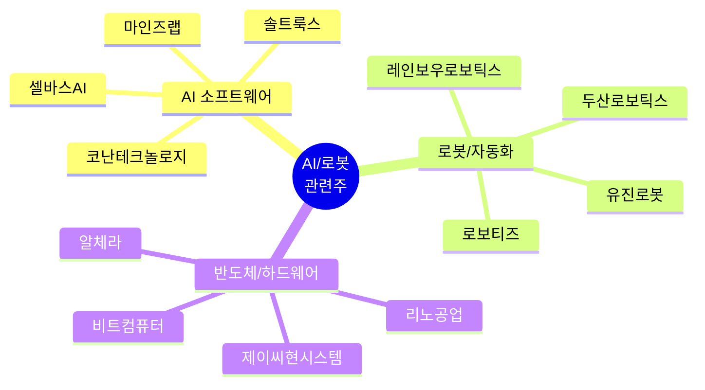
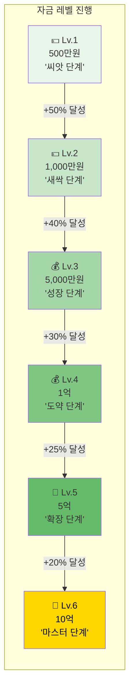
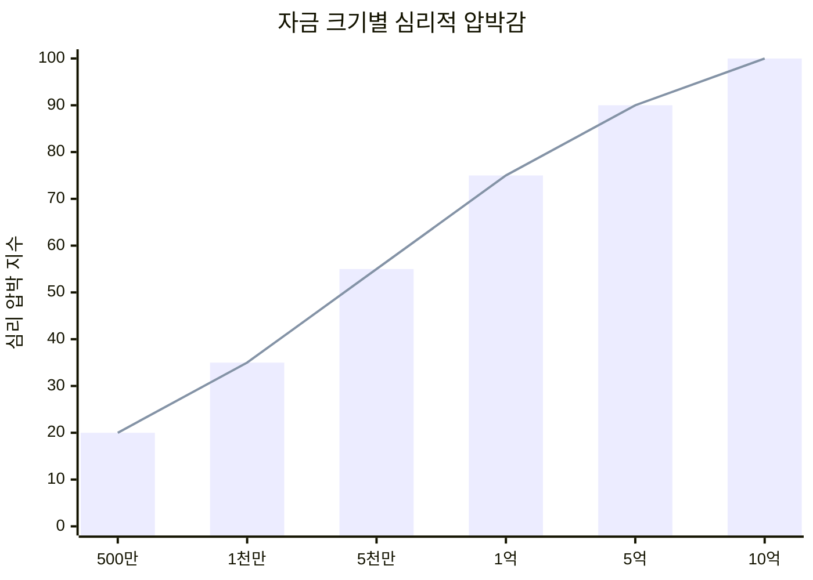
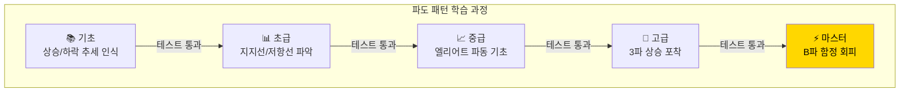
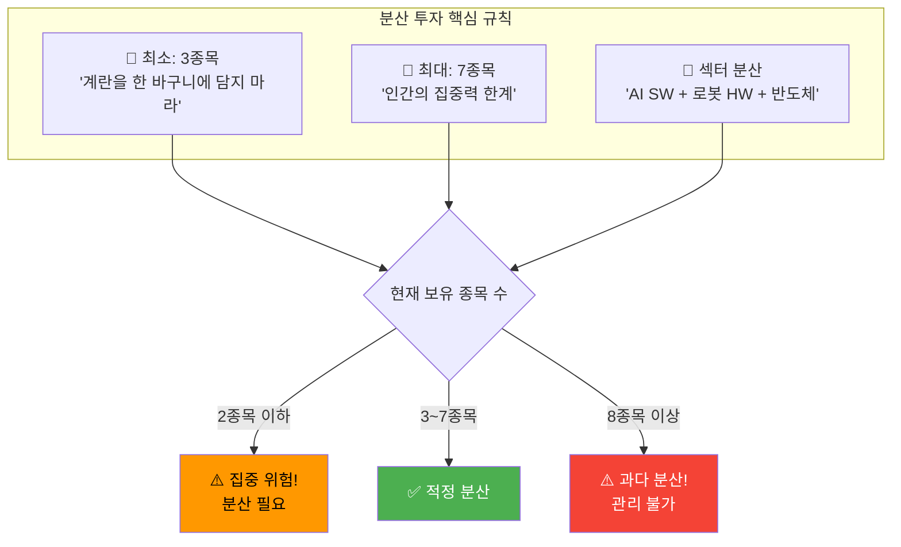
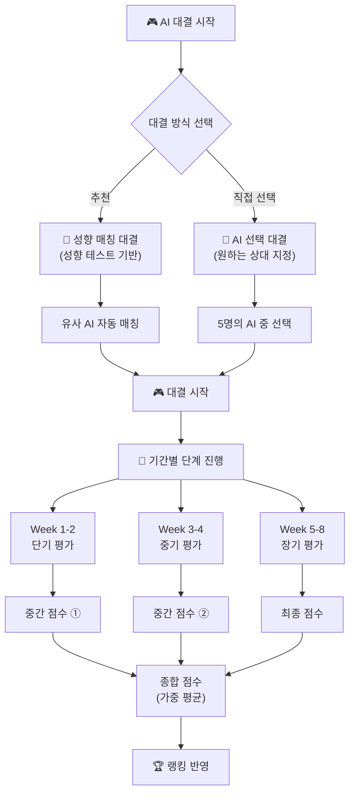
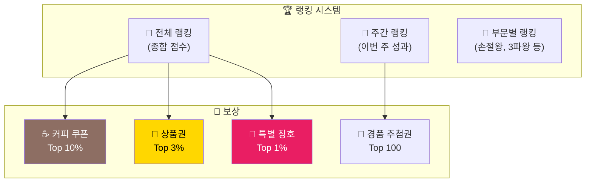
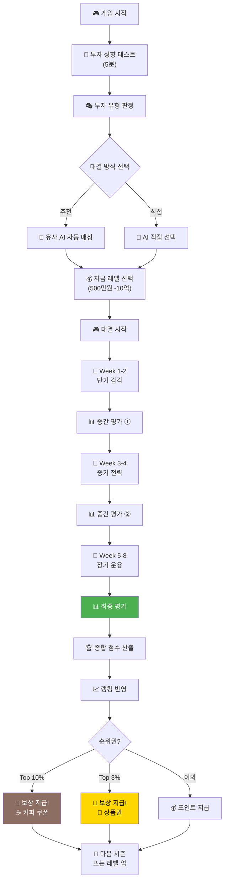
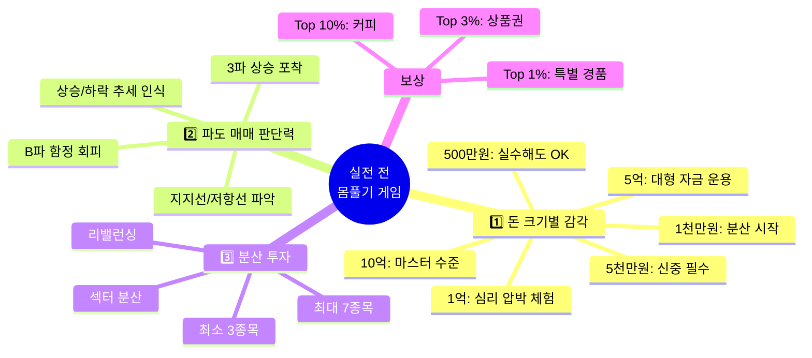

# 🎮 AI 대결 기반 실전 투자 학습 게임
## "실전 전 몸풀기! AI와 함께 투자 감각을 키워라" 🤖💰📈

---

## 📋 문서 정보

**목적**: 실제 주식 투자 시작 전 몸풀기 형식의 학습 게임  
**대상 종목**: AI/로봇 관련주 한정  
**핵심 전략**: 가치투자 제외, 전략적 투자(파도 매매) 집중  
**버전**: v1.0

---

## 🎯 게임 핵심 목표

```
╔═══════════════════════════════════════════════════════════════════╗
║                                                                   ║
║   🎮 "실전 투자 전, AI와 대결하며 감각을 키워라!"                  ║
║                                                                   ║
║   📚 배우는 3가지:                                                 ║
║                                                                   ║
║   1️⃣ 돈 크기별 투자 감각 (500만원 → 10억)                        ║
║   2️⃣ 파도 매매 판단력 (매수/매도 타이밍)                         ║
║   3️⃣ 분산 투자 전략 (3~7개 종목 관리)                            ║
║                                                                   ║
║   🎯 대상: AI/로봇 관련주 (1년 데이터 기반)                        ║
║   🏆 보상: 순위권 진입 시 커피 쿠폰 & 경품!                        ║
║                                                                   ║
╚═══════════════════════════════════════════════════════════════════╝
```

---

## 📊 대상 종목: AI/로봇 관련주

### 선정 종목 리스트 (12개)



### 종목별 특성

| 종목 | 변동성 | 난이도 | 특징 |
|------|--------|--------|------|
| 🤖 레인보우로보틱스 | 매우 높음 | ★★★★★ | 급등락 심함, 테마주 |
| 🤖 두산로보틱스 | 높음 | ★★★★☆ | 대형주, 안정적 |
| 🧠 솔트룩스 | 높음 | ★★★★☆ | AI 대장주 |
| 🧠 마인즈랩 | 매우 높음 | ★★★★★ | 급등락, 뉴스 민감 |
| 🧠 셀바스AI | 중간 | ★★★☆☆ | 적당한 변동 |
| 🔧 로보티즈 | 중간 | ★★★☆☆ | 안정적 흐름 |
| 🔧 유진로봇 | 높음 | ★★★★☆ | 실적 연동 |
| 💾 리노공업 | 낮음 | ★★☆☆☆ | 안정적, 초보 추천 |
| 💾 알체라 | 중간 | ★★★☆☆ | AI 영상인식 |
| 💻 비트컴퓨터 | 중간 | ★★★☆☆ | 안정적 성장 |
| 🔧 제이씨현시스템 | 낮음 | ★★☆☆☆ | 저변동, 안정적 |
| 🧠 코난테크놀로지 | 높음 | ★★★★☆ | AI 검색 엔진 |

---

## 💰 1단계: 돈 크기별 투자 감각

### 6단계 자금 레벨 시스템



### 레벨별 학습 포인트

```
┌─────────────────────────────────────────────────────────────────┐
│ 💵 Lv.1: 500만원 (씨앗 단계)                                     │
├─────────────────────────────────────────────────────────────────┤
│                                                                 │
│ 🎯 학습 목표:                                                    │
│ • "소액으로 감각 익히기"                                        │
│ • 1~2종목 집중 투자                                             │
│ • 손절/익절 기본 규칙 체화                                      │
│                                                                 │
│ 📊 투자 규칙:                                                    │
│ • 최소 분산: 1~2종목                                            │
│ • 1회 매수 한도: 250만원 (50%)                                  │
│ • 권장 손절: -5%                                                │
│ • 권장 익절: +10%                                               │
│                                                                 │
│ 💡 핵심 교훈:                                                    │
│ "500만원은 한 번 실수해도 복구 가능한 금액.                     │
│  여기서 실수 많이 하고 배워라!"                                 │
│                                                                 │
│ 🎮 미션:                                                         │
│ • 10회 거래 완료                                                │
│ • 손절 3회 이상 실행                                            │
│ • 총 수익 +50% 달성 (750만원)                                   │
│                                                                 │
│ ⏰ 기간: 시뮬레이션 30일 (실제 1주 플레이)                       │
│                                                                 │
└─────────────────────────────────────────────────────────────────┘

┌─────────────────────────────────────────────────────────────────┐
│ 💵 Lv.2: 1,000만원 (새싹 단계)                                   │
├─────────────────────────────────────────────────────────────────┤
│                                                                 │
│ 🎯 학습 목표:                                                    │
│ • "분산 투자 시작"                                              │
│ • 2~3종목 관리                                                  │
│ • 비중 조절 감각 익히기                                         │
│                                                                 │
│ 📊 투자 규칙:                                                    │
│ • 최소 분산: 2종목 필수                                         │
│ • 1회 매수 한도: 400만원 (40%)                                  │
│ • 1종목 최대 비중: 60%                                          │
│ • 권장 손절: -5%                                                │
│ • 권장 익절: +12%                                               │
│                                                                 │
│ 💡 핵심 교훈:                                                    │
│ "1천만원부터는 분산이 필수!                                     │
│  한 종목에 몰빵하면 멘탈이 흔들린다."                           │
│                                                                 │
│ 🎮 미션:                                                         │
│ • 항상 2종목 이상 보유 유지                                     │
│ • 리밸런싱 5회 이상                                             │
│ • 총 수익 +40% 달성 (1,400만원)                                 │
│                                                                 │
│ ⏰ 기간: 시뮬레이션 60일 (실제 2주 플레이)                       │
│                                                                 │
└─────────────────────────────────────────────────────────────────┘

┌─────────────────────────────────────────────────────────────────┐
│ 💰 Lv.3: 5,000만원 (성장 단계)                                   │
├─────────────────────────────────────────────────────────────────┤
│                                                                 │
│ 🎯 학습 목표:                                                    │
│ • "본격 분산 투자"                                              │
│ • 3~5종목 동시 관리                                             │
│ • 섹터별 분산 개념                                              │
│                                                                 │
│ 📊 투자 규칙:                                                    │
│ • 최소 분산: 3종목 필수 ⭐                                      │
│ • 1회 매수 한도: 1,500만원 (30%)                                │
│ • 1종목 최대 비중: 40%                                          │
│ • 현금 비중: 최소 10% 유지                                      │
│                                                                 │
│ 💡 핵심 교훈:                                                    │
│ "5천만원은 직장인 1~2년 저축액.                                 │
│  잃으면 정말 아프다. 신중하게!"                                 │
│                                                                 │
│ 🎮 미션:                                                         │
│ • 항상 3종목 이상 보유                                          │
│ • MDD -10% 이내 유지                                            │
│ • 총 수익 +30% 달성 (6,500만원)                                 │
│                                                                 │
│ ⏰ 기간: 시뮬레이션 90일 (실제 3주 플레이)                       │
│                                                                 │
└─────────────────────────────────────────────────────────────────┘

┌─────────────────────────────────────────────────────────────────┐
│ 💰 Lv.4: 1억 (도약 단계)                                         │
├─────────────────────────────────────────────────────────────────┤
│                                                                 │
│ 🎯 학습 목표:                                                    │
│ • "억 단위 투자 심리"                                           │
│ • 4~5종목 체계적 관리                                           │
│ • 손익 금액의 심리적 충격 대비                                  │
│                                                                 │
│ 📊 투자 규칙:                                                    │
│ • 최소 분산: 4종목 필수                                         │
│ • 1회 매수 한도: 2,500만원 (25%)                                │
│ • 1종목 최대 비중: 35%                                          │
│ • 현금 비중: 최소 15% 유지                                      │
│                                                                 │
│ 💡 핵심 교훈:                                                    │
│ "1억이면 -5%가 500만원.                                         │
│  하루에 월급이 날아갈 수 있다.                                  │
│  숫자가 커지면 감정도 커진다!"                                  │
│                                                                 │
│ 🎮 미션:                                                         │
│ • 감정 체크 100% 실행                                           │
│ • 1회 손실 -3% 이내 유지                                        │
│ • 총 수익 +25% 달성 (1.25억)                                    │
│                                                                 │
│ ⏰ 기간: 시뮬레이션 120일 (실제 4주 플레이)                      │
│                                                                 │
└─────────────────────────────────────────────────────────────────┘

┌─────────────────────────────────────────────────────────────────┐
│ 💎 Lv.5: 5억 (확장 단계)                                         │
├─────────────────────────────────────────────────────────────────┤
│                                                                 │
│ 🎯 학습 목표:                                                    │
│ • "대형 자금 운용"                                              │
│ • 5~7종목 포트폴리오                                            │
│ • 유동성 고려한 매매                                            │
│                                                                 │
│ 📊 투자 규칙:                                                    │
│ • 최소 분산: 5종목 필수                                         │
│ • 1회 매수 한도: 1억 (20%)                                      │
│ • 1종목 최대 비중: 30%                                          │
│ • 현금 비중: 최소 20% 유지                                      │
│                                                                 │
│ 💡 핵심 교훈:                                                    │
│ "5억은 집 한 채 값.                                             │
│  이제 '투자'가 아니라 '자산 운용'이다.                          │
│  한 종목에 2억 넣으면 밤에 잠이 안 온다."                       │
│                                                                 │
│ 🎮 미션:                                                         │
│ • 5종목 이상 균형 유지                                          │
│ • 월간 MDD -8% 이내                                             │
│ • 총 수익 +20% 달성 (6억)                                       │
│                                                                 │
│ ⏰ 기간: 시뮬레이션 180일 (실제 6주 플레이)                      │
│                                                                 │
└─────────────────────────────────────────────────────────────────┘

┌─────────────────────────────────────────────────────────────────┐
│ 👑 Lv.6: 10억 (마스터 단계)                                      │
├─────────────────────────────────────────────────────────────────┤
│                                                                 │
│ 🎯 학습 목표:                                                    │
│ • "전문 투자자 수준"                                            │
│ • 7종목 한계 관리                                               │
│ • 체계적 리스크 관리                                            │
│                                                                 │
│ 📊 투자 규칙:                                                    │
│ • 최소 분산: 5종목                                              │
│ • 최대 분산: 7종목 ⭐ (인간 한계)                               │
│ • 1회 매수 한도: 1.5억 (15%)                                    │
│ • 1종목 최대 비중: 25%                                          │
│ • 현금 비중: 최소 25% 유지                                      │
│                                                                 │
│ 💡 핵심 교훈:                                                    │
│ "10억 운용자는 7종목이 한계.                                    │
│  8종목 이상은 관리가 안 된다.                                   │
│  선택과 집중, 그리고 리스크 관리!"                              │
│                                                                 │
│ 🎮 미션:                                                         │
│ • 7종목 이내 유지 (초과 시 페널티)                              │
│ • 연간 MDD -15% 이내                                            │
│ • 총 수익 +15% 달성 (11.5억)                                    │
│                                                                 │
│ ⏰ 기간: 시뮬레이션 365일 (실제 8주 플레이)                      │
│                                                                 │
│ 🏆 클리어 시: "투자 마스터" 칭호 + 최종 랭킹 반영               │
│                                                                 │
└─────────────────────────────────────────────────────────────────┘
```

### 자금 레벨별 심리 변화



---

## 🌊 2단계: 파도 매매 판단력

### 파도 패턴 학습 체계



### 파도별 매수/매도 판단 기준

```
┌─────────────────────────────────────────────────────────────────┐
│ 🌊 파도 매매 판단 가이드                                         │
├─────────────────────────────────────────────────────────────────┤
│                                                                 │
│ 📈 1파: 시작의 파도                                              │
│ ┌─────────────────────────────────────────────────────────────┐ │
│ │                                                             │ │
│ │     ┌───┐                                                   │ │
│ │    /     \        ← 1파 고점                                │ │
│ │   /       \                                                 │ │
│ │  /         \      ← 2파 저점 (매수 포인트!)                 │ │
│ │ ×           \                                               │ │
│ │              \                                              │ │
│ │                                                             │ │
│ └─────────────────────────────────────────────────────────────┘ │
│                                                                 │
│ 🎯 판단 기준:                                                    │
│ • 거래량 증가 확인 (+50% 이상)                                  │
│ • 전 저점 대비 +5% 이상 상승                                    │
│ • 뉴스/재료 확인                                                │
│                                                                 │
│ ✅ 매수 타이밍: 2파 저점 (1파의 38~62% 되돌림)                  │
│ ⚠️ 위험: 1파 맞는지 확신 어려움                                 │
│                                                                 │
├─────────────────────────────────────────────────────────────────┤
│                                                                 │
│ 🚀 3파: 황금의 파도 (가장 큰 수익!)                              │
│ ┌─────────────────────────────────────────────────────────────┐ │
│ │                                                             │ │
│ │                    /\                                       │ │
│ │                   /  \     ← 3파 고점 (익절!)              │ │
│ │                  /    \                                     │ │
│ │      /\        /      \                                     │ │
│ │     /  \      /        \                                    │ │
│ │    /    \    /          \   ← 4파 저점                      │ │
│ │   /      \  / ← 3파 시작 (매수!)                            │ │
│ │  /        \/                                                │ │
│ │ /                                                           │ │
│ │                                                             │ │
│ └─────────────────────────────────────────────────────────────┘ │
│                                                                 │
│ 🎯 판단 기준:                                                    │
│ • 거래량 폭발 (+100% 이상)                                      │
│ • 1파 고점 돌파                                                 │
│ • 뉴스 연일 보도                                                │
│                                                                 │
│ ✅ 매수 타이밍: 1파 고점 돌파 시점                               │
│ ✅ 익절 타이밍: 3파 = 1파 × 1.618 도달 시                       │
│ ⭐ 핵심: "3파를 잡으면 대박!"                                    │
│                                                                 │
├─────────────────────────────────────────────────────────────────┤
│                                                                 │
│ ⚠️ B파: 함정의 파도 (가장 위험!)                                 │
│ ┌─────────────────────────────────────────────────────────────┐ │
│ │                                                             │ │
│ │           /\                                                │ │
│ │          /  \                                               │ │
│ │         /    \  A파 하락                                    │ │
│ │        /      \                                             │ │
│ │       /        \   /\   ← B파 반등 (함정!)                  │ │
│ │      /          \ /  \                                      │ │
│ │                  ×    \                                     │ │
│ │                        \   ← C파 폭락                       │ │
│ │                         \                                   │ │
│ │                          \                                  │ │
│ │                                                             │ │
│ └─────────────────────────────────────────────────────────────┘ │
│                                                                 │
│ 🎯 판단 기준 (함정 신호):                                        │
│ • 거래량 감소 (-20% 이상) ⚠️                                    │
│ • 반등폭 A파의 38~62%                                          │
│ • 뉴스 소강 상태                                                │
│                                                                 │
│ ❌ 절대 금지: B파에서 매수하면 C파 폭락에 물림!                  │
│ ✅ 정답: 관망 또는 숏 포지션                                     │
│ ⭐ 핵심: "거래량 없는 반등은 믿지 마라!"                         │
│                                                                 │
└─────────────────────────────────────────────────────────────────┘
```

### 실전 파도 퀴즈

```
┌─────────────────────────────────────────────────────────────────┐
│ 🎮 파도 판단 퀴즈 (레인보우로보틱스 실제 차트)                   │
├─────────────────────────────────────────────────────────────────┤
│                                                                 │
│ 📊 상황:                                                         │
│                                                                 │
│     ┌───────────────────────────────────────────────┐          │
│ 150k│                              /\               │          │
│     │                             /  \              │          │
│ 140k│              /\            /    \             │          │
│     │             /  \          /      \            │          │
│ 130k│            /    \        /        \  ← 현재   │          │
│     │    /\     /      \      /          \          │          │
│ 120k│   /  \   /        \    /            \         │          │
│     │  /    \ /          \  /              \        │          │
│ 110k│ /      ×            \/                \       │          │
│     │                                        \      │          │
│ 100k│                                         \     │          │
│     └───────────────────────────────────────────────┘          │
│                                                                 │
│ 추가 정보:                                                       │
│ • 현재가: 128,000원                                             │
│ • 전일 대비: +3.2%                                              │
│ • 거래량: 전일 대비 -35% ⚠️                                     │
│                                                                 │
│ ━━━━━━━━━━━━━━━━━━━━━━━━━━━━━━━━━━━━━━━━━━━━━━━━━━━━━━━━━━━  │
│                                                                 │
│ Q. 이 상황에서 당신의 판단은?                                    │
│                                                                 │
│ A) 🚀 매수! 반등 시작이다!                                      │
│                                                                 │
│ B) 🤔 관망. 거래량이 부족하다.                                  │
│                                                                 │
│ C) 📉 B파 함정! 절대 진입 금지.  ⭐ 정답                        │
│                                                                 │
│ D) 💰 소량만 테스트 매수.                                       │
│                                                                 │
│ ━━━━━━━━━━━━━━━━━━━━━━━━━━━━━━━━━━━━━━━━━━━━━━━━━━━━━━━━━━━  │
│                                                                 │
│ 💡 해설:                                                         │
│ • 고점 대비 하락 후 반등 (A파 → B파 의심)                       │
│ • 거래량 -35% = 세력 이탈 신호                                  │
│ • C파 폭락 가능성 높음!                                         │
│                                                                 │
│ 🤖 AI 공격왕의 선택: C (관망)                                   │
│ "거래량 없는 반등? 난 안 속아!"                                 │
│                                                                 │
└─────────────────────────────────────────────────────────────────┘
```

---

## 📊 3단계: 분산 투자 전략

### 분산 투자 규칙



### 포트폴리오 구성 가이드

```
┌─────────────────────────────────────────────────────────────────┐
│ 📊 권장 포트폴리오 구성 (5종목 기준)                             │
├─────────────────────────────────────────────────────────────────┤
│                                                                 │
│ 🥇 핵심 종목 (Core): 2종목, 50%                                  │
│ ├─ 🤖 두산로보틱스 (25%) - 안정적 대형주                        │
│ └─ 🧠 솔트룩스 (25%) - AI 대장주                                │
│                                                                 │
│ 🥈 성장 종목 (Growth): 2종목, 35%                                │
│ ├─ 🤖 레인보우로보틱스 (20%) - 고성장 기대                      │
│ └─ 🧠 마인즈랩 (15%) - 변동성 활용                              │
│                                                                 │
│ 🥉 관찰 종목 (Watch): 1종목, 15%                                 │
│ └─ 💾 알체라 (15%) - 신규 진입 테스트                           │
│                                                                 │
│ ━━━━━━━━━━━━━━━━━━━━━━━━━━━━━━━━━━━━━━━━━━━━━━━━━━━━━━━━━━━  │
│                                                                 │
│ 📈 시각화:                                                       │
│                                                                 │
│ 두산로보틱스  ████████████████████████████ 25%                 │
│ 솔트룩스     ████████████████████████████ 25%                 │
│ 레인보우     ████████████████████ 20%                          │
│ 마인즈랩    ████████████████ 15%                               │
│ 알체라      ████████████████ 15%                               │
│                                                                 │
│ ━━━━━━━━━━━━━━━━━━━━━━━━━━━━━━━━━━━━━━━━━━━━━━━━━━━━━━━━━━━  │
│                                                                 │
│ 💡 분산 포인트:                                                  │
│ • 섹터: AI SW (40%) + 로봇 HW (45%) + 기타 (15%)                │
│ • 변동성: 안정 (50%) + 고변동 (35%) + 테스트 (15%)              │
│ • 시총: 대형 (25%) + 중형 (60%) + 소형 (15%)                    │
│                                                                 │
└─────────────────────────────────────────────────────────────────┘
```

### 리밸런싱 타이밍

```
┌─────────────────────────────────────────────────────────────────┐
│ 🔄 리밸런싱 알림 시스템                                          │
├─────────────────────────────────────────────────────────────────┤
│                                                                 │
│ ⚠️ 리밸런싱 필요 상황:                                           │
│                                                                 │
│ 1️⃣ 비중 이탈 (±10%)                                             │
│    • 레인보우로보틱스: 20% → 32% (+12%) 🔴                      │
│    • 원인: +60% 급등                                            │
│    • 조치: 일부 매도 → 다른 종목 분산                           │
│                                                                 │
│ 2️⃣ 손절 발생                                                    │
│    • 마인즈랩: -7% 손절 실행                                    │
│    • 현금화된 자금: 750만원                                     │
│    • 조치: 다른 종목 추가 매수 또는 현금 유지                   │
│                                                                 │
│ 3️⃣ 종목 수 이탈                                                 │
│    • 현재: 2종목 (최소 3종목 미달)                              │
│    • 조치: 신규 종목 1개 이상 추가                              │
│                                                                 │
│ ━━━━━━━━━━━━━━━━━━━━━━━━━━━━━━━━━━━━━━━━━━━━━━━━━━━━━━━━━━━  │
│                                                                 │
│ 🎮 리밸런싱 미니게임:                                            │
│                                                                 │
│ "30초 안에 포트폴리오를 재조정하라!"                            │
│                                                                 │
│ 현재 상태:                                                       │
│ • 두산로보틱스: 35% (+10% 초과)                                 │
│ • 솔트룩스: 30% (+5% 초과)                                      │
│ • 레인보우: 15% (-5%)                                           │
│ • 마인즈랩: 20% (+5%)                                           │
│ • 현금: 0% (-필요)                                              │
│                                                                 │
│ 목표: 모든 종목 비중을 ±5% 이내로 조정                          │
│                                                                 │
│ [두산 5% 매도] [솔트 5% 매도] [레인보우 5% 매수] [완료]         │
│                                                                 │
└─────────────────────────────────────────────────────────────────┘
```

---

## ⚔️ AI 대결 시스템

### 대결 모드 선택



### 기간별 중간 평가 시스템

```
┌─────────────────────────────────────────────────────────────────┐
│ 📊 기간별 평가 시스템                                            │
├─────────────────────────────────────────────────────────────────┤
│                                                                 │
│ 🎯 핵심 컨셉:                                                    │
│ "최종 점수만이 아닌, 각 기간별 감각 측정!"                      │
│                                                                 │
│ ━━━━━━━━━━━━━━━━━━━━━━━━━━━━━━━━━━━━━━━━━━━━━━━━━━━━━━━━━━━  │
│                                                                 │
│ 📅 Week 1-2: 단기 감각 평가 (30%)                                │
│ ┌─────────────────────────────────────────────────────────────┐ │
│ │                                                             │ │
│ │ 측정 항목:                                                  │ │
│ │ • 빠른 손절 실행력 (40%)                                    │ │
│ │ • 단기 추세 포착 (30%)                                      │ │
│ │ • 감정 통제 (30%)                                           │ │
│ │                                                             │ │
│ │ 평가 기준:                                                  │ │
│ │ • S급: AI 대비 +5%p 이상                                    │ │
│ │ • A급: AI 대비 0~+5%p                                       │ │
│ │ • B급: AI 대비 -5~0%p                                       │ │
│ │ • C급: AI 대비 -5%p 이하                                    │ │
│ │                                                             │ │
│ │ 💰 S급 달성 보너스: +500 포인트                              │ │
│ │                                                             │ │
│ └─────────────────────────────────────────────────────────────┘ │
│                                                                 │
│ 📅 Week 3-4: 중기 전략 평가 (30%)                                │
│ ┌─────────────────────────────────────────────────────────────┐ │
│ │                                                             │ │
│ │ 측정 항목:                                                  │ │
│ │ • 파도 패턴 인식 (40%)                                      │ │
│ │ • 분산 투자 유지 (30%)                                      │ │
│ │ • 리밸런싱 적절성 (30%)                                     │ │
│ │                                                             │ │
│ │ 평가 기준:                                                  │ │
│ │ • S급: 3파 포착 2회 이상 + 분산 유지                        │ │
│ │ • A급: 3파 포착 1회 + 분산 유지                             │ │
│ │ • B급: 분산 유지만 성공                                     │ │
│ │ • C급: 모두 실패                                            │ │
│ │                                                             │ │
│ │ 💰 S급 달성 보너스: +800 포인트                              │ │
│ │                                                             │ │
│ └─────────────────────────────────────────────────────────────┘ │
│                                                                 │
│ 📅 Week 5-8: 장기 운용 평가 (40%)                                │
│ ┌─────────────────────────────────────────────────────────────┐ │
│ │                                                             │ │
│ │ 측정 항목:                                                  │ │
│ │ • 최종 수익률 (40%)                                         │ │
│ │ • MDD 관리 (30%)                                            │ │
│ │ • 일관성 (30%)                                              │ │
│ │                                                             │ │
│ │ 평가 기준:                                                  │ │
│ │ • S급: AI 역전 + MDD -10% 이내                              │ │
│ │ • A급: AI 근접 (±3%p) + MDD -15% 이내                       │ │
│ │ • B급: AI 대비 -10%p 이내                                   │ │
│ │ • C급: AI 대비 -10%p 초과                                   │ │
│ │                                                             │ │
│ │ 💰 S급 달성 보너스: +1,500 포인트                            │ │
│ │                                                             │ │
│ └─────────────────────────────────────────────────────────────┘ │
│                                                                 │
│ ━━━━━━━━━━━━━━━━━━━━━━━━━━━━━━━━━━━━━━━━━━━━━━━━━━━━━━━━━━━  │
│                                                                 │
│ 🏆 종합 점수 계산:                                               │
│                                                                 │
│ 종합 = (단기×30%) + (중기×30%) + (장기×40%)                     │
│                                                                 │
│ 예시:                                                            │
│ • 단기: A급 (85점) × 30% = 25.5점                               │
│ • 중기: S급 (95점) × 30% = 28.5점                               │
│ • 장기: B급 (75점) × 40% = 30점                                 │
│ • 종합: 84점 (A급)                                              │
│                                                                 │
└─────────────────────────────────────────────────────────────────┘
```

### 중간 평가 리포트 예시

```
┌─────────────────────────────────────────────────────────────────┐
│ 📊 Week 2 중간 평가 리포트                                       │
├─────────────────────────────────────────────────────────────────┤
│                                                                 │
│ 👤 플레이어: user_123                                            │
│ 🤖 대결 상대: 균형왕 (⚖️)                                        │
│ 📅 기간: Day 1 ~ Day 14 (시뮬레이션 기준)                        │
│                                                                 │
│ ━━━━━━━━━━━━━━━━━━━━━━━━━━━━━━━━━━━━━━━━━━━━━━━━━━━━━━━━━━━  │
│                                                                 │
│ 📈 수익률 비교:                                                  │
│                                                                 │
│ │ 항목          │ 당신      │ 균형왕    │ 격차      │          │
│ ├───────────────┼───────────┼───────────┼───────────┤          │
│ │ 2주 수익률    │ +8.5%     │ +7.2%     │ +1.3%p ✅ │          │
│ │ 승률          │ 67%       │ 65%       │ +2%p ✅   │          │
│ │ 손절 실행     │ 4/4 (100%)│ 3/3 (100%)│ 동일      │          │
│ │ MDD           │ -6.2%     │ -5.8%     │ -0.4%p    │          │
│                                                                 │
│ ━━━━━━━━━━━━━━━━━━━━━━━━━━━━━━━━━━━━━━━━━━━━━━━━━━━━━━━━━━━  │
│                                                                 │
│ 🎯 단기 감각 평가:                                               │
│                                                                 │
│ • 빠른 손절 실행력: ⭐⭐⭐⭐⭐ (100점)                           │
│   "4번의 손절 상황, 4번 모두 즉시 실행!"                        │
│                                                                 │
│ • 단기 추세 포착: ⭐⭐⭐⭐ (82점)                                │
│   "3파 초기 진입 1회 성공, 타이밍 양호"                         │
│                                                                 │
│ • 감정 통제: ⭐⭐⭐ (68점)                                       │
│   "Day 8 FOMO 매수 1회 발생, 개선 필요"                         │
│                                                                 │
│ ━━━━━━━━━━━━━━━━━━━━━━━━━━━━━━━━━━━━━━━━━━━━━━━━━━━━━━━━━━━  │
│                                                                 │
│ 📊 등급: A급 (85점)                                              │
│ 💰 보너스: +300 포인트 획득!                                     │
│                                                                 │
│ 💡 다음 기간 조언:                                               │
│ "손절은 완벽! FOMO만 조절하면 S급 가능합니다.                   │
│  급등 시 10분 대기 규칙을 적용해보세요!"                        │
│                                                                 │
│ [다음 기간 시작] [상세 분석 보기] [포트폴리오 조정]             │
│                                                                 │
└─────────────────────────────────────────────────────────────────┘
```

---

## 🏆 랭킹 & 보상 시스템

### 전체 랭킹 구조



### 보상 상세

```
┌─────────────────────────────────────────────────────────────────┐
│ 🎁 보상 시스템                                                   │
├─────────────────────────────────────────────────────────────────┤
│                                                                 │
│ 🏆 시즌 종합 랭킹 보상 (8주 기준):                               │
│                                                                 │
│ ┌─────────────────────────────────────────────────────────────┐ │
│ │ 🥇 Top 1% (1~10위)                                          │ │
│ │ • 스타벅스 3만원권                                          │ │
│ │ • "시즌 챔피언" 한정 칭호                                   │ │
│ │ • 프리미엄 아바타                                           │ │
│ │ • 다음 시즌 VIP 혜택                                        │ │
│ └─────────────────────────────────────────────────────────────┘ │
│                                                                 │
│ ┌─────────────────────────────────────────────────────────────┐ │
│ │ 🥈 Top 3% (11~30위)                                         │ │
│ │ • 스타벅스 1만원권                                          │ │
│ │ • "엘리트 투자자" 칭호                                      │ │
│ │ • 특별 아바타                                               │ │
│ └─────────────────────────────────────────────────────────────┘ │
│                                                                 │
│ ┌─────────────────────────────────────────────────────────────┐ │
│ │ 🥉 Top 10% (31~100위)                                       │ │
│ │ • 커피 쿠폰 5,000원                                         │ │
│ │ • "실력자" 칭호                                             │ │
│ │ • 게임 내 포인트 2,000                                      │ │
│ └─────────────────────────────────────────────────────────────┘ │
│                                                                 │
│ ┌─────────────────────────────────────────────────────────────┐ │
│ │ 📅 주간 MVP (매주 1명)                                       │ │
│ │ • 커피 쿠폰 3,000원                                         │ │
│ │ • "이번 주의 투자자" 표시                                   │ │
│ │ • 포인트 1,000                                              │ │
│ └─────────────────────────────────────────────────────────────┘ │
│                                                                 │
│ ┌─────────────────────────────────────────────────────────────┐ │
│ │ 🎯 부문별 1위 (각 부문당 1명)                                │ │
│ │                                                             │ │
│ │ • 손절왕 (손절 실행률 1위): 칭호 + 500P                     │ │
│ │ • 3파왕 (3파 포착 최다): 칭호 + 500P                        │ │
│ │ • 균형왕 (분산투자 점수 1위): 칭호 + 500P                   │ │
│ │ • 철벽왕 (MDD 최저): 칭호 + 500P                            │ │
│ │ • 스피드왕 (반응속도 1위): 칭호 + 500P                      │ │
│ │                                                             │ │
│ └─────────────────────────────────────────────────────────────┘ │
│                                                                 │
│ ━━━━━━━━━━━━━━━━━━━━━━━━━━━━━━━━━━━━━━━━━━━━━━━━━━━━━━━━━━━  │
│                                                                 │
│ 🎰 특별 이벤트 보상:                                             │
│                                                                 │
│ • AI 5인 전원 격파: 경품 추첨권 1장                             │
│ • 10억 단계 클리어: 경품 추첨권 2장                             │
│ • 올 S급 달성: 경품 추첨권 3장                                  │
│                                                                 │
│ 🎁 경품 추첨 (시즌 종료 시):                                     │
│ • 1등: 에어팟 프로 (1명)                                        │
│ • 2등: 배달 상품권 5만원 (3명)                                  │
│ • 3등: 커피 상품권 1만원 (10명)                                 │
│                                                                 │
└─────────────────────────────────────────────────────────────────┘
```

### 랭킹 화면 UI

```
┌─────────────────────────────────────────────────────────────────┐
│ 🏆 시즌 3 랭킹                              📅 D-12 종료         │
├─────────────────────────────────────────────────────────────────┤
│                                                                 │
│ 🔥 Top 10                                                       │
│                                                                 │
│  순위  플레이어       점수    수익률   특징                      │
│ ━━━━━━━━━━━━━━━━━━━━━━━━━━━━━━━━━━━━━━━━━━━━━━━━━━━━━━━━━━━  │
│  🥇   stock_master   9,850   +42.3%  3파왕 👑                   │
│  🥈   wave_rider     9,720   +38.7%  손절왕 🛡️                  │
│  🥉   ai_hunter      9,650   +35.2%  균형왕 ⚖️                  │
│   4   lucky_trader   9,580   +33.8%  -                          │
│   5   steady_kim     9,520   +31.5%  철벽왕 🏰                  │
│  ...                                                            │
│  42   👤 나 (user_123) 8,450  +22.1%  스피드왕 ⚡                │
│                                                                 │
│ ━━━━━━━━━━━━━━━━━━━━━━━━━━━━━━━━━━━━━━━━━━━━━━━━━━━━━━━━━━━  │
│                                                                 │
│ 📊 내 위치: 42위 / 1,247명 (Top 3.4%)                           │
│ 🎁 현재 보상 예상: 커피 쿠폰 5,000원                            │
│                                                                 │
│ 💡 Top 30 진입까지: +870점 필요 (수익률 +5%p 추가 시 달성)      │
│                                                                 │
│ [상세 분석] [도전하기] [친구 순위]                              │
│                                                                 │
└─────────────────────────────────────────────────────────────────┘
```

---

## 🎮 전체 게임 플로우



---

## 📋 핵심 규칙 요약

### 필수 규칙 체크리스트

```
┌─────────────────────────────────────────────────────────────────┐
│ ✅ 핵심 규칙 체크리스트                                          │
├─────────────────────────────────────────────────────────────────┤
│                                                                 │
│ 📊 분산 투자:                                                    │
│ ☐ 최소 3종목 이상 보유                                          │
│ ☐ 최대 7종목 이하 유지 (인간 한계)                              │
│ ☐ 1종목 최대 비중 40% 이하                                      │
│ ☐ 섹터별 분산 (AI SW + 로봇 HW + 기타)                          │
│                                                                 │
│ 💰 자금 관리:                                                    │
│ ☐ 레벨별 현금 비중 유지                                         │
│ ☐ 1회 매수 한도 준수                                            │
│ ☐ 레벨 미션 수익률 달성                                         │
│                                                                 │
│ 🌊 파도 매매:                                                    │
│ ☐ 거래량 확인 후 매수                                           │
│ ☐ B파 함정 회피                                                 │
│ ☐ 3파 포착 시도                                                 │
│ ☐ 손절 라인 준수                                                │
│                                                                 │
│ 🎯 대상 종목:                                                    │
│ ☐ AI/로봇 관련주만 거래                                         │
│ ☐ 12개 지정 종목 내에서 선택                                    │
│                                                                 │
│ ⚠️ 금지 사항:                                                    │
│ ☐ 가치투자 전략 (장기 보유 목적 X)                              │
│ ☐ 8종목 이상 동시 보유                                          │
│ ☐ 올인 (100% 단일 종목)                                         │
│                                                                 │
└─────────────────────────────────────────────────────────────────┘
```

---

## 🎯 학습 목표 요약



---

**문서 버전**: v1.0  
**최종 업데이트**: 2024.12.07  
**핵심 컨셉**: 실전 투자 전 AI와 대결하며 감각 키우기! 🎮📈🤖


