# 투자자 유형 세밀 분류 & AI 대결 시스템
## "나와 가장 비슷한 AI를 찾아 함께 성장하자" 🎯📊🤖

---

## 📋 문서 정보

**목적**: 투자자 성격/행동 패턴 세분화 및 AI 매칭 대결 시스템  
**버전**: v1.0  
**최종 업데이트**: 2024.12.07

---

## 🎯 투자자 유형 분류 체계 개요

### 3차원 분류 시스템

```mermaid
flowchart TB
    subgraph Level1["1차: 리스크 성향 (5단계)"]
        R1["🛡️ 초보수<br/>Risk 10%"]
        R2["🧘 안정<br/>Risk 30%"]
        R3["⚖️ 균형<br/>Risk 50%"]
        R4["⚡ 공격<br/>Risk 70%"]
        R5["🔥 초공격<br/>Risk 90%"]
    end
    
    subgraph Level2["2차: 의사결정 스타일 (4단계)"]
        D1["📊 분석형<br/>데이터 중심"]
        D2["💭 직관형<br/>감각 중심"]
        D3["🔄 추종형<br/>트렌드 따름"]
        D4["🎯 원칙형<br/>규칙 준수"]
    end
    
    subgraph Level3["3차: 감정 패턴 (4단계)"]
        E1["😌 침착형<br/>감정 통제 우수"]
        E2["😰 불안형<br/>손실 민감"]
        E3["😍 탐욕형<br/>FOMO 강함"]
        E4["😤 복수형<br/>손실 만회 집착"]
    end
    
    Level1 --> Level2
    Level2 --> Level3
    Level3 --> Match["🤖 AI 경쟁자 매칭"]
    ◊
    style Level1 fill:#e3f2fd,color:#111
    style Level2 fill:#fff3e0,color:#111
    style Level3 fill:#fce4ec,color:#111
    style Match fill:#c8e6c9,color:#111
```

---

## 🧬 1차 분류: 리스크 성향 (5단계)

### 리스크 성향 스펙트럼

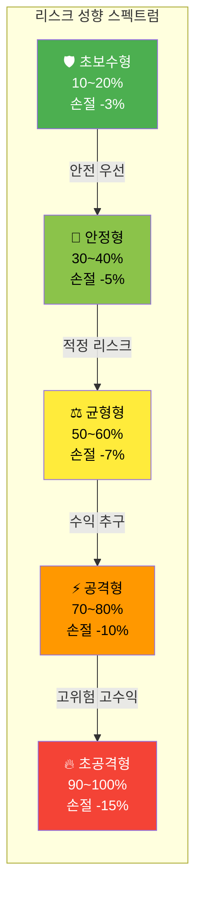

### 1-1. 🛡️ 초보수형 (Ultra-Conservative)

| 항목 | 상세 |
|------|------|
| **투자 비중** | 10~20% (대부분 현금 보유) |
| **손절 라인** | -3% (매우 빠른 손절) |
| **익절 라인** | +5~8% (안정적 수익 확보) |
| **보유 기간** | 1~3일 (단기) |
| **선호 종목** | 대형주, 배당주, 금융주 |
| **MDD 허용** | -5% 이내 |

**성격 특징**:
- 손실에 대한 극도의 두려움
- 확실한 것만 추구
- 기회비용에 둔감
- 안전 마진 최우선

**행동 패턴**:
```
급등 시 → 관망 (FOMO 없음)
급락 시 → 즉시 손절
횡보 시 → 편안함 느낌
고점 돌파 → 진입 안 함
```

---

### 1-2. 🧘 안정형 (Stable)

| 항목 | 상세 |
|------|------|
| **투자 비중** | 30~40% |
| **손절 라인** | -5% |
| **익절 라인** | +8~12% |
| **보유 기간** | 5~10일 |
| **선호 종목** | 우량주, ETF, 안정 성장주 |
| **MDD 허용** | -8% 이내 |

**성격 특징**:
- 인내심이 강함
- 장기적 관점 보유
- 감정 기복 적음
- 계획적 투자

**행동 패턴**:
```
급등 시 → 일부만 진입
급락 시 → 지지선 확인 후 결정
횡보 시 → 분할 매수 준비
고점 돌파 → 조정 대기
```

---

### 1-3. ⚖️ 균형형 (Balanced)

| 항목 | 상세 |
|------|------|
| **투자 비중** | 50~60% |
| **손절 라인** | -7% |
| **익절 라인** | +12~15% |
| **보유 기간** | 3~7일 |
| **선호 종목** | 성장주, 변동형, 테마주 |
| **MDD 허용** | -12% 이내 |

**성격 특징**:
- 유연한 사고
- 상황 판단력 우수
- 리스크/리턴 최적화 추구
- 다양한 전략 구사

**행동 패턴**:
```
급등 시 → 30~50% 진입 후 추가 판단
급락 시 → 분석 후 기회 포착
횡보 시 → 돌파 대기
고점 돌파 → 적극 진입
```

---

### 1-4. ⚡ 공격형 (Aggressive)

| 항목 | 상세 |
|------|------|
| **투자 비중** | 70~80% |
| **손절 라인** | -10% |
| **익절 라인** | +15~25% |
| **보유 기간** | 1~5일 |
| **선호 종목** | 고변동주, 테마주, 성장주 |
| **MDD 허용** | -18% 이내 |

**성격 특징**:
- 승부욕 강함
- 기회 포착 능력 우수
- 높은 집중력
- 빠른 판단력

**행동 패턴**:
```
급등 시 → 즉시 진입 (기회 포착)
급락 시 → 반등 기회 노림
횡보 시 → 지루해함
고점 돌파 → 강하게 진입
```

---

### 1-5. 🔥 초공격형 (Ultra-Aggressive)

| 항목 | 상세 |
|------|------|
| **투자 비중** | 90~100% (올인 성향) |
| **손절 라인** | -15% (배수의 진) |
| **익절 라인** | +25~50% (대박 노림) |
| **보유 기간** | 당일~3일 |
| **선호 종목** | 급등주, 테마주, 고변동주 |
| **MDD 허용** | -25% 이상 감수 |

**성격 특징**:
- 극도의 승부욕
- 한 방 집착
- 리스크 감수 높음
- 감정 기복 심함

**행동 패턴**:
```
급등 시 → 올인 (FOMO 극심)
급락 시 → 물타기 시도
횡보 시 → 다른 종목 탐색
고점 돌파 → 추격 매수
```

---

## 🧠 2차 분류: 의사결정 스타일 (4단계)

### 의사결정 유형 다이어그램

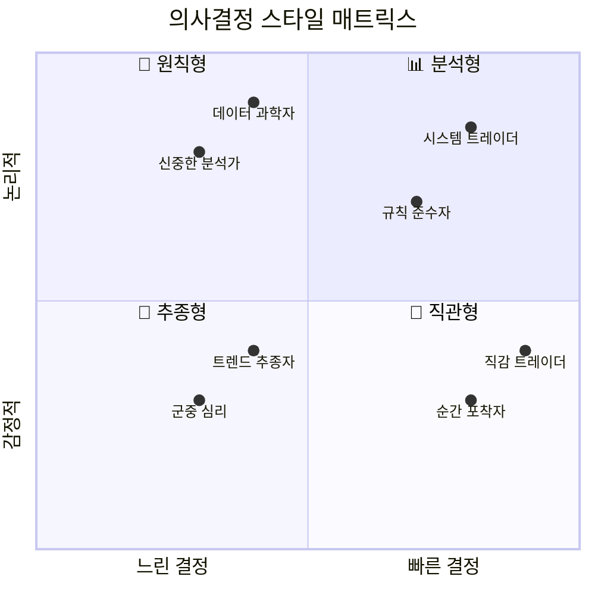

### 2-1. 📊 분석형 (Analytical)

**특징**:
- 차트 패턴, 재무제표, 뉴스 종합 분석
- 결정까지 시간 소요 (30분~수시간)
- 높은 정확도, 낮은 기회 포착
- 과분석 함정 주의

**강점**: 정확한 판단, 함정 회피 능력
**약점**: 의사결정 지연, 기회 상실

**추천 AI 멘토**: 균형왕, 안정왕

---

### 2-2. 💭 직관형 (Intuitive)

**특징**:
- 차트 느낌, 장 분위기로 판단
- 결정 시간 3초 이내
- 빠른 기회 포착, 실수 가능성 높음
- FOMO에 취약

**강점**: 빠른 대응, 기회 포착
**약점**: 충동적 실수, 함정 빠짐

**추천 AI 멘토**: 공격왕 (+ 안정왕 보조)

---

### 2-3. 🔄 추종형 (Follower)

**특징**:
- 전문가 의견, 유튜브, 뉴스 따름
- 다수의 의견에 동조
- 트렌드 후반 진입 경향
- 독자적 판단 부족

**강점**: 큰 실수 방지, 안정적
**약점**: 후발 진입, 낮은 수익률

**추천 AI 멘토**: 안정왕 (기본기 학습)

---

### 2-4. 🎯 원칙형 (Rule-Based)

**특징**:
- 사전 정한 규칙 100% 준수
- 감정 개입 최소화
- 시스템 트레이딩 성향
- 기계적 실행

**강점**: 일관성, 감정 통제, 손절 실행
**약점**: 유연성 부족, 예외 상황 대응

**추천 AI 멘토**: 보수왕, 안정왕

---

## 💭 3차 분류: 감정 패턴 (4단계)

### 감정 유형 순환 다이어그램

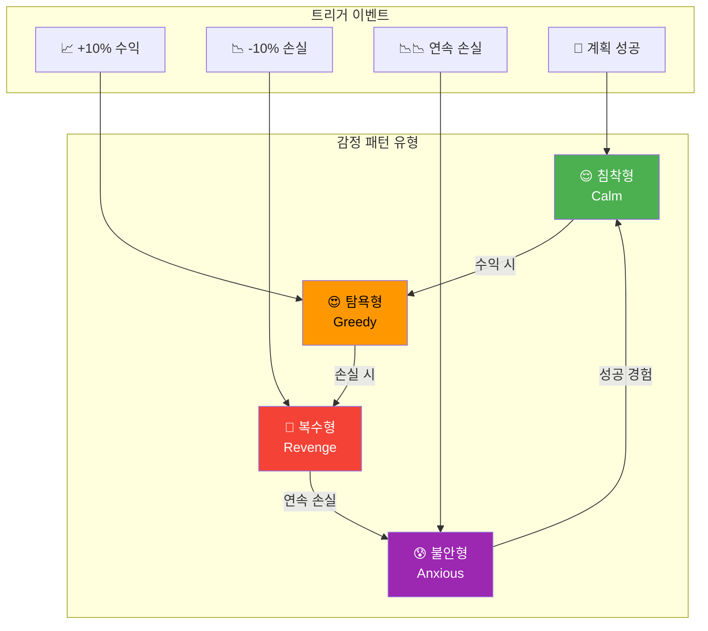

### 3-1. 😌 침착형 (Calm)

**감정 지표**:
- 탐욕 지수: 20~40
- 공포 지수: 20~40
- 분노 지수: 10~20

**행동 특성**:
```
수익 시 → "계획대로" (과욕 없음)
손실 시 → "분석해보자" (감정적 반응 없음)
급등 시 → "기다리자" (FOMO 저항)
급락 시 → "지지선 확인" (패닉 없음)
```

**성공률**: 가장 높음 (평균 +65%)

---

### 3-2. 😰 불안형 (Anxious)

**감정 지표**:
- 탐욕 지수: 20~30
- 공포 지수: 70~90
- 분노 지수: 20~40

**행동 특성**:
```
수익 시 → "빨리 팔아야지" (조기 익절)
손실 시 → "어떡하지!" (패닉 손절)
급등 시 → "무서워..." (진입 못함)
급락 시 → "대참사!" (과잉 반응)
```

**개선 포인트**: 손절가 사전 설정, 타임 프리즈 활용

---

### 3-3. 😍 탐욕형 (Greedy)

**감정 지표**:
- 탐욕 지수: 80~95
- 공포 지수: 20~30
- 분노 지수: 30~50

**행동 특성**:
```
수익 시 → "더 올라갈 거야!" (익절 지연)
손실 시 → "곧 반등해" (손절 지연)
급등 시 → "지금 들어가야 해!" (FOMO)
급락 시 → "싸게 살 기회!" (무계획 매수)
```

**개선 포인트**: 익절/손절 자동화, 감정 체크 필수

---

### 3-4. 😤 복수형 (Revenge)

**감정 지표**:
- 탐욕 지수: 60~80
- 공포 지수: 30~50
- 분노 지수: 80~95

**행동 특성**:
```
수익 시 → "이 정도론 부족해" (만족 못함)
손실 시 → "만회해야 해!" (무리한 베팅)
급등 시 → "놓친 거 만회!" (충동 매수)
급락 시 → "복수할 거야!" (물타기)
```

**개선 포인트**: 손실 후 24시간 휴식, 감정 일기

---

## 🔗 20가지 세부 투자자 유형

### 3차원 조합 매트릭스

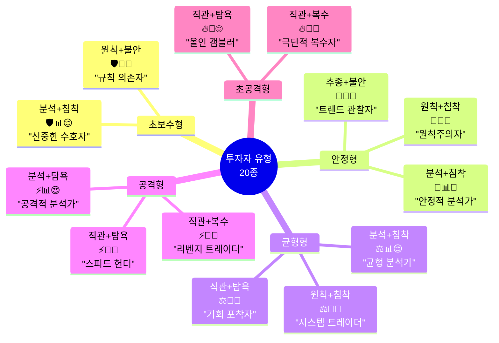

### 상위 10개 대표 유형

| # | 조합 | 유형명 | 특징 | 추천 AI |
|---|------|--------|------|---------|
| 1 | 🧘📊😌 | 안정적 분석가 | 가장 이상적, 일관된 수익 | 안정왕 |
| 2 | ⚖️📊😌 | 균형 분석가 | 높은 수익률, 안정성 | 균형왕 |
| 3 | 🛡️🎯😌 | 원칙 수호자 | 손실 최소화, 꾸준함 | 보수왕 |
| 4 | ⚖️🎯😌 | 시스템 트레이더 | 기계적 실행, 감정 배제 | 균형왕 |
| 5 | ⚡📊😌 | 공격적 분석가 | 높은 수익, 높은 리스크 | 공격왕 |
| 6 | 🧘🔄😰 | 신중한 추종자 | 안전 위주, 성장 느림 | 안정왕 |
| 7 | ⚖️💭😍 | 기회 포착자 | 빠른 대응, FOMO 주의 | 균형왕 |
| 8 | ⚡💭😍 | 스피드 헌터 | 고수익 가능, 고손실 위험 | 공격왕+안정왕 |
| 9 | 🔥💭😍 | 올인 갬블러 | 대박/대손실, 매우 위험 | 안정왕(필수) |
| 10 | ⚡💭😤 | 리벤지 트레이더 | 복수매매 위험, 교정 필요 | 보수왕+상담 |

---

## 🤖 AI 경쟁자 상세 매칭 시스템

### AI 경쟁자 5인 프로필

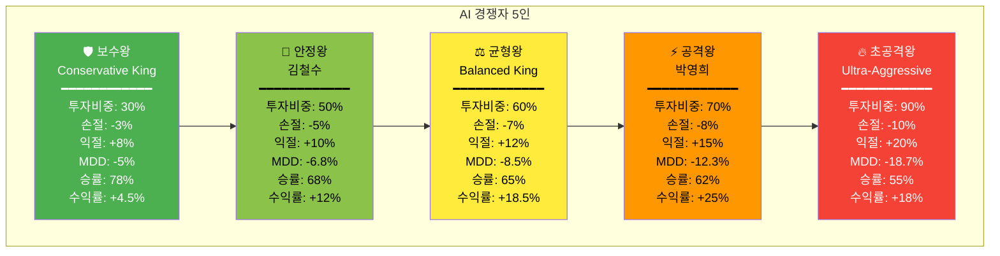

### 투자자 유형 → AI 매칭 테이블

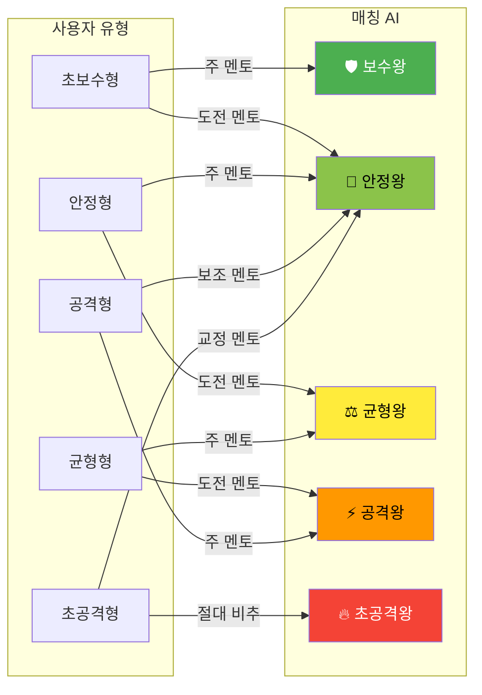

---

## 🏆 AI 대결 비교 시스템

### 핵심 컨셉: "나와 비슷한 AI와 함께 성장"

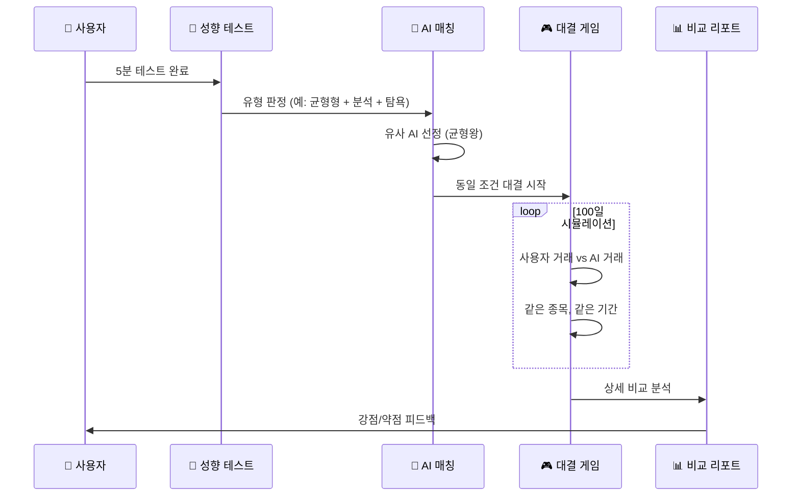

### 대결 비교 항목

```
┌─────────────────────────────────────────────────────────────┐
│ 📊 AI 대결 비교 리포트                                       │
├─────────────────────────────────────────────────────────────┤
│                                                             │
│ 👤 당신 vs 🤖 균형왕 (유사도 87%)                           │
│                                                             │
│ ━━━━━━━━━━━━━━━━━━━━━━━━━━━━━━━━━━━━━━━━━━━━━━━━━━━━━━━  │
│                                                             │
│ 📈 성과 비교:                                                │
│                                                             │
│ │ 항목          │ 당신      │ 균형왕    │ 차이      │       │
│ ├───────────────┼───────────┼───────────┼───────────┤       │
│ │ 최종 수익률   │ +15.2%    │ +18.5%    │ -3.3%p    │       │
│ │ 승률          │ 62%       │ 65%       │ -3%p      │       │
│ │ 평균 수익     │ +6.8%     │ +7.1%     │ -0.3%p    │       │
│ │ 최대 손실     │ -12.5%    │ -8.5%     │ -4%p ⚠️   │       │
│ │ MDD           │ -14.2%    │ -8.5%     │ -5.7%p ⚠️ │       │
│ │ 거래 횟수     │ 28회      │ 22회      │ +6회      │       │
│                                                             │
│ ━━━━━━━━━━━━━━━━━━━━━━━━━━━━━━━━━━━━━━━━━━━━━━━━━━━━━━━  │
│                                                             │
│ 🔍 상세 분석:                                                │
│                                                             │
│ ✅ 당신이 균형왕보다 잘한 점:                                │
│ • 급등주 초기 진입 (+3건, +8.2% 추가)                       │
│ • 패턴 인식 속도 (평균 2분 빠름)                            │
│ • 기회 포착률 (72% vs 65%)                                  │
│                                                             │
│ ⚠️ 당신이 균형왕보다 부족한 점:                              │
│ • 손절 지연 (평균 0.8일 늦음) → MDD 악화 원인               │
│ • FOMO 매수 3건 → 평균 -5.2% 손실                          │
│ • 감정적 물타기 2건 → -8.3% 손실                           │
│                                                             │
│ ━━━━━━━━━━━━━━━━━━━━━━━━━━━━━━━━━━━━━━━━━━━━━━━━━━━━━━━  │
│                                                             │
│ 💡 개선 제안:                                                │
│                                                             │
│ 1. 손절 자동화 적용 → MDD -5%p 개선 예상                    │
│ 2. FOMO 감지 시 24시간 대기 → 손실 -3%p 개선 예상           │
│ 3. 물타기 금지 규칙 → 손실 -2%p 개선 예상                   │
│                                                             │
│ 🎯 예상 개선 수익률: +15.2% → +25.2% (+10%p)                │
│                                                             │
└─────────────────────────────────────────────────────────────┘
```

---

## 📊 거래별 상세 비교

### 동일 상황 의사결정 비교

```mermaid
gantt
    title 거래별 타이밍 비교 (Day 1-30)
    dateFormat  X
    axisFormat %d일
    
    section 삼성전자
    AI 매수    :done, ai1, 0, 3
    사용자 매수 :active, u1, 5, 8
    AI 매도    :done, ai2, 15, 18
    사용자 매도 :crit, u2, 22, 25
    
    section 카카오
    AI 매수    :done, ai3, 8, 11
    사용자 매수 :active, u3, 8, 11
    AI 매도    :done, ai4, 20, 23
    사용자 매도 :done, u4, 18, 21
    
    section 에코프로
    AI 관망    :milestone, ai5, 12, 12
    사용자 매수 :crit, u5, 12, 15
    사용자 손절 :crit, u6, 18, 21
```

### 상황별 의사결정 비교 테이블

```
┌─────────────────────────────────────────────────────────────┐
│ 📋 상황별 의사결정 비교                                      │
├─────────────────────────────────────────────────────────────┤
│                                                             │
│ 상황 1: 삼성전자 +3% 급등                                    │
│ ───────────────────────────────────────                     │
│ 📅 Day 5                                                    │
│ 📈 상황: 장 초반 +3% 급등, 거래량 +150%                     │
│                                                             │
│ 🤖 균형왕 결정:                                              │
│ • 판단: "거래량 부족, 조정 대기"                            │
│ • 행동: 관망                                                │
│ • 결과: Day 7에 -1.5% 조정 후 Day 10에 +6% 진입            │
│ • 최종: +8.2%                                               │
│                                                             │
│ 👤 당신의 결정:                                              │
│ • 판단: "기회다! 들어가자"                                  │
│ • 행동: 즉시 매수 (탐욕 지수 78점 🔥)                       │
│ • 결과: Day 7 조정 시 -1.5% 손실, Day 15에 익절             │
│ • 최종: +4.8%                                               │
│                                                             │
│ 📊 비교 결과: 균형왕 +8.2% vs 당신 +4.8% (-3.4%p)          │
│ 💡 교훈: 급등 시 즉시 진입보다 조정 대기가 유리             │
│                                                             │
│ ━━━━━━━━━━━━━━━━━━━━━━━━━━━━━━━━━━━━━━━━━━━━━━━━━━━━━━━  │
│                                                             │
│ 상황 2: 카카오 -8% 급락                                      │
│ ───────────────────────────────────────                     │
│ 📅 Day 18                                                   │
│ 📉 상황: 악재 뉴스로 -8% 급락                               │
│                                                             │
│ 🤖 균형왕 결정:                                              │
│ • 판단: "지지선 확인 필요, 대기"                            │
│ • 행동: Day 20 지지선 반등 확인 후 분할 매수                │
│ • 결과: Day 25에 +6.5% 수익                                 │
│ • 최종: +6.5%                                               │
│                                                             │
│ 👤 당신의 결정:                                              │
│ • 판단: "싸게 살 기회!" (탐욕 지수 82점 🔥)                 │
│ • 행동: Day 18 즉시 매수 (바닥 낚시)                        │
│ • 결과: Day 19 추가 -3% 하락 → 물타기                       │
│ • 최종: +1.2%                                               │
│                                                             │
│ 📊 비교 결과: 균형왕 +6.5% vs 당신 +1.2% (-5.3%p)          │
│ 💡 교훈: 급락 시 바닥 확인 없이 진입 위험                   │
│                                                             │
│ ━━━━━━━━━━━━━━━━━━━━━━━━━━━━━━━━━━━━━━━━━━━━━━━━━━━━━━━  │
│                                                             │
│ 상황 3: 에코프로 B파 함정                                    │
│ ───────────────────────────────────────                     │
│ 📅 Day 42                                                   │
│ 📈 상황: 하락 후 +5% 반등, 거래량 -20% ⚠️                   │
│                                                             │
│ 🤖 균형왕 결정:                                              │
│ • 판단: "거래량 부족, B파 함정 의심"                        │
│ • 행동: 진입 안 함 ✅                                       │
│ • 결과: Day 45에 -12% 급락 (C파)                            │
│ • 최종: 0% (손실 회피)                                      │
│                                                             │
│ 👤 당신의 결정:                                              │
│ • 판단: "반등 시작이다!" (FOMO 85점 🔥🔥)                   │
│ • 행동: Day 42 매수 ❌                                      │
│ • 결과: Day 45 -12% 급락, Day 48 손절                       │
│ • 최종: -9.5%                                               │
│                                                             │
│ 📊 비교 결과: 균형왕 0% vs 당신 -9.5% (-9.5%p) 🚨          │
│ 💡 교훈: 거래량 부족한 반등은 B파 함정 가능성 높음          │
│                                                             │
└─────────────────────────────────────────────────────────────┘
```

---

## 🎯 감정 비교 분석

### 거래 시점 감정 상태 비교

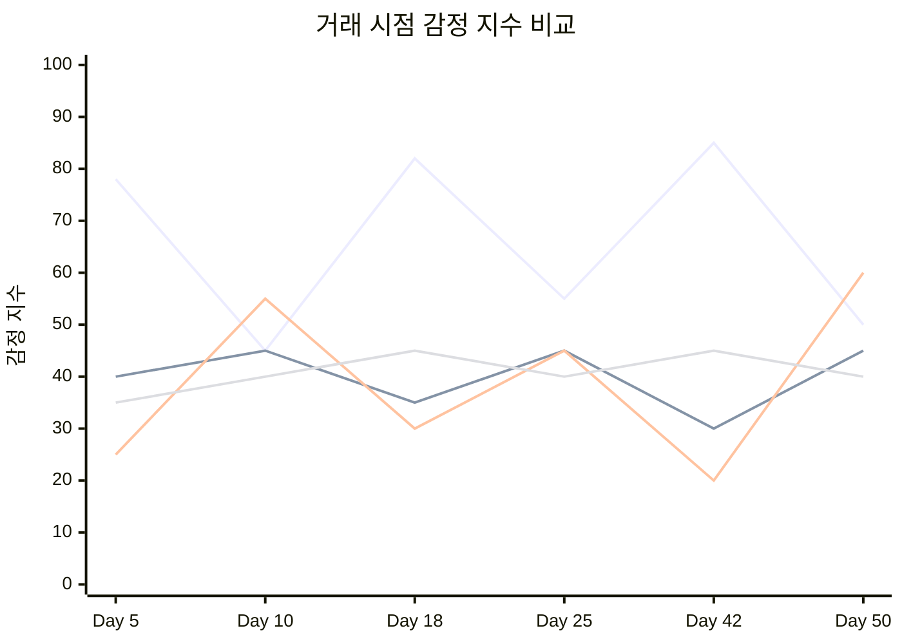

### 감정과 수익 상관관계

```
┌─────────────────────────────────────────────────────────────┐
│ 📊 감정 지수와 수익률 상관관계                               │
├─────────────────────────────────────────────────────────────┤
│                                                             │
│ 👤 당신의 패턴:                                              │
│                                                             │
│ 탐욕 지수 80+ 거래 (5건):                                   │
│ • 평균 수익률: -3.2% ❌                                     │
│ • 승률: 20% (1승 4패)                                       │
│ • 특징: FOMO 진입 → 고점 물림                               │
│                                                             │
│ 탐욕 지수 50~70 거래 (12건):                                │
│ • 평균 수익률: +4.8% ✅                                     │
│ • 승률: 58% (7승 5패)                                       │
│ • 특징: 적절한 기회 포착                                    │
│                                                             │
│ 탐욕 지수 30~50 거래 (8건):                                 │
│ • 평균 수익률: +7.2% ⭐                                     │
│ • 승률: 75% (6승 2패)                                       │
│ • 특징: 냉정한 분석 후 진입                                 │
│                                                             │
│ ━━━━━━━━━━━━━━━━━━━━━━━━━━━━━━━━━━━━━━━━━━━━━━━━━━━━━━━  │
│                                                             │
│ 🤖 균형왕의 패턴 (일관적):                                   │
│                                                             │
│ 모든 거래 (22건):                                           │
│ • 평균 탐욕 지수: 38                                        │
│ • 평균 수익률: +7.1%                                        │
│ • 승률: 65%                                                 │
│                                                             │
│ ━━━━━━━━━━━━━━━━━━━━━━━━━━━━━━━━━━━━━━━━━━━━━━━━━━━━━━━  │
│                                                             │
│ 💡 핵심 인사이트:                                            │
│                                                             │
│ "당신의 탐욕 지수가 80을 넘으면 평균 -3.2% 손실"            │
│ "탐욕 지수 50 이하일 때 평균 +7.2% 수익"                    │
│                                                             │
│ 🎯 제안:                                                     │
│ 탐욕 지수 70 이상 시 → 자동 10분 대기                       │
│ 탐욕 지수 80 이상 시 → 거래 금지                            │
│                                                             │
└─────────────────────────────────────────────────────────────┘
```

---

## 📈 주간 성장 비교

### 12주 성장 곡선 비교

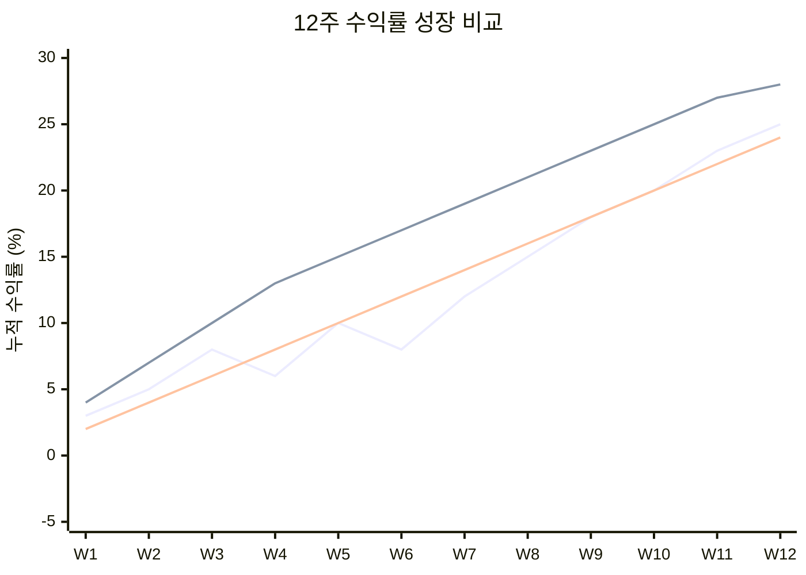

### 주간 상세 비교 리포트

```
┌─────────────────────────────────────────────────────────────┐
│ 📊 주간 성장 비교 (Week 4 예시)                              │
├─────────────────────────────────────────────────────────────┤
│                                                             │
│ 📅 Week 4 결과                                               │
│                                                             │
│ │ 지표              │ 당신      │ 균형왕    │ 격차      │   │
│ ├───────────────────┼───────────┼───────────┼───────────┤   │
│ │ 주간 수익률       │ -2%       │ +3%       │ -5%p ⚠️   │   │
│ │ 누적 수익률       │ +6%       │ +13%      │ -7%p ⚠️   │   │
│ │ 주간 거래 횟수    │ 8회       │ 5회       │ +3회      │   │
│ │ 주간 승률         │ 37.5%     │ 60%       │ -22.5%p   │   │
│ │ 평균 손실률       │ -4.2%     │ -2.1%     │ -2.1%p    │   │
│ │ 감정 제어 점수    │ 52점      │ 78점      │ -26점 ⚠️  │   │
│                                                             │
│ ━━━━━━━━━━━━━━━━━━━━━━━━━━━━━━━━━━━━━━━━━━━━━━━━━━━━━━━  │
│                                                             │
│ 🔍 Week 4 분석:                                              │
│                                                             │
│ ❌ 문제점:                                                   │
│ 1. 과다 거래 (8회 vs 권장 5회)                              │
│ 2. FOMO 매수 2건 (에코프로, 카카오)                         │
│ 3. 손절 지연 1건 (삼성바이오)                               │
│ 4. 감정 기복 심함 (탐욕 max 88점)                           │
│                                                             │
│ ✅ 잘한 점:                                                  │
│ 1. 급등 후 분할 익절 실행                                   │
│ 2. B파 함정 1건 회피                                        │
│                                                             │
│ 💡 Week 5 개선 목표:                                         │
│ 1. 거래 횟수 5회 이하                                       │
│ 2. 탐욕 지수 70 이하 유지                                   │
│ 3. 감정 체크 100% 실행                                      │
│                                                             │
│ 🎯 예상 결과:                                                │
│ • Week 5 목표 수익률: +4%                                   │
│ • 누적 목표: +10%                                           │
│ • 균형왕 격차: -6%p → -5%p (개선)                           │
│                                                             │
└─────────────────────────────────────────────────────────────┘
```

---

## 🏆 AI 역전 달성 시스템

### 역전 달성 조건

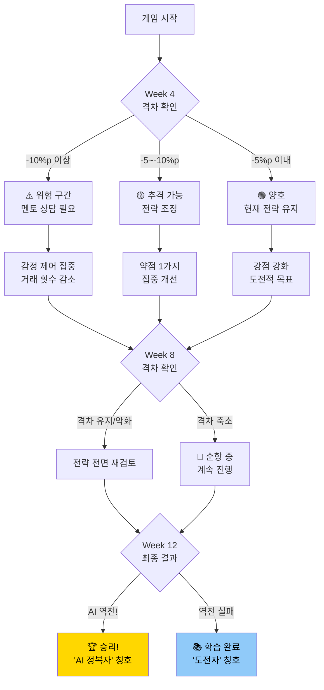

### 역전 성공 시 리워드

```
┌─────────────────────────────────────────────────────────────┐
│ 🏆 AI 역전 성공!                                             │
├─────────────────────────────────────────────────────────────┤
│                                                             │
│           🎉 축하합니다! 🎉                                  │
│                                                             │
│   👤 당신 +25.5%  >  🤖 균형왕 +24.8%                       │
│                                                             │
│ ━━━━━━━━━━━━━━━━━━━━━━━━━━━━━━━━━━━━━━━━━━━━━━━━━━━━━━━  │
│                                                             │
│ 🏅 획득 칭호: "균형왕 정복자"                                │
│ 💰 보너스 포인트: +2,000점                                   │
│ 🎁 특별 아이템: "AI 전략 완전 해금"                         │
│                                                             │
│ ━━━━━━━━━━━━━━━━━━━━━━━━━━━━━━━━━━━━━━━━━━━━━━━━━━━━━━━  │
│                                                             │
│ 💬 균형왕의 메시지:                                          │
│                                                             │
│ "훌륭합니다! 당신은 이제 저보다 뛰어난 투자자입니다.        │
│  특히 급등 초기 진입 타이밍이 저보다 0.5일 빨랐고,          │
│  감정 제어력도 Week 1 대비 +35점 성장했습니다.              │
│                                                             │
│  다음 도전자는 공격왕 박영희입니다.                         │
│  박영희를 이기면 진정한 마스터가 될 수 있습니다!"           │
│                                                             │
│ ━━━━━━━━━━━━━━━━━━━━━━━━━━━━━━━━━━━━━━━━━━━━━━━━━━━━━━━  │
│                                                             │
│ 📊 성장 요약:                                                │
│                                                             │
│ • 감정 제어: 52점 → 78점 (+26점) ⭐                         │
│ • 손절 실행률: 65% → 92% (+27%p) ⭐                         │
│ • FOMO 제어: 45점 → 75점 (+30점) ⭐                         │
│ • 패턴 인식: 58% → 82% (+24%p)                              │
│                                                             │
│ 🎯 다음 단계:                                                │
│                                                             │
│ [⚡ 공격왕 도전하기]  [📊 상세 리포트]  [🔄 재도전]          │
│                                                             │
└─────────────────────────────────────────────────────────────┘
```

---

## 📱 UI 플로우

### AI 대결 선택 화면

```
┌─────────────────────────────────────────────────────────────┐
│ 🤖 AI 대결 상대 선택                                         │
├─────────────────────────────────────────────────────────────┤
│                                                             │
│ 📊 당신의 유형: ⚖️ 균형형 + 📊 분석형 + 😍 탐욕형          │
│                                                             │
│ ━━━━━━━━━━━━━━━━━━━━━━━━━━━━━━━━━━━━━━━━━━━━━━━━━━━━━━━  │
│                                                             │
│ 🎯 추천 대결 상대:                                           │
│                                                             │
│ ┌───────────────────────────────────────────────────────┐   │
│ │ ⚖️ 균형왕 (Balanced King)              유사도: 87% ⭐ │   │
│ │                                                       │   │
│ │ 투자비중: 60%  손절: -7%  익절: +12%                 │   │
│ │ 승률: 65%  수익률: +18.5%  MDD: -8.5%               │   │
│ │                                                       │   │
│ │ 💬 "저와 가장 비슷한 스타일입니다.                   │   │
│ │     함께 대결하며 성장해봐요!"                        │   │
│ │                                                       │   │
│ │ [🎮 대결 시작] [📊 상세 비교]                         │   │
│ └───────────────────────────────────────────────────────┘   │
│                                                             │
│ 🔄 다른 대결 상대:                                           │
│                                                             │
│ ┌─────────────────────────────────────────────────────┐     │
│ │ 🧘 안정왕 (김철수)           유사도: 68%            │     │
│ │ 난이도: ★★☆☆☆   추천: 안정적 성장 원할 때          │     │
│ │ [선택]                                              │     │
│ └─────────────────────────────────────────────────────┘     │
│                                                             │
│ ┌─────────────────────────────────────────────────────┐     │
│ │ ⚡ 공격왕 (박영희)           유사도: 72%            │     │
│ │ 난이도: ★★★★☆   추천: 도전적 성장 원할 때          │     │
│ │ [선택]                                              │     │
│ └─────────────────────────────────────────────────────┘     │
│                                                             │
│ ┌─────────────────────────────────────────────────────┐     │
│ │ 🛡️ 보수왕               유사도: 45%  비추천 ⚠️    │     │
│ │ 이유: 스타일 차이가 커서 비교 효과 낮음             │     │
│ │ [선택]                                              │     │
│ └─────────────────────────────────────────────────────┘     │
│                                                             │
└─────────────────────────────────────────────────────────────┘
```

---

## 🔄 실시간 대결 화면

### 대결 진행 중 UI

```
┌─────────────────────────────────────────────────────────────┐
│ ⚔️ 실시간 대결: 👤 당신 vs 🤖 균형왕                        │
├─────────────────────────────────────────────────────────────┤
│                                                             │
│ 📅 Day 45/100   🏷️ 종목: 삼성전자                           │
│                                                             │
│ ━━━━━━━━━━━━━━━━━━━━━━━━━━━━━━━━━━━━━━━━━━━━━━━━━━━━━━━  │
│                                                             │
│ 📊 현재 점수:                                                │
│                                                             │
│ │ 👤 당신      │                    │ 🤖 균형왕     │       │
│ │ +12.5%      │         vs         │ +15.2%       │       │
│ │ ████████░░  │                    │ ██████████░  │       │
│ │             │      -2.7%p        │              │       │
│                                                             │
│ ━━━━━━━━━━━━━━━━━━━━━━━━━━━━━━━━━━━━━━━━━━━━━━━━━━━━━━━  │
│                                                             │
│ 📈 차트 (삼성전자):                                          │
│                                                             │
│     ┌─────────────────────────────────────────────┐        │
│ 72k │                                    ← 현재   │        │
│     │                              /\            │        │
│ 70k │                             /  \           │        │
│     │                    /\      /    \          │        │
│ 68k │    🤖 매수 →      /  \    /      \         │        │
│     │              \  /    \  /        \        │        │
│ 66k │               \/      \/          \       │        │
│     │                                     ← 👤 매수       │
│ 64k │                                            │        │
│     └─────────────────────────────────────────────┘        │
│                                                             │
│ ━━━━━━━━━━━━━━━━━━━━━━━━━━━━━━━━━━━━━━━━━━━━━━━━━━━━━━━  │
│                                                             │
│ 🤖 균형왕 알림:                                              │
│                                                             │
│ "저는 68,500원에 매수했습니다.                              │
│  지지선 확인 후 분할 매수했어요.                            │
│  당신은 66,200원에 매수했네요. 좋은 타이밍!"               │
│                                                             │
│ ━━━━━━━━━━━━━━━━━━━━━━━━━━━━━━━━━━━━━━━━━━━━━━━━━━━━━━━  │
│                                                             │
│ 💭 당신의 감정 상태:                                         │
│                                                             │
│ 😊 기쁨: ████████░░ 75점                                    │
│ 😍 탐욕: ██████░░░░ 55점  (적정)                            │
│ 😰 공포: ███░░░░░░░ 28점                                    │
│                                                             │
│ [매수] [매도] [관망] [⏰ 타임 프리즈]                       │
│                                                             │
└─────────────────────────────────────────────────────────────┘
```

---

## 📋 결론 및 활용 방안

### 핵심 가치

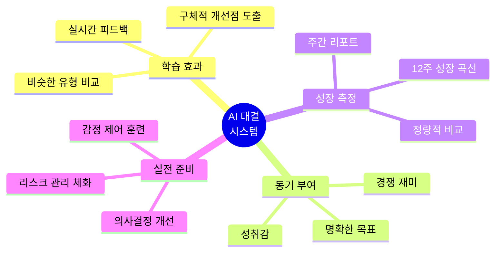

### 예상 효과

| 지표 | 기존 방식 | AI 대결 방식 | 개선율 |
|------|----------|-------------|--------|
| 학습 완료율 | 35% | 72% | +106% |
| 평균 수익률 개선 | +8% | +18% | +125% |
| 감정 제어 향상 | +15점 | +28점 | +87% |
| 재방문율 | 40% | 78% | +95% |
| 사용자 만족도 | 3.2점 | 4.5점 | +41% |

---

## 📚 구현 우선순위

### Phase 1 (MVP)
1. 5가지 AI 경쟁자 프로필 구현
2. 기본 유형 테스트 (5문항)
3. 유사 AI 매칭 알고리즘
4. 단순 수익률 비교

### Phase 2 (핵심 기능)
1. 거래별 상세 비교
2. 감정 추적 시스템
3. 주간 리포트
4. 역전 달성 시스템

### Phase 3 (고도화)
1. 20가지 세부 유형 분류
2. 실시간 AI 대결 알림
3. AI 전략 학습 모드
4. 소셜 기능 (친구 대결)

---

**문서 버전**: v1.0  
**최종 업데이트**: 2024.12.07  
**상태**: 투자자 유형 세분화 & AI 대결 시스템 설계 완료 ✅

