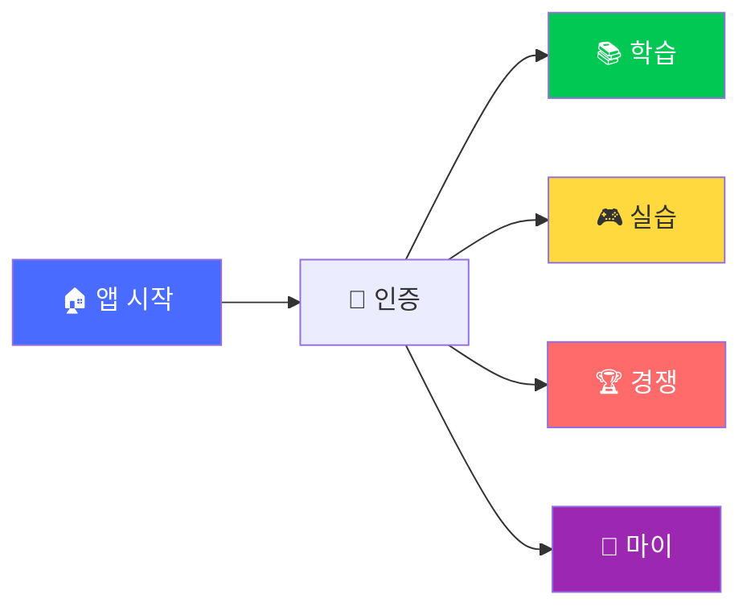
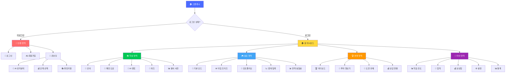
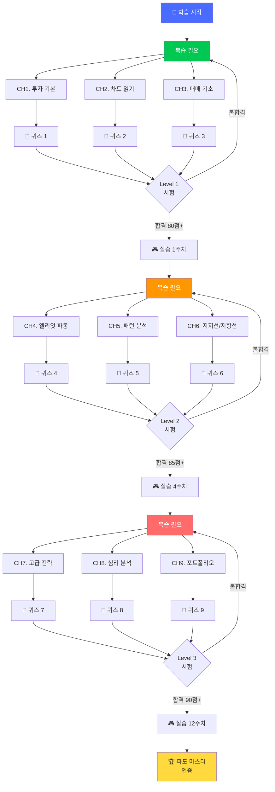
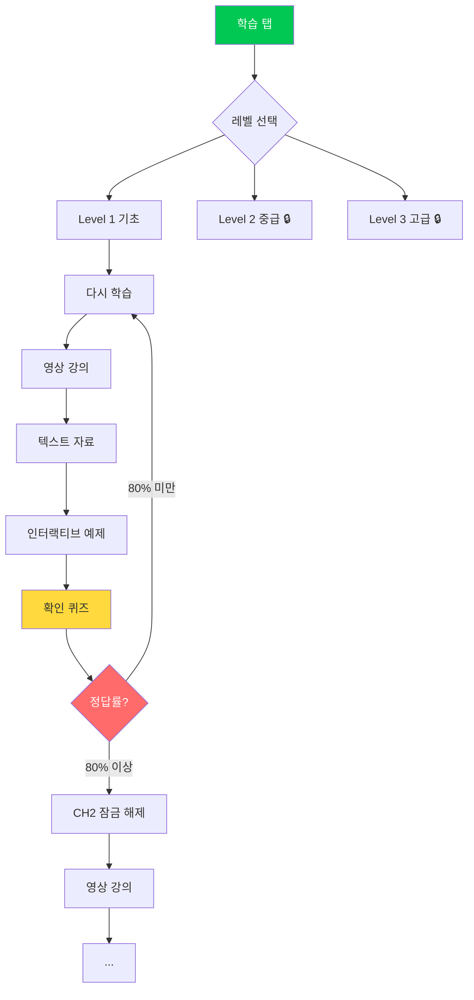
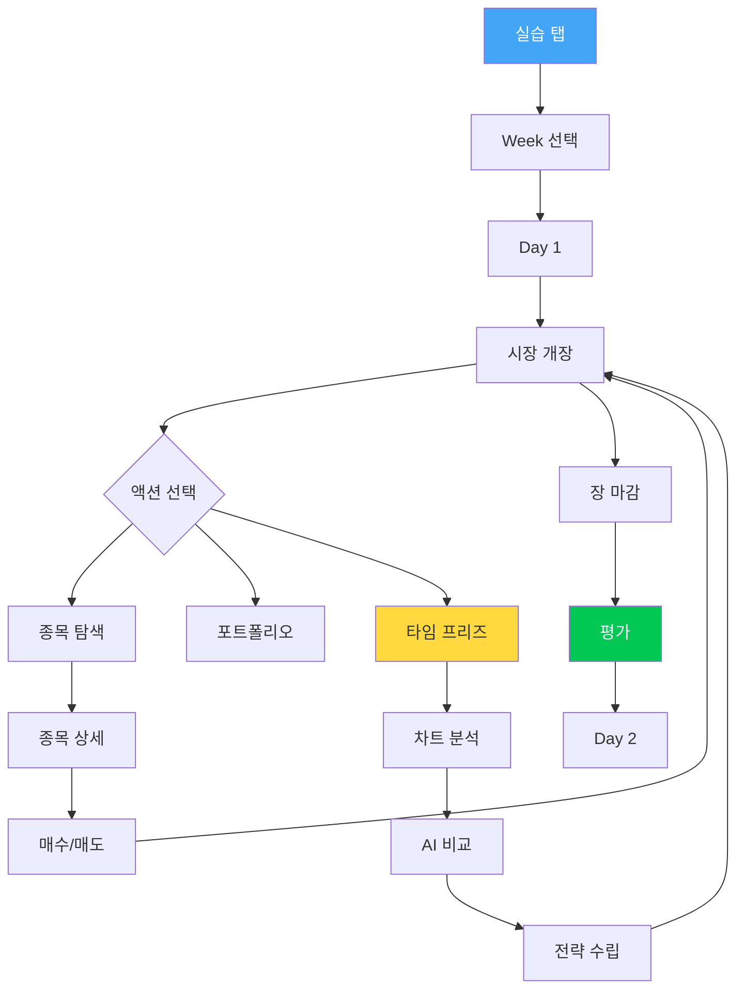
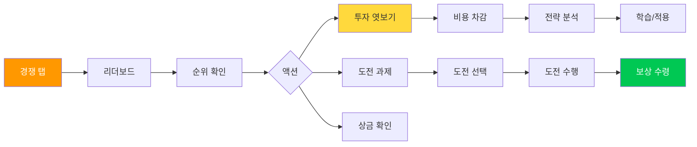

# 사이트맵 - 교육 앱 스타일
## "파도를 타라" 📱 투자 교육 플랫폼

---

## 📋 문서 정보

**버전**: v1.0 (교육 앱 스타일)  
**최종 업데이트**: 2024.11.19  
**플랫폼**: 📱 iOS / Android  
**스타일**: 교육 앱 (단계별 학습 중심)

---

## 🎯 목차

1. [전체 사이트맵](#전체-사이트맵)
2. [정보 구조 (IA)](#정보-구조-ia)
3. [학습 경로 맵](#학습-경로-맵)
4. [네비게이션 시스템](#네비게이션-시스템)
5. [화면별 상세 플로우](#화면별-상세-플로우)
6. [사용자 여정 맵](#사용자-여정-맵)

---

## 전체 사이트맵

### 📊 Level 1 - 최상위 구조



### 📊 Level 2 - 전체 구조 상세



---

## 정보 구조 (IA)

### 🗂️ 1단계: 인증 영역

```
📁 인증 (Authentication)
├── 🏠 스플래시
│   ├── 로딩 애니메이션
│   ├── 앱 버전 체크
│   └── 자동 로그인 시도
│
├── 🔐 로그인
│   ├── 소셜 로그인
│   │   ├── Apple
│   │   ├── 카카오
│   │   └── Google
│   ├── 체험하기 (7일)
│   └── 비밀번호 찾기
│
├── ✍️ 회원가입
│   ├── 약관 동의
│   ├── 소셜 계정 연동
│   └── 프로필 설정
│
└── 🎯 온보딩
    ├── 🧠 AI 성격 분석
    │   ├── 5가지 질문
    │   ├── 분석 결과
    │   └── 투자 유형 판정
    │
    ├── 💰 단계 선택
    │   ├── 1단계 (500만/1천만/5천만)
    │   ├── 2단계 (1억/5억) 🔒
    │   └── 3단계 (10억/50억) 🔒
    │
    └── 📚 튜토리얼
        ├── 기본 조작법
        ├── 매수/매도 방법
        └── 게임 규칙
```

### 🗂️ 2단계: 학습 영역 (Learning)

```
📁 학습 영역
├── 📖 강의 (Course)
│   ├── 🎓 기초 과정 (Level 1)
│   │   ├── CH1. 투자란 무엇인가?
│   │   │   ├── 1-1. 주식의 기본
│   │   │   ├── 1-2. 시장의 원리
│   │   │   └── 📝 확인 퀴즈
│   │   │
│   │   ├── CH2. 차트 읽기
│   │   │   ├── 2-1. 캔들의 의미
│   │   │   ├── 2-2. 거래량 분석
│   │   │   └── 📝 확인 퀴즈
│   │   │
│   │   └── CH3. 매매 기초
│   │       ├── 3-1. 매수/매도 타이밍
│   │       ├── 3-2. 손절/익절
│   │       └── 📝 확인 퀴즈
│   │
│   ├── 🎓 중급 과정 (Level 2) 🔒
│   │   ├── CH4. 엘리엇 파동
│   │   │   ├── 4-1. 5파 상승 이론
│   │   │   ├── 4-2. 3파 조정 이론
│   │   │   └── 📝 확인 퀴즈
│   │   │
│   │   ├── CH5. 패턴 분석
│   │   │   ├── 5-1. 헤드앤숄더
│   │   │   ├── 5-2. 컵앤핸들
│   │   │   └── 📝 확인 퀴즈
│   │   │
│   │   └── CH6. 지지선/저항선
│   │       ├── 6-1. 추세선 그리기
│   │       ├── 6-2. 돌파 전략
│   │       └── 📝 확인 퀴즈
│   │
│   └── 🎓 고급 과정 (Level 3) 🔒
│       ├── CH7. 고급 전략
│       ├── CH8. 심리 분석
│       └── CH9. 포트폴리오 관리
│
├── 🌊 패턴 도감 (Pattern Library)
│   ├── 상승 패턴 (15종)
│   │   ├── 3파 상승 ⭐⭐⭐⭐⭐
│   │   ├── 역헤드앤숄더 ⭐⭐⭐⭐
│   │   ├── 컵앤핸들 ⭐⭐⭐⭐
│   │   └── ...
│   │
│   ├── 하락 패턴 (12종)
│   │   ├── B파 함정 ⚠️
│   │   ├── 헤드앤숄더 ⚠️
│   │   └── ...
│   │
│   └── 보합 패턴 (8종)
│       ├── 삼각 수렴
│       └── ...
│
├── 🤖 AI 멘토 소개
│   ├── 🛡️ 김철수 (안정형)
│   │   ├── 프로필
│   │   ├── 투자 철학
│   │   ├── 대표 전략
│   │   └── 학습 자료
│   │
│   ├── ⚡ 박영희 (공격형)
│   │   ├── 프로필
│   │   ├── 투자 철학
│   │   ├── 대표 전략
│   │   └── 학습 자료
│   │
│   └── 🧠 이분석 (기술형)
│       ├── 프로필
│       ├── 투자 철학
│       ├── 대표 전략
│       └── 학습 자료
│
├── 📝 퀴즈 센터
│   ├── 일일 퀴즈 (매일 5문제)
│   ├── 레벨별 시험
│   │   ├── Level 1 시험
│   │   ├── Level 2 시험 🔒
│   │   └── Level 3 시험 🔒
│   │
│   ├── 패턴 인식 훈련
│   │   ├── 초급 (10문제)
│   │   ├── 중급 (15문제) 🔒
│   │   └── 고급 (20문제) 🔒
│   │
│   └── 퀴즈 기록
│       ├── 정답률
│       ├── 약점 분석
│       └── 복습 추천
│
└── 📊 용어 사전
    ├── ㄱ-ㅎ 가나다순
    ├── 알파벳순 (A-Z)
    ├── 카테고리별
    │   ├── 기본 용어
    │   ├── 차트 용어
    │   ├── 패턴 용어
    │   └── 전략 용어
    │
    └── 즐겨찾기
```

### 🗂️ 3단계: 실습 영역 (Practice)

```
📁 실습 영역
├── 🎯 기본 모드 (시뮬레이션 게임)
│   ├── Week 선택
│   │   ├── Week 1 (진행 중)
│   │   ├── Week 2 🔒
│   │   └── Week 3-12 🔒
│   │
│   ├── Day 플레이
│   │   ├── 시장 개장 (09:00-15:30)
│   │   ├── 종목 탐색
│   │   ├── 매매 실행
│   │   └── 시간 진행
│   │
│   └── 게임 모드
│       ├── ⚡ 일반 모드 (빠른 진행)
│       ├── ⏸️ 타임 프리즈 (분석)
│       └── 🤖 AI 비교 학습
│
├── ⏸️ 타임 프리즈 (분석 모드)
│   ├── 차트 분석
│   │   ├── 30일 차트
│   │   ├── 지지선/저항선
│   │   └── 거래량 분석
│   │
│   ├── 패턴 인식
│   │   ├── 엘리엇 파동
│   │   ├── 차트 패턴
│   │   └── 신뢰도 평가
│   │
│   ├── AI 분석
│   │   ├── 김철수 의견
│   │   ├── 박영희 의견
│   │   └── 비교 학습
│   │
│   ├── 전략 수립
│   │   ├── 매수 전략
│   │   ├── 손절/익절
│   │   ├── 투자 비중
│   │   └── 시뮬레이션
│   │
│   └── 메모/북마크
│       ├── 내 메모
│       ├── AI 조언 저장
│       └── 패턴 스크랩
│
├── 💼 포트폴리오
│   ├── 자산 현황
│   │   ├── 총 자산
│   │   ├── 수익률
│   │   └── 수익 그래프
│   │
│   ├── 보유 종목
│   │   ├── 🟢 안정형 (40%)
│   │   ├── 🟡 변동형 (50%)
│   │   └── 🔴 고변동 (10%)
│   │
│   ├── 거래 내역
│   │   ├── 매수 내역
│   │   ├── 매도 내역
│   │   └── 손익 분석
│   │
│   └── 리밸런싱
│       ├── 현재 비중 분석
│       ├── AI 추천
│       ├── 자동 리밸런싱
│       └── 수동 조정
│
├── 📈 종목 탐색
│   ├── 종목 목록
│   │   ├── 🟢 안정형 종목
│   │   ├── 🟡 변동형 종목
│   │   └── 🔴 고변동형 종목
│   │
│   ├── 종목 상세
│   │   ├── 실시간 차트
│   │   ├── 패턴 분석
│   │   ├── AI 분석
│   │   ├── 기본 정보
│   │   └── 뉴스/공시
│   │
│   ├── 매수/매도
│   │   ├── 즉시 주문
│   │   ├── 조건 주문
│   │   └── 예약 주문
│   │
│   ├── 필터/정렬
│   │   ├── 수익률 순
│   │   ├── 거래량 순
│   │   ├── AI 추천순
│   │   └── 패턴 발견순
│   │
│   └── 관심 종목
│       ├── 즐겨찾기
│       ├── 알림 설정
│       └── 비교 분석
│
└── 📊 전략 실험실 (Strategy Lab)
    ├── 백테스팅
    │   ├── 과거 데이터 선택
    │   ├── 전략 설정
    │   ├── 시뮬레이션 실행
    │   └── 결과 분석
    │
    ├── 전략 비교
    │   ├── 내 전략
    │   ├── AI 전략
    │   ├── 상위 랭커 전략
    │   └── 성과 비교
    │
    └── 전략 저장소
        ├── 저장된 전략
        ├── 공유 전략
        └── 추천 전략
```

### 🗂️ 4단계: 경쟁 영역 (Competition)

```
📁 경쟁 영역
├── 🏆 리더보드
│   ├── 실시간 랭킹
│   │   ├── 전체 순위
│   │   ├── 단계별 순위
│   │   │   ├── 500만원 코스
│   │   │   ├── 1,000만원 코스
│   │   │   └── 5,000만원 코스
│   │   │
│   │   └── 기간별 순위
│   │       ├── 주간 순위
│   │       ├── 월간 순위
│   │       └── 시즌 순위
│   │
│   ├── 친구 순위
│   │   ├── 친구 목록
│   │   ├── 친구 초대
│   │   └── 순위 비교
│   │
│   └── 랭킹 정보
│       ├── 내 순위
│       ├── 순위 변동
│       ├── 1위와 차이
│       └── 상승 추세
│
├── 👀 투자 엿보기
│   ├── 상위 랭커 분석
│   │   ├── 포트폴리오 구성
│   │   ├── 투자 스타일
│   │   ├── 전략 메모
│   │   └── 거래 패턴
│   │
│   ├── 비용 시스템
│   │   ├── 타임 프리즈 1개
│   │   ├── 포인트 500P
│   │   └── 광고 시청
│   │
│   └── 학습 활용
│       ├── 전략 따라하기
│       ├── 북마크
│       └── 비교 분석
│
├── 🎯 도전 과제 (Challenges)
│   ├── 일일 도전
│   │   ├── 종목 3개 분산 투자
│   │   ├── 수익률 +5% 달성
│   │   └── 패턴 5개 인식
│   │
│   ├── 주간 도전
│   │   ├── TOP 100 진입
│   │   ├── 타임 프리즈 5회 활용
│   │   └── AI 이기기
│   │
│   ├── 특별 이벤트
│   │   ├── 시즌 이벤트
│   │   ├── 한정 도전
│   │   └── 협력 미션
│   │
│   └── 도전 기록
│       ├── 완료한 도전
│       ├── 진행 중
│       └── 보상 수령
│
└── 💰 상금 현황
    ├── 상금 풀 정보
    │   ├── 주간 상금 (500만원)
    │   ├── 월간 상금 (5,000만원)
    │   └── 시즌 상금 (5억원)
    │
    ├── 예상 상금
    │   ├── 현재 순위 상금
    │   ├── 목표 순위 상금
    │   └── 필요 수익률
    │
    └── 수령 내역
        ├── 받은 상금
        ├── 출금 신청
        └── 출금 내역
```

### 🗂️ 5단계: 마이 영역 (My Page)

```
📁 마이 영역
├── 📊 학습 진도
│   ├── 전체 진도
│   │   ├── 강의 완료율
│   │   ├── 퀴즈 정답률
│   │   └── 패턴 마스터율
│   │
│   ├── 레벨 시스템
│   │   ├── 현재 레벨 (Lv.5)
│   │   ├── 경험치 바
│   │   ├── 다음 레벨까지
│   │   └── 레벨별 혜택
│   │
│   ├── 스킬 트리
│   │   ├── 기초 스킬 ✅
│   │   ├── 중급 스킬 🔒
│   │   └── 고급 스킬 🔒
│   │
│   └── 학습 통계
│       ├── 누적 학습 시간
│       ├── 완료한 강의
│       ├── 푼 퀴즈 수
│       └── 주간 학습량
│
├── 🏅 업적 (Achievements)
│   ├── 거래 업적
│   │   ├── ✅ 첫 거래 완료
│   │   ├── ✅ 10거래 달성
│   │   ├── 🔒 100거래 달성
│   │   └── ...
│   │
│   ├── 학습 업적
│   │   ├── ✅ 강의 1개 완료
│   │   ├── ✅ 퀴즈 100문제 풀이
│   │   └── ...
│   │
│   ├── 경쟁 업적
│   │   ├── ✅ TOP 100 진입
│   │   ├── 🔒 TOP 10 진입
│   │   └── ...
│   │
│   └── 특별 업적
│       ├── ✅ 파도 초보자
│       ├── 🔒 파도 중급자
│       └── 🔒 파도 마스터
│
├── 💰 보상함
│   ├── 포인트
│   │   ├── 보유 포인트: 3,850P
│   │   ├── 획득 내역
│   │   └── 사용 내역
│   │
│   ├── 아이템
│   │   ├── 🎟️ 타임 프리즈: 3개
│   │   ├── 🔍 투자 엿보기권: 1개
│   │   ├── 💡 힌트권: 2개
│   │   └── 🎁 보너스 상자: 5개
│   │
│   ├── 뱃지
│   │   ├── 💡 생각하는 투자자
│   │   ├── 📊 패턴 인식자
│   │   └── ...
│   │
│   └── 상점
│       ├── 아이템 구매
│       ├── 특별 패키지
│       └── 한정 상품
│
├── ⚙️ 설정
│   ├── 계정 설정
│   │   ├── 프로필 편집
│   │   ├── 비밀번호 변경
│   │   └── 계정 연동
│   │
│   ├── 알림 설정
│   │   ├── 푸시 알림
│   │   ├── 이메일 알림
│   │   └── 알림 시간
│   │
│   ├── 게임 설정
│   │   ├── 사운드
│   │   ├── 진동
│   │   ├── 자동 진행 속도
│   │   └── 차트 설정
│   │
│   ├── 화면 설정
│   │   ├── 다크 모드
│   │   ├── 글자 크기
│   │   └── 언어
│   │
│   └── 기타
│       ├── 공지사항
│       ├── 버전 정보
│       ├── 이용약관
│       ├── 개인정보처리방침
│       ├── 고객센터
│       └── 로그아웃
│
└── 📊 통계
    ├── 투자 통계
    │   ├── 총 자산 변화
    │   ├── 수익률 추이
    │   ├── 거래 패턴
    │   └── 최고/최저 기록
    │
    ├── 학습 통계
    │   ├── 학습 시간
    │   ├── 완료 강의
    │   ├── 퀴즈 정답률
    │   └── 약점 분석
    │
    ├── 경쟁 통계
    │   ├── 순위 변동
    │   ├── 받은 상금
    │   ├── 완료 도전
    │   └── 비교 분석
    │
    └── AI 비교
        ├── 김철수 vs 나
        ├── 박영희 vs 나
        └── 주차별 비교
```

---

## 학습 경로 맵

### 📚 학습 단계 (Education Path)



### 🎯 실습 경로 (Practice Path)

```mermaid
flowchart LR
    W1[Week 1<br/>기초 실습] --> W2[Week 2<br/>패턴 인식]
    W2 --> W3[Week 3<br/>타이밍]
    W3 --> W4[Week 4<br/>분산 투자]
    
    W4 --> W5[Week 5<br/>AI 학습]
    W5 --> W6[Week 6<br/>리밸런싱]
    W6 --> W7[Week 7<br/>고급 전략]
    W7 --> W8[Week 8<br/>심리 관리]
    
    W8 --> W9[Week 9<br/>경쟁 전략]
    W9 --> W10[Week 10<br/>포트폴리오]
    W10 --> W11[Week 11<br/>종합 실습]
    W11 --> W12[Week 12<br/>최종 평가]
    
    W12 --> GRAD[🎓 졸업<br/>실전 준비]
    
    style W1 fill:#00C853,color:#fff
    style W4 fill:#FFD93D
    style W8 fill:#FF9800,color:#fff
    style W12 fill:#FF6B6B,color:#fff
    style GRAD fill:#9C27B0,color:#fff
```



---

## 네비게이션 시스템

### 🧭 하단 탭 네비게이션 (Main Navigation)

```
┌─────────────────────────────┐
│                             │
│     [메인 콘텐츠 영역]       │
│                             │
├─────────────────────────────┤
│ [🏠] [📚] [🎮] [🏆] [👤]  │
│  홈   학습  실습  경쟁  MY  │
└─────────────────────────────┘

각 탭별 기능:
1. 🏠 홈: 대시보드, 요약, 빠른 액세스
2. 📚 학습: 강의, 퀴즈, 패턴 도감
3. 🎮 실습: 게임, 포트폴리오, 전략
4. 🏆 경쟁: 랭킹, 도전, 상금
5. 👤 MY: 프로필, 통계, 설정
```

### 📱 상단 네비게이션 바

```
패턴 1: 기본 (홈)
┌─────────────────────────────┐
│  🌊 파도를 타라  [🔔3] [⚙️] │
└─────────────────────────────┘

패턴 2: 서브 페이지
┌─────────────────────────────┐
│ [←] 타이틀         [공유] [•••]│
└─────────────────────────────┘

패턴 3: 모달/바텀시트
┌─────────────────────────────┐
│        [━━━]  드래그         │
│  타이틀               [✕]   │
└─────────────────────────────┘
```

### 🔀 화면 전환 패턴

```
1. Push (밀어내기):
   목록 → 상세 페이지
   
2. Modal (모달):
   설정, 팝업, 알림
   
3. Bottom Sheet (바텀시트):
   빠른 액션, 선택, 입력
   
4. Tab (탭):
   같은 레벨 정보 전환
   
5. Slide (슬라이드):
   온보딩, 튜토리얼
```

---

## 화면별 상세 플로우

### 📊 1. 온보딩 플로우

```mermaid
flowchart LR
    A[스플래시] --> B[로그인]
    B --> C[약관 동의]
    C --> D[프로필 설정]
    
    D --> E[온보딩 시작]
    E --> F[슬라이드 1:<br/>앱 소개]
    F --> G[슬라이드 2:<br/>학습 방식]
    G --> H[슬라이드 3:<br/>게임 방식]
    H --> I[슬라이드 4:<br/>경쟁 시스템]
    
    I --> J[AI 성격 분석]
    J --> K[Q1]
    K --> L[Q2]
    L --> M[Q3]
    M --> N[Q4]
    N --> O[Q5]
    
    O --> P[분석 중...]
    P --> Q[결과 표시]
    
    Q --> R[단계 선택]
    R --> S[튜토리얼]
    
    S --> T[홈 화면]
    
    style A fill:#4A6BFF,color:#fff
    style J fill:#FFD93D
    style Q fill:#00C853,color:#fff
    style T fill:#FF6B6B,color:#fff
```



### 📚 2. 학습 플로우



### 🎮 3. 실습 플로우



### 🏆 4. 경쟁 플로우



---

## 사용자 여정 맵

### 👤 신규 사용자 (First Time User)

```
Day 1: 🎯 가입 & 온보딩
┌─────────────────────────────────────────┐
│ 1. 앱 설치                              │
│ 2. 스플래시 화면 (2초)                  │
│ 3. 소셜 로그인 (30초)                   │
│ 4. 약관 동의 (20초)                     │
│ 5. 프로필 설정 (1분)                    │
│ 6. 앱 소개 슬라이드 (2분)               │
│ 7. AI 성격 분석 (5분)                   │
│ 8. 분석 결과 확인 (2분)                 │
│ 9. 단계 선택 (1분)                      │
│10. 튜토리얼 (5분)                       │
│11. 첫 게임 시작 (10분)                  │
│                                         │
│ 총 소요 시간: 약 30분                   │
│ 목표: 첫 거래 완료, 기본 이해           │
└─────────────────────────────────────────┘

Week 1: 📚 기초 학습 & 실습
┌─────────────────────────────────────────┐
│ Day 1-2: CH1 투자 기본 학습 (1시간)     │
│ Day 3-4: CH2 차트 읽기 학습 (1시간)     │
│ Day 5-6: CH3 매매 기초 학습 (1시간)     │
│ Day 7: Level 1 시험 (30분)              │
│                                         │
│ 실습: Week 1 게임 (매일 20분)           │
│                                         │
│ 목표:                                   │
│ • Level 1 시험 합격 (80점+)             │
│ • Week 1 게임 완료                      │
│ • 기본 패턴 5개 인식                    │
└─────────────────────────────────────────┘

Month 1: 🎓 기초 마스터
┌─────────────────────────────────────────┐
│ Week 1-2: Level 1 완료                  │
│ Week 3-4: Level 2 진행                  │
│                                         │
│ 실습: Week 1-4 게임                     │
│                                         │
│ 목표:                                   │
│ • Level 2 진입                          │
│ • 수익률 +5% 이상                       │
│ • TOP 1000 진입                         │
└─────────────────────────────────────────┘

Month 3: 🏆 중급 달성
┌─────────────────────────────────────────┐
│ Level 2 완료                            │
│ Week 1-12 게임 완료                     │
│                                         │
│ 목표:                                   │
│ • 수익률 +25% 이상                      │
│ • TOP 100 진입                          │
│ • 2단계 잠금 해제                       │
└─────────────────────────────────────────┘
```

### 👨‍🎓 활성 사용자 (Active User)

```
일일 루틴 (Daily Routine)
┌─────────────────────────────────────────┐
│ 09:00 | 📱 앱 접속                      │
│       | 📊 일일 퀴즈 풀기 (5분)         │
│       | 🎯 일일 도전 확인               │
│       |                                 │
│ 12:00 | 🎮 실습 게임 (20분)             │
│       | 📈 종목 분석                    │
│       | 💰 매매 실행                    │
│       |                                 │
│ 19:00 | 📚 강의 1개 수강 (30분)         │
│       | 📝 퀴즈 풀이                    │
│       |                                 │
│ 22:00 | 🏆 랭킹 확인                    │
│       | 👀 상위 랭커 분석               │
│       | 📊 일일 리포트 확인             │
│       |                                 │
│ 총 사용 시간: 1시간                     │
└─────────────────────────────────────────┘

주간 루틴 (Weekly Routine)
┌─────────────────────────────────────────┐
│ 월-금 | 일일 루틴 수행                  │
│       | 강의 2-3개 완료                 │
│       | Week 게임 진행                  │
│       |                                 │
│ 토    | 📊 Week 리포트 확인             │
│       | 🎯 주간 도전 완료               │
│       | 📚 복습                         │
│       |                                 │
│ 일    | 🏆 랭킹 체크                    │
│       | 📈 다음 주 전략 수립            │
│       |                                 │
│ 총 학습 시간: 7시간/주                  │
└─────────────────────────────────────────┘
```

---

## 핵심 기능 플로우 맵

### 🎯 1. 강의 수강 플로우

```
[학습 탭] 
    ↓
[레벨 선택] → [잠금 확인]
    ↓              ↓
[챕터 선택]     [이전 완료 필요]
    ↓
[강의 시작]
    ├→ [영상 재생] (5-10분)
    ├→ [텍스트 읽기] (선택)
    ├→ [예제 실습] (인터랙티브)
    └→ [요점 정리]
    ↓
[확인 퀴즈] (5문제)
    ↓
[결과 확인]
    ├→ [80% 이상] → [다음 챕터 잠금 해제] → [EXP +50]
    └→ [80% 미만] → [복습 추천] → [다시 풀기]
    ↓
[진도 저장] → [학습 기록 업데이트]
```

### 🎮 2. 게임 플레이 플로우

```
[실습 탭]
    ↓
[Week 선택] → [이전 Week 완료 확인]
    ↓
[Day 시작] (예: Day 3)
    ↓
[시장 개장 09:00]
    ↓
┌────────────────┐
│  플레이 루프   │
│                │
│ [종목 탐색]    │
│     ↓          │
│ [종목 선택]    │
│     ↓          │
│ [차트 분석]    │
│     ↓          │
│ [AI 조언 확인] │
│     ↓          │
│ [매수/매도]    │
│     ↓          │
│ [⭐ 즉시 평가] │
│     ↓          │
│ [포트폴리오    │
│  업데이트]     │
│     ↓          │
│ [다음 시간]    │
└────────────────┘
    ↓
[장 마감 15:30]
    ↓
[Day 결과]
    ├→ 수익/손실
    ├→ 별점 평가
    ├→ AI 비교
    └→ 학습 포인트
    ↓
[다음 Day] or [Week 완료 리포트]
```

### ⏸️ 3. 타임 프리즈 플로우

```
[게임 중]
    ↓
[타임 프리즈 자동 발동] (Day 3, 5)
    ↓
[시간 정지 2분]
    ↓
┌──────────────────┐
│  분석 모드       │
│                  │
│ [📊 차트 탭]     │
│  • 30일 차트     │
│  • 지지/저항선   │
│  • 거래량 분석   │
│                  │
│ [🌊 패턴 탭]     │
│  • 엘리엇 파동   │
│  • 차트 패턴     │
│  • 신뢰도        │
│                  │
│ [🤖 AI 탭]       │
│  • 김철수 의견   │
│  • 박영희 의견   │
│  • 비교 표시     │
│                  │
│ [📝 메모 탭]     │
│  • 내 생각 기록  │
│  • AI 조언 저장  │
│                  │
│ [🎯 전략 탭]     │
│  • 매수 전략     │
│  • 손절/익절     │
│  • 시뮬레이션    │
└──────────────────┘
    ↓
[전략 저장]
    ↓
[조건 주문 설정]
    ↓
[시간 재개]
    ↓
[3일 후 결과 확인]
    ├→ 내 전략 결과
    ├→ 김철수 결과
    ├→ 박영희 결과
    └→ 비교 학습
```

### 🏆 4. 경쟁 참여 플로우

```
[경쟁 탭]
    ↓
[리더보드]
    ├→ [전체 순위]
    ├→ [내 순위: 42위]
    ├→ [1위와 차이: 9.5%p]
    └→ [예상 상금: 50,000원]
    ↓
┌──────────────────┐
│  액션 선택       │
│                  │
│ [👀 엿보기]      │
│    ↓             │
│  [비용 확인]     │
│  (타임프리즈 1개)│
│    ↓             │
│  [사용 확인]     │
│    ↓             │
│  [전략 분석]     │
│   • 포트폴리오   │
│   • 투자 스타일  │
│   • 전략 메모    │
│    ↓             │
│  [따라하기]      │
│    or            │
│  [북마크]        │
│                  │
│ [🎯 도전 과제]   │
│    ↓             │
│  [도전 선택]     │
│    ↓             │
│  [수행]          │
│    ↓             │
│  [완료]          │
│    ↓             │
│  [보상 수령]     │
│   • 포인트       │
│   • 아이템       │
│   • 상금         │
└──────────────────┘
```

---

## 정리

### 📊 사이트맵 요약

```
총 화면 수: 약 80개
├── 인증: 5개
├── 학습: 25개
├── 실습: 20개
├── 경쟁: 15개
└── 마이: 15개

주요 사용자 플로우: 6개
├── 온보딩 플로우
├── 학습 플로우
├── 실습 플로우
├── 경쟁 플로우
├── 타임 프리즈 플로우
└── AI 비교 플로우

네비게이션 레벨:
├── Level 1: 5개 (하단 탭)
├── Level 2: 20개 (메인 섹션)
├── Level 3: 55개 (서브 섹션)
└── Level 4+: 모달/바텀시트
```

### 🎯 교육 앱 핵심 특징

```
1. 단계별 학습 (Structured Learning)
   • Level 1 → Level 2 → Level 3
   • 순차적 잠금 해제
   • 명확한 진도 표시

2. 즉각적 피드백 (Immediate Feedback)
   • 퀴즈 즉시 채점
   • 게임 실시간 평가
   • AI 즉시 조언

3. 게임화 (Gamification)
   • 레벨 시스템
   • 업적/뱃지
   • 리더보드
   • 보상 시스템

4. 개인화 학습 (Personalized Learning)
   • AI 성격 분석
   • 맞춤 학습 경로
   • 약점 분석
   • 복습 추천

5. 실습 중심 (Practice-Oriented)
   • 이론 → 퀴즈 → 실습
   • 타임 프리즈 (분석 연습)
   • 전략 실험실
   • 백테스팅
```

### 📱 다음 단계

```
Phase 1: 핵심 기능 (MVP)
• 온보딩 플로우
• 학습 시스템 (Level 1)
• 실습 게임 (Week 1-4)
• 리더보드
• 마이페이지

Phase 2: 확장 기능
• Level 2-3 학습
• Week 5-12 게임
• 타임 프리즈
• AI 비교 학습
• 도전 과제

Phase 3: 고급 기능
• 전략 실험실
• 백테스팅
• 소셜 기능
• 실전 연동
```

---

**문서 버전**: v1.0  
**최종 업데이트**: 2024.11.19  
**상태**: 교육 앱 스타일 사이트맵 완성 ✅

