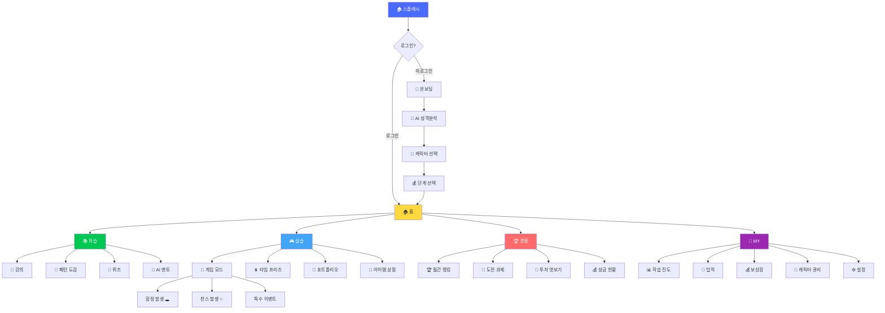
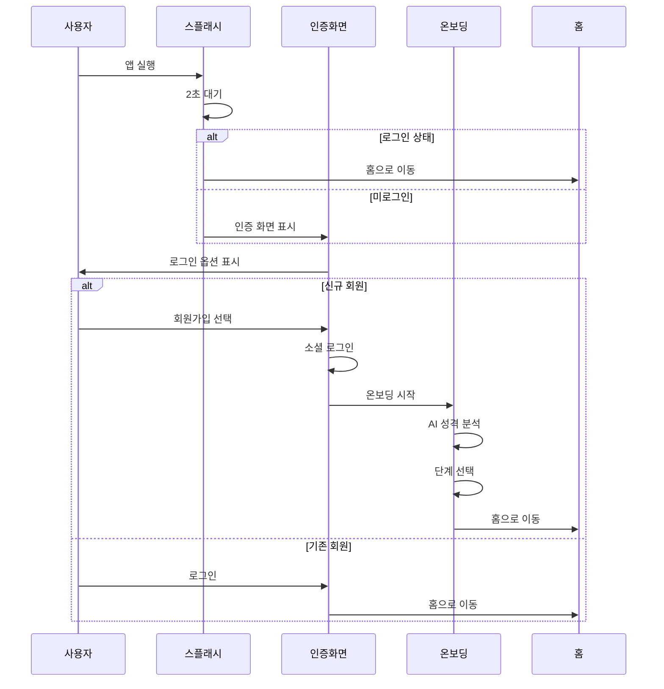

# UI/UX 모바일 디자인 문서
## "파도를 타라" 📱 교육 게임 앱 설계

---

## 📋 문서 정보

**버전**: v2.0 (교육 게임 앱 스타일)  
**최종 업데이트**: 2024.11.19  
**플랫폼**: 📱 iOS / Android  
**스타일**: 교육 게임 - 학습 + 게임화 + 경쟁  
**참고**: SITEMAP_EDUCATION_STYLE.md 기반

---

## 🎯 목차

1. [디자인 원칙](#디자인-원칙)
2. [게임 시스템](#게임-시스템)
3. [캐릭터 시스템](#캐릭터-시스템)
4. [사이트맵](#사이트맵)
5. [회원 관리 플로우](#회원-관리-플로우)
6. [핵심 화면 설계](#핵심-화면-설계)
7. [게임 요소 화면](#게임-요소-화면)
8. [컴포넌트 라이브러리](#컴포넌트-라이브러리)
9. [인터랙션 디자인](#인터랙션-디자인)
10. [반응형 레이아웃](#반응형-레이아웃)

---

## 디자인 원칙

### 🎮 교육 게임 앱 핵심 철학

```
1. 학습 중심 (Learning First)
   • 재미있게 배우는 투자 교육
   • 단계별 난이도 상승
   • 실전 감각 체득

2. 게임화 (Gamification)
   • 캐릭터 기반 스토리텔링
   • 미션/도전 과제 시스템
   • 즉각적 보상과 피드백
   • 레벨업과 성장 경험

3. 경쟁과 협력 (Competition & Cooperation)
   • 실시간 랭킹 경쟁
   • 월별 상위 5등 상품권
   • AI 멘토 코칭 시스템
   • 친구와 함께 성장

4. 전략적 선택 (Strategic Choice)
   • 함정과 찬스 카드
   • 특수 효과 아이템
   • 힌트 시스템
   • 리스크 관리 (±10% 변동)

5. 몰입감 (Immersion)
   • 풍부한 애니메이션
   • 사운드/진동 피드백
   • 스토리 기반 진행
   • 캐릭터 감정 표현
```

### 🎯 게임 디자인 목표

```
단기 목표 (1개월):
• 기초 학습 완료 (Level 1)
• 게임 시스템 이해
• 첫 수익 경험
• 캐릭터 친밀도 형성

중기 목표 (3개월):
• 중급 과정 완료 (Level 2)
• 안정적 수익률 달성 (+10%)
• TOP 100 진입
• 특수 아이템 활용 마스터

장기 목표 (6개월):
• 고급 과정 완료 (Level 3)
• 파도 마스터 인증
• 월별 상위 5등 도전
• 실전 투자 준비 완료
```

### 🎨 컬러 시스템

```
Primary:
• 메인: #4A6BFF (파도 블루)
• 서브: #FF6B6B (액션 레드)
• 액센트: #FFD93D (골드)

Semantic:
• 성공 (수익): #00C853 (그린)
• 위험 (손실): #FF3D00 (레드)
• 경고: #FFA726 (오렌지)
• 정보: #42A5F5 (라이트 블루)

Background:
• 기본: #FFFFFF (화이트)
• 보조: #F8F9FA (라이트 그레이)
• 카드: #FFFFFF with Shadow
• 다크: #1A1A1A (다크모드)

Text:
• 주: #212121 (블랙)
• 부: #757575 (그레이)
• 약: #BDBDBD (라이트 그레이)
• 반전: #FFFFFF (화이트)
```

### 📐 타이포그래피

```
Headline:
• H1: 28px / Bold / -0.5px
• H2: 24px / Bold / -0.3px
• H3: 20px / SemiBold / -0.2px

Body:
• Body1: 16px / Regular / 0px (기본)
• Body2: 14px / Regular / 0px
• Caption: 12px / Regular / 0.2px

Number (금액 표시):
• Large: 32px / Bold / -1px
• Medium: 24px / SemiBold / -0.5px
• Small: 18px / Medium / 0px

Font Family:
• iOS: SF Pro Display
• Android: Spoqa Han Sans Neo
```

### 🔲 간격 시스템 (8pt Grid)

```
Spacing Scale:
• XXS: 4px
• XS: 8px
• S: 12px
• M: 16px (기본)
• L: 24px
• XL: 32px
• XXL: 48px

Safe Area:
• Top: 44px (노치 고려)
• Bottom: 34px (홈 인디케이터)
• Horizontal: 20px
```

---

## 게임 시스템

### 🎮 핵심 게임 요소

#### 1️⃣ 난이도 시스템

```
┌──────────────────────────────────────┐
│ 🎯 난이도별 특징                     │
├──────────────────────────────────────┤
│                                      │
│ 🟢 초급 (Easy) - Week 1-4            │
│ • 변동폭: ±5%                        │
│ • 함정 출현: 10%                     │
│ • 찬스 출현: 30%                     │
│ • AI 힌트: 무제한                    │
│ • 추천: 완전 초보                    │
│                                      │
│ 🟡 중급 (Normal) - Week 5-8          │
│ • 변동폭: ±7%                        │
│ • 함정 출현: 20%                     │
│ • 찬스 출현: 20%                     │
│ • AI 힌트: 5회/주                    │
│ • 추천: 기초 완료자                  │
│                                      │
│ 🔴 고급 (Hard) - Week 9-12           │
│ • 변동폭: ±10%                       │
│ • 함정 출현: 30%                     │
│ • 찬스 출현: 10%                     │
│ • AI 힌트: 3회/주                    │
│ • 추천: 중급 이상                    │
│                                      │
│ 🔥 전설 (Legend) - 특별 시즌         │
│ • 변동폭: ±10% (극한)                │
│ • 함정 출현: 40%                     │
│ • 찬스 출현: 5%                      │
│ • AI 힌트: 1회/주                    │
│ • 추천: 마스터급                     │
│                                      │
└──────────────────────────────────────┘
```

#### 2️⃣ 함정 & 찬스 시스템

```
🕳️ 함정 카드 (Trap Cards)
┌──────────────────────────────────────┐
│                                      │
│ 1. B파 함정 🎭                       │
│ • 효과: 속임수 상승 → 급락           │
│ • 손실: -5% ~ -10%                   │
│ • 경고 신호: 거래량 부족             │
│ • 회피 방법: AI 힌트 사용            │
│                                      │
│ 2. 가짜 뉴스 💥                      │
│ • 효과: 긍정 뉴스 → 실제 악재        │
│ • 손실: -3% ~ -7%                    │
│ • 경고 신호: 출처 불분명             │
│ • 회피 방법: 뉴스 분석 스킬          │
│                                      │
│ 3. 급등 후 폭락 📉                   │
│ • 효과: +8% 상승 → 다음날 -10%       │
│ • 손실: 순손실 -2%                   │
│ • 경고 신호: 과도한 거래량           │
│ • 회피 방법: 익절 타이밍             │
│                                      │
│ 4. 동시 하락장 🌪️                   │
│ • 효과: 전 종목 -5% 동시 하락        │
│ • 손실: 포트폴리오 전체              │
│ • 경고 신호: 시장 불안 지표          │
│ • 회피 방법: 방어 아이템 사용        │
│                                      │
└──────────────────────────────────────┘

🍀 찬스 카드 (Chance Cards)
┌──────────────────────────────────────┐
│                                      │
│ 1. 황금 기회 ✨                      │
│ • 효과: 3파 상승 확정                │
│ • 수익: +10% 보장                    │
│ • 발견: 완벽한 패턴 출현             │
│ • 지속: 3일간                        │
│                                      │
│ 2. 호재 뉴스 📰                      │
│ • 효과: 긍정 뉴스 → 상승             │
│ • 수익: +5% ~ +8%                    │
│ • 발견: 뉴스 알림                    │
│ • 지속: 1일                          │
│                                      │
│ 3. 더블 수익 💎                      │
│ • 효과: 수익 2배 적용                │
│ • 수익: 당일 수익 × 2                │
│ • 발견: 랜덤 (5% 확률)               │
│ • 지속: 1거래                        │
│                                      │
│ 4. 안전 지대 🛡️                     │
│ • 효과: 손실 방어                    │
│ • 수익: 손실 시 0%로 보호            │
│ • 발견: 아이템 사용                  │
│ • 지속: 1일                          │
│                                      │
└──────────────────────────────────────┘
```

#### 3️⃣ 특수 아이템 시스템

```
🎁 아이템 목록
┌──────────────────────────────────────┐
│                                      │
│ 💡 힌트 카드 (Hint Card)             │
│ • 효과: AI가 정확한 조언 제공        │
│ • 사용: 즉시 사용                    │
│ • 획득: 미션 완료, 상점 구매         │
│ • 가격: 100P                         │
│                                      │
│ 🔍 투시경 (X-Ray)                    │
│ • 효과: 3일 후 주가 미리 보기        │
│ • 사용: 전략 수립 시                 │
│ • 획득: 레벨업 보상                  │
│ • 가격: 500P                         │
│                                      │
│ ⏱️ 타임 프리즈 (Time Freeze)         │
│ • 효과: 2분간 시간 정지 + 분석       │
│ • 사용: 게임 중 자동/수동            │
│ • 획득: 주간 보상                    │
│ • 가격: 200P                         │
│                                      │
│ 🛡️ 방어막 (Shield)                  │
│ • 효과: 손실 1회 무효화              │
│ • 사용: 자동 (손실 시)               │
│ • 획득: TOP 100 보상                 │
│ • 가격: 300P                         │
│                                      │
│ 💰 황금 손 (Golden Touch)            │
│ • 효과: 다음 거래 수익 +50%          │
│ • 사용: 매수 전 선택                 │
│ • 획득: 월간 랭킹 보상               │
│ • 가격: 1,000P (한정)                │
│                                      │
│ 🎲 운세 주사위 (Fortune Dice)        │
│ • 효과: 랜덤 보너스 (1-6)            │
│   1-2: 꽝                            │
│   3-4: 포인트 +100P                  │
│   5: 아이템 랜덤                     │
│   6: 대박 (수익 +10%)                │
│ • 사용: 일일 1회 무료                │
│ • 획득: 매일 로그인                  │
│                                      │
└──────────────────────────────────────┘
```

#### 4️⃣ 월별 랭킹 & 보상 시스템

```
🏆 월간 리더보드 (Monthly Ranking)
┌──────────────────────────────────────┐
│                                      │
│ 시즌: 2024년 11월                    │
│ 참여자: 50,000명                     │
│ 상금 풀: 1,000만원                   │
│                                      │
│ ━━━━━━━━━━━━━━━━━━━━━━━━━━━━━  │
│                                      │
│ 🥇 1위: 200만원 상품권 💎           │
│ • 추가: 전설 뱃지                    │
│ • 추가: 특별 아이템 5개              │
│ • 추가: 다음 달 프리미엄 패스        │
│                                      │
│ 🥈 2위: 150만원 상품권 💎           │
│ • 추가: 마스터 뱃지                  │
│ • 추가: 특별 아이템 3개              │
│                                      │
│ 🥉 3위: 100만원 상품권 💎           │
│ • 추가: 엘리트 뱃지                  │
│ • 추가: 특별 아이템 2개              │
│                                      │
│ 🏅 4위: 50만원 상품권                │
│ • 추가: 고수 뱃지                    │
│                                      │
│ 🏅 5위: 50만원 상품권                │
│ • 추가: 도전자 뱃지                  │
│                                      │
│ ━━━━━━━━━━━━━━━━━━━━━━━━━━━━━  │
│                                      │
│ 🎁 참가 보상                         │
│ • TOP 10: 10만원 상품권              │
│ • TOP 50: 5만원 상품권               │
│ • TOP 100: 3만원 상품권              │
│ • 전원: 참가 포인트 1,000P           │
│                                      │
└──────────────────────────────────────┘

📅 시즌 일정
• 시작: 매월 1일 00:00
• 종료: 매월 말일 23:59
• 정산: 익월 1일
• 지급: 익월 3일

🎯 랭킹 산정 기준
1. 최종 수익률 (60%)
2. 거래 안정성 (20%)
3. 학습 완료도 (10%)
4. 미션 달성률 (10%)
```

---

## 캐릭터 시스템

### 👥 AI 멘토 캐릭터

#### 🛡️ 김철수 (안정형 멘토)

```
┌──────────────────────────────────────┐
│     [캐릭터 일러스트]                │
│        👨‍💼                           │
│      김철수 (35세)                   │
│                                      │
│ 💼 직업: 가치투자 전문가             │
│ 📊 스타일: 안정형 (리스크 회피)      │
│ ⭐ 특기: 지지선 분석, 장기 투자      │
│                                      │
│ 💬 성격:                             │
│ • 신중하고 분석적                    │
│ • 인내심이 강함                      │
│ • 데이터 기반 판단                   │
│                                      │
│ 🎯 코칭 스타일:                      │
│ • "서두르지 마세요"                  │
│ • "지지선을 확인하세요"              │
│ • "분산 투자가 답입니다"             │
│                                      │
│ 🎁 특별 능력:                        │
│ • 방어막 제공 (주 1회)               │
│ • 안정 종목 추천                     │
│ • 리스크 경고                        │
│                                      │
│ 📈 추천 난이도: 초급~중급            │
│                                      │
└──────────────────────────────────────┘
```

#### ⚡ 박영희 (공격형 멘토)

```
┌──────────────────────────────────────┐
│     [캐릭터 일러스트]                │
│        👩‍💼                           │
│      박영희 (28세)                   │
│                                      │
│ 💼 직업: 단기 트레이더               │
│ 📊 스타일: 공격형 (고수익 추구)      │
│ ⭐ 특기: 패턴 인식, 타이밍            │
│                                      │
│ 💬 성격:                             │
│ • 적극적이고 도전적                  │
│ • 직관적 판단                        │
│ • 빠른 의사결정                      │
│                                      │
│ 🎯 코칭 스타일:                      │
│ • "기회는 지금입니다!"               │
│ • "3파 상승이 보입니다"              │
│ • "과감하게 진입하세요"              │
│                                      │
│ 🎁 특별 능력:                        │
│ • 황금 손 제공 (월 1회)              │
│ • 고변동 종목 추천                   │
│ • 타이밍 알림                        │
│                                      │
│ 📈 추천 난이도: 중급~고급            │
│                                      │
└──────────────────────────────────────┘
```

#### 🧠 이분석 (기술형 멘토)

```
┌──────────────────────────────────────┐
│     [캐릭터 일러스트]                │
│        👨‍🔬                           │
│      이분석 (40세)                   │
│                                      │
│ 💼 직업: 퀀트 애널리스트             │
│ 📊 스타일: 기술형 (데이터 분석)      │
│ ⭐ 특기: 차트 분석, 알고리즘          │
│                                      │
│ 💬 성격:                             │
│ • 논리적이고 체계적                  │
│ • 완벽주의 성향                      │
│ • 수학적 접근                        │
│                                      │
│ 🎯 코칭 스타일:                      │
│ • "데이터가 말합니다"                │
│ • "확률은 60%입니다"                 │
│ • "패턴이 명확합니다"                │
│                                      │
│ 🎁 특별 능력:                        │
│ • 투시경 제공 (월 1회)               │
│ • 패턴 분석 자동화                   │
│ • 시뮬레이션 제공                    │
│                                      │
│ 📈 추천 난이도: 중급~전설            │
│                                      │
└──────────────────────────────────────┘
```

### 🎭 경쟁 캐릭터 (라이벌)

#### 💀 함정 마스터 (적 캐릭터)

```
┌──────────────────────────────────────┐
│     [캐릭터 일러스트]                │
│        😈                            │
│      함정 마스터                     │
│                                      │
│ 역할: 플레이어를 방해하는 악당       │
│                                      │
│ 💥 등장 타이밍:                      │
│ • B파 함정 시                        │
│ • 가짜 뉴스 발생 시                  │
│ • 급락장 시작 시                     │
│                                      │
│ 💬 대사:                             │
│ • "크크크, 속았지?"                  │
│ • "이게 B파의 함정이야!"             │
│ • "다음엔 더 조심하렴"               │
│                                      │
│ 🎯 회피 방법:                        │
│ • AI 멘토 힌트 사용                  │
│ • 방어 아이템 활용                   │
│ • 패턴 학습으로 사전 인지            │
│                                      │
└──────────────────────────────────────┘
```

#### 🌟 행운의 여신 (찬스 캐릭터)

```
┌──────────────────────────────────────┐
│     [캐릭터 일러스트]                │
│        ✨                            │
│      행운의 여신                     │
│                                      │
│ 역할: 플레이어를 돕는 조력자         │
│                                      │
│ 💫 등장 타이밍:                      │
│ • 황금 기회 출현 시                  │
│ • 3파 상승 확정 시                   │
│ • 레벨업 시                          │
│                                      │
│ 💬 대사:                             │
│ • "축하해요! 기회예요!"              │
│ • "완벽한 타이밍입니다"              │
│ • "행운을 드릴게요!"                 │
│                                      │
│ 🎁 보상:                             │
│ • 특별 아이템                        │
│ • 포인트 2배                         │
│ • 수익 보너스                        │
│                                      │
└──────────────────────────────────────┘
```

### 💫 캐릭터 친밀도 시스템

```
친밀도 레벨 (0 ~ 100)
┌──────────────────────────────────────┐
│                                      │
│ Lv.1 (0-20): 낯선 사이 😐            │
│ • 보상: 기본 조언                    │
│                                      │
│ Lv.2 (21-40): 알아가는 중 🙂         │
│ • 보상: 힌트 카드 +1                 │
│                                      │
│ Lv.3 (41-60): 친구 😊                │
│ • 보상: 특별 아이템 +1               │
│ • 해금: 전용 스토리                  │
│                                      │
│ Lv.4 (61-80): 단짝 😄                │
│ • 보상: 특별 능력 사용 가능          │
│ • 해금: 비밀 전략 공개               │
│                                      │
│ Lv.5 (81-100): 파트너 🤗             │
│ • 보상: 최고 등급 아이템             │
│ • 해금: 특별 엔딩                    │
│                                      │
└──────────────────────────────────────┘

친밀도 획득 방법:
• AI 조언 따르기: +5
• 좋은 결과 달성: +10
• 대화 선택지: +3
• 선물 주기: +20
• 함께 미션 완료: +30
```

---

## 사이트맵

### 📱 전체 구조 (교육 게임 앱)



### 📍 네비게이션 구조

```
┌─────────────────────────────────────────┐
│                                         │
│           [상단 바 영역]                 │
│        🌊 파도를 타라 Lv.5 🏆          │
│                                         │
├─────────────────────────────────────────┤
│                                         │
│                                         │
│          [메인 콘텐츠 영역]              │
│                                         │
│                                         │
├─────────────────────────────────────────┤
│  [🏠홈] [📚학습] [🎮게임] [🏆경쟁] [👤MY]│
└─────────────────────────────────────────┘

하단 탭 네비게이션 (Fixed) - 5개:
1. 🏠 홈: 대시보드, 캐릭터, 오늘의 미션
2. 📚 학습: 강의, 퀴즈, 패턴 도감
3. 🎮 게임: 실습 게임, 아이템 상점
4. 🏆 경쟁: 월간 랭킹, 도전 과제
5. 👤 MY: 진도, 업적, 캐릭터 관리
```

---

## 회원 관리 플로우

### 1️⃣ 스플래시 화면

```
┌─────────────────────────────┐
│                             │
│                             │
│         🌊 파도를 타라       │
│                             │
│     [로딩 애니메이션]        │
│                             │
│   생각하는 투자자를 만듭니다  │
│                             │
│                             │
└─────────────────────────────┘

시간: 2초
애니메이션: 파도 웨이브 효과
전환: 페이드 인/아웃
```

### 2️⃣ 로그인/회원가입 플로우



### 3️⃣ 로그인 화면 (토스 스타일)

```
┌─────────────────────────────┐
│                             │
│                             │
│                             │
│        🌊 파도를 타라        │
│                             │
│   생각하는 투자자를 만듭니다  │
│                             │
│                             │
│  ┌───────────────────────┐  │
│  │  🍎 Apple로 계속하기   │  │
│  └───────────────────────┘  │
│                             │
│  ┌───────────────────────┐  │
│  │  📱 카카오로 계속하기  │  │
│  └───────────────────────┘  │
│                             │
│  ┌───────────────────────┐  │
│  │  🔐 구글로 계속하기    │  │
│  └───────────────────────┘  │
│                             │
│                             │
│    회원가입 없이 시작하기    │
│    (7일 체험)               │
│                             │
└─────────────────────────────┘

특징:
• 소셜 로그인만 제공 (간편)
• 체험 모드 제공 (진입 장벽 낮춤)
• 큰 터치 영역 (최소 48px)
```

### 4️⃣ 온보딩 화면 (AI 성격 분석)

```
┌─────────────────────────────┐
│ ← [1/5]              건너뛰기│
├─────────────────────────────┤
│                             │
│  🧠 투자 성향을 분석합니다   │
│                             │
│  ━━━━━━━━━━●○○○○○○○       │
│                             │
│  Q1. 주식이 -10% 하락했을   │
│      때 어떻게 하시나요?     │
│                             │
│  ┌───────────────────────┐  │
│  │ A) 즉시 손절           │  │
│  │    리스크 회피형 🛡️    │  │
│  └───────────────────────┘  │
│                             │
│  ┌───────────────────────┐  │
│  │ B) 추가 매수           │  │
│  │    물타기형 💪          │  │
│  └───────────────────────┘  │
│                             │
│  ┌───────────────────────┐  │
│  │ C) 분석 후 결정 ⭐    │  │
│  │    신중형 🧠           │  │
│  └───────────────────────┘  │
│                             │
│  ┌───────────────────────┐  │
│  │ D) 그냥 기다림         │  │
│  │    장기 투자형 ⏳       │  │
│  └───────────────────────┘  │
│                             │
└─────────────────────────────┘

특징:
• 진행 상황 바 (Progress Bar)
• 큰 선택 버튼 (48px 이상)
• 이모지로 시각화
• 건너뛰기 옵션
```

### 5️⃣ 분석 결과 화면

```
┌─────────────────────────────┐
│          ✕ 닫기             │
├─────────────────────────────┤
│                             │
│  🎯 분석 완료!              │
│                             │
│  [캐릭터 일러스트]           │
│                             │
│  당신의 투자 유형             │
│  "신중한 기술적 분석가" 📊   │
│                             │
│ ━━━━━━━━━━━━━━━━━━━━━━   │
│                             │
│ 📊 성향 분석                │
│                             │
│ 리스크 감수                  │
│ ████░░░░░░ 40%             │
│                             │
│ 분석 선호도                  │
│ ████████░░ 85%             │
│                             │
│ 단기 거래                    │
│ ███░░░░░░░ 35%             │
│                             │
│ 감정 통제                    │
│ ███████░░░ 75%             │
│                             │
│ 학습 의지                    │
│ █████████░ 95%             │
│                             │
│ ━━━━━━━━━━━━━━━━━━━━━━   │
│                             │
│ 💡 추천 전략                │
│                             │
│ • 안정형 40%                │
│ • 변동형 50%                │
│ • 고변동형 10%              │
│                             │
│ 🤖 추천 AI 멘토:            │
│ 김철수 (안정형)             │
│                             │
│  ┌─────────────────────┐   │
│  │   다음 (자금 선택)   │   │
│  └─────────────────────┘   │
│                             │
└─────────────────────────────┘

특징:
• 캐릭터 기반 시각화
• 애니메이션 바 차트
• 명확한 다음 액션
• 공유 기능 (선택)
```

### 6️⃣ 단계 선택 화면

```
┌─────────────────────────────┐
│ ← 뒤로                       │
├─────────────────────────────┤
│                             │
│  💰 시작 자금을 선택하세요   │
│                             │
│  화폐 단위를 체감하면서       │
│  실전 감각을 키워보세요!     │
│                             │
│ ━━━━━━━━━━━━━━━━━━━━━━   │
│                             │
│  🥉 1단계: 초보 투자자       │
│                             │
│  ┌───────────────────────┐  │
│  │ 🟢 500만원            │  │
│  │ 추천: 완전 초보       │  │
│  │ 기간: 4주             │  │
│  │ 상금: TOP 10 / 10만원 │  │
│  └───────────────────────┘  │
│                             │
│  ┌───────────────────────┐  │
│  │ 🟡 1,000만원 ⭐ 추천  │  │
│  │ 추천: 일반 학습자     │  │
│  │ 기간: 8주             │  │
│  │ 상금: TOP 10 / 50만원 │  │
│  └───────────────────────┘  │
│                             │
│  ┌───────────────────────┐  │
│  │ 🔴 5,000만원          │  │
│  │ 추천: 고급 학습자     │  │
│  │ 기간: 12주            │  │
│  │ 상금: TOP 10 / 200만원│  │
│  └───────────────────────┘  │
│                             │
│  🔒 2단계 (1단계 완료 후)   │
│  🔒 3단계 (2단계 완료 후)   │
│                             │
└─────────────────────────────┘

특징:
• 단계별 잠금 시스템
• 명확한 보상 표시
• 추천 표시 (AI 기반)
• 상금으로 동기 부여
```

---

## 핵심 화면 설계

### 🏠 홈 화면

```
┌─────────────────────────────┐
│  🌊 파도를 타라    [🔔3] [⚙️]│
├─────────────────────────────┤
│                             │
│  안녕하세요, 김투자님! 👋    │
│                             │
│ ┌─────────────────────────┐ │
│ │ 💰 내 자산              │ │
│ │                         │ │
│ │ 10,850,000원            │ │
│ │ +850,000원 (+8.5%) 📈   │ │
│ │                         │ │
│ │ [간단한 자산 그래프]     │ │
│ └─────────────────────────┘ │
│                             │
│ ┌─────────────────────────┐ │
│ │ 🏆 내 순위              │ │
│ │ 42위 / 30,247명         │ │
│ │ (상위 0.14%) 🥈         │ │
│ │                         │ │
│ │ 1위까지 9.5%p 차이!     │ │
│ │ [역전하러 가기 →]       │ │
│ └─────────────────────────┘ │
│                             │
│ ┌─────────────────────────┐ │
│ │ 🎯 오늘의 미션          │ │
│ │                         │ │
│ │ ✅ 아침 시장 체크       │ │
│ │ ⏰ 타임 프리즈 대기     │ │
│ │ 🎁 종목 3개 분산 투자   │ │
│ │    보상: 🎟️ +2         │ │
│ └─────────────────────────┘ │
│                             │
│ ┌─────────────────────────┐ │
│ │ 🤖 AI 멘토 조언         │ │
│ │                         │ │
│ │ "카카오가 지지선에       │ │
│ │  근접했습니다.          │ │
│ │  매수 기회를 노려보세요!"│ │
│ │                         │ │
│ │ - 김철수 🛡️             │ │
│ └─────────────────────────┘ │
│                             │
│  [📊 게임 시작하기]         │
│                             │
└─────────────────────────────┘
│ [🏠] [📊] [🏆] [👤]         │
└─────────────────────────────┘

특징:
• 핵심 정보 카드형 배치
• 실시간 데이터 업데이트
• 명확한 CTA (게임 시작)
• 미션 시스템으로 유도
```

### 📊 게임 메인 화면

```
┌─────────────────────────────┐
│ ← Week 1 Day 3 (수) 11:00   │
├─────────────────────────────┤
│  💰 10,850,000원 (+8.5%) 📈 │
│  🏆 42위  🤖 김철수 +8.2%   │
├─────────────────────────────┤
│                             │
│  [🟢안정] [🟡변동] [🔴고변동]│
│                             │
│ ┌─────────────────────────┐ │
│ │ 🟡 카카오       72,000원│ │
│ │ +3.5% ▲        [차트]   │ │
│ │                         │ │
│ │ 💡 3파 상승 초기 의심   │ │
│ │ 거래량 +145% 폭발 🔥    │ │
│ │                         │ │
│ │ 🤖 김철수: "관망 추천"  │ │
│ │                         │ │
│ │     [상세보기 →]        │ │
│ └─────────────────────────┘ │
│                             │
│ ┌─────────────────────────┐ │
│ │ 🟢 삼성전자     72,000원│ │
│ │ +0.8% ▲        [차트]   │ │
│ │ 안정적 상승세           │ │
│ └─────────────────────────┘ │
│                             │
│ ┌─────────────────────────┐ │
│ │ 🔴 에코프로    182,000원│ │
│ │ +5.2% ▲        [차트]   │ │
│ │ ⚠️ 고변동 주의          │ │
│ └─────────────────────────┘ │
│                             │
│ ┌─────────────────────────┐ │
│ │ 💡 첫 거래 도전 과제    │ │
│ │ "안정형 종목 매수"      │ │
│ │ 보상: 🎟️ +1            │ │
│ └─────────────────────────┘ │
│                             │
│  [💼 내 포트폴리오]         │
│                             │
│  [▶️ 다음 시간] [⏩ 자동]   │
│                             │
└─────────────────────────────┘
│ [🏠] [📊] [🏆] [👤]         │
└─────────────────────────────┘

특징:
• 카드 스와이프로 종목 탐색
• 미니 차트 실시간 표시
• AI 조언 즉시 확인
• 빠른 액션 버튼
```

### 🔍 종목 상세 화면

```
┌─────────────────────────────┐
│ ← 카카오                [❤️] │
├─────────────────────────────┤
│                             │
│  72,000원                   │
│  +2,520원 (+3.5%) 📈        │
│                             │
│ ┌─────────────────────────┐ │
│ │                         │ │
│ │    [30일 캔들 차트]     │ │
│ │                         │ │
│ │  지지선: 68,000원 ━━━   │ │
│ │  저항선: 75,000원 ━━━   │ │
│ │                         │ │
│ └─────────────────────────┘ │
│                             │
│  [1일] [1주] [1개월] [3개월]│
│                             │
│ ━━━━━━━━━━━━━━━━━━━━━━   │
│                             │
│  🌊 패턴 분석               │
│                             │
│  ⭐⭐⭐⭐⭐ 3파 상승 초기 │
│  (95% 신뢰도)              │
│                             │
│  • 엘리엇 파동: 3파 진입    │
│  • 거래량: +145% 폭발       │
│  • 지지선: 3번 반등 (강함)  │
│                             │
│ ━━━━━━━━━━━━━━━━━━━━━━   │
│                             │
│  🤖 AI 분석                 │
│                             │
│  김철수 🛡️: "68,000원 대기"│
│  박영희 ⚡: "즉시 70% 매수" │
│                             │
│  [AI 조언 자세히 →]        │
│                             │
│ ━━━━━━━━━━━━━━━━━━━━━━   │
│                             │
│  📊 기본 정보               │
│  • 현재가: 72,000원         │
│  • 거래량: 1,500,000주      │
│  • 시가총액: 31조원         │
│                             │
└─────────────────────────────┘
│  [💰 매수하기] [📤 매도]    │
└─────────────────────────────┘

특징:
• 전체 화면 차트
• 스와이프로 기간 전환
• AI 분석 카드
• 고정 하단 액션 바
```

### 💰 매수 화면 (바텀 시트)

```
┌─────────────────────────────┐
│                             │
│         [화면 딤 처리]       │
│                             │
│ ┌─────────────────────────┐ │
│ │ ━━━ (드래그 핸들)      │ │
│ │                         │ │
│ │ 💰 카카오 매수          │ │
│ │                         │ │
│ │ ━━━━━━━━━━━━━━━━━━━ │ │
│ │                         │ │
│ │ 현재가: 72,000원        │ │
│ │                         │ │
│ │ 수량                    │ │
│ │ ┌─────────────────────┐│ │
│ │ │ [-] [  50주  ] [+] ││ │
│ │ └─────────────────────┘│ │
│ │                         │ │
│ │ 예상 금액               │ │
│ │ 3,600,000원             │ │
│ │                         │ │
│ │ 현금 보유: 4,280,000원  │ │
│ │ 잔액: 680,000원         │ │
│ │                         │ │
│ │ ━━━━━━━━━━━━━━━━━━━ │ │
│ │                         │ │
│ │ 💡 비중: 33% (적정)     │ │
│ │ 🤖 김철수: "대기 추천"  │ │
│ │                         │ │
│ │ ┌─────────────────────┐│ │
│ │ │   매수하기          ││ │
│ │ └─────────────────────┘│ │
│ │                         │ │
│ │ [조건 주문]  [취소]    │ │
│ │                         │ │
│ └─────────────────────────┘ │
└─────────────────────────────┘

특징:
• 바텀 시트 UI (토스 스타일)
• 실시간 계산
• AI 조언 통합
• 조건 주문 가능
```

### ⏸️ 타임 프리즈 화면

```
┌─────────────────────────────┐
│  ⏸️ 타임 프리즈   ⏱️ 1:58   │
├─────────────────────────────┤
│                             │
│  시간이 정지되었습니다! 🧠   │
│                             │
│  [📊차트] [🌊패턴] [🤖AI]  │
│  [📝메모] [🎯전략]          │
│                             │
│ ┌─────────────────────────┐ │
│ │                         │ │
│ │  📊 카카오 - 30일 차트  │ │
│ │                         │ │
│ │  현재가: 72,000원       │ │
│ │  거래량: +145% 🔥       │ │
│ │                         │ │
│ │  [확대 가능한 차트]     │ │
│ │                         │ │
│ │  지지선: 68,000원       │ │
│ │  (3번 반등 ⭐⭐⭐⭐⭐)│ │
│ │                         │ │
│ └─────────────────────────┘ │
│                             │
│  🌊 패턴 인식               │
│  ⭐⭐⭐⭐⭐ 3파 상승 초기 │
│  (95% 신뢰도)              │
│                             │
│  🤖 AI 분석                 │
│  "지지선 대기 전략 추천"    │
│                             │
│  📝 내 메모                 │
│  "조정 시 68,000원 매수"    │
│                             │
│  ┌─────────────────────┐   │
│  │  전략 수립하기 →    │   │
│  └─────────────────────┘   │
│                             │
└─────────────────────────────┘

특징:
• 타이머 고정 표시
• 탭으로 정보 전환
• 메모 기능
• 전략 저장 가능
```

### 🎯 전략 수립 화면

```
┌─────────────────────────────┐
│ ← 전략 수립      ⏱️ 1:20    │
├─────────────────────────────┤
│                             │
│  📝 나의 투자 전략          │
│                             │
│  종목: 카카오                │
│  현재가: 72,000원            │
│                             │
│ ━━━━━━━━━━━━━━━━━━━━━━   │
│                             │
│  매수 전략                   │
│                             │
│  ○ 지금 즉시 매수           │
│  ● 68,000원까지 대기 ✓     │
│  ○ 75,000원 돌파 후         │
│  ○ 매수 안 함               │
│                             │
│  투자 비중                   │
│  ━━━━●━━━━━━━ 50%        │
│  5,000,000원                │
│                             │
│ ━━━━━━━━━━━━━━━━━━━━━━   │
│                             │
│  손절/익절 전략              │
│                             │
│  손절 가격                   │
│  ┌─────────────────────┐   │
│  │  65,000원  (-5%)    │   │
│  └─────────────────────┘   │
│                             │
│  목표 가격                   │
│  ┌─────────────────────┐   │
│  │  75,000원  (+10%)   │   │
│  └─────────────────────┘   │
│                             │
│ ━━━━━━━━━━━━━━━━━━━━━━   │
│                             │
│  💡 시뮬레이션              │
│                             │
│  시나리오 A (60%):          │
│  조정 → 매수 = +10.3%      │
│                             │
│  시나리오 B (40%):          │
│  바로 상승 = 기회 놓침      │
│                             │
│  [시뮬레이션 자세히]        │
│                             │
│  ┌─────────────────────┐   │
│  │      전략 저장       │   │
│  └─────────────────────┘   │
│                             │
└─────────────────────────────┘

특징:
• 단계별 입력 폼
• 실시간 시뮬레이션
• 슬라이더 UI
• 조건 주문 자동 설정
```

### 💼 포트폴리오 화면

```
┌─────────────────────────────┐
│ ← 내 포트폴리오      [리밸런싱]│
├─────────────────────────────┤
│                             │
│  💰 총 자산                 │
│  10,850,000원               │
│  +850,000원 (+8.5%) 📈      │
│                             │
│  [7일 수익률 그래프]         │
│                             │
│ ━━━━━━━━━━━━━━━━━━━━━━   │
│                             │
│  자산 구성                   │
│                             │
│  [██████████████░░░] 70%   │
│  💵 현금: 680,000원         │
│                             │
│  [████████████████░░] 30%  │
│  📈 주식: 10,170,000원      │
│                             │
│ ━━━━━━━━━━━━━━━━━━━━━━   │
│                             │
│  🟢 안정형 (40%)            │
│                             │
│  삼성전자  10주             │
│  74,100원 (+2.9%) 📈        │
│  741,000원                  │
│  [▼ 상세]                   │
│                             │
│  KB금융    15주             │
│  52,300원 (+1.2%) 📈        │
│  784,500원                  │
│  [▼ 상세]                   │
│                             │
│ ━━━━━━━━━━━━━━━━━━━━━━   │
│                             │
│  🟡 변동형 (50%)            │
│                             │
│  카카오    72주             │
│  72,000원 (+0.0%)           │
│  5,184,000원                │
│  [▼ 상세]                   │
│                             │
│ ━━━━━━━━━━━━━━━━━━━━━━   │
│                             │
│  🔴 고변동형 (10%)          │
│                             │
│  [아직 투자 안 함]          │
│  💡 고변동 경험 추천!       │
│                             │
│ ━━━━━━━━━━━━━━━━━━━━━━   │
│                             │
│  📊 포트폴리오 분석         │
│  • 분산 점수: 35/100 ⚠️    │
│  • 카카오 집중도: 71% (위험)│
│                             │
│  [분산 투자 학습 →]        │
│                             │
└─────────────────────────────┘

특징:
• 비중 시각화 (바 차트)
• 접을 수 있는 아코디언
• 분산 점수 경고
• 리밸런싱 추천
```

### 🏆 랭킹 화면

```
┌─────────────────────────────┐
│  🏆 실시간 리더보드          │
├─────────────────────────────┤
│  [Week 1] [전체] [친구]     │
│                             │
│  1,000만원 코스              │
│  Week 1 참여자: 1,247명     │
│                             │
│ ┌─────────────────────────┐ │
│ │ 🥇 1  파도타는고래 👑   │ │
│ │ +18.5%  11,850,000원    │ │
│ │ [투자 엿보기 👀] 1🎟️   │ │
│ └─────────────────────────┘ │
│                             │
│ ┌─────────────────────────┐ │
│ │ 🥈 2  차트마스터 ⭐     │ │
│ │ +15.2%  11,520,000원    │ │
│ └─────────────────────────┘ │
│                             │
│ ┌─────────────────────────┐ │
│ │ 🥉 3  조용한상어 🦈     │ │
│ │ +12.8%  11,280,000원    │ │
│ └─────────────────────────┘ │
│                             │
│  ⋮                          │
│                             │
│ ┌─────────────────────────┐ │
│ │ 💡 42  생각하는투자자   │ │
│ │ +8.5%   10,850,000원    │ │
│ │ ↑ 8계단 상승!           │ │
│ └─────────────────────────┘ │
│                             │
│  ⋮                          │
│                             │
│ ━━━━━━━━━━━━━━━━━━━━━━   │
│                             │
│  💰 상금 현황               │
│  • TOP 10: 50,000원         │
│  • TOP 30: 100,000원        │
│  • TOP 50: 200,000원        │
│                             │
│  현재 예상 상금: 50,000원!  │
│                             │
│  1위까지 9.5%p 차이!        │
│  역전 가능! 💪              │
│                             │
└─────────────────────────────┘
│ [🏠] [📊] [🏆] [👤]         │
└─────────────────────────────┘

특징:
• 실시간 업데이트
• 내 순위 하이라이트
• 상금 안내 명확
• 투자 엿보기 기능
```

### 👀 투자 엿보기 화면

```
┌─────────────────────────────┐
│ ← 투자 엿보기                │
├─────────────────────────────┤
│                             │
│  👤 파도타는고래 (1위)       │
│  +18.5%  11,850,000원       │
│                             │
│ ━━━━━━━━━━━━━━━━━━━━━━   │
│                             │
│  💡 비용: 타임 프리즈 1개   │
│  (보유: 3개)                │
│                             │
│  이 투자자의 전략을          │
│  엿볼까요?                   │
│                             │
│  ┌─────────────────────┐   │
│  │   사용하기 (1🎟️)    │   │
│  └─────────────────────┘   │
│                             │
│  [취소]                     │
│                             │
└─────────────────────────────┘

↓ 사용 후

┌─────────────────────────────┐
│ ← 1위 투자자 전략 분석       │
├─────────────────────────────┤
│                             │
│  📊 포트폴리오 구성          │
│                             │
│  [████████████░░] 60% IT   │
│  [████████░░░░░░] 30% 2차전지│
│  [██░░░░░░░░░░░░] 10% 현금 │
│                             │
│  💡 힌트                    │
│  • 종목 A: "네이버"         │
│  • 종목 B: "에코프로"       │
│                             │
│ ━━━━━━━━━━━━━━━━━━━━━━   │
│                             │
│  📈 투자 스타일             │
│  • 선호 패턴: 3파 상승 (90%)│
│  • 리스크: ⭐⭐⭐⭐⭐ 높음│
│  • 평균 보유: 2.8일         │
│  • 손절: -3.5%              │
│  • 익절: +25.8%             │
│                             │
│ ━━━━━━━━━━━━━━━━━━━━━━   │
│                             │
│  💭 전략 메모 (공개)        │
│                             │
│  "3파 상승만 노린다.        │
│   거래량이 핵심!            │
│   60% 진입 → 추가 20%       │
│   → 빠른 익절"              │
│                             │
│ ━━━━━━━━━━━━━━━━━━━━━━   │
│                             │
│  💡 배울 점                 │
│                             │
│  고변동 종목을 공격적으로    │
│  활용하며, 3파 패턴을        │
│  정확히 인식합니다.          │
│  빠른 익절로 수익 확정!     │
│                             │
│  [전략 따라하기] [닫기]     │
│                             │
└─────────────────────────────┘

특징:
• 비용 명확 표시
• 힌트 방식 공개
• 전략 배우기 유도
• 따라하기 기능
```

### 👤 마이페이지

```
┌─────────────────────────────┐
│  👤 마이페이지      [⚙️설정] │
├─────────────────────────────┤
│                             │
│  ┌───────────────────┐      │
│  │ [프로필 사진]     │      │
│  │                   │      │
│  │  김투자            │      │
│  │  💡 생각하는투자자 │      │
│  └───────────────────┘      │
│                             │
│ ┌─────────────────────────┐ │
│ │ 💰 총 자산              │ │
│ │ 10,850,000원            │ │
│ │ +850,000원 (+8.5%)      │ │
│ └─────────────────────────┘ │
│                             │
│ ┌─────────────────────────┐ │
│ │ 🏆 랭킹 정보            │ │
│ │ 42위 / 30,247명         │ │
│ │ (상위 0.14%)            │ │
│ └─────────────────────────┘ │
│                             │
│ ━━━━━━━━━━━━━━━━━━━━━━   │
│                             │
│  📊 나의 통계               │
│                             │
│  총 거래: 15회              │
│  승률: 73.3% (11승 4패)     │
│  평균 수익률: +2.1%         │
│  최고 수익: +12.5%          │
│  최대 손실: -3.8%           │
│                             │
│ ━━━━━━━━━━━━━━━━━━━━━━   │
│                             │
│  🏅 업적                    │
│                             │
│  ✅ 첫 거래 완료            │
│  ✅ 5콤보 달성              │
│  ✅ 현명한 분산 투자자      │
│  🔒 10거래 달성 (7/10)      │
│  🔒 TOP 30 진입             │
│                             │
│  [업적 더보기 →]           │
│                             │
│ ━━━━━━━━━━━━━━━━━━━━━━   │
│                             │
│  💰 보상함                  │
│                             │
│  🎟️ 타임 프리즈: 3개       │
│  🎁 포인트: 3,850P          │
│  💎 뱃지: 3개               │
│                             │
│  [보상함 열기 →]           │
│                             │
│ ━━━━━━━━━━━━━━━━━━━━━━   │
│                             │
│  📚 학습 센터               │
│  🤖 AI 멘토 소개            │
│  📊 투자 리포트             │
│  ❓ 고객 지원               │
│                             │
└─────────────────────────────┘
│ [🏠] [📊] [🏆] [👤]         │
└─────────────────────────────┘

특징:
• 프로필 카드
• 주요 지표 요약
• 업적 진행도
• 보상 관리
```

### 📊 주간 리포트 화면

```
┌─────────────────────────────┐
│  📊 Week 1 리포트    [공유]  │
├─────────────────────────────┤
│                             │
│  🎉 Week 1 완료!            │
│  축하합니다!                 │
│                             │
│  [축하 애니메이션]           │
│                             │
│ ━━━━━━━━━━━━━━━━━━━━━━   │
│                             │
│  📊 성적표                  │
│                             │
│  수익률: +8.5% 📈           │
│  최종 자산: 10,850,000원    │
│  거래: 15회 (11승 4패)      │
│  평균 별점: ⭐⭐⭐⭐ 4.1   │
│  최고 콤보: 5 콤보          │
│                             │
│ ━━━━━━━━━━━━━━━━━━━━━━   │
│                             │
│  🏆 경쟁 결과               │
│                             │
│  전체 순위:                  │
│  42위 / 30,247명            │
│  (상위 0.14%) 🥈            │
│                             │
│  획득:                       │
│  • 포인트: 3,850점          │
│  • 뱃지: 💡 생각하는투자자  │
│  • 상금: 50,000원! 💰       │
│                             │
│ ━━━━━━━━━━━━━━━━━━━━━━   │
│                             │
│  🤖 AI 비교                 │
│                             │
│  [막대 그래프]               │
│                             │
│  당신: +8.5% ██████████     │
│  김철수: +8.2% █████████    │
│  박영희: +9.2% ███████████  │
│                             │
│  💡 분석:                   │
│  김철수를 근소하게 앞섰지만, │
│  박영희에게는 0.7%p 뒤졌습니다│
│                             │
│ ━━━━━━━━━━━━━━━━━━━━━━   │
│                             │
│  ✅ 당신의 강점             │
│  • 조정 대기 전략 우수      │
│  • 패턴 인식 88%            │
│  • 손절 실행률 92%          │
│                             │
│  ⚠️ 개선점                 │
│  • 투자 비중 소극적 (35%)   │
│  • 고변동 회피 (10%)        │
│                             │
│  💡 다음 주 추천:           │
│  비중 50%까지 올려보세요!   │
│                             │
│ ━━━━━━━━━━━━━━━━━━━━━━   │
│                             │
│  💡 학습 달성도             │
│                             │
│  3파 패턴: 88% ✅           │
│  B파 회피: 100% ✅          │
│  지지선 활용: 82% ✅        │
│  분할 매수: 45%             │
│                             │
│ ━━━━━━━━━━━━━━━━━━━━━━   │
│                             │
│  🎯 다음 주 목표            │
│                             │
│  1. 투자 비중 50%           │
│  2. 고변동 20% 경험         │
│  3. 박영희 따라잡기         │
│  4. TOP 30 진입             │
│                             │
│  🎁 보상:                   │
│  • 🎟️ 타임 프리즈 +3       │
│  • 🎁 포인트 +500P          │
│                             │
│  ┌─────────────────────┐   │
│  │   Week 2 시작하기    │   │
│  └─────────────────────┘   │
│                             │
│  [친구와 공유] [다시 보기]  │
│                             │
└─────────────────────────────┘

특징:
• 축하 애니메이션
• 시각화된 비교
• 개인화된 피드백
• 다음 주 목표 제시
• 공유 기능
```

---

## 게임 요소 화면

### 🕳️ 함정 발생 화면

```
┌─────────────────────────────┐
│       ⚠️ 위험 경고! ⚠️        │
├─────────────────────────────┤
│                             │
│  [함정 마스터 등장 애니메이션] │
│        😈                    │
│                             │
│  💥 B파 함정 발생!           │
│                             │
│  카카오가 지금 상승 중이지만  │
│  이것은 속임수입니다!         │
│                             │
│  ━━━━━━━━━━━━━━━━━━━━━━   │
│                             │
│  📊 현재 상황:               │
│  • 가격: 72,000원 (+3%)     │
│  • 거래량: 부족 ⚠️          │
│  • 패턴: B파 반등 의심       │
│                             │
│  ━━━━━━━━━━━━━━━━━━━━━━   │
│                             │
│  🤖 김철수의 경고:           │
│  "거래량이 부족합니다!       │
│   이건 B파 함정일 수 있어요" │
│                             │
│  ━━━━━━━━━━━━━━━━━━━━━━   │
│                             │
│  선택하세요:                 │
│                             │
│  ┌─────────────────────┐   │
│  │ 🛡️ 방어 아이템 사용 │   │
│  │ (보유: 2개)          │   │
│  └─────────────────────┘   │
│                             │
│  ┌─────────────────────┐   │
│  │ 💡 AI 힌트 사용     │   │
│  │ (보유: 3개)          │   │
│  └─────────────────────┘   │
│                             │
│  ┌─────────────────────┐   │
│  │ ⚡ 무시하고 진행     │   │
│  │ (리스크: 높음)       │   │
│  └─────────────────────┘   │
│                             │
└─────────────────────────────┘

특징:
• 캐릭터 애니메이션 (함정 마스터)
• 긴급 음악/진동
• 선택지 시간 제한 (30초)
• AI 멘토 조언 표시
```

### ✨ 찬스 발생 화면

```
┌─────────────────────────────┐
│      🌟 황금 기회! 🌟        │
├─────────────────────────────┤
│                             │
│  [행운의 여신 등장 애니메이션] │
│        ✨                    │
│                             │
│  💎 3파 상승 확정!           │
│                             │
│  지금이 최고의 매수 타이밍입니다!│
│  3일간 +10% 수익 보장!       │
│                             │
│  ━━━━━━━━━━━━━━━━━━━━━━   │
│                             │
│  📊 기회 정보:               │
│  • 종목: 삼성전자            │
│  • 현재가: 72,000원          │
│  • 목표가: 79,200원 (+10%)   │
│  • 신뢰도: ⭐⭐⭐⭐⭐       │
│                             │
│  ━━━━━━━━━━━━━━━━━━━━━━   │
│                             │
│  🤖 박영희의 조언:           │
│  "완벽한 3파 상승입니다!     │
│   지금 바로 진입하세요!"     │
│                             │
│  ━━━━━━━━━━━━━━━━━━━━━━   │
│                             │
│  특별 보너스:                │
│                             │
│  ┌─────────────────────┐   │
│  │ 💰 황금 손 자동 적용 │   │
│  │ (수익 +50% 보너스)   │   │
│  └─────────────────────┘   │
│                             │
│  ┌─────────────────────┐   │
│  │   지금 바로 매수!    │   │
│  └─────────────────────┘   │
│                             │
│  [나중에]                   │
│                             │
└─────────────────────────────┘

특징:
• 축하 애니메이션 (Confetti)
• 희망적인 음악
• 자동 보너스 적용
• 기회 놓침 방지 타이머
```

### 🎁 아이템 상점 화면

```
┌─────────────────────────────┐
│ ← 아이템 상점      [보유: 3,850P]│
├─────────────────────────────┤
│                             │
│  [🔥인기] [💎프리미엄] [🎯필수]│
│                             │
│ ━━━━━━━━━━━━━━━━━━━━━━   │
│                             │
│  🔥 오늘의 특가! (30% 할인)  │
│                             │
│  ┌─────────────────────┐   │
│  │ 💡 힌트 카드 3개    │   │
│  │ 150P → 105P 💰      │   │
│  │ [구매하기]          │   │
│  └─────────────────────┘   │
│                             │
│ ━━━━━━━━━━━━━━━━━━━━━━   │
│                             │
│  💎 프리미엄 아이템          │
│                             │
│  ┌─────────────────────┐   │
│  │ 🔍 투시경           │   │
│  │ 3일 후 주가 미리보기 │   │
│  │ 500P  [구매하기]    │   │
│  └─────────────────────┘   │
│                             │
│  ┌─────────────────────┐   │
│  │ 💰 황금 손 (한정)   │   │
│  │ 다음 거래 수익 +50% │   │
│  │ 1,000P [구매하기]   │   │
│  │ 남은 수량: 5개 🔥   │   │
│  └─────────────────────┘   │
│                             │
│ ━━━━━━━━━━━━━━━━━━━━━━   │
│                             │
│  🎯 필수 아이템              │
│                             │
│  ┌─────────────────────┐   │
│  │ 🛡️ 방어막           │   │
│  │ 손실 1회 무효화     │   │
│  │ 300P  [구매하기]    │   │
│  └─────────────────────┘   │
│                             │
│  ┌─────────────────────┐   │
│  │ ⏱️ 타임 프리즈      │   │
│  │ 2분 시간 정지       │   │
│  │ 200P  [구매하기]    │   │
│  └─────────────────────┘   │
│                             │
│ ━━━━━━━━━━━━━━━━━━━━━━   │
│                             │
│  🎲 일일 무료 뽑기           │
│  [운세 주사위 돌리기!]       │
│  다음 무료: 23:45:32 ⏰     │
│                             │
└─────────────────────────────┘

특징:
• 카테고리 필터
• 한정 수량 표시
• 특가 타이머
• 일일 무료 뽑기
```

### 🎯 도전 과제 화면

```
┌─────────────────────────────┐
│ ← 도전 과제          [보상함] │
├─────────────────────────────┤
│                             │
│  [일일] [주간] [특별]       │
│                             │
│  📅 일일 도전 (D-1 리셋)     │
│                             │
│  ┌─────────────────────┐   │
│  │ ✅ 로그인하기        │   │
│  │ 보상: 100P          │   │
│  │ [수령 완료]         │   │
│  └─────────────────────┘   │
│                             │
│  ┌─────────────────────┐   │
│  │ ⏰ 일일 퀴즈 풀기    │   │
│  │ 진행: 3/5 문제      │   │
│  │ 보상: 200P + 힌트1  │   │
│  │ [도전 중...]        │   │
│  └─────────────────────┘   │
│                             │
│  ┌─────────────────────┐   │
│  │ 🎯 3개 종목 분산투자 │   │
│  │ 진행: 2/3 종목      │   │
│  │ 보상: 300P + 타임1  │   │
│  │ [도전하기 →]       │   │
│  └─────────────────────┘   │
│                             │
│ ━━━━━━━━━━━━━━━━━━━━━━   │
│                             │
│  📆 주간 도전 (D-4 남음)     │
│                             │
│  ┌─────────────────────┐   │
│  │ 🏆 TOP 100 진입      │   │
│  │ 현재: 42위 ✅       │   │
│  │ 보상: 1,000P        │   │
│  │ [수령하기]          │   │
│  └─────────────────────┘   │
│                             │
│  ┌─────────────────────┐   │
│  │ 💰 주간 수익 +10%   │   │
│  │ 진행: +8.5%         │   │
│  │ 보상: 황금 손 1개   │   │
│  │ [거의 다 왔어요!]   │   │
│  └─────────────────────┘   │
│                             │
│ ━━━━━━━━━━━━━━━━━━━━━━   │
│                             │
│  🌟 특별 도전               │
│                             │
│  ┌─────────────────────┐   │
│  │ 🎭 함정 5회 회피    │   │
│  │ 진행: 2/5 회        │   │
│  │ 보상: 특별 뱃지     │   │
│  └─────────────────────┘   │
│                             │
└─────────────────────────────┘

특징:
• 실시간 진행도 표시
• 자동 보상 수령
• 난이도별 과제
• 시간 제한 표시
```

### 🏆 월간 랭킹 화면

```
┌─────────────────────────────┐
│  🏆 11월 월간 랭킹           │
├─────────────────────────────┤
│                             │
│  시즌 종료: 11일 23:45:32 ⏰ │
│  참여자: 50,000명            │
│                             │
│  [전체] [1,000만] [친구]    │
│                             │
│ ┌─────────────────────────┐ │
│ │ 🥇 1  파도마스터 👑     │ │
│ │ +32.5%  200만원 상품권  │ │
│ │ [엿보기 👀] 1🎟️        │ │
│ └─────────────────────────┘ │
│                             │
│ ┌─────────────────────────┐ │
│ │ 🥈 2  차트천재 ⭐       │ │
│ │ +28.2%  150만원 상품권  │ │
│ └─────────────────────────┘ │
│                             │
│ ┌─────────────────────────┐ │
│ │ 🥉 3  투자고수 💎       │ │
│ │ +25.8%  100만원 상품권  │ │
│ └─────────────────────────┘ │
│                             │
│  4  급상승중 🚀             │
│     +22.1%  50만원          │
│                             │
│  5  꾸준이 💪               │
│     +20.5%  50만원          │
│                             │
│  ⋮                          │
│                             │
│ ┌─────────────────────────┐ │
│ │ 💡 42  생각하는투자자   │ │
│ │ +8.5%  참가상 1,000P    │ │
│ │ ↑ 120계단 상승! 🔥      │ │
│ │                         │ │
│ │ 5등까지: 12.0%p 차이    │ │
│ │ 역전 가능성: 45% 📈     │ │
│ └─────────────────────────┘ │
│                             │
│ ━━━━━━━━━━━━━━━━━━━━━━   │
│                             │
│  💰 상금 시뮬레이터          │
│                             │
│  현재 수익률: +8.5%          │
│                             │
│  만약 +15% 달성 시:         │
│  → 예상 순위: 8위           │
│  → 예상 상금: 10만원 💰     │
│                             │
│  만약 +20% 달성 시:         │
│  → 예상 순위: 5위           │
│  → 예상 상금: 50만원! 🎉   │
│                             │
│  [목표 설정하기]             │
│                             │
└─────────────────────────────┘

특징:
• 실시간 순위 업데이트
• 내 순위 하이라이트
• 상금 시뮬레이터
• 역전 가능성 계산
• 친구와 비교
```

### 👥 캐릭터 관리 화면

```
┌─────────────────────────────┐
│ ← 내 멘토              [변경] │
├─────────────────────────────┤
│                             │
│  [캐릭터 큰 일러스트]        │
│        👨‍💼                   │
│                             │
│  🛡️ 김철수 (35세)           │
│  가치투자 전문가             │
│                             │
│  친밀도: ❤️❤️❤️❤️🤍       │
│  Lv.4 단짝 😄 (75/100)      │
│                             │
│ ━━━━━━━━━━━━━━━━━━━━━━   │
│                             │
│  💬 최근 대화:               │
│  "오늘도 신중하게 투자하세요!│
│   당신은 잘하고 있습니다."   │
│                             │
│ ━━━━━━━━━━━━━━━━━━━━━━   │
│                             │
│  📊 함께한 기록              │
│  • 총 거래: 287회            │
│  • 성공률: 64.8%             │
│  • 함께한 날: 45일           │
│  • 받은 조언: 128회          │
│                             │
│ ━━━━━━━━━━━━━━━━━━━━━━   │
│                             │
│  🎁 특별 능력 (사용 가능)    │
│                             │
│  ┌─────────────────────┐   │
│  │ 🛡️ 방어막 제공      │   │
│  │ 다음 사용: 2일 후    │   │
│  │ [대기 중...]        │   │
│  └─────────────────────┘   │
│                             │
│  ┌─────────────────────┐   │
│  │ 📊 안정 종목 추천    │   │
│  │ [지금 사용하기]     │   │
│  └─────────────────────┘   │
│                             │
│ ━━━━━━━━━━━━━━━━━━━━━━   │
│                             │
│  💝 친밀도 UP 방법           │
│  • 조언 따르기: +5           │
│  • 좋은 결과: +10            │
│  • 선물 주기: +20            │
│                             │
│  ┌─────────────────────┐   │
│  │ 🎁 선물하기 (500P)  │   │
│  └─────────────────────┘   │
│                             │
│  [다른 멘토 보기]            │
│                             │
└─────────────────────────────┘

특징:
• 캐릭터 애니메이션
• 친밀도 시스템
• 특별 능력 쿨타임
• 대화 기록
• 통계 표시
```

### 🎲 운세 주사위 화면

```
┌─────────────────────────────┐
│  🎲 오늘의 운세 주사위       │
├─────────────────────────────┤
│                             │
│  일일 무료 뽑기!             │
│                             │
│  [주사위 애니메이션]         │
│      [🎲]                    │
│                             │
│  행운을 빌어주세요!          │
│                             │
│  ┌─────────────────────┐   │
│  │   주사위 굴리기!     │   │
│  └─────────────────────┘   │
│                             │
│  다음 무료: 23:45:32 ⏰     │
│                             │
│ ━━━━━━━━━━━━━━━━━━━━━━   │
│                             │
│  📋 보상 안내:               │
│  • 1-2: 꽝 (다음엔 행운을!)  │
│  • 3-4: 포인트 +100P         │
│  • 5: 랜덤 아이템            │
│  • 6: 대박! 수익 +10% 💎    │
│                             │
└─────────────────────────────┘

↓ 결과 화면

┌─────────────────────────────┐
│  🎉 축하합니다! 🎉           │
├─────────────────────────────┤
│                             │
│  [폭죽 애니메이션]           │
│                             │
│      ⚅                      │
│      6                      │
│                             │
│  💎 대박 당첨! 💎           │
│                             │
│  다음 거래 수익 +10% 보너스! │
│  24시간 동안 유효합니다      │
│                             │
│  추가 보상:                  │
│  • 포인트 +500P              │
│  • 행운의 뱃지 획득          │
│                             │
│  ┌─────────────────────┐   │
│  │   지금 바로 사용!    │   │
│  └─────────────────────┘   │
│                             │
│  [나중에]                   │
│                             │
└─────────────────────────────┘

특징:
• 주사위 굴리기 애니메이션
• 결과별 다른 효과음
• 24시간 쿨타임
• 보상 즉시 적용
```

---

## 컴포넌트 라이브러리

### 🔘 버튼 컴포넌트

```
Primary Button (CTA):
┌─────────────────────┐
│   게임 시작하기      │
└─────────────────────┘
• 높이: 56px
• 배경: #4A6BFF
• 텍스트: #FFFFFF / 16px Bold
• 라운드: 12px
• 그림자: 0 2px 8px rgba(74,107,255,0.3)

Secondary Button:
┌─────────────────────┐
│   취소              │
└─────────────────────┘
• 높이: 48px
• 배경: #F8F9FA
• 텍스트: #757575 / 14px Medium
• 라운드: 10px

Text Button:
건너뛰기 >
• 텍스트: #4A6BFF / 14px Medium
• 언더라인: 없음

Icon Button:
[❤️] [🔔] [⚙️]
• 크기: 44x44px
• 터치 영역: 48x48px
```

### 📇 카드 컴포넌트

```
Basic Card:
┌─────────────────────┐
│                     │
│  [Content]          │
│                     │
└─────────────────────┘
• 배경: #FFFFFF
• 라운드: 16px
• 그림자: 0 2px 12px rgba(0,0,0,0.08)
• 패딩: 20px

Elevated Card (호버):
┌─────────────────────┐
│                     │
│  [Content]          │
│                     │
└─────────────────────┘
• 그림자: 0 4px 20px rgba(0,0,0,0.12)
• 트랜지션: 0.2s ease

List Card (종목):
┌─────────────────────┐
│ 🟡 카카오  72,000원│
│ +3.5% ▲    [차트] │
└─────────────────────┘
• 높이: 80px
• 터치 영역 전체
```

### 📊 차트 컴포넌트

```
Mini Chart (종목 목록):
┌───────────┐
│   /\  /\  │
│  /  \/  \ │
│ /        \│
└───────────┘
• 크기: 80x40px
• 선 두께: 2px
• 색상: 수익 #00C853 / 손실 #FF3D00

Full Chart (상세):
┌─────────────────────┐
│                     │
│  [캔들스틱 차트]    │
│                     │
│  [볼륨 차트]        │
│                     │
└─────────────────────┘
• 높이: 300px
• 줌/팬 가능
• 지지선/저항선 표시
```

### 🏷️ 배지 컴포넌트

```
Status Badge:
[🟢 안정형] [🟡 변동형] [🔴 고변동형]
• 높이: 28px
• 패딩: 8px 12px
• 라운드: 14px
• 배경: 반투명

Rank Badge:
[🥇 1위] [🥈 2위] [🥉 3위]
• 크기: 32x32px
• 그라데이션 배경

Achievement Badge:
[💡 생각하는투자자]
• 크기: 64x64px
• 애니메이션: 획득 시
```

### 📊 프로그레스 바

```
Linear Progress:
━━━━━━●○○○○○○○ 40%
• 높이: 8px
• 라운드: 4px
• 배경: #E0E0E0
• 채움: #4A6BFF

Circle Progress:
     95%
   ●●●●●
  ●     ●
 ●   88  ●
  ●     ●
   ●●●●○
• 직경: 120px
• 두께: 8px
```

### 🔔 알림 컴포넌트

```
Toast (하단):
┌─────────────────────┐
│ ✅ 매수 완료!       │
└─────────────────────┘
• 위치: 하단 16px
• 지속: 2초
• 배경: #212121
• 텍스트: #FFFFFF

Alert (중앙):
┌─────────────────────┐
│  ⚠️ 경고            │
│                     │
│  손실이 -10%를      │
│  초과했습니다!      │
│                     │
│  [확인]             │
└─────────────────────┘
• 배경 딤: rgba(0,0,0,0.5)
• 카드: #FFFFFF
```

### ⌨️ 입력 컴포넌트

```
Text Input:
┌─────────────────────┐
│ 수량                │
│ [  50주  ]          │
└─────────────────────┘
• 높이: 52px
• 보더: 1px #E0E0E0
• 포커스: 2px #4A6BFF

Stepper:
[-] [  50주  ] [+]
• 버튼: 40x40px
• 입력: 80px

Slider:
━━━━●━━━━━━━ 50%
• 높이: 44px (터치 영역)
• 트랙: 4px
• 썸: 20px
```

---

## 인터랙션 디자인

### 🎬 애니메이션

```
페이지 전환:
• Slide: 화면 간 이동
• Fade: 모달 표시/숨김
• Scale: 버튼 피드백
• Duration: 300ms
• Easing: cubic-bezier(0.4, 0, 0.2, 1)

로딩:
• Skeleton: 콘텐츠 로딩
• Spinner: 데이터 로딩
• Progress: 분석 진행

피드백:
• Ripple: 터치 피드백
• Bounce: 성공 시
• Shake: 실패 시
• Confetti: 업적 달성
```

### 👆 제스처

```
Tap:
• 기본 선택 액션
• 터치 영역 최소 48x48px

Long Press:
• 상세 정보 표시
• 컨텍스트 메뉴

Swipe:
• 좌/우: 페이지 전환
• 상/하: 리스트 스크롤
• 카드 제거

Pinch:
• 차트 줌 인/아웃

Drag:
• 바텀 시트 조절
• 순서 변경
```

### 🔊 사운드

```
효과음:
• 탭: 부드러운 클릭 (선택)
• 매수: 동전 소리 (선택)
• 매도: 스와이프 소리 (선택)
• 수익: 성공 효과음
• 손실: 경고 효과음
• 업적: 팡파레

진동:
• Success: 짧은 진동
• Warning: 두 번 진동
• Error: 긴 진동
```

---

## 반응형 레이아웃

### 📱 디바이스 대응

```
iPhone SE (375px):
• 최소 지원 너비
• 1단 레이아웃
• 폰트 크기 유지

iPhone 14 Pro (393px):
• 기본 디자인 기준
• 최적화된 간격

iPhone 14 Pro Max (430px):
• 여유로운 간격
• 더 많은 정보 표시

iPad (768px 이상):
• 2단 레이아웃
• 사이드 메뉴
• 확장된 차트
```

### 🎨 다크 모드

```
자동 전환:
• 시스템 설정 따름
• 수동 전환 가능

컬러 매핑:
• 배경: #1A1A1A
• 카드: #2A2A2A
• 텍스트: #E0E0E0
• 보더: #404040
• Primary: 밝기 +10%
```

### ♿ 접근성

```
WCAG 2.1 AA 준수:
• 색상 대비: 4.5:1 이상
• 터치 영역: 48x48px 이상
• 텍스트 크기: 16px 이상
• 포커스 표시: 명확

VoiceOver 지원:
• 의미 있는 레이블
• 순서 논리적 배치
• 버튼 역할 명확
```

---

## 정리

### 🎮 교육 게임 앱 핵심 원칙 요약

```
1. 학습 + 게임의 완벽한 결합
   • 재미있게 배우는 투자 교육
   • 게임처럼 몰입하는 학습 경험
   • 단계별 난이도 상승

2. 캐릭터 기반 스토리텔링
   • AI 멘토 캐릭터 (김철수, 박영희, 이분석)
   • 함정 마스터 (적 캐릭터)
   • 행운의 여신 (찬스 캐릭터)
   • 친밀도 시스템으로 성장 경험

3. 전략적 게임 요소
   • 함정 카드 (B파 함정, 가짜 뉴스 등)
   • 찬스 카드 (황금 기회, 더블 수익 등)
   • 특수 아이템 (힌트, 투시경, 방어막 등)
   • 난이도 시스템 (초급 → 중급 → 고급 → 전설)

4. 경쟁 & 보상 시스템
   • 월간 랭킹 (상위 5등 상품권)
   • 일일/주간/특별 도전 과제
   • 포인트 & 아이템 획득
   • 운세 주사위 (일일 무료 뽑기)

5. 즉각적 피드백
   • 실시간 평가 (별점 시스템)
   • AI 멘토 조언
   • 캐릭터 애니메이션
   • 사운드/진동 효과

6. 리스크 관리 (±10% 변동)
   • 안전한 학습 환경
   • 실전 감각 체득
   • 함정/찬스로 긴장감 유지
```

### 🎯 게임 요소 통계

```
캐릭터:
• AI 멘토: 3명
• 경쟁 캐릭터: 2명 (함정 마스터, 행운의 여신)
• 친밀도 레벨: 5단계

게임 요소:
• 난이도: 4단계 (초급/중급/고급/전설)
• 함정 카드: 4종
• 찬스 카드: 4종
• 특수 아이템: 6종

보상 시스템:
• 월간 상금: 1,000만원 (상위 5등)
• 일일 도전: 3개
• 주간 도전: 2개
• 특별 도전: 무제한
```

### 📱 개발 우선순위 (교육 게임 앱)

```
Phase 1 (MVP - 3개월):
1. 인증 & 온보딩
   • 소셜 로그인
   • AI 성격 분석
   • 캐릭터 선택
   • 단계 선택

2. 학습 시스템
   • Level 1 강의 (기초 과정)
   • 패턴 도감 (기본 패턴)
   • 퀴즈 시스템
   • AI 멘토 소개

3. 게임 시스템 (기본)
   • Week 1-4 게임
   • 난이도: 초급
   • 매수/매도 기능
   • 포트폴리오

4. 게임 요소 (핵심)
   • 함정 발생 (2종)
   • 찬스 발생 (2종)
   • 기본 아이템 (3종)

5. 경쟁 시스템
   • 월간 랭킹
   • 일일 도전 과제
   • 보상 시스템

6. 마이페이지
   • 학습 진도
   • 캐릭터 관리 (기본)
   • 업적 시스템

Phase 2 (확장 - 3개월):
1. 학습 시스템 확장
   • Level 2-3 강의
   • 고급 패턴 도감
   • 패턴 인식 훈련
   • 용어 사전

2. 게임 시스템 확장
   • Week 5-12 게임
   • 난이도: 중급~고급
   • 타임 프리즈
   • AI 비교 학습
   • 전략 실험실

3. 게임 요소 추가
   • 함정 카드 (4종 전체)
   • 찬스 카드 (4종 전체)
   • 특수 아이템 (6종 전체)
   • 운세 주사위

4. 캐릭터 시스템
   • 친밀도 시스템
   • 특별 능력
   • 캐릭터 스토리
   • 선물 시스템

5. 경쟁 시스템 확장
   • 주간 도전 과제
   • 특별 이벤트
   • 투자 엿보기
   • 친구 시스템

Phase 3 (고급 - 3개월):
1. 전설 난이도
   • Week 13-16 (특별 시즌)
   • 극한의 변동성
   • 프로 레벨 도전

2. 소셜 기능
   • 친구 초대
   • 길드/팀 시스템
   • 협력 미션
   • 채팅

3. 실전 연동
   • 실전 투자 가이드
   • 증권사 연동 (선택)
   • 실시간 주가 연동

4. 고급 분석 도구
   • 백테스팅
   • 포트폴리오 시뮬레이터
   • AI 전략 생성기

5. 수익화
   • 프리미엄 패스
   • 특별 아이템 판매
   • 광고 제거 옵션
```

### 🎨 UI/UX 체크리스트

```
✅ 필수 구현 요소:
☑ 캐릭터 애니메이션 (5명)
☑ 함정/찬스 발생 시스템
☑ 특수 효과 (사운드/진동)
☑ 난이도 시스템 (4단계)
☑ 월간 랭킹 & 상품권
☑ 친밀도 시스템
☑ 아이템 상점
☑ 도전 과제 시스템
☑ 운세 주사위
☑ 상금 시뮬레이터

✅ 애니메이션:
☑ 캐릭터 등장/퇴장
☑ 함정 발생 (긴급)
☑ 찬스 발생 (축하)
☑ 주사위 굴리기
☑ 레벨업
☑ 업적 달성 (Confetti)
☑ 거래 완료
☑ 친밀도 상승

✅ 사운드 효과:
☑ 함정 발생 (긴급음)
☑ 찬스 발생 (축하음)
☑ 매수/매도 (동전)
☑ 레벨업 (팡파레)
☑ 주사위 굴리기
☑ 업적 달성
☑ 버튼 탭
☑ 배경 음악 (선택)

✅ 접근성:
☑ WCAG 2.1 AA 준수
☑ 색상 대비 4.5:1+
☑ 터치 영역 48px+
☑ VoiceOver 지원
☑ 다크 모드
☑ 글자 크기 조절
```

### 🎓 교육 효과 측정 지표

```
학습 성과:
• 강의 완료율
• 퀴즈 정답률
• 패턴 인식 정확도
• 학습 시간

게임 참여도:
• 일일 활성 사용자 (DAU)
• 월간 활성 사용자 (MAU)
• 평균 플레이 시간
• 리텐션 (7일/30일)

경쟁 참여:
• 월간 랭킹 참여율
• 도전 과제 완료율
• 아이템 사용률
• 친구 초대율

수익률:
• 평균 수익률
• TOP 5% 수익률
• AI 대비 성과
• 실전 전환율
```

---

**문서 버전**: v2.0 (교육 게임 앱)  
**최종 업데이트**: 2024.11.19  
**상태**: 교육 게임 앱 UI/UX 설계 완성 ✅

**핵심 게임 요소:**
- 🎭 캐릭터 시스템 (5명)
- 🕳️ 함정 & 찬스 시스템
- 🎁 특수 아이템 (6종)
- 🏆 월간 랭킹 & 상금 (1,000만원)
- 💫 친밀도 시스템
- 🎯 난이도 시스템 (4단계)
- 🎲 운세 주사위

**참고 문서:**
- SITEMAP_EDUCATION_STYLE.md
- user_scenarios.md
- FINAL_INTEGRATED_GAME_DESIGN.md

