# 🚢 파도 항해사: 거친 바다를 정복하라!
## "한 종목, 5초의 선택, 파도를 타라!" ⚓🌊⚡

---

## 📋 핵심 컨셉

| 항목 | 내용 |
|------|------|
| **게임명** | 파도 항해사 (Wave Navigator) |
| **장르** | 항해 액션 + 트레이딩 시뮬레이션 |
| **핵심** | 한 종목 집중 / 슬라이더 조작 / 5초 결정 |
| **선택지** | 3선지(초급) → 5선지(고급) |

---

# 🎯 PART 0: 기획 콘셉트 & 유저 시나리오

## 🧭 핵심 기획 철학

```
┌─────────────────────────────────────────────────────────────────┐
│                                                                 │
│  🎯 "한 종목으로 매수·매도의 손맛을 반복 체험하며 배운다"       │
│                                                                 │
│  ┌─────────────────────────────────────────────────────────┐   │
│  │                                                         │   │
│  │   실전 주식 = 한 번의 대박 ❌                           │   │
│  │   실전 주식 = 작은 판단들의 누적 ✅                     │   │
│  │                                                         │   │
│  │   → 15~20턴 동안 여러 번 사고팔며                       │   │
│  │   → 손맛 + 추세 읽기 + 리스크 관리를 자연스럽게 습득    │   │
│  │                                                         │   │
│  └─────────────────────────────────────────────────────────┘   │
│                                                                 │
└─────────────────────────────────────────────────────────────────┘
```

### 학습 목표 매트릭스

| 학습 목표 | 게임에서 배우는 방식 | 실전 적용 |
|:--------:|---------------------|----------|
| **추세 읽기** | 파도(차트)를 보며 상승/하락/횡보 판단 | 차트 패턴 인식 능력 |
| **타이밍 감각** | 5초 제한 시간 내 빠른 결정 | 순간 판단력 훈련 |
| **분할 매수/매도** | 30%/60% 물량 선택 경험 | 리스크 분산 습관 |
| **멘탈 관리** | 에너지(HP) 시스템으로 손실 체감 | 감정 제어 연습 |
| **물타기 위험성** | 에너지 소모 + 조건 제한 | 무분별한 물타기 방지 |
| **기회비용 인식** | 유지(0%) 선택 시 MISS 피드백 | "안 하는 것도 선택" 체감 |

---

## 🔄 핵심 게임 루프

### 한 턴(Turn)의 흐름

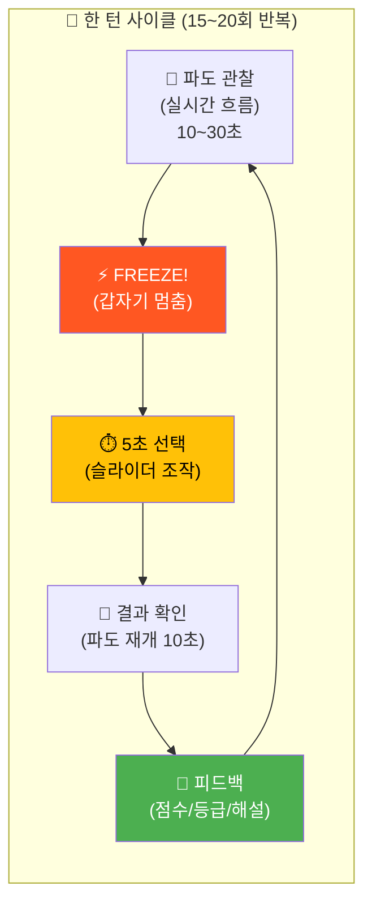

### 턴별 상세 흐름도

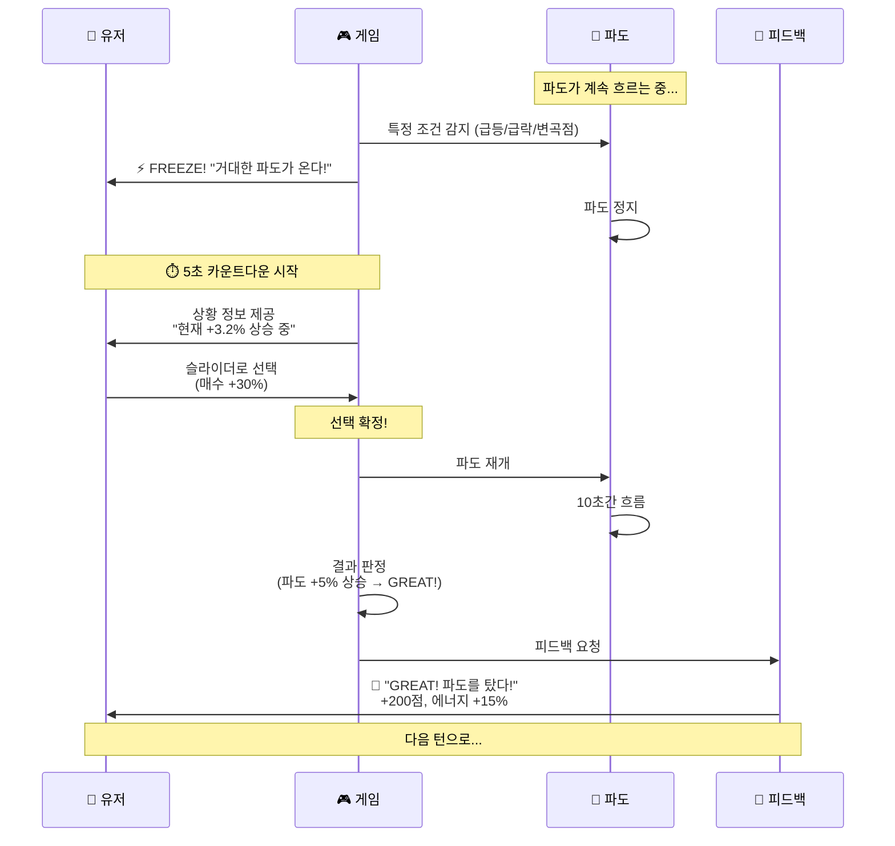

---

## 👤 유저 플레이 시나리오

### Phase 1: 스테이지 진입

```
┌─────────────────────────────────────────────────────────────────┐
│                                                                 │
│  ⚓ Stage 4: 에코프로의 바다에 오신 것을 환영합니다!            │
│                                                                 │
│  ╔═══════════════════════════════════════════════════════════╗ │
│  ║                                                           ║ │
│  ║   📊 종목: 에코프로 (086520)                              ║ │
│  ║   🌊 난이도: ★★★☆☆                                       ║ │
│  ║   🎯 목표: +15% 수익률 달성                               ║ │
│  ║   🔄 턴 수: 18턴                                          ║ │
│  ║   ⚡ 시작 에너지: 90%                                     ║ │
│  ║                                                           ║ │
│  ╠═══════════════════════════════════════════════════════════╣ │
│  ║                                                           ║ │
│  ║   💡 이 스테이지에서 배우는 것:                           ║ │
│  ║   • 변동성 높은 종목에서 추세 읽기                        ║ │
│  ║   • 급등/급락 구간에서 침착하게 판단하기                  ║ │
│  ║   • 5선지 물량 조절 (30%/60%) 연습                        ║ │
│  ║                                                           ║ │
│  ╚═══════════════════════════════════════════════════════════╝ │
│                                                                 │
│                    [ 🚢 항해 시작! ]                            │
│                                                                 │
└─────────────────────────────────────────────────────────────────┘
```

### Phase 2: 턴 진행 (15~20턴)

#### 턴 구조 타임라인

```mermaid
gantt
    title 한 턴의 시간 흐름 (약 25~45초)
    dateFormat ss
    axisFormat %S초
    
    section 관찰
    파도 흐름 관찰 (긴장감 조성)    :a1, 00, 20s
    
    section FREEZE
    ⚡ FREEZE 발동!                  :crit, a2, after a1, 1s
    
    section 선택
    5초 카운트다운 (슬라이더 조작)   :active, a3, after a2, 5s
    
    section 결과
    파도 재개 & 결과 확인            :a4, after a3, 10s
    
    section 피드백
    등급/점수/해설 표시              :a5, after a4, 5s
```

#### 턴 진행 시나리오 예시 (Turn 6)

```
┌─────────────────────────────────────────────────────────────────┐
│                                                                 │
│  🌊 Turn 6/18                    ⚡ 에너지: 72%  🏆 1,280점     │
│                                                                 │
│  ╔═══════════════════════════════════════════════════════════╗ │
│  ║                                                           ║ │
│  ║   ⚡ FREEZE! 파도가 급격히 변하고 있다!                   ║ │
│  ║                                                           ║ │
│  ║                    ⏱️  4  ⏱️                              ║ │
│  ║                                                           ║ │
│  ╠═══════════════════════════════════════════════════════════╣ │
│  ║                                                           ║ │
│  ║   📊 현재 상황:                                           ║ │
│  ║   • 현재가: 98,500원 (+5.8%)                              ║ │
│  ║   • 추세: 상승 지속 중 ▲▲                                 ║ │
│  ║   • 오늘 최고: 99,200원 / 최저: 93,000원                  ║ │
│  ║                                                           ║ │
│  ║   📦 내 상태:                                             ║ │
│  ║   • 화물: 150상자 (평단 95,000원)                         ║ │
│  ║   • 예수금: 5,750,000원                                   ║ │
│  ║   • 현재 수익: +525,000원 (+3.7%)                         ║ │
│  ║                                                           ║ │
│  ╠═══════════════════════════════════════════════════════════╣ │
│  ║                                                           ║ │
│  ║   🔴 매도 ◀━━━━━━━━━━━●━━━━━━━━━━━▶ 매수 🟢              ║ │
│  ║       -60%  -30%      0%      +30%  +60%                  ║ │
│  ║                                                           ║ │
│  ║   💡 "파도가 계속 올라가고 있어! 더 실을까, 내릴까?"      ║ │
│  ║                                                           ║ │
│  ╚═══════════════════════════════════════════════════════════╝ │
│                                                                 │
└─────────────────────────────────────────────────────────────────┘
```

### Phase 3: 턴 단계별 흐름

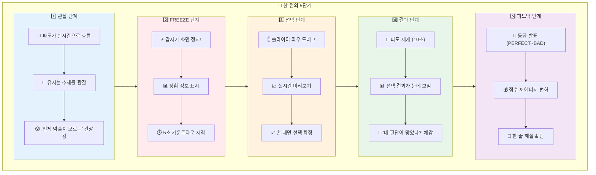

---

## 🧠 유저 플레이 패턴 분석

### 패턴별 행동 & 학습 포인트

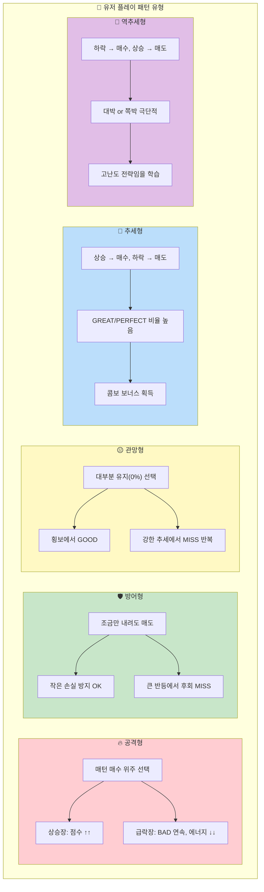

### 패턴별 상세 분석표

| 패턴 유형 | 특징적 행동 | 장점 | 단점 | 게임이 주는 피드백 | 실전에서 배우는 것 |
|:--------:|-----------|------|------|-------------------|-------------------|
| **🔥 공격형** | 매수 70%+ 선택 | 상승장에서 큰 수익 | 급락 시 큰 손실 | "파도가 너무 높을 때 올라타면 위험해요" | 고점 매수의 위험성 |
| **🛡️ 방어형** | 매도 60%+ 선택 | 손실 최소화 | 기회 놓침 많음 | "모든 하락이 폭락은 아니에요" | 조정과 하락의 구분 |
| **😐 관망형** | 유지 60%+ 선택 | 안정적 에너지 | 점수 낮음 | "기회비용도 비용이에요" | 적극적 판단의 필요성 |
| **🎯 추세형** | 추세 방향 따름 | 높은 GREAT 비율 | 변곡점에서 손실 | "추세를 타는 것이 유리합니다!" | 추세 추종 전략 |
| **🎲 역추세형** | 추세 반대 베팅 | 대박 가능 | 쪽박 가능 | "역추세는 고난도 기술이에요" | 타이밍의 어려움 |
| **⚖️ 분할형** | 30%씩 나눠서 | 리스크 분산 | 대박 어려움 | "현명한 분할 전략이에요!" | 분할 매수/매도 습관 |
| **🆘 물타기형** | 하락 때마다 물타기 | 평단 낮춤 | 에너지 고갈 | "물타기는 체력을 소모해요!" | 물타기의 양날의 검 |

---

## 📊 스테이지 구성 (15~20턴)

### 턴 구간별 난이도 설계

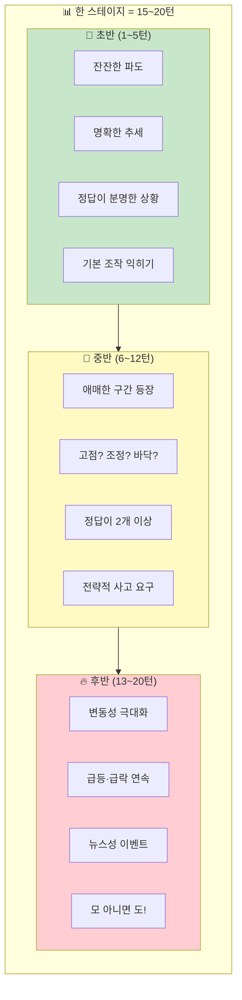

### 턴 구간별 시나리오 매트릭스

| 구간 | 턴 번호 | 파도 특성 | 상황 예시 | 학습 포인트 | 정답 명확도 |
|:----:|:------:|----------|----------|------------|:----------:|
| **🌱 초반** | 1~2 | 완만한 상승 | "장 초반 1% 상승 중" | 조작법 익히기 | ★★★★★ |
| | 3~4 | 완만한 하락 | "살짝 조정 중" | 매도 타이밍 | ★★★★☆ |
| | 5 | 횡보 | "잠시 쉬어가는 파도" | 유지의 가치 | ★★★★☆ |
| **🌿 중반** | 6~7 | 상승 후 횡보 | "고점 부근? 더 갈까?" | 익절 vs 홀딩 | ★★★☆☆ |
| | 8~9 | 하락 후 반등 | "바닥일까? 더 떨어질까?" | 저점 매수 판단 | ★★☆☆☆ |
| | 10~12 | 변동 구간 | "급등 후 급락, 어디로?" | 추세 전환 인식 | ★★☆☆☆ |
| **🔥 후반** | 13~15 | 급등 | "뉴스 발표! +8% 급등!" | 급등장 대응 | ★★★☆☆ |
| | 16~18 | 급락 | "실망 매물 출회! -7%!" | 급락장 대응 | ★★☆☆☆ |
| | 19~20 | 극한 변동 | "마지막 파도! 모 아니면 도!" | 종합 판단력 | ★☆☆☆☆ |

### 턴별 시나리오 예시 (18턴 기준)

```
┌─────────────────────────────────────────────────────────────────┐
│  📋 Stage 4: 에코프로 - 18턴 시나리오                          │
├─────┬────────────┬─────────────────────────────────────────────┤
│ 턴  │ 파도 상황   │ 상황 설명 & 힌트                            │
├─────┼────────────┼─────────────────────────────────────────────┤
│  1  │ +1.2% ▲   │ "오늘 장 시작이 좋다. 작은 파도가 밀려온다" │
│  2  │ +2.8% ▲▲  │ "파도가 점점 커지고 있다!"                  │
│  3  │ +2.1% ▲   │ "조금 숨 고르는 중... 쉬어갈까?"            │
│  4  │ +3.5% ▲▲  │ "다시 파도가 밀려온다!"                     │
│  5  │ +5.2% ▲▲▲ │ "꽤 높이 올라왔다. 고점일까?"               │
├─────┼────────────┼─────────────────────────────────────────────┤
│  6  │ +4.1% ▼   │ "파도가 조금 꺾이기 시작했다"               │
│  7  │ +2.3% ▼▼  │ "힘이 빠지고 있다... 내릴까?"               │
│  8  │ +0.5% ▼   │ "거의 바닥까지 내려왔다"                    │
│  9  │ -1.2% ▼   │ "파도가 마이너스로 내려갔다!"               │
│ 10  │ -0.3% ▲   │ "조금 반등하는 것 같다...?"                 │
│ 11  │ +1.8% ▲▲  │ "반등이 시작된 것 같다!"                    │
│ 12  │ +3.2% ▲▲  │ "V자 반등 중! 다시 올라간다!"               │
├─────┼────────────┼─────────────────────────────────────────────┤
│ 13  │ +6.5% ▲▲▲ │ "📰 호재 뉴스! 급등 시작!"                  │
│ 14  │ +9.2% ▲▲▲ │ "파도가 미쳐 날뛰고 있다!"                  │
│ 15  │ +7.8% ▼   │ "고점에서 차익실현 물량 출회"               │
│ 16  │ +4.2% ▼▼  │ "급하게 빠지고 있다! 폭풍우!"               │
│ 17  │ +2.1% ▼   │ "아직 불안정한 파도..."                     │
│ 18  │ +5.3% ▲▲  │ "마지막 파도! 어떻게 마무리할까?"           │
└─────┴────────────┴─────────────────────────────────────────────┘
```

---

## 🎮 피드백 & 보상 시스템

### 등급별 피드백 연출

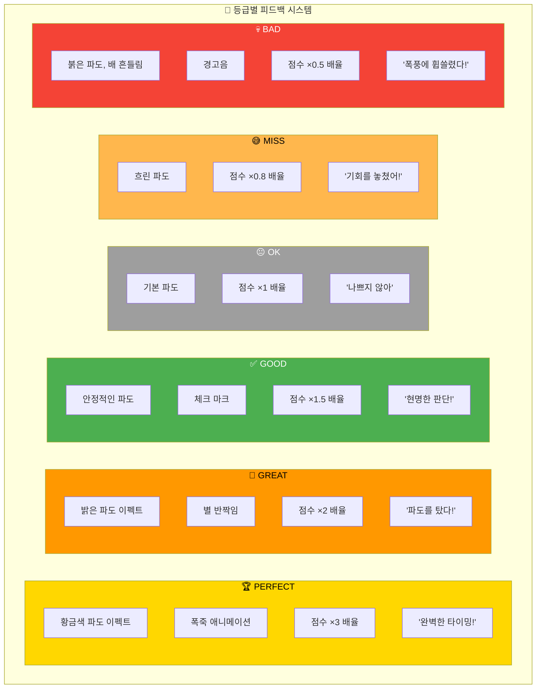

### 피드백 상세 매트릭스

| 등급 | 점수 배율 | 에너지 변화 | 시각 이펙트 | 사운드 | 메시지 예시 |
|:---:|:--------:|:----------:|-----------|--------|-----------|
| **🏆 PERFECT** | ×3.0 | +20% | 황금 파도 + 폭죽 | 팡파레 | "완벽한 타이밍! 전설의 항해사!" |
| **🎉 GREAT** | ×2.0 | +15% | 밝은 파도 + 별 | 성공음 | "파도를 탔다! 프로 항해사!" |
| **✅ GOOD** | ×1.5 | +10% | 안정 파도 + 체크 | 확인음 | "현명한 판단! 안전한 항해!" |
| **😐 OK** | ×1.0 | +5% | 기본 파도 | 기본음 | "나쁘지 않아. 계속 가보자!" |
| **😅 MISS** | ×0.8 | -5% | 흐린 파도 | 아쉬움 | "앗, 파도를 놓쳤어! 다음 기회에!" |
| **💀 BAD** | ×0.5 | -15% | 붉은 파도 + 흔들림 | 경고음 | "으악! 배가 흔들린다! 조심해!" |

### 피드백 화면 예시

```
┌─────────────────────────────────────────────────────────────────┐
│                                                                 │
│  ╔═══════════════════════════════════════════════════════════╗ │
│  ║                                                           ║ │
│  ║              🎉 G R E A T ! 🎉                            ║ │
│  ║                                                           ║ │
│  ║          "파도를 탔다! 프로 항해사급 선택!"               ║ │
│  ║                                                           ║ │
│  ╠═══════════════════════════════════════════════════════════╣ │
│  ║                                                           ║ │
│  ║   📊 이번 턴 결과:                                        ║ │
│  ║   ┌─────────────────────────────────────────────────┐    ║ │
│  ║   │ 내 선택    │ +30% 매수                          │    ║ │
│  ║   │ 파도 결과  │ +4.2% 상승 📈                      │    ║ │
│  ║   │ 판정      │ 추세 방향 일치! ✅                  │    ║ │
│  ║   └─────────────────────────────────────────────────┘    ║ │
│  ║                                                           ║ │
│  ║   💰 보상:                                                ║ │
│  ║   • 점수: +400 (기본 200 × 2배!)                         ║ │
│  ║   • 에너지: +15% (72% → 87%)                             ║ │
│  ║   • 콤보: 2연속! 다음 턴 추가 보너스!                    ║ │
│  ║                                                           ║ │
│  ╠═══════════════════════════════════════════════════════════╣ │
│  ║                                                           ║ │
│  ║   💡 TIP: "상승 추세에서 매수하면 파도의 힘을 빌릴 수    ║ │
│  ║          있어요. 추세를 따라가는 것이 기본 전략!"        ║ │
│  ║                                                           ║ │
│  ╚═══════════════════════════════════════════════════════════╝ │
│                                                                 │
│  🌊 다음 파도까지 6초... [━━━━━━━━░░░░]                        │
│                                                                 │
└─────────────────────────────────────────────────────────────────┘
```

---

## 📈 최종 전략 리포트

### 스테이지 완료 후 리포트 구조

```mermaid
flowchart TD
    subgraph Report["📊 최종 전략 리포트"]
        
        subgraph Summary["1️⃣ 요약 섹션"]
            S1["최종 수익률 / 점수 / 에너지"]
            S2["투자자 유형 판정"]
            S3["한 줄 평가"]
        end
        
        subgraph Analysis["2️⃣ 패턴 분석 섹션"]
            A1["선택 분포 차트<br/>(매수/매도/유지 비율)"]
            A2["턴별 선택 히스토리"]
            A3["BEST/WORST 하이라이트"]
        end
        
        subgraph Learning["3️⃣ 학습 포인트 섹션"]
            L1["이번 항해에서 배운 점 3가지"]
            L2["개선 포인트 제안"]
            L3["다음 스테이지 추천"]
        end
        
        subgraph Tags["4️⃣ 전략 태그"]
            T1["#추세추종형"]
            T2["#분할매수선호"]
            T3["#물타기보수적"]
        end
        
        Summary --> Analysis --> Learning --> Tags
    end
    
    style Summary fill:#e3f2fd
    style Analysis fill:#fff3e0
    style Learning fill:#e8f5e9
    style Tags fill:#fce4ec
```

### 최종 리포트 화면 예시

```
┌─────────────────────────────────────────────────────────────────┐
│                                                                 │
│  📊 Stage 4: 에코프로의 바다 - 항해 완료!                      │
│                                                                 │
│  ╔═══════════════════════════════════════════════════════════╗ │
│  ║                                                           ║ │
│  ║   🏆 최종 결과                                            ║ │
│  ║   ━━━━━━━━━━━━━━━━━━━━━━━━━━━━━━━━━━━━━━━━━━━━━━━━━━━    ║ │
│  ║                                                           ║ │
│  ║   💰 최종 수익률: +18.2% (목표 +15% 달성! ✅)            ║ │
│  ║   🏆 총 점수: 4,320점                                    ║ │
│  ║   ⚡ 잔여 에너지: 52%                                    ║ │
│  ║   🔥 최대 콤보: 4연속                                    ║ │
│  ║                                                           ║ │
│  ║   ━━━━━━━━━━━━━━━━━━━━━━━━━━━━━━━━━━━━━━━━━━━━━━━━━━━    ║ │
│  ║                                                           ║ │
│  ║   🧭 당신의 투자자 유형:                                  ║ │
│  ║                                                           ║ │
│  ║        🎯 "추세를 타는 공격형 항해사"                    ║ │
│  ║                                                           ║ │
│  ║   "파도의 방향을 읽고 과감하게 올라타는 스타일!          ║ │
│  ║    상승장에서 강하지만, 급락 시 리스크 관리 필요"        ║ │
│  ║                                                           ║ │
│  ╚═══════════════════════════════════════════════════════════╝ │
│                                                                 │
│  ╔═══════════════════════════════════════════════════════════╗ │
│  ║                                                           ║ │
│  ║   📊 선택 분포                                            ║ │
│  ║                                                           ║ │
│  ║   매수: ████████████████░░░░ 55%                         ║ │
│  ║   매도: ████████░░░░░░░░░░░░ 25%                         ║ │
│  ║   유지: ████░░░░░░░░░░░░░░░░ 20%                         ║ │
│  ║                                                           ║ │
│  ║   ━━━━━━━━━━━━━━━━━━━━━━━━━━━━━━━━━━━━━━━━━━━━━━━━━━━    ║ │
│  ║                                                           ║ │
│  ║   📈 판정 분포                                            ║ │
│  ║                                                           ║ │
│  ║   PERFECT: ██░░░░░░░░ 2회 (11%)                          ║ │
│  ║   GREAT:   ████████░░ 6회 (33%)                          ║ │
│  ║   GOOD:    ██████░░░░ 5회 (28%)                          ║ │
│  ║   OK:      ██░░░░░░░░ 2회 (11%)                          ║ │
│  ║   MISS:    ██░░░░░░░░ 2회 (11%)                          ║ │
│  ║   BAD:     █░░░░░░░░░ 1회 (6%)                           ║ │
│  ║                                                           ║ │
│  ╚═══════════════════════════════════════════════════════════╝ │
│                                                                 │
│  ╔═══════════════════════════════════════════════════════════╗ │
│  ║                                                           ║ │
│  ║   ⭐ BEST 턴                              💀 WORST 턴     ║ │
│  ║   ━━━━━━━━━━━━━━━━━━━━━━━━━━━━━━━━━━━━━━━━━━━━━━━━━━━    ║ │
│  ║                                                           ║ │
│  ║   Turn 14: PERFECT!                 Turn 9: BAD          ║ │
│  ║   +60% 매수 → +9.2% 급등            +30% 매수 → -3.2%    ║ │
│  ║   "급등 초기에 과감한 베팅!"        "하락 추세에서 매수" ║ │
│  ║                                                           ║ │
│  ╚═══════════════════════════════════════════════════════════╝ │
│                                                                 │
│  ╔═══════════════════════════════════════════════════════════╗ │
│  ║                                                           ║ │
│  ║   💡 이번 항해에서 배운 점                                ║ │
│  ║                                                           ║ │
│  ║   ┌───────────────────────────────────────────────────┐  ║ │
│  ║   │ 1️⃣ 급등 초기에는 과감하게 올라타도 좋다.          │  ║ │
│  ║   │    → Turn 14에서 +60% 매수로 PERFECT!             │  ║ │
│  ║   └───────────────────────────────────────────────────┘  ║ │
│  ║                                                           ║ │
│  ║   ┌───────────────────────────────────────────────────┐  ║ │
│  ║   │ 2️⃣ 하락 추세에서 섣부른 매수는 위험하다.          │  ║ │
│  ║   │    → Turn 9에서 하락 중 매수하다 BAD              │  ║ │
│  ║   │    → 추세 전환 확인 후 진입이 안전!               │  ║ │
│  ║   └───────────────────────────────────────────────────┘  ║ │
│  ║                                                           ║ │
│  ║   ┌───────────────────────────────────────────────────┐  ║ │
│  ║   │ 3️⃣ 분할 매수로 리스크를 줄이는 것도 방법이다.     │  ║ │
│  ║   │    → 30%씩 나눠서 진입하면 실패해도 회복 가능     │  ║ │
│  ║   └───────────────────────────────────────────────────┘  ║ │
│  ║                                                           ║ │
│  ╠═══════════════════════════════════════════════════════════╣ │
│  ║                                                           ║ │
│  ║   🏷️ 전략 태그                                            ║ │
│  ║                                                           ║ │
│  ║   #추세추종형  #공격적매수  #분할매수미흡  #급등장강함   ║ │
│  ║                                                           ║ │
│  ╚═══════════════════════════════════════════════════════════╝ │
│                                                                 │
│     [ 🔄 다시 도전 ]    [ ➡️ 다음 스테이지 ]    [ 🏠 홈 ]      │
│                                                                 │
└─────────────────────────────────────────────────────────────────┘
```

---

## 🎓 단계별 학습 커리큘럼

### 스테이지 → 학습 목표 매핑

```mermaid
flowchart TD
    subgraph Curriculum["🎓 10단계 학습 커리큘럼"]
        
        subgraph Beginner["🌱 입문 (Stage 1~3)"]
            B1["기본 조작 익히기"]
            B2["상승=매수, 하락=매도"]
            B3["3선지로 단순 판단"]
        end
        
        subgraph Intermediate["🌿 중급 (Stage 4~6)"]
            I1["5선지 물량 조절"]
            I2["분할 매수/매도 전략"]
            I3["물타기 개념 도입"]
        end
        
        subgraph Advanced["🔥 고급 (Stage 7~9)"]
            A1["고변동성 대응"]
            A2["에너지(멘탈) 관리"]
            A3["역추세 vs 추세"]
        end
        
        subgraph Master["👑 마스터 (Stage 10)"]
            M1["종합 판단력"]
            M2["랜덤 종목 대응"]
            M3["극한 상황 생존"]
        end
        
        Beginner --> Intermediate --> Advanced --> Master
    end
    
    style Beginner fill:#c8e6c9
    style Intermediate fill:#fff9c4
    style Advanced fill:#ffcdd2
    style Master fill:#e1bee7
```

### 스테이지별 학습 목표 상세표

| Stage | 종목 | 핵심 학습 목표 | 새로 배우는 개념 | 난이도 변화 |
|:-----:|------|---------------|-----------------|:----------:|
| **1** | 삼성전자 | 슬라이더 조작 익히기 | 매수/매도/유지 기본 | 🟢 |
| **2** | SK하이닉스 | 추세 따라가기 | 상승 추세에서 매수 | 🟢 |
| **3** | 현대차 | 타이밍 감각 | 변곡점 인식 | 🟢🟡 |
| **4** | 에코프로 | 물량 조절 시작 | 30%/60% 구분 | 🟡 |
| **5** | 한미반도체 | 물타기 해금 | 평단 낮추기 전략 | 🟡 |
| **6** | 크래프톤 | 이벤트 대응 | 뉴스성 급등락 | 🟡🟠 |
| **7** | 레인보우로보틱스 | 폭풍 생존 | 에너지 관리 | 🟠 |
| **8** | 마인즈랩 | 극한 판단 | 빠른 추세 전환 | 🟠🔴 |
| **9** | 알체라 | 멘탈 관리 | 연속 손실 대응 | 🔴 |
| **10** | ??? (랜덤) | 종합 실력 | 모든 것! | 🔴⚫ |

---

## 📝 핵심 개념 정리 (용어집)

| 용어 | 게임 내 표현 | 실전 주식 대응 | 배우는 포인트 |
|:----:|-------------|---------------|--------------|
| **파도** | 가격 차트 | 주가 흐름 | 시각적 추세 인식 |
| **화물** | 보유 주식 | 보유 수량 | 물량 개념 |
| **예수금** | 현금 잔고 | 매수 가능 금액 | 현금 관리 |
| **평단가** | 평균 매입가 | 평균 단가 | 손익분기점 |
| **FREEZE** | 결정 순간 | 체결 직전 | 순간 판단력 |
| **에너지** | 멘탈/체력 | 심리적 여유 | 리스크 관리 |
| **물타기** | 추가 매수 | 평단 낮추기 | 양날의 검 |
| **추세** | 파도 방향 | 주가 방향성 | 추세 추종 |

---

# 🎮 PART 1: 인터페이스 설계

## 📱 핵심 UI: 슬라이더 조작 방식

### 왜 슬라이더인가?

```
┌─────────────────────────────────────────────────────────────────┐
│                                                                 │
│  ❌ 기존 버튼 방식의 문제점:                                    │
│  • 버튼이 많으면 5초 안에 선택 어려움                          │
│  • 배가 흔들리는 상황에서 정확한 터치 힘듦                      │
│  • 물량 조절이 직관적이지 않음                                  │
│                                                                 │
│  ✅ 슬라이더 방식의 장점:                                       │
│  • 한 손가락으로 좌우 드래그만 하면 됨                          │
│  • 드래그 거리로 물량 자동 조절                                 │
│  • 실시간으로 예상 결과 확인 가능                               │
│  • 직관적! 왼쪽=매도, 오른쪽=매수                               │
│                                                                 │
└─────────────────────────────────────────────────────────────────┘
```

### 슬라이더 UI 상세

```
┌─────────────────────────────────────────────────────────────────┐
│                                                                 │
│  ⏱️  4  초                    ⚡ 에너지: 78%                    │
│                                                                 │
│  ═══════════════════════════════════════════════════════════   │
│                                                                 │
│              🔴 매도                    매수 🟢                 │
│                                                                 │
│    전량     대량    소량    유지    소량    대량     전량       │
│     ◀━━━━━━━━━━━━━━━━━━━━━●━━━━━━━━━━━━━━━━━━━━━▶             │
│    -100%   -60%   -30%    0%    +30%   +60%   +100%            │
│                          ↑                                      │
│                     [드래그!]                                   │
│                                                                 │
│  ═══════════════════════════════════════════════════════════   │
│                                                                 │
│  📊 현재 위치: 유지 (0%)                                        │
│  💰 예상 변화: 변동 없음                                        │
│                                                                 │
│  💡 "오른쪽으로 밀면 매수, 왼쪽으로 밀면 매도!"                 │
│                                                                 │
└─────────────────────────────────────────────────────────────────┘
```

### 스테이지별 슬라이더 범위

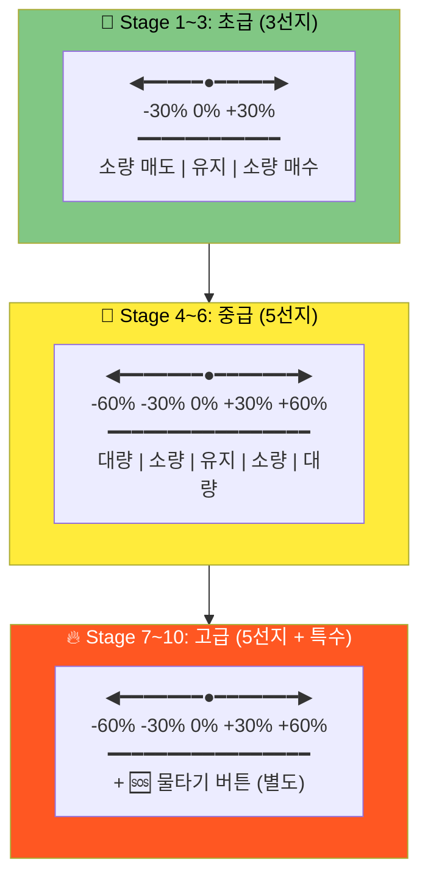

---

## 🖥️ 전체 게임 화면 레이아웃

### 메인 게임 화면

```
┌─────────────────────────────────────────────────────────────────┐
│ ┌─────────────────────────────────────────────────────────────┐ │
│ │  ⚓ Stage 4: 에코프로의 바다        ⚡ 78%  🏆 2,450점     │ │
│ └─────────────────────────────────────────────────────────────┘ │
│                                                                 │
│ ┌─────────────────────────────────────────────────────────────┐ │
│ │                                                             │ │
│ │  💰 총 자산: 12,500,000원                                  │ │
│ │  📦 화물: 300상자 (평단 48,000원)                          │ │
│ │  📈 현재 수익: +1,500,000원 (+12.5%)                       │ │
│ │                                                             │ │
│ └─────────────────────────────────────────────────────────────┘ │
│                                                                 │
│ ┌─────────────────────────────────────────────────────────────┐ │
│ │                        🌊🌊                                 │ │
│ │                     🌊      🌊                              │ │
│ │                  🌊    ⛵     🌊       ← 너의 배!           │ │
│ │               🌊      /|\\      🌊                          │ │
│ │            🌊~~~~~~~~/~|~\\~~~~~~~~🌊                       │ │
│ │         🌊          /  |  \\          🌊                    │ │
│ │      🌊~~~~~~~~~~~~/~~~|~~~\\~~~~~~~~~~~~🌊                 │ │
│ │   🌊                                        🌊              │ │
│ │                                                             │ │
│ │   📈 파도 높이: +5.2% 상승 중! ▲                           │ │
│ │                                                             │ │
│ └─────────────────────────────────────────────────────────────┘ │
│                                                                 │
│ ┌─────────────────────────────────────────────────────────────┐ │
│ │  ⚡ [████████████████░░░░░░░░░░] 78%                        │ │
│ └─────────────────────────────────────────────────────────────┘ │
│                                                                 │
│   🌊 파도가 흐르고 있습니다... 집중하세요!                      │
│                                                                 │
└─────────────────────────────────────────────────────────────────┘
```

### FREEZE 발동 시 화면

```
┌─────────────────────────────────────────────────────────────────┐
│                                                                 │
│  ╔═══════════════════════════════════════════════════════════╗ │
│  ║                                                           ║ │
│  ║           ⚡ 거대한 파도가 온다! ⚡                       ║ │
│  ║                                                           ║ │
│  ║                    ⏱️  4  ⏱️                              ║ │
│  ║                                                           ║ │
│  ╠═══════════════════════════════════════════════════════════╣ │
│  ║                                                           ║ │
│  ║   📊 상황: 급등 중! +8.5%                                 ║ │
│  ║   📦 현재 화물: 300상자                                   ║ │
│  ║   💰 예수금: 5,000,000원                                  ║ │
│  ║                                                           ║ │
│  ╠═══════════════════════════════════════════════════════════╣ │
│  ║                                                           ║ │
│  ║         🔴 매도 ◀━━━━━━━━━●━━━━━━━━━▶ 매수 🟢            ║ │
│  ║              -60%  -30%   0%   +30%  +60%                 ║ │
│  ║                          ↑                                ║ │
│  ║                    [드래그하세요!]                        ║ │
│  ║                                                           ║ │
│  ╠═══════════════════════════════════════════════════════════╣ │
│  ║                                                           ║ │
│  ║   📈 예상 결과:                                           ║ │
│  ║   • +30% 매수 시: 화물 390상자, 예수금 3,500,000원       ║ │
│  ║   • -30% 매도 시: 화물 210상자, 예수금 6,500,000원       ║ │
│  ║                                                           ║ │
│  ╚═══════════════════════════════════════════════════════════╝ │
│                                                                 │
└─────────────────────────────────────────────────────────────────┘
```

---

## 🎯 슬라이더 조작 알고리즘

### 드래그 → 물량 계산

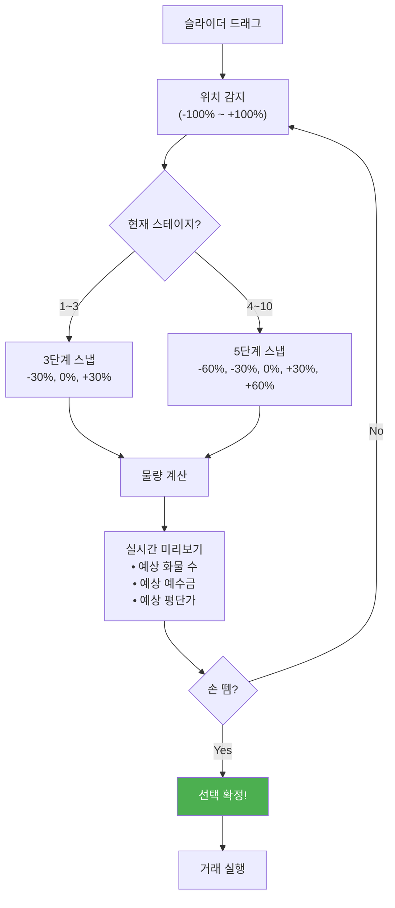

### 물량 계산 공식

```
[매수 시]
매수_금액 = 예수금 × 슬라이더_비율
매수_수량 = 매수_금액 ÷ 현재가
새_평단가 = (기존_평단가 × 기존_수량 + 현재가 × 매수_수량) ÷ (기존_수량 + 매수_수량)

[매도 시]  
매도_수량 = 보유_수량 × 슬라이더_비율
매도_금액 = 매도_수량 × 현재가
실현_손익 = (현재가 - 평단가) × 매도_수량

[예시: +30% 매수]
예수금: 5,000,000원
현재가: 50,000원
슬라이더: +30%

매수_금액 = 5,000,000 × 0.3 = 1,500,000원
매수_수량 = 1,500,000 ÷ 50,000 = 30상자
```

---

## 📱 제스처 대안 (모바일)

### 옵션 A: 스와이프 방식

```
┌─────────────────────────────────────────────────────────────────┐
│                                                                 │
│  📱 스와이프 제스처                                             │
│                                                                 │
│  ┌─────────────────────────────────────────────────────────┐   │
│  │                                                         │   │
│  │          👆 위로 스와이프 = 매수                        │   │
│  │                    ↑                                    │   │
│  │                    │                                    │   │
│  │     👈 ←──────── ⛵ ────────→ 👉                       │   │
│  │   왼쪽 = 매도      │      오른쪽 = 매수                 │   │
│  │                    ↓                                    │   │
│  │          👇 아래로 스와이프 = 매도                      │   │
│  │                                                         │   │
│  │  • 짧게 스와이프: 소량 (30%)                            │   │
│  │  • 길게 스와이프: 대량 (60%)                            │   │
│  │  • 탭: 유지 (0%)                                        │   │
│  │                                                         │   │
│  └─────────────────────────────────────────────────────────┘   │
│                                                                 │
└─────────────────────────────────────────────────────────────────┘
```

### 옵션 B: 기울기 방식 (자이로센서)

```
┌─────────────────────────────────────────────────────────────────┐
│                                                                 │
│  📱 기울기 조작                                                 │
│                                                                 │
│  ┌─────────────────────────────────────────────────────────┐   │
│  │                                                         │   │
│  │       📱 왼쪽 기울임          📱 오른쪽 기울임          │   │
│  │         ╱                           ╲                   │   │
│  │        ╱                             ╲                  │   │
│  │       ╱  🔴 매도                매수 🟢 ╲               │   │
│  │      ╱                                   ╲              │   │
│  │                                                         │   │
│  │              📱 수평 = 유지 (홀딩)                      │   │
│  │              ━━━━━━━━━━━━━━━━━━                         │   │
│  │                                                         │   │
│  │  • 약간 기울임: 소량 (30%)                              │   │
│  │  • 많이 기울임: 대량 (60%)                              │   │
│  │  • 수평 유지 후 탭: 확정                                │   │
│  │                                                         │   │
│  └─────────────────────────────────────────────────────────┘   │
│                                                                 │
└─────────────────────────────────────────────────────────────────┘
```

### 권장: 슬라이더 + 탭 조합

```
┌─────────────────────────────────────────────────────────────────┐
│                                                                 │
│  ✅ 최종 권장 UI: 슬라이더 + 탭                                 │
│                                                                 │
│  ┌─────────────────────────────────────────────────────────┐   │
│  │                                                         │   │
│  │   ⏱️  3                                                 │   │
│  │                                                         │   │
│  │   🔴 ◀━━━━━━━━━━━●━━━━━━━━━━━▶ 🟢                      │   │
│  │       매도        유지        매수                      │   │
│  │                    ↑                                    │   │
│  │              [좌우 드래그]                              │   │
│  │                                                         │   │
│  │   ────────────────────────────────────────────────     │   │
│  │                                                         │   │
│  │        [🆘 물타기]        [확정!]                       │   │
│  │         (Stage 5+)                                      │   │
│  │                                                         │   │
│  └─────────────────────────────────────────────────────────┘   │
│                                                                 │
│  💡 조작법:                                                     │
│  1. 슬라이더를 좌우로 드래그                                   │
│  2. 원하는 위치에서 손 떼기 = 자동 확정                        │
│  3. 또는 [확정!] 버튼 탭                                       │
│  4. 시간 초과 시 = 현재 위치로 자동 확정                       │
│                                                                 │
└─────────────────────────────────────────────────────────────────┘
```

---

# 🌊 PART 2: 10단계 상세 설계

## 📊 종목별 특성

### 각 스테이지 = 하나의 종목

| Stage | 종목 | 특성 | 일 변동성 | 손맛 포인트 |
|:-----:|------|------|:---------:|-------------|
| 1 | 삼성전자 | 안정형 대형주 | 1~2% | 느긋한 파도, 기초 연습 |
| 2 | SK하이닉스 | 안정형 반도체 | 2~3% | 조금 빠른 파도 |
| 3 | 현대차 | 안정형 자동차 | 2~3% | 예측 가능한 흐름 |
| 4 | 에코프로 | 변동형 2차전지 | 4~6% | 롤러코스터 시작! |
| 5 | 한미반도체 | 변동형 반도체 | 5~7% | 급등락 맛보기 |
| 6 | 크래프톤 | 변동형 게임 | 4~6% | 이벤트성 급등 |
| 7 | 레인보우로보틱스 | 고변동 AI | 8~15% | 미친 파도! |
| 8 | 마인즈랩 | 고변동 AI | 10~20% | 심장 쫄깃 |
| 9 | 알체라 | 극한 변동 | 15~30% | 지옥의 파도 |
| 10 | ??? (랜덤) | 극한 변동 | 20%+ | 최종 보스! |

---

## 🎯 Stage 1: 삼성전자의 바다 (튜토리얼)

### 스테이지 정보

```
┌─────────────────────────────────────────────────────────────────┐
│                                                                 │
│  🌊 Stage 1: 삼성전자의 바다                                    │
│  ━━━━━━━━━━━━━━━━━━━━━━━━━━━━━━━━━━━━━━━━━━━━━━━━━━━━━━━━━━━   │
│                                                                 │
│  📊 종목: 삼성전자 (005930)                                     │
│  🌊 난이도: ★☆☆☆☆ (잔잔한 호수)                               │
│  ⏱️ 제한시간: 3분                                               │
│  🎯 목표 수익률: +5%                                            │
│  ⚡ 시작 에너지: 100%                                           │
│  🔄 FREEZE 횟수: 5회                                            │
│                                                                 │
│  📈 특징:                                                       │
│  • 변동폭이 작아 실수해도 큰 손해 없음                          │
│  • 천천히 조작법을 익히는 단계                                  │
│  • 파도가 예측 가능함                                           │
│                                                                 │
│  🎮 선택지: 3개 (-30%, 0%, +30%)                                │
│                                                                 │
└─────────────────────────────────────────────────────────────────┘
```

### Stage 1 FREEZE 시나리오 (5회)

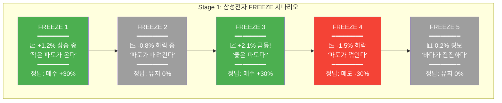

### Stage 1 상세 FREEZE 화면

```
┌─────────────────────────────────────────────────────────────────┐
│                                                                 │
│  ⚡ FREEZE 1/5                              ⏱️  5               │
│                                                                 │
│  ╔═══════════════════════════════════════════════════════════╗ │
│  ║                                                           ║ │
│  ║   📈 상황: 작은 파도가 밀려온다!                          ║ │
│  ║                                                           ║ │
│  ║   현재가: 72,500원 (+1.2%)                                ║ │
│  ║   추세: 상승 중 ▲                                         ║ │
│  ║                                                           ║ │
│  ║   📦 내 화물: 100상자 (평단 71,500원)                     ║ │
│  ║   💰 예수금: 7,850,000원                                  ║ │
│  ║   📊 현재 수익: +100,000원 (+1.4%)                        ║ │
│  ║                                                           ║ │
│  ╠═══════════════════════════════════════════════════════════╣ │
│  ║                                                           ║ │
│  ║      🔴 ◀━━━━━━━━━━━●━━━━━━━━━━━▶ 🟢                     ║ │
│  ║          매도       유지       매수                       ║ │
│  ║          -30%       0%        +30%                        ║ │
│  ║                                                           ║ │
│  ╠═══════════════════════════════════════════════════════════╣ │
│  ║                                                           ║ │
│  ║   💡 힌트: "파도가 올라가고 있어! 짐을 실어볼까?"         ║ │
│  ║                                                           ║ │
│  ╚═══════════════════════════════════════════════════════════╝ │
│                                                                 │
└─────────────────────────────────────────────────────────────────┘
```

---

## 🎯 Stage 4: 에코프로의 바다 (본격 시작)

### 스테이지 정보

```
┌─────────────────────────────────────────────────────────────────┐
│                                                                 │
│  🌊 Stage 4: 에코프로의 바다                                    │
│  ━━━━━━━━━━━━━━━━━━━━━━━━━━━━━━━━━━━━━━━━━━━━━━━━━━━━━━━━━━━   │
│                                                                 │
│  📊 종목: 에코프로 (086520)                                     │
│  🌊 난이도: ★★★☆☆ (큰 파도)                                   │
│  ⏱️ 제한시간: 5분                                               │
│  🎯 목표 수익률: +15%                                           │
│  ⚡ 시작 에너지: 90%                                            │
│  🔄 FREEZE 횟수: 9회                                            │
│                                                                 │
│  📈 특징:                                                       │
│  • 2차전지 테마로 급등락 빈번                                   │
│  • 하루에 ±5% 변동 흔함                                        │
│  • 추세를 타면 큰 수익, 역행하면 큰 손실                        │
│                                                                 │
│  🎮 선택지: 5개 (-60%, -30%, 0%, +30%, +60%)                    │
│                                                                 │
│  ⚠️ 주의: 이제부터 진짜 파도가 시작됩니다!                      │
│                                                                 │
└─────────────────────────────────────────────────────────────────┘
```

### Stage 4 FREEZE 시나리오 (9회)

| # | 상황 | 파도 높이 | 메시지 | 정답 | 피드백 |
|:-:|------|:---------:|--------|:----:|--------|
| 1 | 장 초반 상승 | +3.2% | "오늘 시작이 좋다!" | +30% | "파도를 탔다!" |
| 2 | 상승 지속 | +5.8% | "파도가 커진다!" | +30% | "더 실어!" |
| 3 | 고점 근처 | +7.2% | "꼭대기인가...?" | -30% | "현명한 익절!" |
| 4 | 하락 시작 | +4.1% | "파도가 꺾인다!" | -60% | "위험 회피!" |
| 5 | 급락 | -2.3% | "폭풍이 온다!" | 0% | "버텨!" |
| 6 | 바닥 근처? | -4.8% | "바닥인가...?" | +30% | "용감한 매수!" |
| 7 | 반등 시작 | -2.1% | "반등한다!" | +60% | "대박!" |
| 8 | 상승 재개 | +1.5% | "다시 올라간다" | +30% | "추세 추종!" |
| 9 | 마무리 | +6.2% | "마지막 파도!" | 0% | "안전하게 마무리" |

### Stage 4 핵심 FREEZE 상세

```
┌─────────────────────────────────────────────────────────────────┐
│                                                                 │
│  ⚡ FREEZE 6/9: 에코프로                    ⏱️  4               │
│                                                                 │
│  ╔═══════════════════════════════════════════════════════════╗ │
│  ║                                                           ║ │
│  ║   📉 상황: 폭풍 속 바닥인가...?!                          ║ │
│  ║                                                           ║ │
│  ║   현재가: 95,200원 (-4.8%)                                ║ │
│  ║   오늘 최고: 104,800원 / 최저: 94,500원                   ║ │
│  ║   추세: 급락 후 횡보 ━                                    ║ │
│  ║                                                           ║ │
│  ║   📦 내 화물: 80상자 (평단 98,000원)                      ║ │
│  ║   💰 예수금: 6,200,000원                                  ║ │
│  ║   📊 현재 손실: -224,000원 (-2.9%)                        ║ │
│  ║                                                           ║ │
│  ╠═══════════════════════════════════════════════════════════╣ │
│  ║                                                           ║ │
│  ║   🔴 ◀━━━━━━━━━━━━━●━━━━━━━━━━━━━▶ 🟢                    ║ │
│  ║       -60%  -30%    0%    +30%  +60%                      ║ │
│  ║                                                           ║ │
│  ║   💡 "바닥에서 사면 영웅, 바닥인 줄 알고 사면 바보"       ║ │
│  ║                                                           ║ │
│  ╚═══════════════════════════════════════════════════════════╝ │
│                                                                 │
└─────────────────────────────────────────────────────────────────┘
```

---

## 🎯 Stage 7: 레인보우로보틱스의 바다 (폭풍)

### 스테이지 정보

```
┌─────────────────────────────────────────────────────────────────┐
│                                                                 │
│  ⛈️ Stage 7: 레인보우로보틱스의 바다                            │
│  ━━━━━━━━━━━━━━━━━━━━━━━━━━━━━━━━━━━━━━━━━━━━━━━━━━━━━━━━━━━   │
│                                                                 │
│  📊 종목: 레인보우로보틱스 (277810)                             │
│  🌊 난이도: ★★★★☆ (폭풍의 바다)                               │
│  ⏱️ 제한시간: 8분                                               │
│  🎯 목표 수익률: +30%                                           │
│  ⚡ 시작 에너지: 75%                                            │
│  🔄 FREEZE 횟수: 14회                                           │
│                                                                 │
│  📈 특징:                                                       │
│  • AI/로봇 테마주, 뉴스에 극도로 민감                           │
│  • 하루에 ±10~20% 변동 가능                                    │
│  • 한 번의 선택이 게임을 좌우                                   │
│                                                                 │
│  🎮 선택지: 5개 + 🆘 물타기                                     │
│                                                                 │
│  ⚠️ 경고: 에너지 관리가 생존의 핵심입니다!                      │
│                                                                 │
└─────────────────────────────────────────────────────────────────┘
```

### Stage 7 핵심 시나리오

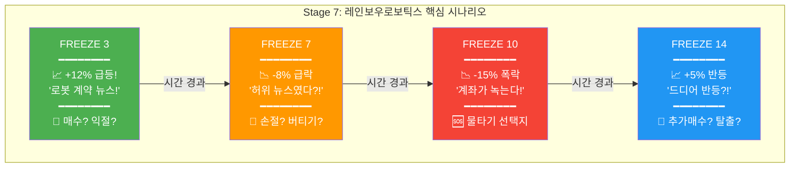

### Stage 7 물타기 시나리오

```
┌─────────────────────────────────────────────────────────────────┐
│                                                                 │
│  ⚡ FREEZE 10/14: 레인보우로보틱스          ⏱️  5               │
│                                                                 │
│  ╔═══════════════════════════════════════════════════════════╗ │
│  ║                                                           ║ │
│  ║   💀 상황: 계좌가 녹고 있다!                              ║ │
│  ║                                                           ║ │
│  ║   현재가: 42,500원 (-15.0%)                               ║ │
│  ║   오늘 최고: 56,000원 / 최저: 41,800원                    ║ │
│  ║   추세: 폭락 중 ▼▼▼                                       ║ │
│  ║                                                           ║ │
│  ║   📦 내 화물: 200상자 (평단 52,000원)                     ║ │
│  ║   💰 예수금: 4,500,000원                                  ║ │
│  ║   📊 현재 손실: -1,900,000원 (-18.3%)                     ║ │
│  ║   ⚡ 에너지: 45% (위험!)                                  ║ │
│  ║                                                           ║ │
│  ╠═══════════════════════════════════════════════════════════╣ │
│  ║                                                           ║ │
│  ║   🔴 ◀━━━━━━━━━━━━━●━━━━━━━━━━━━━▶ 🟢                    ║ │
│  ║       -60%  -30%    0%    +30%  +60%                      ║ │
│  ║                                                           ║ │
│  ║   ━━━━━━━━━━━━━━━━━━━━━━━━━━━━━━━━━━━━━━━━━━━━━━━━━━━━   ║ │
│  ║                                                           ║ │
│  ║   🆘 [물타기] ← 탭하면 평단가 낮춤! (에너지 -10%)         ║ │
│  ║       → 새 평단가: 48,200원 (-7.3% 개선!)                 ║ │
│  ║                                                           ║ │
│  ╠═══════════════════════════════════════════════════════════╣ │
│  ║                                                           ║ │
│  ║   ⚠️ 물타기 시 에너지 35%로 감소! 신중하게!               ║ │
│  ║                                                           ║ │
│  ╚═══════════════════════════════════════════════════════════╝ │
│                                                                 │
└─────────────────────────────────────────────────────────────────┘
```

---

## 🎯 Stage 10: ???의 바다 (최종 보스)

### 스테이지 정보

```
┌─────────────────────────────────────────────────────────────────┐
│                                                                 │
│  👑 Stage 10: ???의 바다 (최종 보스)                            │
│  ━━━━━━━━━━━━━━━━━━━━━━━━━━━━━━━━━━━━━━━━━━━━━━━━━━━━━━━━━━━   │
│                                                                 │
│  📊 종목: ??? (게임 시작 시 랜덤 공개)                          │
│  🌊 난이도: ★★★★★ (파도의 신전)                               │
│  ⏱️ 제한시간: 15분                                              │
│  🎯 목표 수익률: +100%                                          │
│  ⚡ 시작 에너지: 60%                                            │
│  🔄 FREEZE 횟수: 20회                                           │
│                                                                 │
│  📈 특징:                                                       │
│  • 종목이 랜덤! 어떤 파도가 올지 모름                           │
│  • 변동성 극한! 한 번에 ±30% 가능                              │
│  • 모든 스킬을 총동원해야 생존                                  │
│                                                                 │
│  🎮 선택지: 5개 + 🆘 물타기                                     │
│                                                                 │
│  👑 "여기까지 온 자만이 파도의 신이 될 자격이 있다"            │
│                                                                 │
└─────────────────────────────────────────────────────────────────┘
```

### Stage 10 극한 시나리오

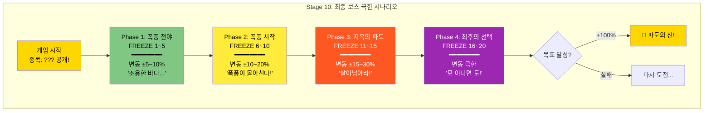

---

# ⚙️ PART 3: 핵심 알고리즘

> 이 파트는 **UI 연출을 제외한 순수 알고리즘/로직 구조**를 정리한 섹션입니다.  
> 실제 구현 시에는 각 모듈을 `클래스/함수/파일` 단위로 분리해서 사용하기 좋게 만듭니다.

## 🧠 전체 게임 알고리즘 구조

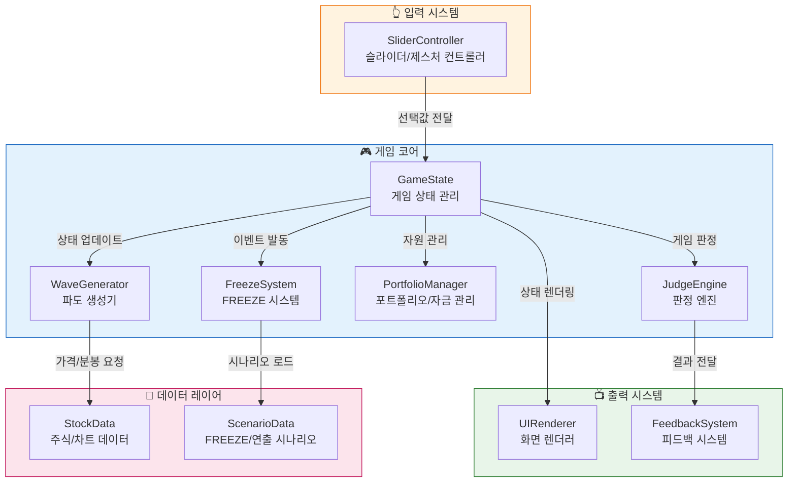

**주요 모듈 요약**

- **`GameState`**: 스테이지, 시간, 에너지, 콤보, 점수 등 전체 게임 상태를 보관·갱신하는 코어
- **`WaveGenerator`**: 실제/가상 차트를 기반으로 파도(가격 흐름)를 실시간으로 생성하는 엔진
- **`FreezeSystem`**: FREEZE 발동 조건 체크, 카운트다운, 슬라이더 입력 수집을 담당하는 상태 머신
- **`PortfolioManager`**: 예수금/보유 수량/평단가/실현손익을 계산하는 재무 연산 모듈
- **`JudgeEngine`**: 선택 결과 vs 파도 결과를 비교하여 판정·에너지·점수를 산출하는 모듈
- **`SliderController`**: 드래그/스와이프/기울기 입력을 표준화된 슬라이더 비율(-100~+100)로 변환
- **`StockData`**: 종목별 차트·분봉·메타데이터를 로딩·캐싱
- **`ScenarioData`**: 스테이지별 FREEZE 타이밍, 힌트, 연출 텍스트를 보관

---

## 🎚 슬라이더 조작 알고리즘

### 1) 슬라이더 위치 → 스냅 포인트 매핑

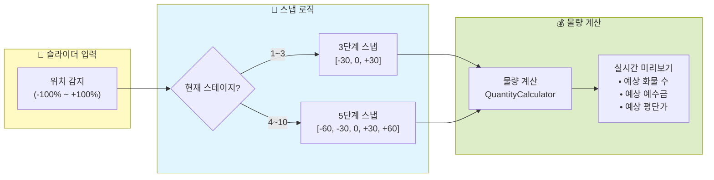

#### 의사코드: 스냅 알고리즘

```text
function snapToGrid(rawPosition, stageLevel):
    // rawPosition: -100 ~ +100
    // stageLevel: 1 ~ 10
    if stageLevel <= 3:
        snapPoints = [-30, 0, +30]           // 3선지
    else:
        snapPoints = [-60, -30, 0, +30, +60] // 5선지

    minDistance = INF
    snappedValue = 0

    for point in snapPoints:
        distance = abs(rawPosition - point)
        if distance < minDistance:
            minDistance = distance
            snappedValue = point

    return snappedValue
```

### 2) 슬라이더 비율 → 물량 계산 공식

```text
[매수 시]
매수_금액(buyAmount) = 예수금(deposit) × 슬라이더_비율(sliderRatio)
매수_수량(buyQty)   = floor(매수_금액 ÷ 현재가(currentPrice))
새_평단가(newAvg)   = (기존_평단가(oldAvg) × 기존_수량(oldQty)
                      + 현재가(currentPrice) × 매수_수량(buyQty))
                      ÷ (기존_수량 + 매수_수량)

[매도 시]
매도_수량(sellQty)  = 보유_수량(holdingQty) × 슬라이더_비율(sliderRatio)
매도_금액(sellAmt)  = 매도_수량 × 현재가
실현_손익(realPnL)  = (현재가 - 평단가) × 매도_수량
```

#### 물량 계산 요약표

| 구분 | 수식 | 비고 |
|:----:|------|------|
| 매수 금액 | `deposit × ratio` | ratio: 0.3 / 0.6 |
| 매수 수량 | `floor(buyAmount ÷ currentPrice)` | 내림 처리 |
| 새 평단가 | `(oldAvg×oldQty + price×buyQty) ÷ (oldQty+buyQty)` | 가중 평균 |
| 매도 수량 | `holdingQty × ratio` | 비율 매도 |
| 실현 손익 | `(price - avg) × sellQty` | 원화 기준 |

---

## 🌊 파도 생성 알고리즘

### 1) 실제 차트 데이터 기반 파도 생성

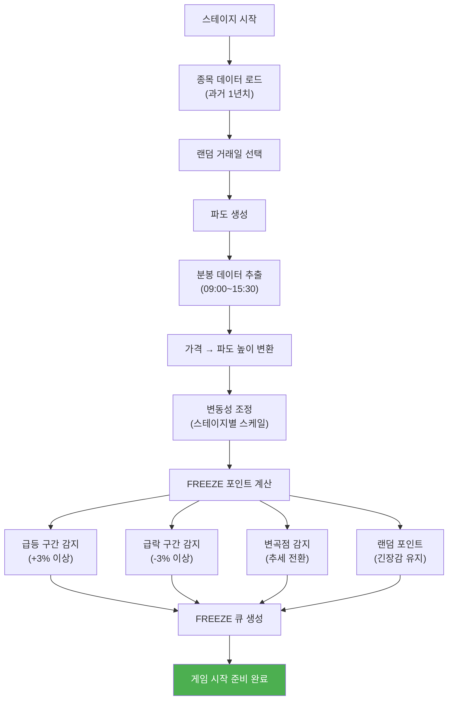

### 2) 파도 높이 계산 공식

```text
[1단계] 변동률(%) 계산
파도_높이(rate) = (현재가(currentPrice) - 시가(openPrice))
                  ÷ 시가(openPrice) × 100

[2단계] 시각 좌표로 변환
시각적_높이(pixelY) = 기준선_Y + (파도_높이 × 스케일_팩터)

[3단계] 스테이지별 스케일 팩터
스케일_팩터 = {
    Stage 1~3:  50   // 작은 파도
    Stage 4~6: 100   // 중간 파도
    Stage 7~9: 150   // 큰 파도
    Stage 10:  200   // 극한 파도
}

[예시]
시가: 50,000원
현재가: 52,500원
파도_높이 = (52,500 - 50,000) ÷ 50,000 × 100 = +5%
Stage 4 시각적_높이 = 기준선_Y + (5 × 100) = 기준선_Y + 500px
```

#### 스테이지별 파도 스케일 요약표

| 스테이지 | 일 변동성 | 스케일 팩터 | 체감 난이도 | 시각적 특징 |
|:--------:|:--------:|:----------:|:----------:|------------|
| 1~3 | 1~3% | 50 | 잔잔함 | 작은 출렁임 위주 |
| 4~6 | 4~7% | 100 | 보통 | 화면 절반 이상 흔들림 |
| 7~9 | 8~30% | 150 | 어려움 | 큰 폭 상하 이동 |
| 10 | 20%+ | 200 | 매우 어려움 | 화면 끝까지 치솟는 파도 |

---

## ⚡ FREEZE 발동 알고리즘

### 1) 조건 기반 FREEZE 트리거

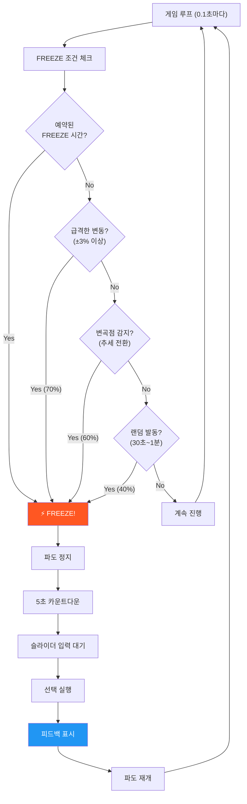

#### FREEZE 발동 확률 요약표

| 조건 | 수식/기준 | 발동 확률 | 우선순위 |
|:----:|-----------|:--------:|:-------:|
| 예약 FREEZE | 시나리오에서 미리 지정 | 100% | 1 |
| 급등/급락 | \|변화율\| ≥ 3% | 70% | 2 |
| 변곡점 | 추세 부호 변경 | 60% | 3 |
| 랜덤 | 30~60초 동안 이벤트 없음 | 40% | 4 |

### 2) FREEZE 상태 머신(시퀀스)

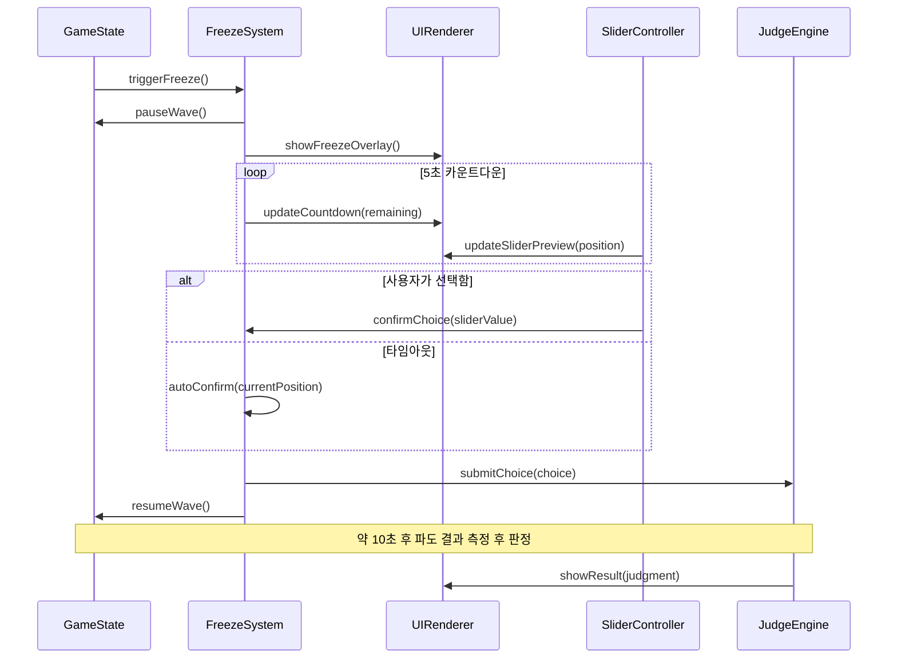

---

## 📊 선택 결과 판정 알고리즘

### 1) 판정 플로우

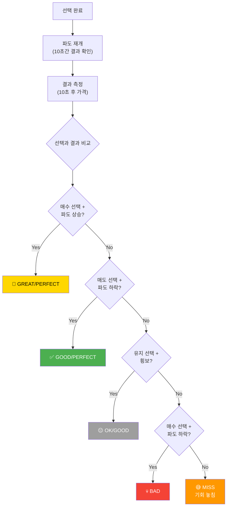

### 2) 판정 의사코드

```text
function judge(userChoice, waveResult):
    // userChoice: -60, -30, 0, +30, +60
    // waveResult: 10초 후 가격 변화율(%)

    choiceType = categorizeChoice(userChoice)   // BUY / HOLD / SELL
    resultType = categorizeResult(waveResult)   // UP / FLAT / DOWN

    table = {
        (BUY,  UP):    "GREAT_OR_PERFECT",
        (BUY,  FLAT):  "OK",
        (BUY,  DOWN):  "BAD",
        (HOLD, UP):    "MISS",
        (HOLD, FLAT):  "GOOD",
        (HOLD, DOWN):  "MISS",
        (SELL, UP):    "BAD",
        (SELL, FLAT):  "OK",
        (SELL, DOWN):  "GREAT_OR_PERFECT"
    }

    baseJudgment = table[(choiceType, resultType)]

    // GREAT vs PERFECT 세분화 예시
    if baseJudgment == "GREAT_OR_PERFECT":
        if abs(userChoice) == 60 AND abs(waveResult) >= 5:
            return "PERFECT"
        else:
            return "GREAT"
    else:
        return baseJudgment
```

### 3) 판정 기준표(상세)

| 내 선택 | 파도 결과(변화율) | 판정 | 에너지 | 점수 배율 |
|:-------:|:----------------:|:----:|:------:|:---------:|
| +60% 매수 | +5%↑ 이상 상승 | 🎉 PERFECT | +20% | ×3.0 |
| +30% 매수 | +3%↑ 이상 상승 | 🎉 GREAT | +15% | ×2.0 |
| +30% 매수 | ±1% 이내 횡보 | 😐 OK | +5% | ×1.0 |
| +30% 매수 | -3%↓ 이상 하락 | 💀 BAD | -15% | ×0.5 |
| 0% 유지 | ±2% 이내 횡보 | ✅ GOOD | +10% | ×1.5 |
| 0% 유지 | +5%↑ 이상 상승 | 😅 MISS | -5% | ×0.8 |
| -30% 매도 | -3%↓ 이상 하락 | 🎉 GREAT | +15% | ×2.0 |
| -60% 매도 | -5%↓ 이상 하락 | 🎉 PERFECT | +20% | ×3.0 |
| -30% 매도 | +3%↑ 이상 상승 | 💀 BAD | -15% | ×0.5 |

---

## 🆘 물타기 알고리즘

### 1) 물타기 상태 플로우

```mermaid
flowchart TD
    Trigger["🆘 물타기 버튼 탭"] --> Check{"조건 체크"}
    
    Check --> C1{"Stage 5 이상?"}
    C1 -->|"No"| Fail1["❌ 아직 해금 안됨"]
    C1 -->|"Yes"| C2
    
    C2{"에너지 ≥ 20%?"}
    C2 -->|"No"| Fail2["❌ 에너지 부족"]
    C2 -->|"Yes"| C3
    
    C3{"예수금 충분?"}
    C3 -->|"No"| Fail3["❌ 자금 부족"]
    C3 -->|"Yes"| Execute["물타기 실행!"]
    
    Execute --> Calc["추가 수량 계산"]
    
    Calc --> Formula["새_평단가 계산"]
    
    Formula --> Apply["상태 적용"]
    
    Apply --> A1["화물 증가"]
    Apply --> A2["예수금 감소"]
    Apply --> A3["평단가 하락"]
    Apply --> A4["에너지 -10%"]
    
    A1 --> Result["물타기 완료!"]
    A2 --> Result
    A3 --> Result
    A4 --> Result
    
    Result --> Preview["새 손익분기점 표시"]
    
    style Execute fill:#ff9800,color:#fff
    style Result fill:#4caf50,color:#fff
```

### 2) 물타기 수식(포트폴리오 관점)

```text
[기본 가정]
additionalRatio = 0.3  // 예수금의 30%를 물타기에 사용

추가_수량(additionalQty) = floor(예수금(deposit) × additionalRatio ÷ 현재가(price))

새_평단가(newAvg) = (기존_평단가(oldAvg) × 기존_수량(oldQty)
                      + 현재가(price) × 추가_수량(additionalQty))
                      ÷ (기존_수량 + 추가_수량)

새_예수금(newDeposit) = deposit - additionalQty × price

새_에너지(newEnergy) = energy - 10

손익분기점_개선율 = (oldAvg - newAvg) ÷ oldAvg × 100
```

### 3) 물타기 효과 요약표

| 항목 | 물타기 전 | 물타기 후 | 변화 |
|:----:|:---------:|:---------:|:----:|
| 보유 수량 | 200상자 | 300상자 | +100 (+50%) |
| 평단가 | 52,000원 | 49,333원 | -2,667원 (-5.1%) |
| 현재가 | 44,000원 | 44,000원 | 동일 |
| 현재 손실률 | -15.4% | -10.8% | +4.6%p 개선 |
| 손실 금액 | -1,600,000원 | -1,600,000원 | 동일 (구조는 개선) |
| 손익분기점 | 52,000원 | 49,333원 | -2,667원 낮아짐 |
| 에너지 | 45% | 35% | -10% 소모 |

---

## ⚡ 에너지 시스템 알고리즘

### 1) 에너지 상태 머신

```mermaid
stateDiagram-v2
    [*] --> Normal: 게임 시작
    
    Normal --> Warning: energy < 30%
    Normal --> Critical: energy < 15%
    Normal --> GameOver: energy ≤ 0%
    
    Warning --> Normal: 좋은 판정으로 회복
    Warning --> Critical: energy < 15%
    Warning --> GameOver: energy ≤ 0%
    
    Critical --> Warning: 연속 GOOD 이상
    Critical --> Normal: 연속 PERFECT/GREAT
    Critical --> GameOver: energy ≤ 0%
    
    GameOver --> [*]: 게임 종료
```

### 2) 에너지 변화 규칙

| 이벤트 | 에너지 변화량 | 설명 |
|:-----:|:------------:|------|
| PERFECT | +20% | 방향·물량 모두 최적 |
| GREAT | +15% | 방향 정확, 물량 양호 |
| GOOD | +10% | 안정적 선택 |
| OK | +5% | 무난한 선택 |
| MISS | -5% | 기회 놓침 |
| BAD | -15% | 정반대 선택 |
| 물타기 사용 | -10% | 리스크 증가 패널티 |
| 시간 경과(Stage 7+) | -1% / 30초 | 긴장감 유지용 자연 감소 |
| 콤보 보너스(3연속 이상) | +5% | 공격적인 플레이 보상 |

---

## 🏆 점수 계산 알고리즘

### 1) 점수 구성 요소

```mermaid
flowchart LR
    subgraph Base["기본 점수"]
        B1["판정별 기본점수<br/>PERFECT:300<br/>GREAT:200<br/>GOOD:150<br/>OK:100<br/>MISS:50<br/>BAD:25"]
    end
    
    subgraph Multipliers["배율 적용"]
        B1 --> M1["판정 배율<br/>×0.5 ~ ×3.0"]
        M1 --> M2["콤보 배율<br/>1.0 ~ 2.0"]
        M2 --> M3["스테이지 배율<br/>1.0 ~ 3.0"]
    end
    
    subgraph Result["최종 점수"]
        M3 --> FINAL["finalScore = base × judgment × combo × stage"]
    end
```

### 2) 점수 공식

```text
baseScore = {
  PERFECT: 300,
  GREAT:   200,
  GOOD:    150,
  OK:      100,
  MISS:     50,
  BAD:      25
}

judgmentMultiplier = {
  PERFECT: 3.0,
  GREAT:   2.0,
  GOOD:    1.5,
  OK:      1.0,
  MISS:    0.8,
  BAD:     0.5
}

comboMultiplier = 1.0 + (comboCount × 0.1)    // 최대 2.0 근처에서 캡
stageMultiplier = 1.0 + (currentStage × 0.2)  // Stage 10 ≒ 3.0

finalScore = baseScore[judgment]
             × judgmentMultiplier[judgment]
             × comboMultiplier
             × stageMultiplier
```

### 3) 예시 계산

| 상황 | 최종 점수 계산 | 결과 |
|:----:|----------------|:----:|
| Stage 1, GREAT, 콤보 0 | 200 × 2.0 × 1.0 × 1.2 | 480점 |
| Stage 4, PERFECT, 콤보 3 | 300 × 3.0 × 1.3 × 1.8 | 2,106점 |
| Stage 7, GREAT, 콤보 5 | 200 × 2.0 × 1.5 × 2.4 | 1,440점 |
| Stage 10, PERFECT, 콤보 10 | 300 × 3.0 × 2.0 × 3.0 | 5,400점 |

---

## 📈 스테이지/종목 데이터 모델 (알고리즘 관점)

### 1) 스테이지별 파라미터 구조 예시

```text
StageConfig = {
  id: number,                  // 스테이지 번호
  symbol: string,              // 종목 코드
  name: string,                // 종목명
  dailyVolatility: [min, max], // 일 변동성 범위(%)
  freezeCount: number,         // FREEZE 총 횟수
  targetReturn: number,        // 목표 수익률(%)
  timeLimitSec: number,        // 제한 시간(초)
  startEnergy: number,         // 시작 에너지(%)
  sliderMode: "3way" | "5way", // 슬라이더 모드(3선지/5선지)
  enableAveraging: boolean,    // 물타기 사용 가능 여부
  difficultyFactor: number     // 난이도/점수 밸런싱 계수
}
```

### 2) 요약 테이블

| Stage | 종목 | 변동성 | FREEZE | 목표 | 시간(분) | 시작 에너지 | 슬라이더 | 특이사항 |
|:-----:|------|:------:|:------:|:------:|:--------:|:----------:|:--------:|----------|
| 1 | 삼성전자 | 1~2% | 5회 | +5% | 3 | 100% | 3선지 | 튜토리얼 |
| 2 | SK하이닉스 | 2~3% | 6회 | +8% | 3 | 95% | 3선지 | 추세 연습 |
| 3 | 현대차 | 2~3% | 7회 | +10% | 3 | 90% | 3선지 | 타이밍 감각 |
| 4 | 에코프로 | 4~6% | 9회 | +15% | 5 | 90% | 5선지 | 물량 조절 시작 |
| 5 | 한미반도체 | 5~7% | 10회 | +18% | 5 | 85% | 5선지 | 물타기 해금 |
| 6 | 크래프톤 | 4~6% | 11회 | +22% | 5 | 80% | 5선지 | 이벤트 대응 |
| 7 | 레인보우로보틱스 | 8~15% | 14회 | +30% | 8 | 75% | 5선지 | 폭풍 생존 |
| 8 | 마인즈랩 | 10~20% | 16회 | +40% | 8 | 70% | 5선지 | 극한 판단 |
| 9 | 알체라 | 15~30% | 18회 | +60% | 10 | 65% | 5선지 | 멘탈 관리 |
| 10 | ??? (랜덤) | 20%+ | 20회 | +100% | 15 | 60% | 5선지 | 최종 보스 |

---

## 🔄 전체 게임 상태 전이(State Machine)

> 실제 코드에서는 `GameStateMachine` 같은 클래스로 분리하고, 상태는 enum + 핸들러 함수로 관리하는 방식을 권장합니다.

```mermaid
stateDiagram-v2
    [*] --> StageSelect: 게임 시작
    
    StageSelect --> Loading: 스테이지 선택
    Loading --> WaveFlow: 종목/데이터 로드 완료
    
    state WaveFlow {
        [*] --> Sailing
        Sailing --> Freeze: FREEZE 조건 충족
        Freeze --> Judging: 선택 확정
        Judging --> Feedback: 판정 완료
        Feedback --> Sailing: 피드백 종료
        Sailing --> [*]: 제한 시간 종료
    }
    
    WaveFlow --> Result: 스테이지 종료
    
    state Result {
        [*] --> Calculating
        Calculating --> Victory: 목표 수익률 달성
        Calculating --> Defeat: 에너지 소진
        Calculating --> TimeUp: 시간 초과
    }
    
    Result --> StageSelect: 다음 스테이지 / 재도전
    Result --> [*]: 게임 완전 종료
```

---

# 💬 PART 4: 피드백 시스템

## 📢 실시간 피드백 메시지

### 상황별 피드백

```mermaid
flowchart TD
    subgraph Feedback["💬 상황별 피드백 메시지"]
        subgraph Great["🎉 GREAT/PERFECT"]
            G1["'완벽한 타이밍! 파도를 탔다!'"]
            G2["'프로 항해사급 선택!'"]
            G3["'이 파도는 네 거야!'"]
            G4["'화물이 황금빛으로 빛난다!'"]
        end
        
        subgraph Good["✅ GOOD"]
            GD1["'현명한 판단이야!'"]
            GD2["'안전한 항해 중!'"]
            GD3["'나쁘지 않아!'"]
        end
        
        subgraph Miss["😅 MISS"]
            M1["'앗, 파도를 놓쳤다!'"]
            M2["'조금 아쉬운 선택...'"]
            M3["'다음 파도를 노리자!'"]
        end
        
        subgraph Bad["💀 BAD"]
            B1["'으악! 배가 흔들린다!'"]
            B2["'잘못된 방향이었어!'"]
            B3["'폭풍에 휩쓸렸다!'"]
            B4["'에너지가 새고 있어!'"]
        end
    end
    
    style Great fill:#ffd700,color:#000
    style Good fill:#4caf50,color:#fff
    style Miss fill:#ff9800,color:#fff
    style Bad fill:#f44336,color:#fff
```

### 피드백 화면

```
┌─────────────────────────────────────────────────────────────────┐
│                                                                 │
│  ╔═══════════════════════════════════════════════════════════╗ │
│  ║                                                           ║ │
│  ║              🎉 P E R F E C T ! 🎉                        ║ │
│  ║                                                           ║ │
│  ║          "완벽한 타이밍! 파도를 탔다!"                    ║ │
│  ║                                                           ║ │
│  ╠═══════════════════════════════════════════════════════════╣ │
│  ║                                                           ║ │
│  ║   📊 결과:                                                ║ │
│  ║   • 선택: +60% 대량 매수                                  ║ │
│  ║   • 파도: +8.2% 급등! 📈                                  ║ │
│  ║                                                           ║ │
│  ║   💰 수익:                                                ║ │
│  ║   • 화물 가치: +1,230,000원 (+12.3%)                      ║ │
│  ║                                                           ║ │
│  ║   🏆 점수: +600 (기본 200 × 3배!)                         ║ │
│  ║   ⚡ 에너지: +20% (78% → 98%)                             ║ │
│  ║   🔥 콤보: 3연속! 다음 ×1.5!                              ║ │
│  ║                                                           ║ │
│  ╠═══════════════════════════════════════════════════════════╣ │
│  ║                                                           ║ │
│  ║   💡 TIP: "급등 초기에 대량 매수하면 큰 수익!"            ║ │
│  ║                                                           ║ │
│  ╚═══════════════════════════════════════════════════════════╝ │
│                                                                 │
│  🌊 다음 파도까지 8초...                                        │
│                                                                 │
└─────────────────────────────────────────────────────────────────┘
```

---

## 🏆 전체 스테이지 요약

| Stage | 종목 | 변동성 | 선택지 | FREEZE | 목표 | 핵심 학습 |
|:-----:|------|:------:|:------:|:------:|:----:|-----------|
| 1 | 삼성전자 | 1~2% | 3개 | 5회 | +5% | 조작법 익히기 |
| 2 | SK하이닉스 | 2~3% | 3개 | 6회 | +8% | 추세 따라가기 |
| 3 | 현대차 | 2~3% | 3개 | 7회 | +10% | 타이밍 감각 |
| 4 | 에코프로 | 4~6% | 5개 | 9회 | +15% | 물량 조절 시작 |
| 5 | 한미반도체 | 5~7% | 5개 | 10회 | +18% | 물타기 해금! |
| 6 | 크래프톤 | 4~6% | 5개 | 11회 | +22% | 이벤트 대응 |
| 7 | 레인보우로보틱스 | 8~15% | 5개 | 14회 | +30% | 폭풍 생존 |
| 8 | 마인즈랩 | 10~20% | 5개 | 16회 | +40% | 극한 판단 |
| 9 | 알체라 | 15~30% | 5개 | 18회 | +60% | 멘탈 관리 |
| 10 | ??? (랜덤) | 20%+ | 5개 | 20회 | +100% | 모든 것! |

---

## ✅ 개발 체크리스트

| 우선순위 | 기능 | 상태 | 설명 |
|:-------:|------|:----:|------|
| 1 | 슬라이더 UI | ⬜ | 좌우 드래그 + 스냅 |
| 2 | 파도 비주얼 | ⬜ | 배 + 파도 애니메이션 |
| 3 | FREEZE 시스템 | ⬜ | 5초 카운트다운 |
| 4 | 에너지 바 | ⬜ | HP 스타일 게이지 |
| 5 | 점수 & 콤보 | ⬜ | 실시간 점수 표시 |
| 6 | 피드백 메시지 | ⬜ | 상황별 메시지 |
| 7 | 물타기 기능 | ⬜ | Stage 5+ 해금 |
| 8 | 10종목 데이터 | ⬜ | 과거 차트 연동 |
| 9 | 사운드 | ⬜ | 파도, 경고, 성공음 |
| 10 | 랭킹 시스템 | ⬜ | 리더보드 |

---

## 🌊 핵심 메시지

```
┌─────────────────────────────────────────────────────────────────┐
│                                                                 │
│  ⚓ 파도 항해사의 철학                                          │
│                                                                 │
│  "슬라이더를 밀어라. 그것이 네 운명을 결정한다."               │
│                                                                 │
│  "파도가 높을 때 짐을 내리고, 낮을 때 짐을 실어라."            │
│                                                                 │
│  "5초가 너무 짧다고? 실전은 더 짧다."                          │
│                                                                 │
│  "에너지가 바닥나면 끝이다. 생존이 먼저다."                     │
│                                                                 │
│  🚢 한 종목의 파도를 정복하라. 그것이 진짜 손맛이다! 🌊        │
│                                                                 │
└─────────────────────────────────────────────────────────────────┘
```

---

**문서 버전**: v6.0  
**최종 업데이트**: 2024.12.07  
**핵심 컨셉**: 슬라이더 조작 / 한 종목 집중 / 10단계 상세 시나리오 / 에너지 생존!
