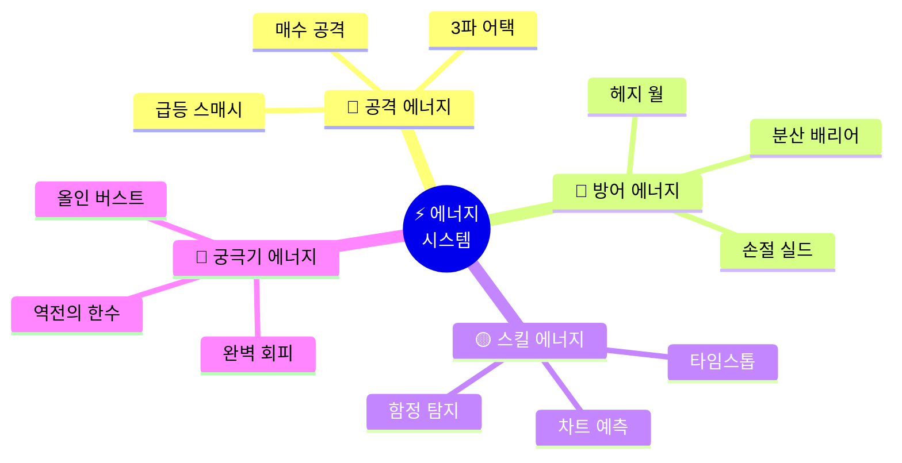
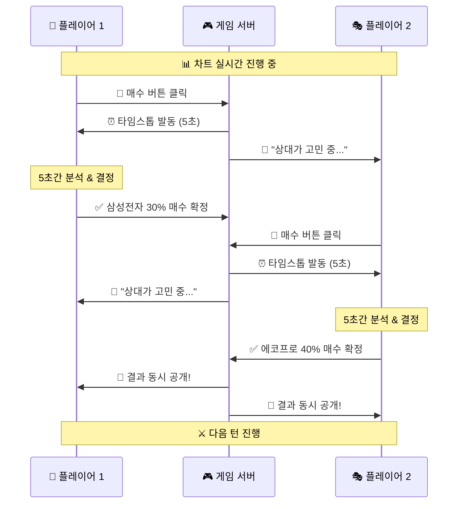
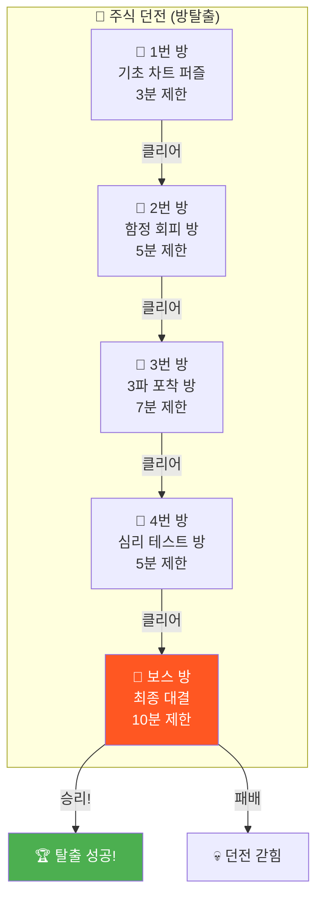
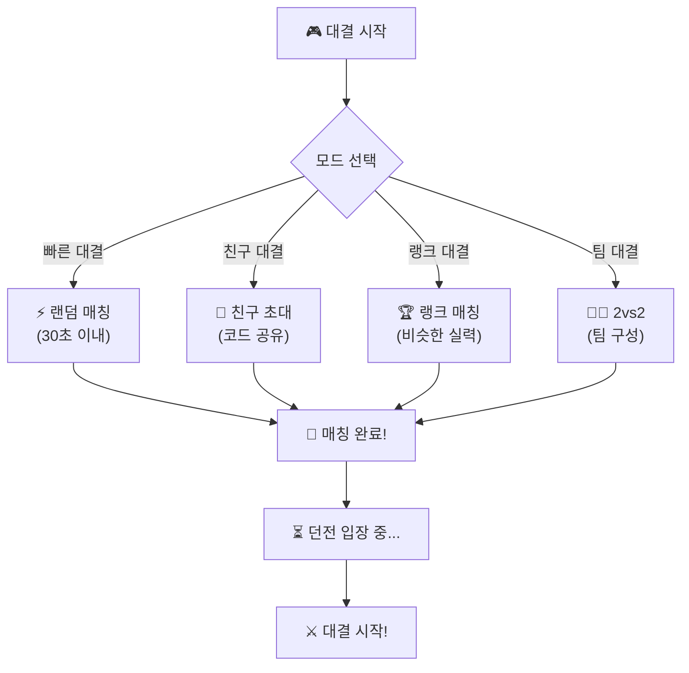
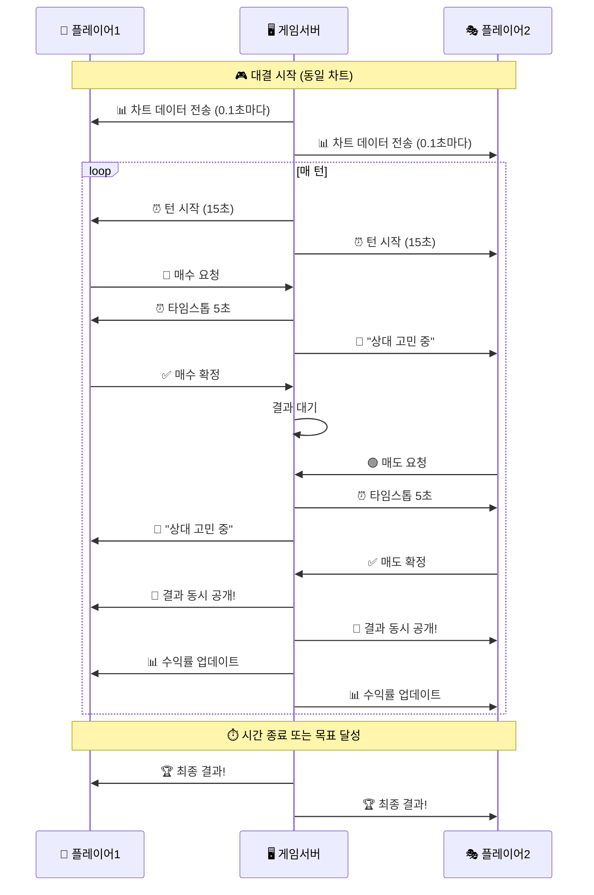
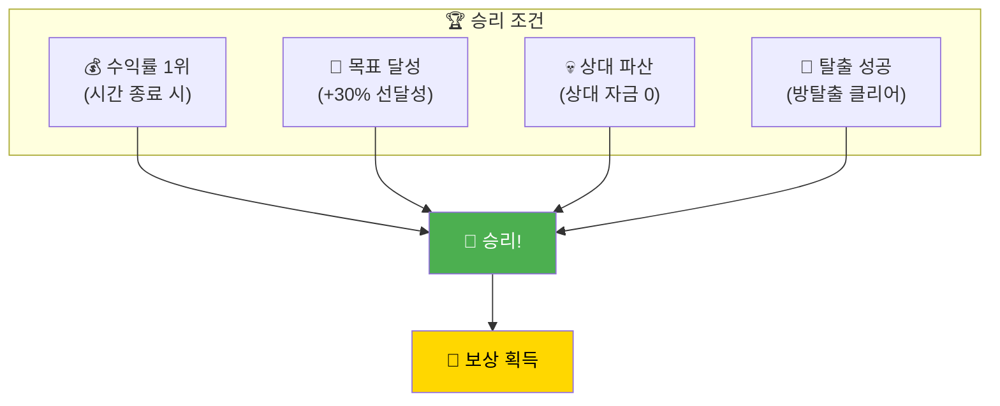
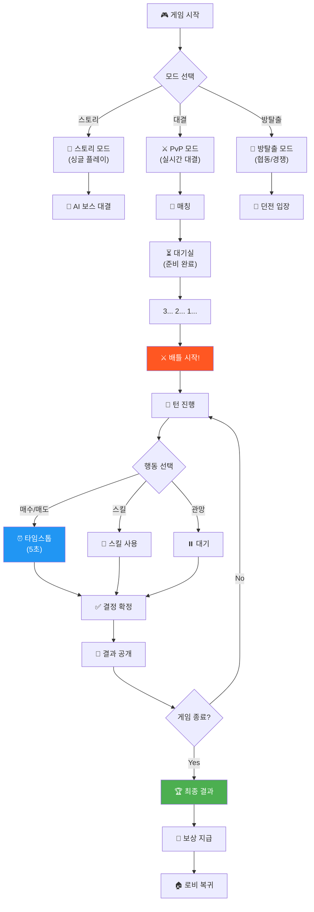

# 🎮 파도 배틀 RPG: 실시간 주식 대결
## "방탈출 × 롤플레잉 × PvP 주식 배틀!" ⚔️🌊💰

---

## 📋 문서 정보

**게임 장르**: 주식 테마 롤플레잉 배틀 + 방탈출  
**대결 방식**: 실시간 PvP (1:1 또는 팀전)  
**핵심 시스템**: 에너지 배틀 + 5초 타임스톱 + 상황별 이벤트  
**버전**: v1.0

---

## 🎯 핵심 컨셉

```
╔═══════════════════════════════════════════════════════════════════╗
║                                                                   ║
║   🎮 "파도 배틀 RPG"                                              ║
║                                                                   ║
║   📜 스토리:                                                       ║
║   주식 던전에 갇힌 두 투자자!                                     ║
║   제한 시간 안에 수익률로 승부를 가린다.                          ║
║   누가 더 파도를 잘 타는가?                                       ║
║                                                                   ║
║   ⚔️ 핵심:                                                         ║
║   • 실시간 PvP 주식 대결                                          ║
║   • 매수/매도 시 5초 타임스톱                                     ║
║   • 에너지 시스템 (공격/방어/스킬)                                ║
║   • 상황별 이벤트 & 방탈출 퍼즐                                   ║
║                                                                   ║
╚═══════════════════════════════════════════════════════════════════╝
```

---

## ⚡ 에너지 배틀 시스템

### 에너지 종류



### 에너지 획득 & 소모

```
┌─────────────────────────────────────────────────────────────────┐
│ ⚡ 에너지 시스템                                                 │
├─────────────────────────────────────────────────────────────────┤
│                                                                 │
│ 📊 기본 에너지: 100 (매 턴 +10 회복)                            │
│                                                                 │
│ ━━━━━━━━━━━━━━━━━━━━━━━━━━━━━━━━━━━━━━━━━━━━━━━━━━━━━━━━━━━  │
│                                                                 │
│ 🔴 공격 행동 (에너지 소모):                                      │
│ ┌─────────────────────────────────────────────────────────────┐ │
│ │ • 일반 매수: -10 에너지                                     │ │
│ │ • 추가 매수: -15 에너지                                     │ │
│ │ • 물타기: -20 에너지                                        │ │
│ │ • 🔥 3파 어택 (스킬): -30 에너지                            │ │
│ │ • 💥 급등 스매시 (궁극기): -50 에너지                       │ │
│ └─────────────────────────────────────────────────────────────┘ │
│                                                                 │
│ 🔵 방어 행동 (에너지 소모):                                      │
│ ┌─────────────────────────────────────────────────────────────┐ │
│ │ • 일반 매도: -5 에너지                                      │ │
│ │ • 손절: -10 에너지                                          │ │
│ │ • 익절: -8 에너지                                           │ │
│ │ • 🛡️ 손절 실드 (스킬): -25 에너지                           │ │
│ │ • 🏰 분산 배리어 (스킬): -35 에너지                         │ │
│ └─────────────────────────────────────────────────────────────┘ │
│                                                                 │
│ 🟡 특수 행동 (에너지 소모):                                      │
│ ┌─────────────────────────────────────────────────────────────┐ │
│ │ • ⏰ 타임스톱 (5초): -20 에너지                             │ │
│ │ • 🔮 차트 예측: -30 에너지                                  │ │
│ │ • 🎯 함정 탐지: -25 에너지                                  │ │
│ │ • 👁️ 상대 포지션 엿보기: -40 에너지                         │ │
│ └─────────────────────────────────────────────────────────────┘ │
│                                                                 │
│ ⚡ 에너지 획득 방법:                                              │
│ ┌─────────────────────────────────────────────────────────────┐ │
│ │ • 매 턴 자동 회복: +10                                      │ │
│ │ • 수익 달성 시: +수익률 × 2 (예: +5% → +10 에너지)         │ │
│ │ • 상대 손절 유도 시: +15                                    │ │
│ │ • 퀴즈 정답 시: +20                                         │ │
│ │ • 이벤트 클리어 시: +25~50                                  │ │
│ │ • 콤보 달성 시: +30                                         │ │
│ └─────────────────────────────────────────────────────────────┘ │
│                                                                 │
└─────────────────────────────────────────────────────────────────┘
```

### 에너지 배틀 UI

```
┌─────────────────────────────────────────────────────────────────┐
│ ⚔️ 실시간 배틀 화면                                              │
├─────────────────────────────────────────────────────────────────┤
│                                                                 │
│  👤 나 (파도헌터)          vs          🎭 상대 (주식마스터)      │
│  ━━━━━━━━━━━━━━━━━━━━━━━━━━━━━━━━━━━━━━━━━━━━━━━━━━━━━━━━━━━  │
│                                                                 │
│  💰 +8.5%                              💰 +6.2%                 │
│  ████████░░ 85%                        ██████░░░░ 62%           │
│                                                                 │
│  ⚡ 에너지: 75/100                      ⚡ 에너지: 60/100        │
│  ███████░░░                            ██████░░░░               │
│                                                                 │
│  🛡️ 보유: 삼성전자 30%                  🛡️ 보유: ???            │
│         에코프로 25%                          (숨겨짐)          │
│         현금 45%                                                │
│                                                                 │
│  ━━━━━━━━━━━━━━━━━━━━━━━━━━━━━━━━━━━━━━━━━━━━━━━━━━━━━━━━━━━  │
│                                                                 │
│  📊 공용 차트 (삼성전자)                                         │
│  ┌─────────────────────────────────────────────────────────┐   │
│  │                              🔥 +3.2%                    │   │
│  │                    /\       /                           │   │
│  │      /\          /  \     /                            │   │
│  │     /  \        /    \   /                             │   │
│  │ ───/    \──────/      \_/                              │   │
│  │                                                         │   │
│  │  거래량: ████████████████ +180% 🔥                      │   │
│  └─────────────────────────────────────────────────────────┘   │
│                                                                 │
│  ⏱️ 남은 시간: 04:32                    턴: 15/30               │
│                                                                 │
│  ━━━━━━━━━━━━━━━━━━━━━━━━━━━━━━━━━━━━━━━━━━━━━━━━━━━━━━━━━━━  │
│                                                                 │
│  🎮 행동 선택:                                                   │
│                                                                 │
│  [🔴 매수 -10⚡]  [🟢 매도 -5⚡]  [⏰ 타임스톱 -20⚡]           │
│  [🛡️ 손절실드 -25⚡]  [🔮 예측 -30⚡]  [💥 궁극기 -50⚡]        │
│                                                                 │
└─────────────────────────────────────────────────────────────────┘
```

---

## ⏰ 타임스톱 시스템 (핵심!)

### 5초 타임스톱

```
┌─────────────────────────────────────────────────────────────────┐
│ ⏰ 타임스톱 시스템                                               │
├─────────────────────────────────────────────────────────────────┤
│                                                                 │
│ 🎯 핵심 컨셉:                                                    │
│ "매수/매도 결정의 순간, 5초의 집중 시간!"                       │
│                                                                 │
│ ━━━━━━━━━━━━━━━━━━━━━━━━━━━━━━━━━━━━━━━━━━━━━━━━━━━━━━━━━━━  │
│                                                                 │
│ 📜 발동 조건:                                                    │
│ ┌─────────────────────────────────────────────────────────────┐ │
│ │ 1. 자동 발동: 매수/매도 버튼 클릭 시                        │ │
│ │ 2. 수동 발동: 타임스톱 버튼 사용 시 (-20 에너지)           │ │
│ │ 3. 이벤트 발동: 급등/급락 시 자동 발동                      │ │
│ └─────────────────────────────────────────────────────────────┘ │
│                                                                 │
│ ⏱️ 타임스톱 중 화면:                                             │
│ ┌─────────────────────────────────────────────────────────────┐ │
│ │                                                             │ │
│ │  ⏰ 타임스톱! 5초간 시간 정지!                              │ │
│ │                                                             │ │
│ │  ████████████████████████████████████░░░░                   │ │
│ │                                     4.2초                   │ │
│ │                                                             │ │
│ │  📊 차트 분석 정보:                                         │ │
│ │  • 현재 추세: 상승 (3파 진입 가능성 78%)                   │ │
│ │  • 거래량: 급증 (+180%)                                    │ │
│ │  • 지지선: 72,000원                                        │ │
│ │  • 저항선: 78,000원                                        │ │
│ │                                                             │ │
│ │  🎯 AI 조언:                                                │ │
│ │  "거래량 폭발! 3파 진입 적기입니다.                        │ │
│ │   단, 손절 라인 72,000원 설정 권장"                        │ │
│ │                                                             │ │
│ │  [✅ 확정] [❌ 취소] [🔄 수량 변경]                         │ │
│ │                                                             │ │
│ └─────────────────────────────────────────────────────────────┘ │
│                                                                 │
│ 🔊 효과음:                                                       │
│ • 발동 시: "틱... 틱... 틱..." (시계 소리)                      │
│ • 종료 임박: "삐빅! 삐빅!" (경고음)                             │
│ • 결정 확정: "슈웅~!" (시간 재개)                               │
│                                                                 │
│ 📌 상대방 화면:                                                  │
│ • 상대가 타임스톱 사용 시: "⏰ 상대가 고민 중..." 표시         │
│ • 상대의 결정 내용은 숨겨짐                                     │
│ • 타임스톱 종료 후 동시 공개!                                   │
│                                                                 │
└─────────────────────────────────────────────────────────────────┘
```

### 동시 결정 시스템



---

## 🏰 방탈출 퍼즐 시스템

### 던전 구조



### 방별 퍼즐 예시

```
┌─────────────────────────────────────────────────────────────────┐
│ 🚪 1번 방: 기초 차트 퍼즐                                        │
├─────────────────────────────────────────────────────────────────┤
│                                                                 │
│ 📜 상황:                                                         │
│ "던전의 첫 번째 문이 잠겨있다.                                  │
│  차트 퍼즐을 풀어야 열린다!"                                    │
│                                                                 │
│ 🔒 퍼즐:                                                         │
│ ┌─────────────────────────────────────────────────────────────┐ │
│ │                                                             │ │
│ │  다음 차트에서 '매수 타이밍'을 찾아라!                      │ │
│ │                                                             │ │
│ │      A        B        C        D                           │ │
│ │      ↓        ↓        ↓        ↓                           │ │
│ │  ┌────────────────────────────────────┐                     │ │
│ │  │       /\                          │                     │ │
│ │  │      /  \      /\                 │                     │ │
│ │  │     /    \    /  \    /\         │                     │ │
│ │  │ ───/      \──/    \──/  \───     │                     │ │
│ │  │  A         B      C     D        │                     │ │
│ │  └────────────────────────────────────┘                     │ │
│ │                                                             │ │
│ │  [A 지점] [B 지점] [C 지점] [D 지점]                        │ │
│ │                                                             │ │
│ │  💡 힌트: "지지선 반등 + 거래량 증가 = 매수 신호"          │ │
│ │                                                             │ │
│ │  정답: B (지지선 반등 지점)                                 │ │
│ │                                                             │ │
│ └─────────────────────────────────────────────────────────────┘ │
│                                                                 │
│ ⏱️ 제한 시간: 3:00                                               │
│ ⚡ 정답 시: +30 에너지, 🚪 문 열림                               │
│ ❌ 오답 시: -20 에너지, 30초 페널티                              │
│                                                                 │
│ 🔊 효과음:                                                       │
│ • 정답: "딩동~! 🎵" + 문 열리는 소리                           │
│ • 오답: "부웅~! 💥" + 잠금 소리                                │
│                                                                 │
└─────────────────────────────────────────────────────────────────┘

┌─────────────────────────────────────────────────────────────────┐
│ 🚪 2번 방: B파 함정 회피 방                                      │
├─────────────────────────────────────────────────────────────────┤
│                                                                 │
│ 📜 상황:                                                         │
│ "바닥에 함정이 깔려있다!                                        │
│  B파 함정을 피해 안전한 길을 찾아라!"                          │
│                                                                 │
│ 🎮 게임 방식:                                                    │
│ ┌─────────────────────────────────────────────────────────────┐ │
│ │                                                             │ │
│ │  5개의 "반등하는 차트"가 보인다.                            │ │
│ │  그 중 4개는 B파 함정, 1개만 진짜 반등!                     │ │
│ │                                                             │ │
│ │  [차트 1]  [차트 2]  [차트 3]  [차트 4]  [차트 5]           │ │
│ │   📈+5%    📈+3%    📈+7%    📈+4%    📈+6%                │ │
│ │   거래량   거래량   거래량   거래량   거래량                 │ │
│ │   -20%     +80%     -15%     -30%     -10%                  │ │
│ │                                                             │ │
│ │  ⚠️ 거래량이 줄어든 반등 = B파 함정!                        │ │
│ │                                                             │ │
│ │  정답: 차트 2 (거래량 +80% = 진짜 반등)                     │ │
│ │                                                             │ │
│ └─────────────────────────────────────────────────────────────┘ │
│                                                                 │
│ ⏱️ 제한 시간: 5:00 (빨리 맞출수록 보너스!)                       │
│ ⚡ 정답 시: +40 에너지 + "함정 탐지기" 스킬 획득               │
│ ❌ 함정 밟으면: -50 에너지 + 1분간 이동 불가                    │
│                                                                 │
│ 🔊 효과음:                                                       │
│ • 함정: "퍽! 💀" + 비명 소리                                   │
│ • 안전: "휴~ 😌" + 안도의 효과음                               │
│                                                                 │
└─────────────────────────────────────────────────────────────────┘

┌─────────────────────────────────────────────────────────────────┐
│ 🚪 3번 방: 3파 사냥터                                            │
├─────────────────────────────────────────────────────────────────┤
│                                                                 │
│ 📜 상황:                                                         │
│ "3파 상승의 보물이 숨겨져 있다!                                 │
│  정확한 타이밍에 잡아야 보물을 얻는다!"                        │
│                                                                 │
│ 🎮 게임 방식 (타이밍 게임):                                      │
│ ┌─────────────────────────────────────────────────────────────┐ │
│ │                                                             │ │
│ │  실시간으로 차트가 움직인다!                                │ │
│ │  3파 시작 지점에서 버튼을 눌러라!                           │ │
│ │                                                             │ │
│ │                    🎯 3파 시작!                              │ │
│ │                        ↓                                    │ │
│ │  ┌──────────────────────────────────────────┐               │ │
│ │  │              /                           │               │ │
│ │  │             /  ← 지금! (Perfect!)        │               │ │
│ │  │     /\     /                             │               │ │
│ │  │    /  \   / ← 1파 고점 돌파 지점         │               │ │
│ │  │   /    \ /                               │               │ │
│ │  │──/      ×                                │               │ │
│ │  │        2파 저점                          │               │ │
│ │  └──────────────────────────────────────────┘               │ │
│ │                                                             │ │
│ │  [🎯 포착!] 버튼을 적절한 타이밍에 눌러라!                  │ │
│ │                                                             │ │
│ └─────────────────────────────────────────────────────────────┘ │
│                                                                 │
│ ⚡ 판정:                                                         │
│ • Perfect (±0.3초): +50 에너지 + 보물 획득                      │
│ • Great (±0.7초): +30 에너지                                    │
│ • Good (±1.2초): +15 에너지                                     │
│ • Miss: -30 에너지 + "놓쳤다!" 메시지                          │
│                                                                 │
│ 🔊 효과음:                                                       │
│ • Perfect: "Perfect~! 🌟" + 황금빛 이펙트                      │
│ • Great: "Great! ✨" + 은빛 이펙트                             │
│ • Miss: "Miss... 💨" + 회색 이펙트                             │
│                                                                 │
└─────────────────────────────────────────────────────────────────┘

┌─────────────────────────────────────────────────────────────────┐
│ 🚪 4번 방: 심리 테스트 방                                        │
├─────────────────────────────────────────────────────────────────┤
│                                                                 │
│ 📜 상황:                                                         │
│ "이 방은 네 마음을 시험한다.                                   │
│  감정에 휘둘리면 탈출할 수 없다!"                              │
│                                                                 │
│ 🎮 게임 방식 (선택형 시나리오):                                  │
│ ┌─────────────────────────────────────────────────────────────┐ │
│ │                                                             │ │
│ │  📉 갑자기 보유 종목이 -15% 폭락!                           │ │
│ │                                                             │ │
│ │  💭 당신의 감정 상태:                                        │ │
│ │  • 심장이 쿵쾅거린다...                                     │ │
│ │  • 손이 떨린다...                                           │ │
│ │  • 빨리 팔아야 할 것 같다...                                │ │
│ │                                                             │ │
│ │  ━━━━━━━━━━━━━━━━━━━━━━━━━━━━━━━━━━━━━━━━━━━━━━━━━━━━━━━  │ │
│ │                                                             │ │
│ │  💬 "어떻게 하시겠습니까?"                                  │ │
│ │                                                             │ │
│ │  A) 😱 "당장 전부 팔아!"                                    │ │
│ │     → ❌ 패닉 셀링 (가장 나쁜 선택)                         │ │
│ │                                                             │ │
│ │  B) 😤 "물타기다! 더 사!"                                   │ │
│ │     → ❌ 복수 매매 (위험한 선택)                            │ │
│ │                                                             │ │
│ │  C) 🤔 "잠깐, 왜 떨어졌는지 확인하자"                       │ │
│ │     → ⭐ 정답! (이성적 판단)                                │ │
│ │                                                             │ │
│ │  D) 😶 "그냥 기다리자..."                                   │ │
│ │     → ⚠️ 방치 (상황에 따라 다름)                            │ │
│ │                                                             │ │
│ └─────────────────────────────────────────────────────────────┘ │
│                                                                 │
│ ⚡ 결과:                                                         │
│ • 정답 (C): +40 에너지 + "철벽 멘탈" 버프                       │
│ • 오답 (A, B): -40 에너지 + 다음 방 난이도 상승                │
│ • 중립 (D): 0 에너지 (상황에 따라 다른 결과)                   │
│                                                                 │
└─────────────────────────────────────────────────────────────────┘

┌─────────────────────────────────────────────────────────────────┐
│ 🚪 보스 방: 최종 PvP 대결!                                       │
├─────────────────────────────────────────────────────────────────┤
│                                                                 │
│ 📜 상황:                                                         │
│ "드디어 마지막 방!                                             │
│  상대방과의 최종 수익률 대결이다!"                             │
│                                                                 │
│ 🎮 게임 방식:                                                    │
│ • 10분간 실시간 주식 대결                                       │
│ • 같은 차트, 같은 조건                                          │
│ • 수익률이 높은 쪽이 승리!                                      │
│                                                                 │
│ 🏆 최종 승리 조건:                                               │
│ • 수익률 1위: 즉시 승리                                         │
│ • 동점 시: 에너지가 많은 쪽 승리                                │
│ • 에너지도 동점: 손절 실행 횟수가 많은 쪽 승리                 │
│                                                                 │
│ 🎁 보상:                                                         │
│ • 승리: 탈출 성공 + 보상 획득                                   │
│ • 패배: 던전 갇힘 → 재도전 필요                                │
│                                                                 │
└─────────────────────────────────────────────────────────────────┘
```

---

## ⚔️ PvP 실시간 대결 시스템

### 매칭 시스템



### 실시간 동기화 시스템

```
┌─────────────────────────────────────────────────────────────────┐
│ 🔄 실시간 동기화 시스템                                          │
├─────────────────────────────────────────────────────────────────┤
│                                                                 │
│ 📌 동시 플레이 문제점 & 해결책:                                  │
│                                                                 │
│ ━━━━━━━━━━━━━━━━━━━━━━━━━━━━━━━━━━━━━━━━━━━━━━━━━━━━━━━━━━━  │
│                                                                 │
│ 문제 1: 시간 동기화                                              │
│ ┌─────────────────────────────────────────────────────────────┐ │
│ │ ❌ 문제: 인터넷 지연으로 차트 타이밍 다름                    │ │
│ │                                                             │ │
│ │ ✅ 해결:                                                    │ │
│ │ • 서버 기준 시간 사용 (클라이언트 시간 X)                   │ │
│ │ • 차트 데이터는 서버에서 0.1초 단위로 전송                  │ │
│ │ • 지연 보정: 핑(ping) 측정 후 보정값 적용                   │ │
│ └─────────────────────────────────────────────────────────────┘ │
│                                                                 │
│ 문제 2: 동시 매수/매도 충돌                                      │
│ ┌─────────────────────────────────────────────────────────────┐ │
│ │ ❌ 문제: 두 플레이어가 동시에 같은 종목 매매                 │ │
│ │                                                             │ │
│ │ ✅ 해결:                                                    │ │
│ │ • 타임스톱 시스템: 매수/매도 시 5초간 시간 정지             │ │
│ │ • 결정은 동시 처리되지만, 타임스톱 중에는 서로 안 보임     │ │
│ │ • 타임스톱 종료 후 동시 공개 → 페어플레이                  │ │
│ └─────────────────────────────────────────────────────────────┘ │
│                                                                 │
│ 문제 3: 네트워크 끊김                                            │
│ ┌─────────────────────────────────────────────────────────────┐ │
│ │ ❌ 문제: 대결 중 한 명이 접속 끊김                          │ │
│ │                                                             │ │
│ │ ✅ 해결:                                                    │ │
│ │ • 30초 재접속 대기 (상대방에게 알림)                        │ │
│ │ • 30초 초과 시: 자동 패배 처리                              │ │
│ │ • 재접속 성공 시: 끊긴 시점부터 이어서 진행                │ │
│ │ • 의도적 끊김 방지: 랭크 점수 -50 패널티                   │ │
│ └─────────────────────────────────────────────────────────────┘ │
│                                                                 │
│ 문제 4: 치팅/핵 방지                                             │
│ ┌─────────────────────────────────────────────────────────────┐ │
│ │ ❌ 문제: 메모리 조작, 매크로 등                              │ │
│ │                                                             │ │
│ │ ✅ 해결:                                                    │ │
│ │ • 모든 거래 로직은 서버에서 처리                           │ │
│ │ • 클라이언트는 UI만 담당                                   │ │
│ │ • 비정상 패턴 감지 시 자동 신고                            │ │
│ │ • 반복 위반 시 영구 밴                                     │ │
│ └─────────────────────────────────────────────────────────────┘ │
│                                                                 │
└─────────────────────────────────────────────────────────────────┘
```

### 대결 플로우



---

## 🔊 효과음 & 이펙트 시스템

### 상황별 효과음

```
┌─────────────────────────────────────────────────────────────────┐
│ 🔊 효과음 시스템                                                 │
├─────────────────────────────────────────────────────────────────┤
│                                                                 │
│ 🎵 거래 효과음:                                                  │
│ ┌─────────────────────────────────────────────────────────────┐ │
│ │ • 매수 버튼: "차칵!" (기계음)                               │ │
│ │ • 매수 확정: "콰앙~!" (파워 차지 완료)                      │ │
│ │ • 매도 버튼: "스윽~" (빠지는 소리)                          │ │
│ │ • 손절: "슈웅~!" (빠른 탈출)                                │ │
│ │ • 익절: "챠리링~! 🎵" (동전 소리)                           │ │
│ └─────────────────────────────────────────────────────────────┘ │
│                                                                 │
│ 📈 수익 효과음:                                                  │
│ ┌─────────────────────────────────────────────────────────────┐ │
│ │ • +5% 달성: "레벨업~! ✨"                                   │ │
│ │ • +10% 달성: "와우~! 🌟" + 반짝이 이펙트                    │ │
│ │ • +20% 달성: "대박!! 💰" + 금화 쏟아지는 이펙트             │ │
│ │ • +30% 이상: "전설이다!!! 👑" + 황금빛 폭발                 │ │
│ └─────────────────────────────────────────────────────────────┘ │
│                                                                 │
│ 📉 손실 효과음:                                                  │
│ ┌─────────────────────────────────────────────────────────────┐ │
│ │ • -5% 도달: "위험~! ⚠️" (경고음)                            │ │
│ │ • -10% 도달: "으악~! 😱" (비명)                             │ │
│ │ • -20% 도달: "무너진다! 💀" (붕괴 소리)                     │ │
│ │ • 파산: "게임오버... 👻" (장송곡)                           │ │
│ └─────────────────────────────────────────────────────────────┘ │
│                                                                 │
│ ⚔️ 대결 효과음:                                                  │
│ ┌─────────────────────────────────────────────────────────────┐ │
│ │ • 상대 앞서감: "추월당했다! 🏃"                             │ │
│ │ • 내가 앞서감: "리드! 💪"                                   │ │
│ │ • 역전: "역전!! 🔥" + 불꽃 이펙트                           │ │
│ │ • 대역전: "대역전!!! ⚡" + 번개 이펙트                      │ │
│ │ • 승리: "Victory~!! 🏆" (팡파르)                            │ │
│ │ • 패배: "Defeat... 😢" (슬픈 멜로디)                        │ │
│ └─────────────────────────────────────────────────────────────┘ │
│                                                                 │
│ 🎭 감정 효과음:                                                  │
│ ┌─────────────────────────────────────────────────────────────┐ │
│ │ • FOMO 감지: "두근두근~ 💓" (심장 소리)                     │ │
│ │ • 침착 유지: "평온~ 🧘" (명상 음악)                         │ │
│ │ • 분노 감지: "으르렁~ 😤" (짜증 소리)                       │ │
│ │ • 탐욕 감지: "번쩍~ 💎" (보석 소리)                         │ │
│ └─────────────────────────────────────────────────────────────┘ │
│                                                                 │
│ ⏰ 타임스톱 효과음:                                               │
│ ┌─────────────────────────────────────────────────────────────┐ │
│ │ • 발동: "틱... 틱... 틱..." (시계 소리, 느려짐)             │ │
│ │ • 3초 남음: "삐... 삐..." (경고)                            │ │
│ │ • 1초 남음: "삐삐삐!" (긴급)                                │ │
│ │ • 종료: "슈웅~!" (시간 재개)                                │ │
│ └─────────────────────────────────────────────────────────────┘ │
│                                                                 │
└─────────────────────────────────────────────────────────────────┘
```

### 시각 이펙트

```
┌─────────────────────────────────────────────────────────────────┐
│ ✨ 시각 이펙트 시스템                                            │
├─────────────────────────────────────────────────────────────────┤
│                                                                 │
│ 📈 수익 이펙트:                                                  │
│ • +5%: 녹색 빛 번쩍 + 숫자 점프                                 │
│ • +10%: 금빛 파티클 + 별 폭발                                   │
│ • +20%: 황금 비 내림 + 캐릭터 춤                                │
│ • +30%: 전체 화면 황금빛 + 트로피 등장                          │
│                                                                 │
│ 📉 손실 이펙트:                                                  │
│ • -5%: 화면 살짝 빨갛게 + 흔들림                                │
│ • -10%: 화면 빨갛게 + 크게 흔들림 + 금 떨어지는 이펙트        │
│ • -20%: 화면 어두워짐 + 유리 깨지는 이펙트                     │
│ • 파산: 화면 검은색으로 + "GAME OVER" 텍스트                   │
│                                                                 │
│ ⚔️ 대결 이펙트:                                                  │
│ • 역전: 번개 번쩍 + 화면 전환                                   │
│ • 승리: 불꽃놀이 + 승리 포즈                                    │
│ • 콤보: 연속 히트 숫자 표시 (COMBO x3!)                        │
│                                                                 │
│ ⏰ 타임스톱 이펙트:                                               │
│ • 발동: 화면 파란색 톤 + 시계 아이콘 회전                       │
│ • 진행: 파티클 느리게 움직임                                    │
│ • 종료: 원래 색상으로 + 시간 재개 웨이브                       │
│                                                                 │
└─────────────────────────────────────────────────────────────────┘
```

---

## 🎭 상황별 롤플레잉 시나리오

### 시나리오 1: 급등 상황

```
┌─────────────────────────────────────────────────────────────────┐
│ 🔥 시나리오: "급등의 유혹"                                       │
├─────────────────────────────────────────────────────────────────┤
│                                                                 │
│ 📜 상황 설명:                                                    │
│ ┌─────────────────────────────────────────────────────────────┐ │
│ │                                                             │ │
│ │  📢 긴급 뉴스!                                              │ │
│ │  "삼성전자, AI 반도체 혁신 기술 발표!"                      │ │
│ │                                                             │ │
│ │  📈 삼성전자 +8.5% 급등 중!                                 │ │
│ │  거래량: +350% 폭발!                                        │ │
│ │                                                             │ │
│ │  😍 FOMO 게이지: ████████████████████ 95%                   │ │
│ │                                                             │ │
│ └─────────────────────────────────────────────────────────────┘ │
│                                                                 │
│ 🎭 NPC 반응:                                                     │
│ ┌─────────────────────────────────────────────────────────────┐ │
│ │ 🦊 여우 선생님:                                             │ │
│ │ "호호, 너무 급하게 뛰어들면 고점에 물릴 수 있어~           │ │
│ │  조정을 기다리는 것도 방법이야."                            │ │
│ │                                                             │ │
│ │ 🦁 사자 대장:                                               │ │
│ │ "기회가 왔다! 과감하게 들어가!                              │ │
│ │  단, 손절 라인은 반드시 정해두고!"                          │ │
│ │                                                             │ │
│ │ 🔥 불꽃 왕:                                                 │ │
│ │ "뭘 망설여?! 전부 넣어! 올인이다!!!"                       │ │
│ └─────────────────────────────────────────────────────────────┘ │
│                                                                 │
│ 🎮 선택지:                                                       │
│ ┌─────────────────────────────────────────────────────────────┐ │
│ │ A) 😍 "전부 매수!" (-30 에너지)                             │ │
│ │    → 위험: 고점 물림 가능성                                │ │
│ │    → 결과: 랜덤 (성공 40% / 실패 60%)                       │ │
│ │                                                             │ │
│ │ B) 🤔 "30%만 분할 매수" (-15 에너지)                        │ │
│ │    → 안전: 평단가 분산                                     │ │
│ │    → 결과: 중간 수익 (성공 70%)                            │ │
│ │                                                             │ │
│ │ C) 😌 "조정 기다리기" (에너지 유지)                         │ │
│ │    → 보수: 기회 일부 포기                                  │ │
│ │    → 결과: 안전하지만 수익 제한                            │ │
│ │                                                             │ │
│ │ D) 👁️ "타임스톱으로 분석" (-20 에너지)                      │ │
│ │    → 신중: 5초간 추가 분석                                 │ │
│ │    → 결과: 최적 타이밍 판단 가능                           │ │
│ └─────────────────────────────────────────────────────────────┘ │
│                                                                 │
│ ⏱️ 결정 시간: 10초                                               │
│ 🔊 BGM: 긴박한 음악 (심장 박동 효과음)                           │
│                                                                 │
└─────────────────────────────────────────────────────────────────┘
```

### 시나리오 2: 폭락 상황

```
┌─────────────────────────────────────────────────────────────────┐
│ 💀 시나리오: "공포의 폭락"                                       │
├─────────────────────────────────────────────────────────────────┤
│                                                                 │
│ 📜 상황 설명:                                                    │
│ ┌─────────────────────────────────────────────────────────────┐ │
│ │                                                             │ │
│ │  📢 긴급 뉴스!                                              │ │
│ │  "금융 위기 우려... 전 세계 증시 폭락!"                     │ │
│ │                                                             │ │
│ │  📉 보유 종목 전체 -12% 폭락 중!                            │ │
│ │  평가 손실: -1,200,000원                                    │ │
│ │                                                             │ │
│ │  😱 공포 게이지: ████████████████████ 98%                   │ │
│ │                                                             │ │
│ │  💔 심장이 쿵쾅거린다...                                    │ │
│ │  🖐️ 손이 떨린다...                                          │ │
│ │                                                             │ │
│ └─────────────────────────────────────────────────────────────┘ │
│                                                                 │
│ 🎭 내면의 목소리:                                                │
│ ┌─────────────────────────────────────────────────────────────┐ │
│ │ 😱 공포의 목소리:                                           │ │
│ │ "더 떨어지기 전에 빨리 팔아!!! 지금 당장!!!"              │ │
│ │                                                             │ │
│ │ 😤 분노의 목소리:                                           │ │
│ │ "이게 뭐야?! 물타기해서 만회해야지!"                       │ │
│ │                                                             │ │
│ │ 🧘 이성의 목소리:                                           │ │
│ │ "잠깐. 왜 떨어졌는지 먼저 확인하자.                        │ │
│ │  손절 라인을 정해뒀다면 그대로 따르면 돼."                 │ │
│ └─────────────────────────────────────────────────────────────┘ │
│                                                                 │
│ 🎮 선택지:                                                       │
│ ┌─────────────────────────────────────────────────────────────┐ │
│ │ A) 😱 "전부 패닉 셀링!" (-40 에너지)                        │ │
│ │    → 최악: 저점에 매도                                     │ │
│ │    → 결과: 높은 확률로 후회 (80%)                          │ │
│ │                                                             │ │
│ │ B) 😤 "물타기로 평단 낮추기!" (-25 에너지)                  │ │
│ │    → 위험: 추가 하락 시 손실 확대                          │ │
│ │    → 결과: 성공 30% / 대참사 70%                           │ │
│ │                                                             │ │
│ │ C) 🧘 "손절 라인 확인 후 판단" (-10 에너지)                 │ │
│ │    → 이성적: 사전 계획대로 행동                            │ │
│ │    → 결과: 최적의 선택 (손실 최소화)                       │ │
│ │                                                             │ │
│ │ D) 🛡️ "손절 실드 발동!" (-25 에너지)                        │ │
│ │    → 방어: 손실 50% 감소                                   │ │
│ │    → 결과: 안전한 탈출                                     │ │
│ └─────────────────────────────────────────────────────────────┘ │
│                                                                 │
│ ⏱️ 결정 시간: 8초 (위급 상황!)                                   │
│ 🔊 BGM: 공포 음악 (심장 박동 빨라짐)                             │
│ ✨ 이펙트: 화면 빨갛게 깜빡임                                    │
│                                                                 │
└─────────────────────────────────────────────────────────────────┘
```

### 시나리오 3: 함정 상황

```
┌─────────────────────────────────────────────────────────────────┐
│ 🎭 시나리오: "달콤한 함정"                                       │
├─────────────────────────────────────────────────────────────────┤
│                                                                 │
│ 📜 상황 설명:                                                    │
│ ┌─────────────────────────────────────────────────────────────┐ │
│ │                                                             │ │
│ │  📈 하락 후 반등 시작!                                      │ │
│ │  에코프로 +6% 상승 중!                                      │ │
│ │                                                             │ │
│ │  하지만...                                                  │ │
│ │  📊 거래량: -25% 감소 ⚠️                                    │ │
│ │                                                             │ │
│ │  🎭 AI 경고:                                                │ │
│ │  "B파 함정 가능성 85%. 진입 주의!"                         │ │
│ │                                                             │ │
│ └─────────────────────────────────────────────────────────────┘ │
│                                                                 │
│ 🎭 상대방 행동:                                                  │
│ ┌─────────────────────────────────────────────────────────────┐ │
│ │ 🎭 상대가 매수 버튼을 누르고 있다...!                       │ │
│ │                                                             │ │
│ │ 💭 "상대가 들어가는데... 나도 들어가야 하나?"              │ │
│ └─────────────────────────────────────────────────────────────┘ │
│                                                                 │
│ 🎮 선택지:                                                       │
│ ┌─────────────────────────────────────────────────────────────┐ │
│ │ A) 😍 "상대 따라서 나도 매수!" (-20 에너지)                 │ │
│ │    → 추종: 상대 전략 복사                                  │ │
│ │    → 위험: 함정에 같이 빠질 수 있음                        │ │
│ │                                                             │ │
│ │ B) 🤔 "거래량 부족... 관망" (에너지 유지)                   │ │
│ │    → 신중: AI 경고 신뢰                                    │ │
│ │    → 결과: 높은 확률로 함정 회피                           │ │
│ │                                                             │ │
│ │ C) 🎯 "함정 탐지 스킬 사용!" (-25 에너지)                   │ │
│ │    → 확인: B파 여부 100% 확인                              │ │
│ │    → 결과: 정확한 판단 가능                                │ │
│ │                                                             │ │
│ │ D) 😈 "상대가 함정에 빠지길 기다림" (에너지 유지)           │ │
│ │    → 전략: 상대 실수 유도                                  │ │
│ │    → 결과: 상대가 함정 빠지면 유리                         │ │
│ └─────────────────────────────────────────────────────────────┘ │
│                                                                 │
│ ⏱️ 결정 시간: 12초                                               │
│ 🔊 BGM: 서스펜스 음악                                            │
│                                                                 │
└─────────────────────────────────────────────────────────────────┘
```

---

## 🏆 승리 조건 & 보상

### 승리 조건



### 보상 체계

```
┌─────────────────────────────────────────────────────────────────┐
│ 🎁 대결 보상 체계                                                │
├─────────────────────────────────────────────────────────────────┤
│                                                                 │
│ 🏆 기본 보상 (대결 참가):                                        │
│ • 참가 포인트: +100P                                            │
│ • 경험치: +50 EXP                                               │
│                                                                 │
│ 🥇 승리 보상:                                                    │
│ • 승리 포인트: +500P                                            │
│ • 경험치: +200 EXP                                              │
│ • 랭크 점수: +30                                                │
│ • "승리자" 이모티콘 (대전 중 사용 가능)                        │
│                                                                 │
│ 🔥 완벽 승리 보너스 (압도적 차이):                               │
│ • 수익률 차이 +10%p 이상: 추가 +200P                           │
│ • 수익률 차이 +20%p 이상: 추가 +500P + "압도적 승리" 칭호      │
│ • 파산 유도 승리: 추가 +300P + "처형자" 칭호                   │
│                                                                 │
│ 🏅 연승 보너스:                                                  │
│ • 3연승: +300P + "연승 시작" 칭호                              │
│ • 5연승: +500P + "멈출 수 없다" 칭호                           │
│ • 10연승: +1,000P + "무적" 칭호 + 특별 아바타                  │
│                                                                 │
│ 📅 시즌 보상:                                                    │
│ • Top 1: 에어팟 프로 + "절대왕자" 칭호                          │
│ • Top 3: 상품권 5만원 + "엘리트" 칭호                          │
│ • Top 10: 상품권 2만원 + "마스터" 칭호                         │
│ • Top 10%: 커피 쿠폰 + "실력자" 칭호                           │
│                                                                 │
└─────────────────────────────────────────────────────────────────┘
```

---

## 📱 전체 게임 플로우



---

## ✅ 핵심 요약

```
┌─────────────────────────────────────────────────────────────────┐
│ 🎮 파도 배틀 RPG 핵심 요약                                       │
├─────────────────────────────────────────────────────────────────┤
│                                                                 │
│ 🎯 핵심 시스템:                                                  │
│                                                                 │
│ 1. ⚡ 에너지 배틀                                                │
│    • 공격/방어/스킬에 에너지 소모                               │
│    • 수익 달성 → 에너지 획득                                   │
│    • 에너지 관리 = 전략의 핵심!                                 │
│                                                                 │
│ 2. ⏰ 5초 타임스톱                                               │
│    • 매수/매도 시 5초 분석 시간                                 │
│    • 결정은 숨겨지고 동시 공개                                  │
│    • 페어플레이 보장!                                           │
│                                                                 │
│ 3. 🏰 방탈출 퍼즐                                                │
│    • 차트 퀴즈, 함정 회피, 타이밍 게임                          │
│    • 투자 지식이 퍼즐 해결력!                                   │
│                                                                 │
│ 4. 🎭 상황별 롤플레잉                                            │
│    • 급등/폭락/함정 상황 체험                                   │
│    • 감정 통제 훈련                                             │
│    • NPC 조언 시스템                                            │
│                                                                 │
│ 5. ⚔️ 실시간 PvP                                                 │
│    • 같은 차트, 같은 조건                                       │
│    • 수익률 대결                                                │
│    • 동기화 & 공정성 보장                                       │
│                                                                 │
│ ━━━━━━━━━━━━━━━━━━━━━━━━━━━━━━━━━━━━━━━━━━━━━━━━━━━━━━━━━━━  │
│                                                                 │
│ 🔊 재미 요소:                                                    │
│ • 다양한 효과음 & 이펙트                                        │
│ • 보상과 벌칙 시스템                                            │
│ • 연승 보너스 & 역전 드라마                                     │
│ • 시즌 랭킹 & 실물 보상                                         │
│                                                                 │
│ 📚 학습 효과:                                                    │
│ • 파도 패턴 인식                                                │
│ • 감정 통제 훈련                                                │
│ • 손절/익절 반사신경                                            │
│ • 분산 투자 습관                                                │
│                                                                 │
└─────────────────────────────────────────────────────────────────┘
```

---

**문서 버전**: v1.0  
**최종 업데이트**: 2024.12.07  
**핵심 컨셉**: 방탈출 × 롤플레잉 × PvP 주식 배틀! ⚔️🌊🎮

