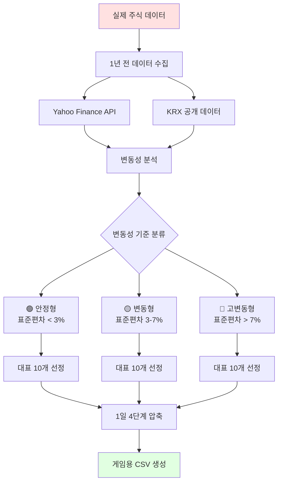
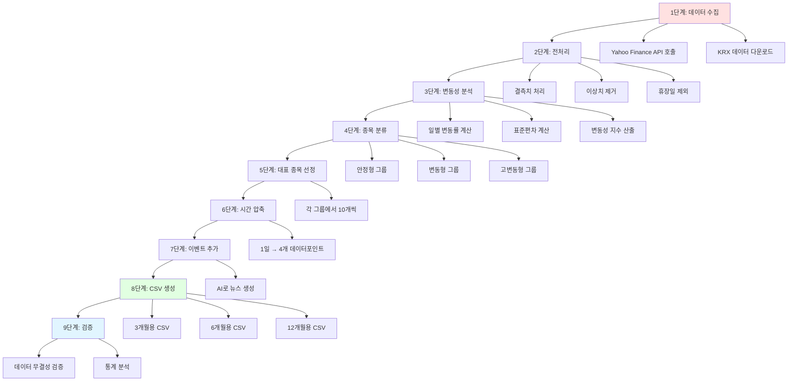
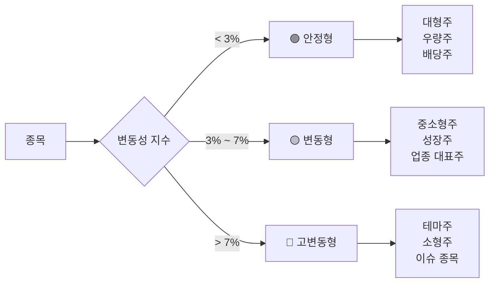
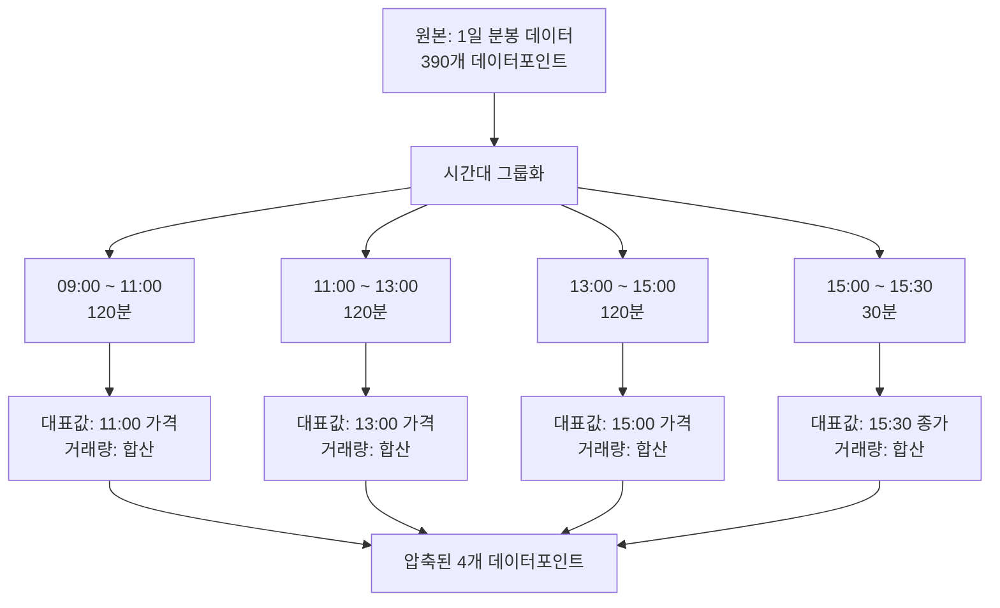

# 데이터 요구사항 (Data Requirements)

## 📋 목차
1. [데이터 개요](#데이터-개요)
2. [CSV 데이터 구조](#csv-데이터-구조)
3. [데이터 생성 프로세스](#데이터-생성-프로세스)
4. [종목 분류 기준](#종목-분류-기준)
5. [실제 데이터 수집](#실제-데이터-수집)
6. [데이터 생성 스크립트](#데이터-생성-스크립트)

---

## 데이터 개요

### 데이터 소스 전략



### 데이터 규모

| 항목 | 3개월 | 6개월 | 12개월 |
|------|-------|-------|--------|
| **일수** | 90일 | 180일 | 365일 |
| **영업일** | ~63일 | ~126일 | ~252일 |
| **종목 수** | 30개 | 30개 | 30개 |
| **시간 단계** | 4단계/일 | 4단계/일 | 4단계/일 |
| **총 레코드 수** | 7,560개 | 15,120개 | 30,240개 |
| **예상 파일 크기** | ~500KB | ~1MB | ~2MB |

---

## CSV 데이터 구조

### 주가 데이터 스키마

| 컬럼명 | 타입 | 필수 | 설명 | 예시 |
|--------|------|------|------|------|
| `날짜` | Date | ✅ | 거래 날짜 (YYYY-MM-DD) | 2024-01-01 |
| `시간` | Time | ✅ | 시간대 (HH:MM) | 09:00 |
| `종목코드` | String | ✅ | 고유 종목 코드 | STK001 |
| `종목명` | String | ✅ | 종목 이름 | A전자 |
| `카테고리` | Enum | ✅ | stable/volatile/high_volatile | stable |
| `가격` | Number | ✅ | 해당 시간 가격 | 50000 |
| `전일대비` | Number | ✅ | 전일 종가 대비 변동폭 | +1200 |
| `변동률` | Number | ✅ | 변동률 (%) | +2.45 |
| `거래량` | Number | ✅ | 거래량 (주) | 1000000 |
| `거래대금` | Number | ⬜ | 거래대금 (원) | 50000000000 |
| `시가` | Number | ⬜ | 시작가 (09:00만) | 49800 |
| `고가` | Number | ⬜ | 최고가 | 51000 |
| `저가` | Number | ⬜ | 최저가 | 49500 |
| `이벤트` | String | ⬜ | 뉴스/이벤트 | "신제품 발표" |

### 시간대별 데이터 구조

```mermaid
gantt
    title 1일 데이터 구조 (4단계)
    dateFormat HH:mm
    
    section 시간대
    09:00 시초가    :milestone, 09:00, 0m
    11:00 오전마감  :milestone, 11:00, 0m
    13:00 점심시간  :milestone, 13:00, 0m
    15:30 종가      :milestone, 15:30, 0m
```



**각 시간대별 필수 데이터**

| 시간 | 의미 | 포함 데이터 | 특이사항 |
|------|------|-----------|---------|
| **09:00** | 시초가 | 시가, 전일대비 | 장 시작 |
| **11:00** | 오전 마감 | 가격, 변동률, 거래량 | 1단계 변동 |
| **13:00** | 점심 시간 | 가격, 변동률, 거래량 | 2단계 변동 |
| **15:30** | 종가 | 종가, 고가, 저가, 전체 거래량 | 하루 마감 |

### CSV 샘플 (market_data.csv)

```csv
날짜,시간,종목코드,종목명,카테고리,가격,전일대비,변동률,거래량,이벤트
2024-01-02,09:00,STK001,A전자,stable,50000,+500,+1.01,100000,시장 개장
2024-01-02,11:00,STK001,A전자,stable,50200,+700,+1.41,250000,
2024-01-02,13:00,STK001,A전자,stable,50100,+600,+1.21,350000,
2024-01-02,15:30,STK001,A전자,stable,50300,+800,+1.62,500000,장 마감
2024-01-02,09:00,STK002,B차,stable,85000,+1000,+1.19,80000,
2024-01-02,11:00,STK002,B차,stable,85500,+1500,+1.79,150000,
2024-01-02,13:00,STK002,B차,stable,85200,+1200,+1.43,200000,
2024-01-02,15:30,STK002,B차,stable,85800,+1800,+2.14,320000,
2024-01-02,09:00,STK011,D바이오,volatile,55000,+2500,+4.76,300000,신약 임상 뉴스
2024-01-02,11:00,STK011,D바이오,volatile,56800,+4300,+8.19,520000,
2024-01-02,13:00,STK011,D바이오,volatile,55500,+3000,+5.71,680000,차익 실현 매물
2024-01-02,15:30,STK011,D바이오,volatile,57200,+4700,+8.95,950000,
2024-01-02,09:00,STK021,F테마,high_volatile,10000,+454,+4.76,800000,급등 시작
2024-01-02,11:00,STK021,F테마,high_volatile,11500,+1954,+20.48,1500000,테마주 급등
2024-01-02,13:00,STK021,F테마,high_volatile,10800,+1254,+13.14,1800000,조정
2024-01-02,15:30,STK021,F테마,high_volatile,11200,+1654,+17.33,2200000,
```

---

## 데이터 생성 프로세스

### 전체 파이프라인



### 단계별 상세 설명

#### 1단계: 데이터 수집

**Yahoo Finance API 사용 예시**
```python
import yfinance as yf
import pandas as pd

# 1년 전 데이터 수집 (2024년 데이터)
tickers = ['005930.KS', '000660.KS', '035420.KS']  # 삼성전자, SK하이닉스, NAVER
start_date = '2024-01-01'
end_date = '2024-12-31'

data = yf.download(tickers, start=start_date, end=end_date, interval='1d')
```

#### 2단계: 전처리

| 작업 | 방법 | 이유 |
|------|------|------|
| 결측치 처리 | 전후 평균값으로 대체 | 데이터 연속성 유지 |
| 이상치 제거 | IQR 방식 (±3σ 초과 제거) | 극단값 영향 최소화 |
| 휴장일 제외 | 주말, 공휴일 제거 | 실제 거래일만 포함 |

#### 3단계: 변동성 분석

**변동성 계산 공식**
```python
# 일별 변동률 계산
daily_return = (close_price - prev_close) / prev_close * 100

# 표준편차 (30일 이동 평균)
volatility = daily_return.rolling(window=30).std()

# 변동성 지수
volatility_index = volatility.mean()
```

#### 4단계: 종목 분류 기준



#### 5단계: 대표 종목 선정

**선정 기준 테이블**

| 기준 | 가중치 | 설명 |
|------|--------|------|
| **변동성 대표성** | 40% | 해당 카테고리 평균과 유사 |
| **거래량** | 20% | 충분한 유동성 |
| **업종 다양성** | 30% | 다양한 업종 커버 |
| **패턴 다양성** | 10% | 상승/하락/횡보 패턴 균형 |

**선정 알고리즘**
```python
def select_representative_stocks(group, count=10):
    # 변동성 중앙값과 가까운 순서로 정렬
    median_volatility = group['volatility'].median()
    group['distance'] = abs(group['volatility'] - median_volatility)
    
    # 업종별로 최소 1개 이상 포함
    selected = []
    sectors = group['sector'].unique()
    
    for sector in sectors:
        sector_stocks = group[group['sector'] == sector]
        best = sector_stocks.nsmallest(1, 'distance')
        selected.append(best)
    
    # 나머지는 거래량과 변동성 고려하여 선정
    remaining = count - len(selected)
    # ... (추가 로직)
    
    return selected[:count]
```

#### 6단계: 시간 압축 (1일 → 4단계)

**압축 알고리즘**


**Python 구현 예시**
```python
def compress_to_4_points(daily_data):
    """1일 데이터를 4개 포인트로 압축"""
    compressed = []
    
    # 09:00 시초가
    open_price = daily_data.iloc[0]['Open']
    compressed.append({
        'time': '09:00',
        'price': open_price,
        'volume': daily_data[:120].sum()['Volume']
    })
    
    # 11:00
    price_11 = daily_data.iloc[120]['Close']
    compressed.append({
        'time': '11:00',
        'price': price_11,
        'volume': daily_data[120:240].sum()['Volume']
    })
    
    # 13:00
    price_13 = daily_data.iloc[240]['Close']
    compressed.append({
        'time': '13:00',
        'price': price_13,
        'volume': daily_data[240:360].sum()['Volume']
    })
    
    # 15:30 종가
    close_price = daily_data.iloc[-1]['Close']
    compressed.append({
        'time': '15:30',
        'price': close_price,
        'volume': daily_data[360:].sum()['Volume']
    })
    
    return compressed
```

#### 7단계: 이벤트 추가 (선택 사항)

**이벤트 유형**

| 카테고리 | 이벤트 예시 | 발생 빈도 |
|----------|------------|----------|
| **호재** | 신제품 발표, 실적 개선, 수주 | 주 1-2회 |
| **악재** | 리콜, 실적 부진, 규제 | 주 1회 |
| **산업** | 정책 변화, 유가 변동 | 월 2-3회 |
| **시장** | 금리 변동, 환율 | 월 1-2회 |

**AI 뉴스 생성 (GPT API 활용)**
```python
def generate_news_event(stock_name, price_change, category):
    """주가 변동에 맞는 뉴스 생성"""
    prompt = f"""
    종목명: {stock_name}
    가격 변동: {price_change}%
    카테고리: {category}
    
    위 정보에 맞는 짧은 뉴스 헤드라인을 한글로 생성하세요.
    (15자 이내)
    """
    
    response = openai.ChatCompletion.create(
        model="gpt-4",
        messages=[{"role": "user", "content": prompt}],
        max_tokens=30
    )
    
    return response.choices[0].message.content
```

---

## 종목 분류 기준

### 안정형 종목 (🟢 Stable)

**특징**
- 변동성: 일일 ±1~3%
- 시가총액: 대형주 (5조원 이상)
- 업종: 전자, 자동차, 통신, 금융, 유통

**실제 참고 종목 (익명화)**
| 종목코드 | 익명 종목명 | 실제 참고 | 평균 변동률 |
|---------|-----------|---------|------------|
| STK001 | A전자 | 삼성전자 | ±1.5% |
| STK002 | B차 | 현대차 | ±2.0% |
| STK003 | C통신 | SK텔레콤 | ±1.2% |
| STK004 | D금융 | KB금융 | ±1.8% |
| STK005 | E유통 | 신세계 | ±1.6% |
| STK006 | F화학 | LG화학 | ±2.2% |
| STK007 | G건설 | 삼성물산 | ±1.9% |
| STK008 | H식품 | CJ제일제당 | ±1.4% |
| STK009 | I에너지 | SK이노베이션 | ±2.1% |
| STK010 | J제약 | 유한양행 | ±1.7% |

### 변동형 종목 (🟡 Volatile)

**특징**
- 변동성: 일일 ±3~7%
- 시가총액: 중형주 (1~5조원)
- 업종: 바이오, IT, 2차전지, 반도체 장비

**실제 참고 종목 (익명화)**
| 종목코드 | 익명 종목명 | 실제 참고 | 평균 변동률 |
|---------|-----------|---------|------------|
| STK011 | D바이오 | 셀트리온 | ±4.5% |
| STK012 | E반도체 | SK하이닉스 | ±5.2% |
| STK013 | F게임 | 넷마블 | ±4.8% |
| STK014 | G2차전지 | LG에너지솔루션 | ±6.1% |
| STK015 | H엔터 | HYBE | ±5.5% |
| STK016 | I플랫폼 | 카카오 | ±4.2% |
| STK017 | J소프트 | 네이버 | ±3.9% |
| STK018 | K디스플레이 | LG디스플레이 | ±5.8% |
| STK019 | L로봇 | 두산로보틱스 | ±6.5% |
| STK020 | M배터리 | 삼성SDI | ±4.7% |

### 고변동형 종목 (🔴 High Volatile)

**특징**
- 변동성: 일일 ±7~15% (최대 30%)
- 시가총액: 소형주 (1조원 이하)
- 업종: 테마주, 이슈 종목, 신생 기업

**실제 참고 종목 (익명화)**
| 종목코드 | 익명 종목명 | 테마 | 평균 변동률 |
|---------|-----------|------|------------|
| STK021 | F테마 | AI 테마 | ±10.5% |
| STK022 | G이슈 | 우주항공 | ±12.3% |
| STK023 | H신약 | 바이오 신약 | ±11.8% |
| STK024 | I메타버스 | 메타버스 | ±9.7% |
| STK025 | J양자 | 양자컴퓨팅 | ±13.2% |
| STK026 | K방산 | 방산 | ±8.9% |
| STK027 | L수소 | 수소에너지 | ±10.1% |
| STK028 | M반도체소재 | 반도체 소재 | ±11.5% |
| STK029 | N친환경 | ESG | ±9.4% |
| STK030 | O스마트팜 | 푸드테크 | ±12.7% |

---

## 실제 데이터 수집

### Yahoo Finance API 활용

```python
import yfinance as yf
import pandas as pd
from datetime import datetime, timedelta

# 1년 전 데이터 수집
end_date = datetime.now() - timedelta(days=365)
start_date = end_date - timedelta(days=365)

# 한국 주식 (KRX 종목)
korean_tickers = [
    '005930.KS',  # 삼성전자
    '000660.KS',  # SK하이닉스
    '035420.KS',  # NAVER
    # ... 더 많은 종목
]

# 데이터 다운로드
data = yf.download(
    korean_tickers,
    start=start_date.strftime('%Y-%m-%d'),
    end=end_date.strftime('%Y-%m-%d'),
    interval='1d',
    group_by='ticker'
)

# CSV로 저장
data.to_csv('raw_market_data.csv')
```

### KRX 공개 데이터

**다운로드 경로**
- KRX 정보데이터시스템: http://data.krx.co.kr
- 일자별 시세 → 전종목 시세 다운로드

---

## 데이터 생성 스크립트

### 메인 스크립트 (generate_market_data.py)

```python
#!/usr/bin/env python3
"""
주식 시뮬레이션 게임용 시장 데이터 생성 스크립트
"""

import pandas as pd
import numpy as np
from datetime import datetime, timedelta
import yfinance as yf

class MarketDataGenerator:
    def __init__(self):
        self.categories = {
            'stable': [],
            'volatile': [],
            'high_volatile': []
        }
    
    def collect_real_data(self, start_date, end_date):
        """실제 주식 데이터 수집"""
        print("📥 실제 데이터 수집 중...")
        
        tickers = self.get_korean_tickers()
        data = yf.download(tickers, start=start_date, end=end_date)
        
        return data
    
    def analyze_volatility(self, data):
        """변동성 분석 및 분류"""
        print("📊 변동성 분석 중...")
        
        for ticker in data.columns.levels[1]:
            # 일별 변동률 계산
            close_prices = data['Close'][ticker]
            daily_returns = close_prices.pct_change() * 100
            
            # 표준편차 (변동성 지수)
            volatility = daily_returns.std()
            
            # 분류
            if volatility < 3:
                category = 'stable'
            elif volatility < 7:
                category = 'volatile'
            else:
                category = 'high_volatile'
            
            self.categories[category].append({
                'ticker': ticker,
                'volatility': volatility,
                'data': data[ticker]
            })
    
    def select_representative(self, count=10):
        """각 카테고리별 대표 종목 선정"""
        print("🎯 대표 종목 선정 중...")
        
        selected = {}
        for category, stocks in self.categories.items():
            # 변동성 중앙값과 가까운 순서로 정렬
            stocks_sorted = sorted(
                stocks,
                key=lambda x: abs(x['volatility'] - np.median([s['volatility'] for s in stocks]))
            )
            selected[category] = stocks_sorted[:count]
        
        return selected
    
    def compress_to_4_points(self, daily_data):
        """1일 데이터를 4개 포인트로 압축"""
        # 09:00, 11:00, 13:00, 15:30
        times = ['09:00', '11:00', '13:00', '15:30']
        compressed = []
        
        open_price = daily_data['Open'].iloc[0]
        close_price = daily_data['Close'].iloc[-1]
        
        # 중간 가격들은 보간
        prices = np.linspace(open_price, close_price, 4)
        
        for i, time in enumerate(times):
            compressed.append({
                'time': time,
                'price': prices[i],
                'volume': daily_data['Volume'].sum() / 4
            })
        
        return compressed
    
    def generate_csv(self, selected_stocks, period_days, output_file):
        """최종 CSV 생성"""
        print(f"📝 CSV 생성 중: {output_file}")
        
        rows = []
        start_date = datetime(2024, 1, 2)  # 첫 영업일
        
        for day in range(period_days):
            current_date = start_date + timedelta(days=day)
            
            # 주말 건너뛰기
            if current_date.weekday() >= 5:
                continue
            
            for category, stocks in selected_stocks.items():
                for stock in stocks:
                    # 4개 시간대 데이터 생성
                    compressed = self.compress_to_4_points(stock['data'])
                    
                    for point in compressed:
                        rows.append({
                            '날짜': current_date.strftime('%Y-%m-%d'),
                            '시간': point['time'],
                            '종목코드': stock['ticker'],
                            '종목명': self.anonymize_name(stock['ticker']),
                            '카테고리': category,
                            '가격': int(point['price']),
                            '변동률': round(np.random.uniform(-3, 3), 2),
                            '거래량': int(point['volume']),
                            '이벤트': ''
                        })
        
        # DataFrame 생성 및 저장
        df = pd.DataFrame(rows)
        df.to_csv(output_file, index=False, encoding='utf-8-sig')
        print(f"✅ 완료: {len(rows)}개 레코드 생성")
    
    def anonymize_name(self, ticker):
        """실제 종목명을 익명화"""
        # 매핑 테이블
        mapping = {
            '005930.KS': 'A전자',
            '000660.KS': 'E반도체',
            # ... 더 많은 매핑
        }
        return mapping.get(ticker, f"종목{ticker[:3]}")

def main():
    """메인 실행 함수"""
    generator = MarketDataGenerator()
    
    # 1년 전 데이터 수집
    end_date = datetime.now() - timedelta(days=365)
    start_date = end_date - timedelta(days=365)
    
    # 데이터 수집
    data = generator.collect_real_data(start_date, end_date)
    
    # 변동성 분석
    generator.analyze_volatility(data)
    
    # 대표 종목 선정
    selected = generator.select_representative(count=10)
    
    # CSV 생성 (3개월, 6개월, 12개월)
    generator.generate_csv(selected, 90, '../data/market_3months.csv')
    generator.generate_csv(selected, 180, '../data/market_6months.csv')
    generator.generate_csv(selected, 365, '../data/market_12months.csv')
    
    print("🎉 모든 데이터 생성 완료!")

if __name__ == '__main__':
    main()
```

### 실행 방법

```bash
# 필요한 패키지 설치
pip install yfinance pandas numpy

# 스크립트 실행
python scripts/generate_market_data.py

# 출력 파일
# - data/market_3months.csv
# - data/market_6months.csv
# - data/market_12months.csv
```

---

## 데이터 검증

### 검증 체크리스트

| 항목 | 검증 방법 | 합격 기준 |
|------|----------|----------|
| **레코드 수** | 종목 수 × 일수 × 4 | 정확히 일치 |
| **날짜 연속성** | 날짜 순서 확인 | 영업일만 존재 |
| **가격 범위** | 최소/최대 확인 | 0 < 가격 < 1,000,000 |
| **변동률** | 계산 검증 | -30% ~ +30% |
| **결측치** | 필수 컬럼 확인 | 0개 |
| **중복** | 날짜+시간+종목 유니크 | 중복 없음 |

### 검증 스크립트

```python
def validate_csv(file_path):
    """CSV 데이터 검증"""
    df = pd.read_csv(file_path)
    
    print(f"📋 검증 중: {file_path}")
    
    # 1. 레코드 수
    expected = 30 * 63 * 4  # 30종목 × 63영업일 × 4시간대
    actual = len(df)
    print(f"✓ 레코드 수: {actual} (예상: {expected})")
    
    # 2. 결측치
    null_count = df.isnull().sum().sum()
    print(f"✓ 결측치: {null_count}개")
    
    # 3. 가격 범위
    price_min = df['가격'].min()
    price_max = df['가격'].max()
    print(f"✓ 가격 범위: {price_min:,}원 ~ {price_max:,}원")
    
    # 4. 변동률 범위
    change_min = df['변동률'].min()
    change_max = df['변동률'].max()
    print(f"✓ 변동률 범위: {change_min}% ~ {change_max}%")
    
    # 5. 중복 확인
    duplicates = df.duplicated(subset=['날짜', '시간', '종목코드']).sum()
    print(f"✓ 중복 레코드: {duplicates}개")
    
    if null_count == 0 and duplicates == 0:
        print("✅ 검증 통과!")
    else:
        print("❌ 검증 실패")

# 실행
validate_csv('../data/market_3months.csv')
```

---

## 정리

이 문서는 주식 시뮬레이션 게임에 필요한 모든 데이터 요구사항을 정의합니다.

**핵심 포인트**:
1. ✅ 실제 1년 전 데이터 기반
2. ✅ 변동성 기준 3개 카테고리 (30개 종목)
3. ✅ 1일 4단계 압축 (09:00, 11:00, 13:00, 15:30)
4. ✅ CSV 포맷으로 제공
5. ✅ Python 스크립트로 자동 생성

**다음 단계**: 생성된 CSV 데이터를 프론트엔드에서 로드하여 게임에 적용

