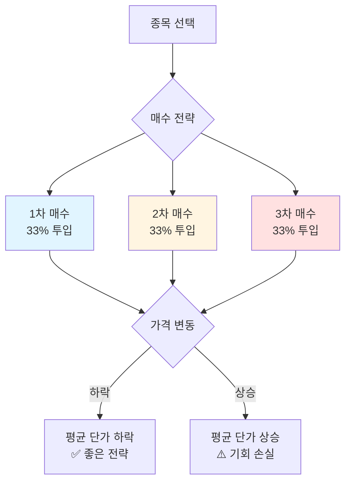
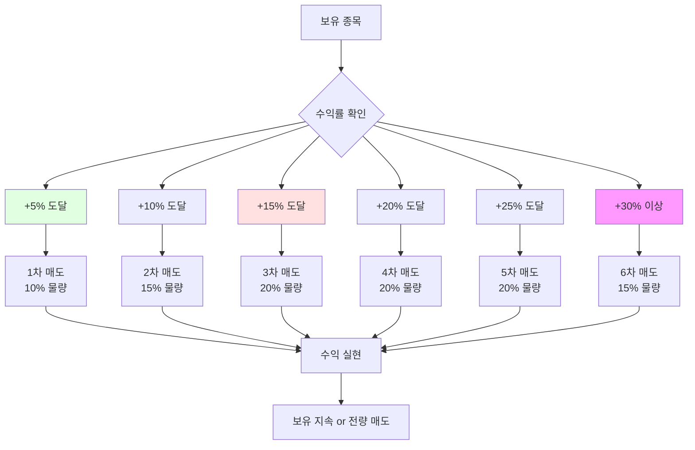
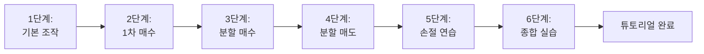
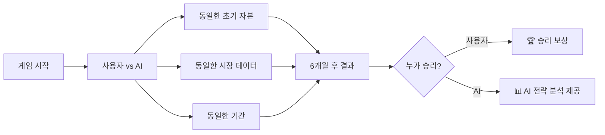
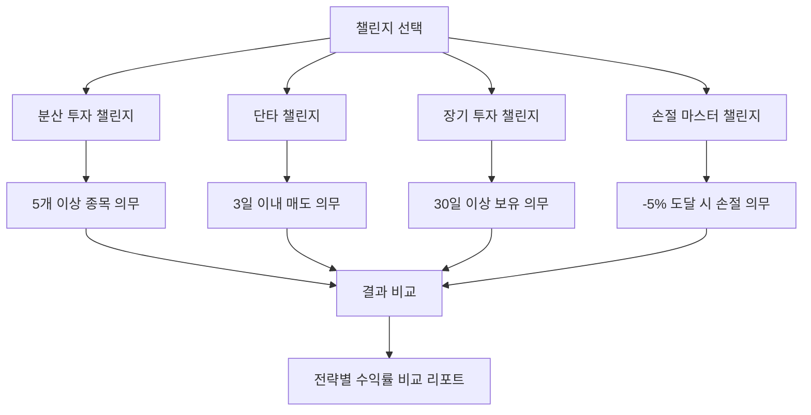
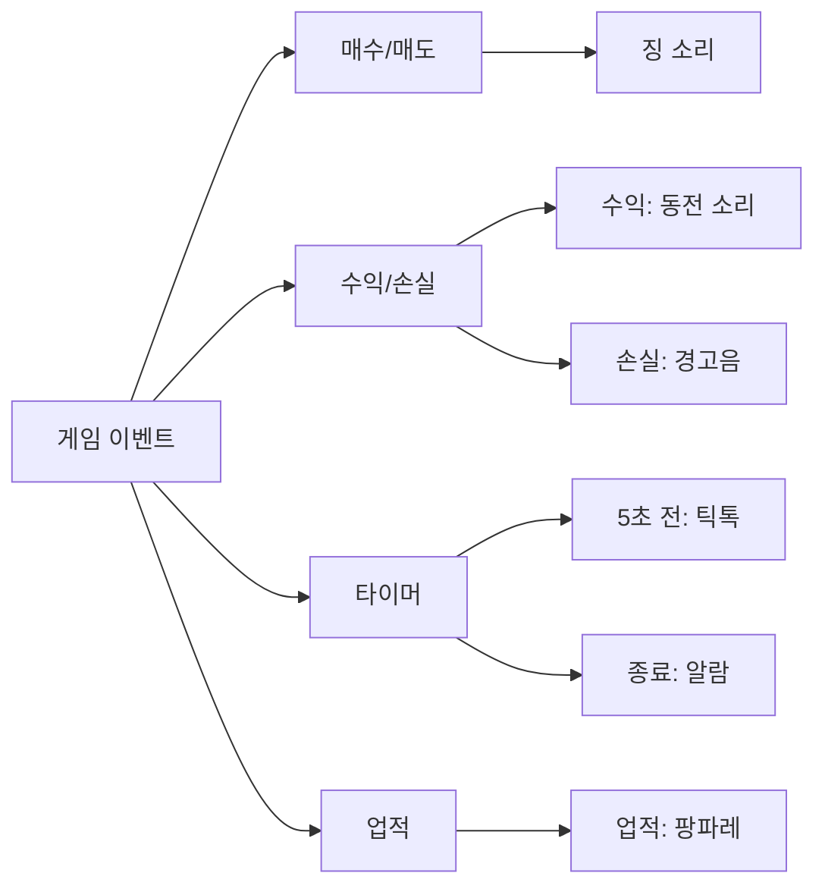
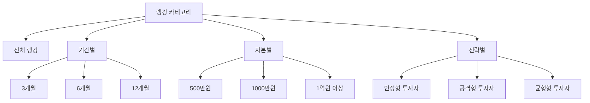
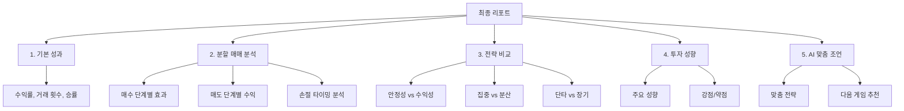
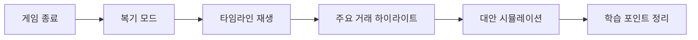
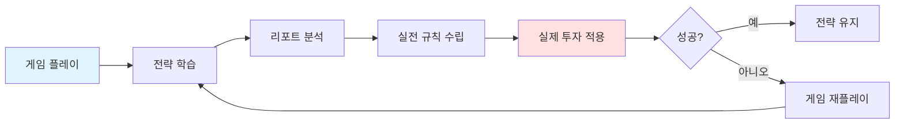

# 주식 시뮬레이션 게임 - 최종 기획안 v2.0
## "파도를 타라: 주식 리듬 마스터"

## 🎯 게임 핵심 컨셉

### 메인 컨셉: "주식 시장의 파도 타기"
주식 시장은 파도와 같습니다. 오르락내리락 하는 리듬이 있고, 그 파도를 타는 감각이 수익의 핵심입니다. 이 게임은 **실제 한국 주식 시장의 리얼 데이터**를 바탕으로 파도의 리듬을 체득하고, **진짜 재테크 목표**(집, 차, 세계여행)를 달성하는 시뮬레이션 게임입니다.

### 차별화 포인트
- 🏢 **실제 종목명**: 삼성전자, 네이버, 카카오 등 실제 한국 주식
- 📈 **리얼 데이터**: 최근 1년 실제 데이터의 파도 패턴 유지
- 🌊 **파도 리듬**: AI가 시간축을 조정하되 변동 패턴은 그대로
- 🎁 **실제 목표**: 집, 차, 여행 등 구체적인 재테크 목표
- 🎮 **게임 재미**: RPG 스타일 성장, 스토리, 보상 시스템
- 💰 **분할 매매**: 3단계 매수, 6단계 매도 실전 전략

---

## 📊 핵심 메커니즘: 분할 매매 시스템

### 매수 3단계 전략



#### 매수 3단계 상세

| 단계 | 타이밍 | 투입 비율 | 전략 목적 | 예시 (100만원 투자) |
|------|--------|----------|----------|---------------------|
| **1차 매수** | 초기 진입 | 33% | 시장 진입, 포지션 확보 | 33만원 (현재가 매수) |
| **2차 매수** | 하락 시 or 확신 시 | 33% | 평균 단가 낮추기 | 33만원 (-5% 하락 시) |
| **3차 매수** | 추가 하락 or 상승 확인 | 33% | 최종 물량 확보 | 33만원 (-10% 또는 +3%) |

**게임 내 구현**
```typescript
// 매수 팝업에서 선택 가능
interface BuyOptions {
    strategy: '전량 매수' | '1차 매수(33%)' | '2차 매수(33%)' | '3차 매수(33%)';
    targetStock: Stock;
    totalAmount: number;
}

// 1차 매수 후 게임 내 힌트 시스템
if (user.bought_phase1 && price_dropped_5_percent) {
    showHint("💡 힌트: 가격이 5% 하락했습니다. 2차 매수로 평균 단가를 낮출 기회입니다!");
}
```

### 매도 6단계 전략



#### 매도 6단계 상세

| 단계 | 수익률 기준 | 매도 비율 | 전략 목적 | 남은 보유 |
|------|------------|----------|----------|----------|
| **1차 매도** | +5% | 10% | 소액 이익 실현, 심리적 안정 | 90% |
| **2차 매도** | +10% | 15% | 추가 이익 확보 | 75% |
| **3차 매도** | +15% | 20% | 안정적 수익 | 55% |
| **4차 매도** | +20% | 20% | 주요 수익 실현 | 35% |
| **5차 매도** | +25% | 20% | 큰 수익 확보 | 15% |
| **6차 매도** | +30%+ | 15% | 최종 물량 정리 | 0% |

**손절 시스템 (추가)**

| 손실률 | 매도 비율 | 액션 |
|--------|----------|------|
| -5% | 경고 알림 | "손절 타이밍 고려" |
| -7% | 강력 경고 | "손절 권장" + 특수효과 |
| -10% | 자동 손절 제안 | "50% 물량 손절 제안" |
| -15% | 긴급 경고 | "전량 손절 권장" |

**게임 내 구현**
```typescript
// 매도 팝업 UI
interface SellOptions {
    strategy: '전량 매도' | 
              '1차 매도(10%)' | 
              '2차 매도(15%)' | 
              '3차 매도(20%)' | 
              '4차 매도(20%)' | 
              '5차 매도(20%)' | 
              '6차 매도(15%)' |
              '손절 매도';
    currentProfit: number;
    recommendedAction: string; // AI 추천
}

// 실시간 매도 알림
if (profit_rate >= 5 && !user.sold_phase1) {
    showNotification("🎯 1차 매도 타이밍! 10% 물량 익절 추천");
    playSound('opportunity.mp3');
}
```

---

## 🎮 게임 모드

### 1. 튜토리얼 모드 (필수)

**단계별 학습**


| 단계 | 학습 내용 | 실습 | 소요 시간 |
|------|----------|------|----------|
| 1 | 시간 시스템, 일시정지, 10초 타이머 | 일시정지 해보기 | 30초 |
| 2 | 종목 선택, 1차 매수 | A전자 1차 매수 | 1분 |
| 3 | 가격 하락 시 2차, 3차 매수 | 분할 매수 체험 | 2분 |
| 4 | 수익 실현 6단계 매도 | 분할 매도 체험 | 2분 |
| 5 | 손절 타이밍과 중요성 | 손절 연습 | 1분 |
| 6 | 3일 간 종합 실습 | 자유 거래 | 3분 |

### 2. 연습 모드 (초보자용)

**특징**
- ⏸️ **무제한 일시정지**: 10초 제한 없음
- 💡 **실시간 힌트**: 모든 타이밍에 AI 조언
- 🔄 **되돌리기 기능**: 최근 3개 거래 취소 가능
- 📊 **상세 설명**: 모든 용어와 전략 설명

**힌트 시스템 예시**
```
💡 힌트: D바이오가 -7% 하락했습니다.
   
📈 전략 옵션:
   1. 2차 매수: 평균 단가를 낮춰 수익률 개선
   2. 관망: 추가 하락 가능성 있음
   3. 손절: -10% 도달 전 손실 최소화

🎯 추천: 변동형 종목이므로 2차 매수 후 반등 기대
```

### 3. 실전 모드 (기본)

**특징**
- ⏰ **10초 타이머**: 의사결정 제한
- 💡 **선택적 힌트**: 중요한 순간만 힌트 (5회 제한)
- 🚫 **되돌리기 불가**: 모든 결정 최종
- 📊 **실시간 분석**: 현재 전략 평가

**난이도 선택**

| 난이도 | 변동성 | 이벤트 빈도 | 힌트 제공 | 추천 대상 |
|--------|--------|------------|----------|----------|
| **쉬움** | 낮음 | 적음 | 5회 | 초급자 |
| **보통** | 중간 | 보통 | 3회 | 중급자 |
| **어려움** | 높음 | 빈번 | 1회 | 고급자 |
| **지옥** | 극심 | 매우 빈번 | 0회 | 전문가 |

### 4. AI 대결 모드 (고급)

**컨셉**: AI 트레이더와 동일한 조건에서 경쟁



**AI 성향 종류**

| AI 타입 | 전략 | 특징 | 난이도 |
|---------|------|------|--------|
| **보수형 AI** | 안정형 종목, 장기 보유 | 수익률 낮지만 안정적 | ⭐ |
| **균형형 AI** | 분산 투자, 분할 매매 | 균형잡힌 플레이 | ⭐⭐ |
| **공격형 AI** | 고변동 종목, 단타 | 높은 수익 or 큰 손실 | ⭐⭐⭐ |
| **천재형 AI** | 최적 타이밍 포착 | 거의 완벽한 전략 | ⭐⭐⭐⭐ |

**승리 보상**
- 🏆 특수 업적 획득
- 🎁 AI 전략 레포트 제공
- 🌟 랭킹 포인트 2배

### 5. 전략 챌린지 모드 (신규 제안)

**컨셉**: 특정 전략을 강제하여 효과 체험



**챌린지 목록**

| 챌린지 | 규칙 | 목표 | 보상 |
|--------|------|------|------|
| **분산 투자** | 최소 5개 종목, 한 종목 최대 30% | 안정성 이해 | "분산의 달인" 업적 |
| **단타 마스터** | 3일 이내 매도, 20회 이상 거래 | 타이밍 감각 | "데이 트레이더" 업적 |
| **장기 투자** | 30일 이상 보유, 3개 이하 종목 | 인내심 훈련 | "장기 투자자" 업적 |
| **손절 마스터** | -5% 도달 시 무조건 손절 | 리스크 관리 | "손절의 신" 업적 |
| **분할 매매** | 3단계 매수, 6단계 매도 필수 | 분할 매매 체득 | "전략가" 업적 |

---

## 💡 실시간 힌트 시스템

### 힌트 발동 타이밍

| 상황 | 힌트 내용 | 발동 조건 |
|------|----------|----------|
| **매수 기회** | "💡 D바이오가 저점 근처입니다" | 최근 30일 최저가 근처 |
| **2차 매수 타이밍** | "📊 1차 매수 후 -5% 하락, 2차 매수 고려" | 1차 매수 후 -5% 하락 |
| **매도 타이밍** | "🎯 +10% 달성! 2차 매도 추천" | 목표 수익률 도달 |
| **손절 경고** | "⚠️ -7% 손실, 손절 타이밍 고려" | 손실률 -7% 도달 |
| **과열 경고** | "🔥 F테마 과열 구간, 진입 주의" | 급등 +15% 이상 |
| **분산 투자 제안** | "💼 한 종목에 50% 집중, 리스크 높음" | 집중도 분석 |

### 전략 가이드 (게임 중 제공)

**상황별 전략 카드**
```
┌─────────────────────────────────────┐
│ 📋 전략 카드: 하락장 대응           │
├─────────────────────────────────────┤
│ 상황: 보유 종목 -5% 하락            │
│                                     │
│ 옵션 1: 2차 매수 (공격적) ⚡        │
│   - 평균 단가 하락                  │
│   - 반등 시 큰 수익                 │
│   - 리스크: 추가 하락 가능          │
│                                     │
│ 옵션 2: 관망 (중립) ⏸️              │
│   - 추가 하락 확인                  │
│   - 안전한 선택                     │
│   - 리스크: 기회 놓칠 수 있음       │
│                                     │
│ 옵션 3: 손절 (방어적) 🛡️           │
│   - 손실 최소화                     │
│   - 다른 기회 탐색                  │
│   - 리스크: 반등 못 봄              │
│                                     │
│ 🎯 AI 추천: 변동형 종목이므로       │
│    2차 매수 후 반등 기대 (60%)      │
└─────────────────────────────────────┘
```

---

## 🎨 게임 재미 요소

### 1. 특수 효과

**시각 효과**
| 상황 | 효과 | 설명 |
|------|------|------|
| 큰 수익 (+20% 이상) | 금색 파티클, 폭죽 | 성공 감각 강화 |
| 큰 손실 (-15% 이상) | 화면 흔들림, 어두워짐 | 긴장감 부여 |
| 급등 (+10% 이상) | 상승 화살표, 불꽃 | 기회 강조 |
| 급락 (-10% 이상) | 하락 화살표, 경고등 | 위험 경고 |
| 손절 성공 | 방패 이펙트 | 리스크 관리 칭찬 |
| 분할 매수/매도 | 계단 애니메이션 | 전략 시각화 |

**사운드 효과**


### 2. 업적 시스템

**기본 업적**
| 업적 | 조건 | 보상 | 아이콘 |
|------|------|------|--------|
| 🎓 **첫 걸음** | 튜토리얼 완료 | 힌트 +2회 | 📚 |
| 💰 **첫 수익** | 첫 수익 거래 | - | 💵 |
| 📈 **+30% 달성** | 30% 수익 달성 | 특수 칭호 | 🚀 |
| 🛡️ **손절의 달인** | 손절 5회 이상 | 리스크 관리 가이드 | 🛡️ |
| 🎯 **타이밍 마스터** | 저점 매수 10회 | - | 🎯 |
| 🏆 **AI 승리** | AI 대결 승리 | AI 전략 분석 | 🏆 |

**챌린지 업적**
| 업적 | 조건 | 난이도 |
|------|------|--------|
| 🌟 **분산의 달인** | 분산 투자 챌린지 완료 | ⭐⭐ |
| ⚡ **데이 트레이더** | 단타 챌린지 완료 | ⭐⭐⭐ |
| 🧘 **장기 투자자** | 장기 투자 챌린지 완료 | ⭐⭐ |
| 💎 **손절의 신** | 손절 챌린지 완료, MDD -5% 이하 | ⭐⭐⭐⭐ |
| 👑 **투자 마스터** | 모든 챌린지 완료 | ⭐⭐⭐⭐⭐ |

### 3. 랭킹 시스템



**랭킹 화면 예시**
```
┌─────────────────────────────────────────────────┐
│ 🏆 전체 랭킹 (6개월 코스)                      │
├─────────────────────────────────────────────────┤
│ 1위 🥇 투자천재        +127.5% (공격형) ⚡      │
│ 2위 🥈 주식마스터      +98.2%  (균형형) ⚖️      │
│ 3위 🥉 워렌버핏        +87.3%  (안정형) 🛡️      │
│ ...                                             │
│ 15위 🎯 당신           +32.5%  (공격형) ⚡      │
│                                                 │
│ 💡 상위 1%까지 2.5% 더 필요합니다!             │
│ 💡 분할 매도를 더 활용하면 수익률 개선 가능    │
└─────────────────────────────────────────────────┘
```

---

## 📊 최종 리포트 시스템 (핵심!)

### 리포트 구조



### 1. 기본 성과 지표

```
━━━━━━━━━━━━━━━━━━━━━━━━━━━━━━━━━━━━━━━━━━━━━
📊 투자 결과 요약
━━━━━━━━━━━━━━━━━━━━━━━━━━━━━━━━━━━━━━━━━━━━━
초기 자본:       10,000,000원
최종 자산:       13,250,000원
순수익:          +3,250,000원
수익률:          +32.5% 🎉
기간:            6개월 (180일)

총 거래 횟수:    47회
승률:            63.8% (30승 17패)
평균 보유 기간:  3.8일
```

### 2. 분할 매매 분석 (신규!)

```
━━━━━━━━━━━━━━━━━━━━━━━━━━━━━━━━━━━━━━━━━━━━━
📈 분할 매수 분석 (3단계)
━━━━━━━━━━━━━━━━━━━━━━━━━━━━━━━━━━━━━━━━━━━━━

1차 매수:        28회 사용 ✅
2차 매수:        15회 사용 (1차 대비 53.6%) ⚠️
3차 매수:        5회 사용 (1차 대비 17.9%) ⚠️

━━━━━━━━━━━━━━━━━━━━━━━━━━━━━━━━━━━━━━━━━━━━━
📊 단계별 효과 분석
━━━━━━━━━━━━━━━━━━━━━━━━━━━━━━━━━━━━━━━━━━━━━

▪️ 분할 매수 활용 종목 (5종목)
   평균 수익률: +18.3% 📈

▪️ 전량 매수 종목 (23종목)
   평균 수익률: +8.7% 📉

💡 분석:
   분할 매수를 활용한 종목의 수익률이 2.1배 높습니다!
   특히 변동형, 고변동형 종목에서 효과적이었습니다.

⚠️ 개선점:
   1차 매수 후 2차 매수 비율이 낮습니다 (53.6%)
   → 가격 하락 시 2차 매수를 더 적극적으로 활용하세요.
   → 권장 비율: 70% 이상

━━━━━━━━━━━━━━━━━━━━━━━━━━━━━━━━━━━━━━━━━━━━━
📉 분할 매도 분석 (6단계)
━━━━━━━━━━━━━━━━━━━━━━━━━━━━━━━━━━━━━━━━━━━━━

1차 매도(+5%):   8회 사용 ✅
2차 매도(+10%):  12회 사용 ✅
3차 매도(+15%):  5회 사용
4차 매도(+20%):  3회 사용
5차 매도(+25%):  1회 사용 🎉
6차 매도(+30%):  0회 사용

전량 매도:       18회 (주로 +7% 구간) ⚠️

━━━━━━━━━━━━━━━━━━━━━━━━━━━━━━━━━━━━━━━━━━━━━
💰 수익 분석
━━━━━━━━━━━━━━━━━━━━━━━━━━━━━━━━━━━━━━━━━━━━━

분할 매도 평균 수익: +15.2%
전량 매도 평균 수익: +7.1%

💡 분석:
   분할 매도를 활용하면 평균 2.1배 높은 수익!
   하지만 +7% 구간에서 조급하게 전량 매도하는 경향이 있습니다.

📊 놓친 수익:
   +7%에서 전량 매도한 18건 중 12건이 이후 +15% 이상 상승
   → 예상 추가 수익: +980,000원 💸

🎯 개선 전략:
   +5% 도달 시 1차 매도(10%)로 심리적 안정
   +10%까지 보유하여 2차 매도(15%)
   나머지는 +15%, +20% 단계적 매도
```

### 3. 전략 비교 분석 (신규!)

```
━━━━━━━━━━━━━━━━━━━━━━━━━━━━━━━━━━━━━━━━━━━━━
⚖️ 안정성 vs 수익성 분석
━━━━━━━━━━━━━━━━━━━━━━━━━━━━━━━━━━━━━━━━━━━━━

당신의 포지션:
                    안정성 ◄────●─────► 수익성
                      30%              70%

당신은 "공격적 투자자" 성향입니다.

━━━━━━━━━━━━━━━━━━━━━━━━━━━━━━━━━━━━━━━━━━━━━
📊 종목별 투자 비중
━━━━━━━━━━━━━━━━━━━━━━━━━━━━━━━━━━━━━━━━━━━━━

🟢 안정형:    15% ████
🟡 변동형:    35% ████████
🔴 고변동형:  50% ████████████ ⚠️

💡 분석:
   고변동형에 집중 → 높은 수익 가능성, 높은 리스크
   최대 낙폭(MDD): -18.5%

━━━━━━━━━━━━━━━━━━━━━━━━━━━━━━━━━━━━━━━━━━━━━
📈 전략 시뮬레이션 (가정)
━━━━━━━━━━━━━━━━━━━━━━━━━━━━━━━━━━━━━━━━━━━━━

만약 다른 전략을 사용했다면?

전략 A: 균형 포트폴리오 (안정30% 변동40% 고변동30%)
   예상 수익률: +25.8%
   예상 MDD: -10.2%
   ✅ 안정성 증가, 수익률 약간 감소

전략 B: 보수 포트폴리오 (안정50% 변동40% 고변동10%)
   예상 수익률: +18.5%
   예상 MDD: -6.1%
   ✅ 매우 안정적, 수익률 낮음

전략 C: 초공격 포트폴리오 (안정0% 변동20% 고변동80%)
   예상 수익률: +48.2% or -25.3%
   예상 MDD: -35.8%
   ⚠️ 매우 위험, 큰 수익 or 큰 손실

━━━━━━━━━━━━━━━━━━━━━━━━━━━━━━━━━━━━━━━━━━━━━
🎯 맞춤 추천 전략
━━━━━━━━━━━━━━━━━━━━━━━━━━━━━━━━━━━━━━━━━━━━━

당신에게 맞는 전략:

1️⃣ 분할 매수를 더 적극적으로 활용
   - 1차 매수 후 -5% 하락 시 2차 매수 70% 실행
   - 변동형, 고변동형에 효과적

2️⃣ 고변동형 비중 축소: 50% → 35%
   - 안정형 비중 증가: 15% → 30%
   - 리스크 감소, 안정적 수익

3️⃣ 분할 매도 활용도 증가
   - +7%에서 조급하게 전량 매도 지양
   - 단계별 매도로 더 큰 수익 추구

4️⃣ 손절 기준 명확화
   - -5% 도달 시 무조건 손절
   - 현재 평균 손절: -9.2% → -5%로 개선

━━━━━━━━━━━━━━━━━━━━━━━━━━━━━━━━━━━━━━━━━━━━━
📊 예상 개선 효과
━━━━━━━━━━━━━━━━━━━━━━━━━━━━━━━━━━━━━━━━━━━━━

위 전략 적용 시:
   현재 수익률:    +32.5%
   예상 수익률:    +42.8% 🚀 (+10.3%p)
   
   현재 MDD:       -18.5%
   예상 MDD:       -11.2% ✅ (리스크 -39% 감소)
   
   안정성 점수:    ⭐⭐⭐☆☆ → ⭐⭐⭐⭐☆

다음 게임에서 적용해보세요! 🎯
```

### 4. AI 맞춤 조언

```
━━━━━━━━━━━━━━━━━━━━━━━━━━━━━━━━━━━━━━━━━━━━━
🤖 AI 투자 코치 분석
━━━━━━━━━━━━━━━━━━━━━━━━━━━━━━━━━━━━━━━━━━━━━

당신의 투자 스타일: "공격적 단타 투자자"

✅ 강점:
1. 급등 초기 포착 능력 우수 (상위 12%)
2. 빠른 의사결정 (평균 6.2초, 최적 구간)
3. 타이밍 감각 양호 (저점 매수 65%)

⚠️ 약점:
1. 조급한 익절 (평균 +7%에서 매도, 권장 +12%)
2. 손절 타이밍 늦음 (평균 -9%, 권장 -5%)
3. 고변동 종목 과도한 집중 (50%, 권장 30%)

━━━━━━━━━━━━━━━━━━━━━━━━━━━━━━━━━━━━━━━━━━━━━
💡 실전 적용 가이드
━━━━━━━━━━━━━━━━━━━━━━━━━━━━━━━━━━━━━━━━━━━━━

📋 나만의 투자 규칙 (복사해서 사용하세요)

1. 포트폴리오 구성
   - 안정형 30% (최소 3종목)
   - 변동형 40% (최소 4종목)
   - 고변동형 30% (최대 3종목)
   - 현금 비율 최소 15% 유지

2. 매수 규칙
   - 1차 매수: 총 투자금의 33%
   - 2차 매수: -5% 하락 시 33%
   - 3차 매수: -10% 하락 or +3% 상승 시 33%
   - 한 종목 최대 비중: 25%

3. 매도 규칙
   - +5%: 1차 매도 10%
   - +10%: 2차 매도 15%
   - +15%: 3차 매도 20%
   - +20%: 4차 매도 20%
   - +25%: 5차 매도 20%
   - +30%: 6차 매도 15%

4. 손절 규칙
   - -5%: 경고, 추가 하락 시 손절 준비
   - -7%: 50% 물량 손절
   - -10%: 전량 손절 (예외 없음)

5. 리스크 관리
   - MDD 목표: -10% 이내
   - 하루 최대 거래: 5회
   - 감정적 거래 금지

━━━━━━━━━━━━━━━━━━━━━━━━━━━━━━━━━━━━━━━━━━━━━
🎯 다음 게임 추천 설정
━━━━━━━━━━━━━━━━━━━━━━━━━━━━━━━━━━━━━━━━━━━━━

권장 설정:
   초기 자본: 1,000만원 (현재와 동일)
   기간: 6개월 (충분한 경험)
   난이도: 보통 (안정성 개선 연습)
   챌린지: "분할 매매 챌린지" 🎯

목표:
   - 분할 매수 활용률 70% 이상
   - 분할 매도 활용률 80% 이상
   - MDD -10% 이내
   - 수익률 +40% 이상

이 설정으로 플레이하면 안정성과 수익성을
동시에 개선할 수 있습니다! 🚀
```

---

## 🎯 개선 사항 및 검토

### 기존 기획의 문제점과 해결

| 문제점 | 개선 사항 |
|--------|----------|
| ❌ 단순 매수/매도만 가능 | ✅ 매수 3단계, 매도 6단계 시스템 |
| ❌ 전략 학습 부족 | ✅ 실시간 힌트, 전략 가이드, AI 조언 |
| ❌ 단일 플레이 모드 | ✅ 5가지 모드 (튜토리얼, 연습, 실전, AI 대결, 챌린지) |
| ❌ 재미 요소 부족 | ✅ 특수효과, 업적, 랭킹, AI 대결 |
| ❌ 피드백 단순 | ✅ 상세한 분석 리포트 (분할 매매 분석, 전략 비교) |
| ❌ 전략 비교 불가 | ✅ 시뮬레이션으로 다른 전략 효과 제시 |

### 추가 제안 사항

#### 1. 복기 시스템 (신규)


**기능**
- 📹 전체 게임 타임라인 재생 (빨리감기 가능)
- 🎯 주요 거래 순간 북마크
- 💡 "만약 이렇게 했다면?" 시뮬레이션
- 📊 각 결정의 장단점 분석

#### 2. 소셜 기능 (선택)
- 📤 리포트 SNS 공유
- 👥 친구 대결 모드
- 📊 전체 유저 평균과 비교
- 💬 커뮤니티 전략 공유

#### 3. 학습 콘텐츠 통합
- 📚 용어 사전
- 📈 차트 패턴 가이드
- 💡 전략 라이브러리
- 🎥 전문가 팁 영상 (선택)

---

## 🏗️ 구현 우선순위

### Phase 1: MVP (최소 기능)
1. ✅ 기본 게임 메커니즘 (시간, 매매)
2. ✅ 분할 매수 3단계
3. ✅ 분할 매도 6단계
4. ✅ 실전 모드 (보통 난이도)
5. ✅ 기본 리포트

### Phase 2: 핵심 기능
1. ✅ 튜토리얼 모드
2. ✅ 힌트 시스템
3. ✅ 손절 알림
4. ✅ 상세 리포트 (분할 매매 분석)
5. ✅ 업적 시스템

### Phase 3: 고급 기능
1. ✅ AI 대결 모드
2. ✅ 챌린지 모드
3. ✅ 전략 시뮬레이션
4. ✅ 특수 효과
5. ✅ 랭킹 시스템

### Phase 4: 추가 기능
1. ⬜ 복기 시스템
2. ⬜ 소셜 기능
3. ⬜ 학습 콘텐츠
4. ⬜ 모바일 최적화

---

## 📋 최종 정리

### 이 게임이 도움되는 이유

| 목표 | 게임이 제공하는 것 | 효과 |
|------|-------------------|------|
| **분할 매매 습득** | 3단계 매수, 6단계 매도 시스템 | ✅ 실전 전략 체득 |
| **전략 비교** | 챌린지 모드 + 시뮬레이션 | ✅ 다양한 전략 효과 체험 |
| **리스크 관리** | 손절 알림 + MDD 분석 | ✅ 안정성 중요성 이해 |
| **감각 훈련** | 10초 타이머 + 실시간 변동 | ✅ 빠른 의사결정 능력 |
| **자기 분석** | 상세 리포트 + AI 조언 | ✅ 나만의 전략 도출 |

### 실전 활용 가능성



**실전 적용 가능한 학습 내용**
1. ✅ 분할 매수로 평균 단가 낮추기
2. ✅ 분할 매도로 수익 극대화
3. ✅ 손절 타이밍과 중요성
4. ✅ 포트폴리오 분산의 효과
5. ✅ 감정 제어와 규칙 준수
6. ✅ 리스크와 수익의 균형

### 재미 요소 보장

| 요소 | 구현 | 효과 |
|------|------|------|
| 🎮 **게임성** | 업적, 랭킹, 챌린지 | 반복 플레이 유도 |
| 🎨 **시각 효과** | 파티클, 애니메이션 | 몰입감 증대 |
| 🔊 **사운드** | 효과음, 배경음 | 생동감 부여 |
| 🤖 **AI 대결** | 다양한 AI 성향 | 경쟁심 자극 |
| 📊 **피드백** | 상세한 분석 | 성취감 제공 |

---

이 기획안은 **"실전 전략 훈련 + 재미"**를 모두 잡았습니다! 🎯

