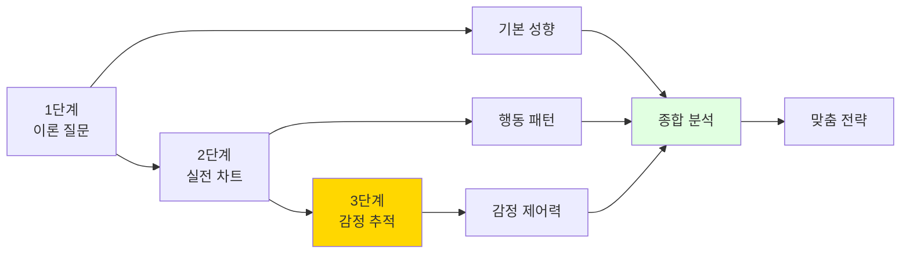
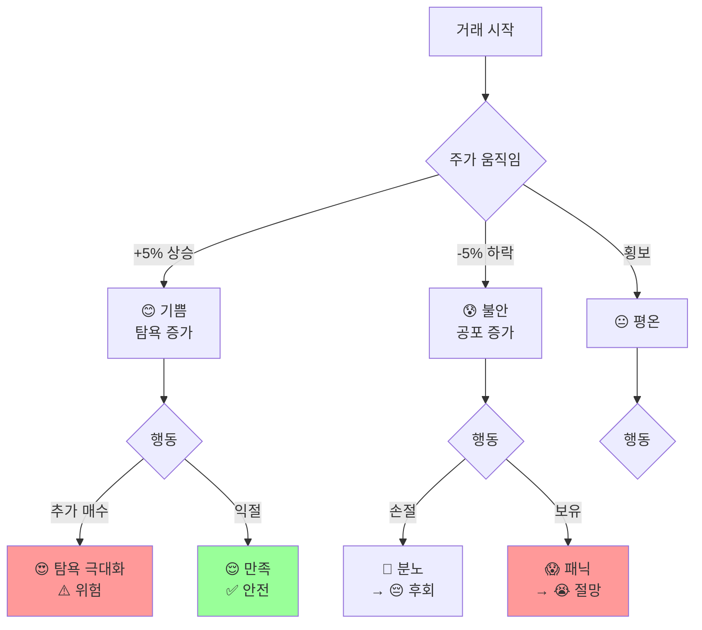

# 투자 심리 & 성향 분석 시스템
## "당신의 투자 감정을 분석합니다" 🧠💭📊

---

## 📋 문서 정보

**목적**: 실전 차트 기반 투자 성향 & 감정 패턴 분석  
**버전**: v1.0  
**최종 업데이트**: 2024.11.19

---

## 🎯 분석 시스템 개요

### 분석 3단계



---

## 📝 Part 1: 이론 기반 성향 분석 (5문항)

### Q1. 손실 대응 (리스크 회피도 측정)

```
┌─────────────────────────────────────────────────────┐
│ 🧠 투자 성향 분석 (1/5)                             │
├─────────────────────────────────────────────────────┤
│                                                     │
│ Q1. 보유 주식이 -10% 하락했습니다.                  │
│     어떻게 하시겠습니까?                             │
│                                                     │
│ ┌─────────────────────────────────────────────────┐ │
│ │ A) 즉시 손절한다                                │ │
│ │    → 리스크 회피형 (10점)                       │ │
│ └─────────────────────────────────────────────────┘ │
│                                                     │
│ ┌─────────────────────────────────────────────────┐ │
│ │ B) 추가 매수를 고려한다                         │ │
│ │    → 공격형 (30점)                              │ │
│ └─────────────────────────────────────────────────┘ │
│                                                     │
│ ┌─────────────────────────────────────────────────┐ │
│ │ C) 분석 후 결정한다 ⭐ 추천                     │ │
│ │    → 신중형 (20점)                              │ │
│ └─────────────────────────────────────────────────┘ │
│                                                     │
│ ┌─────────────────────────────────────────────────┐ │
│ │ D) 그냥 기다린다                                │ │
│ │    → 장기 투자형 (15점)                         │ │
│ └─────────────────────────────────────────────────┘ │
│                                                     │
└─────────────────────────────────────────────────────┘
```

### Q2. 투자 의사결정 방식

```
┌─────────────────────────────────────────────────────┐
│ 🧠 투자 성향 분석 (2/5)                             │
├─────────────────────────────────────────────────────┤
│                                                     │
│ Q2. 투자 결정을 내릴 때 가장 중요한 요소는?          │
│                                                     │
│ A) 빠른 직감 (감각형) - 분석력 10점                 │
│ B) 차트 패턴 분석 (기술적) - 분석력 30점 ⭐         │
│ C) 뉴스와 재무제표 (기본적) - 분석력 25점           │
│ D) 전문가 의견 (추종형) - 분석력 15점               │
│                                                     │
└─────────────────────────────────────────────────────┘
```

### Q3. 투자 기간 선호도

```
┌─────────────────────────────────────────────────────┐
│ 🧠 투자 성향 분석 (3/5)                             │
├─────────────────────────────────────────────────────┤
│                                                     │
│ Q3. 선호하는 투자 기간은?                            │
│                                                     │
│ A) 당일~1주 (단타형) - 거래빈도 30점                │
│ B) 1주~1개월 (스윙형) - 거래빈도 20점 ⭐           │
│ C) 1개월~3개월 (중기형) - 거래빈도 15점             │
│ D) 3개월 이상 (장기형) - 거래빈도 10점              │
│                                                     │
└─────────────────────────────────────────────────────┘
```

### Q4. 수익률 & 리스크 선호

```
┌─────────────────────────────────────────────────────┐
│ 🧠 투자 성향 분석 (4/5)                             │
├─────────────────────────────────────────────────────┤
│                                                     │
│ Q4. 예상 수익률과 리스크 선호는?                     │
│                                                     │
│ A) 연 5~10% / 낮은 리스크 - 리스크 10점             │
│ B) 연 10~30% / 중간 리스크 - 리스크 20점 ⭐        │
│ C) 연 30~100% / 높은 리스크 - 리스크 30점           │
│ D) 연 100%+ / 매우 높은 리스크 - 리스크 40점        │
│                                                     │
└─────────────────────────────────────────────────────┘
```

### Q5. 실패 대응 방식

```
┌─────────────────────────────────────────────────────┐
│ 🧠 투자 성향 분석 (5/5)                             │
├─────────────────────────────────────────────────────┤
│                                                     │
│ Q5. 투자 실패 시 어떻게 대응하나요?                  │
│                                                     │
│ A) 바로 분석해서 원인 찾기 - 학습력 30점 ⭐         │
│ B) 잠시 쉬었다가 다시 - 학습력 20점                 │
│ C) 전략을 완전히 바꾼다 - 학습력 15점               │
│ D) 더 신중하게 움직인다 - 학습력 25점               │
│                                                     │
└─────────────────────────────────────────────────────┘
```

---

## 📊 Part 2: 실전 차트 기반 행동 분석 (3문항)

### 차트 테스트 1: 급등주 포착

```
┌─────────────────────────────────────────────────────┐
│ 📊 실전 차트 테스트 (1/3)                            │
├─────────────────────────────────────────────────────┤
│                                                     │
│ 종목: 에코프로 (2차전지)                             │
│ 상황: 3일간 +25% 급등 후 현재 시점                   │
│                                                     │
│  📈 30일 차트:                                       │
│                                                     │
│       ┌─────────────────────────────────┐          │
│  200k │                              /\ │ ← 현재   │
│       │                             /  \│          │
│  180k │                            /    │          │
│       │                          /      │          │
│  160k │              /\         /       │          │
│       │             /  \       /        │          │
│  140k │            /    \     /         │          │
│       │    -------      -----           │          │
│  120k │                                 │          │
│       └─────────────────────────────────┘          │
│                                                     │
│  현재가: 195,000원 (+28% 3일간)                     │
│  거래량: +380% (폭발적!)                            │
│  뉴스: "정부 2차전지 지원 발표"                      │
│                                                     │
│  ━━━━━━━━━━━━━━━━━━━━━━━━━━━━━━━━━━━━━━━━━━━━  │
│                                                     │
│  💭 당신의 선택:                                     │
│                                                     │
│  A) 지금 즉시 매수! (FOMO - 기회 놓칠까봐)          │
│     → 감정: 욕심 80%, 두려움 20%                    │
│     → 행동 패턴: 충동형                             │
│                                                     │
│  B) 조정 올 때까지 대기 (신중함)                    │
│     → 감정: 이성 70%, 욕심 30%                      │
│     → 행동 패턴: 신중형 ⭐                          │
│                                                     │
│  C) 절반만 매수 (절충안)                            │
│     → 감정: 균형 50%, 불안 50%                      │
│     → 행동 패턴: 균형형                             │
│                                                     │
│  D) 매수 안 함 (기회 포기)                          │
│     → 감정: 두려움 80%, 안도 20%                    │
│     → 행동 패턴: 보수형                             │
│                                                     │
└─────────────────────────────────────────────────────┘
```

**정답 분석**:

| 선택 | 결과 (5일 후) | 감정 패턴 | 투자자 유형 |
|------|-------------|----------|-----------|
| A | -15% (고점 매수) | 🔥 욕심 → 😰 후회 | 충동형 (위험) |
| B | +8% (조정 후 매수) | 😌 인내 → 😊 만족 | 이상형 (최적) ⭐ |
| C | +2% (평단가 높음) | 😐 애매 → 😕 아쉬움 | 우유부단형 |
| D | 0% (기회 상실) | 😔 불안 → 😢 후회 | 과도한 보수형 |

---

### 차트 테스트 2: 하락장 대응

```
┌─────────────────────────────────────────────────────┐
│ 📊 실전 차트 테스트 (2/3)                            │
├─────────────────────────────────────────────────────┤
│                                                     │
│ 종목: 삼성바이오 (바이오)                            │
│ 상황: 당신이 850,000원에 매수 후 현재 -8% 손실       │
│                                                     │
│  📈 보유 후 차트:                                    │
│                                                     │
│       ┌─────────────────────────────────┐          │
│  850k │  ● 매수                         │          │
│       │   \                             │          │
│  820k │    \                            │          │
│       │     \     /\                    │          │
│  790k │      \   /  \                   │          │
│       │       \ /    \    ← 현재        │          │
│  760k │        ×      \                 │          │
│       │               \/                │          │
│  730k │                                 │          │
│       └─────────────────────────────────┘          │
│                                                     │
│  현재가: 782,000원 (-8%)                            │
│  평가 손실: -680,000원 (10주 보유)                  │
│  거래량: 평균 수준                                   │
│                                                     │
│  ━━━━━━━━━━━━━━━━━━━━━━━━━━━━━━━━━━━━━━━━━━━━  │
│                                                     │
│  💭 당신의 감정과 선택:                              │
│                                                     │
│  A) 즉시 손절! (더 떨어질까봐)                      │
│     → 감정: 😰 공포 90%, 😤 분노 10%                │
│     → 심리: 손실 회피 극대화                        │
│     → 결과: -8% 확정                                │
│                                                     │
│  B) 물타기 (평단가 낮추기)                          │
│     → 감정: 😠 억울함 60%, 🤔 계산 40%              │
│     → 심리: 손실 부정                               │
│     → 위험: 추가 하락 시 손실 증가                  │
│                                                     │
│  C) 기다리며 분석 (지지선 확인)                     │
│     → 감정: 😌 침착 70%, 😟 불안 30%                │
│     → 심리: 이성적 판단 ⭐                          │
│     → 전략: 750,000원 이탈 시 손절                  │
│                                                     │
│  D) 그냥 기다림 (아무 행동 안 함)                   │
│     → 감정: 😶 무기력 60%, 🙏 희망 40%              │
│     → 심리: 현실 도피                               │
│     → 위험: 손실 확대 가능                          │
│                                                     │
└─────────────────────────────────────────────────────┘
```

**정답 분석**:

| 선택 | 결과 (7일 후) | 감정 변화 | 학습 포인트 |
|------|-------------|----------|-----------|
| A | -8% 확정 | 😰→😔→😤 (후회) | 조급한 손절 (실패) |
| B | -15% (추가 하락) | 😠→😱→😭 (패닉) | 무계획 물타기 (위험) |
| C | -5% or +3% | 😌→🤔→😊 (만족) | 계획적 대응 (성공) ⭐ |
| D | -18% (대폭 하락) | 😶→😱→😭 (절망) | 방치의 위험 (실패) |

---

### 차트 테스트 3: B파 함정 회피

```
┌─────────────────────────────────────────────────────┐
│ 📊 실전 차트 테스트 (3/3) - 난이도 ⭐⭐⭐⭐⭐       │
├─────────────────────────────────────────────────────┤
│                                                     │
│ 종목: 셀트리온 (바이오)                              │
│ 상황: 하락 후 반등 시작, B파 의심 구간               │
│                                                     │
│  📈 30일 차트:                                       │
│                                                     │
│       ┌─────────────────────────────────┐          │
│  220k │                                 │          │
│       │                                 │          │
│  200k │        A파                      │          │
│       │         \                       │          │
│  180k │          \                      │          │
│       │           \     B파?            │          │
│  160k │            \    /\  ← 현재      │          │
│       │             \  /  \             │          │
│  140k │              \/    \            │          │
│       │                     \           │          │
│  120k │                      \          │          │
│       └─────────────────────────────────┘          │
│                                                     │
│  현재가: 168,000원 (+5% 2일간)                      │
│  거래량: -20% (약함!)  ⚠️ 경고 신호                │
│  패턴: B파 반등 의심 (함정 가능성 80%)              │
│                                                     │
│  🤖 AI 경고:                                        │
│  "거래량이 부족합니다. B파 함정 가능성 높음.         │
│   C파 하락이 올 수 있습니다. 진입 주의!"            │
│                                                     │
│  ━━━━━━━━━━━━━━━━━━━━━━━━━━━━━━━━━━━━━━━━━━━━  │
│                                                     │
│  💭 당신의 감정과 선택:                              │
│                                                     │
│  A) 매수! (반등 기회다!)                            │
│     → 감정: 😍 탐욕 80% (AI 무시)                   │
│     → 심리: 확증 편향                               │
│     → 결과: -12% (C파 하락) ❌                      │
│                                                     │
│  B) 저항선 돌파 확인 후 매수                        │
│     → 감정: 🤔 신중 60%, 😟 불안 40%                │
│     → 심리: 이성 + 약간 욕심                        │
│     → 결과: 돌파 안 됨, 진입 안 함 ✅               │
│                                                     │
│  C) 진입 안 함 (AI 경고 신뢰)                       │
│     → 감정: 😌 이성 90%, 😔 아쉬움 10%              │
│     → 심리: 함정 회피 능력 우수 ⭐                  │
│     → 결과: 0% (손실 없음) ✅                       │
│                                                     │
│  D) 소량만 매수 (테스트)                            │
│     → 감정: 😐 반신반의 50%                         │
│     → 심리: 우유부단                                │
│     → 결과: -12% (소액 손실)                        │
│                                                     │
└─────────────────────────────────────────────────────┘
```

**정답 분석**:

| 선택 | 결과 | 감정 제어력 | 평가 |
|------|------|-----------|------|
| A | -12% | ❌ 탐욕 제어 실패 | F (함정 빠짐) |
| B | 0% (진입 안 함) | ⭐⭐⭐ 양호 | B (신중함) |
| C | 0% (진입 안 함) | ⭐⭐⭐⭐⭐ 우수 | A+ (완벽) ⭐ |
| D | -12% (소액) | ⭐⭐ 보통 | C (우유부단) |

---

## 🧠 Part 3: 감정 패턴 추적 시스템

### 3.1 투자 감정 지도

```
투자 감정 순환 모델:

           😊 희망/기대
               ↑
               |
    😌 평온 ← 중립 → 😍 탐욕
               |
               ↓
           😰 두려움/공포
               ↑
               |
    😔 후회 ← 😤 분노
```

### 3.2 실시간 감정 추적



### 3.3 주간 감정 추적 리포트

```
┌─────────────────────────────────────────────────────┐
│ 📊 Week 1 감정 패턴 분석                             │
├─────────────────────────────────────────────────────┤
│                                                     │
│ 😊 긍정 감정: ██████████░░░░░░░░░░ 50%             │
│ 😰 부정 감정: ████████░░░░░░░░░░░░ 40%             │
│ 😐 중립 감정: ██░░░░░░░░░░░░░░░░░░ 10%             │
│                                                     │
│ ━━━━━━━━━━━━━━━━━━━━━━━━━━━━━━━━━━━━━━━━━━━━  │
│                                                     │
│ 감정별 거래 결과:                                    │
│                                                     │
│ 😊 기쁨/희망 상태 거래:                              │
│ • 횟수: 8회                                          │
│ • 승률: 62.5% (5승 3패)                             │
│ • 평가: 보통 (욕심 주의)                            │
│                                                     │
│ 😰 두려움/불안 상태 거래:                            │
│ • 횟수: 6회                                          │
│ • 승률: 33.3% (2승 4패)                             │
│ • 평가: 나쁨 (공포 매도) ⚠️                         │
│                                                     │
│ 😌 평온/이성 상태 거래:                              │
│ • 횟수: 3회                                          │
│ • 승률: 100% (3승 0패)                              │
│ • 평가: 최고! 이 상태 유지 ⭐                       │
│                                                     │
│ ━━━━━━━━━━━━━━━━━━━━━━━━━━━━━━━━━━━━━━━━━━━━  │
│                                                     │
│ 💡 감정 제어 점수: 65/100점                         │
│                                                     │
│ 강점:                                                │
│ ✅ 이성적 상태에서 완벽한 판단                       │
│                                                     │
│ 약점:                                                │
│ ⚠️ 불안할 때 충동적 손절                            │
│ ⚠️ 기쁠 때 과도한 탐욕                              │
│                                                     │
│ 개선 방법:                                           │
│ 1. 거래 전 감정 체크 (1~10점)                       │
│ 2. 감정 점수 7점 이상일 때만 거래                   │
│ 3. 불안/탐욕 느껴지면 타임 프리즈 사용              │
│                                                     │
└─────────────────────────────────────────────────────┘
```

---

## 📊 Part 4: 종합 분석 결과

### 4.1 투자 성향 판정

```
┌─────────────────────────────────────────────────────┐
│ 🎯 종합 분석 결과                                    │
├─────────────────────────────────────────────────────┤
│                                                     │
│ 이론 점수 (5문항): 125/150점                         │
│ 실전 점수 (차트 3개): 180/240점                      │
│ 감정 제어력: 65/100점                                │
│                                                     │
│ ━━━━━━━━━━━━━━━━━━━━━━━━━━━━━━━━━━━━━━━━━━━━  │
│                                                     │
│ 당신의 투자 유형: "신중한 기술적 분석가" 📊          │
│ 부유형: 감정 제어 훈련 필요 ⚠️                      │
│                                                     │
│ ━━━━━━━━━━━━━━━━━━━━━━━━━━━━━━━━━━━━━━━━━━━━  │
│                                                     │
│ 📈 세부 성향:                                        │
│                                                     │
│ • 리스크 감수: ████████░░ 40%                       │
│ • 분석 선호도: ████████████████░░ 85%               │
│ • 거래 빈도: ███████░░░ 35%                         │
│ • 감정 통제: ████████████░░ 65% ⚠️                 │
│ • 학습 의지: ████████████████████ 95%               │
│                                                     │
│ ━━━━━━━━━━━━━━━━━━━━━━━━━━━━━━━━━━━━━━━━━━━━  │
│                                                     │
│ 💡 행동 패턴 분석:                                   │
│                                                     │
│ ✅ 강점:                                             │
│ • 차트 분석 능력 우수 (85%)                         │
│ • 함정 패턴 인식 가능                               │
│ • 이성적 상태에서 완벽한 판단                       │
│                                                     │
│ ⚠️ 약점:                                             │
│ • 감정 기복이 거래에 영향                           │
│ • 불안 시 조급한 손절                               │
│ • 탐욕 시 고점 매수                                 │
│                                                     │
│ ━━━━━━━━━━━━━━━━━━━━━━━━━━━━━━━━━━━━━━━━━━━━  │
│                                                     │
│ 🎯 맞춤 추천 전략:                                   │
│                                                     │
│ ✅ 추천 종목:                                        │
│ • 안정형 50% (감정 안정)                            │
│ • 변동형 40% (적당한 도전)                          │
│ • 고변동형 10% (소량 경험)                          │
│                                                     │
│ ✅ 추천 거래 루틴:                                   │
│ 1. 거래 전 감정 체크 (필수!)                        │
│ 2. 감정 점수 7점 이상만 거래                        │
│ 3. 타임 프리즈 적극 활용                            │
│ 4. 손절/익절 라인 사전 설정                         │
│                                                     │
│ ⚠️ 주의할 패턴:                                     │
│ • B파 반등 (거래량 확인!)                           │
│ • 급등주 (FOMO 조심!)                               │
│ • 연속 손실 시 (감정 회복 먼저)                    │
│                                                     │
│ ━━━━━━━━━━━━━━━━━━━━━━━━━━━━━━━━━━━━━━━━━━━━  │
│                                                     │
│ 🤖 AI 멘토 추천:                                    │
│                                                     │
│ 주 멘토: 🛡️ 김철수 (안정형)                         │
│ "당신처럼 분석을 잘하는 사람은                       │
│  감정만 제어하면 최고의 투자자가 됩니다.             │
│  저와 함께 침착함을 연습하세요!"                     │
│                                                     │
│ 부 멘토: ⚡ 박영희 (도전용)                          │
│ "가끔 저의 공격적 전략도 참고하되,                   │
│  당신의 신중함을 잃지 마세요!"                       │
│                                                     │
└─────────────────────────────────────────────────────┘
```

---

## 🎯 Part 5: 감정 제어 훈련 시스템

### 5.1 감정 체크 시스템

```
┌─────────────────────────────────────────────────────┐
│ 💭 거래 전 감정 체크                                 │
├─────────────────────────────────────────────────────┤
│                                                     │
│ 지금 이 종목을 매수/매도하려는 이유는?               │
│                                                     │
│ ━━━━━━━━━━━━━━━━━━━━━━━━━━━━━━━━━━━━━━━━━━━━  │
│                                                     │
│ 감정 상태 체크:                                      │
│                                                     │
│ 😊 기쁨/희망: [────●──] 7/10                       │
│ 😍 탐욕: [──────●] 8/10  ⚠️ 높음!                 │
│ 😰 두려움: [──●────] 3/10                          │
│ 😤 분노: [●───────] 1/10                           │
│                                                     │
│ ━━━━━━━━━━━━━━━━━━━━━━━━━━━━━━━━━━━━━━━━━━━━  │
│                                                     │
│ ⚠️ 경고: 탐욕 지수가 높습니다!                       │
│                                                     │
│ 질문:                                                │
│ 1. 이 거래가 계획에 있었나요? [예/아니오]           │
│ 2. 손절가를 정했나요? [예/아니오]                   │
│ 3. 냉정하게 판단한 건가요? [예/아니오]              │
│                                                     │
│ 💡 추천:                                             │
│ 탐욕 지수가 8점입니다.                               │
│ 10분 후 다시 판단하는 것을 추천합니다.              │
│                                                     │
│ [거래 진행] [10분 후 알림] [취소]                   │
│                                                     │
└─────────────────────────────────────────────────────┘
```

### 5.2 감정 일기 시스템

```
┌─────────────────────────────────────────────────────┐
│ 📔 투자 감정 일기 - Day 3                            │
├─────────────────────────────────────────────────────┤
│                                                     │
│ 오늘의 거래:                                         │
│ • 종목: 카카오                                       │
│ • 행동: 72,000원 매수                                │
│ • 결과: -2.1% (조정)                                │
│                                                     │
│ ━━━━━━━━━━━━━━━━━━━━━━━━━━━━━━━━━━━━━━━━━━━━  │
│                                                     │
│ 거래 전 감정 (11:00):                                │
│ 😊 기쁨: 8/10 - "거래량 폭발! 기회다!"              │
│ 😍 탐욕: 7/10 - "빨리 들어가야 해"                  │
│ 😰 두려움: 2/10 - "놓칠까봐 걱정"                   │
│                                                     │
│ 거래 중 감정 (11:05):                                │
│ 😊 기대: 9/10 - "좋은 선택한 것 같아!"              │
│ 😌 만족: 8/10 - "매수 완료!"                        │
│                                                     │
│ 거래 후 감정 (15:30):                                │
│ 😰 불안: 7/10 - "왜 떨어지지...?"                   │
│ 😔 후회: 5/10 - "조금 기다릴 걸..."                 │
│ 😤 짜증: 3/10 - "AI 말 들을 걸"                     │
│                                                     │
│ ━━━━━━━━━━━━━━━━━━━━━━━━━━━━━━━━━━━━━━━━━━━━  │
│                                                     │
│ 💡 자기 분석:                                        │
│                                                     │
│ 실수한 점:                                           │
│ • 탐욕이 너무 높았음 (7/10)                         │
│ • 조정 가능성 무시                                   │
│ • FOMO에 휘둘림                                     │
│                                                     │
│ 배운 점:                                             │
│ • 감정 체크를 무시했음                              │
│ • 다음엔 탐욕 7점 이상이면 대기                     │
│ • 타임 프리즈를 사용할 걸                           │
│                                                     │
│ 다음 거래 다짐:                                      │
│ "감정 점수 7점 이상이면 10분 대기!"                 │
│                                                     │
└─────────────────────────────────────────────────────┘
```

### 5.3 주간 감정 개선 리포트

```
┌─────────────────────────────────────────────────────┐
│ 📊 감정 제어력 변화 추이                             │
├─────────────────────────────────────────────────────┤
│                                                     │
│ Week 1 → Week 4 변화:                               │
│                                                     │
│ 감정 제어 점수:                                      │
│ Week 1: 65/100 ██████░░░░                          │
│ Week 2: 72/100 ███████░░░                          │
│ Week 3: 80/100 ████████░░                          │
│ Week 4: 88/100 █████████░ 🎉                       │
│                                                     │
│ ━━━━━━━━━━━━━━━━━━━━━━━━━━━━━━━━━━━━━━━━━━━━  │
│                                                     │
│ 감정별 개선도:                                       │
│                                                     │
│ 😍 탐욕 제어:                                        │
│ Week 1: 5/10 (실패 多) → Week 4: 8/10 (성공!) ✅   │
│ 개선: +60%                                           │
│                                                     │
│ 😰 두려움 극복:                                      │
│ Week 1: 4/10 (패닉 多) → Week 4: 7/10 (침착) ✅    │
│ 개선: +75%                                           │
│                                                     │
│ 😤 분노 관리:                                        │
│ Week 1: 6/10 (충동 多) → Week 4: 9/10 (이성) ✅    │
│ 개선: +50%                                           │
│                                                     │
│ ━━━━━━━━━━━━━━━━━━━━━━━━━━━━━━━━━━━━━━━━━━━━  │
│                                                     │
│ 💡 성과:                                             │
│                                                     │
│ • 감정 거래 실패: 8회 → 2회 (-75%)                  │
│ • 이성적 거래 성공: 3회 → 12회 (+300%)              │
│ • 평균 수익률: +3.2% → +8.5% (+166%)               │
│                                                     │
│ 🏆 결론:                                             │
│ 감정 제어가 수익률에 직결됨을 증명!                  │
│                                                     │
└─────────────────────────────────────────────────────┘
```

---

## 📚 Part 6: 유형별 맞춤 전략

### 6.1 감정 취약 유형별 처방

```
┌─────────────────────────────────────────────────────┐
│ 🎯 감정 유형별 맞춤 전략                             │
├─────────────────────────────────────────────────────┤
│                                                     │
│ 유형 1: 탐욕형 (😍 FOMO 강함)                       │
│                                                     │
│ 증상:                                                │
│ • 급등주 보면 참지 못함                             │
│ • 고점 매수 자주 함                                 │
│ • "놓칠까봐" 불안                                   │
│                                                     │
│ 처방:                                                │
│ ✅ 급등 종목 24시간 대기 규칙                        │
│ ✅ 매수 전 감정 체크 필수                            │
│ ✅ 안정형 종목 비중 60% 이상                        │
│ ✅ 타임 프리즈 의무 사용                            │
│                                                     │
│ 추천 AI 멘토: 🛡️ 김철수                            │
│                                                     │
│ ━━━━━━━━━━━━━━━━━━━━━━━━━━━━━━━━━━━━━━━━━━━━  │
│                                                     │
│ 유형 2: 공포형 (😰 손실 두려움)                     │
│                                                     │
│ 증상:                                                │
│ • 조금만 떨어져도 패닉                              │
│ • 손절을 너무 빨리 함                               │
│ • 수익도 빨리 확정                                  │
│                                                     │
│ 처방:                                                │
│ ✅ 손절가 -5% 고정 (더 빠르면 안 됨)                │
│ ✅ 익절가 +10% 고정 (인내심!)                       │
│ ✅ 조정은 정상임을 체화                             │
│ ✅ 안정형 종목부터 연습                             │
│                                                     │
│ 추천 AI 멘토: 🛡️ 김철수                            │
│                                                     │
│ ━━━━━━━━━━━━━━━━━━━━━━━━━━━━━━━━━━━━━━━━━━━━  │
│                                                     │
│ 유형 3: 분노형 (😤 손실 시 보복)                    │
│                                                     │
│ 증상:                                                │
│ • 손실 나면 바로 만회 시도                          │
│ • 무리한 물타기                                     │
│ • 더 큰 손실로 이어짐                               │
│                                                     │
│ 처방:                                                │
│ ✅ 손실 후 24시간 거래 금지                         │
│ ✅ 감정 일기 의무 작성                              │
│ ✅ 복수 거래 절대 금지                              │
│ ✅ 연속 손실 3회 시 1주 휴식                        │
│                                                     │
│ 추천 AI 멘토: 🛡️ 김철수 + 상담                     │
│                                                     │
│ ━━━━━━━━━━━━━━━━━━━━━━━━━━━━━━━━━━━━━━━━━━━━  │
│                                                     │
│ 유형 4: 우유부단형 (😐 결정 못 함)                  │
│                                                     │
│ 증상:                                                │
│ • 매수/매도 타이밍 놓침                             │
│ • 계획만 세우고 실행 안 함                          │
│ • 기회를 자주 놓침                                  │
│                                                     │
│ 처방:                                                │
│ ✅ 조건 주문 적극 활용                              │
│ ✅ 3초 안에 결정 규칙                               │
│ ✅ 소액으로 실행력 키우기                           │
│ ✅ AI 멘토 따라하기 모드                            │
│                                                     │
│ 추천 AI 멘토: ⚡ 박영희 (실행력)                    │
│                                                     │
└─────────────────────────────────────────────────────┘
```

---

## 🎊 결론

### 핵심 메시지

```
투자 성공 = 기술 40% + 감정 제어 60%

📊 차트 분석을 잘해도
😰 감정 제어 못 하면 실패

😌 감정 제어만 되면
📈 수익은 자연스럽게 따라옴
```

### 감정 제어 3원칙

```
1️⃣ 거래 전 감정 체크 (필수!)
   → 7점 이상일 때만 거래

2️⃣ 계획된 거래만 실행
   → 충동 거래 절대 금지

3️⃣ 감정 일기 작성
   → 패턴 인식 & 개선
```

### 최종 목표

```
Week 1:  감정 제어 65점 😐
Week 4:  감정 제어 88점 😊
Week 12: 감정 제어 95점 🏆

→ 실전 투자 준비 완료!
```

---

**문서 버전**: v1.0  
**최종 업데이트**: 2024.11.19  
**상태**: 투자 심리 분석 시스템 완성 ✅

