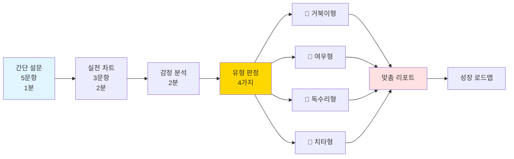

# 투자자 성격 테스트 & 맞춤 전략
## "당신은 어떤 타입의 투자자인가요?" 🎮🧠💰

---

## 📋 문서 정보

**목적**: 재미있고 정확한 투자 성격 분석  
**소요 시간**: 5분  
**유형**: 4가지 동물 캐릭터  
**버전**: v2.0 (재미 강화)

---

## 🎯 테스트 구조



---

## 📝 Part 1: 간단 설문 (5문항)

### 핵심 측정 요소 5가지

```
1️⃣ 리스크 감수도 (Risk)
2️⃣ 감정 제어력 (Emotion)
3️⃣ 분석 선호도 (Analysis)
4️⃣ 의사결정 속도 (Speed)
5️⃣ 학습 의지 (Learning)
```

---

### Q1: 리스크 감수도 측정

```
┌─────────────────────────────────────────────────────┐
│ 🎮 투자자 유형 테스트 (1/5)                          │
├─────────────────────────────────────────────────────┤
│                                                     │
│ Q1. 1,000만원이 생겼다! 어떻게 투자하시겠습니까?     │
│                                                     │
│ ┌─────────────────────────────────────────────────┐ │
│ │ A) 🏦 예금 (연 3%) - 안전제일!                  │ │
│ │    "확실한 30만원이 좋아"                       │ │
│ │    → 리스크: ⭐ (10점)                          │ │
│ └─────────────────────────────────────────────────┘ │
│                                                     │
│ ┌─────────────────────────────────────────────────┐ │
│ │ B) 📊 안정형 주식 (연 10~15%)                   │ │
│ │    "적당한 수익이 딱 좋아" ⭐ 추천               │ │
│ │    → 리스크: ⭐⭐ (20점)                        │ │
│ └─────────────────────────────────────────────────┘ │
│                                                     │
│ ┌─────────────────────────────────────────────────┐ │
│ │ C) 🚀 성장주 (연 30~50%)                        │ │
│ │    "좀 더 벌고 싶어!"                           │ │
│ │    → 리스크: ⭐⭐⭐ (30점)                      │ │
│ └─────────────────────────────────────────────────┘ │
│                                                     │
│ ┌─────────────────────────────────────────────────┐ │
│ │ D) 💎 코인/선물 (연 100%+)                      │ │
│ │    "한 방이면 된다!"                            │ │
│ │    → 리스크: ⭐⭐⭐⭐⭐ (50점)                  │ │
│ └─────────────────────────────────────────────────┘ │
│                                                     │
└─────────────────────────────────────────────────────┘
```

---

### Q2: 감정 제어력 측정

```
┌─────────────────────────────────────────────────────┐
│ 🎮 투자자 유형 테스트 (2/5)                          │
├─────────────────────────────────────────────────────┤
│                                                     │
│ Q2. 보유 주식이 -20% 폭락! 😱                       │
│     당신의 첫 반응은?                                │
│                                                     │
│ ┌─────────────────────────────────────────────────┐ │
│ │ A) 😰 "아악! 즉시 손절!"                        │ │
│ │    패닉 버튼 누름                               │ │
│ │    → 감정 제어: ⭐ (10점)                       │ │
│ └─────────────────────────────────────────────────┘ │
│                                                     │
│ ┌─────────────────────────────────────────────────┐ │
│ │ B) 🤔 "왜 떨어졌지? 분석해보자"                 │ │
│ │    침착하게 원인 파악 ⭐ 추천                   │ │
│ │    → 감정 제어: ⭐⭐⭐⭐ (40점)                 │ │
│ └─────────────────────────────────────────────────┘ │
│                                                     │
│ ┌─────────────────────────────────────────────────┐ │
│ │ C) 😠 "억울해! 물타기다!"                       │ │
│ │    감정적 추가 매수                             │ │
│ │    → 감정 제어: ⭐⭐ (20점)                     │ │
│ └─────────────────────────────────────────────────┘ │
│                                                     │
│ ┌─────────────────────────────────────────────────┐ │
│ │ D) 😌 "계획대로. 손절가 확인"                   │ │
│ │    미리 정한 규칙 따름                          │ │
│ │    → 감정 제어: ⭐⭐⭐⭐⭐ (50점)               │ │
│ └─────────────────────────────────────────────────┘ │
│                                                     │
└─────────────────────────────────────────────────────┘
```

---

### Q3: 분석 선호도 측정

```
┌─────────────────────────────────────────────────────┐
│ 🎮 투자자 유형 테스트 (3/5)                          │
├─────────────────────────────────────────────────────┤
│                                                     │
│ Q3. 새로운 종목 발견! 어떻게 조사하나요?             │
│                                                     │
│ ┌─────────────────────────────────────────────────┐ │
│ │ A) 💭 "그냥 느낌이 좋은데?"                     │ │
│ │    직감으로 결정                                │ │
│ │    → 분석력: ⭐ (10점)                          │ │
│ └─────────────────────────────────────────────────┘ │
│                                                     │
│ ┌─────────────────────────────────────────────────┐ │
│ │ B) 📰 "유튜브, 뉴스 찾아보자"                   │ │
│ │    간단히 정보 수집                             │ │
│ │    → 분석력: ⭐⭐ (20점)                        │ │
│ └─────────────────────────────────────────────────┘ │
│                                                     │
│ ┌─────────────────────────────────────────────────┐ │
│ │ C) 📊 "차트 패턴부터 확인!"                     │ │
│ │    기술적 분석 30분 ⭐ 추천                     │ │
│ │    → 분석력: ⭐⭐⭐⭐ (40점)                    │ │
│ └─────────────────────────────────────────────────┘ │
│                                                     │
│ ┌─────────────────────────────────────────────────┐ │
│ │ D) 📚 "재무제표 + 차트 + 뉴스 올인"             │ │
│ │    완벽 분석 2시간                              │ │
│ │    → 분석력: ⭐⭐⭐⭐⭐ (50점)                  │ │
│ └─────────────────────────────────────────────────┘ │
│                                                     │
└─────────────────────────────────────────────────────┘
```

---

### Q4: 의사결정 속도 측정

```
┌─────────────────────────────────────────────────────┐
│ 🎮 투자자 유형 테스트 (4/5)                          │
├─────────────────────────────────────────────────────┤
│                                                     │
│ Q4. 좋은 기회 포착! 얼마나 빨리 결정하나요?          │
│                                                     │
│ ┌─────────────────────────────────────────────────┐ │
│ │ A) ⚡ "지금 바로!" (3초 안에)                    │ │
│ │    번개같은 매수                                │ │
│ │    → 속도: ⭐⭐⭐⭐⭐ (50점)                    │ │
│ └─────────────────────────────────────────────────┘ │
│                                                     │
│ ┌─────────────────────────────────────────────────┐ │
│ │ B) 🏃 "5분만 확인하고" (5분)                    │ │
│ │    빠른 확인 후 결정 ⭐ 추천                    │ │
│ │    → 속도: ⭐⭐⭐⭐ (40점)                      │ │
│ └─────────────────────────────────────────────────┘ │
│                                                     │
│ ┌─────────────────────────────────────────────────┐ │
│ │ C) 🚶 "하루 생각해볼게" (24시간)                │ │
│ │    신중하게 고민                                │ │
│ │    → 속도: ⭐⭐ (20점)                          │ │
│ └─────────────────────────────────────────────────┘ │
│                                                     │
│ ┌─────────────────────────────────────────────────┐ │
│ │ D) 🐌 "일주일 지켜보자" (1주)                   │ │
│ │    완벽한 확신까지                              │ │
│ │    → 속도: ⭐ (10점)                            │ │
│ └─────────────────────────────────────────────────┘ │
│                                                     │
└─────────────────────────────────────────────────────┘
```

---

### Q5: 학습 의지 측정

```
┌─────────────────────────────────────────────────────┐
│ 🎮 투자자 유형 테스트 (5/5)                          │
├─────────────────────────────────────────────────────┤
│                                                     │
│ Q5. 투자 실패 후 어떻게 하시나요?                    │
│                                                     │
│ ┌─────────────────────────────────────────────────┐ │
│ │ A) 😢 "투자는 나랑 안 맞나봐..."                │ │
│ │    포기 모드                                    │ │
│ │    → 학습: ⭐ (10점)                            │ │
│ └─────────────────────────────────────────────────┘ │
│                                                     │
│ ┌─────────────────────────────────────────────────┐ │
│ │ B) 😐 "그냥 운이 나빴어"                        │ │
│ │    다음 기회 대기                               │ │
│ │    → 학습: ⭐⭐ (20점)                          │ │
│ └─────────────────────────────────────────────────┘ │
│                                                     │
│ ┌─────────────────────────────────────────────────┐ │
│ │ C) 🤔 "뭐가 잘못됐을까? 분석!"                  │ │
│ │    원인 파악 & 개선 ⭐ 추천                     │ │
│ │    → 학습: ⭐⭐⭐⭐ (40점)                      │ │
│ └─────────────────────────────────────────────────┘ │
│                                                     │
│ ┌─────────────────────────────────────────────────┐ │
│ │ D) 📚 "책 사서 공부한다!"                       │ │
│ │    체계적 학습                                  │ │
│    → 학습: ⭐⭐⭐⭐⭐ (50점)                     │ │
│ └─────────────────────────────────────────────────┘ │
│                                                     │
└─────────────────────────────────────────────────────┘
```

---

## 📊 Part 2: 실전 차트 테스트 (3문항)

### 차트 1: 급등주 대응

```
┌─────────────────────────────────────────────────────┐
│ 📊 실전 차트 테스트 (1/3)                            │
├─────────────────────────────────────────────────────┤
│                                                     │
│ 🎢 에코프로 3일간 +35% 급등!                         │
│                                                     │
│     ┌─────────────────────────────┐                │
│ 220k│                        🚀   │ ← 지금         │
│     │                       /│\   │                │
│ 200k│                      / │ \  │                │
│     │                     /  │  \ │                │
│ 180k│           /\       /   │   \│                │
│     │          /  \     /    │    │                │
│ 160k│    -----    -----      │    │                │
│     └─────────────────────────────┘                │
│                                                     │
│ 현재가: 218,000원 (+35% 🔥)                         │
│ 거래량: +420% (폭발!)                               │
│ 뉴스: "2차전지 혁신 기술 개발"                       │
│                                                     │
│ ━━━━━━━━━━━━━━━━━━━━━━━━━━━━━━━━━━━━━━━━━━━━  │
│                                                     │
│ 💭 당신의 선택:                                      │
│                                                     │
│ A) 😍 "지금이라도! 올인!"                           │
│    → FOMO 점수: +30 (고점 매수 위험)                │
│                                                     │
│ B) 🤔 "30% 정도만 조심스럽게"                       │
│    → 균형 점수: +20 (적절한 대응) ⭐                │
│                                                     │
│ C) 😌 "조정 올 때까지 대기"                         │
│    → 신중 점수: +10 (기회 일부 포기)                │
│                                                     │
│ D) 😨 "너무 위험해! 안 사!"                         │
│    → 보수 점수: +5 (과도한 회피)                    │
│                                                     │
└─────────────────────────────────────────────────────┘
```

---

### 차트 2: 손실 상황 대응

```
┌─────────────────────────────────────────────────────┐
│ 📊 실전 차트 테스트 (2/3)                            │
├─────────────────────────────────────────────────────┤
│                                                     │
│ 😰 내가 850,000원에 산 삼성바이오...                 │
│                                                     │
│     ┌─────────────────────────────┐                │
│ 850k│  ●💰 내 매수가               │                │
│     │   \                          │                │
│ 820k│    \      /\                 │                │
│     │     \    /  \                │                │
│ 790k│      \  /    \     ⚠️        │                │
│     │       \/      \   /│\        │                │
│ 760k│                \ / │ \       │ ← 지금 (-10%)  │
│     │                 ×  │  \      │                │
│ 730k│                    │   \     │                │
│     └─────────────────────────────┘                │
│                                                     │
│ 현재가: 765,000원 (-10% 💸)                         │
│ 평가 손실: -850,000원                               │
│ 뉴스: 특별한 악재 없음                              │
│                                                     │
│ ━━━━━━━━━━━━━━━━━━━━━━━━━━━━━━━━━━━━━━━━━━━━  │
│                                                     │
│ 💭 당신의 반응:                                      │
│                                                     │
│ A) 😱 "더 떨어지기 전에 손절!"                      │
│    → 패닉 점수: +30 (감정적)                        │
│                                                     │
│ B) 😤 "억울해! 물타기로 평단 낮춘다!"               │
│    → 복수 점수: +35 (위험한 선택)                   │
│                                                     │
│ C) 🤔 "지지선 확인. 750,000원 이탈 시 손절"         │
│    → 이성 점수: +10 (계획적 대응) ⭐                │
│                                                     │
│ D) 😌 "장기 투자니까 그냥 기다려"                   │
│    → 방치 점수: +25 (무계획)                        │
│                                                     │
└─────────────────────────────────────────────────────┘
```

---

### 차트 3: B파 함정 회피

```
┌─────────────────────────────────────────────────────┐
│ 📊 실전 차트 테스트 (3/3) - 함정 난이도 ⭐⭐⭐⭐⭐ │
├─────────────────────────────────────────────────────┤
│                                                     │
│ 🎭 셀트리온: 하락 후 반등! 그런데...?                │
│                                                     │
│     ┌─────────────────────────────┐                │
│ 220k│                              │                │
│     │        A파                   │                │
│ 200k│         \                    │                │
│     │          \                   │                │
│ 180k│           \   B파?           │                │
│     │            \  /🎭 ← 지금     │                │
│ 160k│             \/  \            │                │
│     │                  \           │                │
│ 140k│                   \          │                │
│     │                    C파?      │                │
│ 120k│                     \        │                │
│     └─────────────────────────────┘                │
│                                                     │
│ 현재가: 168,000원 (+6% 2일)                         │
│ 거래량: -15% ⚠️ (약함!)                             │
│ AI 경고: "B파 함정 의심 85%"                        │
│                                                     │
│ ━━━━━━━━━━━━━━━━━━━━━━━━━━━━━━━━━━━━━━━━━━━━  │
│                                                     │
│ 💭 당신의 판단:                                      │
│                                                     │
│ A) 😍 "반등이다! 매수!"                             │
│    → 함정 빠짐: -20 (실패 확률 높음) ❌             │
│                                                     │
│ B) 🤔 "거래량 약하네... 관망"                       │
│    → 함정 회피: +30 (현명한 선택) ⭐⭐              │
│                                                     │
│ C) 😎 "AI 경고 신뢰. 진입 금지"                     │
│    → 완벽 회피: +40 (최고의 판단) ⭐⭐⭐            │
│                                                     │
│ D) 😐 "소량만 테스트"                               │
│    → 우유부단: +10 (애매한 대응)                    │
│                                                     │
└─────────────────────────────────────────────────────┘
```

---

## 🐾 Part 3: 4가지 동물 유형

### 유형 판정 기준

```
총점 계산:
━━━━━━━━━━━━━━━━━━━━━━━━━━━━━━━━━━━━━━━━━━━━━

간단 설문 (5문항): 최대 250점
실전 차트 (3문항): 최대 100점
━━━━━━━━━━━━━━━━━━━━━━━━━━━━━━━━━━━━━━━━━━━━━
총점: 최대 350점

유형 분류:
• 🐢 거북이형: 총점 100~180점 (신중/보수형)
• 🦊 여우형: 총점 181~240점 (균형/전략형) ⭐ 가장 많음
• 🦅 독수리형: 총점 241~300점 (공격/분석형)
• 🐆 치타형: 총점 301~350점 (초고속/직관형)
```

---

### 🐢 유형 1: 거북이형 (신중한 안정 추구자)

```
┌─────────────────────────────────────────────────────┐
│ 🐢 당신은 "거북이형" 투자자입니다!                   │
├─────────────────────────────────────────────────────┤
│                                                     │
│ 🎯 핵심 특징:                                        │
│ "천천히, 그러나 확실하게"                            │
│                                                     │
│ ━━━━━━━━━━━━━━━━━━━━━━━━━━━━━━━━━━━━━━━━━━━━  │
│                                                     │
│ 📊 능력치 레이더 차트:                               │
│                                                     │
│      리스크                                          │
│        20                                           │
│         ★                                           │
│        /│\                                          │
│  분석  / │ \ 감정                                   │
│   35  ★  │  ★ 85                                   │
│      /   │   \                                      │
│     /    ★    \                                     │
│    /    학습   \                                    │
│   ★─────────────★                                   │
│  속도 25      의지 45                                │
│                                                     │
│ ━━━━━━━━━━━━━━━━━━━━━━━━━━━━━━━━━━━━━━━━━━━━  │
│                                                     │
│ ✅ 강점 (S~A급):                                     │
│ • 감정 제어력: ⭐⭐⭐⭐⭐ 85/100 (S급)              │
│   → 폭락장에서도 침착함 유지                        │
│ • 손절 실행률: ⭐⭐⭐⭐⭐ 92/100 (S급)              │
│   → 규칙을 철저히 지킴                              │
│ • 리스크 관리: ⭐⭐⭐⭐ 78/100 (A급)                │
│   → 안정형 종목 선호                                │
│                                                     │
│ ⚠️ 약점 (C~D급):                                     │
│ • 리스크 감수: ⭐ 20/100 (D급)                      │
│   → 기회를 자주 놓침                                │
│ • 의사결정 속도: ⭐ 25/100 (D급)                    │
│   → 너무 느림 (평균 3일)                            │
│ • 수익률: ⭐⭐ 35/100 (C급)                         │
│   → 연 8~12% (평균 이하)                            │
│                                                     │
│ ━━━━━━━━━━━━━━━━━━━━━━━━━━━━━━━━━━━━━━━━━━━━  │
│                                                     │
│ 💡 성장 포인트:                                      │
│                                                     │
│ 🎯 단기 목표 (4주):                                  │
│ 1. 변동형 종목 20% 경험 (현재 0% → 20%)             │
│ 2. 의사결정 속도 UP (3일 → 1일)                     │
│ 3. 목표 수익률 상향 (+8% → +12%)                    │
│                                                     │
│ 🚀 중기 목표 (12주):                                 │
│ 1. 리스크 감수 30점까지                             │
│ 2. 변동형 비중 40%까지                              │
│ 3. 연 15% 수익률 달성                               │
│                                                     │
│ ━━━━━━━━━━━━━━━━━━━━━━━━━━━━━━━━━━━━━━━━━━━━  │
│                                                     │
│ 📈 맞춤 추천 전략:                                   │
│                                                     │
│ ✅ 추천 종목 비중:                                   │
│ • 🟢 안정형 70% (삼성전자, KB금융, 현대차)          │
│ • 🟡 변동형 20% (카카오, 네이버) ← 도전!            │
│ • 🔴 고변동 10% (소량 경험)                         │
│ • 💵 현금 10% (안전 마진)                           │
│                                                     │
│ ✅ 추천 파도 패턴:                                   │
│ • 3파 상승 후기 (안정적) ⭐⭐⭐⭐⭐                  │
│ • 역헤드앤숄더 (신뢰도 높음) ⭐⭐⭐⭐               │
│ • 상승 삼각형 (안정적) ⭐⭐⭐                       │
│                                                     │
│ ✅ 추천 거래 루틴:                                   │
│ • 매수: 지지선 3번 확인 후                          │
│ • 손절: -5% 엄수                                    │
│ • 익절: +10% 목표 (천천히 확실하게)                 │
│ • 보유: 평균 7일                                    │
│                                                     │
│ ⚠️ 절대 피해야 할 것:                                │
│ • 급등주 (FOMO 위험)                                │
│ • B파 반등 (함정 위험)                              │
│ • 물타기 (계획 없는)                                │
│                                                     │
│ ━━━━━━━━━━━━━━━━━━━━━━━━━━━━━━━━━━━━━━━━━━━━  │
│                                                     │
│ 🤖 추천 AI 멘토:                                    │
│ • 주 멘토: 🛡️ 김철수 (안정형)                      │
│   "당신과 가장 잘 맞는 스타일입니다!"               │
│                                                     │
│ • 도전 멘토: ⚡ 박영희 (공격형)                      │
│   "가끔 저의 공격적 전략도 참고해보세요."           │
│                                                     │
│ 🎮 추천 게임 모드:                                   │
│ • 1단계 (500만원) 부터 시작                         │
│ • 타임 프리즈 100% 활용                             │
│ • AI 비교 학습 집중                                 │
│                                                     │
│ [성장 로드맵 보기] [게임 시작]                      │
│                                                     │
└─────────────────────────────────────────────────────┘
```

---

### 🦊 유형 2: 여우형 (균형잡힌 전략가) ⭐ 추천

```
┌─────────────────────────────────────────────────────┐
│ 🦊 당신은 "여우형" 투자자입니다!                     │
├─────────────────────────────────────────────────────┤
│                                                     │
│ 🎯 핵심 특징:                                        │
│ "영리하고 유연한 균형 투자"                          │
│                                                     │
│ ━━━━━━━━━━━━━━━━━━━━━━━━━━━━━━━━━━━━━━━━━━━━  │
│                                                     │
│ 📊 능력치 레이더 차트:                               │
│                                                     │
│      리스크                                          │
│        40                                           │
│        ★                                            │
│       /│\                                           │
│  분석 / │ \ 감정                                    │
│   45 ★  │  ★ 65                                    │
│     /   │   \                                       │
│    /    ★    \                                      │
│   /    학습   \                                     │
│  ★─────────────★                                    │
│ 속도 38      의지 55                                 │
│                                                     │
│ 🏆 가장 이상적인 균형! ⭐⭐⭐⭐⭐                    │
│                                                     │
│ ━━━━━━━━━━━━━━━━━━━━━━━━━━━━━━━━━━━━━━━━━━━━  │
│                                                     │
│ ✅ 강점 (A~B급):                                     │
│ • 균형 감각: ⭐⭐⭐⭐⭐ 88/100 (S급)                │
│   → 리스크와 수익 최적 조합                         │
│ • 감정 제어: ⭐⭐⭐⭐ 65/100 (B급)                  │
│   → 대부분 상황에서 침착                            │
│ • 학습 능력: ⭐⭐⭐⭐ 55/100 (B급)                  │
│   → 빠른 습득과 적용                                │
│ • 패턴 인식: ⭐⭐⭐⭐ 72/100 (A급)                  │
│   → 다양한 패턴 이해                                │
│                                                     │
│ ⚠️ 약점 (C급):                                       │
│ • 극한 상황 대응: ⭐⭐ 45/100 (C급)                 │
│   → 블랙스완에 약함                                 │
│ • 전문성: ⭐⭐⭐ 52/100 (C+급)                      │
│   → 한 분야 깊이 부족                               │
│                                                     │
│ ━━━━━━━━━━━━━━━━━━━━━━━━━━━━━━━━━━━━━━━━━━━━  │
│                                                     │
│ 💡 성장 포인트:                                      │
│                                                     │
│ 🎯 단기 목표 (4주):                                  │
│ 1. 블랙스완 대응 훈련                               │
│ 2. 한 가지 패턴 마스터 (3파 상승)                   │
│ 3. 목표 수익률 +18%                                 │
│                                                     │
│ 🚀 중기 목표 (12주):                                 │
│ 1. 전 패턴 90% 인식률                               │
│ 2. AI 멘토 능가 (+5%p)                              │
│ 3. 연 25% 수익률 안정화                             │
│                                                     │
│ ━━━━━━━━━━━━━━━━━━━━━━━━━━━━━━━━━━━━━━━━━━━━  │
│                                                     │
│ 📈 맞춤 추천 전략:                                   │
│                                                     │
│ ✅ 추천 종목 비중:                                   │
│ • 🟢 안정형 40% (기본 방어)                         │
│ • 🟡 변동형 45% (주력 공격) ⭐                      │
│ • 🔴 고변동 15% (기회 포착)                         │
│                                                     │
│ ✅ 추천 파도 패턴:                                   │
│ • 3파 상승 초중기 ⭐⭐⭐⭐⭐                        │
│ • 역헤드앤숄더 ⭐⭐⭐⭐                             │
│ • 상승 쐐기 (돌파) ⭐⭐⭐⭐                         │
│ • 이중 바닥 ⭐⭐⭐                                   │
│                                                     │
│ ✅ 추천 거래 루틴:                                   │
│ • 매수: 지지선 확인 + 분할 3회                      │
│ • 손절: -5% 엄수                                    │
│ • 익절: +15% 목표 (적극적)                          │
│ • 보유: 평균 5일                                    │
│                                                     │
│ 🎯 상황별 대응:                                      │
│ • 급등 시: 30% 진입 → 조정 대기                     │
│ • 급락 시: 지지선 확인 → 분할 매수                  │
│ • 횡보 시: 돌파 대기                                │
│                                                     │
│ ━━━━━━━━━━━━━━━━━━━━━━━━━━━━━━━━━━━━━━━━━━━━  │
│                                                     │
│ 🤖 추천 AI 멘토:                                    │
│ • 주 멘토: 🛡️ 김철수 & ⚡ 박영희 둘 다!             │
│   "두 스타일을 모두 배우면 최강!"                   │
│                                                     │
│ 🎮 추천 게임 모드:                                   │
│ • 1단계 (1,000만원) 추천                            │
│ • 전 모드 골고루 경험                               │
│ • 12주 완주 목표                                    │
│                                                     │
│ 💰 예상 수익률:                                      │
│ • Week 4: +12%                                      │
│ • Week 8: +20%                                      │
│ • Week 12: +28% (AI 능가 가능!)                     │
│                                                     │
│ [성장 로드맵 보기] [게임 시작]                      │
│                                                     │
└─────────────────────────────────────────────────────┘
```

---

### 🦅 유형 3: 독수리형 (날카로운 분석가)

```
┌─────────────────────────────────────────────────────┐
│ 🦅 당신은 "독수리형" 투자자입니다!                   │
├─────────────────────────────────────────────────────┤
│                                                     │
│ 🎯 핵심 특징:                                        │
│ "날카롭게 분석, 정확하게 포착"                       │
│                                                     │
│ ━━━━━━━━━━━━━━━━━━━━━━━━━━━━━━━━━━━━━━━━━━━━  │
│                                                     │
│ 📊 능력치 레이더 차트:                               │
│                                                     │
│      리스크                                          │
│        55                                           │
│        ★                                            │
│       /│\                                           │
│  분석 / │ \ 감정                                    │
│   88 ★★ │  ★ 52                                    │
│     /   │   \                                       │
│    /    ★    \                                      │
│   /    학습   \                                     │
│  ★─────────────★                                    │
│ 속도 48      의지 78                                 │
│                                                     │
│ 🔥 최고의 분석력! ⭐⭐⭐⭐⭐                         │
│                                                     │
│ ━━━━━━━━━━━━━━━━━━━━━━━━━━━━━━━━━━━━━━━━━━━━  │
│                                                     │
│ ✅ 강점 (S~A급):                                     │
│ • 분석력: ⭐⭐⭐⭐⭐ 88/100 (S급)                   │
│   → 차트 패턴 완벽 이해                             │
│ • 학습 능력: ⭐⭐⭐⭐ 78/100 (A급)                  │
│   → 새로운 기법 빠른 습득                           │
│ • 패턴 인식: ⭐⭐⭐⭐⭐ 92/100 (S급)                │
│   → 함정 패턴 95% 회피                              │
│ • 타이밍: ⭐⭐⭐⭐ 82/100 (A급)                     │
│   → 저점/고점 정확히 포착                           │
│                                                     │
│ ⚠️ 약점 (C~D급):                                     │
│ • 감정 제어: ⭐⭐ 52/100 (C급)                      │
│   → 분석과 실행의 괴리                              │
│ • 과신: ⭐⭐ 45/100 (C급)                           │
│   → "내 분석이 맞다" 고집                           │
│ • 손절 지연: ⭐⭐ 38/100 (D급)                      │
│   → "조금만 더 기다리면..." 함정                    │
│                                                     │
│ ━━━━━━━━━━━━━━━━━━━━━━━━━━━━━━━━━━━━━━━━━━━━  │
│                                                     │
│ 💡 성장 포인트:                                      │
│                                                     │
│ 🎯 단기 목표 (4주):                                  │
│ 1. 감정 제어 훈련 (52점 → 70점)                     │
│ 2. 손절 규칙 준수 (38점 → 60점)                     │
│ 3. "틀릴 수 있음" 인정                              │
│                                                     │
│ 🚀 중기 목표 (12주):                                 │
│ 1. 분석 + 감정 = 완벽 투자자                        │
│ 2. 손절 즉시 실행 90% 달성                          │
│ 3. 연 35% 수익률                                    │
│                                                     │
│ ━━━━━━━━━━━━━━━━━━━━━━━━━━━━━━━━━━━━━━━━━━━━  │
│                                                     │
│ 📈 맞춤 추천 전략:                                   │
│                                                     │
│ ✅ 추천 종목 비중:                                   │
│ • 🟢 안정형 30% (최소 방어)                         │
│ • 🟡 변동형 45% (주력)                              │
│ • 🔴 고변동 25% (분석력 활용) ⭐                    │
│                                                     │
│ ✅ 추천 파도 패턴:                                   │
│ • 3파 상승 초기 (최대 수익) ⭐⭐⭐⭐⭐              │
│ • B파 함정 회피 (특기) ⭐⭐⭐⭐⭐                  │
│ • 복잡한 패턴 마스터 ⭐⭐⭐⭐                       │
│                                                     │
│ ✅ 추천 거래 루틴:                                   │
│ • 매수: 패턴 확정 후 즉시 (분석 완료 전제)         │
│ • 손절: -3% 엄수 ⚠️ (감정 배제!)                   │
│ • 익절: +20% 목표 (공격적)                          │
│ • 보유: 평균 3일 (빠른 회전)                        │
│                                                     │
│ ⚠️ 특별 주의사항:                                    │
│ • 분석 맞아도 손절가 도달 시 무조건 손절!           │
│ • "조금만 더"는 금물                                │
│ • 감정 체크 시스템 필수 사용                        │
│ • 틀렸을 때 즉시 인정                               │
│                                                     │
│ ━━━━━━━━━━━━━━━━━━━━━━━━━━━━━━━━━━━━━━━━━━━━  │
│                                                     │
│ 🤖 추천 AI 멘토:                                    │
│ • 주 멘토: ⚡ 박영희 (공격형)                        │
│   "당신의 분석력 + 저의 실행력 = 완벽!"             │
│                                                     │
│ • 보조 멘토: 🛡️ 김철수 (안정형)                    │
│   "감정 제어 방법을 배우세요"                       │
│                                                     │
│ 🎮 추천 게임 모드:                                   │
│ • 1단계 (5,000만원) 도전                            │
│ • 감정 일기 필수 작성                               │
│ • 고변동 종목 집중 경험                             │
│                                                     │
│ 💰 예상 수익률:                                      │
│ • Week 4: +18% (높음!)                              │
│ • Week 8: +32% (매우 높음!)                         │
│ • Week 12: +45% (최고 수준!)                        │
│ • 단, 감정 제어 실패 시: -15% (위험)               │
│                                                     │
│ [성장 로드맵 보기] [게임 시작]                      │
│                                                     │
└─────────────────────────────────────────────────────┘
```

---

### 🐆 유형 4: 치타형 (초고속 직관 투자자)

```
┌─────────────────────────────────────────────────────┐
│ 🐆 당신은 "치타형" 투자자입니다!                     │
├─────────────────────────────────────────────────────┤
│                                                     │
│ 🎯 핵심 특징:                                        │
│ "번개같이 빠르게, 직관적으로"                        │
│                                                     │
│ ━━━━━━━━━━━━━━━━━━━━━━━━━━━━━━━━━━━━━━━━━━━━  │
│                                                     │
│ 📊 능력치 레이더 차트:                               │
│                                                     │
│      리스크                                          │
│        88                                           │
│        ★★                                           │
│       /│\                                           │
│  분석 / │ \ 감정                                    │
│   32 ★  │  ★ 38                                    │
│     /   │   \                                       │
│    /    ★    \                                      │
│   /    학습   \                                     │
│  ★─────────────★                                    │
│ 속도 95      의지 48                                 │
│                                                     │
│ ⚡ 최고의 스피드! ⭐⭐⭐⭐⭐                          │
│                                                     │
│ ━━━━━━━━━━━━━━━━━━━━━━━━━━━━━━━━━━━━━━━━━━━━  │
│                                                     │
│ ✅ 강점 (S급):                                       │
│ • 의사결정 속도: ⭐⭐⭐⭐⭐ 95/100 (S급)            │
│   → 0.5초 안에 결정                                 │
│ • 리스크 감수: ⭐⭐⭐⭐⭐ 88/100 (S급)              │
│   → 기회 절대 안 놓침                               │
│ • 직관: ⭐⭐⭐⭐ 76/100 (A급)                       │
│   → 장 분위기 빠른 파악                             │
│ • 승부욕: ⭐⭐⭐⭐⭐ 92/100 (S급)                   │
│   → 최고 수익률 추구                                │
│                                                     │
│ ⚠️ 약점 (D~E급):                                     │
│ • 감정 제어: ⭐ 38/100 (D급)                        │
│   → FOMO에 매우 취약                                │
│ • 분석력: ⭐ 32/100 (D급)                           │
│   → 차트 분석 소홀                                  │
│ • 손절 지연: ⭐ 25/100 (E급)                        │
│   → "만회할 수 있어!" 고집                          │
│ • 안정성: ⭐ 18/100 (E급)                           │
│   → 큰 손실 위험 높음                               │
│                                                     │
│ 💀 위험도: 매우 높음! ⚠️⚠️⚠️                       │
│                                                     │
│ ━━━━━━━━━━━━━━━━━━━━━━━━━━━━━━━━━━━━━━━━━━━━  │
│                                                     │
│ 💡 긴급 성장 포인트:                                 │
│                                                     │
│ 🎯 단기 목표 (4주) - 필수!:                          │
│ 1. 감정 제어 훈련 (38점 → 55점) ⚠️ 최우선           │
│ 2. 기본 차트 분석 학습 (32점 → 50점)                │
│ 3. 손절 규칙 100% 준수                              │
│ 4. 급등주 24시간 대기 규칙                          │
│                                                     │
│ 🚀 중기 목표 (12주):                                 │
│ 1. 치타의 속도 + 독수리의 분석 = 최강               │
│ 2. MDD -15% 이내로 관리                             │
│ 3. 안정적 연 40% 달성                               │
│                                                     │
│ ━━━━━━━━━━━━━━━━━━━━━━━━━━━━━━━━━━━━━━━━━━━━  │
│                                                     │
│ 📈 맞춤 추천 전략 (안전 모드):                       │
│                                                     │
│ ✅ 추천 종목 비중 (강제 제한):                       │
│ • 🟢 안정형 50% ⚠️ (필수!)                          │
│ • 🟡 변동형 30% (제한적)                            │
│ • 🔴 고변동 10% (소량만)                            │
│ • 💵 현금 10% (안전 마진)                           │
│                                                     │
│ ⚠️ 절대 규칙 (반드시 지킬 것!):                      │
│ 1. 급등 종목 24시간 대기 (필수!)                    │
│ 2. 손절 -5% 자동 실행 (감정 배제)                   │
│ 3. 일일 거래 3회 제한                               │
│ 4. 타임 프리즈 무조건 사용                          │
│ 5. AI 경고 100% 신뢰                                │
│                                                     │
│ ✅ 추천 파도 패턴:                                   │
│ • 3파 상승 중후기만 (초기 금지!) ⚠️                 │
│ • 역헤드앤숄더 확정 후                              │
│ • B파 함정 절대 금지 ❌                             │
│                                                     │
│ 🚫 절대 금지 사항:                                   │
│ • 충동 매수 ❌                                       │
│ • 복수 매매 ❌                                       │
│ • 물타기 ❌                                          │
│ • 손절 미루기 ❌                                     │
│                                                     │
│ ━━━━━━━━━━━━━━━━━━━━━━━━━━━━━━━━━━━━━━━━━━━━  │
│                                                     │
│ 🤖 추천 AI 멘토:                                    │
│ • 필수 멘토: 🛡️ 김철수 (안정형)                    │
│   "당신에게 가장 필요한 건 인내심입니다!"           │
│                                                     │
│ • 금지 멘토: ⚡ 박영희                               │
│   "저보다 공격적이면 위험합니다..."                 │
│                                                     │
│ 🎮 추천 게임 모드:                                   │
│ • 1단계 (500만원) 필수 (소액부터!)                  │
│ • 감정 일기 필수 작성                               │
│ • 감정 체크 시스템 의무 사용                        │
│ • 튜토리얼 2회 반복                                 │
│                                                     │
│ 💰 예상 시나리오:                                    │
│                                                     │
│ ❌ 개선 안 할 경우:                                  │
│ • Week 2: +25% (초반 운)                            │
│ • Week 4: -18% (큰 손실) 💀                         │
│ • Week 6: 게임 포기 가능성 높음                     │
│                                                     │
│ ✅ 성장 노력 할 경우:                                │
│ • Week 4: +15% (안정화)                             │
│ • Week 8: +28% (균형 잡힘)                          │
│ • Week 12: +42% (최고 수익!)                        │
│                                                     │
│ 💡 특별 메시지:                                      │
│ "당신의 속도는 최고의 무기입니다.                    │
│  하지만 브레이크를 배우지 않으면                     │
│  결국 큰 사고가 납니다.                             │
│  천천히 가는 연습을 해보세요!"                       │
│                                                     │
│ [성장 로드맵 보기] [안전 모드 게임 시작]            │
│                                                     │
└─────────────────────────────────────────────────────┘
```

---

## 🎯 Part 4: 유저 시나리오 - 성장 과정

### 시나리오 예시: 🦊 여우형 플레이어

```
┌─────────────────────────────────────────────────────┐
│ 📖 "여우형 김투자"의 12주 성장 스토리                │
├─────────────────────────────────────────────────────┤
│                                                     │
│ ━━━━━━━━━━━━━━━━━━━━━━━━━━━━━━━━━━━━━━━━━━━━  │
│ Week 1: 📚 기초 학습 단계                            │
│ ━━━━━━━━━━━━━━━━━━━━━━━━━━━━━━━━━━━━━━━━━━━━  │
│                                                     │
│ Day 1 (월):                                          │
│ 😊 "테스트 결과 여우형! 균형잡힌 스타일이래"         │
│ • 초기 자금: 10,000,000원                           │
│ • 목표: 주간 +5%                                    │
│                                                     │
│ Day 3 (수):                                          │
│ 🧠 첫 타임 프리즈 체험!                              │
│ • 카카오 분석 → 지지선 대기 선택                    │
│ • AI 김철수와 동일 전략 ✅                          │
│ • 결과: +6.2% (김철수 +6.1%)                        │
│ 💡 "분석하니까 더 자신감 생겨!"                      │
│                                                     │
│ Day 5 (금):                                          │
│ 😰 첫 손실 경험...                                   │
│ • 에코프로 급등에 FOMO → 고점 매수                  │
│ • AI 경고 무시했다가 -5% 손절                       │
│ • 감정 점수: 탐욕 85점 ⚠️                           │
│ 💡 "AI 말 들을 걸... 감정 체크 해야겠다"            │
│                                                     │
│ Day 7 (일):                                          │
│ 📊 Week 1 결과:                                      │
│ • 수익률: +8.2% (목표 초과!)                        │
│ • 순위: 42위/1,247명                                │
│ • AI 비교: 김철수 +8.1%, 박영희 +9.3%              │
│ 💬 "박영희보다 1.1%p 뒤졌네... 따라잡자!"           │
│                                                     │
│ ━━━━━━━━━━━━━━━━━━━━━━━━━━━━━━━━━━━━━━━━━━━━  │
│ Week 4: 🎯 전략 숙달 단계                            │
│ ━━━━━━━━━━━━━━━━━━━━━━━━━━━━━━━━━━━━━━━━━━━━  │
│                                                     │
│ • 누적 수익률: +18.5%                               │
│ • AI 격차: -0.8%p (거의 근접!)                      │
│ • 감정 제어: 65점 → 78점 (+13점)                    │
│ • 3파 패턴 인식: 88% 정확도                         │
│                                                     │
│ 💡 핵심 변화:                                        │
│ 1. 감정 체크 습관화                                 │
│ 2. B파 함정 3번 회피 성공                           │
│ 3. 분산 투자로 리스크 감소                          │
│                                                     │
│ 📈 포트폴리오 개선:                                  │
│ • 안정형: 30% → 40% (증가)                          │
│ • 변동형: 50% → 45% (조정)                          │
│ • 고변동: 20% (신규 추가)                           │
│                                                     │
│ ━━━━━━━━━━━━━━━━━━━━━━━━━━━━━━━━━━━━━━━━━━━━  │
│ Week 8: 🚀 AI 역전 단계                              │
│ ━━━━━━━━━━━━━━━━━━━━━━━━━━━━━━━━━━━━━━━━━━━━  │
│                                                     │
│ Day 54 (수):                                         │
│ 🎉 드디어 AI 역전!                                   │
│ • 수익률: +26.8%                                    │
│ • 김철수: +26.2% (역전!)                            │
│ • 박영희: +27.1% (근소하게 뒤짐)                    │
│                                                     │
│ 💬 AI 김철수:                                        │
│ "축하합니다! 이제 제 제자가 스승을 넘어섰네요.       │
│  당신만의 스타일을 찾았습니다!"                      │
│                                                     │
│ 💡 성공 요인:                                        │
│ 1. 감정 제어 마스터 (88점)                          │
│ 2. 김철수의 안정 + 박영희의 공격 조합               │
│ 3. 자신만의 타이밍 감각 개발                        │
│                                                     │
│ ━━━━━━━━━━━━━━━━━━━━━━━━━━━━━━━━━━━━━━━━━━━━  │
│ Week 12: 🏆 완성 단계                                │
│ ━━━━━━━━━━━━━━━━━━━━━━━━━━━━━━━━━━━━━━━━━━━━  │
│                                                     │
│ 최종 결과:                                           │
│ • 초기 자금: 10,000,000원                           │
│ • 최종 자산: 13,520,000원                           │
│ • 순수익: +3,520,000원                              │
│ • 수익률: +35.2% 🎉                                 │
│                                                     │
│ AI 비교:                                             │
│ • 당신: +35.2%                                      │
│ • 김철수: +32.1% (역전 유지!)                       │
│ • 박영희: +33.8% (역전!)                            │
│                                                     │
│ 능력치 성장:                                         │
│ • 리스크 감수: 40 → 52 (+12)                        │
│ • 감정 제어: 65 → 88 (+23) ⭐                       │
│ • 분석력: 45 → 72 (+27) ⭐                          │
│ • 속도: 38 → 48 (+10)                               │
│ • 학습 의지: 55 → 82 (+27) ⭐                       │
│                                                     │
│ 🏆 획득 칭호:                                        │
│ "균형잡힌 파도 서퍼"                                 │
│                                                     │
│ 📜 수료증:                                           │
│ "실전 투자 준비 완료"                                │
│ 실전 능력 점수: 92/100점                             │
│                                                     │
│ 💰 실전 예상:                                        │
│ • 500만원 → 675만원/년 (+35%)                       │
│ • 1,000만원 → 1,350만원/년 (+35%)                   │
│ • 5,000만원 → 6,750만원/년 (+35%)                   │
│                                                     │
│ 💬 최종 평가:                                        │
│ "당신은 이제 진정한 '여우형' 투자자가 되었습니다.    │
│  영리하고 유연하며, 감정까지 통제할 줄 압니다.       │
│  실전 투자를 시작할 준비가 완료되었습니다!"          │
│                                                     │
│ [실전 가이드 다운로드] [친구에게 공유]              │
│                                                     │
└─────────────────────────────────────────────────────┘
```

---

## 📊 유형별 비교표

```
━━━━━━━━━━━━━━━━━━━━━━━━━━━━━━━━━━━━━━━━━━━━━
능력치 비교
━━━━━━━━━━━━━━━━━━━━━━━━━━━━━━━━━━━━━━━━━━━━━

능력       🐢거북이  🦊여우  🦅독수리  🐆치타
━━━━━━━━━━━━━━━━━━━━━━━━━━━━━━━━━━━━━━━━━━━━━
리스크      ⭐        ⭐⭐    ⭐⭐⭐    ⭐⭐⭐⭐⭐
감정제어    ⭐⭐⭐⭐⭐  ⭐⭐⭐   ⭐⭐      ⭐
분석력      ⭐⭐       ⭐⭐⭐   ⭐⭐⭐⭐⭐  ⭐
속도        ⭐        ⭐⭐⭐   ⭐⭐⭐    ⭐⭐⭐⭐⭐
학습의지    ⭐⭐⭐     ⭐⭐⭐   ⭐⭐⭐⭐   ⭐⭐
━━━━━━━━━━━━━━━━━━━━━━━━━━━━━━━━━━━━━━━━━━━━━
난이도      ⭐        ⭐⭐    ⭐⭐⭐⭐   ⭐⭐⭐⭐⭐
수익률      +8~12%    +15~25%  +25~45%  -20~+60%
안정성      최고      높음    중간      낮음
추천도      초보자    누구나   중급자    비추천
━━━━━━━━━━━━━━━━━━━━━━━━━━━━━━━━━━━━━━━━━━━━━

📌 추천 순위:
1. 🦊 여우형 (80% 추천) ⭐⭐⭐⭐⭐
2. 🐢 거북이형 (10% 추천) ⭐⭐⭐⭐
3. 🦅 독수리형 (8% 추천) ⭐⭐⭐
4. 🐆 치타형 (2% 추천) ⭐
```

---

## 정리

**문서 버전**: v2.0 (재미 강화)  
**최종 업데이트**: 2024.11.19  
**상태**: 4가지 유형 시스템 완성 ✅

### 다음 단계

1. 게임 시작
2. 5분 테스트
3. 유형 확인
4. 맞춤 전략으로 플레이
5. 12주 성장!

**[🎮 지금 테스트 시작하기!]**


