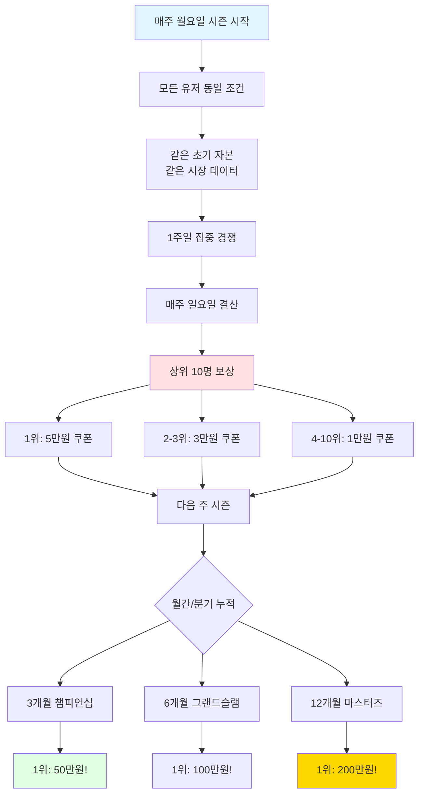
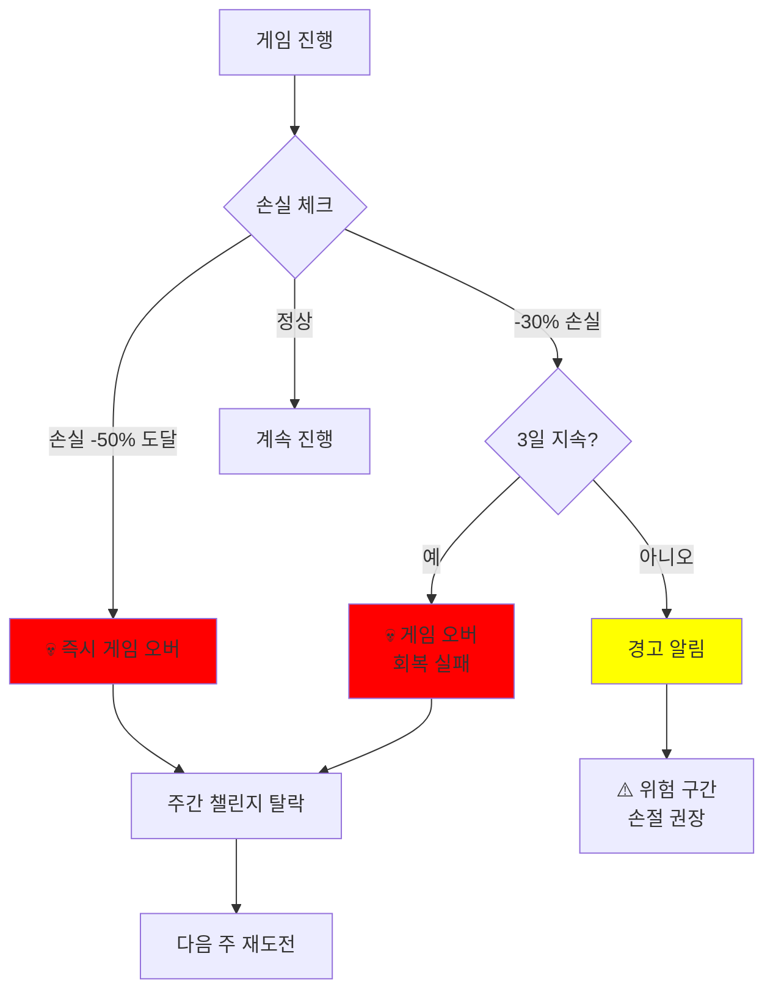
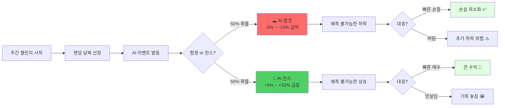
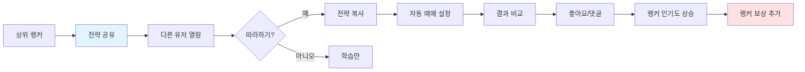
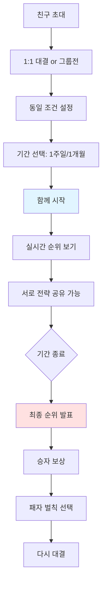
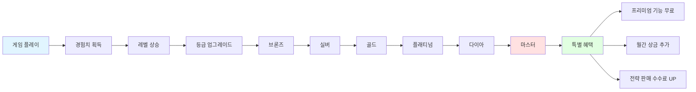
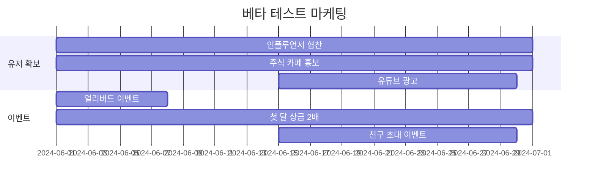
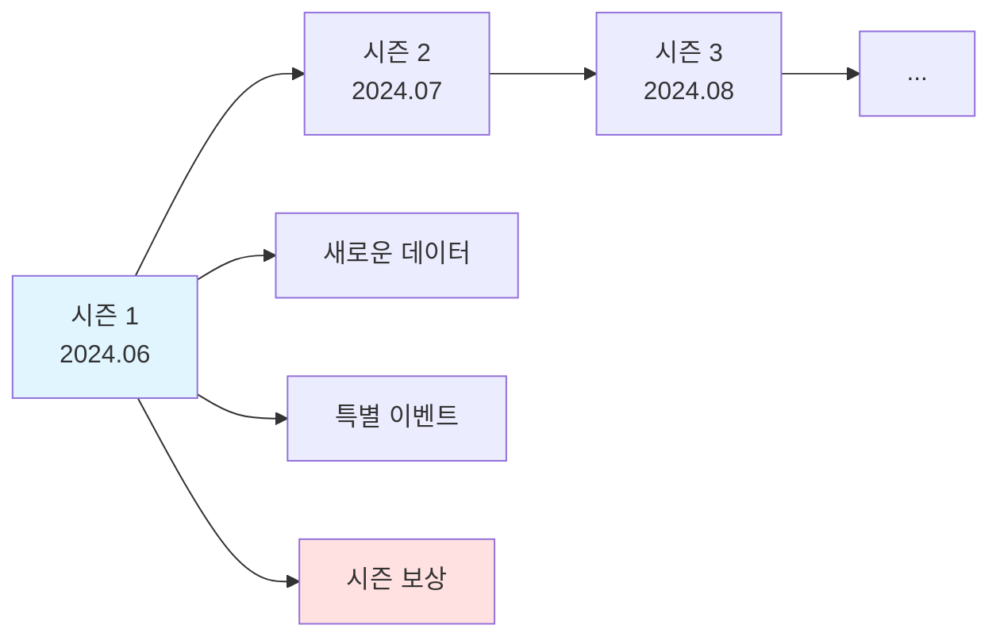

# 마케팅 & 게임 전략 문서
## "파도를 타라: 주식 리듬 마스터"

## 📋 목차
1. [게임 요소 강화 전략](#게임-요소-강화-전략)
2. [커뮤니티 & 소셜 기능](#커뮤니티--소셜-기능)
3. [리워드 시스템](#리워드-시스템)
4. [마케팅 전략](#마케팅-전략)
5. [수익 모델](#수익-모델)
6. [바이럴 전략](#바이럴-전략)

---

## 🎮 게임 요소 강화 전략

### 1. 주간 랭킹 경쟁 (핵심 개선!)



#### 주간 챌린지 구조 (개선!)

| 요소 | 내용 | 목적 |
|------|------|------|
| **기간** | 매주 월요일 00시 ~ 일요일 23시59분 | ⚡ 빠른 결과 |
| **플레이 시간** | 게임 내 7일 = 실제 1주일 자유 진행 | 부담 없음 |
| **동일 조건** | 초기 자본 1,000만원, 같은 시장 데이터 | 공정한 경쟁 |
| **실시간 랭킹** | 10분마다 업데이트 | 실시간 긴장감 |
| **게임 오버** | -50% 손실 or -30% 3일 지속 | 난이도 부여 |
| **AI 이벤트** | 주 1회 함정 or 찬스 (±10%) | 예측 불가 스릴 |
| **보상** | 1위 5만원 ~ 10위 1만원 쿠폰 | 매주 동기 |

#### 누적 챔피언십 (신규!)

| 기간 | 조건 | 1위 상금 | 목적 |
|------|------|---------|------|
| **주간** | 1주일 경쟁 | 5만원 | 빠른 재미 |
| **3개월** | 주간 점수 누적 12주 | 50만원 | 중기 목표 |
| **6개월** | 주간 점수 누적 24주 | 100만원 | 장기 목표 |
| **12개월** | 주간 점수 누적 48주 | 200만원 | 최종 챔피언 |

#### 실시간 랭킹 화면 (개선!)

```
┌─────────────────────────────────────────────────────┐
│  🏆 주간 챌린지 Week 21                             │
│  ⏰ 남은 시간: 2일 14시간 23분                      │
│  ⚡ 10분마다 업데이트                               │
├─────────────────────────────────────────────────────┤
│  [전체] [수익률] [안정성] [생존자] [내 순위]        │
│                                                     │
│  ━━━━━━━━━━━━━━━━━━━━━━━━━━━━━━━━━━━━━━━━━━━━  │
│                                                     │
│  1위 🥇 파도의신       +42.5%  💰5만원            │
│     📈 전략: AI 함정 회피 + 찬스 포착 ✨           │
│     🔥 연속 1위: 3주                               │
│     💬 "이번 주 AI 함정 피했어요!"                 │
│                                                     │
│  2위 🥈 주식천재       +38.7%  💰3만원            │
│     📈 전략: 분할 매매 + 빠른 손절                 │
│     ⚠️ AI 찬스 활용: +12% 급등 포착!              │
│                                                     │
│  3위 🥉 워렌버핏코리아  +35.2%  💰3만원            │
│     📈 전략: 안정형 집중                           │
│                                                     │
│  ...                                                │
│                                                     │
│  15위 ⬆️ 나            +18.5%  (↑5 상승!)          │
│     📊 상위 10위까지: +8.2% 더 필요               │
│     💡 예상: 12위 (아깝다! 조금만 더!)             │
│     ⚡ 오늘 AI 이벤트 예정! 조심하세요             │
│                                                     │
│  ━━━━━━━━━━━━━━━━━━━━━━━━━━━━━━━━━━━━━━━━━━━━  │
│                                                     │
│  💰 이번 주 상금: 23만원                           │
│  👥 참여자: 3,847명 (↑ 역대 최다!)                │
│  💀 게임오버: 285명 (-50% 도달)                   │
│  🎲 AI 이벤트 발생: 2일 전 (함정 -8% 급락!)       │
│                                                     │
│  ━━━━━━━━━━━━━━━━━━━━━━━━━━━━━━━━━━━━━━━━━━━━  │
│                                                     │
│  📊 누적 랭킹 (3개월 챔피언십)                     │
│  1위 🏆 파도의신 1,285점 (50만원 코앞!)           │
│  15위 나 427점 (상위 10위까지 258점 필요)          │
│                                                     │
│  [전략 공유] [리플레이] [다음 주 등록]             │
│                                                     │
└─────────────────────────────────────────────────────┘
```

### 2. 게임 오버 시스템 (난이도!) 🔥

#### 게임 오버 조건



#### 게임 오버 상세

| 조건 | 기준 | 알림 | 결과 |
|------|------|------|------|
| **즉시 탈락** | -50% 손실 도달 | 🚨 즉시 게임 오버 | 주간 챌린지 탈락 |
| **3일 규칙** | -30% 손실 3일 지속 | ⚠️ 2일 경고, 3일 탈락 | 회복 기회 없음 |
| **경고 구간** | -20% 손실 | ⚠️ 위험! 손절 권장 | 계속 가능 |
| **주의 구간** | -10% 손실 | 💡 조심하세요 | 정상 |

#### 게임 오버 화면

```
┌─────────────────────────────────────────────────────┐
│  💀 게임 오버!                                       │
├─────────────────────────────────────────────────────┤
│                                                     │
│  손실률: -52.3% 💔                                  │
│  초기 자본: 10,000,000원                            │
│  최종 자산: 4,770,000원                             │
│                                                     │
│  게임 오버 원인:                                     │
│  에코프로 AI 함정에 빠져 -15% 급락                  │
│  → 손절하지 않고 버팀                               │
│  → 추가 하락으로 -50% 돌파                         │
│                                                     │
│  ━━━━━━━━━━━━━━━━━━━━━━━━━━━━━━━━━━━━━━━━━━━━  │
│                                                     │
│  💡 AI 분석:                                        │
│  "AI 함정 발생 시 즉시 손절했다면                   │
│   손실 -8%에서 막을 수 있었습니다."                 │
│                                                     │
│  "리스크 관리가 가장 중요합니다.                     │
│   -5% 손절 규칙을 지켰다면 살아남았을 거예요!"     │
│                                                     │
│  ━━━━━━━━━━━━━━━━━━━━━━━━━━━━━━━━━━━━━━━━━━━━  │
│                                                     │
│  이번 주 순위: 탈락 (랭킹 없음)                     │
│  다음 기회: 다음 주 월요일                          │
│                                                     │
│  [📊 상세 리포트] [🔄 다시 도전] [💡 손절 가이드]  │
│                                                     │
└─────────────────────────────────────────────────────┘
```

### 3. AI 이벤트 시스템 (예측 불가!) 🎲

#### AI 함정 & 찬스 메커니즘



#### AI 이벤트 상세

| 요소 | 내용 | 효과 |
|------|------|------|
| **발생 빈도** | 주 1회 (7일 중 랜덤) | 예측 불가 |
| **함정 확률** | 50% | -5% ~ -10% 급락 |
| **찬스 확률** | 50% | +5% ~ +10% 급등 |
| **적용 종목** | 랜덤 1개 (고변동형 우선) | 스릴 증가 |
| **지속 시간** | 1시간 (게임 내 11:00~13:00) | 빠른 대응 필요 |
| **사전 예고** | 없음! | 진짜 주식처럼 |

#### AI 함정 발생 화면

```
┌─────────────────────────────────────────────────────┐
│  🚨 긴급 속보!                                       │
├─────────────────────────────────────────────────────┤
│                                                     │
│  ⚠️ AI 함정 발동! ⚠️                               │
│                                                     │
│  종목: 에코프로                                      │
│  현재가: 250,000원 → 227,500원 (-9.0%) 💥         │
│                                                     │
│  🔥 예측 불가능한 급락 발생!                        │
│  이유 불명의 대량 매도 발생                         │
│                                                     │
│  ━━━━━━━━━━━━━━━━━━━━━━━━━━━━━━━━━━━━━━━━━━━━  │
│                                                     │
│  💡 보유 현황:                                      │
│  에코프로 100주 보유 중                             │
│  평균 단가: 245,000원                               │
│  현재 손실: -2,250,000원 (-9.0%) 💔               │
│                                                     │
│  ⏰ 빠른 결정이 필요합니다!                         │
│                                                     │
│  옵션 1: 🛡️ 즉시 손절 (-9% 확정)                  │
│  옵션 2: 🎲 버티기 (추가 하락 or 반등?)            │
│  옵션 3: 💪 추가 매수 (평단가 낮추기, 고위험)      │
│                                                     │
│  [손절하기] [버티기] [추가 매수]                   │
│                                                     │
└─────────────────────────────────────────────────────┘
```

#### AI 찬스 발생 화면

```
┌─────────────────────────────────────────────────────┐
│  ✨ 특종 뉴스!                                       │
├─────────────────────────────────────────────────────┤
│                                                     │
│  🎁 AI 찬스 발동! 🎁                                │
│                                                     │
│  종목: 삼성전자                                      │
│  현재가: 70,000원 → 77,000원 (+10.0%) 🚀          │
│                                                     │
│  🔥 예측 불가능한 급등 발생!                        │
│  외국인 대량 매수 + 호재 뉴스                       │
│                                                     │
│  ━━━━━━━━━━━━━━━━━━━━━━━━━━━━━━━━━━━━━━━━━━━━  │
│                                                     │
│  💰 현재 상황:                                      │
│  미보유 종목 (기회!)                                │
│  현금: 3,500,000원                                  │
│                                                     │
│  ⏰ 지금이 매수 타이밍!                             │
│                                                     │
│  💡 전략 옵션:                                      │
│  옵션 1: 💰 1차 매수 (33%, 약 115만원)            │
│  옵션 2: 🚀 공격적 매수 (50%, 약 175만원)         │
│  옵션 3: 😐 관망 (기회 포기)                       │
│                                                     │
│  ⚠️ 하지만 조심! 과열일 수도 있습니다               │
│                                                     │
│  [1차 매수] [공격 매수] [관망]                     │
│                                                     │
└─────────────────────────────────────────────────────┘
```

#### AI 이벤트 통계 (리포트)

```
━━━━━━━━━━━━━━━━━━━━━━━━━━━━━━━━━━━━━━━━━━━━━
🎲 AI 이벤트 대응 분석
━━━━━━━━━━━━━━━━━━━━━━━━━━━━━━━━━━━━━━━━━━━━━

총 AI 이벤트: 4회

🕳️ AI 함정 (2회):
  1차: 셀트리온 -8.5% 급락
      → 대응: 즉시 손절 ✅
      → 결과: 손실 최소화 (-8.5%)
      
  2차: 에코프로 -9.0% 급락
      → 대응: 버팀 ⚠️
      → 결과: 추가 하락 -15% → 게임 오버 💀

🎁 AI 찬스 (2회):
  1차: 삼성전자 +10% 급등
      → 대응: 1차 매수 ✅
      → 결과: 최종 +18% 수익 🎉
      
  2차: 카카오 +7.5% 급등
      → 대응: 관망 😐
      → 결과: 기회 놓침 💸

━━━━━━━━━━━━━━━━━━━━━━━━━━━━━━━━━━━━━━━━━━━━━
💡 AI 평가:

AI 함정 대응: 50% (1/2 성공)
→ 첫 번째는 잘 대응했지만,
  두 번째에서 버티다가 게임 오버

AI 찬스 활용: 50% (1/2 성공)
→ 기회를 절반만 활용

━━━━━━━━━━━━━━━━━━━━━━━━━━━━━━━━━━━━━━━━━━━━━
🎯 개선 포인트:

1. AI 함정 시 무조건 손절!
   버티면 더 큰 손실 위험

2. AI 찬스 시 최소 1차 매수
   완전 관망은 기회 낭비

3. 실전 팁:
   AI 이벤트는 주 1회 발생
   → 항상 현금 20% 여유 유지
   → 빠른 대응이 핵심!
```

### 4. 부문별 랭킹 시스템

#### 다양한 랭킹 카테고리

| 부문 | 평가 기준 | 보상 | 목적 |
|------|----------|------|------|
| **수익률 왕** | 최고 수익률 | 5만원 | 공격적 투자자 |
| **안정성 왕** | 최저 MDD + 수익률 | 3만원 | 보수적 투자자 |
| **생존 왕** | 게임 오버 없이 완주 | 3만원 | 리스크 관리 |
| **AI 마스터** | AI 이벤트 대응 우수 | 5만원 | 대응 능력 |
| **신인 왕** | 첫 주 참여자 중 최고 | 3만원 | 신규 유저 |

**총 주간 상금 풀: 23만원**

### 3. 전략 공유 & 팔로우 시스템



#### 전략 공유 화면

```
┌─────────────────────────────────────────────────────┐
│  📊 파도의신 님의 5월 전략                          │
│  수익률: +87.5% | 팔로워: 1,234명                   │
├─────────────────────────────────────────────────────┤
│                                                     │
│  [전체] [포트폴리오] [매매 내역] [전략 요약]        │
│                                                     │
│  ━━━━━━━━━━━━━━━━━━━━━━━━━━━━━━━━━━━━━━━━━━━━  │
│                                                     │
│  🎯 핵심 전략:                                      │
│  "분할 매매 + 파도 저점 포착"                       │
│                                                     │
│  📋 상세 전략:                                      │
│  1. 안정형 30% + 변동형 50% + 고변동 20%           │
│  2. 30일 최저점 근처에서만 1차 매수               │
│  3. -5% 하락 시 2차 매수로 평균 단가 낮춤         │
│  4. +12% 도달 시 2차 매도 시작                    │
│  5. 손절 라인 -7% 엄수                            │
│                                                     │
│  🌊 주요 승부처:                                    │
│  - 삼성전자 3차 매수 → +28.5% 수익               │
│  - 셀트리온 저점 포착 → +35.2% 수익               │
│  - 에코프로 -7% 손절 → 추가 손실 방지            │
│                                                     │
│  💰 포트폴리오 구성:                                │
│  삼성전자 (25%) | 셀트리온 (20%) | 네이버 (15%)  │
│  SK하이닉스 (15%) | 카카오 (10%) | 현금 (15%)    │
│                                                     │
│  ━━━━━━━━━━━━━━━━━━━━━━━━━━━━━━━━━━━━━━━━━━━━  │
│                                                     │
│  💬 댓글 (328개)                                    │
│                                                     │
│  주식초보 "와... 대단하시네요! 따라해봤는데        │
│           +15% 수익 났어요! 감사합니다!"           │
│  파도의신 → "축하드립니다! 꾸준히 하세요 😊"       │
│                                                     │
│  투자왕 "에코프로 손절한 부분이 인상적이네요.       │
│         제가 놓쳤던 부분입니다."                    │
│                                                     │
│  ━━━━━━━━━━━━━━━━━━━━━━━━━━━━━━━━━━━━━━━━━━━━  │
│                                                     │
│  [👍 좋아요 1,245] [💬 댓글 달기] [📋 전략 복사]  │
│  [⭐ 팔로우] [🎁 후원하기]                        │
│                                                     │
└─────────────────────────────────────────────────────┘
```

### 4. 업적 & 칭호 시스템

#### 희귀 칭호 시스템

| 등급 | 칭호 | 획득 조건 | 효과 |
|------|------|----------|------|
| 🌟 전설 | 파도의 신 | 월간 1위 3회 연속 | 닉네임 금색 |
| 💎 영웅 | 수익 마스터 | 한 달 +100% 달성 | 닉네임 보라색 |
| ⭐ 희귀 | 안정성 왕 | MDD -5% 이내 | 특별 아이콘 |
| 🏆 고급 | 타이밍 마스터 | 저점 매수 30회 | 힌트 +5개 |
| 🎖️ 일반 | 수익 달성자 | 첫 +30% 달성 | - |

#### 숨겨진 업적

```
┌─────────────────────────────────────────────────────┐
│  🎉 숨겨진 업적 달성!                                │
├─────────────────────────────────────────────────────┤
│                                                     │
│         🌊🌊🌊                                      │
│      파도의 달인                                     │
│                                                     │
│  조건: 30일 최저점에서 10회 연속 매수 성공          │
│                                                     │
│  보상:                                              │
│  - 희귀 칭호 "파도의 달인" 획득                     │
│  - 특별 프로필 효과                                 │
│  - AI 고급 분석 레포트 해금                         │
│  - 힌트 쿠폰 10장                                   │
│                                                     │
│  💡 이 칭호를 가진 유저는 전체의 0.5%뿐!           │
│                                                     │
│  [칭호 착용하기] [SNS 공유하기]                    │
│                                                     │
└─────────────────────────────────────────────────────┘
```

---

## 🤝 커뮤니티 & 소셜 기능

### 1. 친구 대결 모드



#### 친구 대결 화면

```
┌─────────────────────────────────────────────────────┐
│  ⚔️ 친구 대결                                       │
│  "주말 술값은 내가 낸다" 내기                        │
├─────────────────────────────────────────────────────┤
│  기간: 2024.05.01 ~ 2024.05.31                     │
│  참여자: 나, 김철수, 이영희, 박민수                 │
│                                                     │
│  현재 순위:                                         │
│  1위 🥇 김철수    +32.5%  😎                       │
│  2위 🥈 나        +28.3%  😤 (따라잡자!)           │
│  3위 🥉 이영희    +18.7%                           │
│  4위 😅 박민수    -5.2%   (술값 확정?!)            │
│                                                     │
│  💬 실시간 채팅:                                    │
│  김철수: "이번 달은 내가 먹는다! 🍺"                │
│  나: "아직 한 달 남았어! 기다려봐 😎"               │
│  박민수: "손절 타이밍 놓쳤다... 😭"                │
│  이영희: "나도 2위까지는 갈 수 있어!"               │
│                                                     │
│  [💬 채팅] [📊 상세 비교] [🎯 전략 엿보기]         │
│                                                     │
└─────────────────────────────────────────────────────┘
```

### 2. 커뮤니티 게시판

#### 게시판 카테고리

| 게시판 | 내용 | 활성화 방법 |
|--------|------|------------|
| **오늘의 종목** | 추천 종목 토론 | 좋아요 많은 글 상단 고정 |
| **전략 공유** | 성공한 전략 공유 | 월간 베스트 선정, 보상 |
| **질문/답변** | 초보자 질문 | 답변 포인트 지급 |
| **복기/분석** | 실패/성공 사례 | 인기글 뱃지 |
| **자유 게시판** | 일상 이야기 | 커뮤니티 활성화 |

#### 커뮤니티 포인트 시스템

| 활동 | 획득 포인트 | 사용처 |
|------|------------|--------|
| 글 작성 | 10P | 힌트 구매 (50P) |
| 댓글 작성 | 5P | 조건 주문 슬롯 추가 (100P) |
| 좋아요 받기 | 3P | 프리미엄 AI 분석 (200P) |
| 베스트 글 선정 | 100P | 특별 칭호 (500P) |
| 답변 채택 | 30P | - |

### 3. 전략 마켓플레이스 (선택)

```
┌─────────────────────────────────────────────────────┐
│  🛒 전략 마켓                                        │
├─────────────────────────────────────────────────────┤
│  [인기] [최신] [고수익] [안정성] [초보자용]         │
│                                                     │
│  ━━━━━━━━━━━━━━━━━━━━━━━━━━━━━━━━━━━━━━━━━━━━  │
│                                                     │
│  🔥 인기 1위                                        │
│  파도의신의 "분할 매매 마스터" 전략                 │
│  평균 수익률: +42.5% | 구매자: 1,234명             │
│  가격: 3,000P or 5,000원                           │
│                                                     │
│  💬 리뷰 (4.8/5.0 ⭐⭐⭐⭐⭐)                      │
│  "정말 도움이 많이 됐습니다!" - 주식초보            │
│  "따라하니 +30% 수익 났어요" - 투자왕              │
│                                                     │
│  [상세보기] [구매하기] [무료 맛보기]                │
│                                                     │
│  ━━━━━━━━━━━━━━━━━━━━━━━━━━━━━━━━━━━━━━━━━━━━  │
│                                                     │
│  내가 만든 전략 판매하기:                           │
│  - 월간 1위 이상만 판매 가능                       │
│  - 판매 수익의 70%를 받습니다                      │
│  - 인기 전략은 추가 보너스!                        │
│                                                     │
│  [내 전략 등록하기]                                │
│                                                     │
└─────────────────────────────────────────────────────┘
```

---

## 🎁 리워드 시스템

### 1. 월간 보상 구조

#### 상금 분배

| 순위 | 보상 | 추가 혜택 |
|------|------|----------|
| 1위 | 10만원 쿠폰 | 프로필 전설 뱃지 |
| 2위 | 7만원 쿠폰 | 프로필 골드 뱃지 |
| 3위 | 5만원 쿠폰 | 프로필 실버 뱃지 |
| 4-10위 | 3만원 쿠폰 | 프로필 브론즈 뱃지 |
| 11-30위 | 1만원 쿠폰 | - |
| 31-100위 | 5천원 쿠폰 | - |

**총 월간 상금: 약 60만원**

#### 쿠폰 사용처

| 파트너 | 혜택 | 마케팅 효과 |
|--------|------|------------|
| **증권사** | HTS 수수료 할인 | 실전 투자 유도 |
| **교육** | 주식 강의 할인 | 학습 연계 |
| **서점** | 투자 도서 할인 | 지식 확장 |
| **커피** | 스타벅스 등 | 일상 혜택 |

### 2. 누적 리워드 프로그램



#### 등급별 혜택

| 등급 | 조건 | 혜택 |
|------|------|------|
| 🥉 **브론즈** | 레벨 1-10 | 기본 기능 |
| 🥈 **실버** | 레벨 11-30 | 힌트 +5개/월 |
| 🥇 **골드** | 레벨 31-60 | 조건 주문 슬롯 +2 |
| 💎 **플래티넘** | 레벨 61-100 | AI 고급 분석 무료 |
| 💠 **다이아** | 레벨 101-150 | 월간 상금 +10% |
| 👑 **마스터** | 레벨 151+ | 모든 프리미엄 무료 |

### 3. 일일 로그인 보너스

```
┌─────────────────────────────────────────────────────┐
│  🎁 일일 출석 체크                                   │
├─────────────────────────────────────────────────────┤
│                                                     │
│  연속 출석: 7일째 🔥                                │
│                                                     │
│  [✅][✅][✅][✅][✅][✅][✅] [  ] [  ] [  ]         │
│   1   2   3   4   5   6   7   8   9  10           │
│                                                     │
│  오늘의 보상: 힌트 3개 💡                           │
│                                                     │
│  다음 보상 (8일차): 조건 주문 슬롯 +1               │
│  특별 보상 (10일차): 5,000원 쿠폰! 🎉              │
│                                                     │
│  [✓ 출석 체크]                                     │
│                                                     │
└─────────────────────────────────────────────────────┘
```

---

## 📢 마케팅 전략

### 1. 런칭 단계별 전략

#### Phase 1: 베타 테스트 (1개월)



**목표**: 1,000명 확보

**전략**:
- 주식 유튜버/인플루언서 10명 협찬
- 네이버 카페, 디시인사이드 홍보
- 얼리버드 혜택 (평생 프리미엄 무료)
- 첫 달 상금 2배 (1위 20만원)

#### Phase 2: 정식 런칭 (3개월)

**목표**: 10,000명 확보

**전략**:
- 증권사 제휴 (키움, 미래에셋 등)
- 주식 강의 플랫폼 제휴
- 페이스북/인스타 광고
- 입소문 마케팅 (친구 추천 보상)

#### Phase 3: 성장 단계 (6개월+)

**목표**: 50,000명+

**전략**:
- 증권방송 PPL
- 주요 커뮤니티 스폰서
- 오프라인 주식 박람회 참가
- 기업 교육 프로그램 제안

### 2. 바이럴 전략

#### 공유 시스템

```
┌─────────────────────────────────────────────────────┐
│  🎉 목표 달성!                                       │
│  중고차 구매 (3,000만원) 달성!                      │
├─────────────────────────────────────────────────────┤
│                                                     │
│  나의 투자 성과:                                     │
│  - 초기 자본: 500만원                               │
│  - 최종 자산: 3,050만원                             │
│  - 수익률: +510% 🎉                                │
│  - 소요 일수: 108일                                 │
│                                                     │
│  [📱 카카오톡 공유] [📘 페이스북] [📷 인스타그램]   │
│  [🔗 링크 복사] [💾 이미지 저장]                   │
│                                                     │
│  💡 친구에게 공유하면:                              │
│  - 나: 힌트 10개 + 5,000원 쿠폰                    │
│  - 친구: 가입 시 프리미엄 1개월 무료                │
│                                                     │
└─────────────────────────────────────────────────────┘
```

#### SNS 공유 예시

```
[이미지: 게임 결과 스크린샷]

🎮 "파도를 타라" 게임으로 주식 공부 중!
💰 500만원 → 3,050만원 (+510%)
🚗 가상으로 중고차 샀다! 

실제로 도움이 많이 되는 것 같아 👍
분할 매매 전략도 배우고, 손절 타이밍도 연습하고!

너희도 해봐~ 
👉 [추천 링크]
(내 추천으로 가입하면 둘 다 혜택!)

#주식게임 #주식공부 #재테크 #파도를타라
```

### 3. 파트너십 전략

#### 증권사 제휴

| 증권사 | 제휴 내용 | 우리 혜택 |
|--------|----------|----------|
| 키움증권 | 게임 쿠폰으로 수수료 할인 | 키움 HTS 내 노출 |
| 미래에셋 | 신규 계좌 개설 시 게임 프리미엄 | 계좌 개설 수수료 |
| NH투자증권 | 게임 데이터 제공 | 데이터 무료 사용 |

#### 교육 플랫폼 제휴

| 플랫폼 | 제휴 내용 | 우리 혜택 |
|--------|----------|----------|
| 인프런 | 주식 강의 + 게임 패키지 | 강의 플랫폼 노출 |
| 패스트캠퍼스 | 게임으로 실습하는 강의 | 수강생 유입 |
| 유데미 | 글로벌 진출 | 해외 시장 |

---

## 💰 수익 모델

### 1. 프리미엄 구독

#### 무료 vs 프리미엄

| 기능 | 무료 | 프리미엄 (월 9,900원) |
|------|------|----------------------|
| **기본 게임** | ✅ | ✅ |
| **월간 챌린지** | ✅ | ✅ |
| **힌트** | 5개/월 | 무제한 |
| **조건 주문** | 1개 | 5개 |
| **AI 분석** | 기본 | 고급 + 예측 |
| **광고** | 있음 | 없음 |
| **전략 저장** | 3개 | 무제한 |
| **리플레이** | 최근 1개월 | 전체 |

**예상 전환율**: 5-10%

### 2. 수익 구조 시뮬레이션

#### 유저 10,000명 기준

| 항목 | 계산 | 월 수익 |
|------|------|---------|
| **프리미엄 구독** | 10,000 × 7% × 9,900원 | 693만원 |
| **광고 수익** | 10,000 × 93% × 500원 | 465만원 |
| **전략 마켓** | 판매 수수료 30% | 100만원 |
| **파트너십** | 증권사 제휴 등 | 200만원 |
| **총 수익** | - | **1,458만원** |
| **비용 (서버/상금)** | - | -400만원 |
| **순이익** | - | **1,058만원** |

#### 유저 50,000명 기준

| 항목 | 월 수익 |
|------|---------|
| 프리미엄 구독 | 3,465만원 |
| 광고 수익 | 2,325만원 |
| 전략 마켓 | 500만원 |
| 파트너십 | 500만원 |
| **총 수익** | **6,790만원** |
| **비용** | -1,200만원 |
| **순이익** | **5,590만원** |

---

## 🚀 바이럴 부스터

### 1. 챌린지 이벤트

#### "1주일 챌린지"

```
┌─────────────────────────────────────────────────────┐
│  🔥 1주일 챌린지 시즌 12                             │
│  "1,000만원을 얼마로 만들 수 있나?"                  │
├─────────────────────────────────────────────────────┤
│                                                     │
│  기간: 2024.05.20 (월) ~ 05.26 (일)                │
│  참가비: 무료 (누구나 참여 가능!)                    │
│                                                     │
│  규칙:                                              │
│  - 초기 자본 1,000만원                              │
│  - 실제 2024년 5월 셋째주 데이터 사용               │
│  - 기간 내 최고 수익률 경쟁                         │
│                                                     │
│  보상:                                              │
│  🥇 1위: 50만원 + 전설 칭호                        │
│  🥈 2-3위: 30만원                                  │
│  🥉 4-10위: 10만원                                 │
│  🎁 참여자 전원: 힌트 10개                          │
│                                                     │
│  현재 참여자: 3,247명 (역대 최다!)                  │
│                                                     │
│  💡 이번 주 특별 이벤트:                            │
│  친구 추천 시 둘 다 힌트 20개 추가!                 │
│                                                     │
│  [지금 참여하기] [룰 자세히 보기] [친구 초대]       │
│                                                     │
└─────────────────────────────────────────────────────┘
```

### 2. 시즌제 운영



#### 시즌별 특징

| 시즌 | 테마 | 특별 이벤트 | 보상 |
|------|------|------------|------|
| 시즌 1 | 봄 상승장 | 급등주 포착 | 시즌 뱃지 |
| 시즌 2 | 여름 변동장 | 변동성 대응 | 시즌 칭호 |
| 시즌 3 | 가을 조정장 | 손절 마스터 | 시즌 스킨 |
| 시즌 4 | 겨울 횡보장 | 장기 투자 | 시즌 리워드 |

### 3. 인플루언서 협업

#### 유튜버 이벤트

```
[유튜버 A의 특별 챌린지]

"구독자 여러분과 함께하는 주식 대결!"

- 유튜버 A vs 구독자 대표 10명
- 2주간 진행
- 같은 초기 자본, 같은 데이터
- 전 과정 유튜브 생중계
- 우승자에게 100만원!

👉 참가 신청: [링크]
👉 실시간 시청: 매일 저녁 8시
```

---

## 📊 성공 지표 (KPI)

### 핵심 지표

| 지표 | 목표 (6개월) | 측정 방법 |
|------|-------------|----------|
| **가입자 수** | 50,000명 | 회원가입 |
| **DAU** | 5,000명 (10%) | 일 접속 |
| **MAU** | 25,000명 (50%) | 월 접속 |
| **프리미엄 전환율** | 7% | 유료 결제 |
| **친구 추천율** | 15% | 추천 링크 |
| **평균 플레이 시간** | 30분/일 | 세션 시간 |
| **리텐션 (30일)** | 40% | 재접속률 |
| **NPS** | 50+ | 추천 의향 |

### 바이럴 계수

```
바이럴 계수 = (초대한 친구 수) × (친구 가입률)

목표: 1.5 이상 (기하급수적 성장)

현실적 예상:
- 유저당 초대: 2.5명
- 가입률: 40%
- 바이럴 계수: 1.0 (선방)

개선 방안:
- 친구 대결 모드로 초대 유도
- 가입 시 혜택 강화
- 목표: 1.3 이상
```

---

## ✅ 마케팅 & 게임 전략 요약

### 핵심 전략

1. **월간 챌린지** (45만원 상금)
   - 매월 1일 시작, 상위 10명 보상
   - 실시간 랭킹으로 경쟁심 자극

2. **전략 공유 & 팔로우**
   - 상위 랭커 전략 공개
   - 따라하기 기능
   - 커뮤니티 활성화

3. **친구 대결**
   - 1:1 or 그룹 대결
   - 술값 내기 등 재미 요소
   - 바이럴 효과

4. **리워드 시스템**
   - 쿠폰 (증권사, 교육, 생활)
   - 등급제 (레벨업 혜택)
   - 일일 출석 보너스

5. **파트너십**
   - 증권사 제휴 (실전 연계)
   - 교육 플랫폼 제휴
   - 상호 윈-윈

### 기대 효과

✅ **유저 확보**: 바이럴 계수 1.3+로 자연 성장
✅ **리텐션**: 월간 챌린지로 매달 재방문
✅ **수익**: 프리미엄 7% + 광고로 안정적 수익
✅ **브랜드**: "주식 공부 = 파도를 타라" 인식
✅ **실전 연계**: 게임 → 실제 투자 전환

---

이 전략으로 **재미있게 즐기면서 자연스럽게 확산**되는 게임을 만들 수 있습니다! 🚀

