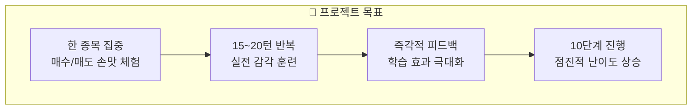
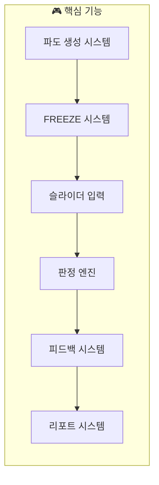
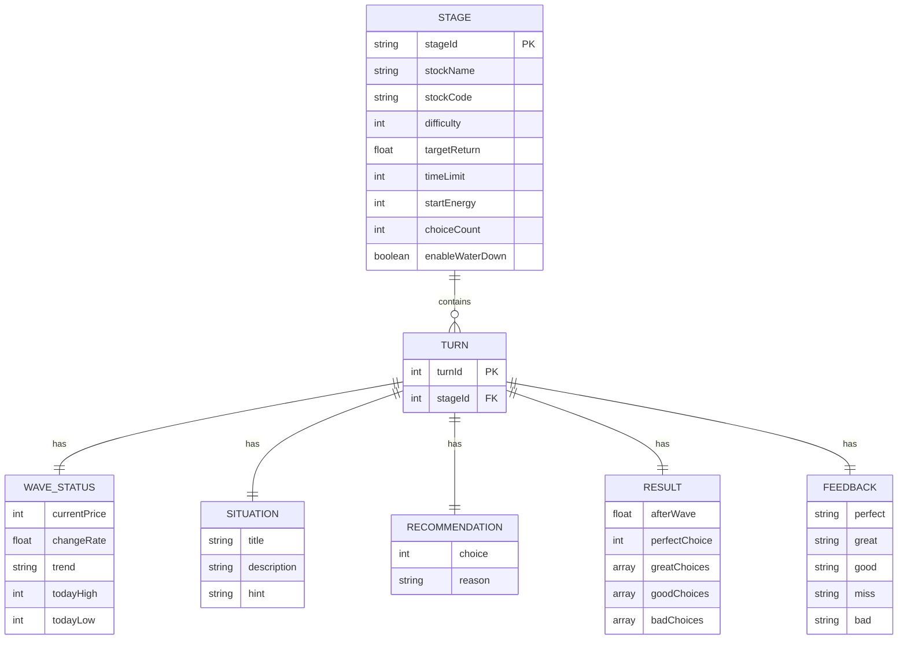
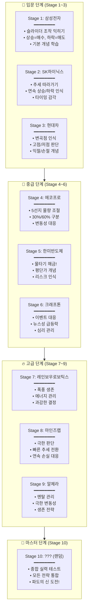
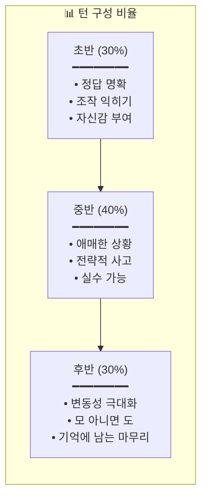

# 📋 파도 항해사 - 요구사항 분석서

## 📌 문서 개요

| 항목 | 내용 |
|------|------|
| **프로젝트명** | 파도 항해사 (Wave Navigator) |
| **문서 버전** | v1.0 |
| **작성일** | 2024.12.08 |
| **목적** | 10단계 시나리오 기반 주식 트레이딩 시뮬레이션 게임 |

---

## 🎯 1. 프로젝트 목표

### 1.1 핵심 목표



### 1.2 학습 목표 매트릭스

| 단계 | 학습 목표 | 게임 메커니즘 | 기대 효과 |
|:---:|----------|-------------|----------|
| 1~3 | 기본 조작 | 3선지 슬라이더 | 매수/매도/유지 개념 습득 |
| 4~6 | 물량 조절 | 5선지 슬라이더 | 분할 매수/매도 전략 |
| 7~9 | 리스크 관리 | 물타기 + 에너지 | 멘탈 관리, 손절 판단 |
| 10 | 종합 실력 | 랜덤 종목 | 모든 전략 통합 |

---

## 🔧 2. 기능 요구사항

### 2.1 핵심 기능 목록



### 2.2 기능 상세 명세

#### FR-001: 파도 생성 시스템

| 항목 | 내용 |
|------|------|
| **기능 ID** | FR-001 |
| **기능명** | 파도 생성 시스템 (WaveGenerator) |
| **설명** | 시나리오 데이터를 기반으로 실시간 파도(차트) 생성 |
| **입력** | 스테이지 ID, 시나리오 JSON |
| **출력** | 실시간 파도 애니메이션, 가격 데이터 |
| **우선순위** | 필수 (P0) |

#### FR-002: FREEZE 시스템

| 항목 | 내용 |
|------|------|
| **기능 ID** | FR-002 |
| **기능명** | FREEZE 시스템 (FreezeController) |
| **설명** | 시나리오 정의 시점에 파도를 정지하고 선택 UI 표시 |
| **입력** | FREEZE 트리거 조건, 상황 데이터 |
| **출력** | 5초 카운트다운, 상황 정보 UI |
| **우선순위** | 필수 (P0) |

#### FR-003: 슬라이더 입력 시스템

| 항목 | 내용 |
|------|------|
| **기능 ID** | FR-003 |
| **기능명** | 슬라이더 입력 (SliderController) |
| **설명** | 좌우 드래그로 매수/매도/유지 선택 |
| **입력** | 터치/마우스 드래그 이벤트 |
| **출력** | 선택값 (-60%, -30%, 0%, +30%, +60%) |
| **우선순위** | 필수 (P0) |

#### FR-004: 판정 엔진

| 항목 | 내용 |
|------|------|
| **기능 ID** | FR-004 |
| **기능명** | 판정 엔진 (JudgeEngine) |
| **설명** | 사용자 선택과 파도 결과를 비교하여 등급 판정 |
| **입력** | 사용자 선택, 10초 후 파도 결과 |
| **출력** | PERFECT/GREAT/GOOD/OK/MISS/BAD |
| **우선순위** | 필수 (P0) |

#### FR-005: 피드백 시스템

| 항목 | 내용 |
|------|------|
| **기능 ID** | FR-005 |
| **기능명** | 피드백 시스템 (FeedbackSystem) |
| **설명** | 판정 결과에 따른 시각/청각/텍스트 피드백 |
| **입력** | 판정 등급, 턴 데이터 |
| **출력** | 점수, 에너지 변화, 메시지, 이펙트 |
| **우선순위** | 필수 (P0) |

#### FR-006: 리포트 시스템

| 항목 | 내용 |
|------|------|
| **기능 ID** | FR-006 |
| **기능명** | 리포트 시스템 (ReportGenerator) |
| **설명** | 스테이지 완료 후 전략 분석 리포트 생성 |
| **입력** | 전체 턴 히스토리 |
| **출력** | 선택 분포, BEST/WORST 턴, 학습 포인트, 전략 태그 |
| **우선순위** | 높음 (P1) |

---

## 📊 3. 시나리오 데이터 구조

### 3.1 스테이지 데이터 스키마

```json
{
  "stageId": "STAGE_01",
  "stockName": "삼성전자",
  "stockCode": "005930",
  "difficulty": 1,
  "difficultyLabel": "★☆☆☆☆",
  "targetReturn": 5,
  "timeLimit": 180,
  "startEnergy": 100,
  "choiceCount": 3,
  "choiceOptions": [-30, 0, 30],
  "enableWaterDown": false,
  "turnCount": 15,
  "learningGoals": [
    "슬라이더 조작 익히기",
    "상승/하락 추세 인식",
    "매수/매도 타이밍 기초"
  ],
  "turns": [...]
}
```

### 3.2 턴(Turn) 데이터 스키마

```json
{
  "turnId": 1,
  "waveStatus": {
    "currentPrice": 72500,
    "changeRate": 1.2,
    "trend": "UP",
    "todayHigh": 73000,
    "todayLow": 71000
  },
  "situation": {
    "title": "작은 파도가 밀려온다",
    "description": "장 초반 완만한 상승세",
    "hint": "파도가 올라가고 있어! 짐을 실어볼까?"
  },
  "recommendation": {
    "choice": 30,
    "reason": "상승 추세 초기, 매수 적합"
  },
  "result": {
    "afterWave": 2.8,
    "perfectChoice": 30,
    "greatChoices": [30],
    "goodChoices": [0],
    "badChoices": [-30]
  },
  "feedback": {
    "perfect": "완벽한 타이밍! 파도의 시작을 잡았다!",
    "great": "좋아! 추세를 잘 탔어!",
    "good": "나쁘지 않아, 안전한 선택이야",
    "miss": "앗, 좋은 파도였는데...",
    "bad": "이런! 역방향이었어!"
  }
}
```

### 3.3 데이터 구조 다이어그램



---

## 🎮 4. 10단계 스테이지 설계

### 4.1 스테이지 개요표

| Stage | 종목 | 종목코드 | 난이도 | 목표 | 시간 | 턴 수 | 선택지 | 물타기 |
|:-----:|------|:-------:|:-----:|:----:|:---:|:----:|:-----:|:-----:|
| 1 | 삼성전자 | 005930 | ★☆☆☆☆ | +5% | 3분 | 15 | 3개 | ❌ |
| 2 | SK하이닉스 | 000660 | ★☆☆☆☆ | +8% | 3분 | 16 | 3개 | ❌ |
| 3 | 현대차 | 005380 | ★★☆☆☆ | +10% | 3분 | 17 | 3개 | ❌ |
| 4 | 에코프로 | 086520 | ★★★☆☆ | +15% | 5분 | 18 | 5개 | ❌ |
| 5 | 한미반도체 | 042700 | ★★★☆☆ | +18% | 5분 | 18 | 5개 | ✅ |
| 6 | 크래프톤 | 259960 | ★★★☆☆ | +22% | 5분 | 19 | 5개 | ✅ |
| 7 | 레인보우로보틱스 | 277810 | ★★★★☆ | +30% | 8분 | 20 | 5개 | ✅ |
| 8 | 마인즈랩 | 377480 | ★★★★☆ | +40% | 8분 | 20 | 5개 | ✅ |
| 9 | 알체라 | 347860 | ★★★★★ | +60% | 10분 | 22 | 5개 | ✅ |
| 10 | ??? (랜덤) | ?????? | ★★★★★ | +100% | 15분 | 25 | 5개 | ✅ |

### 4.2 스테이지별 학습 목표



---

## 📁 5. 파일 구조

### 5.1 시나리오 파일 구조

```
document/
└── scenarios/
    ├── REQUIREMENTS_ANALYSIS.md      # 요구사항 분석서 (현재 문서)
    ├── STAGE_01_SAMSUNG.md           # Stage 1: 삼성전자
    ├── STAGE_02_SKHYNIX.md           # Stage 2: SK하이닉스
    ├── STAGE_03_HYUNDAI.md           # Stage 3: 현대차
    ├── STAGE_04_ECOPRO.md            # Stage 4: 에코프로
    ├── STAGE_05_HANMI.md             # Stage 5: 한미반도체
    ├── STAGE_06_KRAFTON.md           # Stage 6: 크래프톤
    ├── STAGE_07_RAINBOW.md           # Stage 7: 레인보우로보틱스
    ├── STAGE_08_MINDSLAB.md          # Stage 8: 마인즈랩
    ├── STAGE_09_ALCHERA.md           # Stage 9: 알체라
    └── STAGE_10_RANDOM.md            # Stage 10: 랜덤
```

### 5.2 각 시나리오 파일 구성

| 섹션 | 내용 |
|------|------|
| **스테이지 정보** | 종목명, 난이도, 목표, 시간제한, 선택지 수 |
| **종목 특성** | 실제 종목 설명, 변동성 특징, 투자 포인트 |
| **학습 목표** | 이 스테이지에서 배우는 핵심 개념 |
| **시작 조건** | 시작 자금, 보유량, 에너지, 평단가 |
| **턴별 시나리오** | 15~25턴의 상세 FREEZE 시나리오 |
| **스토리 흐름** | 전체 시나리오의 기승전결 |

---

## 🎬 6. 시나리오 설계 원칙

### 6.1 턴 구성 원칙



### 6.2 시나리오 유형

| 유형 | 비율 | 설명 | 학습 포인트 |
|:---:|:---:|------|-----------|
| **순항형** | 20% | 명확한 상승/하락 추세 | 추세 추종 기본 |
| **반전형** | 25% | 추세가 중간에 바뀜 | 변곡점 인식 |
| **횡보형** | 15% | 방향 없이 옆으로 | 유지의 가치 |
| **급등형** | 15% | 갑작스러운 급등 | 급등 대응 |
| **급락형** | 15% | 갑작스러운 급락 | 손절/버티기 판단 |
| **롤러코스터형** | 10% | 급등 후 급락 또는 반대 | 종합 판단력 |

### 6.3 난이도 조절 요소

| 요소 | 쉬움 (Stage 1~3) | 보통 (Stage 4~6) | 어려움 (Stage 7~10) |
|------|-----------------|-----------------|-------------------|
| **변동폭** | ±1~3% | ±3~7% | ±7~30% |
| **추세 전환** | 1~2회 | 2~4회 | 4~8회 |
| **힌트 명확도** | 매우 명확 | 보통 | 모호/역힌트 |
| **선택지** | 3개 | 5개 | 5개 + 물타기 |
| **시간 압박** | 느슨 | 보통 | 빠듯 |

---

## ✅ 7. 검증 체크리스트

### 7.1 시나리오 검증 항목

- [ ] 각 스테이지별 15턴 이상 확보
- [ ] 초반/중반/후반 난이도 곡선 적절
- [ ] 학습 목표와 시나리오 일치
- [ ] 피드백 메시지 일관성
- [ ] 정답 선택의 논리적 타당성
- [ ] 파도 변화율의 현실성

### 7.2 게임성 검증 항목

- [ ] 재미 요소 (긴장감, 보상감)
- [ ] 학습 효과 (개념 전달)
- [ ] 난이도 밸런스
- [ ] 리플레이 가치
- [ ] 유저 피로도 관리

---

## 📅 8. 개발 일정 (제안)

| 단계 | 작업 내용 | 예상 기간 |
|:---:|----------|:--------:|
| 1 | 요구사항 분석 완료 | 완료 |
| 2 | Stage 1~3 시나리오 작성 | 1주 |
| 3 | Stage 4~6 시나리오 작성 | 1주 |
| 4 | Stage 7~10 시나리오 작성 | 1주 |
| 5 | 시나리오 검토 및 밸런싱 | 1주 |
| 6 | JSON 데이터 변환 | 3일 |
| 7 | 게임 연동 테스트 | 1주 |

---

**문서 끝**
