# 📚 파도 항해사 - 시나리오 마스터 가이드

## 📌 문서 개요

| 항목 | 내용 |
|------|------|
| **문서명** | 시나리오 마스터 가이드 |
| **버전** | v1.0 |
| **목적** | 10단계 시나리오의 학습 목표, 유저 시나리오, 개발 알고리즘 종합 정리 |

---

# 🎯 PART 1: 단계별 학습 목표 상세

## 📊 전체 학습 로드맵

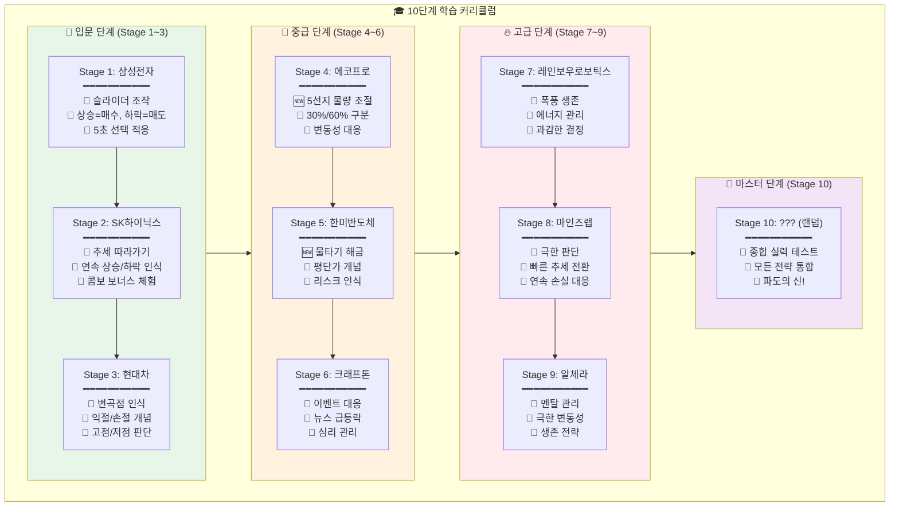
```mermaid
flowchart TD
    subgraph Curriculum["🎓 10단계 학습 커리큘럼"]
        
        subgraph Beginner["🌱 입문 단계 (Stage 1~3)"]
            direction TB
            B1["Stage 1: 삼성전자<br/>━━━━━━━━━━━<br/>🎯 슬라이더 조작<br/>🎯 상승=매수, 하락=매도<br/>🎯 5초 선택 적응"]
            B2["Stage 2: SK하이닉스<br/>━━━━━━━━━━━<br/>🎯 추세 따라가기<br/>🎯 연속 상승/하락 인식<br/>🎯 콤보 보너스 체험"]
            B3["Stage 3: 현대차<br/>━━━━━━━━━━━<br/>🎯 변곡점 인식<br/>🎯 익절/손절 개념<br/>🎯 고점/저점 판단"]
            B1 --> B2 --> B3
        end
        
        subgraph Intermediate["🌿 중급 단계 (Stage 4~6)"]
            direction TB
            I1["Stage 4: 에코프로<br/>━━━━━━━━━━━<br/>🆕 5선지 물량 조절<br/>🎯 30%/60% 구분<br/>🎯 변동성 대응"]
            I2["Stage 5: 한미반도체<br/>━━━━━━━━━━━<br/>🆕 물타기 해금<br/>🎯 평단가 개념<br/>🎯 리스크 인식"]
            I3["Stage 6: 크래프톤<br/>━━━━━━━━━━━<br/>🎯 이벤트 대응<br/>🎯 뉴스 급등락<br/>🎯 심리 관리"]
            I1 --> I2 --> I3
        end
        
        subgraph Advanced["🔥 고급 단계 (Stage 7~9)"]
            direction TB
            A1["Stage 7: 레인보우로보틱스<br/>━━━━━━━━━━━<br/>🎯 폭풍 생존<br/>🎯 에너지 관리<br/>🎯 과감한 결정"]
            A2["Stage 8: 마인즈랩<br/>━━━━━━━━━━━<br/>🎯 극한 판단<br/>🎯 빠른 추세 전환<br/>🎯 연속 손실 대응"]
            A3["Stage 9: 알체라<br/>━━━━━━━━━━━<br/>🎯 멘탈 관리<br/>🎯 극한 변동성<br/>🎯 생존 전략"]
            A1 --> A2 --> A3
        end
        
        subgraph Master["👑 마스터 단계 (Stage 10)"]
            M1["Stage 10: ??? (랜덤)<br/>━━━━━━━━━━━<br/>🎯 종합 실력 테스트<br/>🎯 모든 전략 통합<br/>🎯 파도의 신!"]
        end
        
        Beginner --> Intermediate --> Advanced --> Master
    end
    
    style Beginner fill:#e8f5e9
    style Intermediate fill:#fff3e0
    style Advanced fill:#ffebee
    style Master fill:#f3e5f5
```

---

## 📋 스테이지별 학습 상세표

### 입문 단계 (Stage 1~3)

| Stage | 종목 | 핵심 학습 | 새로운 개념 | 변동성 | 선택지 | 에너지 |
|:-----:|------|----------|-----------|:-----:|:-----:|:-----:|
| **1** | 삼성전자 | 슬라이더 조작 | 매수/매도/유지 | 1~2% | 3개 | 100% |
| **2** | SK하이닉스 | 추세 추종 | 콤보 보너스 | 2~3% | 3개 | 95% |
| **3** | 현대차 | 변곡점 인식 | 익절/손절 | 2~3% | 3개 | 90% |

### 중급 단계 (Stage 4~6)

| Stage | 종목 | 핵심 학습 | 새로운 개념 | 변동성 | 선택지 | 에너지 |
|:-----:|------|----------|-----------|:-----:|:-----:|:-----:|
| **4** | 에코프로 | 물량 조절 | 🆕 5선지 (30%/60%) | 4~6% | 5개 | 90% |
| **5** | 한미반도체 | 물타기 기술 | 🆕 물타기 버튼 | 5~7% | 5개 | 85% |
| **6** | 크래프톤 | 이벤트 대응 | 뉴스 시나리오 | 4~6% | 5개 | 80% |

### 고급 단계 (Stage 7~9)

| Stage | 종목 | 핵심 학습 | 새로운 개념 | 변동성 | 선택지 | 에너지 |
|:-----:|------|----------|-----------|:-----:|:-----:|:-----:|
| **7** | 레인보우로보틱스 | 폭풍 생존 | 에너지 시간감소 | 8~15% | 5개 | 75% |
| **8** | 마인즈랩 | 빠른 판단 | 다중 추세전환 | 10~20% | 5개 | 70% |
| **9** | 알체라 | 멘탈 관리 | 극한 변동성 | 15~30% | 5개 | 65% |

### 마스터 단계 (Stage 10)

| Stage | 종목 | 핵심 학습 | 새로운 개념 | 변동성 | 선택지 | 에너지 |
|:-----:|------|----------|-----------|:-----:|:-----:|:-----:|
| **10** | ??? (랜덤) | 종합 실력 | 랜덤 종목 | 20%+ | 5개 | 60% |

---

## 🎯 각 스테이지 학습 목표 상세

### Stage 1: 삼성전자 - 기초 조작

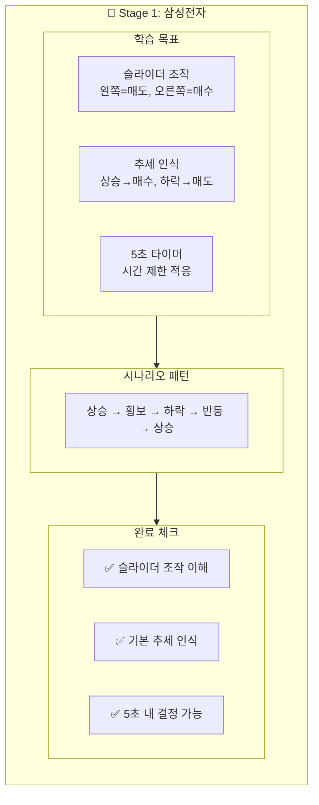
```mermaid
flowchart LR
    subgraph Stage1["🌱 Stage 1: 삼성전자"]
        subgraph Learn["학습 목표"]
            L1["슬라이더 조작<br/>왼쪽=매도, 오른쪽=매수"]
            L2["추세 인식<br/>상승→매수, 하락→매도"]
            L3["5초 타이머<br/>시간 제한 적응"]
        end
        
        subgraph Pattern["시나리오 패턴"]
            P1["상승 → 횡보 → 하락 → 반등 → 상승"]
        end
        
        subgraph Check["완료 체크"]
            C1["✅ 슬라이더 조작 이해"]
            C2["✅ 기본 추세 인식"]
            C3["✅ 5초 내 결정 가능"]
        end
        
        Learn --> Pattern --> Check
    end
```

**핵심 학습 포인트:**
- 슬라이더를 왼쪽으로 밀면 **매도** (팔기)
- 슬라이더를 오른쪽으로 밀면 **매수** (사기)
- 가운데 유지하면 **홀딩** (그대로)
- 상승 중일 때 매수하면 수익
- 하락 중일 때 매도하면 손실 방어

---

### Stage 2: SK하이닉스 - 추세 추종

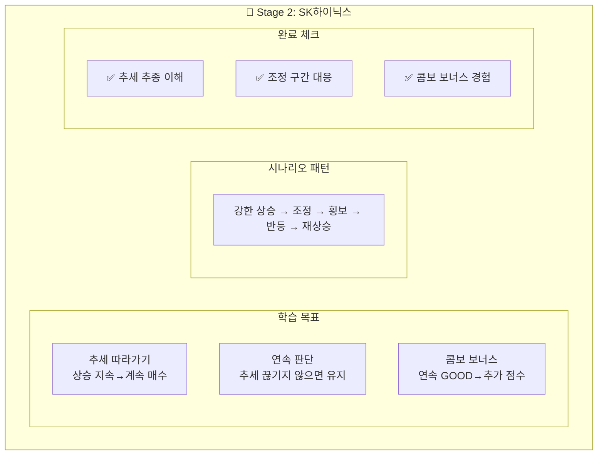
```mermaid
flowchart TD
    subgraph Stage2["🌱 Stage 2: SK하이닉스"]
        subgraph Learn["학습 목표"]
            L1["추세 따라가기<br/>상승 지속→계속 매수"]
            L2["연속 판단<br/>추세 끊기지 않으면 유지"]
            L3["콤보 보너스<br/>연속 GOOD→추가 점수"]
        end
        
        subgraph Pattern["시나리오 패턴"]
            P1["강한 상승 → 조정 → 횡보 → 반등 → 재상승"]
        end
        
        subgraph Check["완료 체크"]
            C1["✅ 추세 추종 이해"]
            C2["✅ 조정 구간 대응"]
            C3["✅ 콤보 보너스 경험"]
        end
    end
```

**핵심 학습 포인트:**
- 추세가 이어지면 **같은 방향 유지**
- 너무 빨리 방향 바꾸지 않기
- 연속 GOOD 이상 → **콤보 보너스**

---

### Stage 3: 현대차 - 변곡점 인식

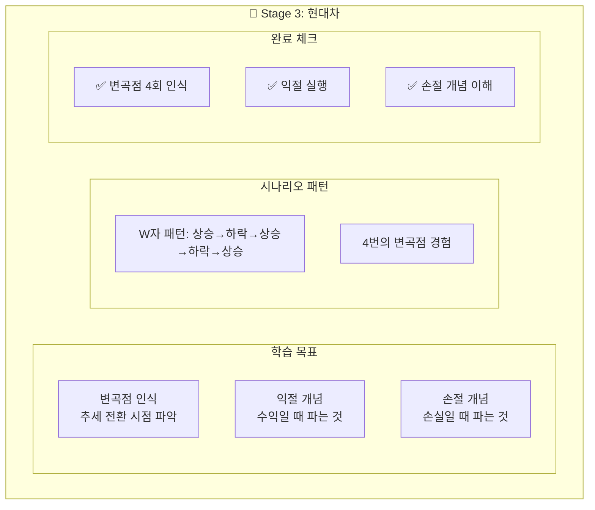
```mermaid
flowchart TD
    subgraph Stage3["🌿 Stage 3: 현대차"]
        subgraph Learn["학습 목표"]
            L1["변곡점 인식<br/>추세 전환 시점 파악"]
            L2["익절 개념<br/>수익일 때 파는 것"]
            L3["손절 개념<br/>손실일 때 파는 것"]
        end
        
        subgraph Pattern["시나리오 패턴"]
            P1["W자 패턴: 상승→하락→상승→하락→상승"]
            P2["4번의 변곡점 경험"]
        end
        
        subgraph Check["완료 체크"]
            C1["✅ 변곡점 4회 인식"]
            C2["✅ 익절 실행"]
            C3["✅ 손절 개념 이해"]
        end
    end
```

**핵심 학습 포인트:**
- **변곡점**: 추세가 바뀌는 순간
- **익절**: 수익 상태에서 매도 (수익 확정)
- **손절**: 손실 상태에서 매도 (손실 제한)
- 고점 근처에서 매도 = 현명한 익절

---

### Stage 4: 에코프로 - 물량 조절

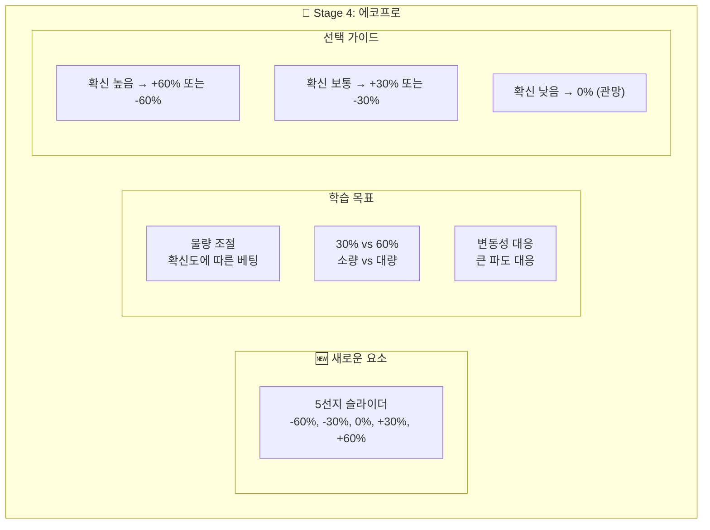
```mermaid
flowchart TD
    subgraph Stage4["🌿 Stage 4: 에코프로"]
        subgraph New["🆕 새로운 요소"]
            N1["5선지 슬라이더<br/>-60%, -30%, 0%, +30%, +60%"]
        end
        
        subgraph Learn["학습 목표"]
            L1["물량 조절<br/>확신도에 따른 베팅"]
            L2["30% vs 60%<br/>소량 vs 대량"]
            L3["변동성 대응<br/>큰 파도 대응"]
        end
        
        subgraph Guide["선택 가이드"]
            G1["확신 높음 → +60% 또는 -60%"]
            G2["확신 보통 → +30% 또는 -30%"]
            G3["확신 낮음 → 0% (관망)"]
        end
    end
```

**핵심 학습 포인트:**
- **+60%**: 강한 상승 확신 → 대량 매수
- **+30%**: 약한 상승 예상 → 소량 매수
- **0%**: 불확실 → 관망
- **-30%**: 약한 하락 예상 → 소량 매도
- **-60%**: 강한 하락 확신 → 대량 매도

---

### Stage 5: 한미반도체 - 물타기

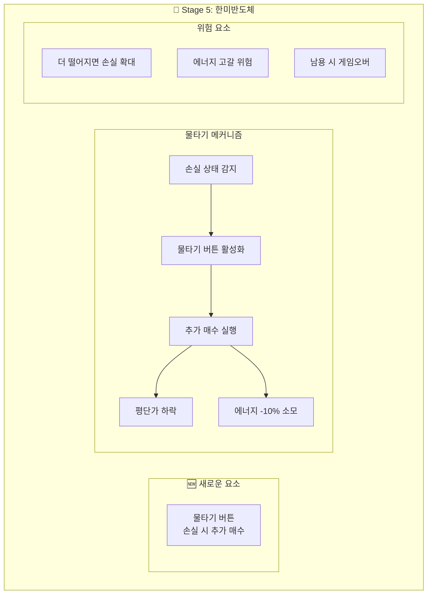
```mermaid
flowchart TD
    subgraph Stage5["🌿 Stage 5: 한미반도체"]
        subgraph New["🆕 새로운 요소"]
            N1["물타기 버튼<br/>손실 시 추가 매수"]
        end
        
        subgraph WaterDown["물타기 메커니즘"]
            W1["손실 상태 감지"]
            W2["물타기 버튼 활성화"]
            W3["추가 매수 실행"]
            W4["평단가 하락"]
            W5["에너지 -10% 소모"]
            W1 --> W2 --> W3 --> W4
            W3 --> W5
        end
        
        subgraph Risk["위험 요소"]
            R1["더 떨어지면 손실 확대"]
            R2["에너지 고갈 위험"]
            R3["남용 시 게임오버"]
        end
    end
```

**물타기 알고리즘:**

```
물타기 조건:
  IF 현재가 < 평단가 (손실 상태)
  AND 에너지 >= 20%
  AND 예수금 충분
  THEN 물타기 버튼 활성화

물타기 실행:
  새_평단가 = (기존_평단가 × 기존_수량 + 현재가 × 추가_수량) ÷ (기존_수량 + 추가_수량)
  에너지 -= 10%
```

---

### Stage 6: 크래프톤 - 이벤트 대응

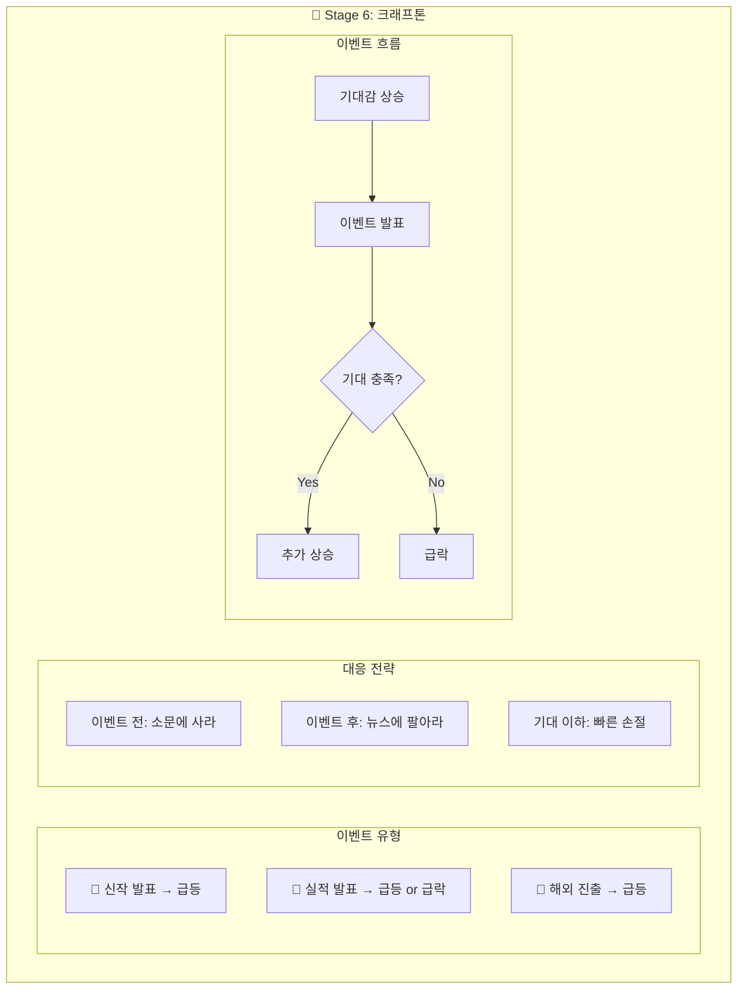
```mermaid
flowchart TD
    subgraph Stage6["🌿 Stage 6: 크래프톤"]
        subgraph Events["이벤트 유형"]
            E1["📰 신작 발표 → 급등"]
            E2["📰 실적 발표 → 급등 or 급락"]
            E3["📰 해외 진출 → 급등"]
        end
        
        subgraph Strategy["대응 전략"]
            S1["이벤트 전: 소문에 사라"]
            S2["이벤트 후: 뉴스에 팔아라"]
            S3["기대 이하: 빠른 손절"]
        end
        
        subgraph Flow["이벤트 흐름"]
            F1["기대감 상승"] --> F2["이벤트 발표"]
            F2 --> F3{"기대 충족?"}
            F3 -->|Yes| F4["추가 상승"]
            F3 -->|No| F5["급락"]
        end
    end
```

**핵심 학습 포인트:**
- **소문에 사서 뉴스에 팔아라**
- 이벤트 전 기대감 = 매수 기회
- 이벤트 후 = 익절 타이밍
- 기대 이하 = 빠른 손절

---

### Stage 7~9: 고급 단계 핵심

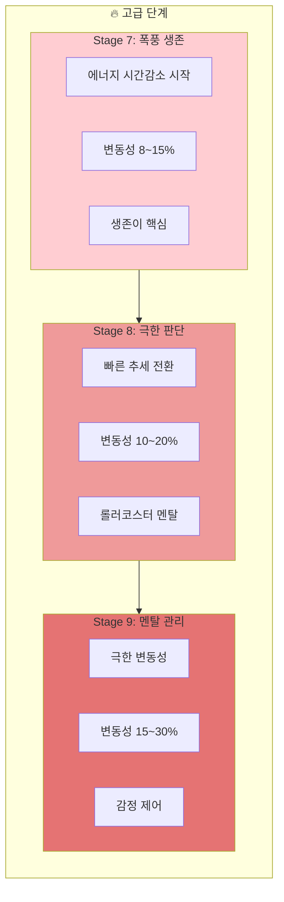
```mermaid
flowchart LR
    subgraph Advanced["🔥 고급 단계"]
        subgraph S7["Stage 7: 폭풍 생존"]
            S7_1["에너지 시간감소 시작"]
            S7_2["변동성 8~15%"]
            S7_3["생존이 핵심"]
        end
        
        subgraph S8["Stage 8: 극한 판단"]
            S8_1["빠른 추세 전환"]
            S8_2["변동성 10~20%"]
            S8_3["롤러코스터 멘탈"]
        end
        
        subgraph S9["Stage 9: 멘탈 관리"]
            S9_1["극한 변동성"]
            S9_2["변동성 15~30%"]
            S9_3["감정 제어"]
        end
        
        S7 --> S8 --> S9
    end
    
    style S7 fill:#ffcdd2
    style S8 fill:#ef9a9a
    style S9 fill:#e57373
```

---

### Stage 10: 최종 보스

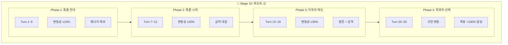
```mermaid
flowchart TD
    subgraph Final["👑 Stage 10: 파도의 신"]
        subgraph Phase1["Phase 1: 폭풍 전야"]
            P1_1["Turn 1~6"]
            P1_2["변동성 ±10%"]
            P1_3["에너지 확보"]
        end
        
        subgraph Phase2["Phase 2: 폭풍 시작"]
            P2_1["Turn 7~12"]
            P2_2["변동성 ±20%"]
            P2_3["급락 대응"]
        end
        
        subgraph Phase3["Phase 3: 지옥의 파도"]
            P3_1["Turn 13~19"]
            P3_2["변동성 ±30%"]
            P3_3["생존 + 공격"]
        end
        
        subgraph Phase4["Phase 4: 최후의 선택"]
            P4_1["Turn 20~25"]
            P4_2["극한 변동"]
            P4_3["목표 +100% 달성"]
        end
        
        Phase1 --> Phase2 --> Phase3 --> Phase4
    end
```

---

# 👤 PART 2: 유저 시나리오 상세

## 🔄 전체 게임 플로우

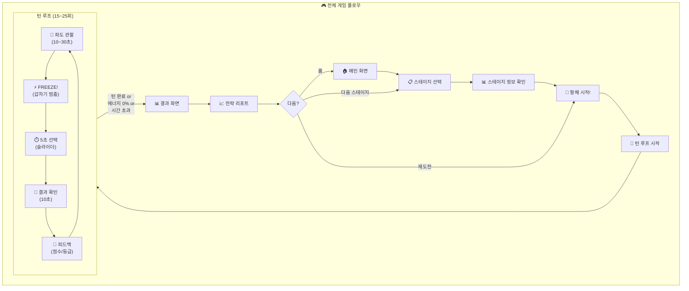
```mermaid
flowchart TD
    subgraph GameFlow["🎮 전체 게임 플로우"]
        Start["🏠 메인 화면"] --> Select["📋 스테이지 선택"]
        Select --> Info["📊 스테이지 정보 확인"]
        Info --> Ready["🚢 항해 시작!"]
        
        Ready --> TurnLoop["🔄 턴 루프 시작"]
        
        subgraph Loop["턴 루프 (15~25회)"]
            Wave["🌊 파도 관찰<br/>(10~30초)"]
            Freeze["⚡ FREEZE!<br/>(갑자기 멈춤)"]
            Choose["⏱️ 5초 선택<br/>(슬라이더)"]
            Result["🌊 결과 확인<br/>(10초)"]
            Feedback["🎉 피드백<br/>(점수/등급)"]
            
            Wave --> Freeze --> Choose --> Result --> Feedback --> Wave
        end
        
        TurnLoop --> Loop
        
        Loop --> |"턴 완료 or<br/>에너지 0% or<br/>시간 초과"| End["📊 결과 화면"]
        
        End --> Report["📈 전략 리포트"]
        Report --> Next{"다음?"}
        Next -->|"재도전"| Ready
        Next -->|"다음 스테이지"| Select
        Next -->|"홈"| Start
    end
```

---

## 📱 턴 진행 상세 시나리오

### 1️⃣ 파도 관찰 단계

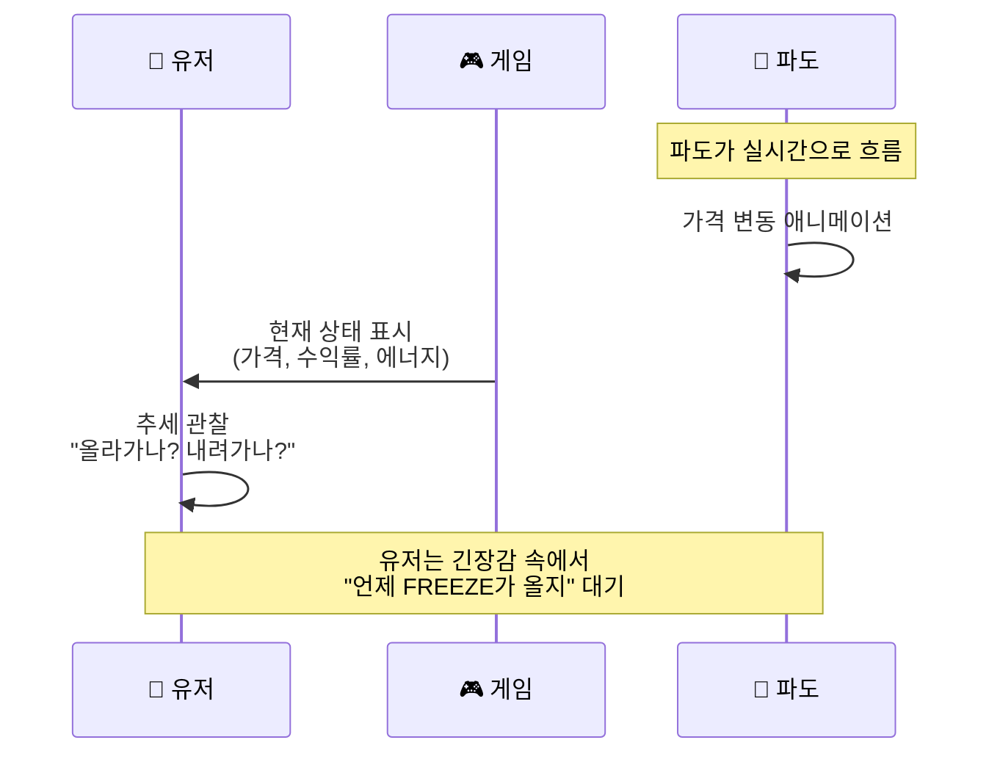
```mermaid
sequenceDiagram
    participant U as 👤 유저
    participant G as 🎮 게임
    participant W as 🌊 파도
    
    Note over W: 파도가 실시간으로 흐름
    
    W->>W: 가격 변동 애니메이션
    G->>U: 현재 상태 표시<br/>(가격, 수익률, 에너지)
    U->>U: 추세 관찰<br/>"올라가나? 내려가나?"
    
    Note over U,W: 유저는 긴장감 속에서<br/>"언제 FREEZE가 올지" 대기
```

**관찰 단계 UI 요소:**
- 실시간 파도(차트) 애니메이션
- 현재가, 변화율 표시
- 내 수익률, 보유량 표시
- 에너지 게이지

---

### 2️⃣ FREEZE 발동 단계

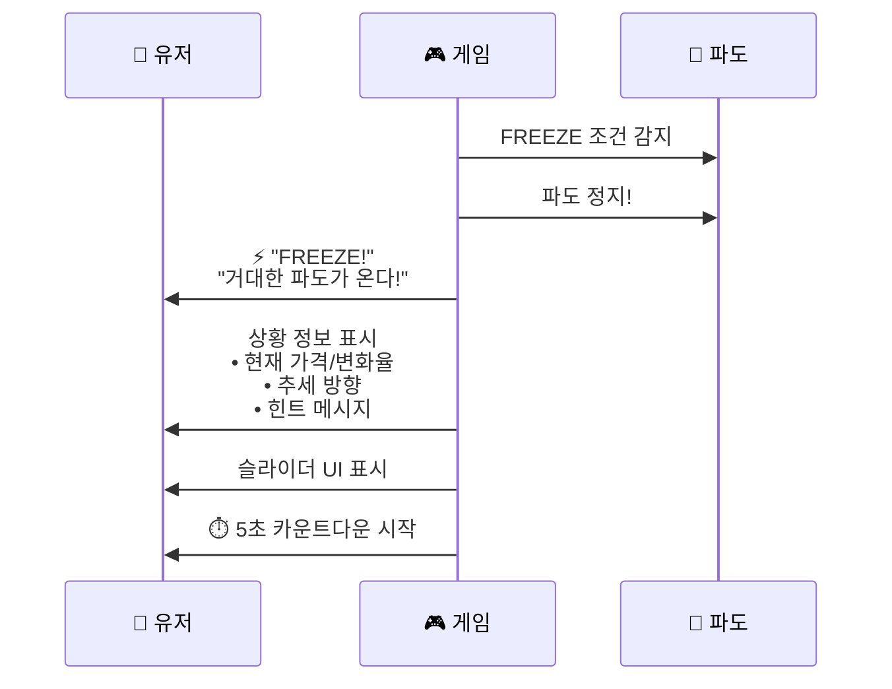
```mermaid
sequenceDiagram
    participant U as 👤 유저
    participant G as 🎮 게임
    participant W as 🌊 파도
    
    G->>W: FREEZE 조건 감지
    G->>W: 파도 정지!
    G->>U: ⚡ "FREEZE!"<br/>"거대한 파도가 온다!"
    
    G->>U: 상황 정보 표시<br/>• 현재 가격/변화율<br/>• 추세 방향<br/>• 힌트 메시지
    
    G->>U: 슬라이더 UI 표시
    G->>U: ⏱️ 5초 카운트다운 시작
```

**FREEZE 발동 조건:**
- 시나리오에 정의된 턴 시점
- 급등/급락 감지 (±3% 이상)
- 변곡점 감지 (추세 전환)
- 랜덤 발동 (긴장감 유지)

---

### 3️⃣ 5초 선택 단계

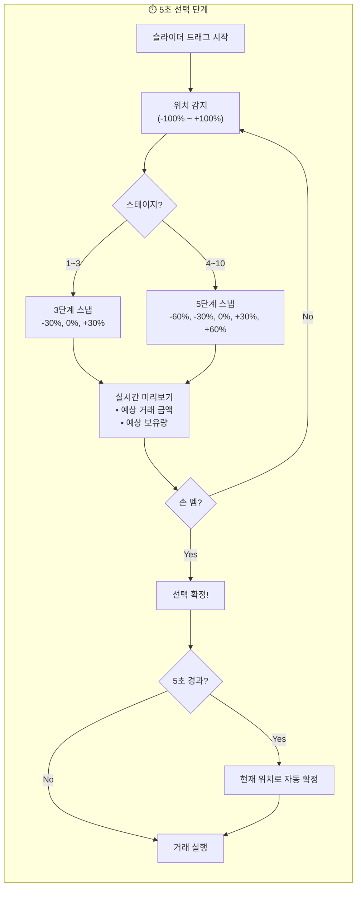
```mermaid
flowchart LR
    subgraph Selection["⏱️ 5초 선택 단계"]
        Start["슬라이더 드래그 시작"]
        
        Start --> Position["위치 감지<br/>(-100% ~ +100%)"]
        
        Position --> Stage{"스테이지?"}
        Stage -->|"1~3"| Snap3["3단계 스냅<br/>-30%, 0%, +30%"]
        Stage -->|"4~10"| Snap5["5단계 스냅<br/>-60%, -30%, 0%, +30%, +60%"]
        
        Snap3 --> Preview["실시간 미리보기<br/>• 예상 거래 금액<br/>• 예상 보유량"]
        Snap5 --> Preview
        
        Preview --> Release{"손 뗌?"}
        Release -->|"Yes"| Confirm["선택 확정!"]
        Release -->|"No"| Position
        
        Confirm --> Timeout{"5초 경과?"}
        Timeout -->|"Yes"| Auto["현재 위치로 자동 확정"]
        Timeout -->|"No"| Execute["거래 실행"]
        Auto --> Execute
    end
```

---

### 4️⃣ 결과 확인 단계

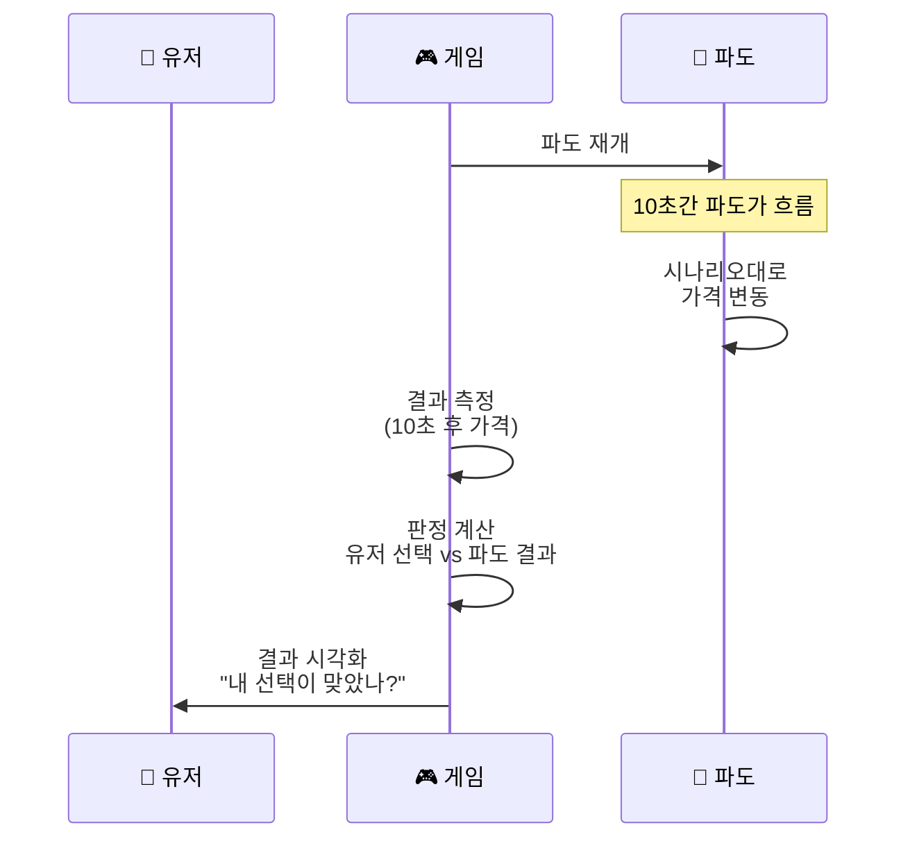
```mermaid
sequenceDiagram
    participant U as 👤 유저
    participant G as 🎮 게임
    participant W as 🌊 파도
    
    G->>W: 파도 재개
    
    Note over W: 10초간 파도가 흐름
    
    W->>W: 시나리오대로<br/>가격 변동
    
    G->>G: 결과 측정<br/>(10초 후 가격)
    
    G->>G: 판정 계산<br/>유저 선택 vs 파도 결과
    
    G->>U: 결과 시각화<br/>"내 선택이 맞았나?"
```

---

### 5️⃣ 피드백 단계

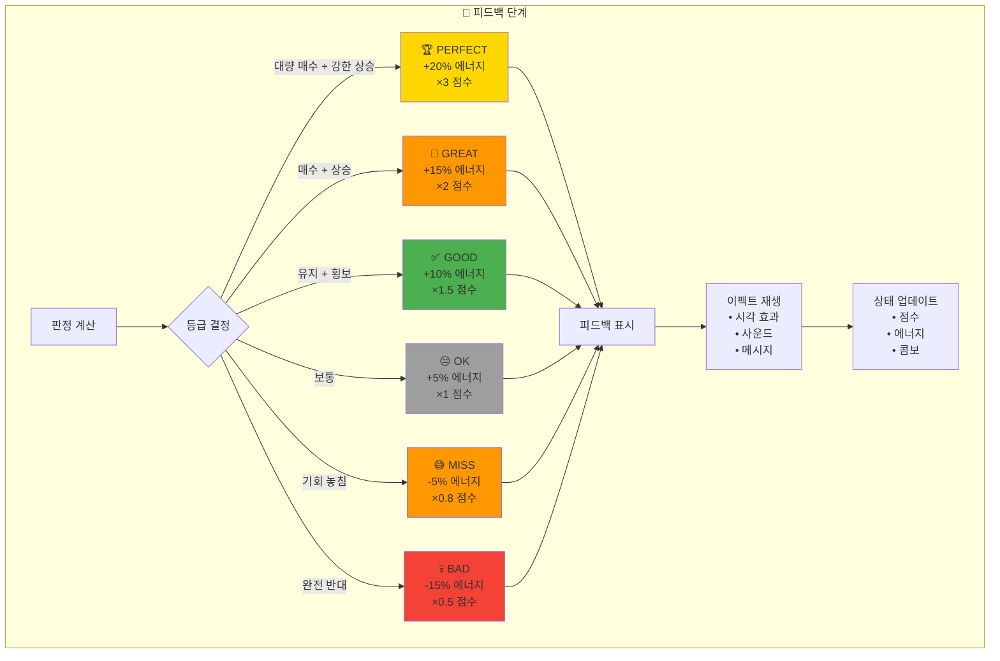
```mermaid
flowchart TD
    subgraph Feedback["🎉 피드백 단계"]
        Judge["판정 계산"] --> Grade{"등급 결정"}
        
        Grade -->|"대량 매수 + 강한 상승"| Perfect["🏆 PERFECT<br/>+20% 에너지<br/>×3 점수"]
        Grade -->|"매수 + 상승"| Great["🎉 GREAT<br/>+15% 에너지<br/>×2 점수"]
        Grade -->|"유지 + 횡보"| Good["✅ GOOD<br/>+10% 에너지<br/>×1.5 점수"]
        Grade -->|"보통"| Ok["😐 OK<br/>+5% 에너지<br/>×1 점수"]
        Grade -->|"기회 놓침"| Miss["😅 MISS<br/>-5% 에너지<br/>×0.8 점수"]
        Grade -->|"완전 반대"| Bad["💀 BAD<br/>-15% 에너지<br/>×0.5 점수"]
        
        Perfect --> Display["피드백 표시"]
        Great --> Display
        Good --> Display
        Ok --> Display
        Miss --> Display
        Bad --> Display
        
        Display --> Effect["이펙트 재생<br/>• 시각 효과<br/>• 사운드<br/>• 메시지"]
        
        Effect --> Update["상태 업데이트<br/>• 점수<br/>• 에너지<br/>• 콤보"]
    end
    
    style Perfect fill:#ffd700
    style Great fill:#ff9800
    style Good fill:#4caf50
    style Ok fill:#9e9e9e
    style Miss fill:#ff9800
    style Bad fill:#f44336
```

---

## 👤 유저 플레이 패턴별 시나리오

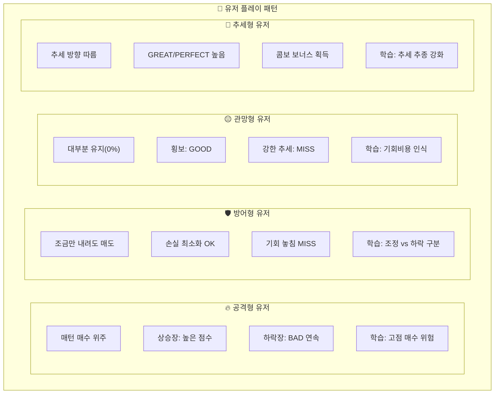
```mermaid
flowchart TD
    subgraph Patterns["👤 유저 플레이 패턴"]
        
        subgraph Aggressive["🔥 공격형 유저"]
            AG1["매턴 매수 위주"]
            AG2["상승장: 높은 점수"]
            AG3["하락장: BAD 연속"]
            AG4["학습: 고점 매수 위험"]
        end
        
        subgraph Defensive["🛡️ 방어형 유저"]
            DF1["조금만 내려도 매도"]
            DF2["손실 최소화 OK"]
            DF3["기회 놓침 MISS"]
            DF4["학습: 조정 vs 하락 구분"]
        end
        
        subgraph Observer["😐 관망형 유저"]
            OB1["대부분 유지(0%)"]
            OB2["횡보: GOOD"]
            OB3["강한 추세: MISS"]
            OB4["학습: 기회비용 인식"]
        end
        
        subgraph Trend["🎯 추세형 유저"]
            TR1["추세 방향 따름"]
            TR2["GREAT/PERFECT 높음"]
            TR3["콤보 보너스 획득"]
            TR4["학습: 추세 추종 강화"]
        end
    end
```

---

# ⚙️ PART 3: 개발 알고리즘 상세

## 🏗️ 전체 시스템 아키텍처

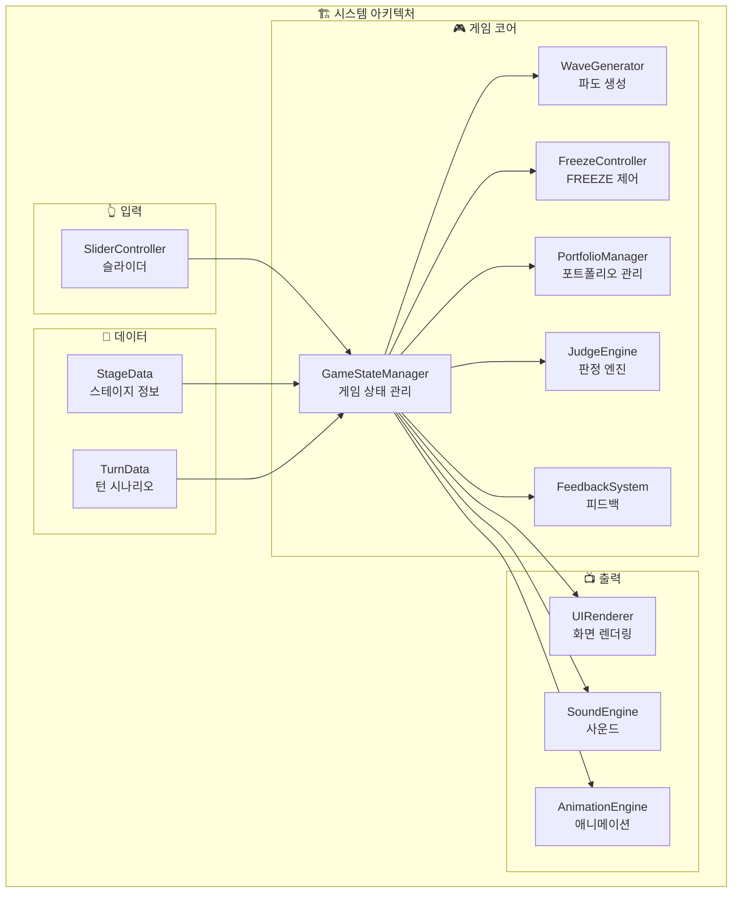
```mermaid
flowchart TB
    subgraph Architecture["🏗️ 시스템 아키텍처"]
        
        subgraph Core["🎮 게임 코어"]
            GS[GameStateManager<br/>게임 상태 관리]
            GS --> WG[WaveGenerator<br/>파도 생성]
            GS --> FC[FreezeController<br/>FREEZE 제어]
            GS --> PM[PortfolioManager<br/>포트폴리오 관리]
            GS --> JE[JudgeEngine<br/>판정 엔진]
            GS --> FS[FeedbackSystem<br/>피드백]
        end
        
        subgraph Input["👆 입력"]
            SC[SliderController<br/>슬라이더]
            SC --> GS
        end
        
        subgraph Output["📺 출력"]
            GS --> UI[UIRenderer<br/>화면 렌더링]
            GS --> SE[SoundEngine<br/>사운드]
            GS --> AN[AnimationEngine<br/>애니메이션]
        end
        
        subgraph Data["📁 데이터"]
            SD[StageData<br/>스테이지 정보]
            TD[TurnData<br/>턴 시나리오]
            SD --> GS
            TD --> GS
        end
    end
```

---

## 🌊 파도 생성 알고리즘

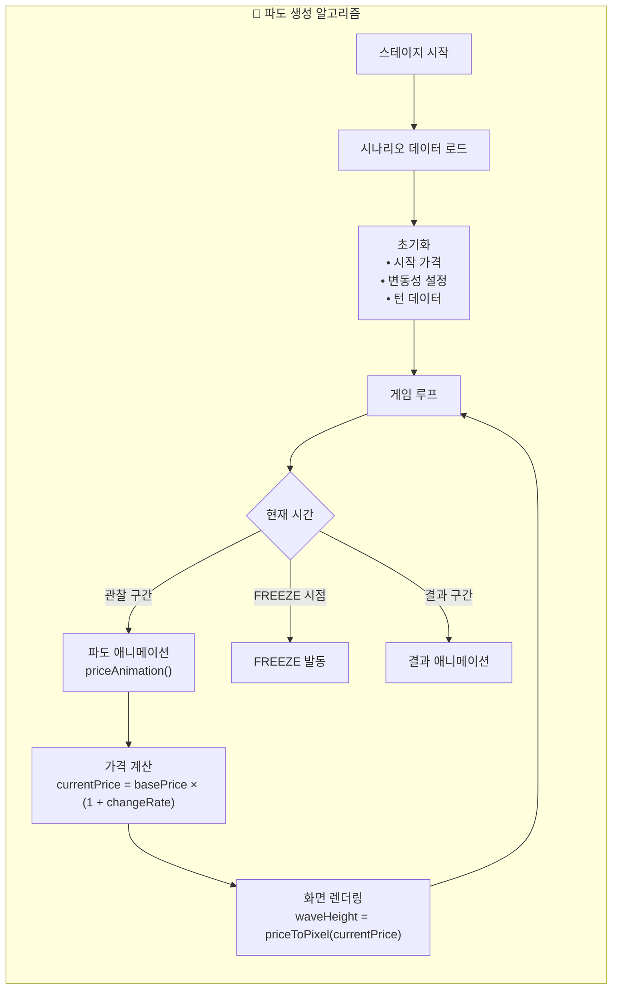
```mermaid
flowchart LR
    subgraph WaveGenerator["🌊 파도 생성 알고리즘"]
        
        Start["스테이지 시작"] --> Load["시나리오 데이터 로드"]
        
        Load --> Init["초기화<br/>• 시작 가격<br/>• 변동성 설정<br/>• 턴 데이터"]
        
        Init --> Loop["게임 루프"]
        
        Loop --> Time{"현재 시간"}
        
        Time --> |"관찰 구간"| Wave["파도 애니메이션<br/>priceAnimation()"]
        Time --> |"FREEZE 시점"| Freeze["FREEZE 발동"]
        Time --> |"결과 구간"| Result["결과 애니메이션"]
        
        Wave --> Calc["가격 계산<br/>currentPrice = basePrice × (1 + changeRate)"]
        
        Calc --> Render["화면 렌더링<br/>waveHeight = priceToPixel(currentPrice)"]
        
        Render --> Loop
    end
```

### 파도 높이 계산 공식

```
// 가격 → 파도 높이 변환
function priceToWaveHeight(currentPrice, basePrice, scaleFactor):
    changeRate = (currentPrice - basePrice) / basePrice × 100
    waveHeight = CENTER_LINE + (changeRate × scaleFactor)
    return waveHeight

// 스테이지별 스케일 팩터
scaleFactor = {
    Stage 1~3:  50   // 작은 파도
    Stage 4~6:  100  // 중간 파도
    Stage 7~9:  150  // 큰 파도
    Stage 10:   200  // 극한 파도
}
```

---

## ⚡ FREEZE 시스템 알고리즘

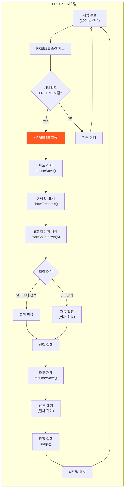
```mermaid
flowchart LR
    subgraph FreezeSystem["⚡ FREEZE 시스템"]
        
        Loop["게임 루프<br/>(100ms 간격)"] --> Check["FREEZE 조건 체크"]
        
        Check --> C1{"시나리오<br/>FREEZE 시점?"}
        C1 -->|"Yes"| Trigger["⚡ FREEZE 발동!"]
        C1 -->|"No"| Continue["계속 진행"]
        
        Continue --> Loop
        
        Trigger --> Pause["파도 정지<br/>pauseWave()"]
        
        Pause --> ShowUI["선택 UI 표시<br/>showFreezeUI()"]
        
        ShowUI --> Timer["5초 타이머 시작<br/>startCountdown(5)"]
        
        Timer --> Input{"입력 대기"}
        
        Input -->|"슬라이더 선택"| Confirm["선택 확정"]
        Input -->|"5초 경과"| Auto["자동 확정<br/>(현재 위치)"]
        
        Confirm --> Execute["선택 실행"]
        Auto --> Execute
        
        Execute --> Resume["파도 재개<br/>resumeWave()"]
        
        Resume --> Wait["10초 대기<br/>(결과 확인)"]
        
        Wait --> Judge["판정 실행<br/>judge()"]
        
        Judge --> Feedback["피드백 표시"]
        
        Feedback --> Loop
    end
    
    style Trigger fill:#ff5722,color:#fff
```

### FREEZE 상태 머신

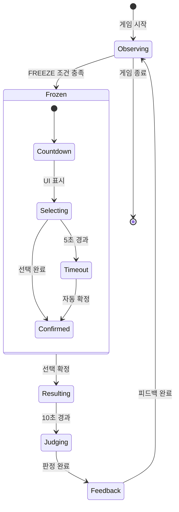
```mermaid
stateDiagram-v2
    [*] --> Observing: 게임 시작
    
    Observing --> Frozen: FREEZE 조건 충족
    
    state Frozen {
        [*] --> Countdown
        Countdown --> Selecting: UI 표시
        Selecting --> Confirmed: 선택 완료
        Selecting --> Timeout: 5초 경과
        Timeout --> Confirmed: 자동 확정
    }
    
    Frozen --> Resulting: 선택 확정
    Resulting --> Judging: 10초 경과
    Judging --> Feedback: 판정 완료
    Feedback --> Observing: 피드백 완료
    
    Observing --> [*]: 게임 종료
```

---

## 🎚️ 슬라이더 입력 알고리즘

```mermaid
flowchart TD
    subgraph SliderInput["🎚️ 슬라이더 입력"]
        
        Start["터치/드래그 시작"] --> Track["위치 추적<br/>rawPosition (-100 ~ +100)"]
        
        Track --> Stage{"스테이지 체크"}
        
        Stage -->|"1~3"| Snap3["3단계 스냅<br/>snapPoints = [-30, 0, +30]"]
        Stage -->|"4~10"| Snap5["5단계 스냅<br/>snapPoints = [-60, -30, 0, +30, +60]"]
        
        Snap3 --> FindNearest["가장 가까운 스냅 포인트 찾기"]
        Snap5 --> FindNearest
        
        FindNearest --> Snap["스냅 적용<br/>snappedValue = nearestPoint"]
        
        Snap --> Preview["실시간 미리보기<br/>• 예상 거래량<br/>• 예상 결과"]
        
        Preview --> Release{"손 뗌?"}
        
        Release -->|"Yes"| Confirm["선택 확정<br/>confirmChoice(snappedValue)"]
        Release -->|"No"| Track
    end
```

### 스냅 알고리즘 (Pseudo Code)

```python
def snap_to_grid(raw_position, stage_level):
    """슬라이더 위치를 스냅 포인트에 맞춤"""
    
    # 스테이지별 스냅 포인트 설정
    if stage_level <= 3:
        snap_points = [-30, 0, 30]  # 3선지
    else:
        snap_points = [-60, -30, 0, 30, 60]  # 5선지
    
    # 가장 가까운 스냅 포인트 찾기
    min_distance = float('inf')
    snapped_value = 0
    
    for point in snap_points:
        distance = abs(raw_position - point)
        if distance < min_distance:
            min_distance = distance
            snapped_value = point
    
    return snapped_value
```

---

## 📊 판정 엔진 알고리즘

```mermaid
flowchart TD
    subgraph JudgeEngine["📊 판정 엔진"]
        
        Input["입력 데이터<br/>• 유저 선택 (choice)<br/>• 파도 결과 (waveResult)"]
        
        Input --> Categorize["카테고리화"]
        
        Categorize --> ChoiceType{"유저 선택<br/>분류"}
        ChoiceType -->|"choice > 0"| Buy["BUY (매수)"]
        ChoiceType -->|"choice = 0"| Hold["HOLD (유지)"]
        ChoiceType -->|"choice < 0"| Sell["SELL (매도)"]
        
        Categorize --> ResultType{"파도 결과<br/>분류"}
        ResultType -->|"result > 1%"| Up["UP (상승)"]
        ResultType -->|"-1% < result < 1%"| Flat["FLAT (횡보)"]
        ResultType -->|"result < -1%"| Down["DOWN (하락)"]
        
        Buy --> Matrix["판정 매트릭스 조회"]
        Hold --> Matrix
        Sell --> Matrix
        Up --> Matrix
        Flat --> Matrix
        Down --> Matrix
        
        Matrix --> Grade["등급 결정"]
        
        Grade --> Perfect["🏆 PERFECT<br/>대량 매수 + 강한 상승<br/>대량 매도 + 강한 하락"]
        Grade --> Great["🎉 GREAT<br/>매수 + 상승<br/>매도 + 하락"]
        Grade --> Good["✅ GOOD<br/>유지 + 횡보"]
        Grade --> Ok["😐 OK<br/>방향 맞음, 강도 약함"]
        Grade --> Miss["😅 MISS<br/>유지 + 강한 변동"]
        Grade --> Bad["💀 BAD<br/>매수 + 하락<br/>매도 + 상승"]
    end
```

### 판정 매트릭스 테이블

| 유저 선택 | 파도 결과 | 판정 | 에너지 | 점수 배율 |
|:--------:|:--------:|:----:|:-----:|:--------:|
| +60% (대량 매수) | +5%↑ (강한 상승) | PERFECT | +20% | ×3.0 |
| +30% (매수) | +3%↑ (상승) | GREAT | +15% | ×2.0 |
| +30% (매수) | ±1% (횡보) | OK | +5% | ×1.0 |
| +30% (매수) | -3%↓ (하락) | BAD | -15% | ×0.5 |
| 0% (유지) | ±2% (횡보) | GOOD | +10% | ×1.5 |
| 0% (유지) | +5%↑ (강한 상승) | MISS | -5% | ×0.8 |
| -30% (매도) | -3%↓ (하락) | GREAT | +15% | ×2.0 |
| -60% (대량 매도) | -5%↓ (강한 하락) | PERFECT | +20% | ×3.0 |
| -30% (매도) | +3%↑ (상승) | BAD | -15% | ×0.5 |

---

## 🆘 물타기 알고리즘

```mermaid
flowchart LR
    subgraph WaterDown["🆘 물타기 알고리즘"]
        
        Trigger["물타기 버튼 탭"] --> V1{"스테이지 >= 5?"}
        
        V1 -->|"No"| Fail1["❌ 해금 안됨"]
        V1 -->|"Yes"| V2{"손실 상태?<br/>(현재가 < 평단가)"}
        
        V2 -->|"No"| Fail2["❌ 손실 상태 아님"]
        V2 -->|"Yes"| V3{"에너지 >= 20%?"}
        
        V3 -->|"No"| Fail3["❌ 에너지 부족"]
        V3 -->|"Yes"| V4{"예수금 충분?"}
        
        V4 -->|"No"| Fail4["❌ 자금 부족"]
        V4 -->|"Yes"| Execute["✅ 물타기 실행!"]
        
        Execute --> Calc["계산"]
        
        Calc --> C1["추가 수량 = 예수금 × 30% ÷ 현재가"]
        Calc --> C2["새 평단가 = (기존평단×기존수량 + 현재가×추가수량) ÷ 총수량"]
        Calc --> C3["에너지 -= 10%"]
        
        C1 --> Apply["적용"]
        C2 --> Apply
        C3 --> Apply
        
        Apply --> Result["물타기 완료<br/>• 보유량 증가<br/>• 평단가 하락<br/>• 예수금 감소<br/>• 에너지 감소"]
    end
    
    style Execute fill:#ff9800,color:#fff
    style Result fill:#4caf50,color:#fff
```

### 물타기 계산 공식

```python
def execute_water_down(portfolio, current_price, deposit):
    """물타기 실행"""
    
    # 추가 매수 금액 (예수금의 30%)
    buy_amount = deposit * 0.3
    
    # 추가 매수 수량
    additional_qty = int(buy_amount / current_price)
    
    # 새 평단가 계산 (가중평균)
    old_total = portfolio.avg_price * portfolio.quantity
    new_total = current_price * additional_qty
    new_avg_price = (old_total + new_total) / (portfolio.quantity + additional_qty)
    
    # 적용
    portfolio.quantity += additional_qty
    portfolio.avg_price = new_avg_price
    portfolio.deposit -= additional_qty * current_price
    portfolio.energy -= 10
    
    return {
        'new_quantity': portfolio.quantity,
        'new_avg_price': new_avg_price,
        'energy_used': 10,
        'breakeven_improvement': (old_avg_price - new_avg_price) / old_avg_price * 100
    }
```

---

## ⚡ 에너지 관리 알고리즘

```mermaid
flowchart TD
    subgraph EnergySystem["⚡ 에너지 시스템"]
        
        subgraph Gain["에너지 획득"]
            G1["PERFECT: +20%"]
            G2["GREAT: +15%"]
            G3["GOOD: +10%"]
            G4["OK: +5%"]
            G5["콤보 보너스: +5%"]
        end
        
        subgraph Loss["에너지 손실"]
            L1["MISS: -5%"]
            L2["BAD: -15%"]
            L3["물타기: -10%"]
            L4["시간 감소: -1~2%/30초<br/>(Stage 7+)"]
        end
        
        subgraph State["에너지 상태"]
            S1{"에너지 체크"}
            S1 -->|"70%+"| Safe["✅ 안전<br/>적극적 플레이"]
            S1 -->|"40~70%"| Caution["⚠️ 주의<br/>신중한 플레이"]
            S1 -->|"20~40%"| Danger["🔴 위험<br/>보수적 플레이"]
            S1 -->|"0~20%"| Critical["💀 위기<br/>생존 모드"]
            S1 -->|"0%"| GameOver["☠️ 게임오버"]
        end
    end
    
    style Safe fill:#4caf50,color:#fff
    style Caution fill:#ff9800,color:#fff
    style Danger fill:#f44336,color:#fff
    style Critical fill:#9c27b0,color:#fff
    style GameOver fill:#000,color:#fff
```

---

## 🏆 점수 계산 알고리즘

```mermaid
flowchart LR
    subgraph ScoreCalc["🏆 점수 계산"]
        
        Base["기본 점수<br/>baseScore"]
        
        Base --> Judgment["× 판정 배율<br/>judgmentMultiplier"]
        
        Judgment --> Combo["× 콤보 배율<br/>comboMultiplier"]
        
        Combo --> Stage["× 스테이지 배율<br/>stageMultiplier"]
        
        Stage --> Final["= 최종 점수<br/>finalScore"]
    end
```

### 점수 계산 공식

```python
def calculate_score(judgment, combo_count, stage_level):
    """점수 계산"""
    
    # 기본 점수
    base_scores = {
        'PERFECT': 300,
        'GREAT': 200,
        'GOOD': 150,
        'OK': 100,
        'MISS': 50,
        'BAD': 25
    }
    base_score = base_scores[judgment]
    
    # 판정 배율
    judgment_multipliers = {
        'PERFECT': 3.0,
        'GREAT': 2.0,
        'GOOD': 1.5,
        'OK': 1.0,
        'MISS': 0.8,
        'BAD': 0.5
    }
    judgment_mult = judgment_multipliers[judgment]
    
    # 콤보 배율 (최대 2.0)
    combo_mult = min(1.0 + (combo_count * 0.1), 2.0)
    
    # 스테이지 배율
    stage_mult = 1.0 + (stage_level * 0.2)
    
    # 최종 점수
    final_score = int(base_score * judgment_mult * combo_mult * stage_mult)
    
    return final_score
```

---

## 📊 턴 데이터 구조 (JSON)

```json
{
  "stageId": "STAGE_01",
  "stockName": "삼성전자",
  "stockCode": "005930",
  "difficulty": 1,
  "targetReturn": 5,
  "timeLimit": 180,
  "startEnergy": 100,
  "choiceOptions": [-30, 0, 30],
  "enableWaterDown": false,
  "startCondition": {
    "capital": 10000000,
    "quantity": 100,
    "avgPrice": 70000,
    "currentPrice": 71500,
    "deposit": 3000000
  },
  "turns": [
    {
      "turnId": 1,
      "waveStatus": {
        "currentPrice": 71500,
        "changeRate": 0.7,
        "trend": "UP",
        "todayHigh": 71800,
        "todayLow": 71000
      },
      "situation": {
        "title": "작은 파도가 밀려온다",
        "description": "장 초반 완만한 상승세",
        "hint": "파도가 올라가고 있을 때는 짐을 실어볼까요?"
      },
      "result": {
        "afterWave": 1.2,
        "perfectChoice": 30,
        "greatChoices": [30],
        "goodChoices": [0],
        "badChoices": [-30]
      },
      "feedback": {
        "perfect": "완벽! 상승 초기에 올라탔어요!",
        "great": "좋아요! 추세를 잘 탔어요!",
        "good": "괜찮아요, 지켜보는 것도 방법이에요",
        "miss": "앗, 좋은 파도였는데...",
        "bad": "이런! 올라가는데 팔았네요..."
      }
    }
  ]
}
```

---

## 🎮 게임 상태 머신

```mermaid
stateDiagram-v2
    [*] --> MainMenu
    
    MainMenu --> StageSelect: 게임 시작
    StageSelect --> StageInfo: 스테이지 선택
    StageInfo --> Loading: 항해 시작
    Loading --> Playing: 로딩 완료
    
    state Playing {
        [*] --> Observing
        
        Observing --> Frozen: FREEZE 조건
        
        state Frozen {
            [*] --> ShowUI
            ShowUI --> Countdown
            Countdown --> WaitInput
            WaitInput --> Confirmed: 선택/타임아웃
        }
        
        Frozen --> Resulting: 선택 확정
        Resulting --> Judging: 10초 경과
        Judging --> Feedback: 판정 완료
        Feedback --> Observing: 다음 턴
        
        Observing --> [*]: 게임 종료 조건
    }
    
    Playing --> Result: 종료 (완료/실패/시간초과)
    Result --> Report: 리포트 보기
    Report --> StageSelect: 재시도/다음
    Report --> MainMenu: 홈으로
```

---

## 📁 개발 모듈 구조

```
src/
├── core/
│   ├── GameStateManager.ts     # 게임 상태 관리
│   ├── WaveGenerator.ts        # 파도 생성
│   ├── FreezeController.ts     # FREEZE 제어
│   ├── PortfolioManager.ts     # 포트폴리오 관리
│   ├── JudgeEngine.ts          # 판정 엔진
│   └── FeedbackSystem.ts       # 피드백 시스템
│
├── input/
│   └── SliderController.ts     # 슬라이더 입력
│
├── ui/
│   ├── WaveRenderer.ts         # 파도 렌더링
│   ├── FreezeUI.ts             # FREEZE 화면
│   ├── FeedbackUI.ts           # 피드백 화면
│   └── ReportUI.ts             # 리포트 화면
│
├── data/
│   ├── StageData.ts            # 스테이지 데이터
│   └── TurnData.ts             # 턴 시나리오 데이터
│
└── utils/
    ├── ScoreCalculator.ts      # 점수 계산
    ├── EnergyManager.ts        # 에너지 관리
    └── WaterDownCalculator.ts  # 물타기 계산
```

---

## ✅ 개발 체크리스트

### 핵심 기능

- [ ] 파도 생성 시스템 (WaveGenerator)
- [ ] FREEZE 시스템 (FreezeController)
- [ ] 슬라이더 입력 (SliderController)
- [ ] 판정 엔진 (JudgeEngine)
- [ ] 피드백 시스템 (FeedbackSystem)
- [ ] 리포트 시스템 (ReportGenerator)

### 데이터

- [ ] 10개 스테이지 JSON 데이터
- [ ] 190+ 턴 시나리오 데이터
- [ ] 피드백 메시지 데이터

### UI/UX

- [ ] 파도 애니메이션
- [ ] 슬라이더 UI
- [ ] FREEZE 화면
- [ ] 피드백 이펙트
- [ ] 리포트 화면

---

시나리오 폴더의 내용을 분석하고 종합적인 가이드 문서를 작성하겠습니다.

[3 tools called]

이제 종합적인 가이드 문서를 새로 작성하겠습니다.

[1 tool called]

`SCENARIO_MASTER_GUIDE.md` 파일을 생성했습니다. 이제 전체 내용을 요약해 드리겠습니다.

---

## ✅ 생성 완료: 시나리오 마스터 가이드

### 📁 파일 위치
`document/scenarios/SCENARIO_MASTER_GUIDE.md`

---

## 📊 문서 구성

### PART 1: 단계별 학습 목표 상세

```mermaid
flowchart LR
    subgraph Summary["📚 학습 로드맵 요약"]
        B["🌱 입문<br/>Stage 1~3<br/>━━━━━<br/>슬라이더 조작<br/>추세 인식<br/>변곡점 파악"]
        I["🌿 중급<br/>Stage 4~6<br/>━━━━━<br/>5선지 물량조절<br/>물타기 해금<br/>이벤트 대응"]
        A["🔥 고급<br/>Stage 7~9<br/>━━━━━<br/>폭풍 생존<br/>에너지 관리<br/>멘탈 관리"]
        M["👑 마스터<br/>Stage 10<br/>━━━━━<br/>종합 실력<br/>랜덤 종목<br/>+100% 목표"]
        
        B --> I --> A --> M
    end
```

| 단계 | Stage | 핵심 학습 | 새로운 요소 | 변동성 |
|:---:|:-----:|---------|-----------|:-----:|
| 입문 | 1~3 | 조작, 추세, 변곡점 | 3선지 | 1~3% |
| 중급 | 4~6 | 물량조절, 물타기, 이벤트 | 5선지, 물타기 | 4~7% |
| 고급 | 7~9 | 생존, 판단, 멘탈 | 에너지 감소 | 8~30% |
| 마스터 | 10 | 종합 실력 | 랜덤 종목 | 20%+ |

---

### PART 2: 유저 시나리오 상세

```mermaid
flowchart TD
    subgraph TurnCycle["🔄 한 턴 사이클"]
        A["🌊 파도 관찰<br/>(10~30초)"]
        B["⚡ FREEZE!<br/>(갑자기 멈춤)"]
        C["⏱️ 5초 선택<br/>(슬라이더)"]
        D["🌊 결과 확인<br/>(10초)"]
        E["🎉 피드백<br/>(점수/등급)"]
        
        A --> B --> C --> D --> E --> A
    end
```

**5단계 턴 흐름:**
1. **관찰**: 파도 흐름 관찰, 긴장감 조성
2. **FREEZE**: 갑자기 멈춤, 상황 정보 표시
3. **선택**: 5초 내 슬라이더로 선택
4. **결과**: 10초간 파도 재개, 결과 확인
5. **피드백**: 등급, 점수, 에너지 변화

---

### PART 3: 개발 알고리즘 상세

```mermaid
flowchart TB
    subgraph Algorithms["⚙️ 핵심 알고리즘"]
        A1["🌊 파도 생성<br/>WaveGenerator"]
        A2["⚡ FREEZE 제어<br/>FreezeController"]
        A3["🎚️ 슬라이더 입력<br/>SliderController"]
        A4["📊 판정 엔진<br/>JudgeEngine"]
        A5["🎉 피드백 시스템<br/>FeedbackSystem"]
        A6["🆘 물타기 계산<br/>WaterDownCalculator"]
        A7["⚡ 에너지 관리<br/>EnergyManager"]
        A8["🏆 점수 계산<br/>ScoreCalculator"]
    end
```

---

## 📋 핵심 알고리즘 요약

### 1️⃣ 슬라이더 스냅 알고리즘

```
IF stage <= 3:
    snapPoints = [-30, 0, +30]  // 3선지
ELSE:
    snapPoints = [-60, -30, 0, +30, +60]  // 5선지

snappedValue = findNearest(rawPosition, snapPoints)
```

### 2️⃣ 판정 매트릭스

| 선택 | 결과 | 판정 | 에너지 | 배율 |
|:---:|:---:|:---:|:-----:|:---:|
| 매수 | 상승 | GREAT | +15% | ×2 |
| 매수 | 하락 | BAD | -15% | ×0.5 |
| 유지 | 횡보 | GOOD | +10% | ×1.5 |
| 매도 | 하락 | GREAT | +15% | ×2 |

### 3️⃣ 물타기 공식

```
새_평단가 = (기존_평단가 × 기존_수량 + 현재가 × 추가_수량) ÷ 총_수량
에너지 -= 10%
```

### 4️⃣ 점수 계산 공식

```
최종점수 = 기본점수 × 판정배율 × 콤보배율 × 스테이지배율
```

---

## 📁 전체 시나리오 파일 구조

```
document/scenarios/
├── REQUIREMENTS_ANALYSIS.md      # 요구사항 분석
├── SCENARIO_MASTER_GUIDE.md      # 🆕 마스터 가이드 (종합)
├── STAGE_01_SAMSUNG.md           # Stage 1: 삼성전자 (15턴)
├── STAGE_02_SKHYNIX.md           # Stage 2: SK하이닉스 (16턴)
├── STAGE_03_HYUNDAI.md           # Stage 3: 현대차 (17턴)
├── STAGE_04_ECOPRO.md            # Stage 4: 에코프로 (18턴)
├── STAGE_05_HANMI.md             # Stage 5: 한미반도체 (18턴)
├── STAGE_06_KRAFTON.md           # Stage 6: 크래프톤 (19턴)
├── STAGE_07_RAINBOW.md           # Stage 7: 레인보우로보틱스 (20턴)
├── STAGE_08_MINDSLAB.md          # Stage 8: 마인즈랩 (20턴)
├── STAGE_09_ALCHERA.md           # Stage 9: 알체라 (22턴)
└── STAGE_10_RANDOM.md            # Stage 10: 랜덤 (25턴)
```

---

이제 **학습 목표, 유저 시나리오, 개발 알고리즘**이 모두 도식화와 표로 정리된 종합 가이드가 완성되었습니다! 🎉

**문서 끝**
