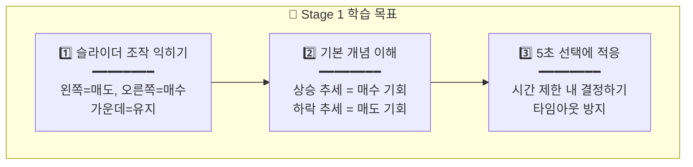
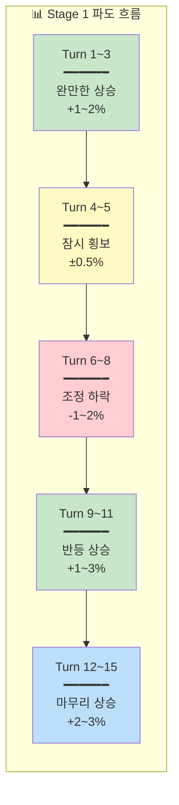

# 🌱 Stage 1: 삼성전자의 바다

## 📋 스테이지 정보

| 항목 | 내용 |
|------|------|
| **스테이지** | Stage 1 (튜토리얼) |
| **종목명** | 삼성전자 |
| **종목코드** | 005930 |
| **난이도** | ★☆☆☆☆ (잔잔한 호수) |
| **목표 수익률** | +5% |
| **제한 시간** | 3분 (180초) |
| **턴 수** | 15턴 |
| **선택지** | 3개 (-30%, 0%, +30%) |
| **물타기** | ❌ 비활성화 |
| **시작 에너지** | 100% |

---

## 📈 종목 특성

```
┌─────────────────────────────────────────────────────────────────┐
│                                                                 │
│  📊 삼성전자 (005930)                                           │
│  ━━━━━━━━━━━━━━━━━━━━━━━━━━━━━━━━━━━━━━━━━━━━━━━━━━━━━━━━━━━   │
│                                                                 │
│  🏢 업종: 반도체, 전자기기                                      │
│  💰 시가총액: 국내 1위 (400조원+)                               │
│  📉 일 변동성: 1~2% (매우 안정적)                               │
│                                                                 │
│  ✅ 특징:                                                       │
│  • 대형주 중의 대형주, 가장 안정적인 종목                       │
│  • 급등/급락이 거의 없어 예측 가능                              │
│  • 초보자가 연습하기 최적의 종목                                │
│                                                                 │
│  💡 투자 포인트:                                                │
│  • "파도가 작아서 실수해도 큰 손해 없음"                        │
│  • 느긋하게 조작법을 익히는 단계                                │
│                                                                 │
└─────────────────────────────────────────────────────────────────┘
```

---

## 🎯 학습 목표



### 학습 체크리스트

- [ ] 슬라이더를 왼쪽으로 밀면 매도임을 이해
- [ ] 슬라이더를 오른쪽으로 밀면 매수임을 이해
- [ ] 가운데 유지는 아무것도 안 하는 것임을 이해
- [ ] 상승 중일 때 매수하면 유리함을 체감
- [ ] 하락 중일 때 매도하면 손실을 줄임을 체감
- [ ] 5초 안에 결정하는 것에 적응

---

## 💰 시작 조건

| 항목 | 값 | 설명 |
|------|------|------|
| **시작 자금** | 10,000,000원 | 천만원 |
| **시작 보유량** | 100주 | 평단 70,000원에 매수된 상태 |
| **평균 매입가** | 70,000원 | 손익분기점 |
| **시작 가격** | 71,500원 | +2.1% 수익 상태로 시작 |
| **예수금** | 3,000,000원 | 추가 매수 가능 자금 |

---

## 📖 스토리 개요

```
┌─────────────────────────────────────────────────────────────────┐
│                                                                 │
│  📖 Stage 1 스토리: "첫 번째 항해"                              │
│  ━━━━━━━━━━━━━━━━━━━━━━━━━━━━━━━━━━━━━━━━━━━━━━━━━━━━━━━━━━━   │
│                                                                 │
│  당신은 이제 막 항해를 시작한 신입 선장입니다.                  │
│  삼성전자라는 거대하고 안정적인 바다에서                        │
│  파도 타기의 기초를 배웁니다.                                   │
│                                                                 │
│  이 바다는 파도가 잔잔하여 실수해도 괜찮습니다.                 │
│  천천히 조작법을 익히고, 파도의 리듬을 느껴보세요.              │
│                                                                 │
│  목표: 3분 안에 +5% 수익을 달성하세요!                         │
│                                                                 │
└─────────────────────────────────────────────────────────────────┘
```

---

## 🌊 턴별 시나리오 (15턴)

### 전체 흐름 요약



---

### Turn 1: 첫 번째 파도

| 항목 | 내용 |
|------|------|
| **현재가** | 71,500원 |
| **변화율** | +0.7% ▲ |
| **추세** | 상승 시작 |
| **오늘 고가/저가** | 71,800원 / 71,000원 |

#### 상황 설명

```
┌─────────────────────────────────────────────────────────────────┐
│  ⚡ FREEZE 1/15                              ⏱️  5              │
│                                                                 │
│  📊 상황: 작은 파도가 밀려온다                                  │
│                                                                 │
│  "장이 막 열렸어요. 삼성전자가 조금씩 오르고 있습니다.          │
│   파도가 천천히 올라가는 것이 느껴지시나요?"                    │
│                                                                 │
│  💡 힌트: "파도가 올라가고 있을 때는 짐을 실어볼까요?"          │
│                                                                 │
└─────────────────────────────────────────────────────────────────┘
```

#### 선택지 & 결과

| 선택 | 이후 파도 | 판정 | 피드백 |
|:---:|:--------:|:---:|--------|
| **+30% 매수** | +1.2% 상승 | 🎉 GREAT | "좋아요! 상승 초기에 올라탔어요!" |
| **0% 유지** | +1.2% 상승 | 😐 OK | "괜찮아요, 아직 지켜보는 것도 방법이에요" |
| **-30% 매도** | +1.2% 상승 | 😅 MISS | "앗, 파도가 올라가는데 내렸네요..." |

#### 권장 선택

```
✅ 권장: +30% 매수

이유: 
- 상승 추세가 막 시작됨
- 리스크가 적은 초기 진입 타이밍
- 첫 턴이므로 적극적으로 시작해보기
```

---

### Turn 2: 파도가 커진다

| 항목 | 내용 |
|------|------|
| **현재가** | 72,350원 |
| **변화율** | +1.9% ▲▲ |
| **추세** | 상승 지속 |
| **오늘 고가/저가** | 72,500원 / 71,000원 |

#### 상황 설명

```
┌─────────────────────────────────────────────────────────────────┐
│  ⚡ FREEZE 2/15                              ⏱️  5              │
│                                                                 │
│  📊 상황: 파도가 점점 커지고 있다!                              │
│                                                                 │
│  "좋은 흐름이에요! 삼성전자가 계속 오르고 있습니다.             │
│   파도의 힘이 점점 세지는 것 같아요."                           │
│                                                                 │
│  💡 힌트: "추세가 이어지고 있어요. 더 실어볼까요?"              │
│                                                                 │
└─────────────────────────────────────────────────────────────────┘
```

#### 선택지 & 결과

| 선택 | 이후 파도 | 판정 | 피드백 |
|:---:|:--------:|:---:|--------|
| **+30% 매수** | +0.8% 상승 | 🎉 GREAT | "추세를 잘 탔어요!" |
| **0% 유지** | +0.8% 상승 | ✅ GOOD | "좋아요, 현재 수익을 지키고 있어요" |
| **-30% 매도** | +0.8% 상승 | 💀 BAD | "이런! 파도가 아직 올라가는데..." |

#### 권장 선택

```
✅ 권장: +30% 매수 또는 0% 유지

이유:
- 상승 추세가 유지 중
- 추가 매수로 수익 확대 가능
- 이미 수익 중이면 유지도 좋은 선택
```

---

### Turn 3: 상승의 정점?

| 항목 | 내용 |
|------|------|
| **현재가** | 72,800원 |
| **변화율** | +2.5% ▲▲ |
| **추세** | 상승 (둔화 조짐) |
| **오늘 고가/저가** | 72,900원 / 71,000원 |

#### 상황 설명

```
┌─────────────────────────────────────────────────────────────────┐
│  ⚡ FREEZE 3/15                              ⏱️  5              │
│                                                                 │
│  📊 상황: 꽤 많이 올랐다... 더 갈까?                            │
│                                                                 │
│  "오늘 고점 근처에 왔어요. 파도가 조금 힘이 빠지는 것 같기도    │
│   하고... 더 올라갈 것 같기도 하고..."                          │
│                                                                 │
│  💡 힌트: "고점 근처에서는 신중해야 해요"                       │
│                                                                 │
└─────────────────────────────────────────────────────────────────┘
```

#### 선택지 & 결과

| 선택 | 이후 파도 | 판정 | 피드백 |
|:---:|:--------:|:---:|--------|
| **+30% 매수** | -0.3% 하락 | 😅 MISS | "고점에서 샀네요... 조금 아쉬워요" |
| **0% 유지** | -0.3% 하락 | ✅ GOOD | "현명해요! 일단 지켜보는 거죠" |
| **-30% 매도** | -0.3% 하락 | 🎉 GREAT | "와! 고점에서 일부 익절했어요!" |

#### 권장 선택

```
✅ 권장: 0% 유지 또는 -30% 매도

이유:
- 고점 근처에서는 추가 매수 위험
- 일부 익절(매도)로 수익 확정 가능
- 유지하며 상황 관찰도 좋은 전략
```

---

### Turn 4: 잠시 쉬어가는 파도

| 항목 | 내용 |
|------|------|
| **현재가** | 72,600원 |
| **변화율** | +2.2% → |
| **추세** | 횡보 |
| **오늘 고가/저가** | 72,900원 / 71,000원 |

#### 상황 설명

```
┌─────────────────────────────────────────────────────────────────┐
│  ⚡ FREEZE 4/15                              ⏱️  5              │
│                                                                 │
│  📊 상황: 바다가 잠시 잔잔해졌다                                │
│                                                                 │
│  "파도가 쉬어가는 것 같아요. 올라갈지 내려갈지 방향을           │
│   정하지 못하고 있어요."                                        │
│                                                                 │
│  💡 힌트: "방향이 불분명할 때는 기다리는 것도 전략이에요"       │
│                                                                 │
└─────────────────────────────────────────────────────────────────┘
```

#### 선택지 & 결과

| 선택 | 이후 파도 | 판정 | 피드백 |
|:---:|:--------:|:---:|--------|
| **+30% 매수** | +0.2% 횡보 | 😐 OK | "조금 샀는데 별 변화가 없네요" |
| **0% 유지** | +0.2% 횡보 | ✅ GOOD | "좋아요! 방향이 나올 때까지 기다리는 거죠" |
| **-30% 매도** | +0.2% 횡보 | 😐 OK | "조금 팔았는데 별 변화가 없네요" |

#### 권장 선택

```
✅ 권장: 0% 유지

이유:
- 횡보 구간에서는 섣부른 움직임 불필요
- 방향이 정해질 때까지 관찰
- 에너지(멘탈) 보존
```

---

### Turn 5: 아직 횡보 중

| 항목 | 내용 |
|------|------|
| **현재가** | 72,500원 |
| **변화율** | +2.1% → |
| **추세** | 횡보 지속 |
| **오늘 고가/저가** | 72,900원 / 71,000원 |

#### 상황 설명

```
┌─────────────────────────────────────────────────────────────────┐
│  ⚡ FREEZE 5/15                              ⏱️  5              │
│                                                                 │
│  📊 상황: 계속 쉬어가는 중...                                   │
│                                                                 │
│  "여전히 방향을 못 잡고 있어요. 조금 지루하죠?                  │
│   하지만 이런 구간도 자주 있답니다."                            │
│                                                                 │
│  💡 힌트: "지루해도 참는 것이 프로의 자세예요"                  │
│                                                                 │
└─────────────────────────────────────────────────────────────────┘
```

#### 선택지 & 결과

| 선택 | 이후 파도 | 판정 | 피드백 |
|:---:|:--------:|:---:|--------|
| **+30% 매수** | -0.8% 하락 | 😅 MISS | "앗, 횡보 후 하락이 시작됐어요" |
| **0% 유지** | -0.8% 하락 | ✅ GOOD | "좋아요, 일단 지켜보고 있어요" |
| **-30% 매도** | -0.8% 하락 | 🎉 GREAT | "와! 하락 직전에 일부 팔았어요!" |

#### 권장 선택

```
✅ 권장: 0% 유지 또는 -30% 매도

이유:
- 횡보 후에는 하락이 올 수도 있음
- 보수적으로 일부 익절하는 것도 방법
- 관찰 후 판단도 좋은 선택
```

---

### Turn 6: 파도가 내려간다

| 항목 | 내용 |
|------|------|
| **현재가** | 71,900원 |
| **변화율** | +1.3% ▼ |
| **추세** | 하락 시작 |
| **오늘 고가/저가** | 72,900원 / 71,000원 |

#### 상황 설명

```
┌─────────────────────────────────────────────────────────────────┐
│  ⚡ FREEZE 6/15                              ⏱️  5              │
│                                                                 │
│  📊 상황: 파도가 내려가기 시작했다!                             │
│                                                                 │
│  "수익이 줄어들고 있어요. 파도가 아래로 향하고 있습니다.        │
│   어떻게 해야 할까요?"                                          │
│                                                                 │
│  💡 힌트: "하락할 때는 짐을 좀 내려놓는 것도 방법이에요"        │
│                                                                 │
└─────────────────────────────────────────────────────────────────┘
```

#### 선택지 & 결과

| 선택 | 이후 파도 | 판정 | 피드백 |
|:---:|:--------:|:---:|--------|
| **+30% 매수** | -0.7% 하락 | 💀 BAD | "이런! 떨어지는 파도에 올라탔어요..." |
| **0% 유지** | -0.7% 하락 | 😐 OK | "버티고 있네요. 조금 아프지만..." |
| **-30% 매도** | -0.7% 하락 | 🎉 GREAT | "좋아요! 하락 전에 일부 정리했어요!" |

#### 권장 선택

```
✅ 권장: -30% 매도

이유:
- 하락 추세가 시작됨
- 일부 매도로 손실 방어
- 더 내려가면 싸게 다시 살 수 있음
```

---

### Turn 7: 하락 지속

| 항목 | 내용 |
|------|------|
| **현재가** | 71,400원 |
| **변화율** | +0.6% ▼▼ |
| **추세** | 하락 지속 |
| **오늘 고가/저가** | 72,900원 / 71,200원 |

#### 상황 설명

```
┌─────────────────────────────────────────────────────────────────┐
│  ⚡ FREEZE 7/15                              ⏱️  5              │
│                                                                 │
│  📊 상황: 계속 내려가고 있다!                                   │
│                                                                 │
│  "파도가 계속 낮아지고 있어요. 수익이 거의 사라졌네요.          │
│   더 팔아야 할까요, 버텨야 할까요?"                             │
│                                                                 │
│  💡 힌트: "너무 많이 내려가기 전에 결정해야 해요"               │
│                                                                 │
└─────────────────────────────────────────────────────────────────┘
```

#### 선택지 & 결과

| 선택 | 이후 파도 | 판정 | 피드백 |
|:---:|:--------:|:---:|--------|
| **+30% 매수** | -0.5% 하락 | 💀 BAD | "아직 바닥이 아니었어요!" |
| **0% 유지** | -0.5% 하락 | 😐 OK | "버티고 있어요... 힘내세요" |
| **-30% 매도** | -0.5% 하락 | ✅ GOOD | "현명해요! 추가 손실을 막았어요" |

#### 권장 선택

```
✅ 권장: -30% 매도 또는 0% 유지

이유:
- 하락 추세 지속 중
- 추가 매도로 손실 최소화
- 삼성전자는 바닥이 깊지 않으므로 유지도 가능
```

---

### Turn 8: 바닥 근처?

| 항목 | 내용 |
|------|------|
| **현재가** | 71,100원 |
| **변화율** | +0.1% ▼ |
| **추세** | 하락 둔화 |
| **오늘 고가/저가** | 72,900원 / 71,000원 |

#### 상황 설명

```
┌─────────────────────────────────────────────────────────────────┐
│  ⚡ FREEZE 8/15                              ⏱️  5              │
│                                                                 │
│  📊 상황: 바닥에 거의 다 온 것 같다...                          │
│                                                                 │
│  "파도가 많이 내려왔어요. 오늘 최저가 근처입니다.               │
│   여기서 반등할까요, 더 떨어질까요?"                            │
│                                                                 │
│  💡 힌트: "바닥 근처에서는 기회가 될 수도 있어요"               │
│                                                                 │
└─────────────────────────────────────────────────────────────────┘
```

#### 선택지 & 결과

| 선택 | 이후 파도 | 판정 | 피드백 |
|:---:|:--------:|:---:|--------|
| **+30% 매수** | +0.8% 상승 | 🎉 GREAT | "와! 바닥에서 잘 샀어요!" |
| **0% 유지** | +0.8% 상승 | ✅ GOOD | "좋아요, 반등을 지켜보고 있네요" |
| **-30% 매도** | +0.8% 상승 | 😅 MISS | "앗, 바닥에서 팔았네요..." |

#### 권장 선택

```
✅ 권장: +30% 매수 또는 0% 유지

이유:
- 바닥 근처에서 반등 가능성
- 저가 매수 기회
- 확신이 없으면 관찰 후 다음 턴에 진입
```

---

### Turn 9: 반등 시작!

| 항목 | 내용 |
|------|------|
| **현재가** | 71,700원 |
| **변화율** | +1.0% ▲ |
| **추세** | 반등 시작 |
| **오늘 고가/저가** | 72,900원 / 71,000원 |

#### 상황 설명

```
┌─────────────────────────────────────────────────────────────────┐
│  ⚡ FREEZE 9/15                              ⏱️  5              │
│                                                                 │
│  📊 상황: 파도가 다시 올라오기 시작했다!                        │
│                                                                 │
│  "반등이에요! 파도가 다시 힘을 받고 있습니다.                   │
│   이 파도를 탈 준비 되셨나요?"                                  │
│                                                                 │
│  💡 힌트: "반등 초기는 좋은 매수 타이밍이에요"                  │
│                                                                 │
└─────────────────────────────────────────────────────────────────┘
```

#### 선택지 & 결과

| 선택 | 이후 파도 | 판정 | 피드백 |
|:---:|:--------:|:---:|--------|
| **+30% 매수** | +1.2% 상승 | 🎉 GREAT | "완벽해요! 반등 파도를 탔어요!" |
| **0% 유지** | +1.2% 상승 | ✅ GOOD | "좋아요, 반등을 확인하고 있네요" |
| **-30% 매도** | +1.2% 상승 | 💀 BAD | "이런! 반등하는데 팔았어요..." |

#### 권장 선택

```
✅ 권장: +30% 매수

이유:
- 반등이 확인됨
- 저점 매수 기회
- 추세 전환 초기 진입
```

---

### Turn 10: 반등 지속

| 항목 | 내용 |
|------|------|
| **현재가** | 72,300원 |
| **변화율** | +1.8% ▲▲ |
| **추세** | 상승 지속 |
| **오늘 고가/저가** | 72,900원 / 71,000원 |

#### 상황 설명

```
┌─────────────────────────────────────────────────────────────────┐
│  ⚡ FREEZE 10/15                             ⏱️  5              │
│                                                                 │
│  📊 상황: 반등이 이어지고 있다!                                 │
│                                                                 │
│  "좋아요! 파도가 힘차게 올라가고 있어요.                        │
│   V자 반등이 진행 중입니다!"                                    │
│                                                                 │
│  💡 힌트: "추세가 살아있을 때 함께 가세요"                      │
│                                                                 │
└─────────────────────────────────────────────────────────────────┘
```

#### 선택지 & 결과

| 선택 | 이후 파도 | 판정 | 피드백 |
|:---:|:--------:|:---:|--------|
| **+30% 매수** | +0.7% 상승 | 🎉 GREAT | "좋아요! 추세를 따라가고 있어요!" |
| **0% 유지** | +0.7% 상승 | ✅ GOOD | "안정적이에요, 수익이 늘고 있어요" |
| **-30% 매도** | +0.7% 상승 | 😅 MISS | "조금 일찍 팔았네요..." |

#### 권장 선택

```
✅ 권장: +30% 매수 또는 0% 유지

이유:
- 상승 추세 지속 중
- 추가 매수로 수익 확대
- 이미 수익 중이면 유지도 좋음
```

---

### Turn 11: 다시 고점 접근

| 항목 | 내용 |
|------|------|
| **현재가** | 72,700원 |
| **변화율** | +2.4% ▲ |
| **추세** | 상승 (고점 접근) |
| **오늘 고가/저가** | 72,900원 / 71,000원 |

#### 상황 설명

```
┌─────────────────────────────────────────────────────────────────┐
│  ⚡ FREEZE 11/15                             ⏱️  5              │
│                                                                 │
│  📊 상황: 오늘 고점에 다시 가까워졌다!                          │
│                                                                 │
│  "거의 다 회복했어요! 오늘 최고가에 근접합니다.                 │
│   이번에는 어떻게 할까요?"                                      │
│                                                                 │
│  💡 힌트: "고점에서는 욕심보다 안전이 중요해요"                 │
│                                                                 │
└─────────────────────────────────────────────────────────────────┘
```

#### 선택지 & 결과

| 선택 | 이후 파도 | 판정 | 피드백 |
|:---:|:--------:|:---:|--------|
| **+30% 매수** | +0.3% 상승 | 😐 OK | "조금 더 올랐네요, 나쁘지 않아요" |
| **0% 유지** | +0.3% 상승 | ✅ GOOD | "좋아요! 신중하게 지켜보고 있어요" |
| **-30% 매도** | +0.3% 상승 | 😐 OK | "일부 익절했어요, 안전한 선택이에요" |

#### 권장 선택

```
✅ 권장: 0% 유지

이유:
- 고점 근처라 추가 상승 여력 불확실
- 급하게 움직일 필요 없음
- 상황 관찰 후 다음 턴 결정
```

---

### Turn 12: 신고가 돌파!

| 항목 | 내용 |
|------|------|
| **현재가** | 73,100원 |
| **변화율** | +3.0% ▲▲▲ |
| **추세** | 강한 상승 |
| **오늘 고가/저가** | 73,200원 / 71,000원 |

#### 상황 설명

```
┌─────────────────────────────────────────────────────────────────┐
│  ⚡ FREEZE 12/15                             ⏱️  5              │
│                                                                 │
│  📊 상황: 오늘 최고가를 돌파했다!                               │
│                                                                 │
│  "신고가예요! 파도가 아주 힘차게 올라가고 있습니다.             │
│   이런 때 어떻게 해야 할까요?"                                  │
│                                                                 │
│  💡 힌트: "신고가 돌파는 추가 상승의 신호일 수 있어요"          │
│                                                                 │
└─────────────────────────────────────────────────────────────────┘
```

#### 선택지 & 결과

| 선택 | 이후 파도 | 판정 | 피드백 |
|:---:|:--------:|:---:|--------|
| **+30% 매수** | +0.5% 상승 | 🎉 GREAT | "좋아요! 신고가에서 추세를 탔어요!" |
| **0% 유지** | +0.5% 상승 | ✅ GOOD | "안전하게 수익을 누리고 있어요" |
| **-30% 매도** | +0.5% 상승 | 😐 OK | "일부 익절, 나쁘지 않아요" |

#### 권장 선택

```
✅ 권장: +30% 매수 또는 0% 유지

이유:
- 신고가 돌파는 추세 지속 신호
- 추가 상승 가능성 있음
- 삼성전자는 급락 위험이 낮음
```

---

### Turn 13: 상승 지속

| 항목 | 내용 |
|------|------|
| **현재가** | 73,400원 |
| **변화율** | +3.4% ▲▲ |
| **추세** | 상승 지속 |
| **오늘 고가/저가** | 73,500원 / 71,000원 |

#### 상황 설명

```
┌─────────────────────────────────────────────────────────────────┐
│  ⚡ FREEZE 13/15                             ⏱️  5              │
│                                                                 │
│  📊 상황: 좋은 흐름이 계속된다!                                 │
│                                                                 │
│  "오늘 정말 좋은 날이에요! 삼성전자가 꾸준히 오르고 있습니다.   │
│   목표까지 거의 다 왔어요!"                                     │
│                                                                 │
│  💡 힌트: "목표에 가까워지면 욕심을 조금 줄여도 좋아요"         │
│                                                                 │
└─────────────────────────────────────────────────────────────────┘
```

#### 선택지 & 결과

| 선택 | 이후 파도 | 판정 | 피드백 |
|:---:|:--------:|:---:|--------|
| **+30% 매수** | +0.4% 상승 | ✅ GOOD | "조금 더 샀어요, 괜찮아요" |
| **0% 유지** | +0.4% 상승 | ✅ GOOD | "안정적으로 마무리 중이에요" |
| **-30% 매도** | +0.4% 상승 | 😐 OK | "수익 일부 확정, 안전한 선택!" |

#### 권장 선택

```
✅ 권장: 0% 유지 또는 -30% 매도

이유:
- 목표(+5%)에 거의 도달
- 욕심부리지 않고 수익 확정 고려
- 안정적인 마무리 중요
```

---

### Turn 14: 마무리 구간

| 항목 | 내용 |
|------|------|
| **현재가** | 73,600원 |
| **변화율** | +3.7% ▲ |
| **추세** | 상승 (마무리) |
| **오늘 고가/저가** | 73,700원 / 71,000원 |

#### 상황 설명

```
┌─────────────────────────────────────────────────────────────────┐
│  ⚡ FREEZE 14/15                             ⏱️  5              │
│                                                                 │
│  📊 상황: 거의 다 왔다! 마지막 스퍼트!                          │
│                                                                 │
│  "마지막 턴이 다가오고 있어요! 수익률이 목표를 초과했습니다.    │
│   어떻게 마무리할까요?"                                         │
│                                                                 │
│  💡 힌트: "좋은 결과를 지키는 것도 실력이에요"                  │
│                                                                 │
└─────────────────────────────────────────────────────────────────┘
```

#### 선택지 & 결과

| 선택 | 이후 파도 | 판정 | 피드백 |
|:---:|:--------:|:---:|--------|
| **+30% 매수** | +0.3% 상승 | 😐 OK | "마지막에 조금 더 샀네요" |
| **0% 유지** | +0.3% 상승 | ✅ GOOD | "안정적인 마무리예요!" |
| **-30% 매도** | +0.3% 상승 | ✅ GOOD | "수익 확정! 훌륭해요!" |

#### 권장 선택

```
✅ 권장: 0% 유지 또는 -30% 매도

이유:
- 이미 목표 달성
- 마지막에 무리하지 않기
- 안전하게 마무리
```

---

### Turn 15: 최종 턴! 🎉

| 항목 | 내용 |
|------|------|
| **현재가** | 73,800원 |
| **변화율** | +4.0% ▲ |
| **추세** | 마무리 |
| **오늘 고가/저가** | 73,800원 / 71,000원 |

#### 상황 설명

```
┌─────────────────────────────────────────────────────────────────┐
│  ⚡ FREEZE 15/15 (최종!)                     ⏱️  5              │
│                                                                 │
│  📊 상황: 마지막 파도! 어떻게 마무리할까?                       │
│                                                                 │
│  "마지막 턴이에요! 오늘 최고가에 마감하려 합니다.               │
│   첫 번째 항해를 어떻게 마무리할까요?"                          │
│                                                                 │
│  💡 힌트: "첫 항해 수고하셨어요! 안전하게 마무리하세요"         │
│                                                                 │
└─────────────────────────────────────────────────────────────────┘
```

#### 선택지 & 결과

| 선택 | 이후 파도 | 판정 | 피드백 |
|:---:|:--------:|:---:|--------|
| **+30% 매수** | +0.2% 상승 | 😐 OK | "마지막에 조금 더 담았어요" |
| **0% 유지** | +0.2% 상승 | ✅ GOOD | "안정적인 마무리! 훌륭해요!" |
| **-30% 매도** | +0.2% 상승 | ✅ GOOD | "수익 확정! 첫 항해 성공!" |

#### 권장 선택

```
✅ 권장: 0% 유지 또는 -30% 매도

이유:
- 마지막 턴, 무리하지 않기
- 이미 좋은 수익
- 깔끔한 마무리로 자신감 얻기
```

---

## 📊 시나리오 요약표

| 턴 | 변화율 | 추세 | 상황 | 권장 선택 | 학습 포인트 |
|:--:|:-----:|:---:|------|:--------:|-----------|
| 1 | +0.7% | ▲ | 상승 시작 | +30% | 상승 초기 진입 |
| 2 | +1.9% | ▲▲ | 상승 지속 | +30% | 추세 추종 |
| 3 | +2.5% | ▲ | 고점 접근 | 0% | 고점 주의 |
| 4 | +2.2% | → | 횡보 시작 | 0% | 횡보 대응 |
| 5 | +2.1% | → | 횡보 지속 | 0% | 인내심 |
| 6 | +1.3% | ▼ | 하락 시작 | -30% | 하락 대응 |
| 7 | +0.6% | ▼▼ | 하락 지속 | -30% | 손실 방어 |
| 8 | +0.1% | ▼ | 바닥 접근 | +30% | 저점 매수 |
| 9 | +1.0% | ▲ | 반등 시작 | +30% | 반등 포착 |
| 10 | +1.8% | ▲▲ | 반등 지속 | +30% | 추세 전환 |
| 11 | +2.4% | ▲ | 고점 접근 | 0% | 신중한 접근 |
| 12 | +3.0% | ▲▲▲ | 신고가! | +30% | 돌파 매수 |
| 13 | +3.4% | ▲▲ | 상승 지속 | 0% | 수익 관리 |
| 14 | +3.7% | ▲ | 마무리 | 0% | 안전 마무리 |
| 15 | +4.0% | ▲ | 최종! | 0% | 마무리 |

---

## 🎓 Stage 1 완료 후 배운 점

```
┌─────────────────────────────────────────────────────────────────┐
│                                                                 │
│  🎓 Stage 1에서 배운 것들                                       │
│  ━━━━━━━━━━━━━━━━━━━━━━━━━━━━━━━━━━━━━━━━━━━━━━━━━━━━━━━━━━━   │
│                                                                 │
│  ✅ 1. 슬라이더 조작법                                          │
│     • 왼쪽 = 매도 (팔기)                                        │
│     • 오른쪽 = 매수 (사기)                                      │
│     • 가운데 = 유지 (그대로)                                    │
│                                                                 │
│  ✅ 2. 추세 읽기 기초                                           │
│     • 상승 추세 → 매수 유리                                     │
│     • 하락 추세 → 매도 유리                                     │
│     • 횡보 → 관망이 안전                                        │
│                                                                 │
│  ✅ 3. 고점/저점 인식                                           │
│     • 고점 근처 → 욕심 금지                                     │
│     • 저점 근처 → 기회 포착                                     │
│                                                                 │
│  ✅ 4. 5초 선택에 적응                                          │
│     • 빠르게 상황 판단                                          │
│     • 타임아웃 방지                                             │
│                                                                 │
│  💡 다음 스테이지: SK하이닉스의 바다                            │
│     → 조금 더 빠른 파도에서 추세 추종을 연습합니다!             │
│                                                                 │
└─────────────────────────────────────────────────────────────────┘
```

---

**문서 끝**
