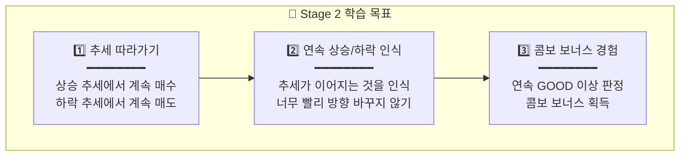
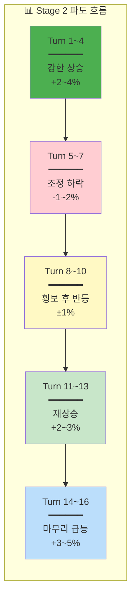

# 🌱 Stage 2: SK하이닉스의 바다

## 📋 스테이지 정보

| 항목 | 내용 |
|------|------|
| **스테이지** | Stage 2 |
| **종목명** | SK하이닉스 |
| **종목코드** | 000660 |
| **난이도** | ★☆☆☆☆ (조금 빠른 파도) |
| **목표 수익률** | +8% |
| **제한 시간** | 3분 (180초) |
| **턴 수** | 16턴 |
| **선택지** | 3개 (-30%, 0%, +30%) |
| **물타기** | ❌ 비활성화 |
| **시작 에너지** | 95% |

---

## 📈 종목 특성

```
┌─────────────────────────────────────────────────────────────────┐
│                                                                 │
│  📊 SK하이닉스 (000660)                                         │
│  ━━━━━━━━━━━━━━━━━━━━━━━━━━━━━━━━━━━━━━━━━━━━━━━━━━━━━━━━━━━   │
│                                                                 │
│  🏢 업종: 반도체 (메모리)                                       │
│  💰 시가총액: 국내 2위 (100조원+)                               │
│  📉 일 변동성: 2~3% (삼성전자보다 조금 높음)                    │
│                                                                 │
│  ✅ 특징:                                                       │
│  • 메모리 반도체 전문, 글로벌 2위                               │
│  • 삼성전자보다 변동성이 조금 높음                              │
│  • 반도체 사이클에 민감하게 반응                                │
│                                                                 │
│  💡 투자 포인트:                                                │
│  • "파도가 조금 더 빠르고 높아요"                               │
│  • 추세가 형성되면 지속되는 편                                  │
│                                                                 │
└─────────────────────────────────────────────────────────────────┘
```

---

## 🎯 학습 목표



---

## 💰 시작 조건

| 항목 | 값 | 설명 |
|------|------|------|
| **시작 자금** | 12,000,000원 | 천이백만원 |
| **시작 보유량** | 80주 | 평단 135,000원에 매수된 상태 |
| **평균 매입가** | 135,000원 | 손익분기점 |
| **시작 가격** | 137,000원 | +1.5% 수익 상태로 시작 |
| **예수금** | 4,000,000원 | 추가 매수 가능 자금 |

---

## 📖 스토리 개요

```
┌─────────────────────────────────────────────────────────────────┐
│                                                                 │
│  📖 Stage 2 스토리: "조금 빠른 파도"                            │
│  ━━━━━━━━━━━━━━━━━━━━━━━━━━━━━━━━━━━━━━━━━━━━━━━━━━━━━━━━━━━   │
│                                                                 │
│  첫 항해를 성공적으로 마친 당신은 조금 더 도전적인              │
│  SK하이닉스의 바다로 나아갑니다.                                │
│                                                                 │
│  이 바다는 삼성전자보다 파도가 조금 더 빠르고 높습니다.         │
│  하지만 추세가 형성되면 꽤 오래 지속되는 특징이 있어요.         │
│                                                                 │
│  추세를 따라가는 연습을 해봅시다!                               │
│                                                                 │
│  목표: 3분 안에 +8% 수익을 달성하세요!                         │
│                                                                 │
└─────────────────────────────────────────────────────────────────┘
```

---

## 🌊 턴별 시나리오 (16턴)

### 전체 흐름 요약



---

### Turn 1: 장 시작부터 좋다!

| 항목 | 내용 |
|------|------|
| **현재가** | 137,000원 |
| **변화율** | +1.5% ▲ |
| **추세** | 상승 시작 |

```
💡 힌트: "오늘 반도체 섹터가 좋아 보여요!"

권장: +30% 매수 | 결과: +1.8% 상승 | 판정: GREAT
```

---

### Turn 2: 상승 가속!

| 항목 | 내용 |
|------|------|
| **현재가** | 139,500원 |
| **변화율** | +3.3% ▲▲ |
| **추세** | 상승 가속 |

```
💡 힌트: "반도체 수출 호조 뉴스! 추세를 타세요!"

권장: +30% 매수 | 결과: +1.5% 상승 | 판정: GREAT
```

---

### Turn 3: 추세 지속

| 항목 | 내용 |
|------|------|
| **현재가** | 141,500원 |
| **변화율** | +4.8% ▲▲▲ |
| **추세** | 강한 상승 |

```
💡 힌트: "추세가 살아있어요! 따라가세요!"

권장: +30% 매수 | 결과: +0.8% 상승 | 판정: GREAT
```

---

### Turn 4: 고점 경고?

| 항목 | 내용 |
|------|------|
| **현재가** | 142,500원 |
| **변화율** | +5.6% ▲▲ |
| **추세** | 상승 (둔화 조짐) |

```
💡 힌트: "많이 올랐어요... 조금 쉬어갈 수도?"

권장: 0% 유지 | 결과: -1.2% 하락 | 판정: GOOD
```

---

### Turn 5: 조정 시작

| 항목 | 내용 |
|------|------|
| **현재가** | 140,800원 |
| **변화율** | +4.3% ▼ |
| **추세** | 하락 시작 |

```
💡 힌트: "조정이 시작됐어요. 일부 정리할까요?"

권장: -30% 매도 | 결과: -0.8% 하락 | 판정: GREAT
```

---

### Turn 6: 조정 지속

| 항목 | 내용 |
|------|------|
| **현재가** | 139,700원 |
| **변화율** | +3.5% ▼▼ |
| **추세** | 하락 지속 |

```
💡 힌트: "아직 조정 중이에요. 서두르지 마세요."

권장: 0% 유지 또는 -30% 매도 | 결과: -0.5% 하락 | 판정: GOOD
```

---

### Turn 7: 바닥 탐색

| 항목 | 내용 |
|------|------|
| **현재가** | 139,000원 |
| **변화율** | +3.0% ▼ |
| **추세** | 하락 둔화 |

```
💡 힌트: "조정이 마무리되는 것 같아요..."

권장: 0% 유지 | 결과: +0.3% 횡보 | 판정: GOOD
```

---

### Turn 8: 횡보 구간

| 항목 | 내용 |
|------|------|
| **현재가** | 139,400원 |
| **변화율** | +3.3% → |
| **추세** | 횡보 |

```
💡 힌트: "방향을 정하지 못하고 있어요. 기다려볼까요?"

권장: 0% 유지 | 결과: +0.5% 횡보 | 판정: GOOD
```

---

### Turn 9: 반등 신호

| 항목 | 내용 |
|------|------|
| **현재가** | 140,100원 |
| **변화율** | +3.8% ▲ |
| **추세** | 반등 시작 |

```
💡 힌트: "반등하는 것 같아요! 다시 올라탈까요?"

권장: +30% 매수 | 결과: +1.0% 상승 | 판정: GREAT
```

---

### Turn 10: 반등 확인

| 항목 | 내용 |
|------|------|
| **현재가** | 141,500원 |
| **변화율** | +4.8% ▲▲ |
| **추세** | 상승 재개 |

```
💡 힌트: "반등이 확실해 보여요!"

권장: +30% 매수 | 결과: +0.8% 상승 | 판정: GREAT
```

---

### Turn 11: 재상승 시작

| 항목 | 내용 |
|------|------|
| **현재가** | 142,700원 |
| **변화율** | +5.7% ▲▲ |
| **추세** | 상승 지속 |

```
💡 힌트: "다시 고점을 향해 가고 있어요!"

권장: +30% 매수 | 결과: +1.2% 상승 | 판정: GREAT
```

---

### Turn 12: 전고점 돌파!

| 항목 | 내용 |
|------|------|
| **현재가** | 144,500원 |
| **변화율** | +7.0% ▲▲▲ |
| **추세** | 강한 상승 |

```
💡 힌트: "신고가! 추세를 믿으세요!"

권장: +30% 매수 | 결과: +0.7% 상승 | 판정: GREAT
```

---

### Turn 13: 목표 근접

| 항목 | 내용 |
|------|------|
| **현재가** | 145,500원 |
| **변화율** | +7.8% ▲▲ |
| **추세** | 상승 지속 |

```
💡 힌트: "목표에 거의 다 왔어요! 욕심 조절하세요."

권장: 0% 유지 | 결과: +0.5% 상승 | 판정: GOOD
```

---

### Turn 14: 마무리 구간

| 항목 | 내용 |
|------|------|
| **현재가** | 146,200원 |
| **변화율** | +8.3% ▲ |
| **추세** | 상승 (마무리) |

```
💡 힌트: "목표 달성! 수익을 지키세요."

권장: 0% 유지 또는 -30% 매도 | 결과: +0.3% 상승 | 판정: GOOD
```

---

### Turn 15: 안정적 마무리

| 항목 | 내용 |
|------|------|
| **현재가** | 146,600원 |
| **변화율** | +8.6% ▲ |
| **추세** | 상승 유지 |

```
💡 힌트: "좋은 흐름을 유지하고 있어요."

권장: 0% 유지 | 결과: +0.2% 상승 | 판정: GOOD
```

---

### Turn 16: 최종 턴! 🎉

| 항목 | 내용 |
|------|------|
| **현재가** | 146,900원 |
| **변화율** | +8.8% ▲ |
| **추세** | 마무리 |

```
💡 힌트: "축하해요! 두 번째 항해도 성공!"

권장: 0% 유지 | 결과: 마무리 | 판정: GOOD
```

---

## 📊 시나리오 요약표

| 턴 | 변화율 | 추세 | 권장 | 학습 포인트 |
|:--:|:-----:|:---:|:---:|-----------|
| 1 | +1.5% | ▲ | +30% | 상승 초기 진입 |
| 2 | +3.3% | ▲▲ | +30% | 추세 추종 |
| 3 | +4.8% | ▲▲▲ | +30% | 추세 지속 확인 |
| 4 | +5.6% | ▲ | 0% | 고점 경계 |
| 5 | +4.3% | ▼ | -30% | 조정 대응 |
| 6 | +3.5% | ▼▼ | 0% | 하락 관망 |
| 7 | +3.0% | ▼ | 0% | 바닥 탐색 |
| 8 | +3.3% | → | 0% | 횡보 인내 |
| 9 | +3.8% | ▲ | +30% | 반등 포착 |
| 10 | +4.8% | ▲▲ | +30% | 추세 전환 |
| 11 | +5.7% | ▲▲ | +30% | 재상승 |
| 12 | +7.0% | ▲▲▲ | +30% | 돌파 매수 |
| 13 | +7.8% | ▲▲ | 0% | 목표 근접 |
| 14 | +8.3% | ▲ | 0% | 수익 확정 |
| 15 | +8.6% | ▲ | 0% | 안정 유지 |
| 16 | +8.8% | ▲ | 0% | 마무리 |

---

## 🎓 Stage 2 완료 후 배운 점

```
┌─────────────────────────────────────────────────────────────────┐
│                                                                 │
│  🎓 Stage 2에서 배운 것들                                       │
│  ━━━━━━━━━━━━━━━━━━━━━━━━━━━━━━━━━━━━━━━━━━━━━━━━━━━━━━━━━━━   │
│                                                                 │
│  ✅ 1. 추세 추종의 중요성                                       │
│     • 상승 추세에서는 계속 매수                                 │
│     • 하락 추세에서는 매도 또는 관망                            │
│     • 추세를 거스르면 손실                                      │
│                                                                 │
│  ✅ 2. 조정 구간 대응                                           │
│     • 상승 후 조정은 자연스러운 현상                            │
│     • 조정 때 당황하지 않기                                     │
│     • 반등 시 다시 진입                                         │
│                                                                 │
│  ✅ 3. 콤보 보너스                                              │
│     • 연속 GOOD 이상 → 추가 보너스                             │
│     • 일관된 전략이 보상받음                                    │
│                                                                 │
│  💡 다음 스테이지: 현대차의 바다                                │
│     → 변곡점 인식과 익절/손절을 연습합니다!                     │
│                                                                 │
└─────────────────────────────────────────────────────────────────┘
```

---

**문서 끝**
