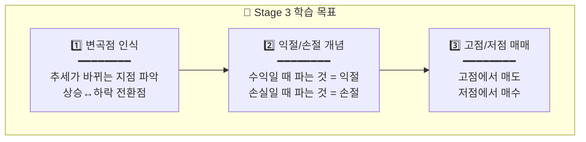
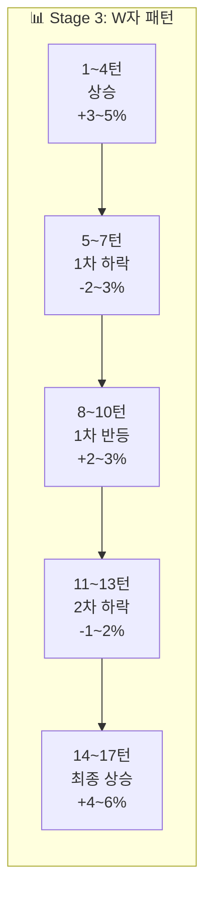

# 🌿 Stage 3: 현대차의 바다

## 📋 스테이지 정보

| 항목 | 내용 |
|------|------|
| **스테이지** | Stage 3 |
| **종목명** | 현대차 |
| **종목코드** | 005380 |
| **난이도** | ★★☆☆☆ (변곡점 있는 바다) |
| **목표 수익률** | +10% |
| **제한 시간** | 3분 (180초) |
| **턴 수** | 17턴 |
| **선택지** | 3개 (-30%, 0%, +30%) |
| **물타기** | ❌ 비활성화 |
| **시작 에너지** | 90% |

---

## 📈 종목 특성

```
┌─────────────────────────────────────────────────────────────────┐
│                                                                 │
│  📊 현대차 (005380)                                             │
│  ━━━━━━━━━━━━━━━━━━━━━━━━━━━━━━━━━━━━━━━━━━━━━━━━━━━━━━━━━━━   │
│                                                                 │
│  🏢 업종: 자동차 제조                                           │
│  💰 시가총액: 국내 Top 5 (50조원+)                              │
│  📉 일 변동성: 2~3% (중간)                                      │
│                                                                 │
│  ✅ 특징:                                                       │
│  • 글로벌 자동차 Top 5, 전기차 전환 중                          │
│  • 산업 뉴스에 민감하게 반응                                    │
│  • 명확한 변곡점이 있는 움직임                                  │
│                                                                 │
│  💡 투자 포인트:                                                │
│  • "고점과 저점이 비교적 명확해요"                              │
│  • 변곡점을 인식하는 연습에 최적                                │
│                                                                 │
└─────────────────────────────────────────────────────────────────┘
```

---

## 🎯 학습 목표



---

## 💰 시작 조건

| 항목 | 값 |
|------|------|
| **시작 자금** | 15,000,000원 |
| **시작 보유량** | 60주 |
| **평균 매입가** | 220,000원 |
| **시작 가격** | 225,000원 (+2.3%) |
| **예수금** | 4,500,000원 |

---

## 🌊 턴별 시나리오 (17턴)

### 전체 흐름: W자 패턴 (변곡점 2회)



---

### Turn 1~4: 상승 구간

| 턴 | 현재가 | 변화율 | 추세 | 권장 | 힌트 |
|:--:|:-----:|:-----:|:---:|:---:|------|
| 1 | 225,000 | +2.3% | ▲ | +30% | "장 초반 좋은 흐름!" |
| 2 | 229,000 | +4.1% | ▲▲ | +30% | "외국인 순매수 유입!" |
| 3 | 232,000 | +5.5% | ▲▲ | +30% | "추세가 살아있어요!" |
| 4 | 234,000 | +6.4% | ▲ | 0% | "고점 신호? 주의!" |

---

### Turn 5~7: 1차 하락 (첫 번째 변곡점 ⚡)

| 턴 | 현재가 | 변화율 | 추세 | 권장 | 힌트 |
|:--:|:-----:|:-----:|:---:|:---:|------|
| 5 | 230,000 | +4.5% | ▼ | -30% | "⚡변곡점! 하락 시작!" |
| 6 | 226,000 | +2.7% | ▼▼ | -30% | "조정 지속 중" |
| 7 | 223,000 | +1.4% | ▼ | 0% | "바닥 근처인가?" |

---

### Turn 8~10: 1차 반등 (두 번째 변곡점 ⚡)

| 턴 | 현재가 | 변화율 | 추세 | 권장 | 힌트 |
|:--:|:-----:|:-----:|:---:|:---:|------|
| 8 | 226,000 | +2.7% | ▲ | +30% | "⚡변곡점! 반등 시작!" |
| 9 | 230,000 | +4.5% | ▲▲ | +30% | "반등 확인!" |
| 10 | 233,000 | +5.9% | ▲ | 0% | "다시 고점 근처..." |

---

### Turn 11~13: 2차 하락 (세 번째 변곡점 ⚡)

| 턴 | 현재가 | 변화율 | 추세 | 권장 | 힌트 |
|:--:|:-----:|:-----:|:---:|:---:|------|
| 11 | 229,000 | +4.1% | ▼ | -30% | "⚡변곡점! 또 꺾인다!" |
| 12 | 226,000 | +2.7% | ▼ | 0% | "하지만 이번엔 얕다?" |
| 13 | 228,000 | +3.6% | → | +30% | "바닥 다지는 중?" |

---

### Turn 14~17: 최종 상승 (네 번째 변곡점 ⚡)

| 턴 | 현재가 | 변화율 | 추세 | 권장 | 힌트 |
|:--:|:-----:|:-----:|:---:|:---:|------|
| 14 | 232,000 | +5.5% | ▲ | +30% | "⚡변곡점! 상승 재개!" |
| 15 | 238,000 | +8.2% | ▲▲▲ | +30% | "목표 돌파!" |
| 16 | 242,000 | +10.0% | ▲▲ | 0% | "목표 달성! 수익 보존!" |
| 17 | 243,000 | +10.5% | ▲ | 0% | "마무리!" |

---

## 📊 시나리오 요약표

| 턴 | 변화율 | 추세 | 권장 | 핵심 학습 |
|:--:|:-----:|:---:|:---:|----------|
| 1 | +2.3% | ▲ | +30% | 상승 진입 |
| 2 | +4.1% | ▲▲ | +30% | 추세 추종 |
| 3 | +5.5% | ▲▲ | +30% | 추세 유지 |
| 4 | +6.4% | ▲ | 0% | 고점 경계 |
| **5** | +4.5% | ▼ | -30% | **⚡ 1차 변곡점 (하락)** |
| 6 | +2.7% | ▼▼ | -30% | 익절 실행 |
| 7 | +1.4% | ▼ | 0% | 바닥 탐색 |
| **8** | +2.7% | ▲ | +30% | **⚡ 2차 변곡점 (반등)** |
| 9 | +4.5% | ▲▲ | +30% | 재진입 |
| 10 | +5.9% | ▲ | 0% | 고점 주의 |
| **11** | +4.1% | ▼ | -30% | **⚡ 3차 변곡점 (하락)** |
| 12 | +2.7% | ▼ | 0% | 관망 |
| 13 | +3.6% | → | +30% | 저점 매수 |
| **14** | +5.5% | ▲ | +30% | **⚡ 4차 변곡점 (상승)** |
| 15 | +8.2% | ▲▲▲ | +30% | 추세 가속 |
| 16 | +10.0% | ▲▲ | 0% | 목표 달성 |
| 17 | +10.5% | ▲ | 0% | 마무리 |

---

## 🎓 Stage 3 완료 후 배운 점

```
✅ 1. 변곡점 인식
   • 추세가 바뀌는 순간을 포착
   • 상승→하락, 하락→상승 전환점

✅ 2. 익절의 중요성
   • 고점에서 일부 매도 = 수익 확정
   • 욕심부리면 수익이 사라짐

✅ 3. W자/M자 패턴
   • 한 번에 끝나지 않는 파도
   • 두 번의 고점/저점이 있을 수 있음

💡 다음: Stage 4 에코프로 - 5선지 물량 조절 시작!
```

---

**문서 끝**
