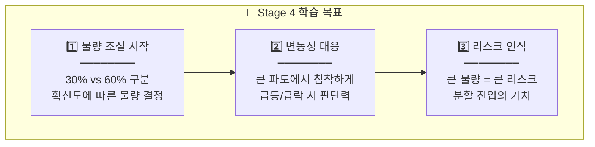
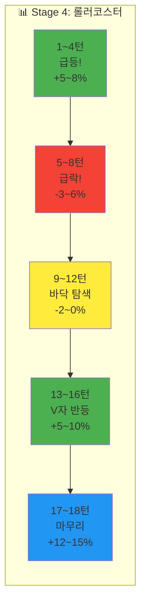

# 🌿 Stage 4: 에코프로의 바다

## 📋 스테이지 정보

| 항목 | 내용 |
|------|------|
| **스테이지** | Stage 4 (중급 시작!) |
| **종목명** | 에코프로 |
| **종목코드** | 086520 |
| **난이도** | ★★★☆☆ (큰 파도) |
| **목표 수익률** | +15% |
| **제한 시간** | 5분 (300초) |
| **턴 수** | 18턴 |
| **선택지** | 🆕 5개 (-60%, -30%, 0%, +30%, +60%) |
| **물타기** | ❌ 비활성화 |
| **시작 에너지** | 90% |

---

## 🆕 새로운 요소: 5선지 물량 조절!

```
┌─────────────────────────────────────────────────────────────────┐
│                                                                 │
│  🆕 Stage 4부터 5선지로 업그레이드!                             │
│  ━━━━━━━━━━━━━━━━━━━━━━━━━━━━━━━━━━━━━━━━━━━━━━━━━━━━━━━━━━━   │
│                                                                 │
│       🔴 매도                              매수 🟢              │
│   ◀━━━━━━━━━━━━━━━━━●━━━━━━━━━━━━━━━━━▶                        │
│   -60%   -30%       0%       +30%   +60%                        │
│    ↑       ↑        ↑         ↑       ↑                         │
│  전량    일부    유지     일부    전량                          │
│  매도    매도             매수    매수                          │
│                                                                 │
│  💡 이제 "얼마나" 사고팔지도 결정해야 해요!                     │
│                                                                 │
│  • -60%: 확신 있는 대량 매도 (강한 하락 예상)                   │
│  • -30%: 조심스러운 소량 매도 (약한 하락 예상)                  │
│  • 0%: 관망 (방향 불확실)                                       │
│  • +30%: 조심스러운 소량 매수 (약한 상승 예상)                  │
│  • +60%: 확신 있는 대량 매수 (강한 상승 예상)                   │
│                                                                 │
└─────────────────────────────────────────────────────────────────┘
```

---

## 📈 종목 특성

```
┌─────────────────────────────────────────────────────────────────┐
│                                                                 │
│  📊 에코프로 (086520)                                           │
│  ━━━━━━━━━━━━━━━━━━━━━━━━━━━━━━━━━━━━━━━━━━━━━━━━━━━━━━━━━━━   │
│                                                                 │
│  🏢 업종: 2차전지 소재 (양극재)                                 │
│  💰 시가총액: 중형주 (10조원+)                                  │
│  📉 일 변동성: 4~6% (높음!)                                     │
│                                                                 │
│  ⚠️ 특징:                                                       │
│  • 2023년 급등 후 급락으로 유명한 종목                          │
│  • 테마주 특성상 급등락이 빈번                                  │
│  • 하루에 ±5% 이상 움직이기도 함                               │
│                                                                 │
│  💡 투자 포인트:                                                │
│  • "이제부터 진짜 파도가 시작됩니다"                            │
│  • 물량 조절이 생존의 핵심!                                     │
│                                                                 │
└─────────────────────────────────────────────────────────────────┘
```

---

## 🎯 학습 목표



---

## 💰 시작 조건

| 항목 | 값 |
|------|------|
| **시작 자금** | 20,000,000원 |
| **시작 보유량** | 150주 |
| **평균 매입가** | 95,000원 |
| **시작 가격** | 98,000원 (+3.2%) |
| **예수금** | 7,500,000원 |

---

## 🌊 턴별 시나리오 (18턴)

### 전체 흐름: 롤러코스터 🎢



---

### Turn 1: 장 초반 급등 시작!

| 항목 | 내용 |
|------|------|
| **현재가** | 98,000원 |
| **변화율** | +3.2% ▲▲ |
| **추세** | 급등 시작 |
| **오늘 고/저** | 99,000 / 95,000 |

```
┌─────────────────────────────────────────────────────────────────┐
│  ⚡ FREEZE 1/18                              ⏱️  5              │
│                                                                 │
│  📊 상황: 오늘 2차전지 섹터 전체가 급등 중!                     │
│                                                                 │
│  "에코프로가 장 시작부터 힘차게 올라가고 있어요!                │
│   2차전지 테마가 살아나는 것 같습니다."                         │
│                                                                 │
│  💡 힌트: "급등 초기에는 적극적으로! 30%? 60%?"                 │
│                                                                 │
└─────────────────────────────────────────────────────────────────┘
```

| 선택 | 결과 (+2.8%) | 판정 |
|:---:|:-----------:|:---:|
| +60% | 🎉 PERFECT | "대량 매수 대박!" |
| +30% | 🎉 GREAT | "좋은 진입!" |
| 0% | 😅 MISS | "기회 놓침" |
| -30% | 💀 BAD | "왜 팔았어요!" |
| -60% | 💀 BAD | "역방향!" |

**권장: +60% 또는 +30%**

---

### Turn 2: 급등 가속!

| 항목 | 내용 |
|------|------|
| **현재가** | 101,000원 |
| **변화율** | +6.3% ▲▲▲ |
| **추세** | 급등 가속 |

```
💡 힌트: "파도가 점점 커지고 있어요! 추세를 따라가세요!"

권장: +30% (이미 포지션 있으면) 또는 +60% (아직 적으면)
결과: +2.5% 상승 | 판정: GREAT~PERFECT
```

---

### Turn 3: 고점 경고!

| 항목 | 내용 |
|------|------|
| **현재가** | 103,500원 |
| **변화율** | +8.9% ▲▲▲ |
| **추세** | 급등 (과열?) |

```
💡 힌트: "너무 빨리 올랐어요... 욕심을 줄여야 할 때?"

권장: 0% 또는 -30% (일부 익절)
결과: -1.5% 하락 | 판정: GOOD (유지/익절 시)
```

---

### Turn 4: 첫 번째 변곡점! ⚡

| 항목 | 내용 |
|------|------|
| **현재가** | 101,500원 |
| **변화율** | +6.8% ▼ |
| **추세** | 하락 전환! |

```
┌─────────────────────────────────────────────────────────────────┐
│  ⚡ FREEZE 4/18                              ⏱️  5              │
│                                                                 │
│  ⚠️ 상황: 고점에서 매물이 쏟아지고 있다!                       │
│                                                                 │
│  "급등 후 차익실현 매물이 나오고 있어요!                        │
│   파도가 꺾이기 시작합니다!"                                    │
│                                                                 │
│  💡 힌트: "고점에서 욕심부리면 수익이 녹아요"                   │
│                                                                 │
└─────────────────────────────────────────────────────────────────┘
```

**권장: -30% 또는 -60%** (익절!)

---

### Turn 5~8: 급락 구간! 🔻

| 턴 | 현재가 | 변화율 | 추세 | 권장 | 핵심 |
|:--:|:-----:|:-----:|:---:|:---:|------|
| 5 | 98,500 | +3.7% | ▼▼ | -60% | "급락 시작!" |
| 6 | 95,000 | 0% | ▼▼▼ | -30% | "폭풍우!" |
| 7 | 92,500 | -2.6% | ▼▼ | 0% | "바닥인가?" |
| 8 | 91,000 | -4.2% | ▼ | 0% | "아직 불안..." |

```
💡 급락 구간 학습 포인트:
• 급락 초기(-30%~-60%)에 대량 매도로 손실 방어
• 바닥 근처에서는 관망(0%)
• 섣부른 매수 금지!
```

---

### Turn 9~12: 바닥 탐색 & 반등 신호

| 턴 | 현재가 | 변화율 | 추세 | 권장 | 핵심 |
|:--:|:-----:|:-----:|:---:|:---:|------|
| 9 | 90,500 | -4.7% | ▼ | 0% | "바닥 탐색" |
| 10 | 91,500 | -3.7% | → | +30% | "반등 신호?" |
| 11 | 94,000 | -1.1% | ▲ | +30% | "반등 확인!" |
| 12 | 97,000 | +2.1% | ▲▲ | +60% | "V자 반등!" |

```
💡 반등 구간 학습 포인트:
• 바닥 확인 전에는 소량(+30%)으로 진입
• 반등 확인 후 추가 매수(+60%)
• 분할 매수가 리스크를 줄임
```

---

### Turn 13~16: V자 반등 가속!

| 턴 | 현재가 | 변화율 | 추세 | 권장 | 핵심 |
|:--:|:-----:|:-----:|:---:|:---:|------|
| 13 | 101,000 | +6.3% | ▲▲▲ | +30% | "강한 반등!" |
| 14 | 105,000 | +10.5% | ▲▲▲ | +30% | "목표 근접!" |
| 15 | 108,000 | +13.7% | ▲▲ | 0% | "욕심 조절" |
| 16 | 109,500 | +15.3% | ▲ | -30% | "익절 시작" |

---

### Turn 17~18: 마무리

| 턴 | 현재가 | 변화율 | 추세 | 권장 | 핵심 |
|:--:|:-----:|:-----:|:---:|:---:|------|
| 17 | 110,000 | +15.8% | ▲ | 0% | "목표 달성!" |
| 18 | 110,500 | +16.3% | ▲ | 0% | "마무리!" |

---

## 📊 시나리오 요약표

| 턴 | 변화율 | 추세 | 권장 | 핵심 학습 |
|:--:|:-----:|:---:|:---:|----------|
| 1 | +3.2% | ▲▲ | +60% | 급등 초기 대량 진입 |
| 2 | +6.3% | ▲▲▲ | +30% | 추세 추종 |
| 3 | +8.9% | ▲▲▲ | 0% | 과열 경계 |
| 4 | +6.8% | ▼ | -30% | ⚡ 변곡점 익절 |
| 5 | +3.7% | ▼▼ | -60% | 급락 대량 매도 |
| 6 | 0% | ▼▼▼ | -30% | 손실 방어 |
| 7 | -2.6% | ▼▼ | 0% | 바닥 관망 |
| 8 | -4.2% | ▼ | 0% | 인내 |
| 9 | -4.7% | ▼ | 0% | 바닥 탐색 |
| 10 | -3.7% | → | +30% | 소량 진입 |
| 11 | -1.1% | ▲ | +30% | 반등 확인 |
| 12 | +2.1% | ▲▲ | +60% | 대량 추가 |
| 13 | +6.3% | ▲▲▲ | +30% | 추세 가속 |
| 14 | +10.5% | ▲▲▲ | +30% | 목표 근접 |
| 15 | +13.7% | ▲▲ | 0% | 욕심 조절 |
| 16 | +15.3% | ▲ | -30% | 익절 시작 |
| 17 | +15.8% | ▲ | 0% | 수익 확정 |
| 18 | +16.3% | ▲ | 0% | 마무리 |

---

## 🎓 Stage 4 완료 후 배운 점

```
┌─────────────────────────────────────────────────────────────────┐
│                                                                 │
│  🎓 Stage 4에서 배운 것들                                       │
│                                                                 │
│  ✅ 1. 물량 조절 (30% vs 60%)                                   │
│     • 확신 높음 → 60% (대량)                                    │
│     • 확신 낮음 → 30% (소량)                                    │
│     • 불확실 → 0% (관망)                                        │
│                                                                 │
│  ✅ 2. 급등/급락 대응                                           │
│     • 급등 초기 = 적극 매수                                     │
│     • 급등 후 과열 = 익절 준비                                  │
│     • 급락 초기 = 빠른 매도                                     │
│     • 급락 후 바닥 = 분할 매수                                  │
│                                                                 │
│  ✅ 3. 분할 진입의 가치                                         │
│     • 한 번에 몰빵 ❌                                           │
│     • 나눠서 진입 ✅                                            │
│     • 틀려도 회복 가능                                          │
│                                                                 │
│  💡 다음: Stage 5 한미반도체 - 물타기 해금!                     │
│                                                                 │
└─────────────────────────────────────────────────────────────────┘
```

---

**문서 끝**
