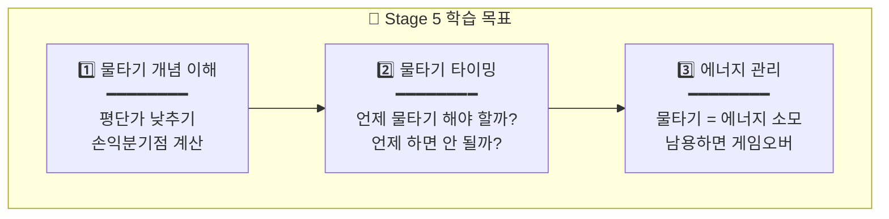
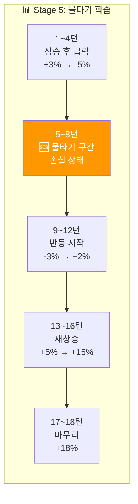
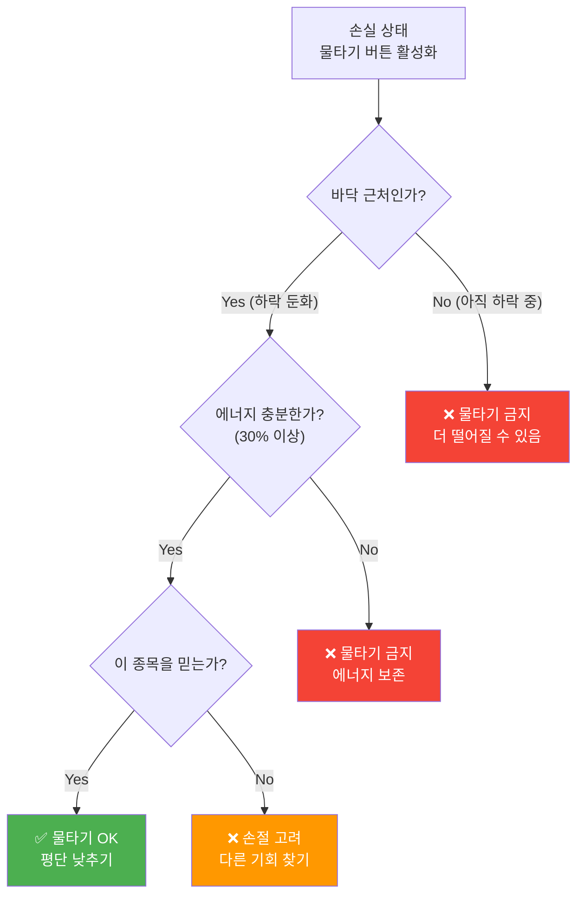

# 🌿 Stage 5: 한미반도체의 바다

## 📋 스테이지 정보

| 항목 | 내용 |
|------|------|
| **스테이지** | Stage 5 |
| **종목명** | 한미반도체 |
| **종목코드** | 042700 |
| **난이도** | ★★★☆☆ (물타기의 바다) |
| **목표 수익률** | +18% |
| **제한 시간** | 5분 (300초) |
| **턴 수** | 18턴 |
| **선택지** | 5개 (-60%, -30%, 0%, +30%, +60%) |
| **물타기** | 🆕 ✅ 활성화! |
| **시작 에너지** | 85% |

---

## 🆕 새로운 요소: 물타기 해금!

```
┌─────────────────────────────────────────────────────────────────┐
│                                                                 │
│  🆕 Stage 5부터 물타기 버튼 활성화!                             │
│  ━━━━━━━━━━━━━━━━━━━━━━━━━━━━━━━━━━━━━━━━━━━━━━━━━━━━━━━━━━━   │
│                                                                 │
│  ┌─────────────────────────────────────────────────────────┐   │
│  │                                                         │   │
│  │   🆘 물타기란?                                          │   │
│  │   • 손실 중일 때 추가 매수하여 평단가를 낮추는 전략     │   │
│  │   • 반등 시 손익분기점에 더 빨리 도달                   │   │
│  │                                                         │   │
│  │   ⚠️ 하지만 위험해요!                                   │   │
│  │   • 에너지 -10% 소모                                    │   │
│  │   • 더 떨어지면 손실 확대                               │   │
│  │   • 남용하면 계좌가 녹아요                              │   │
│  │                                                         │   │
│  │   💡 사용 조건:                                         │   │
│  │   • 손실 상태일 때만 활성화                             │   │
│  │   • 에너지 20% 이상 필요                                │   │
│  │   • 예수금 충분해야 함                                  │   │
│  │                                                         │   │
│  └─────────────────────────────────────────────────────────┘   │
│                                                                 │
└─────────────────────────────────────────────────────────────────┘
```

---

## 📈 종목 특성

```
┌─────────────────────────────────────────────────────────────────┐
│                                                                 │
│  📊 한미반도체 (042700)                                         │
│  ━━━━━━━━━━━━━━━━━━━━━━━━━━━━━━━━━━━━━━━━━━━━━━━━━━━━━━━━━━━   │
│                                                                 │
│  🏢 업종: 반도체 장비 (본딩 장비)                               │
│  💰 시가총액: 중형주 (5조원+)                                   │
│  📉 일 변동성: 5~7% (높음)                                      │
│                                                                 │
│  ✅ 특징:                                                       │
│  • AI/HBM 관련 수혜주로 급등                                    │
│  • 변동성이 크고 급등락 빈번                                    │
│  • 물타기를 배우기 좋은 종목                                    │
│                                                                 │
│  💡 투자 포인트:                                                │
│  • "물타기의 양날의 검을 배우는 시간"                           │
│  • 적절한 물타기 vs 무분별한 물타기                             │
│                                                                 │
└─────────────────────────────────────────────────────────────────┘
```

---

## 🎯 학습 목표



---

## 💰 시작 조건

| 항목 | 값 |
|------|------|
| **시작 자금** | 25,000,000원 |
| **시작 보유량** | 200주 |
| **평균 매입가** | 85,000원 |
| **시작 가격** | 88,000원 (+3.5%) |
| **예수금** | 10,000,000원 |

---

## 🌊 턴별 시나리오 (18턴)

### 전체 흐름: 물타기 학습 시나리오



---

### Turn 1~3: 상승 후 급락 조짐

| 턴 | 현재가 | 변화율 | 추세 | 권장 | 힌트 |
|:--:|:-----:|:-----:|:---:|:---:|------|
| 1 | 88,000 | +3.5% | ▲ | +30% | "좋은 시작!" |
| 2 | 91,000 | +7.1% | ▲▲ | +30% | "급등 중!" |
| 3 | 89,000 | +4.7% | ▼ | -30% | "고점 신호?" |

---

### Turn 4~6: 급락! 손실 구간 진입 💀

| 턴 | 현재가 | 변화율 | 추세 | 권장 | 힌트 |
|:--:|:-----:|:-----:|:---:|:---:|------|
| 4 | 84,000 | -1.2% | ▼▼▼ | -60% | "급락 시작!" |
| 5 | 80,000 | -5.9% | ▼▼ | 0% | "손실 구간..." |
| 6 | 78,000 | -8.2% | ▼ | 0% | "바닥인가..." |

---

### Turn 7: 🆘 물타기 선택지 등장!

```
┌─────────────────────────────────────────────────────────────────┐
│  ⚡ FREEZE 7/18                              ⏱️  5              │
│                                                                 │
│  💀 상황: 계좌가 빨개지고 있다!                                 │
│                                                                 │
│  현재가: 77,000원 (-9.4%)                                       │
│  평단가: 85,000원                                               │
│  손실: -1,600,000원 (-9.4%)                                     │
│  에너지: 65%                                                    │
│                                                                 │
│  ╔═══════════════════════════════════════════════════════════╗ │
│  ║                                                           ║ │
│  ║   🆘 [물타기] 버튼이 활성화되었습니다!                    ║ │
│  ║                                                           ║ │
│  ║   물타기 시:                                              ║ │
│  ║   • 추가 매수: 50주 (77,000원)                            ║ │
│  ║   • 새 평단가: 81,800원 (↓3,200원 개선!)                  ║ │
│  ║   • 에너지: -10% (65% → 55%)                              ║ │
│  ║                                                           ║ │
│  ║   ⚠️ 주의: 더 떨어지면 손실 확대!                         ║ │
│  ║                                                           ║ │
│  ╚═══════════════════════════════════════════════════════════╝ │
│                                                                 │
│  💡 힌트: "바닥 근처라면 물타기가 유효할 수 있어요.             │
│          하지만 아직 떨어질 수도 있어요. 신중하게!"             │
│                                                                 │
└─────────────────────────────────────────────────────────────────┘
```

| 선택 | 결과 (+2% 반등) | 판정 |
|:---:|:--------------:|:---:|
| 🆘 물타기 | 평단 낮아짐, 반등 시 빠른 회복 | GREAT |
| +30% 매수 | 일반 추가 매수 | GOOD |
| 0% 유지 | 관망 | OK |
| -30% 매도 | 손절 | MISS (반등했으므로) |

**권장: 🆘 물타기 또는 +30%** (바닥 근처 판단 시)

---

### Turn 8: 물타기 결과 확인

| 항목 | 내용 |
|------|------|
| **현재가** | 79,000원 |
| **변화율** | -7.1% ▲ (반등 중) |
| **추세** | 바닥 탈출 |

```
💡 물타기 후:
• 물타기 O: 새 평단 81,800원, 손실 -5.5% → 개선!
• 물타기 X: 기존 평단 85,000원, 손실 -7.1%

권장: 0% 유지 (반등 확인 중)
```

---

### Turn 9~12: 반등 구간

| 턴 | 현재가 | 변화율 | 추세 | 권장 | 핵심 |
|:--:|:-----:|:-----:|:---:|:---:|------|
| 9 | 82,000 | -3.5% | ▲▲ | +30% | "반등 시작!" |
| 10 | 86,000 | +1.2% | ▲▲ | +30% | "손익분기점 근처!" |
| 11 | 90,000 | +5.9% | ▲▲▲ | +30% | "수익 전환!" |
| 12 | 94,000 | +10.6% | ▲▲ | 0% | "물타기 성공!" |

```
💡 물타기 성공 시나리오:
• 물타기 O: 평단 81,800원 → 94,000원 = +14.9% 수익!
• 물타기 X: 평단 85,000원 → 94,000원 = +10.6% 수익
→ 물타기로 +4.3% 추가 수익!
```

---

### Turn 13~16: 목표를 향해

| 턴 | 현재가 | 변화율 | 추세 | 권장 | 핵심 |
|:--:|:-----:|:-----:|:---:|:---:|------|
| 13 | 97,000 | +14.1% | ▲▲ | +30% | "순항 중!" |
| 14 | 100,000 | +17.6% | ▲▲ | 0% | "목표 근접!" |
| 15 | 101,500 | +19.4% | ▲ | -30% | "익절 시작" |
| 16 | 100,500 | +18.2% | → | 0% | "수익 확정" |

---

### Turn 17~18: 마무리

| 턴 | 현재가 | 변화율 | 추세 | 권장 |
|:--:|:-----:|:-----:|:---:|:---:|
| 17 | 101,000 | +18.8% | ▲ | 0% |
| 18 | 101,500 | +19.4% | ▲ | 0% |

---

## 🆘 물타기 판단 가이드



### 물타기 DO / DON'T

| ✅ DO (해야 할 때) | ❌ DON'T (하면 안 될 때) |
|------------------|----------------------|
| 바닥 근처라고 판단될 때 | 아직 하락 중일 때 |
| 에너지가 충분할 때 | 에너지가 부족할 때 |
| 반등 신호가 보일 때 | 추가 악재가 있을 때 |
| 종목에 확신이 있을 때 | 그냥 손실이 싫어서 |

---

## 📊 시나리오 요약표

| 턴 | 변화율 | 상태 | 권장 | 핵심 학습 |
|:--:|:-----:|:---:|:---:|----------|
| 1 | +3.5% | 수익 | +30% | 진입 |
| 2 | +7.1% | 수익 | +30% | 추가 |
| 3 | +4.7% | 수익 | -30% | 고점 경계 |
| 4 | -1.2% | 손실 | -60% | 급락 대응 |
| 5 | -5.9% | 손실 | 0% | 관망 |
| 6 | -8.2% | 손실 | 0% | 바닥 탐색 |
| **7** | -9.4% | 손실 | **🆘** | **물타기 타이밍!** |
| 8 | -7.1% | 손실 | 0% | 반등 확인 |
| 9 | -3.5% | 손실 | +30% | 반등 매수 |
| 10 | +1.2% | 손익분기 | +30% | 손익분기 돌파 |
| 11 | +5.9% | 수익 | +30% | 추가 매수 |
| 12 | +10.6% | 수익 | 0% | 수익 확대 |
| 13 | +14.1% | 수익 | +30% | 추세 추종 |
| 14 | +17.6% | 수익 | 0% | 목표 근접 |
| 15 | +19.4% | 수익 | -30% | 익절 |
| 16 | +18.2% | 수익 | 0% | 유지 |
| 17 | +18.8% | 수익 | 0% | 마무리 |
| 18 | +19.4% | 수익 | 0% | 완료 |

---

## 🎓 Stage 5 완료 후 배운 점

```
✅ 1. 물타기의 개념
   • 손실 중 추가 매수 → 평단가 하락
   • 반등 시 손익분기점에 빨리 도달

✅ 2. 물타기 타이밍
   • 바닥 근처에서만!
   • 아직 하락 중이면 금지

✅ 3. 물타기의 대가
   • 에너지 -10% 소모
   • 실패하면 손실 확대
   • 남용하면 게임오버

✅ 4. 에너지 관리
   • 물타기는 체력 소모
   • 에너지 = 멘탈
   • 보존해야 생존

💡 다음: Stage 6 크래프톤 - 이벤트 대응!
```

---

**문서 끝**
