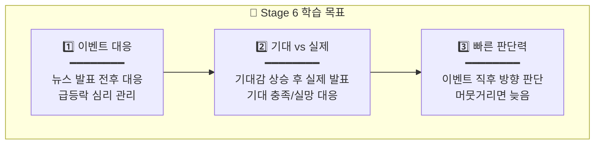
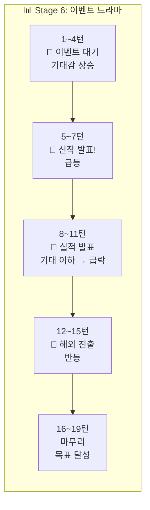
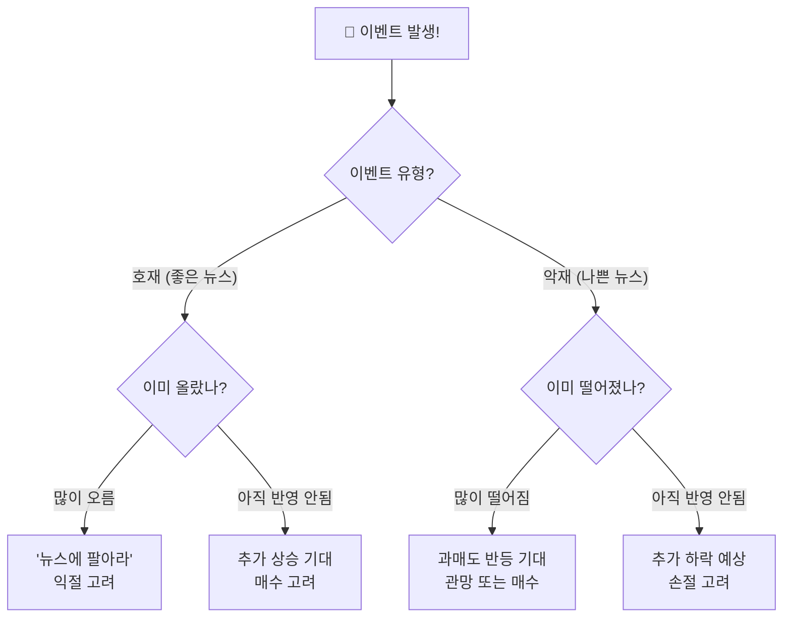

# 🌿 Stage 6: 크래프톤의 바다

## 📋 스테이지 정보

| 항목 | 내용 |
|------|------|
| **스테이지** | Stage 6 |
| **종목명** | 크래프톤 |
| **종목코드** | 259960 |
| **난이도** | ★★★☆☆ (이벤트의 바다) |
| **목표 수익률** | +22% |
| **제한 시간** | 5분 (300초) |
| **턴 수** | 19턴 |
| **선택지** | 5개 + 물타기 |
| **물타기** | ✅ 활성화 |
| **시작 에너지** | 80% |

---

## 🆕 새로운 요소: 이벤트 대응!

```
┌─────────────────────────────────────────────────────────────────┐
│                                                                 │
│  🆕 Stage 6: 뉴스/이벤트에 따른 급등락!                         │
│  ━━━━━━━━━━━━━━━━━━━━━━━━━━━━━━━━━━━━━━━━━━━━━━━━━━━━━━━━━━━   │
│                                                                 │
│  📰 이벤트 유형:                                                │
│  • 실적 발표 → 급등 or 급락                                     │
│  • 신작 출시 소식 → 기대감 상승                                 │
│  • 경쟁사 뉴스 → 반사 이익/손해                                 │
│  • 해외 진출 소식 → 기대감 상승                                 │
│                                                                 │
│  💡 학습 포인트:                                                │
│  • 이벤트 전후로 변동성 급증                                    │
│  • "소문에 사서 뉴스에 팔아라"                                  │
│  • 이벤트 직후 방향 판단이 핵심                                 │
│                                                                 │
└─────────────────────────────────────────────────────────────────┘
```

---

## 📈 종목 특성

```
┌─────────────────────────────────────────────────────────────────┐
│                                                                 │
│  📊 크래프톤 (259960)                                           │
│  ━━━━━━━━━━━━━━━━━━━━━━━━━━━━━━━━━━━━━━━━━━━━━━━━━━━━━━━━━━━   │
│                                                                 │
│  🏢 업종: 게임 개발/퍼블리싱                                    │
│  💰 시가총액: 대형주 (15조원+)                                  │
│  📉 일 변동성: 4~6% (이벤트 시 10%+)                            │
│  🎮 대표작: 배틀그라운드 (PUBG)                                 │
│                                                                 │
│  ✅ 특징:                                                       │
│  • 실적/신작 발표에 극도로 민감                                 │
│  • 이벤트 전후 급등락 빈번                                      │
│  • 기대 vs 실망의 갭이 큼                                       │
│                                                                 │
└─────────────────────────────────────────────────────────────────┘
```

---

## 🎯 학습 목표



---

## 💰 시작 조건

| 항목 | 값 |
|------|------|
| **시작 자금** | 30,000,000원 |
| **시작 보유량** | 100주 |
| **평균 매입가** | 250,000원 |
| **시작 가격** | 255,000원 (+2%) |
| **예수금** | 10,000,000원 |

---

## 🌊 턴별 시나리오 (19턴)

### 전체 흐름: 이벤트 드라마 📰



---

### Turn 1~4: 이벤트 대기 (기대감 상승)

| 턴 | 현재가 | 변화율 | 추세 | 권장 | 이벤트 |
|:--:|:-----:|:-----:|:---:|:---:|--------|
| 1 | 255,000 | +2% | ▲ | +30% | - |
| 2 | 260,000 | +4% | ▲ | +30% | 📰 "신작 발표 예고!" |
| 3 | 268,000 | +7.2% | ▲▲ | +30% | 기대감 상승 |
| 4 | 275,000 | +10% | ▲▲▲ | 0% | 발표 직전 |

```
💡 이벤트 전 학습:
• "소문에 사라" → 기대감으로 상승
• 발표 직전에는 신중하게
• 이미 많이 올랐으면 리스크 관리
```

---

### Turn 5~7: 📰 신작 발표! (기대 충족 → 급등)

```
┌─────────────────────────────────────────────────────────────────┐
│  ⚡ FREEZE 5/19                              ⏱️  5              │
│                                                                 │
│  📰 [속보] 크래프톤 신작 공개!                                  │
│                                                                 │
│  "크래프톤이 기대작 '인조이'를 정식 발표했습니다!               │
│   시장 반응이 매우 뜨겁습니다!"                                 │
│                                                                 │
│  현재가: 285,000원 (+14%)                                       │
│                                                                 │
│  💡 힌트: "좋은 뉴스! 하지만 이미 많이 올랐어요..."             │
│                                                                 │
└─────────────────────────────────────────────────────────────────┘
```

| 턴 | 현재가 | 변화율 | 추세 | 권장 | 이벤트 |
|:--:|:-----:|:-----:|:---:|:---:|--------|
| 5 | 285,000 | +14% | ▲▲▲ | 0% | 📰 신작 발표! |
| 6 | 290,000 | +16% | ▲▲ | -30% | 차익실현 시작 |
| 7 | 282,000 | +12.8% | ▼ | -30% | "뉴스에 팔아라" |

---

### Turn 8~11: 📰 실적 발표 (기대 이하 → 급락!)

```
┌─────────────────────────────────────────────────────────────────┐
│  ⚡ FREEZE 8/19                              ⏱️  5              │
│                                                                 │
│  📰 [속보] 크래프톤 실적 발표... 기대 이하!                     │
│                                                                 │
│  "실적이 시장 예상치를 하회했습니다.                            │
│   신작 기대감으로 올랐던 주가가 급락하고 있습니다!"             │
│                                                                 │
│  현재가: 265,000원 (+6%) ← 급락 중!                            │
│                                                                 │
│  💡 힌트: "기대가 크면 실망도 크다..."                          │
│                                                                 │
└─────────────────────────────────────────────────────────────────┘
```

| 턴 | 현재가 | 변화율 | 추세 | 권장 | 이벤트 |
|:--:|:-----:|:-----:|:---:|:---:|--------|
| 8 | 265,000 | +6% | ▼▼▼ | -60% | 📰 실적 실망! |
| 9 | 250,000 | 0% | ▼▼ | -30% | 급락 지속 |
| 10 | 242,000 | -3.2% | ▼ | 0% | 바닥 탐색 |
| 11 | 240,000 | -4% | → | +30% | 바닥? |

---

### Turn 12~15: 📰 해외 진출 소식 (반등!)

```
┌─────────────────────────────────────────────────────────────────┐
│  ⚡ FREEZE 12/19                             ⏱️  5              │
│                                                                 │
│  📰 [속보] 크래프톤, 중동 시장 진출 발표!                       │
│                                                                 │
│  "크래프톤이 중동 시장 진출을 공식 발표했습니다.                │
│   새로운 성장 동력에 대한 기대감이 살아나고 있습니다!"          │
│                                                                 │
│  현재가: 248,000원 (-0.8%)                                      │
│                                                                 │
│  💡 힌트: "또 다른 이벤트! 이번엔 어떨까요?"                    │
│                                                                 │
└─────────────────────────────────────────────────────────────────┘
```

| 턴 | 현재가 | 변화율 | 추세 | 권장 | 이벤트 |
|:--:|:-----:|:-----:|:---:|:---:|--------|
| 12 | 248,000 | -0.8% | ▲ | +60% | 📰 해외 진출! |
| 13 | 262,000 | +4.8% | ▲▲ | +30% | 반등 가속 |
| 14 | 278,000 | +11.2% | ▲▲▲ | +30% | 급등! |
| 15 | 295,000 | +18% | ▲▲ | 0% | 목표 근접 |

---

### Turn 16~19: 마무리

| 턴 | 현재가 | 변화율 | 추세 | 권장 |
|:--:|:-----:|:-----:|:---:|:---:|
| 16 | 302,000 | +20.8% | ▲ | -30% |
| 17 | 305,000 | +22% | ▲ | 0% |
| 18 | 303,000 | +21.2% | → | 0% |
| 19 | 306,000 | +22.4% | ▲ | 0% |

---

## 📰 이벤트 대응 가이드



### 이벤트 대응 원칙

| 상황 | 대응 전략 | 예시 |
|------|----------|------|
| 이벤트 전 기대감 상승 | 소문에 사라 | +30% 매수 |
| 호재 발표 후 급등 | 뉴스에 팔아라 | -30% 익절 |
| 악재 발표 직후 | 빠른 손절 | -60% 매도 |
| 과도한 하락 후 | 반등 매수 | +30% 진입 |

---

## 📊 시나리오 요약표

| 턴 | 변화율 | 이벤트 | 권장 | 핵심 학습 |
|:--:|:-----:|--------|:---:|----------|
| 1 | +2% | - | +30% | 기본 진입 |
| 2 | +4% | 📰 신작 예고 | +30% | 기대감 매수 |
| 3 | +7.2% | 기대 상승 | +30% | 소문에 사라 |
| 4 | +10% | 발표 직전 | 0% | 신중 대기 |
| **5** | +14% | 📰 **신작 발표!** | 0% | 이벤트 반응 |
| 6 | +16% | 차익실현 | -30% | 뉴스에 팔아라 |
| 7 | +12.8% | 하락 시작 | -30% | 익절 실행 |
| **8** | +6% | 📰 **실적 실망** | -60% | 악재 대응 |
| 9 | 0% | 급락 | -30% | 손절 |
| 10 | -3.2% | 바닥 탐색 | 0% | 관망 |
| 11 | -4% | 바닥? | +30% | 반등 준비 |
| **12** | -0.8% | 📰 **해외 진출** | +60% | 호재 대응 |
| 13 | +4.8% | 반등 | +30% | 추세 추종 |
| 14 | +11.2% | 급등 | +30% | 추가 매수 |
| 15 | +18% | 목표 근접 | 0% | 욕심 조절 |
| 16 | +20.8% | 목표 달성 | -30% | 익절 |
| 17 | +22% | 마무리 | 0% | 유지 |
| 18 | +21.2% | - | 0% | 안정 |
| 19 | +22.4% | 완료 | 0% | 마무리 |

---

## 🎓 Stage 6 완료 후 배운 점

```
✅ 1. "소문에 사서 뉴스에 팔아라"
   • 이벤트 전 기대감 = 매수 기회
   • 이벤트 발표 후 = 익절 타이밍

✅ 2. 기대 vs 실제
   • 기대 충족 = 추가 상승 가능
   • 기대 이하 = 급락 주의

✅ 3. 빠른 판단
   • 이벤트 직후 방향 판단 중요
   • 머뭇거리면 기회/손해 확대

✅ 4. 심리 관리
   • 급등 시 욕심 자제
   • 급락 시 공포 자제

💡 다음: Stage 7 레인보우로보틱스 - 폭풍 생존!
```

---

**문서 끝**
