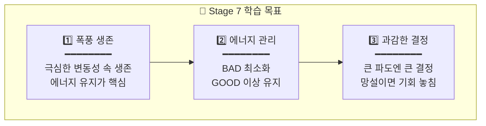
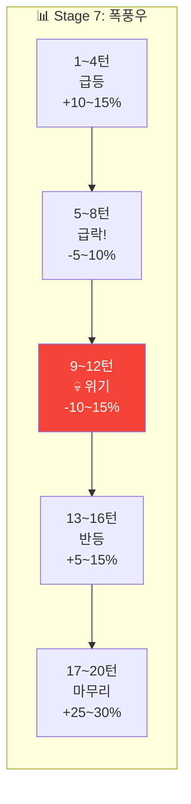
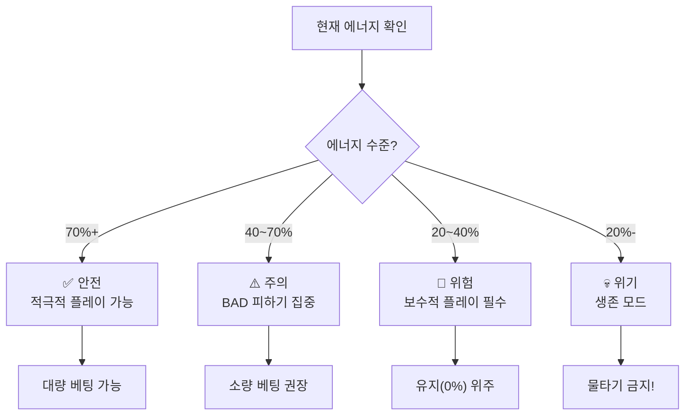

# 🔥 Stage 7: 레인보우로보틱스의 바다

## 📋 스테이지 정보

| 항목 | 내용 |
|------|------|
| **스테이지** | Stage 7 (고급 시작!) |
| **종목명** | 레인보우로보틱스 |
| **종목코드** | 277810 |
| **난이도** | ★★★★☆ (폭풍의 바다) |
| **목표 수익률** | +30% |
| **제한 시간** | 8분 (480초) |
| **턴 수** | 20턴 |
| **선택지** | 5개 + 물타기 |
| **물타기** | ✅ 활성화 |
| **시작 에너지** | 75% ⚠️ |

---

## ⚠️ 경고: 이제부터 진짜 폭풍!

```
┌─────────────────────────────────────────────────────────────────┐
│                                                                 │
│  ⛈️ Stage 7부터는 고급 단계입니다!                              │
│  ━━━━━━━━━━━━━━━━━━━━━━━━━━━━━━━━━━━━━━━━━━━━━━━━━━━━━━━━━━━   │
│                                                                 │
│  ⚠️ 변화 사항:                                                  │
│  • 시작 에너지 75%로 감소                                       │
│  • 변동성 8~15% (하루에 급등락)                                 │
│  • 에너지 시간 감소 시작 (-1%/30초)                             │
│  • 연속 BAD 시 게임오버 위험                                    │
│                                                                 │
│  💀 생존이 핵심입니다!                                          │
│  • 에너지 관리가 가장 중요                                      │
│  • 무리한 베팅 = 게임오버                                       │
│  • 물타기 남용 주의                                             │
│                                                                 │
└─────────────────────────────────────────────────────────────────┘
```

---

## 📈 종목 특성

```
┌─────────────────────────────────────────────────────────────────┐
│                                                                 │
│  📊 레인보우로보틱스 (277810)                                   │
│  ━━━━━━━━━━━━━━━━━━━━━━━━━━━━━━━━━━━━━━━━━━━━━━━━━━━━━━━━━━━   │
│                                                                 │
│  🏢 업종: 로봇/AI                                               │
│  💰 시가총액: 중소형 (1조원+)                                   │
│  📉 일 변동성: 8~15% (극심!)                                    │
│                                                                 │
│  ⚠️ 특징:                                                       │
│  • 삼성전자 투자로 급등한 테마주                                │
│  • AI/로봇 뉴스에 극도로 민감                                   │
│  • 하루에 ±10~20% 움직이기도 함                                │
│                                                                 │
│  💡 투자 포인트:                                                │
│  • "미친 파도! 생존이 승리다"                                   │
│  • 한 번의 선택이 게임을 좌우                                   │
│                                                                 │
└─────────────────────────────────────────────────────────────────┘
```

---

## 🎯 학습 목표



---

## 💰 시작 조건

| 항목 | 값 |
|------|------|
| **시작 자금** | 40,000,000원 |
| **시작 보유량** | 300주 |
| **평균 매입가** | 45,000원 |
| **시작 가격** | 48,000원 (+6.7%) |
| **예수금** | 15,000,000원 |
| **에너지** | 75% ⚠️ |

---

## 🌊 턴별 시나리오 (20턴)

### 전체 흐름: 폭풍우 속 항해 ⛈️



---

### Turn 1~4: 급등! (로봇 테마 폭발)

| 턴 | 현재가 | 변화율 | 추세 | 권장 | 상황 |
|:--:|:-----:|:-----:|:---:|:---:|------|
| 1 | 48,000 | +6.7% | ▲▲ | +60% | "AI 로봇 테마 폭발!" |
| 2 | 52,000 | +15.6% | ▲▲▲ | +30% | "급등 가속!" |
| 3 | 54,000 | +20% | ▲▲▲ | 0% | "너무 빨리 올랐다..." |
| 4 | 51,000 | +13.3% | ▼ | -30% | "고점 신호!" |

---

### Turn 5~8: 급락! (루머 부인)

```
┌─────────────────────────────────────────────────────────────────┐
│  ⚡ FREEZE 5/20                              ⏱️  5              │
│                                                                 │
│  📰 [속보] 삼성전자 투자 규모, 예상보다 작아!                   │
│                                                                 │
│  "시장이 기대했던 것보다 투자 규모가 작습니다.                  │
│   주가가 급락하고 있습니다!"                                    │
│                                                                 │
│  현재가: 46,000원 (+2.2%) ▼▼▼                                  │
│  에너지: 68%                                                    │
│                                                                 │
│  💡 힌트: "폭풍이 시작됐다! 빠르게 대응하세요!"                 │
│                                                                 │
└─────────────────────────────────────────────────────────────────┘
```

| 턴 | 현재가 | 변화율 | 추세 | 권장 | 상황 |
|:--:|:-----:|:-----:|:---:|:---:|------|
| 5 | 46,000 | +2.2% | ▼▼▼ | -60% | "급락 시작!" |
| 6 | 42,000 | -6.7% | ▼▼▼ | -30% | "폭풍우!" |
| 7 | 40,000 | -11.1% | ▼▼ | 0% | "바닥인가..." |
| 8 | 38,500 | -14.4% | ▼ | 0% | "아직 불안..." |

---

### Turn 9~12: 💀 위기 구간! (에너지 관리 핵심)

```
┌─────────────────────────────────────────────────────────────────┐
│  ⚡ FREEZE 9/20                              ⏱️  5              │
│                                                                 │
│  💀 상황: 계좌가 녹고 있다! 에너지도 위험!                      │
│                                                                 │
│  현재가: 37,000원 (-17.8%)                                      │
│  평단가: 45,000원                                               │
│  손실: -2,400,000원                                             │
│  에너지: 45% ⚠️ 위험!                                          │
│                                                                 │
│  ╔═══════════════════════════════════════════════════════════╗ │
│  ║   🆘 물타기 가능                                          ║ │
│  ║   • 새 평단: 42,000원 (↓3,000원)                          ║ │
│  ║   • 에너지: -10% (45% → 35%)                              ║ │
│  ║   ⚠️ 에너지가 너무 낮아지면 위험!                         ║ │
│  ╚═══════════════════════════════════════════════════════════╝ │
│                                                                 │
│  💡 힌트: "물타기? 아니면 버티기? 에너지를 보세요!"            │
│                                                                 │
└─────────────────────────────────────────────────────────────────┘
```

| 턴 | 현재가 | 변화율 | 에너지 | 권장 | 상황 |
|:--:|:-----:|:-----:|:-----:|:---:|------|
| 9 | 37,000 | -17.8% | 45% | 0% | "바닥 탐색" |
| 10 | 36,000 | -20% | 40% | 0% | "아직 하락..." |
| 11 | 38,000 | -15.6% | 42% | +30% | "반등 신호?" |
| 12 | 42,000 | -6.7% | 50% | +60% | "반등 확인!" |

---

### Turn 13~16: 반등! (V자 회복)

| 턴 | 현재가 | 변화율 | 에너지 | 권장 | 상황 |
|:--:|:-----:|:-----:|:-----:|:---:|------|
| 13 | 48,000 | +6.7% | 60% | +30% | "손익분기 돌파!" |
| 14 | 52,000 | +15.6% | 70% | +30% | "급반등!" |
| 15 | 55,000 | +22.2% | 75% | 0% | "목표 근접!" |
| 16 | 57,000 | +26.7% | 78% | 0% | "순항!" |

---

### Turn 17~20: 마무리

| 턴 | 현재가 | 변화율 | 에너지 | 권장 | 상황 |
|:--:|:-----:|:-----:|:-----:|:---:|------|
| 17 | 58,000 | +28.9% | 80% | -30% | "익절 시작" |
| 18 | 58,500 | +30% | 82% | 0% | "목표 달성!" |
| 19 | 57,500 | +27.8% | 80% | 0% | "유지" |
| 20 | 59,000 | +31.1% | 82% | 0% | "마무리!" |

---

## ⚡ 에너지 관리 가이드



### 에너지 상태별 전략

| 에너지 | 상태 | 전략 | 베팅 가이드 |
|:-----:|:---:|------|-----------|
| 70%+ | ✅ 안전 | 적극적 | 60% 베팅 가능 |
| 50~70% | ⚠️ 주의 | 신중 | 30% 베팅 권장 |
| 30~50% | 🔴 위험 | 보수적 | 0% 위주 |
| 20~30% | 💀 위기 | 생존 | 물타기 금지 |
| 20%- | ☠️ 게임오버 위기 | 절대 보수 | 0% only |

---

## 📊 시나리오 요약표

| 턴 | 변화율 | 에너지 | 권장 | 핵심 학습 |
|:--:|:-----:|:-----:|:---:|----------|
| 1 | +6.7% | 75% | +60% | 급등 진입 |
| 2 | +15.6% | 85% | +30% | 추세 추종 |
| 3 | +20% | 88% | 0% | 과열 경계 |
| 4 | +13.3% | 85% | -30% | 고점 익절 |
| **5** | +2.2% | 75% | -60% | **급락 대응** |
| 6 | -6.7% | 60% | -30% | 손실 방어 |
| 7 | -11.1% | 52% | 0% | 관망 |
| 8 | -14.4% | 47% | 0% | 인내 |
| **9** | -17.8% | 45% | 0% | **에너지 위기** |
| 10 | -20% | 40% | 0% | 생존 모드 |
| 11 | -15.6% | 42% | +30% | 반등 신호 |
| 12 | -6.7% | 50% | +60% | 반등 확인 |
| 13 | +6.7% | 60% | +30% | 손익분기 |
| 14 | +15.6% | 70% | +30% | 급반등 |
| 15 | +22.2% | 75% | 0% | 목표 근접 |
| 16 | +26.7% | 78% | 0% | 순항 |
| 17 | +28.9% | 80% | -30% | 익절 |
| 18 | +30% | 82% | 0% | 목표 달성 |
| 19 | +27.8% | 80% | 0% | 유지 |
| 20 | +31.1% | 82% | 0% | 마무리 |

---

## 🎓 Stage 7 완료 후 배운 점

```
✅ 1. 폭풍 속 생존
   • 변동성이 클수록 침착해야 함
   • 급등/급락에 당황하지 않기

✅ 2. 에너지 관리
   • 에너지 = 생명줄
   • 낮으면 보수적, 높으면 적극적
   • 물타기는 에너지 여유 있을 때만

✅ 3. 과감한 결정
   • 큰 파도엔 큰 결정이 필요
   • 하지만 에너지 고려 필수

✅ 4. 위기에서 기회
   • 바닥에서 반등 = 큰 수익
   • 하지만 바닥 확인이 중요

💡 다음: Stage 8 마인즈랩 - 극한 판단!
```

---

**문서 끝**
