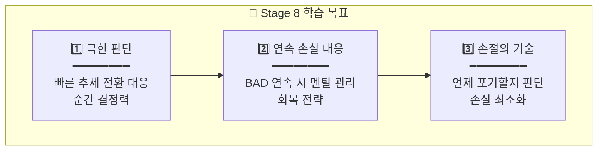
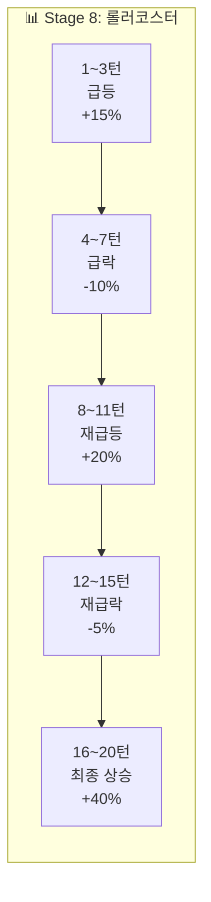

# 🔥 Stage 8: 마인즈랩의 바다

## 📋 스테이지 정보

| 항목 | 내용 |
|------|------|
| **스테이지** | Stage 8 |
| **종목명** | 마인즈랩 |
| **종목코드** | 377480 |
| **난이도** | ★★★★☆ (극한 판단) |
| **목표 수익률** | +40% |
| **제한 시간** | 8분 (480초) |
| **턴 수** | 20턴 |
| **선택지** | 5개 + 물타기 |
| **시작 에너지** | 70% |

---

## 📈 종목 특성

```
┌─────────────────────────────────────────────────────────────────┐
│                                                                 │
│  📊 마인즈랩 (377480)                                           │
│  ━━━━━━━━━━━━━━━━━━━━━━━━━━━━━━━━━━━━━━━━━━━━━━━━━━━━━━━━━━━   │
│                                                                 │
│  🏢 업종: AI/자연어처리                                         │
│  💰 시가총액: 소형 (3,000억원+)                                 │
│  📉 일 변동성: 10~20% (극심!)                                   │
│                                                                 │
│  ⚠️ 특징:                                                       │
│  • AI 테마주 중에서도 변동성 최상위                             │
│  • ChatGPT 관련 뉴스에 극도로 민감                              │
│  • 하루에 ±20% 움직이기도 함                                   │
│                                                                 │
│  💡 핵심:                                                       │
│  • "빠른 추세 전환, 빠른 판단 필요"                             │
│  • 연속 손실 대응 능력 테스트                                   │
│                                                                 │
└─────────────────────────────────────────────────────────────────┘
```

---

## 🎯 학습 목표



---

## 💰 시작 조건

| 항목 | 값 |
|------|------|
| **시작 자금** | 50,000,000원 |
| **시작 보유량** | 500주 |
| **평균 매입가** | 25,000원 |
| **시작 가격** | 27,000원 (+8%) |
| **예수금** | 20,000,000원 |
| **에너지** | 70% |

---

## 🌊 턴별 시나리오 (20턴)

### 전체 흐름: 롤러코스터 지옥 🎢



---

### Turn 1~3: 급등!

| 턴 | 현재가 | 변화율 | 추세 | 권장 | 상황 |
|:--:|:-----:|:-----:|:---:|:---:|------|
| 1 | 27,000 | +8% | ▲▲ | +60% | "AI 테마 폭발!" |
| 2 | 31,000 | +24% | ▲▲▲ | +30% | "급등 가속!" |
| 3 | 33,000 | +32% | ▲▲ | -30% | "너무 빨라!" |

---

### Turn 4~7: 급락! (첫 번째 롤러코스터)

| 턴 | 현재가 | 변화율 | 추세 | 권장 | 상황 |
|:--:|:-----:|:-----:|:---:|:---:|------|
| 4 | 28,000 | +12% | ▼▼▼ | -60% | "급락!" |
| 5 | 24,000 | -4% | ▼▼ | -30% | "손실 전환!" |
| 6 | 22,000 | -12% | ▼ | 0% | "바닥?" |
| 7 | 23,500 | -6% | ▲ | +30% | "반등 신호" |

---

### Turn 8~11: 재급등! (두 번째 롤러코스터)

| 턴 | 현재가 | 변화율 | 추세 | 권장 | 상황 |
|:--:|:-----:|:-----:|:---:|:---:|------|
| 8 | 27,000 | +8% | ▲▲▲ | +60% | "V자 반등!" |
| 9 | 32,000 | +28% | ▲▲▲ | +30% | "신고가!" |
| 10 | 35,000 | +40% | ▲▲ | 0% | "목표 달성?" |
| 11 | 33,000 | +32% | ▼ | -30% | "고점 신호" |

---

### Turn 12~15: 재급락! (세 번째 롤러코스터)

| 턴 | 현재가 | 변화율 | 추세 | 권장 | 상황 |
|:--:|:-----:|:-----:|:---:|:---:|------|
| 12 | 29,000 | +16% | ▼▼ | -30% | "또 급락!" |
| 13 | 27,500 | +10% | ▼ | 0% | "하락 둔화" |
| 14 | 29,000 | +16% | ▲ | +30% | "반등?" |
| 15 | 32,000 | +28% | ▲▲ | +30% | "재상승" |

---

### Turn 16~20: 최종 상승

| 턴 | 현재가 | 변화율 | 추세 | 권장 | 상황 |
|:--:|:-----:|:-----:|:---:|:---:|------|
| 16 | 34,000 | +36% | ▲▲ | +30% | "목표 근접!" |
| 17 | 35,000 | +40% | ▲ | 0% | "목표 달성!" |
| 18 | 35,500 | +42% | ▲ | -30% | "익절" |
| 19 | 35,000 | +40% | → | 0% | "유지" |
| 20 | 36,000 | +44% | ▲ | 0% | "마무리!" |

---

## 📊 시나리오 요약표

| 턴 | 변화율 | 권장 | 핵심 | 추세 전환 |
|:--:|:-----:|:---:|------|:--------:|
| 1 | +8% | +60% | 급등 진입 | - |
| 2 | +24% | +30% | 추세 추종 | - |
| 3 | +32% | -30% | 고점 익절 | - |
| **4** | +12% | -60% | 급락 대응 | ⚡ |
| 5 | -4% | -30% | 손실 방어 | - |
| 6 | -12% | 0% | 바닥 관망 | - |
| **7** | -6% | +30% | 반등 포착 | ⚡ |
| 8 | +8% | +60% | V자 반등 | - |
| 9 | +28% | +30% | 신고가 | - |
| 10 | +40% | 0% | 목표 도달 | - |
| **11** | +32% | -30% | 고점 익절 | ⚡ |
| 12 | +16% | -30% | 급락 대응 | - |
| 13 | +10% | 0% | 관망 | - |
| **14** | +16% | +30% | 반등 진입 | ⚡ |
| 15 | +28% | +30% | 추가 매수 | - |
| 16 | +36% | +30% | 목표 근접 | - |
| 17 | +40% | 0% | 목표 달성 | - |
| 18 | +42% | -30% | 익절 | - |
| 19 | +40% | 0% | 유지 | - |
| 20 | +44% | 0% | 마무리 | - |

---

## 🎓 Stage 8 완료 후 배운 점

```
✅ 1. 빠른 추세 전환 대응
   • 4번의 추세 전환 (⚡)
   • 전환점에서 빠른 판단 필요

✅ 2. 롤러코스터 멘탈
   • 급등→급락→급등→급락
   • 당황하지 않고 따라가기

✅ 3. 연속 손실 대응
   • BAD 연속 시 에너지 급감
   • 무리하지 말고 회복 기다리기

💡 다음: Stage 9 알체라 - 멘탈 관리!
```

---

**문서 끝**
