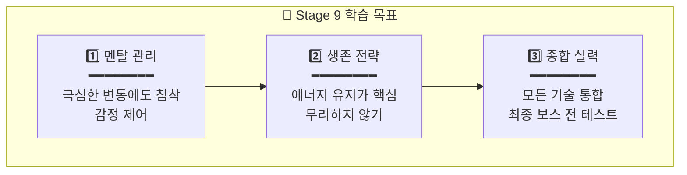
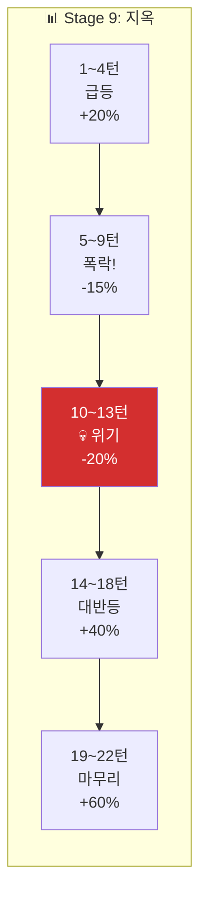
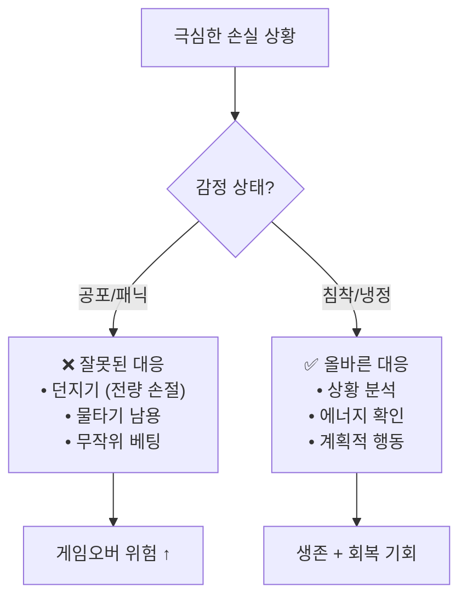

# 🔥 Stage 9: 알체라의 바다

## 📋 스테이지 정보

| 항목 | 내용 |
|------|------|
| **스테이지** | Stage 9 |
| **종목명** | 알체라 |
| **종목코드** | 347860 |
| **난이도** | ★★★★★ (지옥의 파도) |
| **목표 수익률** | +60% |
| **제한 시간** | 10분 (600초) |
| **턴 수** | 22턴 |
| **선택지** | 5개 + 물타기 |
| **시작 에너지** | 65% ⚠️ |

---

## 💀 경고: 지옥 난이도!

```
┌─────────────────────────────────────────────────────────────────┐
│                                                                 │
│  💀 Stage 9: 지옥의 파도                                        │
│  ━━━━━━━━━━━━━━━━━━━━━━━━━━━━━━━━━━━━━━━━━━━━━━━━━━━━━━━━━━━   │
│                                                                 │
│  ⚠️ 극한 조건:                                                  │
│  • 시작 에너지 65%                                              │
│  • 변동성 15~30% (미친 파도!)                                   │
│  • 에너지 시간 감소 가속 (-2%/30초)                             │
│  • 연속 BAD 3회 = 게임오버 위기                                 │
│                                                                 │
│  🎯 목표: +60%                                                  │
│  • 지금까지 배운 모든 것을 동원해야 함                          │
│  • 멘탈 관리가 최우선                                           │
│                                                                 │
│  💪 "여기까지 온 당신은 이미 프로 항해사!"                      │
│                                                                 │
└─────────────────────────────────────────────────────────────────┘
```

---

## 📈 종목 특성

```
┌─────────────────────────────────────────────────────────────────┐
│                                                                 │
│  📊 알체라 (347860)                                             │
│  ━━━━━━━━━━━━━━━━━━━━━━━━━━━━━━━━━━━━━━━━━━━━━━━━━━━━━━━━━━━   │
│                                                                 │
│  🏢 업종: AI/얼굴인식                                           │
│  💰 시가총액: 소형 (2,000억원+)                                 │
│  📉 일 변동성: 15~30% (극한!)                                   │
│                                                                 │
│  ⚠️ 특징:                                                       │
│  • 코스닥 변동성 상위 종목                                      │
│  • AI 테마 + 소형주 = 극심한 변동                               │
│  • 상한가/하한가 근처까지 가기도 함                             │
│                                                                 │
│  💡 핵심:                                                       │
│  • "멘탈이 무너지면 끝이다"                                     │
│  • 감정 제어 + 냉정한 판단                                      │
│                                                                 │
└─────────────────────────────────────────────────────────────────┘
```

---

## 🎯 학습 목표



---

## 💰 시작 조건

| 항목 | 값 |
|------|------|
| **시작 자금** | 60,000,000원 |
| **시작 보유량** | 1,000주 |
| **평균 매입가** | 15,000원 |
| **시작 가격** | 16,500원 (+10%) |
| **예수금** | 25,000,000원 |
| **에너지** | 65% ⚠️ |

---

## 🌊 턴별 시나리오 (22턴)

### 전체 흐름: 지옥의 롤러코스터 🔥



---

### Turn 1~4: 급등! (+20%)

| 턴 | 현재가 | 변화율 | 에너지 | 권장 | 상황 |
|:--:|:-----:|:-----:|:-----:|:---:|------|
| 1 | 16,500 | +10% | 65% | +60% | "시작부터 급등!" |
| 2 | 19,000 | +26.7% | 75% | +30% | "미친 상승!" |
| 3 | 20,500 | +36.7% | 80% | 0% | "너무 빠르다!" |
| 4 | 19,000 | +26.7% | 75% | -30% | "하락 신호!" |

---

### Turn 5~9: 폭락! (-15%)

```
┌─────────────────────────────────────────────────────────────────┐
│  ⚡ FREEZE 5/22                              ⏱️  5              │
│                                                                 │
│  💀 상황: 폭락이 시작됐다!                                      │
│                                                                 │
│  현재가: 16,000원 (+6.7%)                                       │
│  급락 중! ▼▼▼                                                  │
│                                                                 │
│  "갑자기 대량 매도가 쏟아지고 있습니다!                         │
│   파도가 미친 듯이 내려가고 있어요!"                            │
│                                                                 │
│  에너지: 65%                                                    │
│                                                                 │
│  💡 힌트: "빠른 대응이 필요해요! 손실을 줄이세요!"              │
│                                                                 │
└─────────────────────────────────────────────────────────────────┘
```

| 턴 | 현재가 | 변화율 | 에너지 | 권장 | 상황 |
|:--:|:-----:|:-----:|:-----:|:---:|------|
| 5 | 16,000 | +6.7% | 65% | -60% | "폭락 시작!" |
| 6 | 13,500 | -10% | 50% | -30% | "계속 하락!" |
| 7 | 12,500 | -16.7% | 42% | 0% | "바닥인가..." |
| 8 | 12,000 | -20% | 38% | 0% | "아직 불안..." |
| 9 | 11,500 | -23.3% | 35% | 0% | "💀 위기!" |

---

### Turn 10~13: 💀 최악의 위기!

```
┌─────────────────────────────────────────────────────────────────┐
│  ⚡ FREEZE 10/22                             ⏱️  5              │
│                                                                 │
│  ☠️ 극한 위기 상황!                                             │
│                                                                 │
│  현재가: 11,000원 (-26.7%)                                      │
│  평단가: 15,000원                                               │
│  손실: -4,000,000원 (-26.7%)                                    │
│  에너지: 30% 💀                                                 │
│                                                                 │
│  ╔═══════════════════════════════════════════════════════════╗ │
│  ║                                                           ║ │
│  ║   ⚠️ 에너지가 위험 수준입니다!                            ║ │
│  ║                                                           ║ │
│  ║   🆘 물타기 가능하지만...                                 ║ │
│  ║   → 에너지 -10% (30% → 20%)                               ║ │
│  ║   → 20% 이하면 게임오버 위기!                             ║ │
│  ║                                                           ║ │
│  ║   💡 지금은 물타기보다 버티기가 나을 수도...              ║ │
│  ║                                                           ║ │
│  ╚═══════════════════════════════════════════════════════════╝ │
│                                                                 │
└─────────────────────────────────────────────────────────────────┘
```

| 턴 | 현재가 | 변화율 | 에너지 | 권장 | 상황 |
|:--:|:-----:|:-----:|:-----:|:---:|------|
| 10 | 11,000 | -26.7% | 30% | 0% | "☠️ 바닥?" |
| 11 | 10,500 | -30% | 28% | 0% | "지옥..." |
| 12 | 11,500 | -23.3% | 32% | +30% | "반등 신호?" |
| 13 | 13,000 | -13.3% | 40% | +60% | "반등 확인!" |

---

### Turn 14~18: 대반등! (+40%)

| 턴 | 현재가 | 변화율 | 에너지 | 권장 | 상황 |
|:--:|:-----:|:-----:|:-----:|:---:|------|
| 14 | 16,000 | +6.7% | 55% | +60% | "V자 반등!" |
| 15 | 19,000 | +26.7% | 70% | +30% | "손익분기 돌파!" |
| 16 | 21,000 | +40% | 78% | +30% | "목표 근접!" |
| 17 | 23,000 | +53.3% | 85% | 0% | "목표 초과!" |
| 18 | 24,000 | +60% | 88% | 0% | "목표 달성!" |

---

### Turn 19~22: 마무리

| 턴 | 현재가 | 변화율 | 에너지 | 권장 | 상황 |
|:--:|:-----:|:-----:|:-----:|:---:|------|
| 19 | 23,500 | +56.7% | 85% | -30% | "익절 시작" |
| 20 | 24,000 | +60% | 87% | 0% | "유지" |
| 21 | 24,500 | +63.3% | 88% | 0% | "안정" |
| 22 | 25,000 | +66.7% | 90% | 0% | "🎉 완료!" |

---

## 🧠 멘탈 관리 가이드



### 멘탈 관리 체크리스트

| 상황 | 잘못된 반응 | 올바른 반응 |
|------|-----------|-----------|
| 급락 시 | 패닉 → 전량 손절 | 침착 → 단계적 대응 |
| 연속 BAD | 분노 → 복수 베팅 | 냉정 → 휴식 (0%) |
| 에너지 위기 | 공포 → 물타기 남용 | 계산 → 에너지 보존 |
| 반등 시작 | 조급 → 올인 | 확인 → 분할 진입 |

---

## 📊 시나리오 요약표

| 턴 | 변화율 | 에너지 | 권장 | 핵심 학습 |
|:--:|:-----:|:-----:|:---:|----------|
| 1 | +10% | 65% | +60% | 급등 진입 |
| 2 | +26.7% | 75% | +30% | 추세 추종 |
| 3 | +36.7% | 80% | 0% | 과열 경계 |
| 4 | +26.7% | 75% | -30% | 고점 익절 |
| **5** | +6.7% | 65% | -60% | **폭락 대응** |
| 6 | -10% | 50% | -30% | 손실 방어 |
| 7 | -16.7% | 42% | 0% | 관망 |
| 8 | -20% | 38% | 0% | 인내 |
| 9 | -23.3% | 35% | 0% | 생존 |
| **10** | -26.7% | 30% | 0% | **💀 위기** |
| 11 | -30% | 28% | 0% | 지옥 |
| 12 | -23.3% | 32% | +30% | 반등 신호 |
| 13 | -13.3% | 40% | +60% | 반등 확인 |
| 14 | +6.7% | 55% | +60% | V자 반등 |
| 15 | +26.7% | 70% | +30% | 손익분기 |
| 16 | +40% | 78% | +30% | 목표 근접 |
| 17 | +53.3% | 85% | 0% | 목표 초과 |
| 18 | +60% | 88% | 0% | 목표 달성 |
| 19 | +56.7% | 85% | -30% | 익절 |
| 20 | +60% | 87% | 0% | 유지 |
| 21 | +63.3% | 88% | 0% | 안정 |
| 22 | +66.7% | 90% | 0% | 완료! |

---

## 🎓 Stage 9 완료 후 배운 점

```
✅ 1. 멘탈 관리
   • 극심한 변동에도 침착
   • 감정적 결정 = 실패

✅ 2. 생존 전략
   • 에너지 = 생명줄
   • 위기 시 무리하지 않기

✅ 3. 인내의 가치
   • 바닥에서 버티기
   • 반등 신호 기다리기

✅ 4. 종합 실력
   • 모든 기술 통합 운용
   • 상황별 최적 판단

👑 축하합니다! 최종 보스만 남았습니다!
💡 다음: Stage 10 ??? - 파도의 신에 도전!
```

---

**문서 끝**
