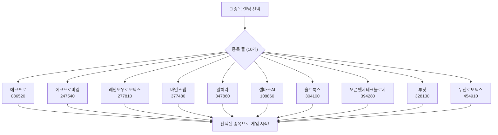
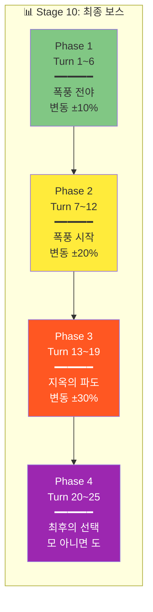
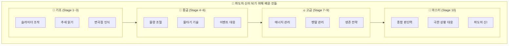

# 👑 Stage 10: ???의 바다 (최종 보스)

## 📋 스테이지 정보

| 항목 | 내용 |
|------|------|
| **스테이지** | Stage 10 (최종 보스!) |
| **종목명** | ??? (게임 시작 시 랜덤 공개) |
| **종목코드** | ?????? |
| **난이도** | ★★★★★ (파도의 신전) |
| **목표 수익률** | +100% |
| **제한 시간** | 15분 (900초) |
| **턴 수** | 25턴 |
| **선택지** | 5개 + 물타기 |
| **시작 에너지** | 60% ⚠️ |

---

## 👑 최종 보스: 파도의 신에 도전!

```
┌─────────────────────────────────────────────────────────────────┐
│                                                                 │
│  👑 S T A G E   1 0 : 파 도 의   신 전                         │
│  ━━━━━━━━━━━━━━━━━━━━━━━━━━━━━━━━━━━━━━━━━━━━━━━━━━━━━━━━━━━   │
│                                                                 │
│  "여기까지 온 자만이 파도의 신이 될 자격이 있다"                │
│                                                                 │
│  ⚔️ 최종 조건:                                                  │
│  • 시작 에너지 60% (최저)                                       │
│  • 변동성 20%+ (극한)                                           │
│  • 종목 랜덤 (어떤 파도가 올지 모름)                            │
│  • 목표 수익률 +100% (두 배!)                                   │
│                                                                 │
│  🎯 여기서 배운 모든 것을 총동원하세요!                         │
│  • 추세 읽기                                                    │
│  • 물량 조절                                                    │
│  • 물타기 타이밍                                                │
│  • 에너지 관리                                                  │
│  • 멘탈 관리                                                    │
│                                                                 │
│  👑 "파도의 신"이 되어 돌아오세요!                              │
│                                                                 │
└─────────────────────────────────────────────────────────────────┘
```

---

## 🎲 랜덤 종목 풀



| 종목 | 코드 | 변동성 | 특징 |
|------|:----:|:-----:|------|
| 에코프로 | 086520 | 15~25% | 2차전지 대장주 |
| 에코프로비엠 | 247540 | 20~30% | 양극재 |
| 레인보우로보틱스 | 277810 | 15~25% | 로봇/AI |
| 마인즈랩 | 377480 | 15~25% | AI |
| 알체라 | 347860 | 20~30% | AI/얼굴인식 |
| 셀바스AI | 108860 | 15~20% | AI/음성 |
| 솔트룩스 | 304100 | 15~25% | AI/빅데이터 |
| 오픈엣지 | 394280 | 20~30% | NPU/AI칩 |
| 루닛 | 328130 | 15~25% | AI/의료 |
| 두산로보틱스 | 454910 | 10~20% | 협동로봇 |

---

## 💰 시작 조건

| 항목 | 값 |
|------|------|
| **시작 자금** | 100,000,000원 (1억!) |
| **시작 보유량** | ??? (종목에 따라 결정) |
| **평균 매입가** | ??? |
| **시작 가격** | ??? (+5~10% 상태) |
| **예수금** | 40,000,000원 |
| **에너지** | 60% ⚠️ |

---

## 🌊 턴별 시나리오 (25턴)

### 전체 흐름: 4단계 구조



---

### Phase 1: 폭풍 전야 (Turn 1~6)

```
┌─────────────────────────────────────────────────────────────────┐
│                                                                 │
│  🌅 Phase 1: 폭풍 전야 (Turn 1~6)                               │
│  ━━━━━━━━━━━━━━━━━━━━━━━━━━━━━━━━━━━━━━━━━━━━━━━━━━━━━━━━━━━   │
│                                                                 │
│  • 변동성: ±5~10%                                               │
│  • 난이도: 보통                                                 │
│  • 목적: 에너지 확보, 기본 포지션 구축                          │
│                                                                 │
│  💡 전략:                                                       │
│  • 에너지를 최대한 높이기                                       │
│  • GOOD 이상 판정으로 기반 다지기                               │
│  • 무리한 베팅 금지                                             │
│                                                                 │
└─────────────────────────────────────────────────────────────────┘
```

| 턴 | 예상 변동 | 에너지 목표 | 전략 |
|:--:|:--------:|:---------:|------|
| 1 | +5~10% | 60→65% | 소량 매수 |
| 2 | +8~12% | 65→70% | 추세 추종 |
| 3 | +10~15% | 70→75% | 유지 |
| 4 | +5~10% | 75% 유지 | 일부 익절 |
| 5 | ±5% | 75% 유지 | 관망 |
| 6 | 0~5% | 75% | Phase 2 준비 |

---

### Phase 2: 폭풍 시작 (Turn 7~12)

```
┌─────────────────────────────────────────────────────────────────┐
│                                                                 │
│  ⛈️ Phase 2: 폭풍 시작 (Turn 7~12)                              │
│  ━━━━━━━━━━━━━━━━━━━━━━━━━━━━━━━━━━━━━━━━━━━━━━━━━━━━━━━━━━━   │
│                                                                 │
│  • 변동성: ±10~20%                                              │
│  • 난이도: 높음                                                 │
│  • 목적: 급등락 대응, 에너지 유지                               │
│                                                                 │
│  ⚠️ 주의:                                                       │
│  • 급락 시 패닉 금지                                            │
│  • 물타기 신중하게 (에너지 여유 확인)                           │
│  • BAD 연속 방지                                                │
│                                                                 │
└─────────────────────────────────────────────────────────────────┘
```

| 턴 | 예상 변동 | 상황 | 전략 |
|:--:|:--------:|------|------|
| 7 | -5~10% | 조정 시작 | 일부 매도 |
| 8 | -10~15% | 급락! | 손실 방어 |
| 9 | -15~20% | 폭락! | 관망 |
| 10 | -10~15% | 바닥 탐색 | 물타기 검토 |
| 11 | -5~10% | 반등 신호 | 소량 매수 |
| 12 | +5~10% | 반등 확인 | 추가 매수 |

---

### Phase 3: 지옥의 파도 (Turn 13~19)

```
┌─────────────────────────────────────────────────────────────────┐
│                                                                 │
│  🔥 Phase 3: 지옥의 파도 (Turn 13~19)                           │
│  ━━━━━━━━━━━━━━━━━━━━━━━━━━━━━━━━━━━━━━━━━━━━━━━━━━━━━━━━━━━   │
│                                                                 │
│  • 변동성: ±15~30%                                              │
│  • 난이도: 극한                                                 │
│  • 목적: 생존 + 목표 수익 근접                                  │
│                                                                 │
│  💀 극한 상황:                                                  │
│  • 한 턴에 ±20~30% 움직임 가능                                 │
│  • 에너지 관리가 생사를 결정                                    │
│  • 한 번의 실수가 게임오버                                      │
│                                                                 │
│  💪 "여기서 살아남으면 파도의 신!"                              │
│                                                                 │
└─────────────────────────────────────────────────────────────────┘
```

| 턴 | 예상 변동 | 상황 | 전략 |
|:--:|:--------:|------|------|
| 13 | +15~25% | 급등! | 추세 추종 |
| 14 | +25~35% | 폭등! | 욕심 조절 |
| 15 | +15~25% | 고점 경고 | 익절 시작 |
| 16 | +5~15% | 조정 | 유지 |
| 17 | -5~10% | 하락 | 관망 |
| 18 | +10~20% | 반등 | 재진입 |
| 19 | +20~30% | 급등 | 목표 근접! |

---

### Phase 4: 최후의 선택 (Turn 20~25)

```
┌─────────────────────────────────────────────────────────────────┐
│                                                                 │
│  👑 Phase 4: 최후의 선택 (Turn 20~25)                           │
│  ━━━━━━━━━━━━━━━━━━━━━━━━━━━━━━━━━━━━━━━━━━━━━━━━━━━━━━━━━━━   │
│                                                                 │
│  • 변동성: 극한                                                 │
│  • 난이도: 최종                                                 │
│  • 목적: +100% 달성!                                            │
│                                                                 │
│  🎯 목표 달성 전략:                                             │
│  • 여기까지 왔으면 목표 근접                                    │
│  • 욕심 vs 안전의 선택                                          │
│  • 마지막까지 에너지 관리                                       │
│                                                                 │
│  👑 "모 아니면 도! 파도의 신이 되어라!"                         │
│                                                                 │
└─────────────────────────────────────────────────────────────────┘
```

| 턴 | 예상 변동 | 목표 진행 | 전략 |
|:--:|:--------:|:--------:|------|
| 20 | +30~50% | ~70% | 추세 추종 |
| 21 | +40~60% | ~85% | 유지 |
| 22 | +50~80% | ~95% | 거의 달성! |
| 23 | +60~90% | ~100% | 목표 달성? |
| 24 | +80~100% | 100%+ | 익절! |
| 25 | +90~110% | 완료! | 👑 마무리! |

---

## 📊 시나리오 요약표

| Phase | Turn | 변동성 | 핵심 전략 | 에너지 목표 |
|:-----:|:----:|:-----:|----------|:---------:|
| 1 | 1~6 | ±10% | 기반 구축 | 60→75% |
| 2 | 7~12 | ±20% | 폭풍 대응 | 75→60% |
| 3 | 13~19 | ±30% | 생존 + 공격 | 60→70% |
| 4 | 20~25 | 극한 | 목표 달성 | 70→80% |

---

## 🏆 최종 리포트: 파도의 신 등극!

```
┌─────────────────────────────────────────────────────────────────┐
│                                                                 │
│  👑 축하합니다! 파도의 신이 되셨습니다!                         │
│  ━━━━━━━━━━━━━━━━━━━━━━━━━━━━━━━━━━━━━━━━━━━━━━━━━━━━━━━━━━━   │
│                                                                 │
│  🏆 최종 결과                                                   │
│  • 목표 수익률: +100% ✅ 달성!                                  │
│  • 잔여 에너지: ??%                                             │
│  • 총 점수: ????? 점                                            │
│                                                                 │
│  📊 항해 통계                                                   │
│  • 총 FREEZE: 25회                                              │
│  • PERFECT: ?? 회                                               │
│  • GREAT: ?? 회                                                 │
│  • GOOD: ?? 회                                                  │
│  • BAD: ?? 회                                                   │
│                                                                 │
│  🎓 마스터한 기술                                               │
│  ✅ 추세 읽기                                                   │
│  ✅ 물량 조절 (30%/60%)                                         │
│  ✅ 물타기 타이밍                                               │
│  ✅ 에너지 관리                                                 │
│  ✅ 멘탈 관리                                                   │
│  ✅ 이벤트 대응                                                 │
│  ✅ 생존 전략                                                   │
│  ✅ 극한 판단                                                   │
│                                                                 │
│  👑 당신은 이제 "파도의 신"입니다!                              │
│                                                                 │
│  "슬라이더를 밀어라. 그것이 네 운명을 결정한다."               │
│                                                                 │
└─────────────────────────────────────────────────────────────────┘
```

---

## 🎓 전체 게임 완료 후 배운 것들



---

## 🌟 실전 적용 가이드

```
┌─────────────────────────────────────────────────────────────────┐
│                                                                 │
│  🌟 이제 실전에서도 적용하세요!                                 │
│  ━━━━━━━━━━━━━━━━━━━━━━━━━━━━━━━━━━━━━━━━━━━━━━━━━━━━━━━━━━━   │
│                                                                 │
│  1️⃣ 추세를 읽어라                                              │
│     • 상승 추세 → 매수 유리                                     │
│     • 하락 추세 → 매도 또는 관망                                │
│                                                                 │
│  2️⃣ 물량을 조절해라                                            │
│     • 확신 높음 → 적극적 (60%)                                  │
│     • 확신 낮음 → 소극적 (30%)                                  │
│     • 불확실 → 관망 (0%)                                        │
│                                                                 │
│  3️⃣ 멘탈을 관리해라                                            │
│     • 급등 시 욕심 자제                                         │
│     • 급락 시 공포 자제                                         │
│     • 손실 시 복수 매매 금지                                    │
│                                                                 │
│  4️⃣ 리스크를 관리해라                                          │
│     • 한 번에 몰빵 금지                                         │
│     • 손절 라인 미리 설정                                       │
│     • 물타기는 신중하게                                         │
│                                                                 │
│  5️⃣ 꾸준히 연습해라                                            │
│     • 실전 감각은 연습에서                                      │
│     • 작은 판단들의 누적이 결과                                 │
│                                                                 │
│  🚢 "파도를 타라, 파도와 싸우지 마라!"                          │
│                                                                 │
└─────────────────────────────────────────────────────────────────┘
```

---

**문서 끝**

---

👑 **축하합니다! 10단계 시나리오가 모두 완성되었습니다!**
