# 유저 시나리오 (User Scenarios)

## 📋 목차
1. [전체 유저 플로우](#전체-유저-플로우)
2. [시나리오 1: 첫 게임 시작](#시나리오-1-첫-게임-시작)
3. [시나리오 2: 게임 플레이](#시나리오-2-게임-플레이)
4. [시나리오 3: 매매 의사결정](#시나리오-3-매매-의사결정)
5. [시나리오 4: 게임 종료](#시나리오-4-게임-종료)
6. [페이지별 상세 시나리오](#페이지별-상세-시나리오)

---

## 전체 유저 플로우

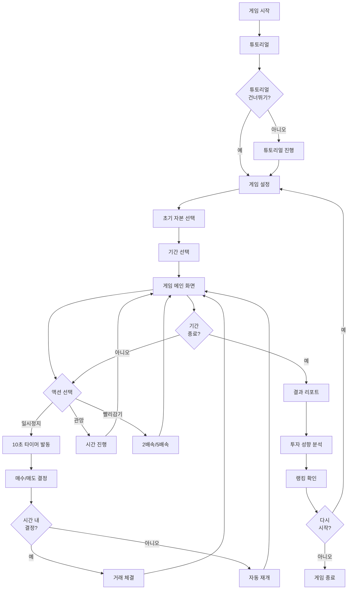

---

## 시나리오 1: 첫 게임 시작

### 1.1 시작 화면

| 단계 | 사용자 행동 | 시스템 반응 | 화면 요소 |
|------|------------|------------|----------|
| 1 | 앱 실행 | 메인 화면 표시 | 로고, [시작하기] 버튼 |
| 2 | [시작하기] 클릭 | 튜토리얼 팝업 표시 | "처음이신가요?" 메시지 |
| 3 | [예] 또는 [건너뛰기] 선택 | 선택에 따라 분기 | 튜토리얼 or 설정 화면 |

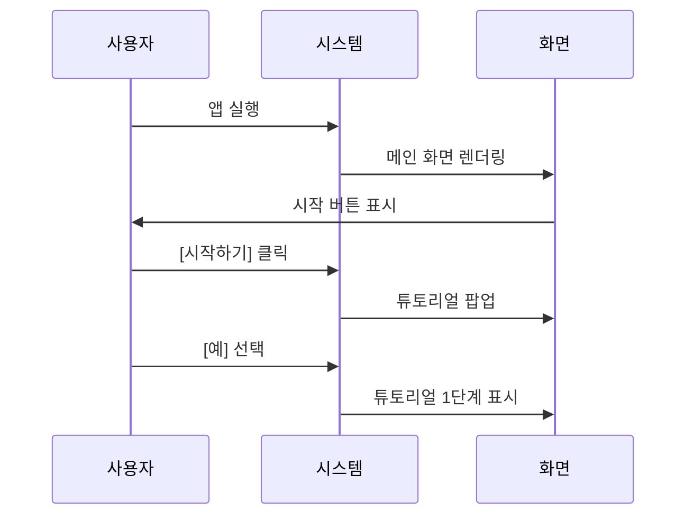

### 1.2 튜토리얼 진행

| 단계 | 내용 | 소요 시간 | 학습 목표 |
|------|------|----------|----------|
| 1 | 게임 목표 설명 | 10초 | 시뮬레이션 목적 이해 |
| 2 | 화면 구성 소개 | 15초 | UI 요소 파악 |
| 3 | 시간 시스템 설명 | 20초 | 1일=1분, 4단계 구조 이해 |
| 4 | 일시정지 & 10초 타이머 | 30초 | 핵심 메커니즘 체험 |
| 5 | 매수/매도 실습 | 40초 | 실제 거래 연습 |
| 6 | 종목 카테고리 안내 | 15초 | 안정/변동/고변동 이해 |

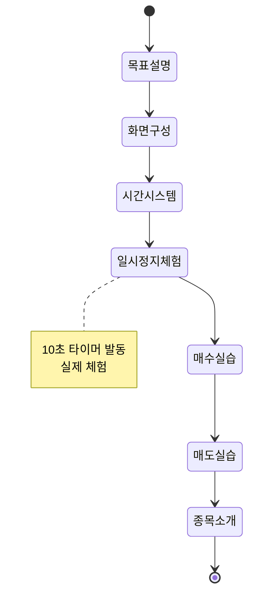

### 1.3 게임 설정

| 설정 항목 | 옵션 | 설명 |
|----------|------|------|
| **초기 자본** | 500만원 | 초보자 추천 ⭐ |
| | 1,000만원 | 일반적인 시작 |
| | 5,000만원 | 여유로운 플레이 |
| | 1억원 | 다양한 분산 투자 |
| | 5억원 | 대규모 전략 |
| | 10억원 | 고급 사용자용 |
| **기간** | 3개월 (90일) | 빠른 체험 (1.5시간) ⭐ |
| | 6개월 (180일) | 균형잡힌 체험 (3시간) |
| | 12개월 (365일) | 장기 전략 (6시간) |

---

## 시나리오 2: 게임 플레이

### 2.1 메인 게임 화면 진입

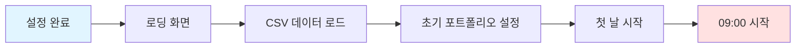

### 2.2 시간 진행 시나리오

| 시간대 | 실제 경과 시간 | 게임 내 시간 | 발생 이벤트 | 사용자 가능 행동 |
|--------|---------------|------------|-----------|----------------|
| 09:00 | 0초 | 시초가 | 시가 결정, 뉴스 표시 | 종목 확인, 일시정지 |
| 11:00 | 15초 | 오전 마감 | 1단계 변동 | 매수/매도, 관망 |
| 13:00 | 30초 | 점심 시간 | 2단계 변동, 뉴스 | 매수/매도, 빨리감기 |
| 15:00 | 45초 | 오후 장 | 3단계 변동 | 매수/매도 |
| 15:30 | 60초 | 종가 | 하루 마감, 정산 | 포트폴리오 확인 |

```mermaid
gantt
    title 하루 시간 진행 (1분)
    dateFormat ss
    axisFormat %S초
    
    section 시장 시간
    시초가 (09:00)      :a1, 00, 1s
    1단계 진행          :a2, 01, 14s
    오전 마감 (11:00)   :a3, 15, 1s
    2단계 진행          :a4, 16, 14s
    점심 시간 (13:00)   :a5, 30, 1s
    3단계 진행          :a6, 31, 14s
    오후 장 (15:00)     :a7, 45, 1s
    4단계 진행          :a8, 46, 14s
    종가 (15:30)        :crit, a9, 60, 1s
```

### 2.3 일상적인 플레이 패턴

**패턴 A: 관망형 플레이어**
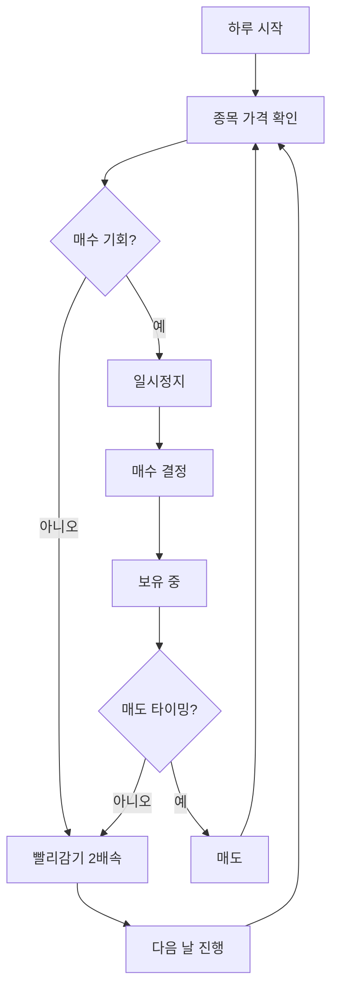

**패턴 B: 적극형 플레이어**
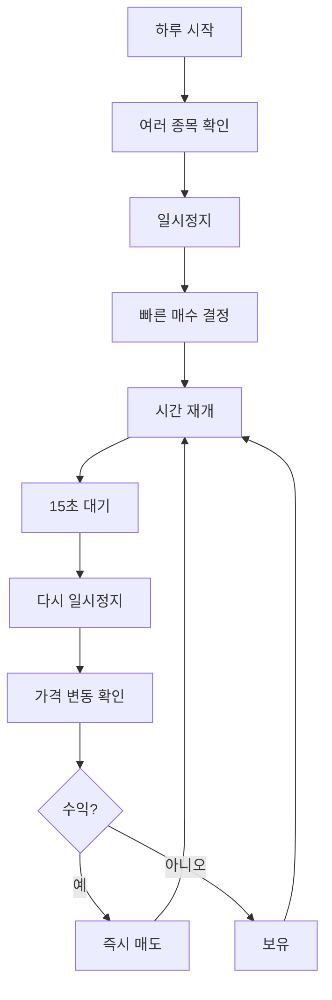

---

## 시나리오 3: 매매 의사결정

### 3.1 일시정지 및 10초 타이머

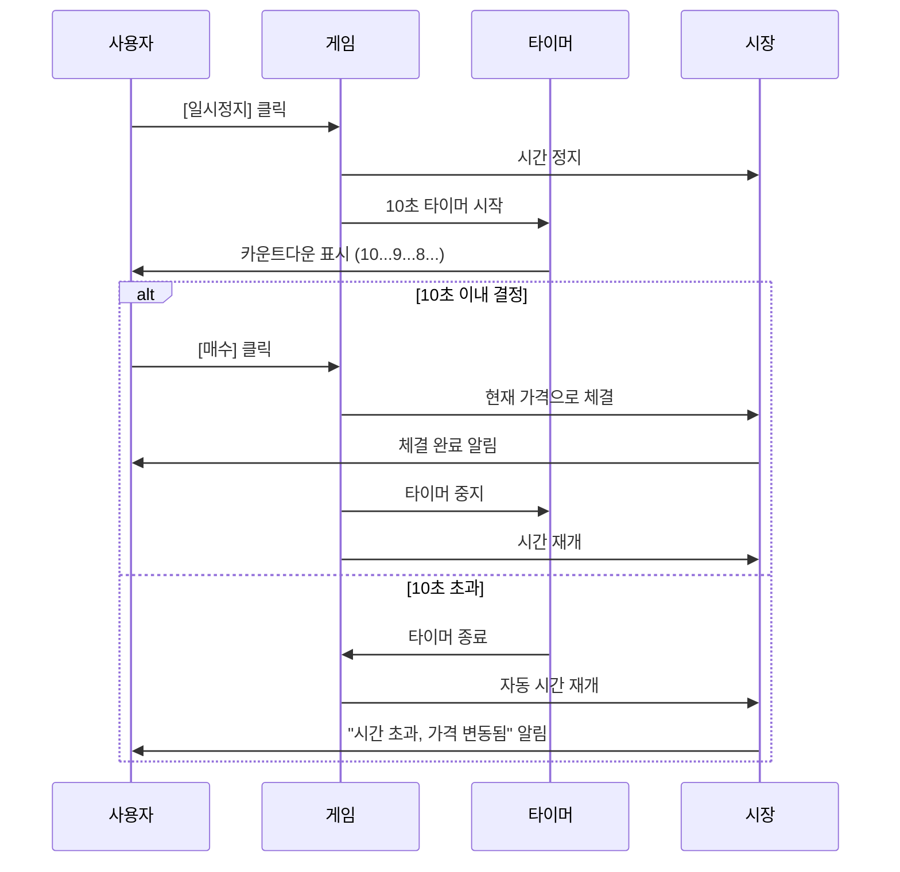

### 3.2 매수 프로세스

| 단계 | 사용자 행동 | 시스템 체크 | 결과 |
|------|------------|------------|------|
| 1 | 종목 선택 | - | 차트 표시 |
| 2 | [매수] 버튼 클릭 | 일시정지 여부 확인 | 10초 타이머 발동 |
| 3 | 수량 입력 | 현금 잔액 확인 | 가능 수량 표시 |
| 4 | [확정] 클릭 | 수수료 계산 | 체결 또는 오류 |
| 5 | - | 포트폴리오 업데이트 | 보유 종목 추가 |

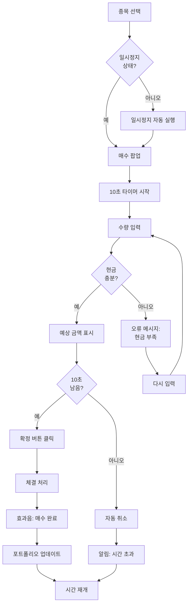

### 3.3 매도 프로세스

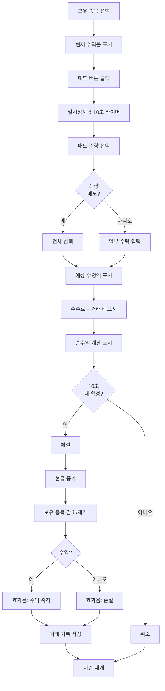

### 3.4 의사결정 시간별 패턴

| 결정 시간 | 비율 | 투자 성향 | 결과 경향 |
|----------|------|---------|----------|
| 0-3초 (즉시) | 38% | 충동적, 직관형 | 승률 낮음 (45%) |
| 4-6초 (빠름) | 35% | 적극적, 경험형 | 승률 중간 (62%) |
| 7-9초 (신중) | 22% | 분석적, 신중형 | 승률 높음 (74%) |
| 10초 (시간초과) | 5% | 우유부단 | 기회 손실 |

---

## 시나리오 4: 게임 종료

### 4.1 종료 플로우

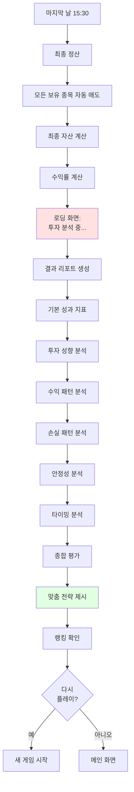

### 4.2 리포트 구조

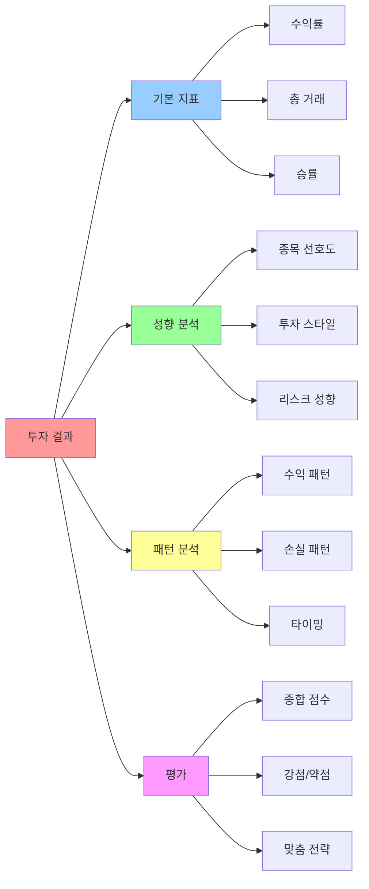

---

## 페이지별 상세 시나리오

### Page 1: 메인 화면

| 요소 | 기능 | 사용자 액션 |
|------|------|-----------|
| 로고 | 브랜딩 | - |
| [시작하기] | 게임 시작 | 클릭 → 튜토리얼/설정 |
| [이어하기] | 저장된 게임 불러오기 | 클릭 → 게임 로드 |
| [랭킹] | 전체 랭킹 보기 | 클릭 → 랭킹 화면 |
| [설정] | 소리, 효과 설정 | 클릭 → 설정 화면 |

### Page 2: 게임 설정 화면

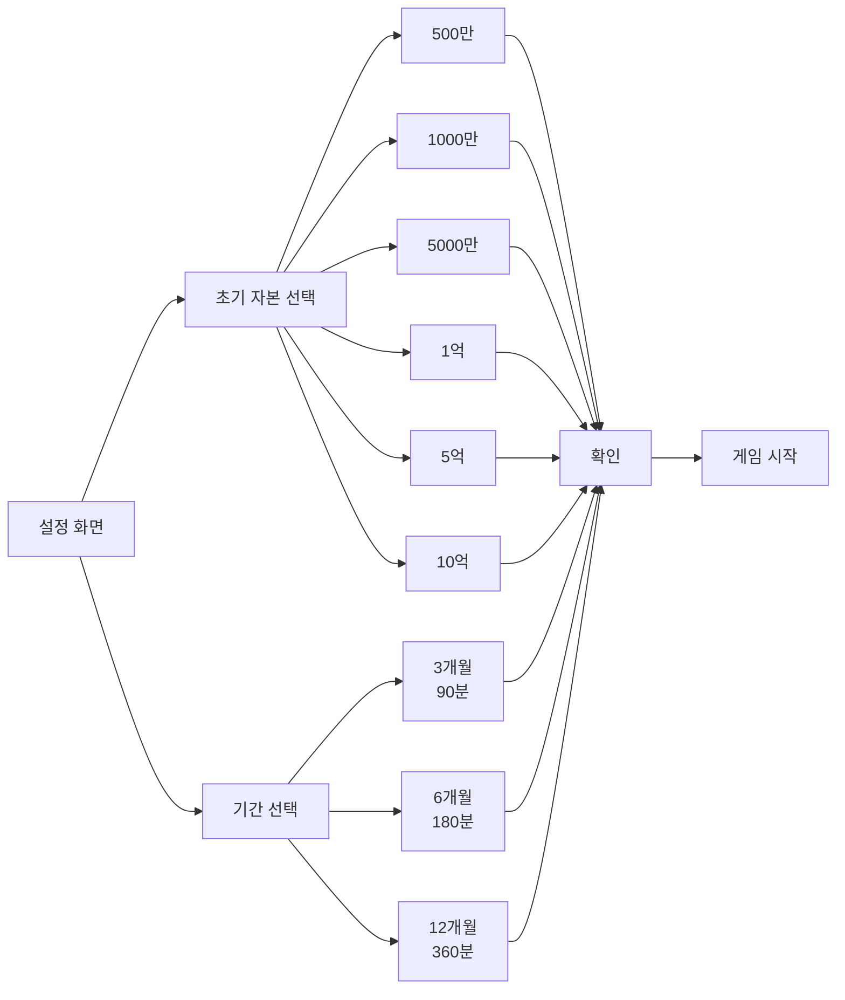

### Page 3: 메인 게임 화면

| 영역 | 위치 | 크기 | 기능 |
|------|------|------|------|
| 상단 HUD | 상단 | 100% x 10% | 날짜, 시간, 자산, 컨트롤 |
| 종목 리스트 | 좌측 | 20% x 80% | 30개 종목 목록 |
| 차트 영역 | 중앙 | 55% x 80% | 선택 종목 차트 |
| 포트폴리오 | 우측 | 25% x 80% | 보유 현황 |
| 하단 정보 | 하단 | 100% x 10% | 뉴스, 이벤트 |

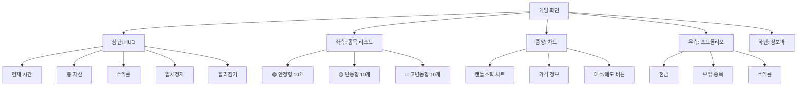

### Page 4: 매매 팝업

| 요소 | 정보 | 입력/출력 |
|------|------|----------|
| 타이머 | 10초 카운트다운 | 출력 (시각적) |
| 종목명 | 선택한 종목 | 출력 |
| 현재가 | 실시간 가격 | 출력 |
| 수량 | 매수/매도 수량 | 입력 |
| 예상 금액 | 총 금액 | 출력 (계산) |
| 수수료 | 0.015% | 출력 |
| 거래세 | 0.23% (매도 시) | 출력 |
| 확정 버튼 | 체결 실행 | 입력 (클릭) |
| 취소 버튼 | 팝업 닫기 | 입력 (클릭) |

### Page 5: 결과 리포트

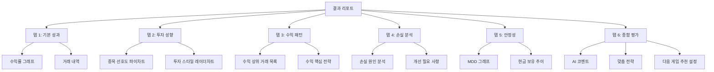

---

## 예외 상황 시나리오

### 예외 1: 현금 부족

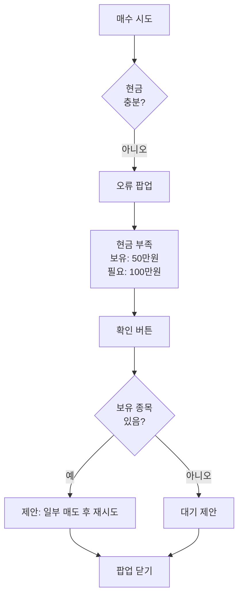

### 예외 2: 10초 초과

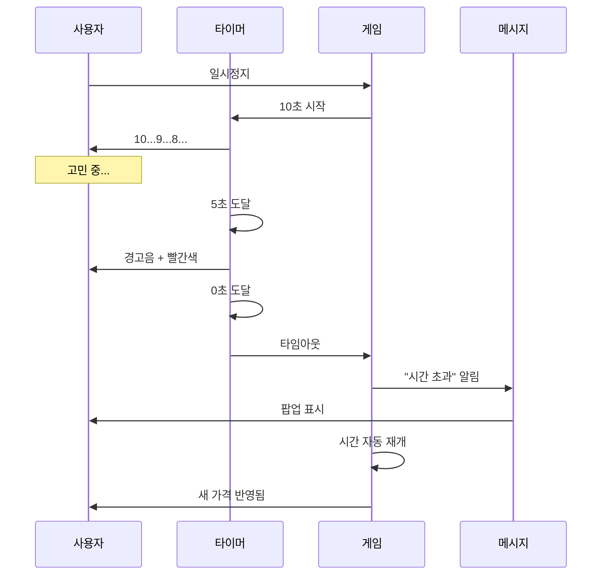

### 예외 3: 게임 중단 및 재개

| 상황 | 처리 방법 | 데이터 저장 |
|------|---------|-----------|
| 앱 종료 | 자동 저장 | 현재 상태 전체 |
| 브라우저 닫기 | LocalStorage 저장 | 진행 상황 |
| 새로고침 | 경고 후 저장 | 최근 시점 |
| 재시작 | [이어하기] 옵션 제공 | 불러오기 가능 |

---

## 성공 지표

| 지표 | 목표 | 측정 방법 |
|------|------|----------|
| 튜토리얼 완료율 | 70% 이상 | 시작 vs 완료 수 |
| 평균 플레이 시간 | 30분 이상 | 세션 시간 추적 |
| 재플레이율 | 40% 이상 | 2회 이상 플레이 사용자 |
| 10초 타이머 평균 사용 시간 | 6초 | 타이머 로그 분석 |
| 게임 완료율 | 60% 이상 | 시작 vs 종료 수 |

---

## 사용자 피드백 시나리오

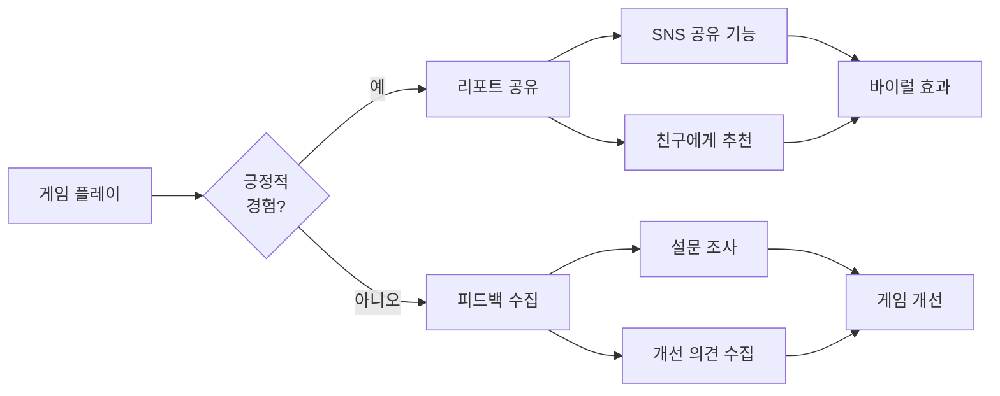

---

## 정리

이 문서는 주식 시뮬레이션 게임의 모든 사용자 시나리오를 다이어그램과 표로 정리했습니다.

**핵심 플로우**:
1. 시작 → 설정 → 플레이 → 종료 → 리포트
2. 10초 타이머가 핵심 메커니즘
3. 실시간 의사결정 훈련

**다음 문서**: `system_design.md`에서 기술 설계 확인

