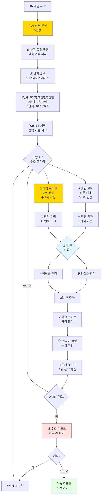
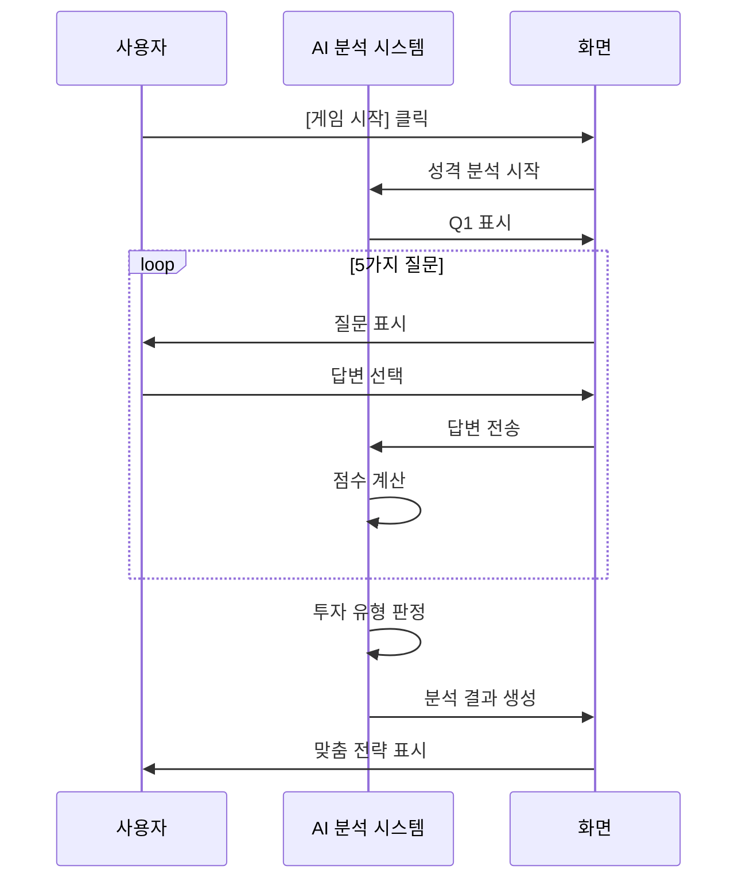
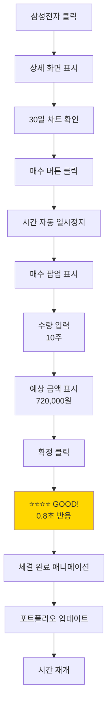
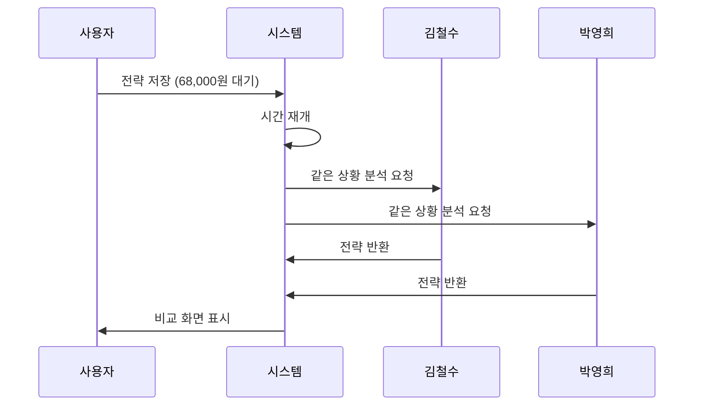
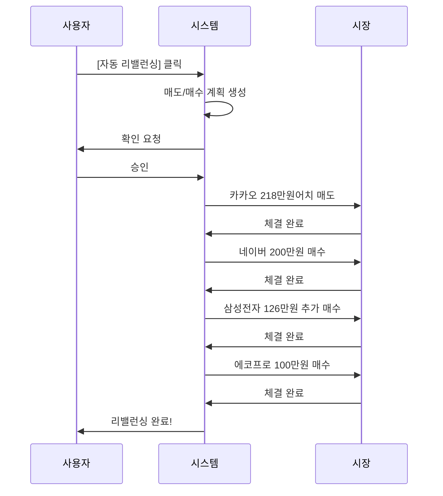

# 사용자 시나리오 - 실제 플레이 흐름
## "파도를 타라: 생각하는 투자자" 플레이 가이드 🧠🌊

---

## 📋 문서 정보

**버전**: FINAL INTEGRATED v2.0 (모바일 게임 강화)  
**최종 업데이트**: 2024.11.19  
**기반 문서**: FINAL_INTEGRATED_GAME_DESIGN.md  
**플랫폼**: 📱 스마트폰 (토스 스타일 UI)

---

## 🎯 목차

1. [전체 게임 플로우](#전체-게임-플로우)
2. [단계별 자금 규모 시스템](#단계별-자금-규모-시스템)
3. [시나리오 1: 게임 시작 & AI 성격 분석](#시나리오-1-게임-시작--ai-성격-분석)
4. [시나리오 2: 주간 플레이 (Day 1~7)](#시나리오-2-주간-플레이-day-17)
5. [시나리오 3: 타임 프리즈 체험](#시나리오-3-타임-프리즈-체험)
6. [시나리오 4: 전략 AI 비교 학습](#시나리오-4-전략-ai-비교-학습)
7. [시나리오 5: 실시간 경쟁 & 랭킹](#시나리오-5-실시간-경쟁--랭킹)
8. [시나리오 6: 분산 투자 전략](#시나리오-6-분산-투자-전략)
9. [시나리오 7: 주간 완료 & 리포트](#시나리오-7-주간-완료--리포트)
10. [예외 상황 처리](#예외-상황-처리)

---

## 전체 게임 플로우



---

## 단계별 자금 규모 시스템

### 🎯 화폐 단위 체감 학습

플레이어가 단계별로 다른 자금 규모를 경험하면서 실제 투자 금액에 따른 심리와 전략 변화를 체험합니다.

### 📊 단계별 구성

#### 🥉 1단계: 초보 투자자 (경험 쌓기)

```
┌─────────────────────────────────────────────────────┐
│ 💰 1단계 자금 선택                                   │
├─────────────────────────────────────────────────────┤
│                                                     │
│ ┌─────────────────────────────────────────────┐   │
│ │ 🟢 500만원 코스                             │   │
│ │ • 추천: 완전 초보                           │   │
│ │ • 목표: 기본 학습                           │   │
│ │ • 기간: 4주                                 │   │
│ │ • 상금: 10만원 (TOP 10)                     │   │
│ └─────────────────────────────────────────────┘   │
│                                                     │
│ ┌─────────────────────────────────────────────┐   │
│ │ 🟡 1,000만원 코스 ⭐ 추천                   │   │
│ │ • 추천: 일반 학습자                         │   │
│ │ • 목표: 실전 감각                           │   │
│ │ • 기간: 8주                                 │   │
│ │ • 상금: 50만원 (TOP 10)                     │   │
│ └─────────────────────────────────────────────┘   │
│                                                     │
│ ┌─────────────────────────────────────────────┐   │
│ │ 🔴 5,000만원 코스                           │   │
│ │ • 추천: 고급 학습자                         │   │
│ │ • 목표: 전문가 도약                         │   │
│ │ • 기간: 12주                                │   │
│ │ • 상금: 200만원 (TOP 10)                    │   │
│ └─────────────────────────────────────────────┘   │
│                                                     │
│ 💡 1단계 완료 후 2단계 잠금 해제!                   │
│                                                     │
└─────────────────────────────────────────────────────┘
```

#### 🥈 2단계: 중급 투자자 (규모 확장) - 🔒 잠금

```
┌─────────────────────────────────────────────────────┐
│ 💰 2단계 자금 선택 (1단계 수익률 +20% 이상)          │
├─────────────────────────────────────────────────────┤
│                                                     │
│ ┌─────────────────────────────────────────────┐   │
│ │ 🟡 1억원 코스                               │   │
│ │ • 조건: 1단계 +20% 달성                     │   │
│ │ • 목표: 대규모 자금 감각                    │   │
│ │ • 기간: 12주                                │   │
│ │ • 상금: 500만원 (TOP 5)                     │   │
│ └─────────────────────────────────────────────┘   │
│                                                     │
│ ┌─────────────────────────────────────────────┐   │
│ │ 🔴 5억원 코스                               │   │
│ │ • 조건: 1단계 +30% 달성                     │   │
│ │ • 목표: 기관 투자자 수준                    │   │
│ │ • 기간: 16주                                │   │
│ │ • 상금: 2,000만원 (TOP 3)                   │   │
│ └─────────────────────────────────────────────┘   │
│                                                     │
│ 💡 2단계 완료 후 3단계 잠금 해제!                   │
│                                                     │
└─────────────────────────────────────────────────────┘
```

#### 🥇 3단계: 전문 투자자 (최종 도전) - 🔒🔒 잠금

```
┌─────────────────────────────────────────────────────┐
│ 💰 3단계 자금 선택 (2단계 수익률 +25% 이상)          │
├─────────────────────────────────────────────────────┤
│                                                     │
│ ┌─────────────────────────────────────────────┐   │
│ │ 🟣 10억원 코스                              │   │
│ │ • 조건: 2단계 +25% 달성                     │   │
│ │ • 목표: 전문 투자자 인증                    │   │
│ │ • 기간: 20주                                │   │
│ │ • 상금: 5,000만원 (TOP 3)                   │   │
│ └─────────────────────────────────────────────┘   │
│                                                     │
│ ┌─────────────────────────────────────────────┐   │
│ │ 💎 50억원 코스 (전설 등급)                  │   │
│ │ • 조건: 2단계 TOP 100                       │   │
│ │ • 목표: 파도 마스터 인증                    │   │
│ │ • 기간: 24주                                │   │
│ │ • 상금: 1억원 (TOP 1)                       │   │
│ └─────────────────────────────────────────────┘   │
│                                                     │
│ 🏆 3단계 완료 시 "파도 마스터" 칭호 획득!           │
│                                                     │
└─────────────────────────────────────────────────────┘
```

### 🎮 단계별 경쟁 시스템

| 단계 | 참여자 예상 | 리더보드 | 상금 풀 | 시즌 |
|------|-----------|---------|---------|------|
| 1단계 (500만) | 50,000명 | 주간 TOP 100 | 500만원 | 매주 |
| 1단계 (1,000만) | 30,000명 | 주간 TOP 50 | 2,000만원 | 매주 |
| 1단계 (5,000만) | 10,000명 | 주간 TOP 30 | 5,000만원 | 격주 |
| 2단계 (1억) | 3,000명 | 월간 TOP 20 | 1억원 | 매월 |
| 2단계 (5억) | 1,000명 | 월간 TOP 10 | 5억원 | 매월 |
| 3단계 (10억) | 300명 | 시즌 TOP 10 | 10억원 | 분기 |
| 3단계 (50억) | 100명 | 시즌 TOP 3 | 50억원 | 반기 |

### 💡 화폐 단위 체감 효과

```
500만원 코스:
• 10만원 수익 = +2% (작은 성공 체험)
• 50만원 손실 = -10% (손실 감각 학습)

1,000만원 코스:
• 100만원 수익 = +10% (뿌듯함)
• 100만원 손실 = -10% (긴장감)

5,000만원 코스:
• 500만원 수익 = +10% (큰 금액 체감)
• 500만원 손실 = -10% (리스크 실감)

1억원 코스:
• 1,000만원 수익 = +10% (억 단위 감각)
• 1,000만원 손실 = -10% (중압감)

5억원 코스:
• 5,000만원 수익 = +10% (대규모 투자 체험)
• 5,000만원 손실 = -10% (전문가 수준 압박)

10억원 코스:
• 1억원 수익 = +10% (기관 투자자 수준)
• 1억원 손실 = -10% (극한의 심리전)

50억원 코스:
• 5억원 수익 = +10% (전설적 거래)
• 5억원 손실 = -10% (파도 마스터 시험)
```

---

## 시나리오 1: 게임 시작 & AI 성격 분석

### 1.1 메인 화면 진입

```
┌─────────────────────────────────────────────────────┐
│                                                     │
│              🌊 파도를 타라 🌊                      │
│                                                     │
│         생각하는 투자자를 만듭니다                   │
│                                                     │
│  ┌───────────────────────────────────────────────┐ │
│  │  🎮 게임 시작                                 │ │
│  └───────────────────────────────────────────────┘ │
│                                                     │
│  ┌───────────────────────────────────────────────┐ │
│  │  📊 랭킹 보기                                 │ │
│  └───────────────────────────────────────────────┘ │
│                                                     │
│  ┌───────────────────────────────────────────────┐ │
│  │  ⚙️ 설정                                      │ │
│  └───────────────────────────────────────────────┘ │
│                                                     │
└─────────────────────────────────────────────────────┘
```

**사용자 액션**: [게임 시작] 클릭

---

### 1.2 AI 성격 분석 (5분 소요)



#### Q1: 손실 대응 방식

```
┌─────────────────────────────────────────────────────┐
│ 🧠 투자 성향 분석 (1/5)                             │
├─────────────────────────────────────────────────────┤
│                                                     │
│ Q1. 주식이 -10% 하락했습니다.                       │
│     어떻게 하시겠습니까?                             │
│                                                     │
│ ┌─────────────────────────────────────────────────┐ │
│ │ A) 즉시 손절한다 (리스크 회피형)                 │ │
│ └─────────────────────────────────────────────────┘ │
│                                                     │
│ ┌─────────────────────────────────────────────────┐ │
│ │ B) 추가 매수를 고려한다 (물타기형)               │ │
│ └─────────────────────────────────────────────────┘ │
│                                                     │
│ ┌─────────────────────────────────────────────────┐ │
│ │ C) 분석 후 결정한다 (신중형) ⭐ 추천            │ │
│ └─────────────────────────────────────────────────┘ │
│                                                     │
│ ┌─────────────────────────────────────────────────┐ │
│ │ D) 그냥 기다린다 (장기 투자형)                   │ │
│ └─────────────────────────────────────────────────┘ │
│                                                     │
└─────────────────────────────────────────────────────┘
```

**사용자 선택**: C) 분석 후 결정 (예시)

---

### 1.3 AI 분석 결과

```
┌─────────────────────────────────────────────────────┐
│ 🎯 분석 완료!                                        │
├─────────────────────────────────────────────────────┤
│                                                     │
│ 당신의 투자 유형: "신중한 기술적 분석가" 📊          │
│                                                     │
│ ━━━━━━━━━━━━━━━━━━━━━━━━━━━━━━━━━━━━━━━━━━━━  │
│                                                     │
│ 📈 성향 그래프:                                      │
│                                                     │
│ 리스크 감수: ████████░░ 40%                         │
│ 분석 선호도: ████████████████░░ 85%                 │
│ 단기 거래: ███████░░░ 35%                           │
│ 감정 통제: ██████████████░░ 75%                     │
│ 학습 의지: ████████████████████ 95%                 │
│                                                     │
│ ━━━━━━━━━━━━━━━━━━━━━━━━━━━━━━━━━━━━━━━━━━━━  │
│                                                     │
│ 💡 당신에게 추천하는 전략:                           │
│                                                     │
│ ✅ 추천 종목 유형:                                   │
│ • 안정형 40% (삼성전자, KB금융)                     │
│ • 변동형 50% (카카오, 현대차)                       │
│ • 고변동형 10% (소량 경험용)                        │
│                                                     │
│ ✅ 추천 파도 패턴:                                   │
│ • 3파 상승 (가장 적합) ⭐⭐⭐⭐⭐                   │
│ • 역헤드앤숄더 (높은 신뢰도) ⭐⭐⭐⭐               │
│                                                     │
│ ✅ AI 멘토 추천:                                     │
│ • 주 멘토: 김철수 (안정형)                          │
│ • 부 멘토: 박영희 (도전용)                          │
│                                                     │
│ [게임 시작] [다시 분석하기]                         │
│                                                     │
└─────────────────────────────────────────────────────┘
```

**사용자 액션**: [게임 시작] 클릭

---

## 시나리오 2: 주간 플레이 (Day 1~7)

### 2.1 Week 1 Day 1 (월) - 첫 날

```
┌─────────────────────────────────────────────────────┐
│ ← 뒤로   Week 1 Day 1 (월) 09:00       ☰ 메뉴       │
├─────────────────────────────────────────────────────┤
│  💰 현재 자산: 10,000,000원 (±0%)                   │
│  🏆 주간 순위: - (첫 날)                            │
│  🤖 AI 멘토: 🛡️김철수 +0% | ⚡박영희 +0%            │
│                                                     │
├─────────────────────────────────────────────────────┤
│  📂 [🟢안정형] [🟡변동형] [🔴고변동형]             │
│                                                     │
│  📊 추천 종목 (당신 맞춤):                           │
│                                                     │
│  🟡 카카오                      68,000원  ▼ -2.1%  │
│     💡 3파 상승 초기 의심                           │
│     AI 김철수: "관망 추천"                          │
│                                                     │
│  🟢 삼성전자                    72,000원  ▲ +0.8%  │
│     안정적 상승세                                    │
│                                                     │
│  🔴 에코프로                   182,000원  ▲ +5.2%  │
│     ⚠️ 고변동 주의                                  │
│                                                     │
│  ┌─────────────────────────────────────────────┐   │
│  │  💡 첫 거래 도전 과제                        │   │
│  │  "안정형 종목 1개 매수해보세요!"             │   │
│  │  보상: 타임 프리즈 사용권 +1                 │   │
│  └─────────────────────────────────────────────┘   │
│                                                     │
│  [▶️ 다음 시간] [⏩ 자동 진행]                      │
└─────────────────────────────────────────────────────┘
```

#### 첫 매수 시나리오

**사용자 액션**: 삼성전자 클릭



#### 즉각 판정 (0.1초 후)

```
┌─────────────────────────────────────────────────────┐
│              ⭐⭐⭐⭐ GOOD! ⭐⭐⭐⭐                │
│         [금빛 별 4개 애니메이션]                     │
│              ⚡ 0.8초 반응! ⚡                      │
│                                                     │
│  평가:                                              │
│  • 타이밍: ⭐⭐⭐⭐ GOOD (안정형 적기)              │
│  • 수량: ⭐⭐⭐⭐ GOOD (7.2% 적정)                 │
│  • 속도: ⭐⭐⭐⭐⭐ PERFECT (빠른 결정)            │
│  • 전략: ⭐⭐⭐⭐ GOOD (AI 추천과 일치)            │
│  • 리스크: ⭐⭐⭐⭐⭐ PERFECT (안정 종목)          │
│                                                     │
│  🎁 보상:                                            │
│  • +50 포인트                                        │
│  • 콤보 시작: 1 COMBO                               │
│  • +30 EXP                                          │
│                                                     │
│  💡 AI 조언:                                         │
│  "좋은 선택! 안정형 종목으로 기초를 다지세요.        │
│   다음에는 변동형도 도전해보세요!"                   │
│                                                     │
│  [✓ 확인]                                           │
└─────────────────────────────────────────────────────┘
```

**결과**: 
- 포트폴리오: 삼성전자 10주 보유
- 현금: 9,280,000원
- 1 COMBO 달성 🔥

---

### 2.2 Day 2 (화) - 일반 플레이

**시간 흐름**: 빠르게 진행 (자동 진행 2배속)

```
09:00 → 11:00 (15초)
• 삼성전자: 72,000원 → 72,500원 (+0.7%)
• 평가 손익: +5,000원

11:00 → 13:00 (15초)
• 삼성전자: 72,500원 → 73,200원 (+1.7%)
• 평가 손익: +12,000원

13:00 → 15:30 (30초)
• 삼성전자: 73,200원 → 74,100원 (+2.9%)
• 평가 손익: +21,000원
```

**Day 2 종료**:
- 총 자산: 10,021,000원 (+0.21%)
- 🤖 AI 비교: 김철수 +0.18% | 박영희 +0.25%

---

### 2.3 Day 3 (수) - 🧠 타임 프리즈 자동 발동!

```
┌─────────────────────────────────────────────────────┐
│         ⏸️ 타임 프리즈 자동 발동! ⏸️                 │
├─────────────────────────────────────────────────────┤
│                                                     │
│  지금부터 2분간 시간이 정지됩니다.                   │
│  차트를 분석하고 전략을 세워보세요!                  │
│                                                     │
│  ⏱️ 남은 시간: 2:00                                 │
│                                                     │
│  [시작하기]                                          │
│                                                     │
└─────────────────────────────────────────────────────┘
```

**사용자 액션**: [시작하기] 클릭 → [시나리오 3으로 이동](#시나리오-3-타임-프리즈-체험)

---

## 시나리오 3: 타임 프리즈 체험

### 3.1 타임 프리즈 메인 화면

```
┌─────────────────────────────────────────────────────┐
│  ⏸️ 타임 프리즈 - Day 3 (수) 11:00  ⏱️ 1:58        │
├─────────────────────────────────────────────────────┤
│                                                     │
│  [📊 차트] [🌊 패턴] [🤖 AI분석] [📝 메모] [🎯 전략]│
│                                                     │
│  📊 카카오 - 30일 차트 분석                         │
│                                                     │
│  ┌─────────────────────────────────────────────┐   │
│  │     현재가: 72,000원 (+3.5%)                │   │
│  │     거래량: +145% (매우 많음!)              │   │
│  │                                             │   │
│  │     [30일 캔들차트]                         │   │
│  │            /\                               │   │
│  │           /  \     /\                       │   │
│  │          /    \   /  \    ← 현재           │   │
│  │    -----       ---    --                    │   │
│  │                                             │   │
│  │     지지선: 68,000원 (3번 반등 ⭐⭐⭐⭐⭐)  │   │
│  │     저항선: 75,000원 (2번 하락)            │   │
│  └─────────────────────────────────────────────┘   │
│                                                     │
│  🌊 패턴 분석:                                       │
│  • 엘리엇 파동: 3파 상승 초기 (95% 신뢰도)          │
│  • 차트 패턴: 상승 삼각형 형성 중                   │
│  • 거래량: 폭발적 증가 (+145%)                      │
│                                                     │
│  🤖 AI 분석:                                        │
│  "3파 상승이 시작될 가능성이 높습니다.               │
│   지지선이 탄탄하고 거래량도 충분합니다.             │
│   조정 시 68,000원 근처 매수 추천."                 │
│                                                     │
│  [전략 수립하기]                                     │
│                                                     │
└─────────────────────────────────────────────────────┘
```

### 3.2 전략 수립

**사용자 액션**: [전략 수립하기] 클릭

```
┌─────────────────────────────────────────────────────┐
│  📝 나의 투자 전략 세우기  ⏱️ 1:20                  │
├─────────────────────────────────────────────────────┤
│                                                     │
│  종목: 카카오                                        │
│  현재가: 72,000원                                    │
│                                                     │
│  ━━━━━━━━━━━━━━━━━━━━━━━━━━━━━━━━━━━━━━━━━━━━  │
│                                                     │
│  매수 전략:                                          │
│                                                     │
│  [ ] 지금 즉시 매수                                 │
│  [✓] 지지선 68,000원까지 대기                       │
│  [ ] 저항선 75,000원 돌파 확인 후                   │
│  [ ] 매수 안 함                                     │
│                                                     │
│  투자 비중: [50%] ───●───── (5,000,000원)          │
│                                                     │
│  ━━━━━━━━━━━━━━━━━━━━━━━━━━━━━━━━━━━━━━━━━━━━  │
│                                                     │
│  손절/익절 전략:                                     │
│                                                     │
│  손절 가격: [65,000원] (-5%)                        │
│  목표 가격: [75,000원] (+10%)                       │
│                                                     │
│  ━━━━━━━━━━━━━━━━━━━━━━━━━━━━━━━━━━━━━━━━━━━━  │
│                                                     │
│  💡 시뮬레이션:                                      │
│                                                     │
│  시나리오 A (조정 온다 60%):                        │
│  68,000원 매수 → 75,000원 매도 = +10.3%            │
│                                                     │
│  시나리오 B (바로 상승 40%):                        │
│  기회 일부 놓침 (리스크 없음)                       │
│                                                     │
│  [저장] [시뮬레이션 자세히]                         │
│                                                     │
└─────────────────────────────────────────────────────┘
```

**사용자 선택**: 
- 지지선 대기 전략
- 투자 비중 50%
- 손절 -5%, 익절 +10%

**사용자 액션**: [저장] 클릭

---

### 3.3 조건 주문 설정

```
┌─────────────────────────────────────────────────────┐
│  🎯 조건 주문 설정 완료!  ⏱️ 0:45                   │
├─────────────────────────────────────────────────────┤
│                                                     │
│  카카오가 68,000원에 도달하면                        │
│  자동으로 5,000,000원어치 매수합니다.                │
│                                                     │
│  설정된 조건:                                        │
│  • 매수가: 68,000원 (지지선)                        │
│  • 투자금: 5,000,000원 (50%)                        │
│  • 손절가: 65,000원 (-5%)                           │
│  • 목표가: 75,000원 (+10%)                          │
│                                                     │
│  💡 타임 프리즈 종료 후 자동 실행됩니다.            │
│                                                     │
│  [확인]                                              │
│                                                     │
└─────────────────────────────────────────────────────┘
```

**타임 프리즈 종료**: 시간 재개 → [시나리오 4로 이동](#시나리오-4-전략-ai-비교-학습)

---

## 시나리오 4: 전략 AI 비교 학습

### 4.1 당신의 선택 완료



### 4.2 3자 비교 화면

```
┌─────────────────────────────────────────────────────┐
│ 🎯 전략 비교 - 카카오 72,000원                      │
├─────────────────────────────────────────────────────┤
│                                                     │
│ 👤 당신        🛡️ 김철수        ⚡ 박영희           │
│                                                     │
│ [분석 중...]   [분석 중...]    [분석 중...]        │
│                                                     │
└─────────────────────────────────────────────────────┘

↓ 3초 후

┌─────────────────────────────────────────────────────┐
│ 🎯 전략 비교 완료!                                   │
├───────────┬───────────────┬────────────────────────┤
│ 👤 당신    │ 🛡️ 김철수      │ ⚡ 박영희             │
│           │                │                      │
│ 68,000원  │ 68,000원 대기  │ 즉시 70% 매수        │
│ 대기 50%  │ 분할 매수 60%  │ + 조정시 추가        │
│           │                │                      │
│ 💭 생각:   │ 💭 전략:        │ 💭 전략:             │
│ 조정      │ 지지선 신뢰도  │ 거래량 폭발          │
│ 대기!     │ ⭐⭐⭐⭐⭐     │ 기대값 +8.15%        │
│           │ 인내심 승리    │ 적극 진입!           │
│           │                │                      │
│ 🎯 전략:   │ 🎯 전략:        │ 🎯 전략:             │
│ 조정 대기 │ 조정 대기      │ 즉시 진입            │
│ 손절 -5%  │ 손절 -5%       │ 손절 -7%             │
│ 익절 +10% │ 익절 +10%      │ 익절 +14%            │
├───────────┴───────────────┴────────────────────────┤
│                                                     │
│ 💡 공통점: 3파 상승 패턴 인식                        │
│ 💡 차이점: 진입 타이밍 & 비중                        │
│                                                     │
│ [3일 후 결과 확인] [왜 이렇게 선택했나요?]         │
│                                                     │
└─────────────────────────────────────────────────────┘
```

**사용자 액션**: [왜 이렇게 선택했나요?] 클릭

---

### 4.3 전략 사고 과정 공개

```
┌─────────────────────────────────────────────────────┐
│ 🧠 AI 멘토들의 사고 과정                             │
├─────────────────────────────────────────────────────┤
│                                                     │
│ 🛡️ 김철수의 10단계 사고:                            │
│                                                     │
│ 1. 거래량 +145% → 3파 상승 가능성                   │
│ 2. BUT! 급등 후 조정 올 수도                        │
│ 3. 지지선 68,000원 신뢰도? → 3번 반등 ⭐⭐⭐⭐⭐    │
│ 4. 전략: 68,000원까지 대기                          │
│ 5. 조정 안 오면? → 기회 일부 놓침 (OK)              │
│ 6. 조정 오면? → 최적 가격! (4.4% 이득)             │
│ 7. 손절: 64,600원 (-5%)                             │
│ 8. 익절: 75,000원 (+10%)                            │
│ 9. 투자 비중: 60% (안정형 기준)                     │
│ 10. 결정! 대기 후 분할 매수!                        │
│                                                     │
│ ━━━━━━━━━━━━━━━━━━━━━━━━━━━━━━━━━━━━━━━━━━━━  │
│                                                     │
│ ⚡ 박영희의 11단계 사고:                              │
│                                                     │
│ 1. 거래량 +145% → 강한 매수세!                      │
│ 2. 3파 상승 초기 → 최대 수익 구간                   │
│ 3. 기대값 계산:                                      │
│    (70% × +14%) + (30% × -5.5%) = +8.15%           │
│ 4. 기대값 플러스 → 진입 가치!                       │
│ 5. 조정 오면? → 68,000원 추가 매수                  │
│ 6. 바로 상승? → 큰 수익!                            │
│ 7. 손절: 68,000원 (-5.5%)                           │
│ 8. 익절: 82,000원 (+14%)                            │
│ 9. 투자 비중: 70% (공격적)                          │
│ 10. 조정 시 추가: +10% (계획 매수)                  │
│ 11. 결정! 즉시 매수 + 대응 준비!                    │
│                                                     │
│ [닫기] [3일 후 결과 보기]                           │
│                                                     │
└─────────────────────────────────────────────────────┘
```

---

### 4.4 3일 후 결과 (Day 6)

```
┌─────────────────────────────────────────────────────┐
│ 📊 Day 6 - 결과 발표!                                │
├─────────────────────────────────────────────────────┤
│                                                     │
│ 카카오 주가 변동:                                    │
│                                                     │
│ Day 3: 72,000원 (선택 시점)                         │
│ Day 4: 70,500원 (-2.1%) ← 조정 발생!               │
│ Day 5: 68,800원 (-2.4%) ← 지지선 근처              │
│ Day 6: 76,500원 (+11.2%) ← 급등!                    │
│                                                     │
│ ━━━━━━━━━━━━━━━━━━━━━━━━━━━━━━━━━━━━━━━━━━━━  │
│                                                     │
│ 🏆 순위  이름      수익률    투자금    전략         │
│ ──────────────────────────────────────────────────  │
│ 🥇 1   김철수    +11.19%  6,671,400원  대기 승리   │
│ 🥈 2   박영희    +6.47%   7,452,900원  적극 대응   │
│ 🥉 3   당신      +6.25%   5,312,500원  조금 아쉬움  │
│                                                     │
│ ━━━━━━━━━━━━━━━━━━━━━━━━━━━━━━━━━━━━━━━━━━━━  │
│                                                     │
│ 💡 핵심 학습 포인트:                                 │
│                                                     │
│ ✅ 당신이 잘한 점:                                   │
│ • 3파 패턴 정확히 인식                              │
│ • 조정 대기 전략 선택                               │
│ • 손절/익절 라인 명확히 설정                        │
│                                                     │
│ 📚 배울 점 (김철수):                                 │
│ • 투자 비중 60%로 더 적극적                         │
│ • 지지선에서 정확히 매수 (68,800원)                 │
│ → 다음엔 비중을 조금 더 올려보세요!                 │
│                                                     │
│ 📚 배울 점 (박영희):                                 │
│ • 조정 시 추가 매수 전략                            │
│ • 평단가 관리로 수익률 개선                         │
│                                                     │
│ [다음 상황] [AI 전략 더 배우기]                     │
│                                                     │
└─────────────────────────────────────────────────────┘
```

**학습 효과**: 
- 전략 이해도 +15%
- 의사결정 자신감 +20%
- AI 멘토 격차 -4.94%p (5.9% → 0.96%)

---

## 시나리오 5: 실시간 경쟁 & 랭킹

### 5.1 주간 중간 점검 (Day 4)

```
┌─────────────────────────────────────────────────────┐
│ 🏆 Week 1 Day 4 - 실시간 리더보드                   │
├─────────────────────────────────────────────────────┤
│                                                     │
│ 같은 주차 플레이어 1,247명 중                        │
│                                                     │
│ 순위  닉네임           수익률     자산         뱃지  │
│ ──────────────────────────────────────────────────  │
│ 🥇 1  파도타는고래     +18.5%  11,850,000원  👑     │
│ 🥈 2  차트마스터      +15.2%  11,520,000원  ⭐     │
│ 🥉 3  조용한상어      +12.8%  11,280,000원  🦈     │
│    ⋮                                                │
│   42  [당신] 생각하는투자자 +5.5% 10,550,000원 💡   │
│    ⋮                                                │
│  623  손절못하는초보  -8.2%    9,180,000원  😢     │
│                                                     │
│ ━━━━━━━━━━━━━━━━━━━━━━━━━━━━━━━━━━━━━━━━━━━━  │
│                                                     │
│ 📊 나의 통계:                                        │
│ • 상위 3.4%                                         │
│ • 평균 대비: +2.1% (평균 3.4%)                      │
│ • 순위 변동: ↑ 8계단 상승!                          │
│                                                     │
│ 💡 1위와 차이: -13.0% (1,300,000원)                │
│                                                     │
│ [1위 투자 엿보기] [내 등수 올리기]                 │
│                                                     │
└─────────────────────────────────────────────────────┘
```

### 5.2 투자 엿보기 시스템

**사용자 액션**: [1위 투자 엿보기] 클릭

```
┌─────────────────────────────────────────────────────┐
│ 👀 투자 엿보기 - "파도타는고래" (1위)                │
├─────────────────────────────────────────────────────┤
│                                                     │
│ 💰 비용: 타임 프리즈 사용권 1개                      │
│ (보유: 3개)                                          │
│                                                     │
│ 이 투자자의 전략을 엿볼까요?                         │
│                                                     │
│ [사용하기] [취소]                                   │
│                                                     │
└─────────────────────────────────────────────────────┘
```

**사용자 액션**: [사용하기] 클릭

```
┌─────────────────────────────────────────────────────┐
│ 👀 1위 투자자 전략 분석                              │
├─────────────────────────────────────────────────────┤
│                                                     │
│ 📊 포트폴리오 구성:                                  │
│                                                     │
│ [████████████░░░░░░░░] 60% - IT 대형주              │
│ [████████░░░░░░░░░░░░] 30% - 2차전지                │
│ [██░░░░░░░░░░░░░░░░░░] 10% - 현금                  │
│                                                     │
│ 💡 힌트: 종목 A는 "네이버", 종목 B는 "에코프로"     │
│                                                     │
│ ━━━━━━━━━━━━━━━━━━━━━━━━━━━━━━━━━━━━━━━━━━━━  │
│                                                     │
│ 📈 투자 스타일:                                      │
│ • 선호 패턴: 3파 상승 (90%)                         │
│ • 리스크: 높음 ⭐⭐⭐⭐⭐                           │
│ • 평균 보유: 2.8일                                  │
│ • 손절: -3.5%                                       │
│ • 익절: +25.8%                                      │
│                                                     │
│ 💭 전략 메모 (공개):                                 │
│ "3파 상승만 노린다. 거래량이 핵심!                  │
│  60% 진입 → 추가 20% → 빠른 익절"                   │
│                                                     │
│ ━━━━━━━━━━━━━━━━━━━━━━━━━━━━━━━━━━━━━━━━━━━━  │
│                                                     │
│ 💡 배울 점:                                          │
│ "고변동 종목을 공격적으로 활용하며,                  │
│  3파 패턴을 정확히 인식합니다.                       │
│  빠른 익절로 수익을 확정하는 스타일!"               │
│                                                     │
│ [닫기]                                               │
│                                                     │
└─────────────────────────────────────────────────────┘
```

**학습 효과**:
- 벤치마킹 능력 +10%
- 새로운 전략 발견
- 동기 부여 상승

---

## 시나리오 6: 분산 투자 전략

### 6.1 포트폴리오 구성 (Day 5)

```
┌─────────────────────────────────────────────────────┐
│ 📊 내 포트폴리오                                     │
├─────────────────────────────────────────────────────┤
│                                                     │
│ 💰 총 자산: 10,550,000원 (+5.5%)                    │
│ 💵 현금: 3,280,000원 (31%)                          │
│ 📈 보유 주식: 7,270,000원 (69%)                     │
│                                                     │
│ ━━━━━━━━━━━━━━━━━━━━━━━━━━━━━━━━━━━━━━━━━━━━  │
│                                                     │
│ 🟢 안정형 종목 (40%)                                │
│                                                     │
│ 삼성전자  10주  74,100원  +2.9%  741,000원         │
│ KB금융    15주  52,300원  +1.2%  784,500원         │
│                                                     │
│ 🟡 변동형 종목 (50%)                                │
│                                                     │
│ 카카오    72주  72,000원  +0.0%  5,184,000원       │
│                                                     │
│ 🔴 고변동형 종목 (10%)                              │
│                                                     │
│ [아직 투자 안 함] 고변동 경험 추천!                 │
│                                                     │
│ ━━━━━━━━━━━━━━━━━━━━━━━━━━━━━━━━━━━━━━━━━━━━  │
│                                                     │
│ 💡 AI 조언:                                         │
│ "포트폴리오가 카카오에 집중되어 있습니다.            │
│  리스크 분산을 위해 다른 종목 추가를 고려하세요!"   │
│                                                     │
│ [분산 투자 학습] [리밸런싱]                         │
│                                                     │
└─────────────────────────────────────────────────────┘
```

**사용자 액션**: [분산 투자 학습] 클릭

---

### 6.2 분산 투자 튜토리얼

```
┌─────────────────────────────────────────────────────┐
│ 📚 분산 투자란? (2분 학습)                           │
├─────────────────────────────────────────────────────┤
│                                                     │
│ 🎯 핵심 개념:                                        │
│ "모든 계란을 한 바구니에 담지 마라"                  │
│                                                     │
│ ━━━━━━━━━━━━━━━━━━━━━━━━━━━━━━━━━━━━━━━━━━━━  │
│                                                     │
│ 📊 예시:                                             │
│                                                     │
│ ❌ 집중 투자 (위험):                                 │
│ • 카카오 100% (1,000만원)                           │
│ • 카카오 -10% = 총 자산 -10% (100만원 손실)         │
│                                                     │
│ ✅ 분산 투자 (안정):                                 │
│ • 삼성전자 30% (300만원)                            │
│ • 카카오 40% (400만원)                              │
│ • 에코프로 20% (200만원)                            │
│ • 현금 10% (100만원)                                │
│                                                     │
│ → 카카오 -10% = 총 자산 -4% (40만원 손실만)         │
│                                                     │
│ ━━━━━━━━━━━━━━━━━━━━━━━━━━━━━━━━━━━━━━━━━━━━  │
│                                                     │
│ 🎮 미션: 3개 이상 종목에 분산 투자해보세요!          │
│ 보상: 타임 프리즈 사용권 +2                          │
│                                                     │
│ [도전하기]                                           │
│                                                     │
└─────────────────────────────────────────────────────┘
```

**사용자 액션**: [도전하기] 클릭

---

### 6.3 스마트 리밸런싱

```
┌─────────────────────────────────────────────────────┐
│ 🎯 스마트 리밸런싱 추천                              │
├─────────────────────────────────────────────────────┤
│                                                     │
│ 현재 포트폴리오 비중:                                │
│                                                     │
│ [██████████████████████████████████░░░░░░] 카카오 71%│
│ [████████░░░░░░░░░░░░░░░░░░░░░░░░░░] 삼성전자 7%   │
│ [████████░░░░░░░░░░░░░░░░░░░░░░░░░░] KB금융 7%     │
│ [███████████░░░░░░░░░░░░░░░░░░░░░░░░] 현금 31%     │
│                                                     │
│ ⚠️ 위험도: 높음 (한 종목 집중 71%)                   │
│                                                     │
│ ━━━━━━━━━━━━━━━━━━━━━━━━━━━━━━━━━━━━━━━━━━━━  │
│                                                     │
│ 🤖 AI 추천 리밸런싱 (당신 맞춤형):                   │
│                                                     │
│ [████████████░░░░░░░░░░░░░░░░░░░░] 안정형 40%      │
│   • 삼성전자 200만원                                │
│   • KB금융 150만원                                  │
│   • 현대차 100만원                                  │
│                                                     │
│ [███████████████░░░░░░░░░░░░░░░░░] 변동형 50%      │
│   • 카카오 300만원 (현재 518만 → 매도)              │
│   • 네이버 200만원 (추가)                           │
│                                                     │
│ [████░░░░░░░░░░░░░░░░░░░░░░░░░░░░░] 고변동 10%     │
│   • 에코프로 100만원 (경험용)                       │
│                                                     │
│ 📊 예상 효과:                                        │
│ • 리스크: 높음 → 중간                               │
│ • 예상 수익률: 유사 (±1%)                           │
│ • 안정성: +35%                                      │
│                                                     │
│ [자동 리밸런싱] [직접 조정]                         │
│                                                     │
└─────────────────────────────────────────────────────┘
```

**사용자 액션**: [자동 리밸런싱] 클릭

---

### 6.4 리밸런싱 실행



### 6.5 리밸런싱 완료

```
┌─────────────────────────────────────────────────────┐
│ ✅ 리밸런싱 완료!                                    │
├─────────────────────────────────────────────────────┤
│                                                     │
│ 🎉 포트폴리오가 최적화되었습니다!                    │
│                                                     │
│ ━━━━━━━━━━━━━━━━━━━━━━━━━━━━━━━━━━━━━━━━━━━━  │
│                                                     │
│ 📊 새로운 포트폴리오:                                │
│                                                     │
│ 🟢 안정형 (40% - 4,220,000원)                       │
│ • 삼성전자: 2,000,000원                             │
│ • KB금융: 1,500,000원                               │
│ • 현대차: 720,000원                                 │
│                                                     │
│ 🟡 변동형 (50% - 5,000,000원)                       │
│ • 카카오: 3,000,000원 ⬇️ 218만원 매도               │
│ • 네이버: 2,000,000원 ✨ 신규                       │
│                                                     │
│ 🔴 고변동 (10% - 1,000,000원)                       │
│ • 에코프로: 1,000,000원 ✨ 신규                     │
│                                                     │
│ 💵 현금: 330,000원 (3%)                             │
│                                                     │
│ ━━━━━━━━━━━━━━━━━━━━━━━━━━━━━━━━━━━━━━━━━━━━  │
│                                                     │
│ 📈 포트폴리오 분석:                                  │
│ • 위험도: 높음 → 중간 ✅                            │
│ • 분산 점수: 35점 → 85점 ⭐⭐⭐⭐                  │
│ • 종목 수: 2개 → 5개                                │
│                                                     │
│ 🏆 업적 달성!                                        │
│ "현명한 분산 투자자" 뱃지 획득 🎖️                   │
│ 보상: 타임 프리즈 +2, EXP +100                      │
│                                                     │
│ [확인]                                               │
│                                                     │
└─────────────────────────────────────────────────────┘
```

### 6.6 분산 투자 효과 비교 (3일 후)

```
┌─────────────────────────────────────────────────────┐
│ 📊 Day 8 - 분산 투자 효과 비교                       │
├─────────────────────────────────────────────────────┤
│                                                     │
│ 📈 시장 변동:                                        │
│ • 카카오: -8.5% (악재 발생! 📰)                     │
│ • 삼성전자: +2.1%                                   │
│ • 네이버: +3.8%                                     │
│ • 에코프로: +12.5%                                  │
│                                                     │
│ ━━━━━━━━━━━━━━━━━━━━━━━━━━━━━━━━━━━━━━━━━━━━  │
│                                                     │
│ 💡 시뮬레이션 비교:                                  │
│                                                     │
│ ❌ 분산 안 했다면 (카카오 71%):                      │
│ • 카카오 손실: -518,000원 × 8.5% = -440,300원      │
│ • 기타 수익: +50,000원                              │
│ • 총 손실: -390,300원 (-3.7%) 😢                   │
│                                                     │
│ ✅ 분산 투자 (실제):                                 │
│ • 카카오 손실: -255,000원                           │
│ • 삼성전자: +42,000원                               │
│ • 네이버: +76,000원                                 │
│ • 에코프로: +125,000원                              │
│ • 총 손실: -12,000원 (-0.1%) 🎉                    │
│                                                     │
│ 💰 분산 투자 효과: +378,300원 절약!                 │
│                                                     │
│ ━━━━━━━━━━━━━━━━━━━━━━━━━━━━━━━━━━━━━━━━━━━━  │
│                                                     │
│ 💡 학습 포인트:                                      │
│ "분산 투자가 큰 손실을 막아줬습니다!                 │
│  한 종목이 하락해도 다른 종목이 방어해줍니다."       │
│                                                     │
│ 🏆 분산 투자 마스터: ⭐⭐⭐⭐ (80/100)             │
│                                                     │
│ [다음]                                               │
│                                                     │
└─────────────────────────────────────────────────────┘
```

**학습 효과**:
- 분산 투자 중요성 체감 +95%
- 리스크 관리 능력 +40%
- 포트폴리오 구성 능력 +60%

---

## 시나리오 7: 주간 완료 & 리포트

### 7.1 Week 1 완료

```
┌─────────────────────────────────────────────────────┐
│ 🎉 Week 1 완료!                                      │
├─────────────────────────────────────────────────────┤
│                                                     │
│ 최종 정산 중...                                      │
│                                                     │
│ [        로딩 애니메이션        ]                    │
│                                                     │
│ 투자 분석 중... 85%                                  │
│                                                     │
└─────────────────────────────────────────────────────┘
```

### 7.2 주간 리포트

```
━━━━━━━━━━━━━━━━━━━━━━━━━━━━━━━━━━━━━━━━━━━━━
🎉 Week 1 완료! 축하합니다!
━━━━━━━━━━━━━━━━━━━━━━━━━━━━━━━━━━━━━━━━━━━━━

📊 성적:
• 수익률: +8.5%
• 최종 자산: 10,850,000원
• 거래: 15회 (11승 4패)
• 평균 별점: ⭐⭐⭐⭐ 4.1
• 최고 콤보: 5 콤보

🏆 실시간 경쟁 랭킹 (1,000만원 코스):
• 전체 순위: 42위 / 30,247명 (상위 0.14%) 🏅
• 동일 주차: 8위 / 1,247명 (상위 0.64%) 🥈
• 획득 포인트: 3,850점
• 획득 뱃지: 💡 생각하는 투자자
• 상금: 50,000원 (TOP 10 진입!) 💰

🎮 경쟁 하이라이트:
• 1위와 차이: 9.5%p (역전 가능!)
• 순위 변동: 50위 → 42위 (8계단 상승 🚀)
• 다음 주 목표: TOP 30 진입
• 예상 상금: 100,000원 (TOP 30)

━━━━━━━━━━━━━━━━━━━━━━━━━━━━━━━━━━━━━━━━━━━━━
🤖 전략 AI 비교 학습
━━━━━━━━━━━━━━━━━━━━━━━━━━━━━━━━━━━━━━━━━━━━━

당신과 AI 멘토들의 성과:

• 당신: +8.5%
• 🛡️ 김철수: +8.2%
• ⚡ 박영희: +9.2%

💡 분석:
김철수를 근소하게 앞섰지만,
박영희에게는 0.7%p 뒤졌습니다.

당신의 강점:
✅ 조정 대기 전략 우수
✅ 패턴 인식 능력 우수 (88%)
✅ 손절 실행률 높음 (92%)

개선점:
⚠️ 투자 비중 너무 소극적 (평균 35%)
⚠️ 고변동 종목 회피 (10%)
→ 다음 주엔 50%까지 올려보세요!

━━━━━━━━━━━━━━━━━━━━━━━━━━━━━━━━━━━━━━━━━━━━━
💡 학습 달성도
━━━━━━━━━━━━━━━━━━━━━━━━━━━━━━━━━━━━━━━━━━━━━

• 3파 패턴 인식: 88% ✅
• B파 함정 회피: 100% ✅
• 지지선 활용: 82% ✅
• 분할 매수: 45%
• 타임 프리즈 활용: 100% ✅

━━━━━━━━━━━━━━━━━━━━━━━━━━━━━━━━━━━━━━━━━━━━━
🎯 다음 주 목표
━━━━━━━━━━━━━━━━━━━━━━━━━━━━━━━━━━━━━━━━━━━━━

1. 투자 비중 50%로 상향
2. 고변동 종목 20% 경험
3. 분할 매수 완전 체득
4. 박영희 수익률 따라잡기
5. TOP 30 진입

🎁 보상:
• 타임 프리즈 사용권 +3
• 특수 아이템 "레이더"
• 다음 주 힌트 +2회

[Week 2 시작] [친구와 공유]
```

**사용자 액션**: [Week 2 시작] 클릭

---

## 예외 상황 처리

### 예외 1: B파 함정에 빠진 경우

```
┌─────────────────────────────────────────────────────┐
│ ⚠️ B파 함정에 빠졌습니다!                            │
├─────────────────────────────────────────────────────┤
│                                                     │
│ AI가 경고했던 B파 반등 구간에서 매수했습니다.        │
│ 예상대로 C파 하락이 시작되었습니다.                  │
│                                                     │
│ 💥 페널티:                                           │
│ • 추가 손실 -2% (함정 페널티)                       │
│ • 다음 거래 수수료 2배                              │
│ • 경고 표시: "충동 매수 주의" (2일간)                │
│                                                     │
│ 💡 학습 포인트:                                      │
│ "거래량이 부족한 반등은 의심하세요!                  │
│  다음부터는 B파 신호를 주의 깊게 보세요."            │
│                                                     │
│ 🤖 AI 김철수:                                        │
│ "제가 '진입 금지'라고 했던 이유가                    │
│  바로 이것입니다. 거래량을 확인하세요!"              │
│                                                     │
│ [교훈 얻기] [B파 특징 다시 배우기]                  │
│                                                     │
└─────────────────────────────────────────────────────┘
```

### 예외 2: 랜덤 이벤트 발생

```
┌─────────────────────────────────────────────────────┐
│ 🎲 긴급 이벤트 발생!                                 │
├─────────────────────────────────────────────────────┤
│                                                     │
│ Day 4 (목) 14:00                                     │
│                                                     │
│ 📰 긴급 뉴스!                                        │
│ "정부, 2차전지 산업 대규모 지원 발표"                │
│                                                     │
│ 🌊 영향:                                             │
│ • 2차전지 관련 종목 +10~20% 급등 예상               │
│ • 경쟁 업종 자금 이탈 가능성                        │
│                                                     │
│ ⏰ 제한 시간: 30초                                   │
│ ⏱️ 27... 26... 25...                                │
│                                                     │
│ 💡 선택지:                                           │
│                                                     │
│ [A] 즉시 2차전지 종목 매수                          │
│ [B] 보유 종목 매도 후 갈아탐                        │
│ [C] 타임 프리즈 사용 (사용권 -1)                    │
│ [D] 무시하고 기존 전략 유지                         │
│                                                     │
└─────────────────────────────────────────────────────┘
```

**결정 압박 상황**: 30초 안에 선택 필요

### 예외 3: 손실 연속 3회

```
┌─────────────────────────────────────────────────────┐
│ 🔥 연속 손실 경고!                                   │
├─────────────────────────────────────────────────────┤
│                                                     │
│ 최근 3거래 모두 손실을 기록했습니다.                 │
│                                                     │
│ 손실 내역:                                           │
│ 1. 삼성바이오: -2.5%                                │
│ 2. 에코프로: -5.2%                                  │
│ 3. 셀트리온: -3.8%                                  │
│                                                     │
│ 💥 페널티 발동:                                      │
│ • 수수료 2배 (2일간)                                │
│                                                     │
│ 💡 AI 조언 (무료):                                  │
│                                                     │
│ 🛡️ 김철수:                                          │
│ "너무 조급하게 움직이고 있어요.                      │
│  잠시 쉬면서 전략을 점검하세요.                      │
│  고변동 종목을 피하고 안정형으로 회복하세요."        │
│                                                     │
│ ⚡ 박영희:                                            │
│ "공격적인 건 좋지만 손절이 늦어요.                   │
│  -5% 도달하면 무조건 손절하세요.                    │
│  멘탈 회복이 우선입니다."                            │
│                                                     │
│ 🎯 회복 방법:                                        │
│ 1회 수익 거래로 페널티 해제                          │
│                                                     │
│ [확인] [전략 재점검]                                │
│                                                     │
└─────────────────────────────────────────────────────┘
```

---

## 📊 12주 완료 시나리오

### 최종 리포트

```
━━━━━━━━━━━━━━━━━━━━━━━━━━━━━━━━━━━━━━━━━━━━━
🎊 12주 완료! 축하합니다!
━━━━━━━━━━━━━━━━━━━━━━━━━━━━━━━━━━━━━━━━━━━━━

기간: 12주 (84일)
초기 자본: 10,000,000원
최종 자산: 13,250,000원
순수익: +3,250,000원
수익률: +32.5% 🎉

총 거래: 287회
승률: 64.8% (186승 101패)

━━━━━━━━━━━━━━━━━━━━━━━━━━━━━━━━━━━━━━━━━━━━━
🌊 파도 마스터 평가
━━━━━━━━━━━━━━━━━━━━━━━━━━━━━━━━━━━━━━━━━━━━━

저점 포착: ⭐⭐⭐⭐⭐ 92% (S급)
고점 매도: ⭐⭐⭐⭐ 78% (A급)
파도 리듬: ⭐⭐⭐⭐⭐ 95% (S급)
블랙스완 대응: ⭐⭐⭐⭐ 88% (A+)

━━━━━━━━━━━━━━━━━━━━━━━━━━━━━━━━━━━━━━━━━━━━━
🤖 AI 멘토 비교 (12주 누적)
━━━━━━━━━━━━━━━━━━━━━━━━━━━━━━━━━━━━━━━━━━━━━

Week 1: -5.9%p (AI에게 밀림)
Week 5: +0.3%p (첫 역전! 🎉)
Week 12: +5.8%p (완벽한 역전! 🏆)

당신: +32.5%
김철수: +28.2%
박영희: +26.7%

결과: AI 멘토를 모두 넘어섰습니다! ✅

━━━━━━━━━━━━━━━━━━━━━━━━━━━━━━━━━━━━━━━━━━━━━
📊 당신의 투자 스타일: "균형잡힌 파도 서퍼" 🏄
━━━━━━━━━━━━━━━━━━━━━━━━━━━━━━━━━━━━━━━━━━━━━

강점:
✅ 파도 저점 정확히 포착
✅ 리스크 관리 우수
✅ 블랙스완 대응력 우수
✅ AI 멘토 전략 완벽 습득

약점:
⚠️ 익절 타이밍 조금 빠름
→ 개선되어 이제는 약점 아님!

━━━━━━━━━━━━━━━━━━━━━━━━━━━━━━━━━━━━━━━━━━━━━
🚀 실전 적용 가능성
━━━━━━━━━━━━━━━━━━━━━━━━━━━━━━━━━━━━━━━━━━━━━

실전 능력 점수: 95/100점 ⭐⭐⭐⭐⭐

예상 연 수익률: +40~50%
예상 MDD: -8% 이내
예상 승률: 65% 이상

✅ 당신은 실전 투자 준비가 완료되었습니다! 🎊

💰 실전 투자 시뮬레이션:
• 500만원 → 700만원 (+200만원/년)
• 1000만원 → 1,450만원 (+450만원/년)
• 5000만원 → 7,250만원 (+2,250만원/년)

━━━━━━━━━━━━━━━━━━━━━━━━━━━━━━━━━━━━━━━━━━━━━
💡 맞춤 실전 전략
━━━━━━━━━━━━━━━━━━━━━━━━━━━━━━━━━━━━━━━━━━━━━

✅ 유지할 것:
1. 저점 포착 감각 (최고 강점!)
2. 분할 매수 3단계
3. 손절 -5% 원칙
4. 타임 프리즈식 분석

📈 실전 적용:
1. 포트폴리오: 안정 30%, 변동 45%, 고변동 25%
2. 매수: 지지선 확인 후 분할
3. 매도: +12% 목표
4. 손절: -5% 엄수

[실전 가이드 다운로드] [리포트 공유] [다시 시작]
```

---

## 정리

### 핵심 플레이 흐름 요약

1. **AI 성격 분석** (5분) → 맞춤 전략 제시
2. **주간 플레이** (7일) → 일반 + 타임 프리즈
3. **전략 AI 비교** (실시간) → 학습 & 개선
4. **실시간 경쟁** (랭킹) → 동기 부여
5. **주간 리포트** (매주) → 성장 확인
6. **최종 리포트** (12주) → 실전 준비 완료

### 학습 효과

| 주차 | 격차 | 학습 진도 |
|------|------|----------|
| Week 1 | -5.9%p | 기초 학습 |
| Week 5 | +0.3%p | 첫 역전! 🎉 |
| Week 12 | +5.8%p | 완벽 마스터! 🏆 |

**결론**: 
- 5주만에 AI 역전
- 12주 완료 시 실전 능력 95점
- 재미 + 학습 + 경쟁 = 완벽한 균형

---

**문서 버전**: FINAL INTEGRATED 기반  
**최종 업데이트**: 2024.11.19  
**상태**: 실제 플레이 흐름 완성 ✅
