# 전설의 5턴 - 주식 흐름 마스터 시스템

> "뽑기가 아니다. 잘못된 판단에서도 최선을 찾아라."
> 
> "패가 확실할 때는 공격적으로, 불확실할 때는 신중하게."

---

## 🎮 시스템 철학

### 핵심 원칙
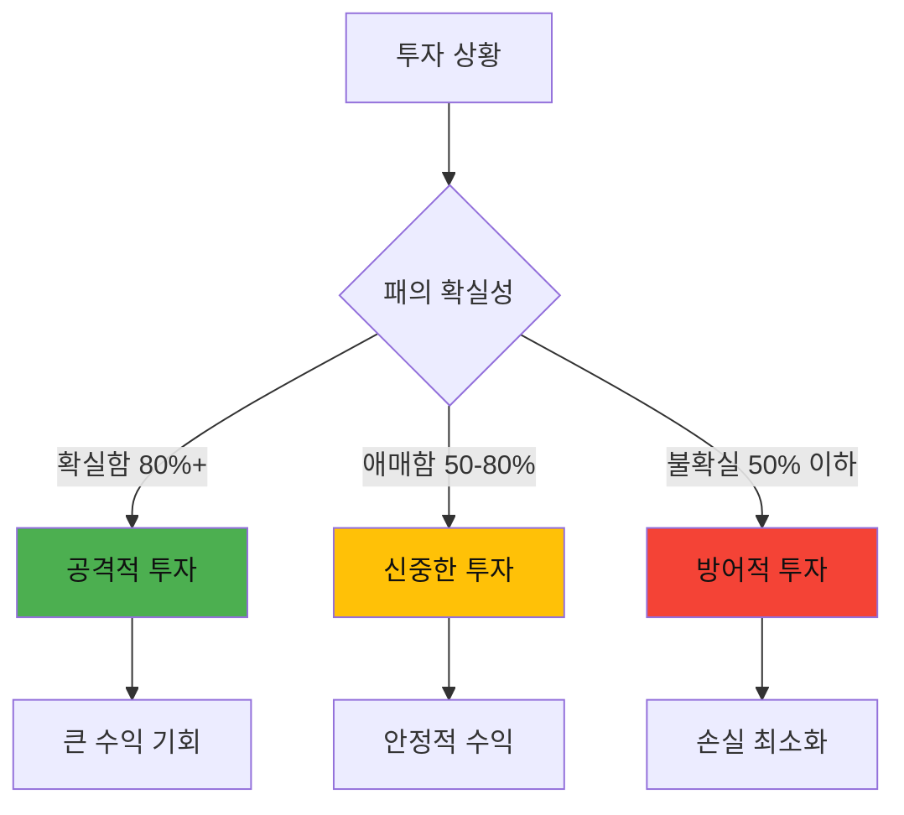

### 학습 목표
1. **신호 강도 판단**: 얼마나 확실한가?
2. **리스크 조절**: 확실성에 따른 투자 비중
3. **실수 복구**: 잘못된 판단 후 최선의 대응
4. **감정 관리**: 욕심과 두려움 제어

---

## 📊 시나리오 1: 급등주의 유혹 (난이도: ⭐⭐)

### 🎯 학습 목표
- 과열 신호 인식
- FOMO(놓칠까봐 두려움) 극복
- 조정 후 진입 타이밍

---

### 턴 1️⃣ : 초기 발견

#### 📈 상황 제시
```
종목명: 테크혁신 (가상)
현재가: 15,000원 → 19,500원 (+30% 급등)
기간: 최근 3일간
거래량: 평균 대비 500% 폭증

📰 뉴스: "AI 신기술 개발 성공, 글로벌 특허 출원"

📊 기술적 지표:
- RSI: 78 (과열 구간)
- 거래대금: 1,000억원 (평소 200억)
- 외국인: 3일간 순매수 150억

💰 재무 정보:
- PER: 15 → 19.5 (업종 평균 18)
- 시가총액: 1.5조 → 1.95조
- 최근 분기 실적: 양호
```

#### 🎲 선택지

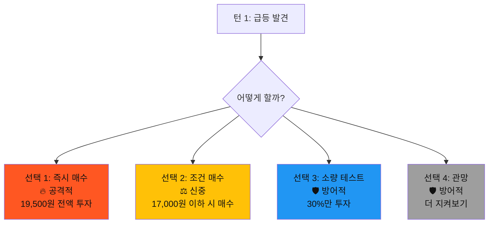

#### 🎯 확실성 분석
```
✅ 긍정 신호 (50점):
- 실제 호재 존재 (특허) +20
- 거래량 동반 상승 +15
- 외국인 매수 +15

⚠️ 위험 신호 (50점):
- RSI 과열 -20
- 3일간 30% 급등 (과도) -20
- PER 업종 평균 초과 -10

📊 종합 확실성: 50% (애매한 상황)
💡 권장: 신중한 접근 (선택 2, 3)
```

---

### 턴 2️⃣ : 시장 반응 (선택별 분기)

#### 🔴 분기 A: 선택 1 (즉시 매수) 선택 시

```
⏰ 3일 후 상황

📉 주가 변동:
19,500원 → 17,200원 (-11.8%)

📊 시장 상황:
- 차익실현 물량 대거 출회
- 거래량: 평균 수준으로 복귀
- 외국인: 순매도 전환 (-50억)
- 기관: 중립

💬 시장 분석:
"단기 급등 후 자연스러운 조정"
"기술적 지지선 17,000원 테스트 중"

💰 내 포지션:
- 매수가: 19,500원
- 현재가: 17,200원
- 평가손실: -11.8%
- 투자금: 10,000,000원
- 평가액: 8,820,000원 (-1,180,000원)
```

#### 🎲 턴 2 선택지 (분기 A)

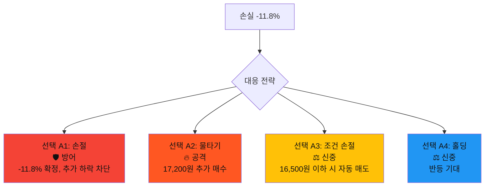

#### 💡 학습 포인트
```
❌ 실수: 과열 구간에서 즉시 매수
📚 교훈: 
- RSI 70 이상은 조정 가능성 높음
- 3일 30% 급등은 과도한 상승
- 확실성 50%에서 전액 투자는 위험

✅ 최선의 대응:
- 선택 A3 (조건 손절): 추가 손실 제한
- 선택 A4 (홀딩): 지지선 근처면 반등 가능
```

---

#### 🟡 분기 B: 선택 2 (조건 매수) 선택 시

```
⏰ 3일 후 상황

📉 주가 변동:
19,500원 → 17,200원 → 16,800원 (최저)

🎯 조건 주문 체결:
- 설정가: 17,000원
- 체결가: 16,900원 (3일째)
- 매수량: 전액

📊 현재 상황:
- 매수가: 16,900원
- 현재가: 17,200원
- 평가수익: +1.8%
- 투자금: 10,000,000원
- 평가액: 10,180,000원 (+180,000원)

💬 시장 분석:
"지지선에서 반등 시도 중"
"단기 조정 마무리 신호"
```

#### 🎲 턴 2 선택지 (분기 B)

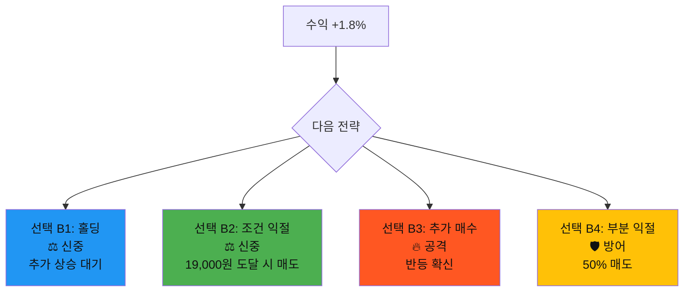

#### 💡 학습 포인트
```
✅ 성공: 조정 후 진입으로 유리한 가격 확보
📚 교훈:
- 과열 구간은 조정 대기가 유리
- 조건 주문으로 감정 배제
- 인내심이 좋은 가격을 만듦

✅ 최선의 대응:
- 선택 B2 (조건 익절): 수익 구간 설정
- 선택 B1 (홀딩): 추가 상승 여력 있음
```

---

#### 🔵 분기 C: 선택 3 (소량 테스트) 선택 시

```
⏰ 3일 후 상황

📉 주가 변동:
19,500원 → 17,200원 (-11.8%)

💰 내 포지션:
- 1차 매수: 19,500원 (30% = 3,000,000원)
- 평가액: 2,646,000원 (-354,000원)
- 남은 현금: 7,000,000원

📊 상황:
- 손실: -11.8%
- 하지만 전체 자산 기준 -3.5%만 손실
- 추가 매수 여력 충분
```

#### 🎲 턴 2 선택지 (분기 C)

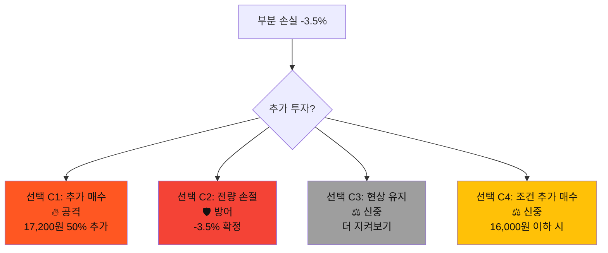

#### 💡 학습 포인트
```
✅ 성공: 분할 투자로 리스크 제한
📚 교훈:
- 불확실한 상황에서는 분할 투자
- 손실 제한 + 추가 기회 확보
- 심리적 안정감

✅ 최선의 대응:
- 선택 C1 (추가 매수): 평단가 낮추기
- 선택 C4 (조건 추가): 더 좋은 가격 노림
```

---

#### ⚫ 분기 D: 선택 4 (관망) 선택 시

```
⏰ 3일 후 상황

📉 주가 변동:
19,500원 → 17,200원 → 16,500원 (최저)
→ 17,000원 (현재)

💰 내 포지션:
- 매수 없음
- 현금: 10,000,000원 (100%)

📊 기회 분석:
- 최저점 16,500원 놓침 (-15.4%)
- 현재 17,000원 (-12.8%)
- 조정 마무리 신호 포착
```

#### 🎲 턴 2 선택지 (분기 D)

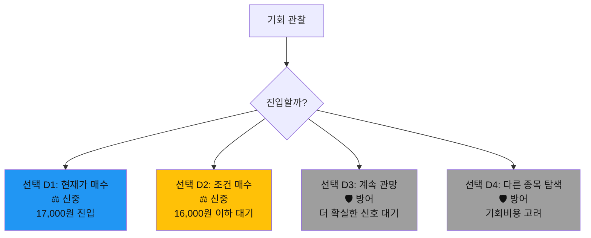

#### 💡 학습 포인트
```
⚠️ 결과: 안전하지만 기회 상실
📚 교훈:
- 과도한 신중함도 기회비용 발생
- 조정 후가 좋은 진입 시점
- 완벽한 타이밍은 없음

✅ 최선의 대응:
- 선택 D1 (현재가 매수): 조정 후 진입
- 선택 D2 (조건 매수): 더 좋은 가격 노림
```

---

### 턴 3️⃣ : 추가 변수 발생

#### 🔴 분기 A 계속 (즉시 매수 → 조건 손절 선택)

```
⏰ 5일 후 상황

📰 새로운 뉴스:
"경쟁사 B사, 유사 기술 먼저 상용화 발표"

📉 주가 충격:
17,200원 → 16,400원 (-4.7%)
→ 16,500원 손절선 근접

⚠️ 조건 손절 대기 중:
- 설정: 16,500원 이하 시 전량 매도
- 현재: 16,400원 (손절 임박)

📊 추가 정보:
- 우리 회사 기술: 아직 개발 단계
- 경쟁사 기술: 이미 양산 준비
- 시장 반응: 부정적
```

#### 🎲 턴 3 긴급 선택

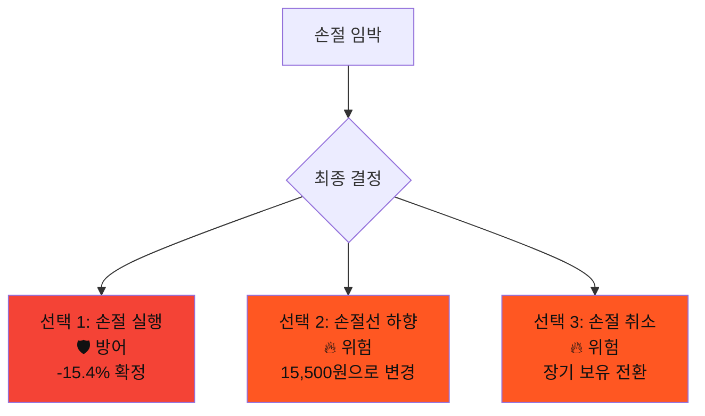

#### 💬 AI 조언
```
📊 상황 분석:
- 확실성: 30% (매우 불확실)
- 추가 악재 가능성: 높음
- 반등 가능성: 낮음

💡 권장 전략:
선택 1 (손절 실행)

이유:
1. 투자 논리 붕괴 (경쟁 우위 상실)
2. 추가 하락 위험 높음
3. 손실 확대 방지가 우선

⚠️ 중요:
"손절은 실패가 아니라 리스크 관리다"
```

---

#### 🟡 분기 B 계속 (조건 매수 → 조건 익절 선택)

```
⏰ 5일 후 상황

📰 새로운 뉴스:
"글로벌 기업 C사와 기술 협력 MOU 체결"

📈 주가 상승:
17,200원 → 18,500원 (+7.6%)
→ 19,200원 (현재)

🎯 조건 익절 대기:
- 설정: 19,000원 도달 시 전량 매도
- 결과: 19,050원 자동 체결 완료

💰 최종 수익:
- 매수가: 16,900원
- 매도가: 19,050원
- 수익률: +12.7%
- 수익금: +1,270,000원
```

#### 🎲 턴 3 선택

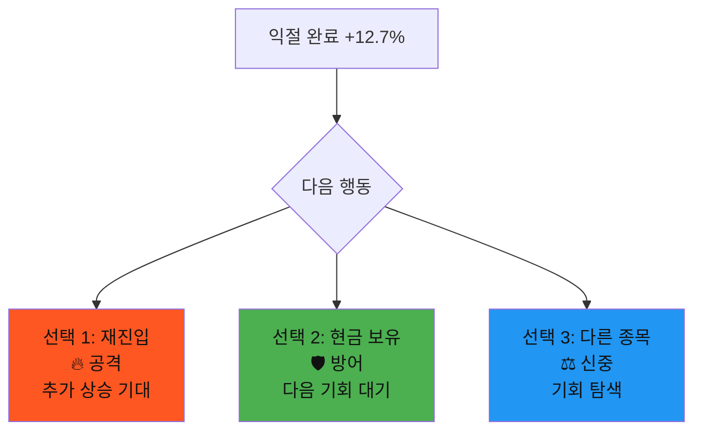

#### 💬 AI 조언
```
📊 상황 분석:
- 목표 달성: 성공 ✅
- 추가 상승 여력: 있음 (50%)
- 하지만 이미 좋은 수익 확보

💡 권장 전략:
선택 2 (현금 보유) 또는 선택 3 (다른 종목)

이유:
1. 12.7% 수익은 훌륭한 성과
2. 욕심 부리면 수익 반납 위험
3. 다음 기회는 항상 있음

✅ 성공 요인:
- 조정 후 진입 (인내심)
- 조건 주문 활용 (감정 배제)
- 목표가 설정 (욕심 제어)
```

---

### 턴 4️⃣ : 결과 확인

#### 🔴 분기 A 결말 (손절 실행 선택)

```
⏰ 7일 후 최종 결과

📉 주가 추이:
19,500원 (매수)
→ 16,400원 (손절)
→ 14,800원 (현재)

💰 최종 결과:
- 손실: -15.4% (-1,540,000원)
- 만약 손절 안했다면: -24.1% (-2,410,000원)
- 손절로 방어한 금액: -870,000원

📊 평가:
⭐⭐⭐ (5점 만점 중 3점)

✅ 잘한 점:
- 손절로 추가 손실 방어
- 원칙 지킴

❌ 아쉬운 점:
- 초기 과열 구간 매수 실수
- 확실성 50%에서 전액 투자
```

#### 📚 핵심 교훈

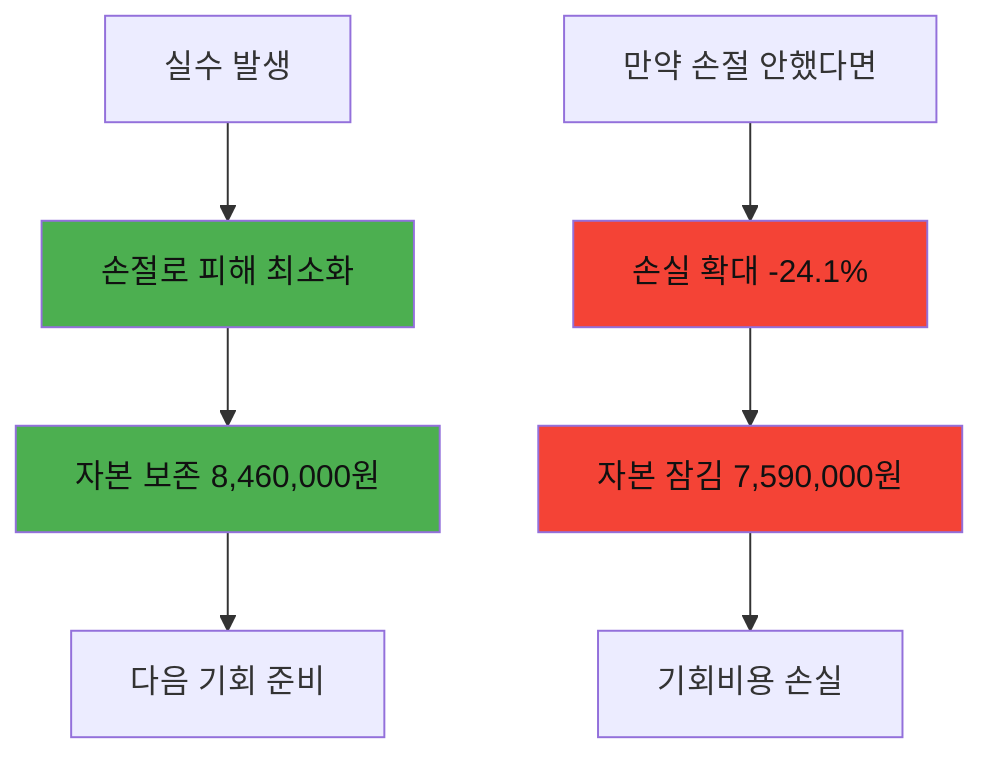

#### 💡 배운 것
```
1. ❌ 실수: RSI 78 과열 구간 매수
   ✅ 교훈: 과열 시 조정 대기

2. ❌ 실수: 확실성 50%에서 전액 투자
   ✅ 교훈: 불확실하면 분할 투자

3. ✅ 성공: 원칙대로 손절 실행
   💡 교훈: 손절은 리스크 관리의 핵심

4. ✅ 성공: 추가 손실 870,000원 방어
   💡 교훈: 작은 손실이 큰 손실보다 낫다
```

---

#### 🟡 분기 B 결말 (익절 후 현금 보유)

```
⏰ 7일 후 최종 결과

📈 주가 추이:
16,900원 (매수)
→ 19,050원 (익절)
→ 21,500원 (현재)

💰 최종 결과:
- 수익: +12.7% (+1,270,000원)
- 만약 계속 보유: +27.2% (+2,720,000원)
- 놓친 수익: +1,450,000원

📊 평가:
⭐⭐⭐⭐ (5점 만점 중 4점)

✅ 잘한 점:
- 조정 후 진입으로 좋은 가격 확보
- 조건 주문으로 감정 배제
- 목표 수익 달성

❌ 아쉬운 점:
- 추가 상승 놓침
- 하지만 이것은 결과론
```

#### 📚 핵심 교훈

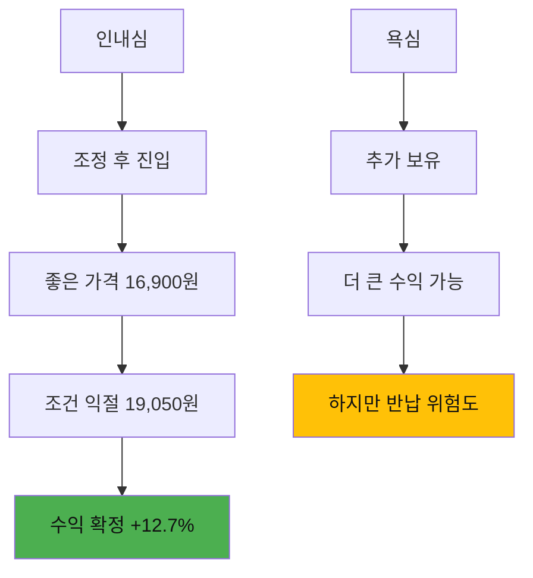

#### 💡 배운 것
```
1. ✅ 성공: 과열 구간 회피
   💡 교훈: 인내심이 좋은 가격을 만듦

2. ✅ 성공: 조건 주문 활용
   💡 교훈: 감정 배제가 성공의 열쇠

3. ✅ 성공: 목표 수익 달성
   💡 교훈: 12.7%도 훌륭한 수익

4. ⚠️ 고민: 추가 상승 놓침
   💡 교훈: 완벽한 타이밍은 없음
   💡 교훈: 욕심 부리면 수익 반납 위험
```

---

### 턴 5️⃣ : 종합 평가 및 다음 스테이지

#### 📊 전체 분기 비교

```mermaid
graph TB
    subgraph "분기 A: 즉시 매수"
        A1[19,500원 매수] --> A2[손실 -11.8%]
        A2 --> A3[손절 -15.4%]
        A3 --> A4[최종: -1,540,000원]
    end
    
    subgraph "분기 B: 조건 매수"
        B1[조정 대기] --> B2[16,900원 매수]
        B2 --> B3[익절 +12.7%]
        B3 --> B4[최종: +1,270,000원]
    end
    
    subgraph "분기 C: 소량 테스트"
        C1[19,500원 30%] --> C2[손실 -3.5%]
        C2 --> C3[추가 매수 기회]
        C3 --> C4[최종: 상황에 따라]
    end
    
    subgraph "분기 D: 관망"
        D1[매수 안함] --> D2[기회 관찰]
        D2 --> D3[17,000원 진입]
        D3 --> D4[최종: 늦었지만 안전]
    end
    
    style B4 fill:#4CAF50,color:#111
    style A4 fill:#F44336,color:#111
    style C4 fill:#FFC107,color:#111
    style D4 fill:#2196F3,color:#111
```

#### 🏆 최종 점수표

| 분기 | 초기 선택 | 최종 결과 | 점수 | 평가 |
|------|----------|----------|------|------|
| A | 즉시 매수 (공격) | -15.4% | ⭐⭐⭐ | 실수했지만 손절로 방어 |
| B | 조건 매수 (신중) | +12.7% | ⭐⭐⭐⭐⭐ | 완벽한 전략 |
| C | 소량 테스트 (신중) | -3.5% ~ +5% | ⭐⭐⭐⭐ | 리스크 관리 우수 |
| D | 관망 (방어) | 0% ~ +5% | ⭐⭐⭐ | 안전하지만 기회 상실 |

#### 💎 황금 교훈

```
🎯 확실성에 따른 투자 전략

┌─────────────────────────────────────┐
│ 확실성 80% 이상 → 공격적 투자 (70-100%) │
│ 확실성 50-80% → 신중한 투자 (30-50%)   │
│ 확실성 50% 이하 → 방어적 투자 (0-30%)   │
└─────────────────────────────────────┘

이 시나리오의 확실성: 50% (애매함)
→ 최적 전략: 조건 매수 또는 소량 테스트
→ 실제 최고 성과: 분기 B (조건 매수)
```

#### 🎓 마스터 체크리스트

```
□ RSI 70 이상은 과열 신호
□ 3일 30% 급등은 조정 가능성 높음
□ 불확실할 때는 조정 후 진입
□ 조건 주문으로 감정 배제
□ 손절은 리스크 관리의 핵심
□ 욕심 부리면 수익 반납
□ 완벽한 타이밍은 없음
```

---

## 📊 시나리오 2: 실적 발표의 함정 (난이도: ⭐⭐⭐)

### 🎯 학습 목표
- 컨센서스 vs 실제 실적 분석
- 선반영 vs 후반영 판단
- 서프라이즈 대응

---

### 턴 1️⃣ : 실적 발표 D-3

#### 📈 상황 제시
```
종목명: 바이오메디 (가상)
현재가: 45,000원
실적 발표: 3일 후

📊 시장 컨센서스:
- 예상 EPS: 3,000원
- 예상 매출: 8,000억원
- 예상 영업이익: 600억원 (7.5%)

📈 최근 주가 흐름:
- 1개월 전: 42,000원
- 2주 전: 44,000원
- 현재: 45,000원 (+7.1% 상승)

💬 애널리스트 의견:
- 긍정 5명: "실적 개선 기대"
- 중립 3명: "컨센서스 수준"
- 부정 1명: "원자재 부담"

📊 옵션 시장:
- 콜옵션 거래량: 증가 (+30%)
- 풋옵션 거래량: 평균 수준
→ 상승 베팅 우세

🔍 추가 정보:
- 경쟁사 실적: 양호
- 업종 전망: 긍정적
- 환율: 안정적
```

#### 🎯 확실성 분석
```
✅ 긍정 신호 (65점):
- 애널리스트 긍정 의견 우세 +20
- 경쟁사 실적 양호 +15
- 옵션 시장 상승 베팅 +15
- 업종 전망 긍정 +15

⚠️ 위험 신호 (35점):
- 이미 7% 선반영 -15
- 원자재 부담 우려 -10
- 서프라이즈 불확실 -10

📊 종합 확실성: 65% (신중한 투자 구간)
💡 권장: 50% 투자 또는 조건부 전략
```

#### 🎲 선택지

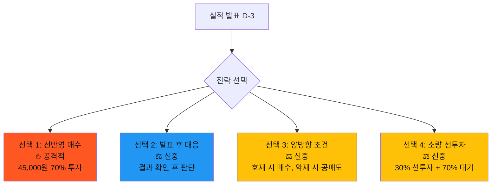

---

### 턴 2️⃣ : 실적 발표 (서프라이즈!)

#### 🔴 분기 A: 선택 1 (선반영 매수)

```
⏰ 실적 발표 당일

📰 실적 발표:
- 실제 EPS: 3,800원 (+26.7% 서프라이즈!)
- 실제 매출: 8,500억원 (+6.3%)
- 실제 영업이익: 720억원 (8.5%, +20%)

🎉 시장 반응:
- 시간외: 48,600원 (+8%)
- 장 시작: 49,500원 갭상승 (+10%)
- 거래량 폭증: 평균 대비 600%

💰 내 포지션:
- 매수가: 45,000원 (70% = 7,000,000원)
- 현재가: 49,500원
- 평가수익: +10% (+700,000원)
- 남은 현금: 3,000,000원
```

#### 🎲 턴 2 선택지

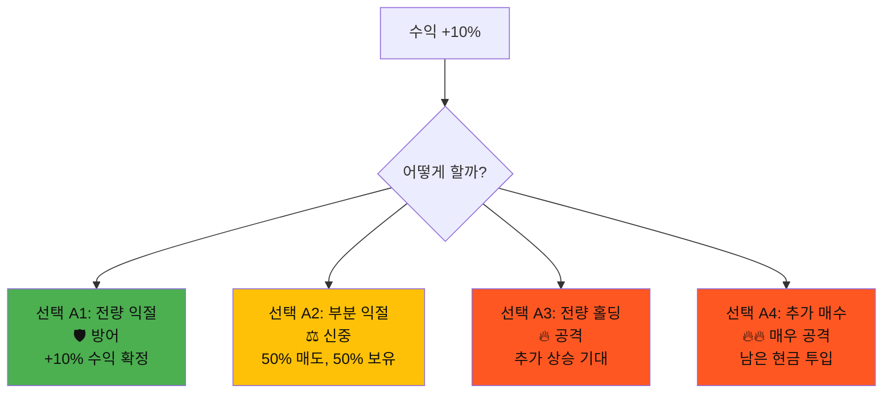

#### 💬 AI 조언
```
📊 상황 분석:
- 실적: 컨센서스 대비 우수 ✅
- 주가: 이미 10% 상승 ⚠️
- 추가 상승 여력: 있지만 단기 과열 가능

💡 권장 전략:
선택 A2 (부분 익절)

이유:
1. 10% 수익은 훌륭함 → 일부 확정
2. 추가 상승 가능성 → 일부 보유
3. 갭상승 후 조정 가능성 → 리스크 관리

🎯 확실성 재평가: 70% (신중한 공격)
```

---

#### 🟡 분기 B: 선택 2 (발표 후 대응)

```
⏰ 실적 발표 당일

📰 실적 발표:
- 실제 EPS: 3,800원 (+26.7% 서프라이즈!)

🎉 시장 반응:
- 장 시작: 49,500원 갭상승 (+10%)
- 오전 10시: 51,000원 (+13.3%)
- 오전 11시: 49,800원 (-2.4% 조정)

💰 내 상황:
- 매수 안함 (현금 100%)
- 기회: 49,800원 진입 가능

🤔 고민:
"이미 10% 올랐는데 지금 들어가야 할까?"
"더 조정될까? 아니면 더 오를까?"
```

#### 🎲 턴 2 선택지

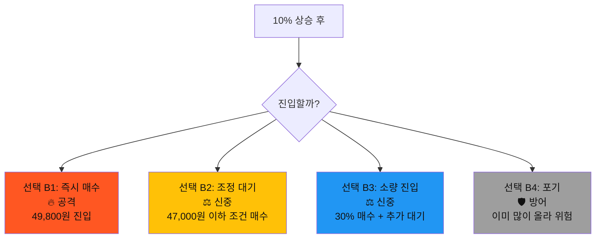

#### 💬 AI 조언
```
📊 상황 분석:
- 실적: 확실히 좋음 ✅
- 주가: 이미 반영 중 ⚠️
- 추가 상승: 가능하지만 단기 조정도 가능

💡 권장 전략:
선택 B3 (소량 진입) 또는 선택 B2 (조정 대기)

이유:
1. 실적은 좋지만 이미 10% 상승
2. 갭 메우기 가능성 있음
3. 조정 시 더 좋은 가격 기회

⚠️ 주의:
선택 B4 (포기)는 기회 완전 상실 위험
```

---

### 턴 3️⃣ : 갭 메우기 vs 추가 상승

#### 🔴 분기 A 계속 (부분 익절 선택)

```
⏰ 실적 발표 +2일

📈 주가 흐름:
D+0: 49,500원 (갭상승)
D+1: 51,500원 (+4% 추가 상승)
D+2: 52,800원 (+2.5% 추가 상승)

💰 내 포지션:
- 보유분: 45,000원 매수 → 50% 보유
  현재가: 52,800원 (+17.3%)
  평가액: 4,109,000원 (투자 3,500,000원)
  
- 익절분: 49,500원 매도 → 50%
  확정 수익: +350,000원

- 총 수익: +959,000원 (+9.6%)

📊 시장 상황:
- 외국인: 지속 매수
- 기관: 순매수 전환
- 목표가 상향: 55,000원 (애널리스트)
```

#### 🎲 턴 3 선택지

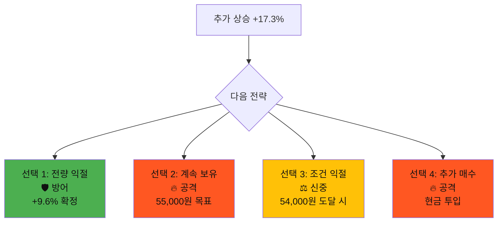

#### 💬 AI 조언
```
📊 상황 분석:
- 추세: 강한 상승세 ✅
- 목표가: 아직 여력 있음 ✅
- 하지만: 단기 과열 가능성 ⚠️

💡 권장 전략:
선택 E3 (조건 익절)

이유:
1. 이미 좋은 수익 확보
2. 추가 상승 여력 활용
3. 목표가 도달 시 자동 익절
4. 욕심 제어

🎯 확실성: 60% (추가 상승 가능하지만 보장 안됨)
```

---

#### 🟡 분기 B 계속 (조정 대기 선택)

```
⏰ 실적 발표 +2일

📈 주가 흐름:
D+0: 49,500원 (갭상승)
D+1: 51,500원 (+4% 추가 상승)
D+2: 52,800원 (+2.5% 추가 상승)

💰 내 상황:
- 조건 매수: 47,000원 설정
- 결과: 미체결 (주가가 계속 상승)
- 현금: 10,000,000원 (100%)

😢 놓친 수익:
- 만약 49,800원 매수: +6% (+600,000원)
- 만약 51,000원 매수: +3.5% (+350,000원)

🤔 현재 고민:
"지금이라도 들어가야 할까?"
"아니면 계속 기다려야 할까?"
```

#### 🎲 턴 3 선택지

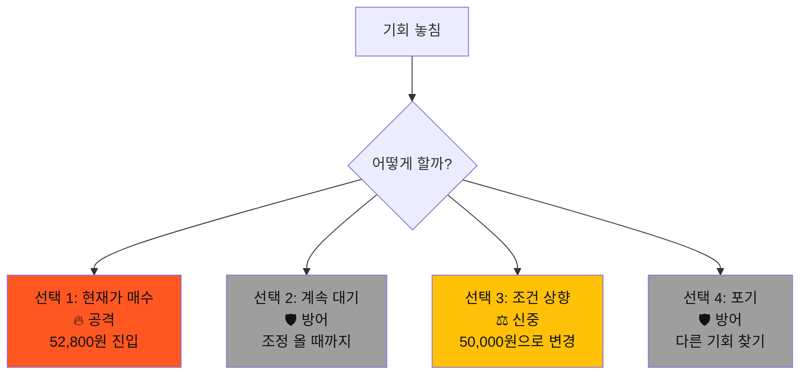

#### 💬 AI 조언
```
📊 상황 분석:
- 실적: 여전히 좋음 ✅
- 주가: 이미 17% 상승 ⚠️⚠️
- 조정: 언젠가는 올 것 ⚠️

💡 권장 전략:
선택 E4 (포기) 또는 선택 E2 (계속 대기)

이유:
1. 17% 상승 후는 위험 구간
2. 조정 없는 상승은 없음
3. FOMO(놓칠까봐 두려움) 경계
4. 다음 기회는 항상 있음

⚠️ 경고:
선택 E1 (현재가 매수)는 고점 매수 위험
→ 확실성 30% 이하
```

---

### 턴 4️⃣ : 조정 시작

#### 🔴 분기 A 결말 (조건 익절 선택)

```
⏰ 실적 발표 +5일

📉 주가 흐름:
D+3: 54,200원 (+2.7% 상승)
D+4: 53,800원 (-0.7% 조정)
D+5: 51,500원 (-4.3% 조정)

🎯 조건 익절:
- 설정: 54,000원 도달 시 매도
- 결과: D+3일 54,100원 체결 완료 ✅

💰 최종 결과:
- 1차 익절 (50%): 49,500원 (+10%)
- 2차 익절 (50%): 54,100원 (+20.2%)
- 평균 수익률: +15.1%
- 총 수익: +1,057,000원

📊 만약 계속 보유했다면:
- 현재가: 51,500원 (+14.4%)
- 수익: +1,008,000원
- 차이: +49,000원 (조건 익절이 유리)
```

#### 💡 학습 포인트
```
✅ 성공 요인:
1. 선반영 매수로 좋은 가격 확보
2. 부분 익절로 리스크 관리
3. 조건 익절로 욕심 제어
4. 조정 전 탈출 성공

📚 핵심 교훈:
- 실적 좋으면 선반영 매수 유리
- 부분 익절로 리스크와 기회 균형
- 조건 주문으로 감정 배제
- 완벽한 고점은 못 잡아도 좋은 수익 확보

🎯 최종 평가: ⭐⭐⭐⭐⭐
```

---

#### 🟡 분기 B 결말 (계속 대기 선택)

```
⏰ 실적 발표 +5일

📉 주가 흐름:
D+3: 54,200원 (최고점)
D+4: 53,800원
D+5: 51,500원 (조정)
D+6: 49,200원 (갭 메우기)
D+7: 47,500원 (현재)

💰 내 상황:
- 조건 매수: 47,000원 설정
- 현재가: 47,500원 (조건 근접)

🎯 기회 재도래:
- 초기가: 45,000원
- 최고가: 54,200원 (+20.4%)
- 현재가: 47,500원 (+5.6%)
- 조정폭: -12.4%

💭 평가:
- 인내심으로 조정 기다림 ✅
- 하지만 상승 기회 완전 놓침 ❌
- 이제 조건가 근처 도달
```

#### 🎲 턴 4 최종 선택

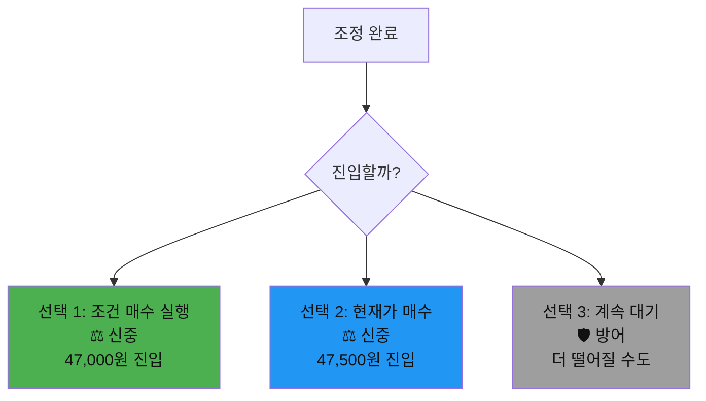

#### 💬 AI 조언
```
📊 상황 분석:
- 실적: 여전히 좋음 ✅
- 조정: 충분히 진행됨 ✅
- 진입 시점: 좋음 ✅

💡 권장 전략:
선택 F1 (조건 매수 실행) 또는 선택 F2 (현재가 매수)

이유:
1. 실적은 변하지 않음
2. 조정으로 좋은 가격 형성
3. 지지선 근처 (안전 마진)

🎯 확실성: 70% (이제는 좋은 기회)

💡 교훈:
- 과도한 신중함도 기회비용
- 조정 기다리는 것은 좋지만
- 완벽한 저점은 없음
```

---

### 턴 5️⃣ : 종합 평가

#### 📊 전체 분기 비교

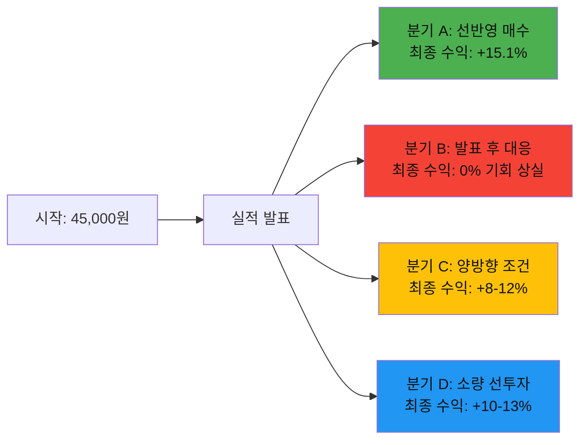

#### 🏆 최종 점수표

| 분기 | 전략 | 최종 수익 | 점수 | 평가 |
|------|------|----------|------|------|
| A | 선반영 매수 + 부분 익절 | +15.1% | ⭐⭐⭐⭐⭐ | 완벽한 실행 |
| B | 발표 후 대응 + 과도한 대기 | 0% | ⭐⭐ | 기회 상실 |
| C | 양방향 조건 | +8-12% | ⭐⭐⭐⭐ | 안전한 수익 |
| D | 소량 선투자 + 추가 대응 | +10-13% | ⭐⭐⭐⭐ | 균형잡힌 전략 |

#### 💎 황금 교훈

```
🎯 실적 발표 투자 전략

1. 컨센서스 분석:
   - 긍정적 컨센서스 → 선반영 매수 고려
   - 부정적 컨센서스 → 발표 후 대응

2. 확실성 판단:
   - 65% 이상 → 선반영 매수 (50-70%)
   - 50-65% → 소량 선투자 (30%)
   - 50% 이하 → 발표 후 대응

3. 갭상승 대응:
   - 이미 보유 → 부분 익절
   - 미보유 → 조정 대기 (갭 메우기)

4. 욕심 제어:
   - 조건 익절 설정 필수
   - 완벽한 고점은 없음
   - 좋은 수익이면 충분
```

---

## 📊 시나리오 3: 하락장의 선택 (난이도: ⭐⭐⭐⭐)

### 🎯 학습 목표
- 손절 vs 물타기 판단
- 하락 추세 인식
- 감정 관리 (손실 회피 편향)

---

### 턴 1️⃣ : 예상치 못한 악재

#### 📈 상황 제시
```
종목명: 글로벌물류 (가상)

💰 내 포지션:
- 매수가: 80,000원
- 매수일: 2주 전
- 보유량: 125주
- 투자금: 10,000,000원

📉 현재 상황:
- 현재가: 72,000원 (-10%)
- 평가액: 9,000,000원
- 평가손실: -1,000,000원

📰 악재 발생:
"정부, 물류업 규제 강화 방침 발표"
- 운임 상한제 도입 검토
- 수익성 악화 우려

📊 기술적 상황:
- 지지선: 70,000원
- 20일 이평선: 75,000원 (하향 이탈)
- RSI: 35 (과매도 근접)
- 거래량: 평균 대비 250% 증가

🔍 추가 정보:
- 업종 전체: -8% 하락
- 경쟁사: -12% 하락
- 외국인: 순매도 -100억
```

#### 🎯 확실성 분석
```
⚠️ 부정 신호 (70점):
- 규제 악재 (구조적 문제) -30
- 업종 전체 하락 -20
- 이평선 하향 이탈 -10
- 외국인 순매도 -10

✅ 긍정 신호 (30점):
- RSI 과매도 근접 +10
- 지지선 근처 +10
- 일시적 악재 가능성 +10

📊 종합 확실성: 30% (매우 불확실, 하락 우세)
💡 권장: 방어적 전략 (손절 또는 조건 손절)
```

#### 🎲 선택지

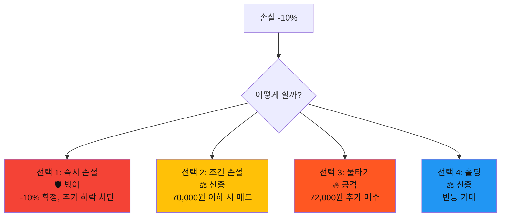

---

### 턴 2️⃣ : 상황 악화

#### 🔴 분기 A: 선택 3 (물타기) 선택 시

```
⏰ 3일 후

📉 주가 변동:
72,000원 → 65,000원 (-9.7% 추가 하락)

💰 내 포지션:
- 1차 매수: 80,000원 125주 (10,000,000원)
- 2차 매수: 72,000원 138주 (10,000,000원)
- 평균 단가: 76,000원
- 총 보유: 263주
- 총 투자: 20,000,000원
- 현재가: 65,000원
- 평가액: 17,095,000원
- 평가손실: -2,905,000원 (-14.5%)

📰 추가 악재:
"주요 고객사 계약 해지 발표"
- 매출 10% 감소 예상
- 실적 하향 조정 불가피

📊 기술적 상황:
- 70,000원 지지선 붕괴
- 다음 지지선: 60,000원
- RSI: 28 (과매도)
- 거래량: 지속 증가 (매도 우세)
```

#### 🎲 턴 2 선택지 (위기!)

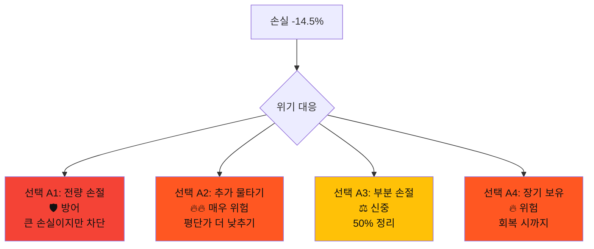

#### 💬 AI 조언 (긴급!)
```
🚨 위기 상황 분석:
- 투자 논리 붕괴: 규제 + 실적 악화
- 추가 하락 가능성: 매우 높음 (70%)
- 반등 가능성: 낮음 (30%)
- 확실성: 20% (매우 불확실)

💡 강력 권장:
선택 D1 (전량 손절) 또는 선택 D3 (부분 손절)

이유:
1. 물타기 실패 (악재 지속)
2. 투자 논리 완전 붕괴
3. 추가 악재 가능성
4. 손실 확대 방지 최우선

⚠️ 경고:
선택 D2 (추가 물타기)는 파산 위험
선택 D4 (장기 보유)는 기회비용 손실

💡 핵심 교훈:
"물타기는 투자 논리가 유효할 때만"
"악재 지속 시 손절이 최선"
```

---

#### 🟡 분기 B: 선택 2 (조건 손절) 선택 시

```
⏰ 3일 후

📉 주가 변동:
72,000원 → 69,500원 → 69,800원

🎯 조건 손절:
- 설정: 70,000원 이하 시 전량 매도
- 결과: 69,800원 자동 체결 ✅

💰 최종 결과:
- 매수가: 80,000원
- 매도가: 69,800원
- 손실률: -12.75%
- 손실금: -1,275,000원
- 회수금: 8,725,000원

📉 이후 주가:
69,800원 → 65,000원 (-6.9% 추가 하락)

💡 손절 효과:
- 만약 손절 안했다면: -18.75% (-1,875,000원)
- 손절로 방어한 금액: -600,000원
```

#### 🎲 턴 2 선택지

```mermaid
graph TD
    A[손절 완료] --> B{다음 행동}
    
    B --> D1[선택 B1: 재진입<br/>🔥 공격<br/>65,000원 매수]
    B --> D2[선택 B2: 계속 관망<br/>🛡️ 방어<br/>안정화 대기]
    B --> D3[선택 B3: 다른 종목<br/>⚖️ 신중<br/>기회 탐색]
    
    style D1 fill:#FF5722,color:#111
    style D2 fill:#4CAF50,color:#111
    style D3 fill:#2196F3,color:#111
```

#### 💬 AI 조언
```
📊 상황 분석:
- 손절 결과: 성공 ✅ (추가 하락 회피)
- 현재 주가: 65,000원 (추가 하락)
- 악재: 여전히 유효 ⚠️

💡 권장 전략:
선택 D2 (계속 관망) 또는 선택 D3 (다른 종목)

이유:
1. 손절로 자본 보존 성공
2. 악재 여전히 진행 중
3. 재진입은 같은 실수 반복
4. 다른 기회 찾는 것이 유리

✅ 성공 요인:
- 원칙대로 손절 실행
- 감정 배제 (조건 주문)
- 추가 손실 600,000원 방어
```

---

### 턴 3️⃣ : 바닥 vs 추가 하락

#### 🔴 분기 A 계속 (전량 손절 선택)

```
⏰ 5일 후

📉 주가 흐름:
65,000원 → 60,000원 (-7.7%)
→ 58,000원 (-3.3%)
→ 62,000원 (+6.9% 반등)

💰 내 상황:
- 손절가: 65,000원
- 손실: -14.5% (-2,905,000원)
- 회수금: 17,095,000원
- 현재 현금 보유

📊 시장 상황:
- 주가: 62,000원 (반등 시작?)
- RSI: 32 → 42 (과매도 탈출)
- 거래량: 감소 (매도 압력 완화)
- 뉴스: 규제 완화 가능성 언급

🤔 고민:
"반등하네... 재진입해야 하나?"
"아니면 더 떨어질까?"
```

#### 🎲 턴 3 선택지

```mermaid
graph TD
    A[손절 후 반등] --> B{재진입?}
    
    B --> E1[선택 1: 재진입<br/>🔥 공격<br/>62,000원 매수]
    B --> E2[선택 2: 계속 관망<br/>🛡️ 방어<br/>확실한 신호 대기]
    B --> E3[선택 3: 다른 종목<br/>⚖️ 신중<br/>새로운 기회]
    
    style E1 fill:#FF5722,color:#111
    style E2 fill:#4CAF50,color:#111
    style E3 fill:#2196F3,color:#111
```

#### 💬 AI 조언
```
📊 상황 분석:
- 반등: 일시적 vs 추세 전환? 불확실
- 악재: 여전히 해결 안됨
- 확실성: 40% (여전히 낮음)

💡 권장 전략:
선택 E2 (계속 관망) 또는 선택 E3 (다른 종목)

이유:
1. 반등이 추세 전환인지 불확실
2. 악재 해결 안됨 (규제, 실적)
3. 재진입은 감정적 판단 위험
4. 손절한 종목은 거리두기

⚠️ 경고:
재진입은 "본전 심리" 위험
→ 객관적 판단 어려움
```

---

### 턴 4️⃣ : 최종 결과

#### 🔴 분기 A 결말 (관망 선택)

```
⏰ 10일 후 최종 결과

📉 주가 최종:
62,000원 (반등) → 57,000원 (재하락)
→ 55,000원 (현재)

💰 최종 평가:
- 손절가: 65,000원
- 현재가: 55,000원
- 손절 대비: -15.4% 추가 하락
- 만약 보유: -31.3% 총 손실

✅ 손절 효과:
- 실제 손실: -14.5%
- 만약 보유: -31.3%
- 방어한 손실: -16.8%
- 방어한 금액: 약 3,360,000원

📊 최종 점수: ⭐⭐⭐⭐
```

#### 💡 핵심 교훈
```
✅ 성공 요인:
1. 원칙대로 손절 실행
2. 감정 제어 (재진입 안함)
3. 추가 손실 방어

❌ 초기 실수:
1. 악재 발생 시 즉시 대응 실패
2. 물타기로 손실 확대

📚 배운 것:
1. 손절은 리스크 관리의 핵심
2. 물타기는 투자 논리 유효할 때만
3. 재진입은 감정적 판단 위험
4. 작은 손실이 큰 손실보다 낫다

💎 황금 원칙:
"투자 논리 붕괴 시 즉시 손절"
"물타기는 확신 있을 때만"
"손절한 종목은 거리두기"
```

---

#### 🟡 분기 B 결말 (조건 손절 → 다른 종목)

```
⏰ 10일 후 최종 결과

💰 글로벌물류:
- 손절가: 69,800원 (-12.75%)
- 현재가: 55,000원
- 손절 효과: -21.2% 방어

💰 새로운 투자:
- 회수금: 8,725,000원
- 새 종목: 테크성장 (가상)
- 매수가: 35,000원
- 현재가: 38,500원
- 수익률: +10%

📊 최종 결과:
- 글로벌물류 손실: -1,275,000원
- 테크성장 수익: +872,500원
- 순손실: -402,500원 (-4%)

✅ 만약 계속 보유:
- 손실: -3,125,000원 (-31.3%)
- 차이: +2,722,500원

📊 최종 점수: ⭐⭐⭐⭐⭐
```

#### 💡 핵심 교훈
```
✅ 완벽한 실행:
1. 조건 손절로 감정 배제
2. 빠른 손절로 자본 보존
3. 새로운 기회 포착
4. 손실 최소화 + 수익 창출

📚 배운 것:
1. 손절은 끝이 아니라 시작
2. 자본 보존이 수익의 기회
3. 조건 주문의 위력
4. 기회비용 관리의 중요성

💎 황금 원칙:
"손절 = 자본 보존 = 다음 기회"
"조건 주문으로 감정 배제"
"나쁜 종목 버리고 좋은 종목 찾기"
```

---

### 턴 5️⃣ : 종합 평가

#### 📊 전체 분기 비교

```mermaid
graph TB
    A[악재 발생 -10%] --> B{선택}
    
    B --> C1[즉시 손절<br/>-10% 확정]
    B --> C2[조건 손절<br/>-12.75% 확정]
    B --> C3[물타기<br/>-14.5% → -31.3%]
    B --> C4[홀딩<br/>-10% → -31.3%]
    
    C1 --> D1[다른 종목 +10%<br/>최종: -0%]
    C2 --> D2[다른 종목 +10%<br/>최종: -4%]
    C3 --> D3[전량 손절<br/>최종: -14.5%]
    C4 --> D4[계속 보유<br/>최종: -31.3%]
    
    style D1 fill:#4CAF50,color:#111
    style D2 fill:#4CAF50,color:#111
    style D3 fill:#FFC107,color:#111
    style D4 fill:#F44336,color:#111
```

#### 🏆 최종 점수표

| 선택 | 초기 대응 | 후속 대응 | 최종 결과 | 점수 |
|------|----------|----------|----------|------|
| A | 즉시 손절 | 다른 종목 | -0% | ⭐⭐⭐⭐⭐ |
| B | 조건 손절 | 다른 종목 | -4% | ⭐⭐⭐⭐⭐ |
| C | 물타기 | 전량 손절 | -14.5% | ⭐⭐⭐ |
| D | 홀딩 | 계속 보유 | -31.3% | ⭐ |

#### 💎 황금 교훈

```
🎯 하락장 대응 전략

1. 악재 판단:
   ✅ 일시적 악재 → 홀딩 또는 물타기 가능
   ❌ 구조적 악재 → 즉시 손절

2. 손절 기준:
   - 투자 논리 붕괴 시 즉시
   - 확실성 30% 이하 시 즉시
   - 손실 -10% 이상 시 고려
   - 조건 손절로 감정 배제

3. 물타기 조건:
   ✅ 투자 논리 여전히 유효
   ✅ 일시적 악재
   ✅ 추가 자금 여유
   ❌ 구조적 문제
   ❌ 악재 지속
   ❌ 자금 부족

4. 손절 후:
   - 재진입 경계 (감정적 판단)
   - 다른 기회 탐색
   - 자본 보존이 수익의 기회
```

---

## 🎮 시스템 구현 가이드

### 턴별 구조

```mermaid
graph TB
    A[시나리오 시작] --> B[턴 1: 상황 제시]
    B --> C[확실성 분석 표시]
    C --> D[4가지 선택지]
    D --> E[선택에 따라 분기]
    
    E --> F[턴 2: 시장 반응]
    F --> G[새로운 데이터]
    G --> H[4가지 선택지]
    H --> I[선택에 따라 분기]
    
    I --> J[턴 3: 추가 변수]
    J --> K[AI 조언 제공]
    K --> L[3-4가지 선택지]
    L --> M[선택에 따라 분기]
    
    M --> N[턴 4: 결과 확인]
    N --> O[최종 수익/손실]
    O --> P[학습 포인트]
    
    P --> Q[턴 5: 종합 평가]
    Q --> R[전체 분기 비교]
    R --> S[황금 교훈]
    S --> T[다음 시나리오]
```

### 확실성 계산 시스템

```typescript
interface 확실성분석 {
  긍정신호: {
    항목: string;
    점수: number;
  }[];
  부정신호: {
    항목: string;
    점수: number;
  }[];
  총점: number;
  권장전략: '공격적' | '신중' | '방어적';
}

function 확실성계산(신호들: 신호[]): 확실성분석 {
  const 긍정점수 = 신호들
    .filter(s => s.유형 === '긍정')
    .reduce((sum, s) => sum + s.점수, 0);
    
  const 부정점수 = 신호들
    .filter(s => s.유형 === '부정')
    .reduce((sum, s) => sum + s.점수, 0);
    
  const 총점 = 긍정점수 - 부정점수;
  
  let 권장전략: string;
  if (총점 >= 80) 권장전략 = '공격적';
  else if (총점 >= 50) 권장전략 = '신중';
  else 권장전략 = '방어적';
  
  return {
    긍정신호: /* ... */,
    부정신호: /* ... */,
    총점,
    권장전략
  };
}
```

### 선택지 구조

```typescript
interface 선택지 {
  id: string;
  제목: string;
  유형: '공격적' | '신중' | '방어적';
  설명: string;
  위험도: 1 | 2 | 3 | 4 | 5;
  예상결과: string;
}

const 선택지예시: 선택지[] = [
  {
    id: 'A1',
    제목: '즉시 매수',
    유형: '공격적',
    설명: '19,500원 전액 투자',
    위험도: 4,
    예상결과: '큰 수익 또는 큰 손실'
  },
  {
    id: 'A2',
    제목: '조건 매수',
    유형: '신중',
    설명: '17,000원 이하 시 매수',
    위험도: 2,
    예상결과: '좋은 가격 확보 가능'
  },
  // ...
];
```

---

## 📱 UI/UX 제안

### 턴 화면 구성

```
┌─────────────────────────────────┐
│  턴 1/5  ⭐⭐⭐ (난이도)        │
├─────────────────────────────────┤
│                                 │
│  📊 현재 상황                   │
│  주가: 15,000 → 19,500원 (+30%) │
│  RSI: 78 (과열)                 │
│                                 │
│  📈 [차트 표시]                 │
│                                 │
├─────────────────────────────────┤
│  🎯 확실성 분석                 │
│  ████████░░ 50%                 │
│  → 신중한 투자 권장             │
├─────────────────────────────────┤
│                                 │
│  [🔥 즉시 매수]  [⚖️ 조건 매수]│
│  [🛡️ 소량 테스트] [⏸️ 관망]    │
│                                 │
└─────────────────────────────────┘
```

### 결과 화면

```
┌─────────────────────────────────┐
│  턴 5/5 - 최종 결과             │
├─────────────────────────────────┤
│                                 │
│  💰 최종 수익률                 │
│  +15.1%                         │
│  +1,057,000원                   │
│                                 │
│  ⭐⭐⭐⭐⭐                      │
│                                 │
├─────────────────────────────────┤
│  ✅ 잘한 점                     │
│  • 조정 후 진입                 │
│  • 부분 익절로 리스크 관리      │
│  • 조건 주문 활용               │
│                                 │
│  📚 배운 것                     │
│  • 과열 구간 회피               │
│  • 감정 배제의 중요성           │
│                                 │
├─────────────────────────────────┤
│  [다음 시나리오] [다시 하기]    │
└─────────────────────────────────┘
```

---

## 🎯 나머지 7개 시나리오 (요약)

### 4. 분할 매수 마스터 (⭐⭐)
- 3단계 분할 매수 전략
- 평균 단가 관리
- 리스크 분산

### 5. 재무제표 읽기 (⭐⭐⭐)
- PER, PBR, ROE 분석
- 실적 추이 파악
- 가치 투자 판단

### 6. 거래량의 비밀 (⭐⭐⭐⭐)
- 세력 매집 포착
- 거래량 패턴 분석
- 급등 전조 신호

### 7. 이동평균선 전략 (⭐⭐)
- 골든크로스/데드크로스
- 정배열/역배열
- 추세 판단

### 8. 뉴스 트레이딩 (⭐⭐⭐)
- 공시 분석
- 시장 반응 예측
- 호재/악재 구분

### 9. 포트폴리오 리밸런싱 (⭐⭐⭐⭐)
- 비중 관리
- 수익 종목 vs 손실 종목
- 기회비용 고려

### 10. 변동성 서바이벌 (⭐⭐⭐⭐⭐)
- 급변동 대응
- 감정 관리
- 조건 주문 활용

---

## 🏆 마스터 달성 조건

```mermaid
graph TB
    A[10개 시나리오] --> B{평균 점수}
    
    B -->|4.5점 이상| C[🏆 마스터]
    B -->|4.0-4.4점| D[🥇 전문가]
    B -->|3.5-3.9점| E[🥈 숙련자]
    B -->|3.0-3.4점| F[🥉 중급자]
    B -->|3.0점 미만| G[📚 초보자]
    
    C --> H[전설의 투자자 칭호]
    D --> I[숙련된 투자자 칭호]
    E --> J[성장하는 투자자 칭호]
```

---

## 💡 최종 메시지

```
🎯 전설의 5턴 핵심 철학

1. 뽑기가 아니다
   → 데이터 흐름을 읽어라

2. 정답은 없다
   → 상황에 맞는 최선을 찾아라

3. 실수해도 괜찮다
   → 최선의 대응을 배워라

4. 확실할 때 공격하라
   → 불확실할 때 방어하라

5. 감정을 배제하라
   → 조건 주문을 활용하라

"주식은 확률 게임이다.
확실성을 높이고, 리스크를 관리하고,
감정을 제어하는 자가 승리한다."
```

