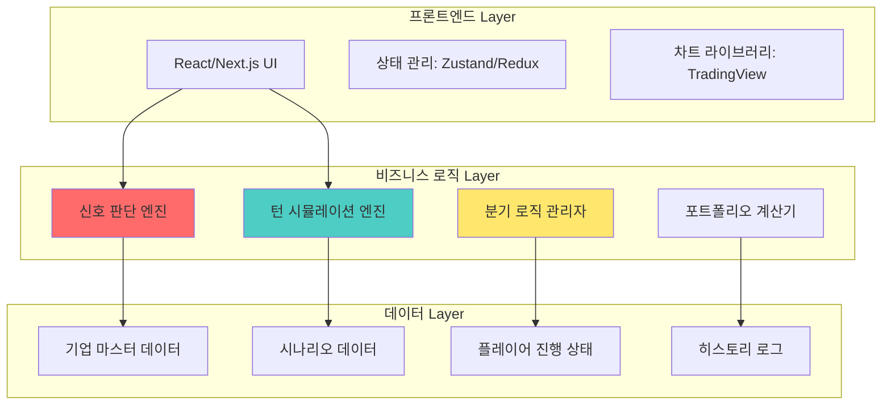
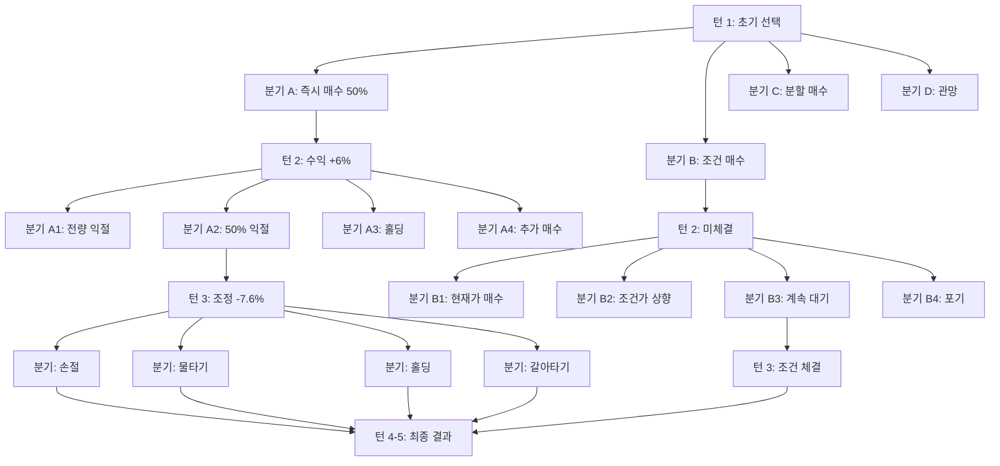

# 주식 흐름 읽기 학습 시스템 - 실전 아키텍처 (Stock Flow Learning System)

> "정답은 하나가 아니다. 시장의 흐름을 읽고 상황에 맞게 대응하는 능력이 핵심이다."

---

## 📋 목차

1. [핵심 알고리즘 아키텍처](#핵심-알고리즘-아키텍처)
2. [신호 판단 엔진 (Signal Analysis Engine)](#신호-판단-엔진)
3. [턴 기반 시뮬레이션 엔진](#턴-기반-시뮬레이션-엔진)
4. [실전 기업 데이터 구조](#실전-기업-데이터-구조)
5. [분기 로직 시스템](#분기-로직-시스템)
6. [AI 피드백 알고리즘](#ai-피드백-알고리즘)
7. [구현 우선순위 및 기술 스택](#구현-우선순위-및-기술-스택)

---

## 🏗️ 핵심 알고리즘 아키텍처

### 전체 시스템 구조



### 핵심 데이터 흐름

```typescript
// 메인 게임 루프
interface GameLoop {
  // 1. 시나리오 초기화
  initScenario(scenarioId: string): ScenarioState;
  
  // 2. 턴 진행
  processTurn(turnData: TurnInput): TurnResult;
  
  // 3. 신호 분석
  analyzeSignals(marketData: MarketData): SignalScore;
  
  // 4. 분기 결정
  determineBranch(playerChoice: Choice): BranchPath;
  
  // 5. 결과 계산
  calculateResult(position: Position): TurnResult;
  
  // 6. 피드백 생성
  generateFeedback(result: TurnResult): Feedback;
}
```

---

## 🎯 신호 판단 엔진 (Signal Analysis Engine)

### 알고리즘 구조

```typescript
/**
 * 신호 판단 엔진 - 핵심 알고리즘
 * 목적: 시장 데이터를 분석하여 투자 확실성 점수 산출
 */
class SignalAnalysisEngine {
  
  /**
   * 메인 분석 함수
   * @param marketData - 시장 데이터 (주가, 거래량, 재무 등)
   * @param companyInfo - 기업 정보
   * @returns 신호 점수 및 확실성 등급
   */
  analyze(marketData: MarketData, companyInfo: CompanyInfo): SignalResult {
    // 1단계: 긍정 신호 점수 계산
    const bullishScore = this.calculateBullishSignals(marketData, companyInfo);
    
    // 2단계: 부정 신호 점수 계산
    const bearishScore = this.calculateBearishSignals(marketData, companyInfo);
    
    // 3단계: 종합 점수 산출
    const totalScore = bullishScore - bearishScore;
    
    // 4단계: 확실성 등급 판정
    const certainty = this.determineCertainty(totalScore);
    
    // 5단계: 투자 전략 추천
    const strategy = this.recommendStrategy(certainty, companyInfo.type);
    
    return {
      bullishScore,
      bearishScore,
      totalScore,
      certainty,
      strategy,
      signals: this.getDetailedSignals(marketData, companyInfo)
    };
  }
  
  /**
   * 긍정 신호 계산 알고리즘
   */
  private calculateBullishSignals(data: MarketData, info: CompanyInfo): number {
    let score = 0;
    const signals: Signal[] = [];
    
    // 실적 서프라이즈 (+30점)
    if (data.earnings.actual > data.earnings.consensus * 1.2) {
      score += 30;
      signals.push({
        type: 'EARNINGS_SURPRISE',
        score: 30,
        description: `실적 서프라이즈: 컨센서스 대비 +${((data.earnings.actual / data.earnings.consensus - 1) * 100).toFixed(1)}%`
      });
    }
    
    // 대규모 수주 (+25점)
    if (data.newOrders && data.newOrders.amount > info.annualRevenue * 0.2) {
      score += 25;
      signals.push({
        type: 'LARGE_ORDER',
        score: 25,
        description: `대규모 수주: 연매출의 ${((data.newOrders.amount / info.annualRevenue) * 100).toFixed(0)}%`
      });
    }
    
    // 외국인 대량 매수 (+20점)
    if (data.foreignBuying.consecutive >= 3 && data.foreignBuying.amount > 50000000000) {
      score += 20;
      signals.push({
        type: 'FOREIGN_BUYING',
        score: 20,
        description: `외국인 ${data.foreignBuying.consecutive}일간 순매수 ${(data.foreignBuying.amount / 100000000).toFixed(0)}억원`
      });
    }
    
    // 목표가 상향 (+15점)
    if (data.targetPriceChanges.filter(c => c.direction === 'UP').length >= 3) {
      score += 15;
      signals.push({
        type: 'TARGET_PRICE_UP',
        score: 15,
        description: `주요 증권사 ${data.targetPriceChanges.length}곳 목표가 상향`
      });
    }
    
    // 정배열 완성 (+10점)
    if (data.technicals.ma5 > data.technicals.ma20 && 
        data.technicals.ma20 > data.technicals.ma60) {
      score += 10;
      signals.push({
        type: 'GOLDEN_ALIGNMENT',
        score: 10,
        description: '이동평균선 정배열 완성'
      });
    }
    
    // 거래량 증가 (+10점)
    if (data.volume.current > data.volume.average * 2) {
      score += 10;
      signals.push({
        type: 'VOLUME_SURGE',
        score: 10,
        description: `거래량 ${((data.volume.current / data.volume.average) * 100).toFixed(0)}% 증가`
      });
    }
    
    return score;
  }
  
  /**
   * 부정 신호 계산 알고리즘
   */
  private calculateBearishSignals(data: MarketData, info: CompanyInfo): number {
    let score = 0;
    
    // 실적 쇼크 (-30점)
    if (data.earnings.actual < data.earnings.consensus * 0.8) {
      score += 30;
    }
    
    // 규제 강화 (-25점)
    if (data.regulatoryRisk && data.regulatoryRisk.severity === 'HIGH') {
      score += 25;
    }
    
    // 외국인 대량 매도 (-20점)
    if (data.foreignSelling.consecutive >= 3 && data.foreignSelling.amount > 50000000000) {
      score += 20;
    }
    
    // 목표가 하향 (-15점)
    if (data.targetPriceChanges.filter(c => c.direction === 'DOWN').length >= 3) {
      score += 15;
    }
    
    // 역배열 형성 (-10점)
    if (data.technicals.ma5 < data.technicals.ma20 && 
        data.technicals.ma20 < data.technicals.ma60) {
      score += 10;
    }
    
    // 급등 후 과열 (-5 ~ -30점)
    if (data.priceChange.period1M > 0.3) { // 1개월 30% 이상 급등
      const overheatingScore = Math.min(30, data.priceChange.period1M * 100 - 20);
      score += overheatingScore;
    }
    
    // RSI 과열/과매도 (-5 ~ +10점)
    if (data.technicals.rsi > 70) {
      score += Math.min(20, (data.technicals.rsi - 70) * 2);
    }
    
    return score;
  }
  
  /**
   * 확실성 등급 판정
   */
  private determineCertainty(totalScore: number): CertaintyLevel {
    if (totalScore >= 80) {
      return {
        level: 'HIGH',
        color: 'GREEN',
        emoji: '🟢',
        description: '확실함',
        investmentRatio: [0.7, 1.0],
        recommendation: '공격적 투자'
      };
    } else if (totalScore >= 50) {
      return {
        level: 'MEDIUM',
        color: 'YELLOW',
        emoji: '🟡',
        description: '애매함',
        investmentRatio: [0.3, 0.5],
        recommendation: '신중한 투자'
      };
    } else {
      return {
        level: 'LOW',
        color: 'RED',
        emoji: '🔴',
        description: '불확실',
        investmentRatio: [0, 0.3],
        recommendation: '방어적 투자'
      };
    }
  }
  
  /**
   * 투자 전략 추천
   */
  private recommendStrategy(
    certainty: CertaintyLevel, 
    companyType: CompanyType
  ): InvestmentStrategy {
    const baseStrategy = {
      certainty,
      stopLoss: this.calculateStopLoss(companyType),
      targetProfit: this.calculateTargetProfit(companyType),
      investmentPeriod: this.getInvestmentPeriod(companyType)
    };
    
    // 기업 유형별 전략 조정
    switch (companyType) {
      case 'LARGE_CAP_SEMICONDUCTOR':
        return {
          ...baseStrategy,
          stopLoss: -0.10,
          targetProfit: [0.20, 0.30],
          investmentPeriod: '3-6개월',
          keyCheckpoints: ['반도체 사이클', 'HBM/AI 수요', '환율', '분기 실적']
        };
      
      case 'BATTERY':
        return {
          ...baseStrategy,
          stopLoss: -0.15,
          targetProfit: [0.40, 0.80],
          investmentPeriod: '3-9개월',
          keyCheckpoints: ['전기차 판매', '수주 잔고', '리튬 가격', '경쟁사 동향']
        };
      
      case 'BIG_TECH':
        return {
          ...baseStrategy,
          stopLoss: -0.12,
          targetProfit: [0.25, 0.40],
          investmentPeriod: '3-6개월',
          keyCheckpoints: ['규제 리스크', 'MAU 성장률', '신사업 진척', '광고 매출']
        };
      
      default:
        return baseStrategy;
    }
  }
}
```

### 신호 가중치 테이블

```typescript
// 신호별 점수 및 가중치
const SIGNAL_WEIGHTS = {
  // 긍정 신호
  BULLISH: {
    EARNINGS_SURPRISE: { score: 30, condition: 'actual > consensus * 1.2' },
    LARGE_ORDER: { score: 25, condition: 'orderAmount > annualRevenue * 0.2' },
    NEW_TECHNOLOGY: { score: 20, condition: 'patent + commercialization' },
    FOREIGN_BUYING: { score: 20, condition: 'consecutive >= 3 && amount > 50B' },
    TARGET_PRICE_UP: { score: 15, condition: 'upwardRevisions >= 3' },
    DIVIDEND_INCREASE: { score: 15, condition: 'dividendRate += 1%p' },
    BUYBACK: { score: 15, condition: 'buybackAmount > marketCap * 0.03' },
    SECTOR_BOOM: { score: 10, condition: 'sectorAvgReturn > 0.15' },
    GOLDEN_ALIGNMENT: { score: 10, condition: 'ma5 > ma20 > ma60' },
    VOLUME_SURGE: { score: 10, condition: 'volume > avgVolume * 2' }
  },
  
  // 부정 신호
  BEARISH: {
    EARNINGS_SHOCK: { score: -30, condition: 'actual < consensus * 0.8' },
    REGULATION: { score: -25, condition: 'structural revenue impact' },
    LAWSUIT: { score: -25, condition: 'damages > marketCap * 0.1' },
    FOREIGN_SELLING: { score: -20, condition: 'consecutive >= 3 && amount > 50B' },
    TARGET_PRICE_DOWN: { score: -15, condition: 'downwardRevisions >= 3' },
    CAPITAL_INCREASE: { score: -15, condition: 'dilution > 0.05' },
    EXECUTIVE_RESIGNATION: { score: -15, condition: 'CEO or CFO' },
    SECTOR_DECLINE: { score: -10, condition: 'sectorAvgReturn < -0.15' },
    DEATH_CROSS: { score: -10, condition: 'ma5 < ma20 < ma60' },
    VOLUME_DRY: { score: -10, condition: 'volume < avgVolume * 0.5' },
    OVERHEATING: { score: -5 to -30, condition: 'priceChange1M > 0.3' },
    RSI_OVERBOUGHT: { score: -5 to -20, condition: 'rsi > 70' }
  }
};
```

---

## 🎮 턴 기반 시뮬레이션 엔진

### 턴 시스템 아키텍처

```typescript
/**
 * 턴 시뮬레이션 엔진
 * 목적: 5턴 시나리오를 진행하며 플레이어 선택에 따라 분기 처리
 */
class TurnSimulationEngine {
  
  /**
   * 시나리오 초기화
   */
  initScenario(scenarioId: string): ScenarioState {
    const scenario = this.loadScenario(scenarioId);
    
    return {
      scenarioId,
      companyInfo: scenario.company,
      currentTurn: 1,
      totalTurns: 5,
      playerPosition: {
        cash: 10000000, // 초기 자금 1천만원
        holdings: [],
        totalAssets: 10000000
      },
      history: [],
      currentMarketData: scenario.turn1.marketData
    };
  }
  
  /**
   * 턴 진행 메인 로직
   */
  processTurn(state: ScenarioState, playerChoice: PlayerChoice): TurnResult {
    // 1. 선택 검증
    this.validateChoice(playerChoice, state);
    
    // 2. 거래 실행
    const transaction = this.executeTransaction(playerChoice, state);
    
    // 3. 시장 시뮬레이션 (다음 턴 데이터 생성)
    const nextMarketData = this.simulateMarket(state, playerChoice);
    
    // 4. 포지션 업데이트
    const updatedPosition = this.updatePosition(
      state.playerPosition,
      transaction,
      nextMarketData
    );
    
    // 5. 신호 재분석
    const signalAnalysis = this.signalEngine.analyze(
      nextMarketData,
      state.companyInfo
    );
    
    // 6. 분기 결정
    const branch = this.determineBranch(playerChoice, state.currentTurn);
    
    // 7. 피드백 생성
    const feedback = this.generateFeedback(
      playerChoice,
      transaction,
      signalAnalysis,
      updatedPosition
    );
    
    return {
      turn: state.currentTurn + 1,
      transaction,
      updatedPosition,
      nextMarketData,
      signalAnalysis,
      branch,
      feedback,
      choices: this.generateNextChoices(state.currentTurn + 1, branch)
    };
  }
  
  /**
   * 거래 실행 알고리즘
   */
  private executeTransaction(
    choice: PlayerChoice,
    state: ScenarioState
  ): Transaction {
    switch (choice.type) {
      case 'BUY_IMMEDIATE':
        return this.executeBuy(
          choice.amount,
          state.currentMarketData.price,
          state.playerPosition
        );
      
      case 'BUY_CONDITIONAL':
        return this.setConditionalOrder(
          choice.condition,
          choice.amount,
          state.playerPosition
        );
      
      case 'SELL_IMMEDIATE':
        return this.executeSell(
          choice.quantity,
          state.currentMarketData.price,
          state.playerPosition
        );
      
      case 'HOLD':
        return { type: 'HOLD', description: '보유 지속' };
      
      default:
        throw new Error('Invalid choice type');
    }
  }
  
  /**
   * 시장 시뮬레이션 (다음 턴 데이터 생성)
   */
  private simulateMarket(
    state: ScenarioState,
    playerChoice: PlayerChoice
  ): MarketData {
    const scenario = this.loadScenario(state.scenarioId);
    const branch = this.determineBranch(playerChoice, state.currentTurn);
    
    // 시나리오 데이터에서 해당 분기의 다음 턴 데이터 로드
    const nextTurnData = scenario[`turn${state.currentTurn + 1}`][branch];
    
    // 랜덤 변동성 추가 (±2% 범위)
    const priceVariation = 1 + (Math.random() * 0.04 - 0.02);
    
    return {
      ...nextTurnData,
      price: nextTurnData.price * priceVariation,
      timestamp: Date.now()
    };
  }
  
  /**
   * 포지션 업데이트
   */
  private updatePosition(
    currentPosition: Position,
    transaction: Transaction,
    marketData: MarketData
  ): Position {
    let newPosition = { ...currentPosition };
    
    switch (transaction.type) {
      case 'BUY':
        newPosition.cash -= transaction.amount;
        newPosition.holdings.push({
          quantity: transaction.quantity,
          avgPrice: transaction.price,
          currentPrice: marketData.price
        });
        break;
      
      case 'SELL':
        newPosition.cash += transaction.amount;
        newPosition.holdings = this.removeHoldings(
          newPosition.holdings,
          transaction.quantity
        );
        break;
    }
    
    // 총 자산 계산
    const holdingsValue = newPosition.holdings.reduce(
      (sum, h) => sum + (h.quantity * marketData.price),
      0
    );
    newPosition.totalAssets = newPosition.cash + holdingsValue;
    
    // 수익률 계산
    newPosition.returnRate = (newPosition.totalAssets - 10000000) / 10000000;
    
    return newPosition;
  }
  
  /**
   * 다음 선택지 생성
   */
  private generateNextChoices(
    nextTurn: number,
    branch: BranchPath
  ): PlayerChoice[] {
    // 턴과 분기에 따라 동적으로 선택지 생성
    const choices: PlayerChoice[] = [];
    
    if (nextTurn === 2) {
      // 턴 2: 위기 관리 또는 추가 기회
      if (branch === 'BRANCH_A_IMMEDIATE_BUY') {
        choices.push(
          { type: 'SELL_ALL', description: '전량 익절', risk: 'LOW' },
          { type: 'SELL_PARTIAL', description: '50% 익절', risk: 'MEDIUM' },
          { type: 'HOLD', description: '홀딩', risk: 'HIGH' },
          { type: 'BUY_MORE', description: '추가 매수', risk: 'VERY_HIGH' }
        );
      } else if (branch === 'BRANCH_B_CONDITIONAL') {
        choices.push(
          { type: 'BUY_NOW', description: '현재가 매수', risk: 'HIGH' },
          { type: 'ADJUST_CONDITION', description: '조건가 상향', risk: 'MEDIUM' },
          { type: 'WAIT', description: '계속 대기', risk: 'LOW' },
          { type: 'GIVE_UP', description: '포기', risk: 'LOW' }
        );
      }
    }
    
    return choices;
  }
}
```

---

## 🏢 실전 기업 데이터 구조

### 기업 마스터 데이터

```typescript
/**
 * 기업 정보 데이터 구조
 */
interface CompanyMasterData {
  // 기본 정보
  id: string;
  code: string; // 종목 코드 (예: '005930')
  name: string; // 기업명 (예: '삼성전자')
  nameEn: string; // 영문명
  
  // 분류
  type: CompanyType; // 기업 유형
  sector: string; // 업종
  market: 'KOSPI' | 'KOSDAQ';
  
  // 규모
  marketCap: number; // 시가총액
  rank: number; // 시총 순위
  
  // 투자 특성
  characteristics: {
    volatility: number; // 변동성 (±%)
    dividendYield: number; // 배당률
    foreignOwnership: number; // 외국인 비중
    institutionalOwnership: number; // 기관 비중
    retailOwnership: number; // 개인 비중
  };
  
  // 재무 정보
  financials: {
    annualRevenue: number; // 연매출
    operatingIncome: number; // 영업이익
    operatingMargin: number; // 영업이익률
    netIncome: number; // 순이익
    per: number; // PER
    pbr: number; // PBR
    roe: number; // ROE
    debtRatio: number; // 부채비율
  };
  
  // 투자 전략 가이드
  investmentGuide: {
    recommendedRatio: [number, number]; // 권장 투자 비중 범위
    stopLoss: number; // 손절선 (%)
    targetProfit: [number, number]; // 목표 수익률 범위
    investmentPeriod: string; // 권장 투자 기간
    keyCheckpoints: string[]; // 핵심 체크 포인트
    warnings: string[]; // 주의사항
  };
  
  // 주요 제품/서비스
  products: string[];
  
  // 경쟁사
  competitors: string[];
}

/**
 * 기업 유형 정의
 */
enum CompanyType {
  LARGE_CAP_SEMICONDUCTOR = 'LARGE_CAP_SEMICONDUCTOR', // 대형 반도체
  LARGE_CAP_AUTOMOTIVE = 'LARGE_CAP_AUTOMOTIVE', // 대형 자동차
  BIG_TECH = 'BIG_TECH', // 빅테크
  BATTERY = 'BATTERY', // 2차전지
  BIO_PHARMA = 'BIO_PHARMA', // 바이오/제약
  GAME = 'GAME', // 게임
  SMALL_CAP_AI_ROBOT = 'SMALL_CAP_AI_ROBOT' // 소형 AI/로봇
}
```

### 실전 기업 데이터 예시

```typescript
// 삼성전자 데이터
const SAMSUNG_ELECTRONICS: CompanyMasterData = {
  id: 'samsung_electronics',
  code: '005930',
  name: '삼성전자',
  nameEn: 'Samsung Electronics',
  
  type: CompanyType.LARGE_CAP_SEMICONDUCTOR,
  sector: '반도체',
  market: 'KOSPI',
  
  marketCap: 400000000000000, // 400조원
  rank: 1,
  
  characteristics: {
    volatility: 15, // ±15%
    dividendYield: 2.5,
    foreignOwnership: 55,
    institutionalOwnership: 15,
    retailOwnership: 30
  },
  
  financials: {
    annualRevenue: 300000000000000, // 300조원
    operatingIncome: 30000000000000, // 30조원
    operatingMargin: 10,
    netIncome: 25000000000000, // 25조원
    per: 15,
    pbr: 1.2,
    roe: 12,
    debtRatio: 50
  },
  
  investmentGuide: {
    recommendedRatio: [0.4, 0.6],
    stopLoss: -10,
    targetProfit: [20, 30],
    investmentPeriod: '3-6개월',
    keyCheckpoints: [
      '메모리 반도체 가격 추이',
      'HBM 공급 계약 (엔비디아, AMD 등)',
      '분기 실적 (영업이익률)',
      '환율 (달러당 1,300원 기준)'
    ],
    warnings: [
      '반도체는 사이클 업종 - 업황 주기 확인 필수',
      'HBM 경쟁 (SK하이닉스와 비교)',
      '중국 반도체 굴기 리스크'
    ]
  },
  
  products: ['DRAM', 'NAND', 'HBM', '파운드리', '스마트폰'],
  competitors: ['SK하이닉스', '마이크론', 'TSMC']
};

// 에코프로비엠 데이터
const ECOPROBM: CompanyMasterData = {
  id: 'ecoprobm',
  code: '247540',
  name: '에코프로비엠',
  nameEn: 'EcoPro BM',
  
  type: CompanyType.BATTERY,
  sector: '2차전지 소재',
  market: 'KOSDAQ',
  
  marketCap: 15000000000000, // 15조원
  rank: 30,
  
  characteristics: {
    volatility: 30, // ±30% (매우 높음)
    dividendYield: 0.3,
    foreignOwnership: 25,
    institutionalOwnership: 10,
    retailOwnership: 65 // 개인 주도
  },
  
  financials: {
    annualRevenue: 1500000000000, // 1.5조원
    operatingIncome: 187500000000, // 1,875억원
    operatingMargin: 12.5,
    netIncome: 150000000000,
    per: 45, // 고평가
    pbr: 8.5,
    roe: 20,
    debtRatio: 80
  },
  
  investmentGuide: {
    recommendedRatio: [0.2, 0.4],
    stopLoss: -15,
    targetProfit: [40, 80],
    investmentPeriod: '3-9개월',
    keyCheckpoints: [
      '전기차 판매량 (테슬라, BYD 등)',
      '수주 잔고 (가시성)',
      '리튬 가격 (원자재)',
      '경쟁사 동향 (포스코퓨처엠, LG화학)',
      '중국 전기차 시장'
    ],
    warnings: [
      '급등락 반복 (±20% 일상)',
      '테마주 성격 강함',
      '실적 변동성 큼',
      '소문에 사서 뉴스에 팔아라'
    ]
  },
  
  products: ['NCM 양극재', '하이니켈 양극재'],
  competitors: ['포스코퓨처엠', 'LG화학', 'L&F']
};
```

---

## 🔀 분기 로직 시스템

### 분기 결정 알고리즘

```typescript
/**
 * 분기 관리자
 * 목적: 플레이어 선택에 따라 시나리오 분기 결정
 */
class BranchManager {
  
  /**
   * 분기 결정 메인 로직
   */
  determineBranch(
    playerChoice: PlayerChoice,
    currentTurn: number,
    scenarioId: string
  ): BranchPath {
    // 턴 1 분기
    if (currentTurn === 1) {
      return this.determineTurn1Branch(playerChoice);
    }
    
    // 턴 2 분기
    if (currentTurn === 2) {
      return this.determineTurn2Branch(playerChoice, scenarioId);
    }
    
    // 턴 3-5 분기
    return this.determineLaterTurnBranch(playerChoice, currentTurn);
  }
  
  /**
   * 턴 1 분기 결정
   */
  private determineTurn1Branch(choice: PlayerChoice): BranchPath {
    switch (choice.type) {
      case 'BUY_IMMEDIATE':
        return 'BRANCH_A_IMMEDIATE_BUY';
      
      case 'BUY_CONDITIONAL':
        return 'BRANCH_B_CONDITIONAL';
      
      case 'BUY_SPLIT':
        return 'BRANCH_C_SPLIT_BUY';
      
      case 'WAIT':
        return 'BRANCH_D_WAIT';
      
      default:
        return 'BRANCH_DEFAULT';
    }
  }
  
  /**
   * 분기별 시나리오 데이터 로드
   */
  loadBranchScenario(
    scenarioId: string,
    turn: number,
    branch: BranchPath
  ): BranchScenario {
    const scenario = this.scenarios[scenarioId];
    return scenario.turns[turn].branches[branch];
  }
}

/**
 * 분기 경로 정의
 */
type BranchPath = 
  | 'BRANCH_A_IMMEDIATE_BUY'
  | 'BRANCH_B_CONDITIONAL'
  | 'BRANCH_C_SPLIT_BUY'
  | 'BRANCH_D_WAIT'
  | 'BRANCH_A1_SELL_ALL'
  | 'BRANCH_A2_SELL_PARTIAL'
  | 'BRANCH_A3_HOLD'
  | 'BRANCH_A4_BUY_MORE'
  | 'BRANCH_B1_BUY_NOW'
  | 'BRANCH_B2_ADJUST_CONDITION'
  | 'BRANCH_B3_CONTINUE_WAIT'
  | 'BRANCH_B4_GIVE_UP';
```

### 분기 트리 구조



---

## 🤖 AI 피드백 알고리즘

### 피드백 생성 엔진

```typescript
/**
 * AI 피드백 생성기
 * 목적: 플레이어 선택에 대한 상세한 분석 및 조언 제공
 */
class FeedbackGenerator {
  
  /**
   * 피드백 생성 메인 함수
   */
  generateFeedback(
    playerChoice: PlayerChoice,
    transaction: Transaction,
    signalAnalysis: SignalResult,
    position: Position,
    companyInfo: CompanyInfo
  ): Feedback {
    // 1. 선택 평가
    const choiceEvaluation = this.evaluateChoice(
      playerChoice,
      signalAnalysis,
      companyInfo
    );
    
    // 2. 리스크 분석
    const riskAnalysis = this.analyzeRisk(
      position,
      signalAnalysis,
      companyInfo
    );
    
    // 3. 대안 제시
    const alternatives = this.suggestAlternatives(
      playerChoice,
      signalAnalysis
    );
    
    // 4. 학습 포인트 추출
    const learningPoints = this.extractLearningPoints(
      playerChoice,
      transaction,
      signalAnalysis
    );
    
    // 5. 추천도 계산
    const recommendationScore = this.calculateRecommendationScore(
      choiceEvaluation,
      riskAnalysis
    );
    
    return {
      choiceEvaluation,
      riskAnalysis,
      alternatives,
      learningPoints,
      recommendationScore,
      aiAdvice: this.generateAIAdvice(
        choiceEvaluation,
        riskAnalysis,
        signalAnalysis
      )
    };
  }
  
  /**
   * 선택 평가
   */
  private evaluateChoice(
    choice: PlayerChoice,
    signals: SignalResult,
    company: CompanyInfo
  ): ChoiceEvaluation {
    const pros: string[] = [];
    const cons: string[] = [];
    let score = 0;
    
    // 확실성 등급과 선택의 일치도 평가
    if (signals.certainty.level === 'HIGH' && choice.risk === 'HIGH') {
      pros.push('높은 확실성에서 공격적 투자 - 논리적 선택');
      score += 30;
    } else if (signals.certainty.level === 'LOW' && choice.risk === 'LOW') {
      pros.push('낮은 확실성에서 방어적 투자 - 안전한 선택');
      score += 30;
    } else if (signals.certainty.level === 'LOW' && choice.risk === 'HIGH') {
      cons.push('낮은 확실성에서 공격적 투자 - 위험한 선택');
      score -= 30;
    }
    
    // 기업 유형별 평가
    if (company.type === CompanyType.BATTERY && choice.type === 'BUY_IMMEDIATE') {
      if (signals.totalScore < 0) {
        cons.push('고변동성 종목을 과열 구간에서 추격 매수 - 매우 위험');
        score -= 40;
      }
    }
    
    // 타이밍 평가
    if (signals.technicals.rsi > 70 && choice.type === 'BUY_IMMEDIATE') {
      cons.push('RSI 과열 구간에서 매수 - 조정 위험');
      score -= 20;
    }
    
    return {
      pros,
      cons,
      score,
      grade: this.getGrade(score)
    };
  }
  
  /**
   * AI 조언 생성
   */
  private generateAIAdvice(
    evaluation: ChoiceEvaluation,
    risk: RiskAnalysis,
    signals: SignalResult
  ): string {
    let advice = '';
    
    // 평가 등급에 따른 조언
    if (evaluation.grade === 'EXCELLENT') {
      advice = '✅ 훌륭한 선택입니다! ';
    } else if (evaluation.grade === 'GOOD') {
      advice = '👍 합리적인 선택입니다. ';
    } else if (evaluation.grade === 'FAIR') {
      advice = '⚖️ 중립적인 선택입니다. ';
    } else if (evaluation.grade === 'POOR') {
      advice = '⚠️ 위험한 선택입니다. ';
    } else {
      advice = '❌ 매우 위험합니다! ';
    }
    
    // 확실성 기반 조언
    if (signals.certainty.level === 'LOW') {
      advice += `확실성이 ${signals.totalScore}점으로 매우 낮습니다. `;
      
      if (risk.level === 'HIGH') {
        advice += '이런 상황에서 공격적 투자는 원칙 위반입니다. ';
      }
    }
    
    // 구체적 조언
    if (signals.bearishScore > signals.bullishScore) {
      advice += '부정 신호가 우세하므로 신중한 접근이 필요합니다. ';
    }
    
    return advice;
  }
  
  /**
   * 추천도 계산 (별점 1-5)
   */
  private calculateRecommendationScore(
    evaluation: ChoiceEvaluation,
    risk: RiskAnalysis
  ): number {
    const baseScore = evaluation.score;
    const riskPenalty = risk.level === 'VERY_HIGH' ? -20 : 0;
    
    const totalScore = baseScore + riskPenalty;
    
    if (totalScore >= 80) return 5;
    if (totalScore >= 60) return 4;
    if (totalScore >= 40) return 3;
    if (totalScore >= 20) return 2;
    return 1;
  }
}
```

---

## 🛠️ 구현 우선순위 및 기술 스택

### Phase 1: MVP (4주)

```typescript
// 구현 범위
const MVP_SCOPE = {
  scenarios: [
    'SAMSUNG_ELECTRONICS', // 삼성전자 - 반도체 슈퍼사이클
    'ECOPROBM', // 에코프로비엠 - 2차전지 급등락
    'KAKAO' // 카카오 - 빅테크 규제 악재
  ],
  
  turns: 3, // 3턴 시스템
  
  features: [
    '신호 판단 엔진 (기본)',
    '턴 시뮬레이션 엔진',
    '2개 분기 (즉시 매수 vs 조건 매수)',
    '기본 피드백',
    '포트폴리오 계산'
  ],
  
  ui: [
    '시나리오 선택 화면',
    '턴 진행 화면',
    '선택지 UI',
    '결과 화면',
    '기본 차트'
  ]
};
```

### 기술 스택

```typescript
const TECH_STACK = {
  frontend: {
    framework: 'Next.js 14 (App Router)',
    language: 'TypeScript',
    stateManagement: 'Zustand',
    styling: 'Tailwind CSS + shadcn/ui',
    charts: 'Lightweight Charts (TradingView)',
    animation: 'Framer Motion'
  },
  
  backend: {
    runtime: 'Node.js',
    api: 'Next.js API Routes',
    database: 'JSON files (MVP) → PostgreSQL (Phase 2)',
    cache: 'Redis (Phase 2)'
  },
  
  algorithms: {
    signalAnalysis: 'Custom TypeScript Algorithm',
    turnSimulation: 'State Machine Pattern',
    branchLogic: 'Decision Tree Pattern',
    feedback: 'Rule-based AI (MVP) → LLM (Phase 3)'
  },
  
  deployment: {
    hosting: 'Vercel',
    cdn: 'Vercel Edge Network',
    analytics: 'Vercel Analytics'
  }
};
```

### 폴더 구조

```
frontend/
├── app/
│   ├── scenarios/
│   │   ├── page.tsx                 # 시나리오 선택
│   │   └── [scenarioId]/
│   │       ├── page.tsx             # 시나리오 진행
│   │       └── result/
│   │           └── page.tsx         # 최종 결과
│   └── ...
├── lib/
│   ├── engines/
│   │   ├── SignalAnalysisEngine.ts  # 신호 판단 엔진
│   │   ├── TurnSimulationEngine.ts  # 턴 시뮬레이션 엔진
│   │   ├── BranchManager.ts         # 분기 관리자
│   │   ├── FeedbackGenerator.ts     # 피드백 생성기
│   │   └── PortfolioCalculator.ts   # 포트폴리오 계산기
│   ├── types/
│   │   ├── company.ts               # 기업 데이터 타입
│   │   ├── scenario.ts              # 시나리오 타입
│   │   ├── signal.ts                # 신호 타입
│   │   └── game.ts                  # 게임 상태 타입
│   └── utils/
│       ├── calculations.ts          # 계산 유틸
│       └── formatters.ts            # 포맷팅 유틸
├── data/
│   ├── companies/
│   │   ├── samsung_electronics.json # 삼성전자 데이터
│   │   ├── ecoprobm.json            # 에코프로비엠 데이터
│   │   └── kakao.json               # 카카오 데이터
│   └── scenarios/
│       ├── samsung_hbm_cycle.json   # 삼성전자 시나리오
│       ├── ecoprobm_volatility.json # 에코프로비엠 시나리오
│       └── kakao_regulation.json    # 카카오 시나리오
└── components/
    ├── scenario/
    │   ├── ScenarioCard.tsx
    │   ├── TurnProgress.tsx
    │   ├── ChoiceButton.tsx
    │   └── ResultSummary.tsx
    ├── market/
    │   ├── PriceChart.tsx
    │   ├── SignalIndicator.tsx
    │   └── MarketData.tsx
    └── feedback/
        ├── AIAdvice.tsx
        ├── ChoiceEvaluation.tsx
        └── LearningPoints.tsx
```

---

## 📊 데이터 파일 구조 예시

### 시나리오 데이터 (JSON)

```json
{
  "id": "samsung_hbm_cycle",
  "title": "삼성전자 - 반도체 슈퍼사이클",
  "companyId": "samsung_electronics",
  "difficulty": "MEDIUM",
  "totalTurns": 5,
  
  "turns": {
    "1": {
      "title": "AI 반도체 호황 시작",
      "marketData": {
        "price": 72000,
        "priceChange": {
          "period1D": 0.015,
          "period1W": 0.032,
          "period1M": 0.059,
          "period3M": 0.089
        },
        "volume": {
          "current": 12000000,
          "average": 8000000
        },
        "technicals": {
          "rsi": 58,
          "ma5": 71000,
          "ma20": 69500,
          "ma60": 68000
        },
        "foreignBuying": {
          "consecutive": 3,
          "amount": 80000000000
        },
        "earnings": {
          "actual": 6600000000000,
          "consensus": 6000000000000
        }
      },
      
      "news": [
        {
          "title": "삼성전자, 엔비디아에 HBM3 공급 승인 획득",
          "content": "HBM3 8단 제품 품질 테스트 통과. 2024년 하반기부터 본격 공급. 예상 매출: 연간 5조원 규모",
          "impact": "POSITIVE",
          "score": 25
        }
      ],
      
      "choices": [
        {
          "id": "choice_1_1",
          "type": "BUY_IMMEDIATE",
          "title": "즉시 매수 50%",
          "description": "72,000원에 5,000,000원 투자 (69주)",
          "risk": "HIGH",
          "branch": "BRANCH_A"
        },
        {
          "id": "choice_1_2",
          "type": "BUY_CONDITIONAL",
          "title": "조건 매수",
          "description": "70,000원 이하 시 5,000,000원 매수",
          "risk": "MEDIUM",
          "branch": "BRANCH_B"
        },
        {
          "id": "choice_1_3",
          "type": "BUY_SPLIT",
          "title": "분할 매수",
          "description": "현재 30% + 조정 시 20%",
          "risk": "MEDIUM",
          "branch": "BRANCH_C"
        },
        {
          "id": "choice_1_4",
          "type": "WAIT",
          "title": "관망",
          "description": "실적 확인 후 판단",
          "risk": "LOW",
          "branch": "BRANCH_D"
        }
      ]
    },
    
    "2": {
      "branches": {
        "BRANCH_A": {
          "title": "SK하이닉스 HBM3E 독점 공급 뉴스",
          "marketData": {
            "price": 76800,
            "priceChange": {
              "period1D": -0.021,
              "period1W": 0.067,
              "period2W": 0.067
            },
            "technicals": {
              "rsi": 72,
              "ma5": 75000,
              "ma20": 71000,
              "ma60": 69000
            },
            "foreignSelling": {
              "consecutive": 2,
              "amount": 20000000000
            }
          },
          
          "news": [
            {
              "title": "SK하이닉스, HBM3E 엔비디아 독점 공급",
              "content": "SK하이닉스가 차세대 HBM3E 선점. 삼성전자는 HBM3 (구세대) 공급. 시장 점유율 경쟁 심화",
              "impact": "NEGATIVE",
              "score": -15
            }
          ],
          
          "choices": [
            {
              "id": "choice_2_a1",
              "type": "SELL_ALL",
              "title": "전량 익절",
              "description": "+6% 수익 확정",
              "risk": "LOW"
            },
            {
              "id": "choice_2_a2",
              "type": "SELL_PARTIAL",
              "title": "50% 익절",
              "description": "수익 확정 + 추가 기회",
              "risk": "MEDIUM"
            },
            {
              "id": "choice_2_a3",
              "type": "HOLD",
              "title": "홀딩",
              "description": "일시적 악재로 판단",
              "risk": "HIGH"
            },
            {
              "id": "choice_2_a4",
              "type": "BUY_MORE",
              "title": "추가 매수",
              "description": "조정 기회로 판단",
              "risk": "VERY_HIGH"
            }
          ]
        },
        
        "BRANCH_B": {
          "title": "조건 미체결 - 계속 상승",
          "marketData": {
            "price": 76800,
            "conditionalOrder": {
              "targetPrice": 70000,
              "status": "NOT_FILLED"
            }
          },
          
          "choices": [
            {
              "id": "choice_2_b1",
              "type": "BUY_NOW",
              "title": "현재가 매수",
              "description": "76,800원 진입 (늦었지만)",
              "risk": "HIGH"
            },
            {
              "id": "choice_2_b2",
              "type": "ADJUST_CONDITION",
              "title": "조건가 상향",
              "description": "75,000원으로 변경",
              "risk": "MEDIUM"
            },
            {
              "id": "choice_2_b3",
              "type": "CONTINUE_WAIT",
              "title": "계속 대기",
              "description": "70,000원 고수",
              "risk": "LOW"
            },
            {
              "id": "choice_2_b4",
              "type": "GIVE_UP",
              "title": "포기",
              "description": "다른 기회 탐색",
              "risk": "LOW"
            }
          ]
        }
      }
    }
  }
}
```

---

## 🎯 최종 목표

이 아키텍처를 통해 구현할 핵심 기능:

1. ✅ **신호 판단 엔진**: 실시간 시장 데이터 분석 및 확실성 점수 산출
2. ✅ **턴 시뮬레이션**: 5턴 기반 시나리오 진행 및 분기 처리
3. ✅ **실전 기업 데이터**: 삼성전자, 에코프로비엠 등 10개 실제 기업
4. ✅ **AI 피드백**: 선택에 대한 상세한 분석 및 학습 포인트 제공
5. ✅ **포트폴리오 관리**: 실시간 수익률 계산 및 리스크 분석

**"알고리즘 중심의 모듈형 설계로 확장 가능하고 유지보수 쉬운 시스템"**
