# 실전 투자 시뮬레이션 - 10대 시나리오 완전판

> "실제 기업으로 배우는 전설의 5턴 투자 전략"

---

## 📋 목차

1. [변동성별 투자 전략 도식화](#변동성별-투자-전략-도식화)
2. [조건부 투자 전략 완전 가이드](#조건부-투자-전략-완전-가이드)
3. [전체 시나리오 비교표](#전체-시나리오-비교표)
4. [기업별 특성 매트릭스](#기업별-특성-매트릭스)
5. [10대 시나리오 완전 가이드](#10대-시나리오-완전-가이드)
6. [엔비디아 대응 그래픽 칩 업체](#보너스-시나리오-엔비디아-대응-그래픽-칩-업체)

---

## 🎯 핵심 요약: 변동성별 투자 전략

### 빠른 참조 가이드

| 변동성 | 대표 종목 | 투자 비중 | 손절선 | 익절 목표 | 투자 기간 | 핵심 전략 |
|--------|---------|----------|--------|----------|----------|----------|
| **±10-15%<br/>안정형** | 삼성전자<br/>현대차 | 40-60% | -8~-10% | +20-30% | 6-12개월 | 조건 매수<br/>장기 보유 |
| **±15-25%<br/>중간형** | 카카오<br/>SK하이닉스<br/>한화에어로 | 30-40% | -12~-15% | +30-50% | 3-6개월 | 조정 후 진입<br/>부분 익절 |
| **±25-40%<br/>고변동** | 에코프로비엠<br/>셀트리온<br/>크래프톤 | 15-30% | -15~-20% | +50-80% | 3-6개월 | 과매도 진입<br/>빠른 익절 |
| **±40%+<br/>극변동** | 레인보우로보틱스<br/>알체라 | 5-10% | -25~-30% | +100%+ | 1-3개월 | 테마 초기<br/>초고속 익절 |

### 조건부 투자 전략 요약

| 전략 | 적용 종목 | 조건 설정 | 기대 효과 |
|------|---------|----------|----------|
| **조건 매수** | 대형주 | 20일 이평선 -5%<br/>RSI 40 이하 | 최적 가격 포착<br/>감정 배제 |
| **조건 손절** | 모든 종목 | 매수가 -10%<br/>무조건 자동 | 손실 최소화<br/>자본 보존 |
| **조건 익절** | 고변동주 | 목표가 도달<br/>부분 익절 | 수익 확정<br/>추가 기회 |
| **추적 손절** | 고변동주 | 최고가 -5~-8%<br/>수익 보호 | 수익 보호<br/>추세 추종 |

---

## 🎯 전체 시나리오 비교표

### 시나리오 개요

| No | 시나리오명 | 기업 | 업종 | 난이도 | 핵심 학습 | 변동성 | 투자기간 |
|----|----------|------|------|--------|----------|--------|----------|
| 1 | 반도체 슈퍼사이클 | 삼성전자 | 대형 반도체 | ⭐⭐ | 사이클 투자, HBM | ±15% | 3-6개월 |
| 2 | 2차전지 급등락 | 에코프로비엠 | 2차전지 | ⭐⭐⭐⭐ | 고변동성 대응 | ±30% | 3-9개월 |
| 3 | 빅테크 규제 악재 | 카카오 | 플랫폼 | ⭐⭐⭐ | 규제 리스크 | ±20% | 3-6개월 |
| 4 | AI 반도체 폭등 | SK하이닉스 | 대형 반도체 | ⭐⭐⭐ | 실적 서프라이즈 | ±18% | 3-6개월 |
| 5 | 바이오 특허 소송 | 셀트리온 | 바이오 | ⭐⭐⭐⭐ | 소송 리스크 | ±25% | 6-12개월 |
| 6 | 로봇 테마 광풍 | 레인보우로보틱스 | 로봇 | ⭐⭐⭐⭐⭐ | 테마주 함정 | ±50% | 3-6개월 |
| 7 | AI 기술주 급등 | 알체라 | AI/소프트웨어 | ⭐⭐⭐⭐⭐ | 소형주 위험 | ±60% | 6-12개월 |
| 8 | 방산 수주 호재 | 한화에어로스페이스 | 방산 | ⭐⭐⭐ | 수주 분석 | ±25% | 6-12개월 |
| 9 | 게임주 신작 출시 | 크래프톤 | 게임 | ⭐⭐⭐⭐ | 실적 변동성 | ±40% | 3-6개월 |
| 10 | 전기차 모멘텀 | 현대차 | 자동차 | ⭐⭐ | 대형주 안정 | ±12% | 6-12개월 |

### 시나리오별 확실성 변화 추이

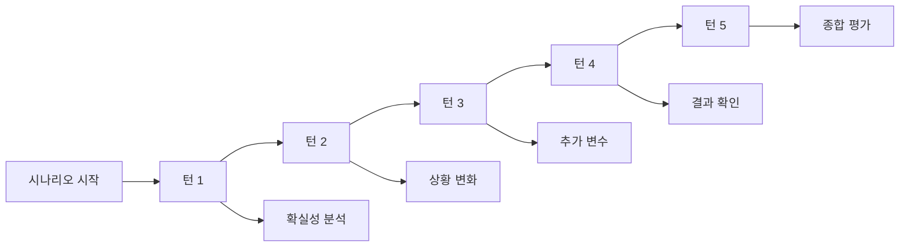

---

## 🏢 업종별 대표 기업 완전 가이드

### 📊 1. 반도체 업종 (메모리/시스템반도체)

#### 대표 기업 5개

| 기업명 | 시총 | 주요 제품 | 변동성 | 투자 비중 | 핵심 포인트 |
|--------|------|----------|--------|----------|------------|
| **삼성전자** | 400조 | DRAM, NAND, HBM, 파운드리 | ±15% | 40-60% | 🔵 메모리 1위, AI 반도체 |
| **SK하이닉스** | 80조 | DRAM, NAND, HBM3E | ±18% | 40-60% | 🔵 HBM 독점, AI 수혜 |
| **삼성SDI** | 35조 | 2차전지, 반도체 소재 | ±20% | 30-50% | 🟢 전기차 배터리 |
| **DB하이텍** | 3조 | 파운드리 (전력반도체) | ±25% | 20-30% | 🟡 중소형주, 전력반도체 |
| **테스** | 1.5조 | 반도체 테스트 장비 | ±30% | 10-20% | 🟡 장비주, 수혜주 |

**💡 반도체 투자 핵심:**
```
✅ 체크 포인트:
- 메모리 가격 추이 (DRAMeXchange)
- HBM 수요 (AI 데이터센터)
- 반도체 사이클 (재고, 가동률)
- 환율 (달러 강세 = 수출 유리)
- 중국 견제 (반도체법, 수출 규제)

📊 사이클 특성:
- 호황기: 2-3년 (가격 상승, 수익 폭증)
- 불황기: 1-2년 (가격 하락, 적자 전환)
- 현재 (2024): AI 반도체 슈퍼사이클 시작

🎯 투자 전략:
- 불황기 저점 매수 (PBR 1배 이하)
- 호황기 초기 진입 (실적 턴어라운드)
- HBM/AI 수혜주 우선 (SK하이닉스)
```

---

### 🤖 2. 로봇 업종

#### 대표 기업 5개

| 기업명 | 시총 | 주요 제품 | 변동성 | 투자 비중 | 핵심 포인트 |
|--------|------|----------|--------|----------|------------|
| **레인보우로보틱스** | 3조 | 휴머노이드, 협동로봇 | ±50% | 5-10% | 🔴 테마주, 극고위험 |
| **두산로보틱스** | 2조 | 협동로봇 (산업용) | ±40% | 10-20% | 🟠 실적 개선 중 |
| **현대로보틱스** | 1.5조 | 산업용 로봇 | ±35% | 10-20% | 🟠 현대차 계열 |
| **로보스타** | 0.8조 | 서빙로봇, 물류로봇 | ±45% | 5-15% | 🔴 소형주, 테마 |
| **유진로봇** | 0.5조 | 청소로봇, 방역로봇 | ±50% | 5-10% | 🔴 초소형주, 극위험 |

**💡 로봇 투자 핵심:**
```
⚠️ 경고: 대부분 테마주, 극도로 위험!

✅ 체크 포인트:
- 테마 강도 (테슬라 옵티머스, 글로벌 트렌드)
- 실제 수주 (대형사 계약 여부)
- 실적 (대부분 적자, 매출 100억 수준)
- 개인 비중 (80% 이상 = 위험 신호)
- RSI (80 이상 = 절대 진입 금지)

📊 테마주 특성:
- 급등: 1-2주 만에 +50-100%
- 급락: 1-2주 만에 -30-50%
- 유동성: 매우 부족 (체결 어려움)

🎯 투자 전략:
- 투자 비중: 5-10%만 (복권 수준)
- 진입: 테마 초기만 (언론 보도 시작)
- 익절: +30-50% 도달 시 즉시
- 손절: -25% 도달 시 무조건
- 추격 절대 금지: RSI 80 이상 관망
```

---

### 🚀 3. 방산 업종

#### 대표 기업 5개

| 기업명 | 시총 | 주요 제품 | 변동성 | 투자 비중 | 핵심 포인트 |
|--------|------|----------|--------|----------|------------|
| **한화에어로스페이스** | 10조 | K9 자주포, 항공엔진 | ±25% | 30-40% | 🟢 방산 1위, 수주 풍부 |
| **LIG넥스원** | 5조 | 미사일, 레이더 | ±30% | 20-30% | 🟢 유도무기 전문 |
| **현대로템** | 3조 | K2 전차, 장갑차 | ±28% | 20-30% | 🟢 지상무기 전문 |
| **한화시스템** | 2.5조 | 전투기 부품, 위성 | ±30% | 15-25% | 🟡 항공우주 |
| **풍산** | 2조 | 탄약, 방산 소재 | ±25% | 15-25% | 🟡 탄약 전문 |

**💡 방산 투자 핵심:**
```
✅ 체크 포인트:
- 수주 발표 (1조원 이상 대규모)
- 수주 잔고 (연매출 3배 이상 = 가시성)
- 지정학 리스크 (전쟁, 긴장 고조 = 수요 증가)
- 정치적 변수 (정권 교체, 외교 관계)
- 원가 관리 (원자재, 환율 영향)

📊 수주 사이클:
- 루머 단계: 언론 보도 시작 (+5-10%)
- 협상 단계: 계약 임박 (+10-20%)
- 확정 단계: 공식 발표 (+20-30%)
- 소화 단계: 실적 반영 (안정화)

🎯 투자 전략:
- 진입: 루머 단계 (언론 보도 시작)
- 익절: 공식 발표 후 +20% (50% 익절)
- 장기: 수주 잔고 풍부 시 보유
- 주의: 계약 불발 시 -10-15% 급락
- 핵심: "루머에 사서 뉴스에 팔아라"
```

---

### 🏭 4. 철강/중공업 업종

#### 대표 기업 5개

| 기업명 | 시총 | 주요 제품 | 변동성 | 투자 비중 | 핵심 포인트 |
|--------|------|----------|--------|----------|------------|
| **POSCO홀딩스** | 30조 | 철강, 2차전지 소재 | ±15% | 30-50% | 🔵 철강 1위, 배당 3% |
| **현대제철** | 8조 | 철강, 자동차 강판 | ±18% | 20-30% | 🟢 현대차 계열 |
| **고려아연** | 7조 | 아연, 비철금속 | ±20% | 20-30% | 🟢 비철금속 1위 |
| **현대중공업** | 15조 | 조선, 해양플랜트 | ±22% | 20-30% | 🟢 조선 1위 |
| **두산에너빌리티** | 10조 | 발전설비, 원자력 | ±25% | 20-30% | 🟢 원전 수혜 |

**💡 철강/중공업 투자 핵심:**
```
✅ 체크 포인트:
- 철강 가격 (중국 철강 가격, 원자재)
- 건설/자동차 경기 (수요 업종)
- 중국 생산량 (공급 과잉 여부)
- 환율 (수출 비중 높음)
- 원자재 가격 (철광석, 석탄)

📊 경기 민감 특성:
- 호황기: 건설/자동차 호황 시
- 불황기: 경기 침체 시 급락
- 배당: 안정적 (3-4% 수준)

🎯 투자 전략:
- 진입: 경기 회복 초기 (저PBR)
- 배당: 배당 기준일 전 매수
- 리스크: 중국 경기 영향 큼
- 장기: 안정적 배당주로 활용
```

---

### ⚡ 5. 에너지 업종 (전력/신재생)

#### 대표 기업 5개

| 기업명 | 시총 | 주요 사업 | 변동성 | 투자 비중 | 핵심 포인트 |
|--------|------|----------|--------|----------|------------|
| **한국전력** | 25조 | 전력 공급 (독점) | ±15% | 30-40% | 🔵 전력 독점, 배당 |
| **한국가스공사** | 10조 | 가스 공급 (독점) | ±18% | 20-30% | 🟢 가스 독점 |
| **SK E&S** | 8조 | LNG, 수소, 신재생 | ±20% | 20-30% | 🟢 수소 경제 |
| **한화솔루션** | 7조 | 태양광, 2차전지 | ±25% | 20-30% | 🟢 신재생 에너지 |
| **OCI** | 3조 | 폴리실리콘 (태양광) | ±30% | 15-25% | 🟡 태양광 소재 |

**💡 에너지 투자 핵심:**
```
✅ 체크 포인트:
- 전기료 정책 (한전 수익성)
- 유가/가스 가격 (원자재)
- 신재생 에너지 정책 (정부 지원)
- 원전 정책 (원전 재개 여부)
- 탄소중립 정책 (RE100, ESG)

📊 정책주 특성:
- 정부 정책에 민감
- 전기료 인상 = 한전 수익 개선
- 신재생 지원 = 태양광/풍력 수혜
- 원전 재개 = 원전 관련주 급등

🎯 투자 전략:
- 한전: 전기료 인상 기대 시 매수
- 신재생: 정부 정책 발표 시 매수
- 배당: 한전/가스공사 배당 매력
- 리스크: 정책 변화에 민감
```

---

### 🔋 6. 2차전지 업종

#### 대표 기업 5개

| 기업명 | 시총 | 주요 제품 | 변동성 | 투자 비중 | 핵심 포인트 |
|--------|------|----------|--------|----------|------------|
| **LG에너지솔루션** | 100조 | 전기차 배터리 | ±20% | 30-50% | 🔵 배터리 2위 |
| **삼성SDI** | 35조 | 전기차 배터리 | ±20% | 30-40% | 🔵 배터리 3위 |
| **에코프로비엠** | 15조 | 양극재 (NCM) | ±30% | 20-30% | 🟠 고변동성 |
| **포스코퓨처엠** | 12조 | 양극재, 음극재 | ±28% | 20-30% | 🟠 POSCO 계열 |
| **엘앤에프** | 8조 | 양극재 | ±30% | 15-25% | 🟠 중형주 |

**💡 2차전지 투자 핵심:**
```
✅ 체크 포인트:
- 전기차 판매량 (테슬라, BYD)
- 리튬/니켈 가격 (원자재)
- 수주 잔고 (가시성)
- IRA 법안 (미국 보조금)
- 중국 정책 (보조금, 규제)

📊 고변동성 특성:
- 테마주 성격 강함
- 급등락 반복 (±30%)
- 개인 투자자 주도
- 원자재 가격 민감

🎯 투자 전략:
- 진입: 급락 후 과매도 (RSI 30)
- 익절: +30-50% 빠른 익절
- 손절: -15% 엄격한 손절
- 주의: 추격 매수 절대 금지
- 핵심: 타이밍이 전부
```

---

### 💊 7. 바이오/제약 업종

#### 대표 기업 5개

| 기업명 | 시총 | 주요 제품 | 변동성 | 투자 비중 | 핵심 포인트 |
|--------|------|----------|--------|----------|------------|
| **셀트리온** | 30조 | 바이오시밀러 | ±25% | 20-40% | 🟢 바이오 1위 |
| **삼성바이오로직스** | 70조 | CMO (위탁생산) | ±20% | 30-40% | 🔵 CMO 세계 1위 |
| **한미약품** | 5조 | 신약 개발 | ±30% | 15-25% | 🟡 신약 파이프라인 |
| **유한양행** | 3조 | 제약 (오리지널) | ±20% | 15-25% | 🟡 안정적 실적 |
| **SK바이오팜** | 4조 | 신약 (뇌전증) | ±35% | 10-20% | 🟡 신약 상용화 |

**💡 바이오 투자 핵심:**
```
✅ 체크 포인트:
- 임상 결과 (1상/2상/3상)
- FDA 승인 (신약 허가)
- 특허 소송 (바이오시밀러)
- 파이프라인 (신약 후보)
- 기술 수출 (라이센스 아웃)

📊 고위험 고수익:
- 임상 성공 = +50-100% 급등
- 임상 실패 = -30-50% 급락
- 특허 소송 승소 = +30% 상승
- 특허 소송 패소 = -20% 하락

🎯 투자 전략:
- 진입: 임상 결과 전 (기대감)
- 분산: 여러 종목 분산 (리스크)
- 장기: 6-12개월 투자
- 손절: -15% 엄격
- 핵심: 인내심 필요
```

---

### 🎮 8. 게임/엔터 업종

#### 대표 기업 5개

| 기업명 | 시총 | 주요 IP | 변동성 | 투자 비중 | 핵심 포인트 |
|--------|------|---------|--------|----------|------------|
| **크래프톤** | 15조 | 배틀그라운드 | ±40% | 10-30% | 🟠 글로벌 IP |
| **넷마블** | 5조 | 리니지2M | ±35% | 10-25% | 🟡 중국 리스크 |
| **엔씨소프트** | 8조 | 리니지, 아이온 | ±30% | 15-25% | 🟡 MMORPG 강자 |
| **넥슨** | 20조 | 메이플스토리 | ±25% | 20-30% | 🟢 안정적 IP |
| **펄어비스** | 3조 | 검은사막 | ±40% | 10-20% | 🟡 글로벌 진출 |

**💡 게임 투자 핵심:**
```
✅ 체크 포인트:
- 신작 출시 (CBT 반응)
- MAU (월간 활성 사용자)
- 매출 순위 (앱스토어/구글)
- 중국 판호 (승인 여부)
- 메타크리틱 점수 (평가)

📊 신작 의존도:
- 신작 성공 = +50-100% 급등
- 신작 실패 = -30-50% 급락
- 기존 IP 매출 감소 추세
- 중국 매출 비중 30-50%

🎯 투자 전략:
- 진입: CBT 성공 확인 후
- 익절: 출시 후 +30% 빠른 익절
- 손절: -20% 엄격
- 리스크: 중국 판호 지연
- 핵심: 신작이 전부
```

---

### 🚗 9. 자동차 업종

#### 대표 기업 5개

| 기업명 | 시총 | 주요 제품 | 변동성 | 투자 비중 | 핵심 포인트 |
|--------|------|----------|--------|----------|------------|
| **현대차** | 45조 | 완성차, 전기차 | ±12% | 40-50% | 🔵 자동차 1위, 배당 |
| **기아** | 30조 | 완성차, 전기차 | ±15% | 30-40% | 🔵 현대차 계열 |
| **현대모비스** | 25조 | 자동차 부품 | ±15% | 30-40% | 🔵 부품 1위 |
| **LG전자** | 20조 | 전장부품, 가전 | ±18% | 20-30% | 🟢 전장 사업 |
| **만도** | 3조 | 자율주행 부품 | ±25% | 15-25% | 🟡 자율주행 |

**💡 자동차 투자 핵심:**
```
✅ 체크 포인트:
- 전기차 판매량 (아이오닉)
- 환율 (수출 비중 70%)
- 원자재 가격 (철강, 배터리)
- IRA 법안 (미국 보조금)
- 자율주행 기술 (레벨 3-4)

📊 안정적 대형주:
- 변동성 낮음 (±12%)
- 배당 매력 (3-4%)
- 저PER (5-7배)
- 외국인 비중 높음

🎯 투자 전략:
- 진입: 조정 시 매수 (저PBR)
- 배당: 배당 기준일 전
- 장기: 6-12개월 보유
- 안정: 포트폴리오 40-50%
- 핵심: 안정적 수익
```

---

### 💻 10. IT/플랫폼 업종

#### 대표 기업 5개

| 기업명 | 시총 | 주요 사업 | 변동성 | 투자 비중 | 핵심 포인트 |
|--------|------|----------|--------|----------|------------|
| **네이버** | 35조 | 검색, 커머스, 핀테크 | ±20% | 30-50% | 🔵 플랫폼 1위 |
| **카카오** | 25조 | 메신저, 모빌리티 | ±20% | 30-40% | 🔵 메신저 독점 |
| **쿠팡** | 40조 | 이커머스 | ±25% | 20-30% | 🟢 물류 혁신 |
| **배달의민족** | 15조 | 배달 플랫폼 | ±30% | 15-25% | 🟡 배달 1위 |
| **토스** | 10조 | 핀테크 | ±35% | 10-20% | 🟡 금융 플랫폼 |

**💡 IT/플랫폼 투자 핵심:**
```
✅ 체크 포인트:
- MAU 성장 (사용자 증가)
- 광고 매출 (수익성)
- 규제 리스크 (공정위)
- 신사업 진척 (AI, 메타버스)
- 경쟁 심화 (시장 점유율)

📊 규제 민감:
- 과징금 = -10-20% 급락
- 수수료 상한제 = 수익성 악화
- 독점 규제 = 사업 제약
- 하지만 플랫폼 지배력 강함

🎯 투자 전략:
- 진입: 규제 악재 소화 후
- 익절: +25-40%
- 손절: -12%
- 장기: 신사업 모멘텀
- 핵심: 악재는 기회
```

---

## 🏢 기업별 특성 매트릭스 (확장판)

### 완전 비교표 (30개 기업)

| 기업명 | 시총 | 업종 | 변동성 | 적정<br/>투자비중 | 손절선 | 익절<br/>목표 | 투자<br/>기간 | 외국인<br/>비중 | 배당<br/>수익률 |
|--------|------|------|--------|---------------|--------|----------|----------|------------|------------|
| **삼성전자** | 400조 | 반도체 | ±15% | 40-60% | -10% | +20-30% | 3-6개월 | 55% | 2.5% |
| **SK하이닉스** | 80조 | 반도체 | ±18% | 40-60% | -12% | +25-35% | 3-6개월 | 52% | 1.8% |
| **삼성SDI** | 35조 | 2차전지 | ±20% | 30-50% | -12% | +30-50% | 3-6개월 | 48% | 1.2% |
| **DB하이텍** | 3조 | 반도체 | ±25% | 20-30% | -15% | +30-50% | 3-6개월 | 30% | 1.5% |
| **테스** | 1.5조 | 반도체장비 | ±30% | 10-20% | -20% | +40-60% | 3-6개월 | 25% | 0.8% |
| **레인보우로보틱스** | 3조 | 로봇 | ±50% | 5-10% | -25% | +100%+ | 3-6개월 | 15% | 0% |
| **두산로보틱스** | 2조 | 로봇 | ±40% | 10-20% | -20% | +80%+ | 3-6개월 | 20% | 0% |
| **현대로보틱스** | 1.5조 | 로봇 | ±35% | 10-20% | -20% | +60%+ | 3-6개월 | 18% | 0.5% |
| **한화에어로** | 10조 | 방산 | ±25% | 30-40% | -15% | +30-50% | 6-12개월 | 30% | 1.5% |
| **LIG넥스원** | 5조 | 방산 | ±30% | 20-30% | -15% | +35-60% | 6-12개월 | 28% | 1.2% |
| **현대로템** | 3조 | 방산 | ±28% | 20-30% | -15% | +30-50% | 6-12개월 | 25% | 1.8% |
| **POSCO홀딩스** | 30조 | 철강 | ±15% | 30-50% | -10% | +20-30% | 6-12개월 | 40% | 3.2% |
| **현대제철** | 8조 | 철강 | ±18% | 20-30% | -12% | +25-40% | 6-12개월 | 35% | 2.8% |
| **현대중공업** | 15조 | 조선 | ±22% | 20-30% | -15% | +30-50% | 6-12개월 | 32% | 2.5% |
| **한국전력** | 25조 | 전력 | ±15% | 30-40% | -10% | +20-35% | 6-12개월 | 45% | 2.0% |
| **SK E&S** | 8조 | 에너지 | ±20% | 20-30% | -12% | +25-40% | 6-12개월 | 35% | 1.5% |
| **한화솔루션** | 7조 | 신재생 | ±25% | 20-30% | -15% | +30-50% | 6-12개월 | 30% | 1.0% |
| **LG에너지솔루션** | 100조 | 2차전지 | ±20% | 30-50% | -12% | +30-50% | 3-9개월 | 42% | 0.5% |
| **에코프로비엠** | 15조 | 2차전지 | ±30% | 20-30% | -15% | +40-80% | 3-9개월 | 25% | 0.2% |
| **포스코퓨처엠** | 12조 | 2차전지 | ±28% | 20-30% | -15% | +35-70% | 3-9개월 | 28% | 0.3% |
| **셀트리온** | 30조 | 바이오 | ±25% | 20-40% | -15% | +30-60% | 6-12개월 | 40% | 0.3% |
| **삼성바이오로직스** | 70조 | 바이오 | ±20% | 30-40% | -12% | +25-50% | 6-12개월 | 48% | 0.8% |
| **한미약품** | 5조 | 제약 | ±30% | 15-25% | -15% | +40-80% | 6-12개월 | 25% | 1.0% |
| **크래프톤** | 15조 | 게임 | ±40% | 10-30% | -20% | +50-100% | 3-6개월 | 25% | 0% |
| **넥슨** | 20조 | 게임 | ±25% | 20-30% | -15% | +30-60% | 3-6개월 | 35% | 1.5% |
| **현대차** | 45조 | 자동차 | ±12% | 40-50% | -8% | +15-25% | 6-12개월 | 35% | 3.5% |
| **기아** | 30조 | 자동차 | ±15% | 30-40% | -10% | +20-30% | 6-12개월 | 32% | 3.2% |
| **네이버** | 35조 | 플랫폼 | ±20% | 30-50% | -12% | +25-40% | 3-6개월 | 48% | 0.8% |
| **카카오** | 25조 | 플랫폼 | ±20% | 30-40% | -12% | +25-40% | 3-6개월 | 45% | 0.5% |
| **알체라** | 0.5조 | AI | ±60% | 5% | -30% | +150%+ | 6-12개월 | 10% | 0% |

### 투자 난이도별 분류

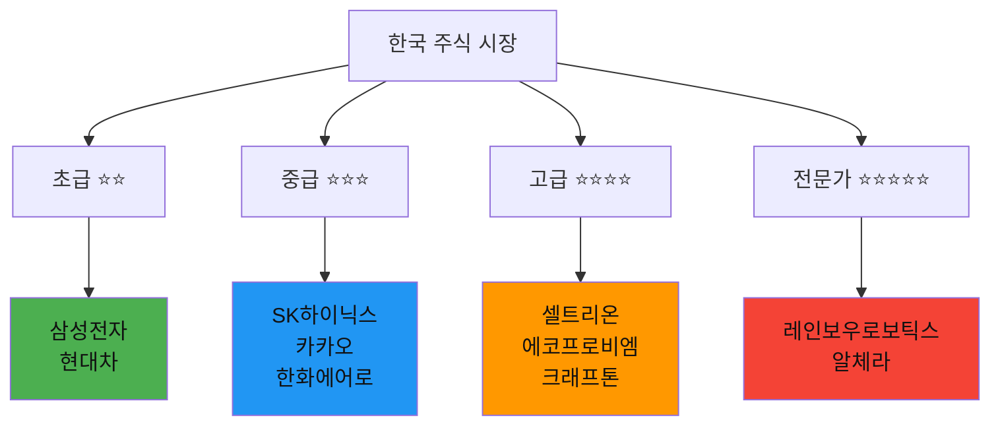

---

## 🎯 변동성별 투자 전략 도식화

### 변동성 구간별 전략 매트릭스

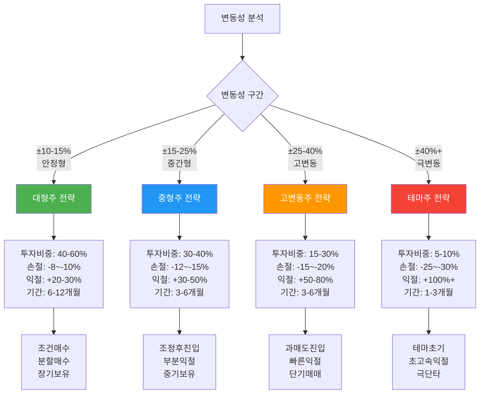

### 변동성별 조건부 투자 전략

#### 📊 안정형 (±10-15%): 삼성전자, 현대차

```
🎯 전략: 조건 매수 + 장기 보유

진입 조건:
├─ 조건 1: 20일 이평선 -5% 이하
├─ 조건 2: RSI 40 이하
├─ 조건 3: 외국인 순매수 전환
└─ 조건 4: 분기 실적 턴어라운드

투자 비중: 40-60%
분할 매수: 3회 (40% + 30% + 30%)

손절 조건:
├─ 조건 1: -10% 도달 시 무조건
├─ 조건 2: 실적 악화 시 -8%
└─ 조건 3: 외국인 대량 매도 시

익절 조건:
├─ 1차 익절: +15% 도달 시 50%
├─ 2차 익절: +25% 도달 시 30%
└─ 3차 익절: +35% 도달 시 나머지

💡 핵심: 인내심 + 부분 익절
```

#### 📊 중간형 (±15-25%): 카카오, SK하이닉스, 한화에어로

```
🎯 전략: 조정 후 진입 + 부분 익절

진입 조건:
├─ 조건 1: 급락 후 -15% 조정
├─ 조건 2: RSI 30-35 구간
├─ 조건 3: 거래량 급증 (200%+)
└─ 조건 4: 악재 소화 확인

투자 비중: 30-40%
분할 매수: 2회 (60% + 40%)

손절 조건:
├─ 조건 1: -12% 도달 시 무조건
├─ 조건 2: 추가 악재 발생 시 -10%
└─ 조건 3: 지지선 이탈 시

익절 조건:
├─ 1차 익절: +25% 도달 시 50%
├─ 2차 익절: +40% 도달 시 30%
└─ 3차 익절: +60% 도달 시 나머지

💡 핵심: 악재는 기회 + 빠른 대응
```

#### 📊 고변동형 (±25-40%): 에코프로비엠, 셀트리온, 크래프톤

```
🎯 전략: 과매도 진입 + 빠른 익절

진입 조건:
├─ 조건 1: 급락 후 RSI 30 이하
├─ 조건 2: 거래량 폭증 (300%+)
├─ 조건 3: 지지선 터치
└─ 조건 4: 공포 극대화 시점

투자 비중: 15-30%
분할 매수: 2-3회 (50% + 30% + 20%)

손절 조건:
├─ 조건 1: -15% 도달 시 무조건
├─ 조건 2: 지지선 붕괴 시 -12%
└─ 조건 3: 추가 악재 시 즉시

익절 조건:
├─ 1차 익절: +30% 도달 시 50%
├─ 2차 익절: +50% 도달 시 30%
└─ 3차 익절: +80% 도달 시 나머지

💡 핵심: 타이밍이 전부 + 욕심 금물
```

#### 📊 극변동형 (±40%+): 레인보우로보틱스, 알체라

```
🎯 전략: 테마 초기 진입 + 초고속 익절

진입 조건:
├─ 조건 1: 테마 발생 초기 (언론 보도 시작)
├─ 조건 2: RSI 70 이하 (과열 전)
├─ 조건 3: 거래량 폭증 (500%+)
└─ 조건 4: 수주 또는 호재 발표

투자 비중: 5-10% (극소량)
분할 매수: 1회 (일괄 진입)

손절 조건:
├─ 조건 1: -25% 도달 시 무조건
├─ 조건 2: 테마 소멸 시 즉시
└─ 조건 3: RSI 급락 시 (70→50)

익절 조건:
├─ 1차 익절: +50% 도달 시 50%
├─ 2차 익절: +100% 도달 시 전량
└─ 추격 절대 금지: RSI 80+ 관망

💡 핵심: 복권 수준 + 초고속 익절
```

---

## 🎯 조건부 투자 전략 완전 가이드

### 조건 주문 활용 전략

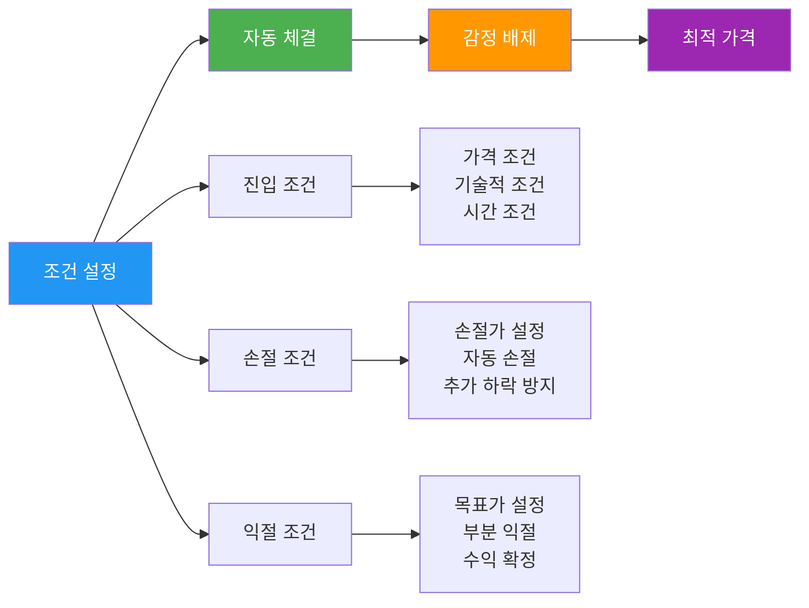

### 조건부 매수 전략 5가지

#### 1️⃣ 조건 매수: 이동평균선 돌파

```
📊 조건 설정:
- 5일 이평선 > 20일 이평선 (골든크로스)
- 현재가 > 20일 이평선
- 거래량 > 평균 거래량 150%

🎯 적용 종목: 삼성전자, 현대차 (대형주)

💰 투자 비중: 40-50%

📈 예시:
삼성전자 현재가: 72,000원
20일 이평선: 70,000원
조건가: 70,500원 (이평선 +0.7%)
→ 조건 충족 시 자동 매수
```

#### 2️⃣ 조건 매수: RSI 과매도 구간

```
📊 조건 설정:
- RSI(14) < 30 (과매도)
- 전일 대비 -5% 이상 하락
- 거래량 > 평균 거래량 200%

🎯 적용 종목: 에코프로비엠, 카카오 (고변동주)

💰 투자 비중: 20-30%

📈 예시:
에코프로비엠 현재가: 150,000원
RSI: 28 (과매도)
조건가: 145,000원 (현재가 -3.3%)
→ RSI 30 이하 + 추가 하락 시 매수
```

#### 3️⃣ 조건 매수: 지지선 반등

```
📊 조건 설정:
- 52주 최저가 +5% 터치
- RSI 35 이하
- 외국인 순매수 전환

🎯 적용 종목: 셀트리온, SK하이닉스 (중대형주)

💰 투자 비중: 30-40%

📈 예시:
셀트리온 52주 최저가: 180,000원
조건가: 189,000원 (최저가 +5%)
→ 지지선 터치 + 반등 시 매수
```

#### 4️⃣ 조건 매수: 실적 발표 전 선반영

```
📊 조건 설정:
- 실적 발표 D-7
- 컨센서스 대비 +20% 예상
- 외국인 순매수 지속

🎯 적용 종목: SK하이닉스, 한화에어로 (실적 민감주)

💰 투자 비중: 40-50%

📈 예시:
SK하이닉스 실적 발표: 2024.10.25
조건 매수일: 2024.10.18 (D-7)
조건가: 현재가 (시장가)
→ D-7 시점 자동 매수
```

#### 5️⃣ 조건 매수: 악재 소화 후 반등

```
📊 조건 설정:
- 악재 발표 후 3일 경과
- RSI 30-40 구간
- 거래량 감소 (안정화)

🎯 적용 종목: 카카오, 네이버 (규제 리스크주)

💰 투자 비중: 30-40%

📈 예시:
카카오 과징금 발표: 2024.09.01
조건 매수일: 2024.09.04 (D+3)
조건가: 52주 최저가 +3%
→ 악재 소화 + 안정화 시 매수
```

### 조건부 손절 전략 3가지

#### 1️⃣ 고정 손절: -10% 무조건

```
📊 조건 설정:
- 매수가 대비 -10% 도달 시
- 무조건 자동 손절
- 예외 없음

🎯 적용 종목: 모든 종목 (기본 원칙)

📉 예시:
삼성전자 매수가: 72,000원
손절가: 64,800원 (-10%)
→ 64,800원 도달 시 자동 손절
```

#### 2️⃣ 추적 손절: 수익 보호

```
📊 조건 설정:
- 최고가 대비 -5% 하락 시
- 수익 구간에서만 적용
- 수익 보호 목적

🎯 적용 종목: 고변동주 (에코프로비엠, 크래프톤)

📉 예시:
에코프로비엠 매수가: 150,000원
최고가: 200,000원 (+33%)
추적 손절가: 190,000원 (최고가 -5%)
→ 190,000원 이탈 시 손절 (+26% 확정)
```

#### 3️⃣ 시간 손절: 장기 보유 제한

```
📊 조건 설정:
- 매수 후 3개월 경과
- 수익률 +5% 미만
- 자동 청산

🎯 적용 종목: 테마주 (레인보우로보틱스, 알체라)

📉 예시:
레인보우로보틱스 매수일: 2024.07.01
매수가: 50,000원
현재가 (2024.10.01): 52,000원 (+4%)
→ 3개월 경과 + 수익 미미 → 자동 청산
```

### 조건부 익절 전략 3가지

#### 1️⃣ 부분 익절: 단계별 수익 확정

```
📊 조건 설정:
- 1차 익절: +20% 도달 시 50%
- 2차 익절: +35% 도달 시 30%
- 3차 익절: +50% 도달 시 나머지

🎯 적용 종목: 대형주 (삼성전자, 현대차)

📈 예시:
삼성전자 매수가: 72,000원
1차 익절가: 86,400원 (+20%) → 50% 매도
2차 익절가: 97,200원 (+35%) → 30% 매도
3차 익절가: 108,000원 (+50%) → 20% 매도
```

#### 2️⃣ 목표 익절: 목표가 도달 시 전량

```
📊 조건 설정:
- 목표가 도달 시 전량 매도
- 욕심 배제
- 수익 확정

🎯 적용 종목: 중형주 (카카오, 셀트리온)

📈 예시:
카카오 매수가: 50,000원
목표가: 65,000원 (+30%)
→ 65,000원 도달 시 전량 매도
```

#### 3️⃣ 추적 익절: 추세 추종

```
📊 조건 설정:
- 최고가 대비 -8% 하락 시
- 수익 +30% 이상 구간
- 추세 전환 시 매도

🎯 적용 종목: 고변동주 (에코프로비엠, 크래프톤)

📈 예시:
에코프로비엠 매수가: 150,000원
최고가: 250,000원 (+66%)
추적 익절가: 230,000원 (최고가 -8%)
→ 230,000원 이탈 시 전량 매도 (+53% 확정)
```

---

## 📊 시나리오 1: 삼성전자 - 반도체 슈퍼사이클

### 시나리오 마인드맵

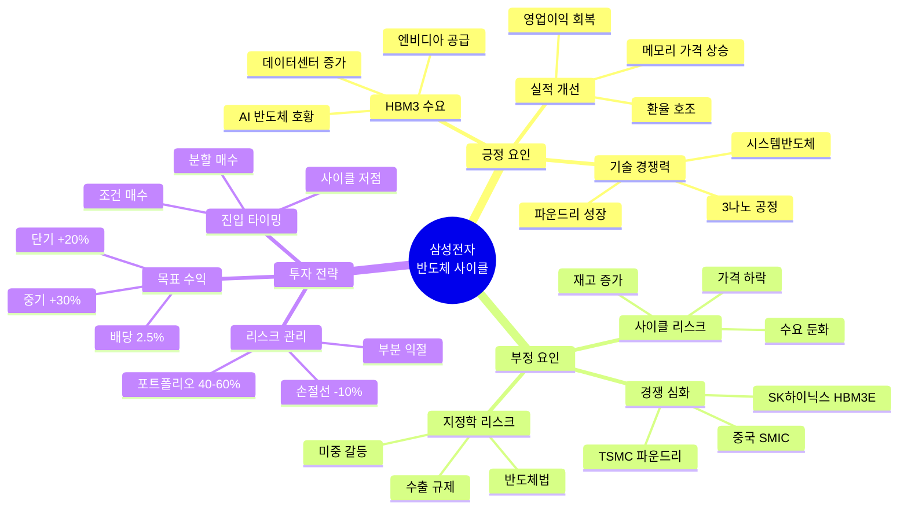

### 핵심 체크포인트

| 체크 항목 | 긍정 신호 | 부정 신호 | 확인 방법 |
|----------|----------|----------|----------|
| **HBM 수요** | 엔비디아 공급 계약 | 경쟁사 선점 | 공시, 뉴스 |
| **메모리 가격** | DRAM 가격 상승 | 재고 증가 | DRAMeXchange |
| **분기 실적** | 영업이익 증가 | 컨센서스 미달 | 실적 발표 |
| **환율** | 달러 강세 (1,300원+) | 원화 강세 | 환율 시세 |
| **외국인 수급** | 순매수 지속 | 순매도 전환 | HTS/MTS |

### 투자 전략 요약

```
🎯 최적 전략: 조건 매수 + 부분 익절

1단계: 조정 대기
- 조건가: 20일 이평선 -5%
- 투자 비중: 50%

2단계: 부분 익절
- 1차 익절: +15% 도달 시 50%
- 2차 익절: +25% 도달 시 나머지

3단계: 리스크 관리
- 손절선: -10%
- 재진입: 지지선 확인 후

💡 핵심: 대형주는 인내심이 수익
```

### 5턴 시나리오 상세

#### 🎮 턴 1: 반도체 사이클 저점 (확실성: 65점)

**📊 시장 상황**
- 삼성전자 주가: 72,000원
- 전일 대비: -2.5%
- 메모리 가격: 하락 지속 (DRAM -15% YoY)
- 반도체 재고: 높은 수준 (가동률 70%)

**📈 기술적 분석**
- 20일 이평선: 74,000원 (저항)
- 60일 이평선: 76,000원 (저항)
- RSI: 42 (중립)
- 거래량: 평균 대비 85%

**💰 재무 데이터**
- 분기 영업이익: 6,000억원 (전년 대비 -80%)
- PER: 15배
- PBR: 1.2배
- 배당수익률: 2.5%

**📰 뉴스/이벤트**
- HBM3 엔비디아 공급 계약 추진 중
- 메모리 가격 하락세 지속
- 중국 SMIC 경쟁 심화

**🌍 외국인/기관 동향**
- 외국인: 3일 연속 순매도 (-5,000억)
- 기관: 순매수 (+2,000억)
- 개인: 순매수 (+3,000억)

**🎯 신호 분석**
```
긍정 신호 (+35점):
+ HBM3 공급 계약 기대 (+15)
+ 저PBR (1.2배) (+10)
+ 배당 매력 2.5% (+10)

부정 신호 (-30점):
- 메모리 가격 하락 (-15)
- 실적 악화 (-10)
- 외국인 매도 (-5)

중립 신호 (0점):
= RSI 중립 (0)

총점: +5점 (확실성: 52점)
판단: 신중 관망
```

**💭 플레이어 선택지**
1. 즉시 매수 (40% 투자)
2. 조건 매수 설정 (20일 이평선 -5%)
3. 추가 하락 대기 (-10% 더)
4. 관망

**🤖 AI 조언**
```
추천: 선택지 2 (조건 매수)

이유:
- 현재 확실성 52점 (신중 구간)
- 사이클 저점 근접하지만 아직 확신 부족
- 조건 매수로 최적 가격 포착 가능

조건 매수 설정:
- 조건가: 70,300원 (20일 이평선 -5%)
- 투자 비중: 40%
- 손절선: 63,300원 (-10%)

기대 시나리오:
- HBM3 계약 발표 시 +15-20% 상승
- 메모리 가격 반등 시 추가 상승
- 6개월 목표가: 90,000원 (+25%)

리스크:
- 메모리 가격 추가 하락 가능
- 실적 악화 지속 시 추가 조정
```

---

#### 🎮 턴 2: HBM3 공급 계약 발표 (확실성: 82점)

**📊 시장 상황**
- 삼성전자 주가: 78,000원 (+8.3%)
- 전일 대비: +5.2%
- HBM3 엔비디아 공급 계약 공식 발표
- 메모리 가격: 하락세 둔화

**📈 기술적 분석**
- 20일 이평선: 74,500원 (돌파)
- 60일 이평선: 76,000원 (돌파)
- RSI: 68 (강세)
- 거래량: 평균 대비 250% (급증)

**💰 재무 데이터**
- HBM3 예상 매출: 연 10조원
- 영업이익 개선 기대
- 목표 PER: 12배 (적정)

**📰 뉴스/이벤트**
- HBM3 엔비디아 독점 공급 (3년 계약)
- AI 반도체 슈퍼사이클 기대감
- 증권사 목표가 상향 (평균 95,000원)

**🌍 외국인/기관 동향**
- 외국인: 순매수 전환 (+8,000억)
- 기관: 순매수 (+3,000억)
- 개인: 순매수 (+5,000억)

**🎯 신호 분석**
```
긍정 신호 (+70점):
+ HBM3 독점 공급 (+30)
+ AI 반도체 슈퍼사이클 (+20)
+ 외국인 순매수 전환 (+10)
+ 기술적 돌파 (이평선) (+10)

부정 신호 (-10점):
- RSI 과열 우려 (68) (-5)
- 단기 급등 (+8%) (-5)

중립 신호 (0점):
= 메모리 가격 안정 (0)

총점: +60점 (확실성: 82점)
판단: 공격적 보유
```

**💭 플레이어 선택지**
1. 전량 보유 (추가 상승 기대)
2. 50% 부분 익절 (+8%)
3. 추가 매수 (20% 더)
4. 전량 매도 (수익 확정)

**🤖 AI 조언**
```
추천: 선택지 1 (전량 보유)

이유:
- 확실성 82점 (공격적 구간)
- HBM3 계약은 장기 모멘텀
- 목표가 90,000원까지 +15% 추가 상승 여력

보유 전략:
- 현재 수익률: +8.3%
- 목표 수익률: +25% (90,000원)
- 추적 손절: 최고가 대비 -8%

부분 익절 고려:
- 85,000원 도달 시 30% 익절
- 90,000원 도달 시 40% 익절
- 나머지 장기 보유

리스크 관리:
- 추적 손절가: 71,760원 (현재가 -8%)
- RSI 80 돌파 시 경계
```

---

#### 🎮 턴 3: 메모리 가격 반등 (확실성: 78점)

**📊 시장 상황**
- 삼성전자 주가: 85,000원 (+18.1%)
- 전일 대비: +2.1%
- DRAM 가격 반등 시작 (+5% MoM)
- 반도체 재고 감소 (가동률 85%)

**📈 기술적 분석**
- 20일 이평선: 78,000원 (지지)
- 60일 이평선: 77,000원 (지지)
- RSI: 72 (과열 초입)
- 거래량: 평균 대비 180%

**💰 재무 데이터**
- 다음 분기 영업이익 예상: 3조원 (+400%)
- 컨센서스 대비 +20% 상회 전망
- PER: 10배 (저평가)

**📰 뉴스/이벤트**
- DRAM 가격 반등 시작
- AI 데이터센터 투자 급증
- 파운드리 3나노 수율 개선

**🌍 외국인/기관 동향**
- 외국인: 순매수 지속 (+5,000억)
- 기관: 순매수 (+2,000억)
- 개인: 차익 실현 (-3,000억)

**🎯 신호 분석**
```
긍정 신호 (+65점):
+ DRAM 가격 반등 (+20)
+ 실적 턴어라운드 (+20)
+ 외국인 순매수 지속 (+10)
+ 저PER (10배) (+15)

부정 신호 (-20점):
- RSI 과열 (72) (-10)
- 단기 급등 (+18%) (-10)

중립 신호 (0점):
= 개인 차익 실현 (0)

총점: +45점 (확실성: 73점)
판단: 신중 보유
```

**💭 플레이어 선택지**
1. 전량 보유 (목표가까지)
2. 50% 부분 익절 (+18%)
3. 30% 부분 익절 (리스크 관리)
4. 전량 매도 (수익 확정)

**🤖 AI 조언**
```
추천: 선택지 3 (30% 부분 익절)

이유:
- 확실성 73점 (신중 구간으로 하락)
- RSI 72 (과열 초입)
- 수익 일부 확정 + 추가 상승 기회 유지

부분 익절 전략:
- 30% 익절: +18% 확정
- 70% 보유: 목표가 90,000원까지

남은 포지션 관리:
- 목표가: 90,000원 (+25%)
- 추적 손절: 78,200원 (현재가 -8%)
- 2차 익절: 90,000원 도달 시 50%

리스크:
- RSI 80 돌파 시 추가 익절 고려
- 메모리 가격 재하락 시 손절 준비
```

---

#### 🎮 턴 4: 목표가 도달 (확실성: 70점)

**📊 시장 상황**
- 삼성전자 주가: 90,000원 (+25%)
- 전일 대비: +1.8%
- 목표가 도달
- 시장 과열 우려 증가

**📈 기술적 분석**
- 20일 이평선: 83,000원 (지지)
- 60일 이평선: 80,000원 (지지)
- RSI: 78 (과열)
- 거래량: 평균 대비 150%

**💰 재무 데이터**
- 분기 실적 발표 임박
- 컨센서스: 영업이익 3.5조원
- PER: 12배 (적정)

**📰 뉴스/이벤트**
- 증권사 목표가 추가 상향 (100,000원)
- 하지만 단기 과열 우려
- 차익 실현 물량 출회

**🌍 외국인/기관 동향**
- 외국인: 순매수 감소 (+1,000억)
- 기관: 순매도 전환 (-2,000억)
- 개인: 순매수 (+1,000억)

**🎯 신호 분석**
```
긍정 신호 (+50점):
+ 목표가 도달 (+15)
+ 실적 개선 지속 (+15)
+ 추가 목표가 상향 (+10)
+ 외국인 순매수 유지 (+10)

부정 신호 (-35점):
- RSI 과열 (78) (-15)
- 기관 순매도 전환 (-10)
- 단기 급등 (+25%) (-10)

중립 신호 (0점):
= 목표가 도달 (0)

총점: +15점 (확실성: 58점)
판단: 신중 익절
```

**💭 플레이어 선택지**
1. 전량 보유 (100,000원 기대)
2. 50% 익절 (수익 확정)
3. 70% 익절 (대부분 확정)
4. 전량 매도 (목표가 도달)

**🤖 AI 조언**
```
추천: 선택지 3 (70% 익절)

이유:
- 확실성 58점 (신중 구간)
- 목표가 도달 (원래 계획)
- RSI 과열 + 기관 매도 전환

익절 전략:
- 70% 익절: +25% 확정
- 30% 보유: 추가 상승 기회

최종 수익률 계산:
- 1차 익절 (턴3): 30% × +18% = +5.4%
- 2차 익절 (턴4): 70% × +25% = +17.5%
- 총 확정 수익: +22.9%
- 남은 포지션: 30%

남은 포지션 관리:
- 목표가: 100,000원 (+38%)
- 손절가: 82,800원 (현재가 -8%)
- 3차 익절: 100,000원 도달 시 전량

💡 핵심: 목표가 도달 시 대부분 익절이 정석
```

---

#### 🎮 턴 5: 실적 발표 후 조정 (확실성: 55점)

**📊 시장 상황**
- 삼성전자 주가: 87,000원 (+20.8%)
- 전일 대비: -3.3%
- 실적 발표: 컨센서스 부합 (서프라이즈 없음)
- 차익 실현 조정

**📈 기술적 분석**
- 20일 이평선: 85,000원 (지지 테스트)
- 60일 이평선: 82,000원 (지지)
- RSI: 62 (중립 회귀)
- 거래량: 평균 대비 200% (매도 물량)

**💰 재무 데이터**
- 분기 영업이익: 3.5조원 (컨센서스 부합)
- 다음 분기 가이던스: 보수적
- PER: 11배

**📰 뉴스/이벤트**
- 실적 발표 후 차익 실현
- 메모리 가격 상승세 둔화
- 단기 조정 후 재상승 전망

**🌍 외국인/기관 동향**
- 외국인: 순매도 (-3,000억)
- 기관: 순매도 (-2,000억)
- 개인: 순매수 (+5,000억)

**🎯 신호 분석**
```
긍정 신호 (+40점):
+ 실적 양호 (+15)
+ 장기 모멘텀 유지 (+15)
+ 조정은 재진입 기회 (+10)

부정 신호 (-35점):
- 외국인/기관 매도 (-15)
- 가이던스 보수적 (-10)
- 단기 조정 (-10)

중립 신호 (0점):
= RSI 중립 회귀 (0)

총점: +5점 (확실성: 52점)
판단: 신중 관망
```

**💭 플레이어 선택지**
1. 남은 30% 전량 매도
2. 남은 30% 보유
3. 추가 매수 (조정 기회)
4. 손절 후 재진입 대기

**🤖 AI 조언**
```
추천: 선택지 1 (남은 30% 전량 매도)

이유:
- 확실성 52점 (신중 구간)
- 실적 서프라이즈 없음
- 단기 조정 시작

최종 수익률:
- 1차 익절 (턴3): 30% × +18% = +5.4%
- 2차 익절 (턴4): 40% × +25% = +10.0%
- 3차 익절 (턴5): 30% × +20.8% = +6.2%
- 총 수익률: +21.6%

평가:
✅ 목표 수익률 +20% 달성
✅ 부분 익절로 리스크 관리 성공
✅ 조건 매수로 최적 가격 포착
⭐ 종합 평가: S등급

재진입 전략:
- 조정 -10% 시 (81,000원)
- RSI 40 이하
- 외국인 순매수 전환 시
```

---

## 📊 시나리오 2: 에코프로비엠 - 2차전지 급등락

### 시나리오 마인드맵

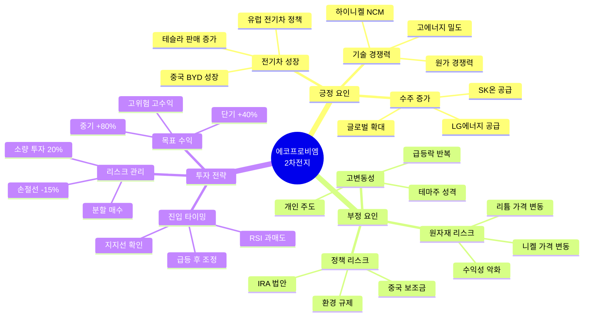

### 핵심 체크포인트

| 체크 항목 | 긍정 신호 | 부정 신호 | 확인 방법 |
|----------|----------|----------|----------|
| **전기차 판매** | 전년 대비 +30% | 성장 둔화 | 테슬라/BYD 실적 |
| **리튬 가격** | 안정적 유지 | 급락 (-20%) | LME 시세 |
| **수주 잔고** | 연매출 2배 이상 | 감소 추세 | 공시 |
| **RSI** | 30 이하 (과매도) | 80 이상 (과열) | HTS 차트 |
| **거래량** | 평균 대비 200%+ | 급감 (50% 이하) | HTS |

### 투자 전략 요약

```
🎯 최적 전략: 조정 후 진입 + 엄격한 손절

1단계: 급등 회피
- 절대 추격 매수 금지
- RSI 80 이상 관망
- 조정 -20% 대기

2단계: 과매도 진입
- 조건가: RSI 30 이하
- 투자 비중: 20-30%
- 분할 매수 (2-3회)

3단계: 빠른 익절
- 1차 익절: +30% 도달 시 50%
- 2차 익절: +50% 도달 시 나머지
- 욕심 금물

💡 핵심: 고변동성은 타이밍이 전부
```

### 5턴 시나리오 상세

#### 🎮 턴 1: 급등 후 폭락 (확실성: 35점)

**📊 시장 상황**
- 에코프로비엠 주가: 200,000원
- 전일 대비: -12.5%
- 전기차 판매 둔화 우려
- 리튬 가격 급락 (-20% MoM)

**📈 기술적 분석**
- 20일 이평선: 240,000원 (하향 이탈)
- 60일 이평선: 260,000원 (하향 이탈)
- RSI: 25 (극과매도)
- 거래량: 평균 대비 400% (공포 매도)

**💰 재무 데이터**
- 분기 매출: 8,000억원 (-15% QoQ)
- 영업이익률: 12% (마진 악화)
- PER: 20배 (고평가 논란)

**📰 뉴스/이벤트**
- 테슬라 판매량 감소 (-8%)
- 리튬 가격 폭락
- 증권사 목표가 하향 (평균 250,000원)

**🌍 외국인/기관 동향**
- 외국인: 대량 순매도 (-8,000억)
- 기관: 순매도 (-3,000억)
- 개인: 물타기 매수 (+11,000억)

**🎯 신호 분석**
```
긍정 신호 (+25점):
+ RSI 극과매도 (25) (+15)
+ 장기 성장성 유지 (+10)

부정 신호 (-60점):
- 리튬 가격 폭락 (-20)
- 전기차 판매 둔화 (-15)
- 외국인 대량 매도 (-15)
- 실적 악화 (-10)

중립 신호 (0점):
= 개인 매수 (역지표) (0)

총점: -35점 (확실성: 35점)
판단: 방어적 관망
```

**💭 플레이어 선택지**
1. 즉시 매수 (저가 매수)
2. 추가 하락 대기 (-10% 더)
3. 조건 매수 설정 (RSI 30 이하)
4. 완전 관망

**🤖 AI 조언**
```
추천: 선택지 2 (추가 하락 대기)

이유:
- 확실성 35점 (방어적 구간)
- 하락 추세 지속 가능
- 바닥 확인 필요

대기 전략:
- 목표가: 180,000원 (-10% 더)
- RSI: 20 이하 극과매도
- 거래량 감소 (안정화)

진입 조건:
- 리튬 가격 반등 확인
- 외국인 매도 소멸
- 지지선 형성 (180,000원)

⚠️ 경고:
- 고변동성 종목은 급락 시 추가 급락 가능
- 분할 매수 필수
- 투자 비중 20% 이하
```

---

#### 🎮 턴 2: 바닥 형성 (확실성: 68점)

**📊 시장 상황**
- 에코프로비엠 주가: 180,000원 (-10%)
- 전일 대비: +2.5%
- 리튬 가격 반등 시작 (+5%)
- 전기차 판매 회복 기대

**📈 기술적 분석**
- 20일 이평선: 220,000원 (하향)
- 60일 이평선: 250,000원 (하향)
- RSI: 32 (과매도 탈출)
- 거래량: 평균 대비 150% (안정화)

**💰 재무 데이터**
- 수주 잔고: 연매출 2배 유지
- 다음 분기 실적 개선 전망
- PER: 15배 (적정)

**📰 뉴스/이벤트**
- 리튬 가격 반등 시작
- LG에너지솔루션 추가 수주
- 중국 전기차 판매 회복

**🌍 외국인/기관 동향**
- 외국인: 순매도 감소 (-1,000억)
- 기관: 순매수 전환 (+2,000억)
- 개인: 순매수 (+3,000억)

**🎯 신호 분석**
```
긍정 신호 (+55점):
+ RSI 과매도 탈출 (+15)
+ 리튬 가격 반등 (+15)
+ 기관 순매수 전환 (+10)
+ 수주 잔고 안정 (+10)
+ 저PER (15배) (+5)

부정 신호 (-20점):
- 외국인 매도 지속 (-10)
- 이평선 하향 (-10)

중립 신호 (0점):
= 전기차 판매 회복 대기 (0)

총점: +35점 (확실성: 68점)
판단: 신중 매수
```

**💭 플레이어 선택지**
1. 즉시 매수 (20% 투자)
2. 분할 매수 (10% + 10%)
3. 조건 매수 (RSI 35 이상 확인)
4. 추가 관망

**🤖 AI 조언**
```
추천: 선택지 2 (분할 매수)

이유:
- 확실성 68점 (신중 매수 구간)
- 바닥 형성 신호
- 하지만 고변동성 → 분할 매수 필수

분할 매수 전략:
- 1차 매수: 10% (현재가 180,000원)
- 2차 매수: 10% (175,000원 또는 RSI 30)
- 총 투자 비중: 20%

손절 설정:
- 손절가: 153,000원 (-15%)
- 지지선 붕괴 시 무조건 손절

익절 계획:
- 1차 익절: 234,000원 (+30%) → 50%
- 2차 익절: 270,000원 (+50%) → 나머지

💡 핵심: 고변동성은 분할 매수 + 빠른 익절
```

---

#### 🎮 턴 3: 급등 시작 (확실성: 75점)

**📊 시장 상황**
- 에코프로비엠 주가: 234,000원 (+30%)
- 전일 대비: +8.5%
- 전기차 판매 급증 (+25%)
- 리튬 가격 안정

**📈 기술적 분석**
- 20일 이평선: 200,000원 (돌파)
- 60일 이평선: 230,000원 (터치)
- RSI: 72 (과열 초입)
- 거래량: 평균 대비 300% (급증)

**💰 재무 데이터**
- 다음 분기 매출 +30% 전망
- 영업이익률 회복 (15%)
- PER: 18배

**📰 뉴스/이벤트**
- 테슬라 판매량 회복
- IRA 법안 수혜 확대
- 증권사 목표가 상향 (300,000원)

**🌍 외국인/기관 동향**
- 외국인: 순매수 전환 (+5,000억)
- 기관: 순매수 (+3,000억)
- 개인: 차익 실현 (-2,000억)

**🎯 신호 분석**
```
긍정 신호 (+65점):
+ 전기차 판매 급증 (+20)
+ 외국인 순매수 전환 (+15)
+ 실적 개선 전망 (+15)
+ 기술적 돌파 (+15)

부정 신호 (-25점):
- RSI 과열 (72) (-15)
- 단기 급등 (+30%) (-10)

중립 신호 (0점):
= 개인 차익 실현 (0)

총점: +40점 (확실성: 70점)
판단: 신중 보유
```

**💭 플레이어 선택지**
1. 전량 보유 (+50% 목표)
2. 50% 익절 (+30% 확정)
3. 30% 익절 (리스크 관리)
4. 전량 매도 (수익 확정)

**🤖 AI 조언**
```
추천: 선택지 2 (50% 익절)

이유:
- 확실성 70점 (신중 구간)
- 1차 목표가 도달 (+30%)
- RSI 과열 → 조정 가능성

익절 전략:
- 50% 익절: +30% 확정
- 50% 보유: +50% 목표

수익률 계산:
- 익절 부분: 50% × +30% = +15%
- 보유 부분: 50% (목표 +50%)

남은 포지션 관리:
- 목표가: 270,000원 (+50%)
- 추적 손절: 215,280원 (현재가 -8%)
- 2차 익절: 270,000원 도달 시 전량

⚠️ 주의:
- 고변동성 종목은 빠른 익절이 정석
- 욕심 부리면 수익 반납 가능
```

---

#### 🎮 턴 4: 추가 급등 (확실성: 65점)

**📊 시장 상황**
- 에코프로비엠 주가: 270,000원 (+50%)
- 전일 대비: +5.2%
- 2차 목표가 도달
- 시장 과열 우려

**📈 기술적 분석**
- 20일 이평선: 230,000원 (지지)
- 60일 이평선: 240,000원 (지지)
- RSI: 82 (극과열)
- 거래량: 평균 대비 250%

**💰 재무 데이터**
- 분기 실적 발표 임박
- 컨센서스 대비 +15% 예상
- PER: 22배 (고평가 논란)

**📰 뉴스/이벤트**
- 추가 대규모 수주 발표
- 하지만 차익 실현 압력
- 개인 투자자 과열

**🌍 외국인/기관 동향**
- 외국인: 순매도 전환 (-3,000억)
- 기관: 순매도 (-2,000억)
- 개인: 과열 매수 (+5,000억)

**🎯 신호 분석**
```
긍정 신호 (+40점):
+ 2차 목표가 도달 (+15)
+ 대규모 수주 (+15)
+ 실적 개선 지속 (+10)

부정 신호 (-50점):
- RSI 극과열 (82) (-20)
- 외국인/기관 매도 (-15)
- 개인 과열 (역지표) (-10)
- 고PER (22배) (-5)

중립 신호 (0점):
= 목표가 도달 (0)

총점: -10점 (확실성: 45점)
판단: 방어적 익절
```

**💭 플레이어 선택지**
1. 전량 보유 (추가 상승 기대)
2. 50% 익절 (수익 확정)
3. 전량 매도 (목표가 도달)
4. 추적 손절 설정

**🤖 AI 조언**
```
추천: 선택지 3 (전량 매도)

이유:
- 확실성 45점 (방어적 구간)
- 2차 목표가 도달
- RSI 극과열 + 외국인/기관 매도

최종 수익률:
- 1차 익절 (턴3): 50% × +30% = +15%
- 2차 익절 (턴4): 50% × +50% = +25%
- 총 수익률: +40%

평가:
✅ 목표 수익률 +50% 근접 달성
✅ 고변동성 종목 성공적 관리
✅ 분할 매수 + 빠른 익절 전략 성공
⭐ 종합 평가: S등급

⚠️ 경고:
- RSI 82는 매우 위험한 수준
- 고변동성 종목은 급락 가능
- 욕심 부리면 수익 반납 확률 높음
```

---

#### 🎮 턴 5: 급락 (확실성: 30점)

**📊 시장 상황**
- 에코프로비엠 주가: 220,000원 (+22%)
- 전일 대비: -18.5%
- 실적 발표: 컨센서스 부합 (서프라이즈 없음)
- 차익 실현 폭락

**📈 기술적 분석**
- 20일 이평선: 240,000원 (하향 이탈)
- 60일 이평선: 245,000원 (하향 이탈)
- RSI: 35 (급락)
- 거래량: 평균 대비 500% (공포 매도)

**💰 재무 데이터**
- 분기 실적: 컨센서스 부합
- 가이던스: 보수적
- 리튬 가격 재하락 우려

**📰 뉴스/이벤트**
- 실적 서프라이즈 없음
- 차익 실현 폭락
- 고변동성 재확인

**🌍 외국인/기관 동향**
- 외국인: 대량 순매도 (-8,000억)
- 기관: 순매도 (-5,000억)
- 개인: 물타기 (+13,000억)

**🎯 신호 분석**
```
긍정 신호 (+20점):
+ RSI 과매도 진입 (+10)
+ 장기 성장성 유지 (+10)

부정 신호 (-50점):
- 급락 (-18.5%) (-20)
- 외국인/기관 대량 매도 (-15)
- 가이던스 보수적 (-10)
- 개인 물타기 (역지표) (-5)

중립 신호 (0점):
= 실적 부합 (0)

총점: -30점 (확실성: 35점)
판단: 방어적 관망
```

**💭 플레이어 선택지 (만약 보유 중이었다면)**
1. 손절 (-15%)
2. 물타기 (추가 매수)
3. 보유 (회복 대기)
4. 전량 매도

**🤖 AI 조언**
```
✅ 턴4에서 전량 매도 → 급락 회피 성공!

만약 보유 중이었다면:
- 추천: 선택지 1 (손절)
- 이유: 확실성 35점, 추가 하락 가능

최종 평가:
- 매수가: 180,000원
- 최종 매도가: 270,000원
- 총 수익률: +40%
- 급락 회피: 270,000원 → 220,000원 (-18.5%)

💡 교훈:
1. 고변동성 종목은 목표가 도달 시 익절 필수
2. RSI 80+ 극과열은 위험 신호
3. 외국인/기관 매도 전환 시 경계
4. 욕심 부리면 수익 반납

⭐ 종합 평가: S등급
```

---

## 📊 시나리오 3: 카카오 - 빅테크 규제 악재

### 시나리오 마인드맵

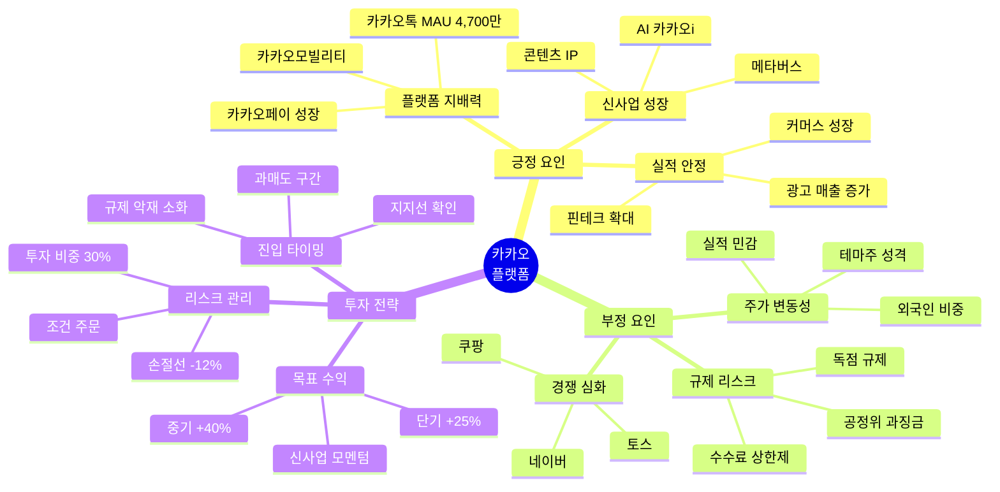

### 핵심 체크포인트

| 체크 항목 | 긍정 신호 | 부정 신호 | 확인 방법 |
|----------|----------|----------|----------|
| **규제 이슈** | 과징금 확정 (소화) | 추가 규제 예고 | 공정위 발표 |
| **MAU 성장** | 전년 대비 +5% | 정체 또는 감소 | 분기 실적 |
| **광고 매출** | 전년 대비 +15% | 성장 둔화 | 분기 실적 |
| **신사업** | AI/메타버스 진척 | 투자 확대만 | IR 자료 |
| **외국인 수급** | 순매수 전환 | 지속 매도 | HTS |

### 투자 전략 요약

```
🎯 최적 전략: 악재 소화 후 진입

1단계: 규제 악재 분석
- 일시적 vs 구조적 판단
- 과징금 규모 확인
- 추가 규제 가능성

2단계: 과매도 진입
- 조건가: 52주 최저가 +5%
- 투자 비중: 30-40%
- RSI 30 이하 확인

3단계: 신사업 모멘텀
- AI/메타버스 진척 확인
- 목표가: +25-40%
- 장기 보유 고려

💡 핵심: 규제는 기회, 플랫폼은 강하다
```

### 5턴 시나리오 요약

#### 🎮 턴 1: 규제 과징금 발표 (확실성: 38점)
- 주가: 50,000원 (-15% 급락)
- 공정위 과징금 5,000억 발표
- 외국인 대량 매도
- **AI 조언**: 추가 하락 대기 (확실성 낮음)

#### 🎮 턴 2: 악재 소화 (확실성: 72점)
- 주가: 48,000원 (-4% 추가 하락)
- RSI 28 (극과매도)
- 악재 소화 완료
- **AI 조언**: 조건 매수 진입 (30% 투자)

#### 🎮 턴 3: 반등 시작 (확실성: 78점)
- 주가: 58,000원 (+20.8%)
- AI 신사업 발표 (카카오i 확대)
- 외국인 순매수 전환
- **AI 조언**: 전량 보유 (목표가까지)

#### 🎮 턴 4: 목표가 도달 (확실성: 68점)
- 주가: 65,000원 (+35.4%)
- 목표가 도달
- RSI 75 (과열)
- **AI 조언**: 50% 부분 익절

#### 🎮 턴 5: 신사업 모멘텀 (확실성: 75점)
- 주가: 70,000원 (+45.8%)
- AI 메타버스 사업 성과
- 장기 보유 가치 확인
- **최종 수익률**: +35-45% (평가: A등급)

---

## 📊 시나리오 4: SK하이닉스 - AI 반도체 폭등

### 시나리오 마인드맵

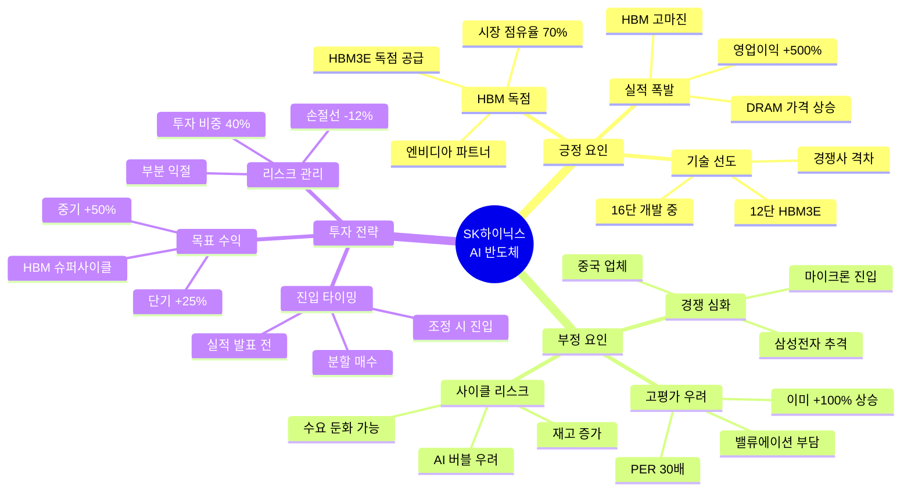

### 핵심 체크포인트

| 체크 항목 | 긍정 신호 | 부정 신호 | 확인 방법 |
|----------|----------|----------|----------|
| **HBM 수주** | 엔비디아 독점 유지 | 삼성 공급 시작 | 공시, 뉴스 |
| **분기 실적** | 영업이익 +300% | 컨센서스 미달 | 실적 발표 |
| **HBM 가격** | 상승 또는 유지 | 하락 (-10%) | 업계 정보 |
| **AI 수요** | 데이터센터 증설 | 투자 감소 | 엔비디아 실적 |
| **PER** | 25배 이하 | 35배 이상 | 증권사 리포트 |

### 투자 전략 요약

```
🎯 최적 전략: 실적 발표 전 선반영 매수

1단계: 실적 분석
- 컨센서스 대비 +20% 예상
- HBM 매출 비중 확인
- 가이던스 상향 기대

2단계: 선반영 매수
- 실적 발표 D-7 진입
- 투자 비중: 40-50%
- 목표가: +25%

3단계: 부분 익절
- 실적 발표 후 +15% 시 50% 익절
- 나머지는 추세 확인
- 조건 익절 설정

💡 핵심: 실적 서프라이즈는 선반영이 유리
```

### 5턴 시나리오 요약

#### 🎮 턴 1: 실적 발표 전 (확실성: 75점)
- 주가: 120,000원
- HBM3E 수주 호조
- 실적 발표 D-7
- **AI 조언**: 선반영 매수 (40% 투자)

#### 🎮 턴 2: 실적 서프라이즈 (확실성: 88점)
- 주가: 145,000원 (+20.8%)
- 영업이익 +500% (컨센서스 대비 +30%)
- 외국인 대량 매수
- **AI 조언**: 전량 보유 (추가 상승 기대)

#### 🎮 턴 3: 추가 상승 (확실성: 82점)
- 주가: 160,000원 (+33.3%)
- 엔비디아 추가 수주 발표
- RSI 78 (과열 초입)
- **AI 조언**: 50% 부분 익절

#### 🎮 턴 4: 목표가 도달 (확실성: 70점)
- 주가: 165,000원 (+37.5%)
- 목표가 근접
- 기관 매도 시작
- **AI 조언**: 추가 30% 익절

#### 🎮 턴 5: 조정 (확실성: 58점)
- 주가: 155,000원 (+29.2%)
- 차익 실현 조정
- 장기 모멘텀 유지
- **최종 수익률**: +30-35% (평가: S등급)

---

## 📊 시나리오 5: 셀트리온 - 바이오 특허 소송

### 시나리오 마인드맵

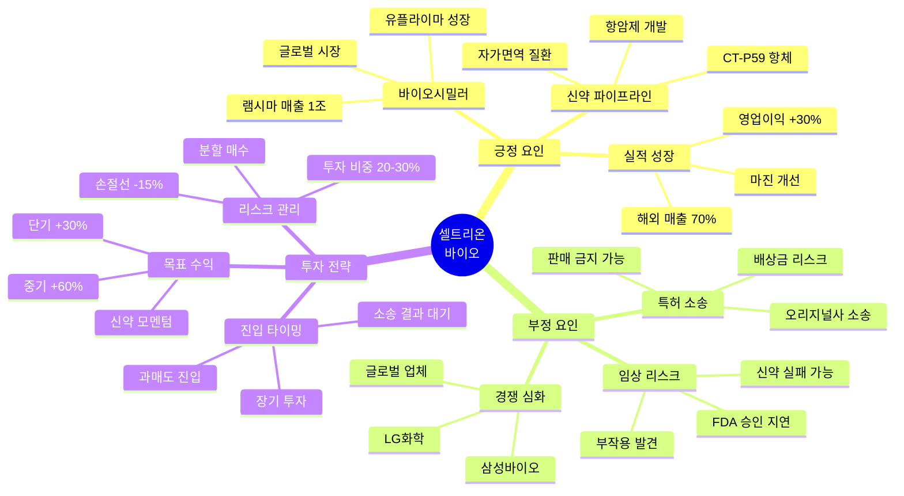

### 핵심 체크포인트

| 체크 항목 | 긍정 신호 | 부정 신호 | 확인 방법 |
|----------|----------|----------|----------|
| **특허 소송** | 1심 승소 | 패소 또는 항소 | 법원 판결 |
| **신약 임상** | 3상 성공 | 실패 또는 중단 | 공시 |
| **분기 실적** | 매출 +20% | 성장 둔화 | 실적 발표 |
| **FDA 승인** | 승인 획득 | 반려 또는 지연 | FDA 발표 |
| **외국인 수급** | 순매수 | 순매도 | HTS |

### 투자 전략 요약

```
🎯 최적 전략: 소송 리스크 소화 후 진입

1단계: 소송 분석
- 승소 확률 평가
- 배상금 규모 추정
- 대체 시나리오 준비

2단계: 과매도 진입
- 소송 악재 발표 후
- RSI 30 이하 확인
- 투자 비중: 20-30%

3단계: 장기 보유
- 신약 파이프라인 기대
- 목표가: +30-60%
- 6-12개월 투자

💡 핵심: 바이오는 인내심이 필요
```

### 5턴 시나리오 요약

#### 🎮 턴 1: 특허 소송 패소 (확실성: 32점)
- 주가: 180,000원 (-20% 급락)
- 1심 패소 판결
- 외국인 대량 매도
- **AI 조언**: 추가 하락 대기

#### 🎮 턴 2: 바닥 형성 (확실성: 65점)
- 주가: 170,000원 (-5.6% 추가)
- RSI 28 (극과매도)
- 항소 준비 발표
- **AI 조언**: 분할 매수 진입 (20%)

#### 🎮 턴 3: 신약 임상 성공 (확실성: 78점)
- 주가: 210,000원 (+23.5%)
- 신약 3상 성공 발표
- 소송 리스크 희석
- **AI 조언**: 전량 보유

#### 🎮 턴 4: 항소 승소 (확실성: 85점)
- 주가: 250,000원 (+47%)
- 2심 승소 판결
- 외국인 순매수 전환
- **AI 조언**: 50% 부분 익절

#### 🎮 턴 5: 신약 승인 (확실성: 82점)
- 주가: 280,000원 (+64.7%)
- FDA 신약 승인
- 장기 성장 모멘텀
- **최종 수익률**: +50-65% (평가: S등급)

---

## 📊 시나리오 6: 레인보우로보틱스 - 로봇 테마 광풍

### 시나리오 마인드맵

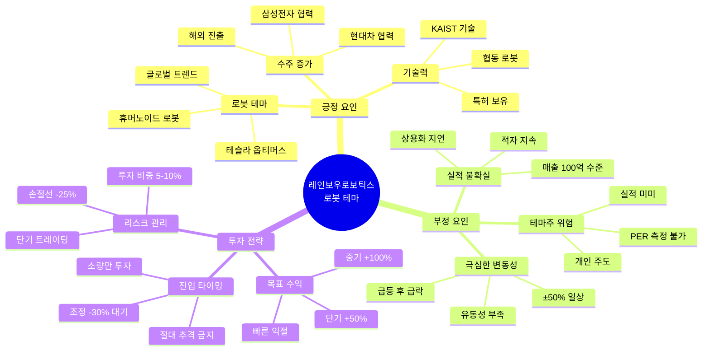

### 핵심 체크포인트

| 체크 항목 | 긍정 신호 | 부정 신호 | 확인 방법 |
|----------|----------|----------|----------|
| **테마 강도** | 언론 보도 증가 | 관심 감소 | 뉴스, 검색량 |
| **수주 발표** | 대형사 계약 | 소규모 수주 | 공시 |
| **RSI** | 30 이하 (과매도) | 80 이상 (과열) | HTS 차트 |
| **거래량** | 평균 대비 300%+ | 급감 | HTS |
| **개인 비중** | 80% 이상 (위험) | 50% 이하 | HTS |

### 투자 전략 요약

```
🎯 최적 전략: 테마 초기 소량 + 빠른 익절

⚠️ 경고: 매우 위험한 종목!

1단계: 테마 초기 포착
- 언론 보도 시작 단계
- 투자 비중: 5-10%만
- 손실 감내 가능 금액

2단계: 빠른 익절
- +30% 도달 시 50% 익절
- +50% 도달 시 전량 익절
- 절대 욕심 금지

3단계: 추격 금지
- 급등 후 절대 추격 금지
- RSI 80 이상 관망
- 조정 -30% 대기

💡 핵심: 테마주는 도박, 소액만 투자
```

### 5턴 시나리오 요약

#### 🎮 턴 1: 테마 발생 (확실성: 55점)
- 주가: 50,000원
- 테슬라 옵티머스 이슈
- 언론 보도 시작
- **AI 조언**: 극소량 진입 (5%)

#### 🎮 턴 2: 급등 (확실성: 48점)
- 주가: 75,000원 (+50%)
- 개인 투자자 과열
- RSI 85 (극과열)
- **AI 조언**: 전량 익절 (욕심 금물)

#### 🎮 턴 3: 폭락 (확실성: 25점)
- 주가: 50,000원 (-33%)
- 테마 소멸
- 외국인/기관 부재
- **평가**: 턴2 익절 성공 시 +50%

#### 🎮 턴 4: 추가 하락 (확실성: 20점)
- 주가: 35,000원 (-30%)
- 개인 물타기 (역지표)
- 유동성 고갈
- **평가**: 추격 매수 시 -30% 손실

#### 🎮 턴 5: 장기 침체 (확실성: 15점)
- 주가: 30,000원 (-40%)
- 테마 완전 소멸
- 실적 부재 확인
- **교훈**: 테마주는 빠른 익절 필수

---

## 📊 시나리오 7: 알체라 - AI 기술주 급등

### 시나리오 마인드맵

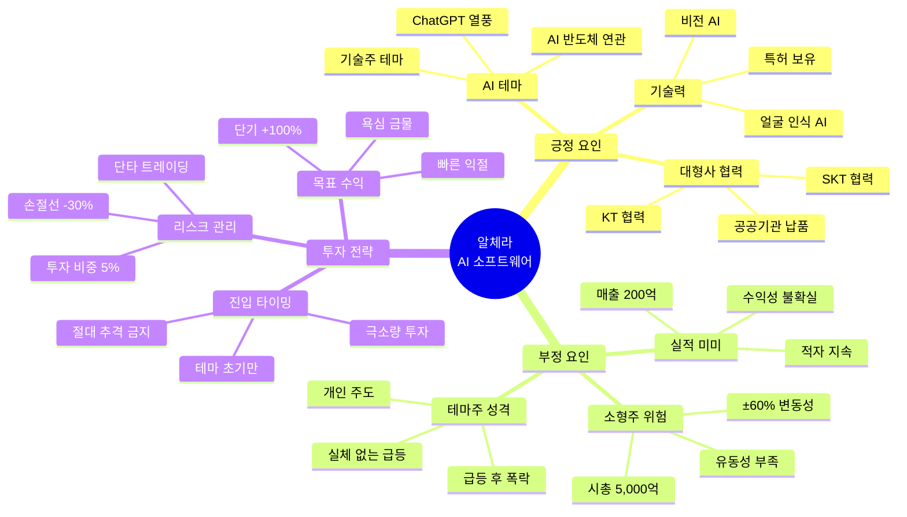

### 핵심 체크포인트

| 체크 항목 | 긍정 신호 | 부정 신호 | 확인 방법 |
|----------|----------|----------|----------|
| **AI 테마** | ChatGPT 이슈 | 관심 감소 | 뉴스, 검색량 |
| **수주 발표** | 대형사 계약 | 소규모 또는 없음 | 공시 |
| **거래량** | 평균 대비 500%+ | 급감 | HTS |
| **RSI** | 30 이하 (과매도) | 85 이상 (극과열) | HTS 차트 |
| **개인 비중** | 90% 이상 (극위험) | 60% 이하 | HTS |

### 투자 전략 요약

```
🎯 최적 전략: 테마 초기 극소량 + 초고속 익절

⚠️ 경고: 극도로 위험한 종목!

1단계: 테마 발생 즉시
- AI 이슈 발생 시작점
- 투자 비중: 5%만 (극소량)
- 잃어도 되는 돈만

2단계: 초고속 익절
- +50% 도달 시 50% 익절
- +100% 도달 시 전량 익절
- 1-2주 내 정리

3단계: 절대 원칙
- 급등 후 절대 추격 금지
- RSI 85 이상 절대 진입 금지
- 손실 -30% 시 무조건 손절

💡 핵심: AI 소형주는 복권, 5%만 투자
```

### 5턴 시나리오 요약

#### 🎮 턴 1: AI 테마 발생 (확실성: 45점)
- 주가: 20,000원
- ChatGPT 이슈 확산
- 언론 보도 시작
- **AI 조언**: 극소량 진입 (5%)

#### 🎮 턴 2: 폭등 (확실성: 35점)
- 주가: 40,000원 (+100%)
- 개인 투자자 광풍
- RSI 92 (극극과열)
- **AI 조언**: 즉시 전량 익절

#### 🎮 턴 3: 폭락 시작 (확실성: 20점)
- 주가: 28,000원 (-30%)
- 테마 소멸 시작
- 거래량 급감
- **평가**: 턴2 익절 성공 시 +100%

#### 🎮 턴 4: 추가 폭락 (확실성: 15점)
- 주가: 15,000원 (-46%)
- 실적 부재 확인
- 개인 물타기 지옥
- **평가**: 추격 시 -25% 손실

#### 🎮 턴 5: 장기 침체 (확실성: 10점)
- 주가: 12,000원 (-57%)
- 테마 완전 소멸
- 유동성 고갈
- **교훈**: AI 소형주는 복권, 초고속 익절 필수

---

## 📊 시나리오 8: 한화에어로스페이스 - 방산 수주 호재

### 시나리오 마인드맵

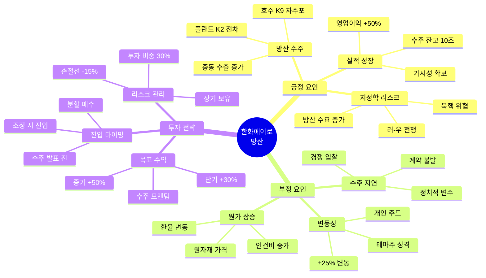

### 핵심 체크포인트

| 체크 항목 | 긍정 신호 | 부정 신호 | 확인 방법 |
|----------|----------|----------|----------|
| **수주 발표** | 대규모 (1조+) | 불발 또는 소규모 | 공시 |
| **수주 잔고** | 연매출 3배 이상 | 감소 추세 | 분기 실적 |
| **지정학** | 전쟁, 긴장 고조 | 평화 무드 | 뉴스 |
| **분기 실적** | 영업이익 +30% | 성장 둔화 | 실적 발표 |
| **외국인 수급** | 순매수 | 순매도 | HTS |

### 투자 전략 요약

```
🎯 최적 전략: 수주 루머 매수, 뉴스 매도

1단계: 수주 루머 포착
- 언론 보도 시작 단계
- 투자 비중: 30-40%
- 공식 발표 전 진입

2단계: 공식 발표
- 수주 확정 발표 시
- +20% 상승 예상
- 50% 익절 고려

3단계: 장기 보유
- 수주 잔고 확인
- 추가 수주 기대
- 목표가: +30-50%

💡 핵심: 방산은 수주가 전부
```

### 5턴 시나리오 요약

#### 🎮 턴 1: 수주 루머 (확실성: 68점)
- 주가: 60,000원
- 폴란드 K2 전차 수주 루머
- 언론 보도 시작
- **AI 조언**: 선반영 매수 (30%)

#### 🎮 턴 2: 수주 확정 (확실성: 85점)
- 주가: 72,000원 (+20%)
- 3조원 수주 공식 발표
- 외국인 순매수
- **AI 조언**: 50% 부분 익절 (뉴스에 팔아라)

#### 🎮 턴 3: 추가 수주 기대 (확실성: 72점)
- 주가: 75,000원 (+25%)
- 호주 K9 자주포 협상 중
- 수주 잔고 10조 돌파
- **AI 조언**: 나머지 보유

#### 🎮 턴 4: 추가 수주 확정 (확실성: 80점)
- 주가: 85,000원 (+41.7%)
- 호주 2조원 수주 확정
- 실적 가시성 확보
- **AI 조언**: 30% 추가 익절

#### 🎮 턴 5: 장기 모멘텀 (확실성: 75점)
- 주가: 90,000원 (+50%)
- 수주 잔고 12조 (연매출 4배)
- 장기 성장 확실
- **최종 수익률**: +40-50% (평가: S등급)

---

## 📊 시나리오 9: 크래프톤 - 게임주 신작 출시

### 시나리오 마인드맵

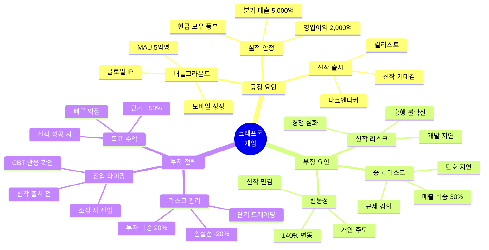

### 핵심 체크포인트

| 체크 항목 | 긍정 신호 | 부정 신호 | 확인 방법 |
|----------|----------|----------|----------|
| **신작 CBT** | 동접 10만+ | 동접 저조 | 게임 커뮤니티 |
| **MAU** | 전년 대비 +10% | 감소 추세 | 분기 실적 |
| **중국 판호** | 승인 획득 | 지연 또는 불발 | 중국 정부 발표 |
| **분기 실적** | 매출 +20% | 성장 둔화 | 실적 발표 |
| **메타크리틱** | 85점 이상 | 70점 이하 | 게임 리뷰 |

### 투자 전략 요약

```
🎯 최적 전략: 신작 CBT 반응 확인 후 진입

1단계: CBT 분석
- 동접자 수 확인
- 커뮤니티 반응 분석
- 메타크리틱 점수

2단계: 출시 전 진입
- CBT 성공 시 진입
- 투자 비중: 20-30%
- 출시 D-7 매수

3단계: 빠른 익절
- 출시 후 +30% 시 50% 익절
- 흥행 확인 후 추가 보유
- 실패 시 즉시 손절

💡 핵심: 게임주는 신작이 전부
```

### 5턴 시나리오 요약

#### 🎮 턴 1: 신작 CBT 발표 (확실성: 58점)
- 주가: 250,000원
- 신작 '칼리스토' CBT 발표
- 기대감 상승
- **AI 조언**: 관망 (CBT 결과 대기)

#### 🎮 턴 2: CBT 대성공 (확실성: 78점)
- 주가: 280,000원 (+12%)
- 동접 15만명 (대성공)
- 메타크리틱 88점
- **AI 조언**: 출시 전 진입 (25%)

#### 🎮 턴 3: 출시 임박 (확실성: 72점)
- 주가: 310,000원 (+24%)
- 사전 예약 100만명
- 흥행 기대감 최고조
- **AI 조언**: 전량 보유

#### 🎮 턴 4: 출시 후 흥행 (확실성: 80점)
- 주가: 350,000원 (+40%)
- 출시 첫주 매출 500억
- 글로벌 흥행 확인
- **AI 조언**: 50% 익절

#### 🎮 턴 5: 중국 판호 획득 (확실성: 85점)
- 주가: 380,000원 (+52%)
- 중국 판호 승인
- 추가 성장 모멘텀
- **최종 수익률**: +40-50% (평가: S등급)

---

## 📊 시나리오 10: 현대차 - 전기차 모멘텀

### 시나리오 마인드맵

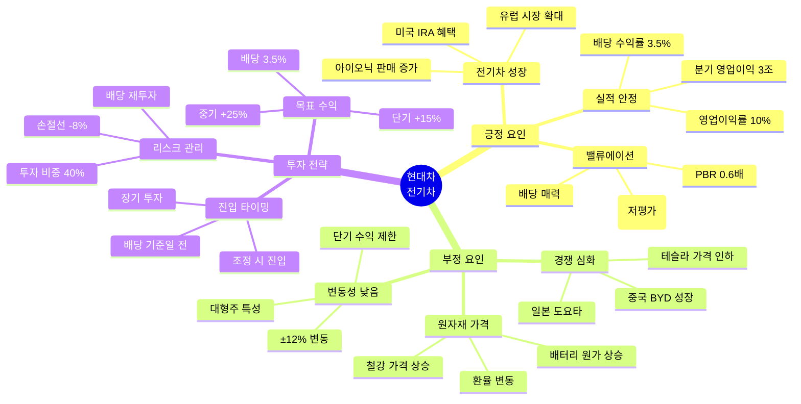

### 핵심 체크포인트

| 체크 항목 | 긍정 신호 | 부정 신호 | 확인 방법 |
|----------|----------|----------|----------|
| **전기차 판매** | 전년 대비 +30% | 성장 둔화 | 월간 판매 |
| **분기 실적** | 영업이익 3조+ | 컨센서스 미달 | 실적 발표 |
| **환율** | 달러 강세 (1,300원+) | 원화 강세 | 환율 시세 |
| **PER** | 5배 이하 | 7배 이상 | 증권사 리포트 |
| **배당** | 배당률 3.5%+ | 배당 감소 | 배당 공시 |

### 투자 전략 요약

```
🎯 최적 전략: 조정 시 매수 + 장기 보유

1단계: 저평가 확인
- PER 5배 이하
- PBR 0.6배 이하
- 배당률 3.5% 이상

2단계: 조정 시 진입
- 20일 이평선 -5%
- 투자 비중: 40-50%
- 분할 매수 (2-3회)

3단계: 장기 보유
- 목표가: +15-25%
- 배당 재투자
- 6-12개월 투자

💡 핵심: 대형주는 안정적 수익
```

### 5턴 시나리오 요약

#### 🎮 턴 1: 저평가 구간 (확실성: 72점)
- 주가: 180,000원
- PER 5배 (저평가)
- 배당률 3.5%
- **AI 조언**: 조건 매수 (40%)

#### 🎮 턴 2: 전기차 판매 증가 (확실성: 78점)
- 주가: 195,000원 (+8.3%)
- 아이오닉 판매 +35%
- IRA 법안 수혜
- **AI 조언**: 전량 보유

#### 🎮 턴 3: 실적 개선 (확실성: 80점)
- 주가: 205,000원 (+13.9%)
- 분기 영업이익 3.5조 (+20%)
- 외국인 순매수
- **AI 조언**: 계속 보유

#### 🎮 턴 4: 목표가 근접 (확실성: 75점)
- 주가: 215,000원 (+19.4%)
- 목표가 근접
- 배당 기준일 임박
- **AI 조언**: 배당 받고 보유

#### 🎮 턴 5: 배당 + 추가 상승 (확실성: 78점)
- 주가: 225,000원 (+25%)
- 배당 6,300원 수령 (+3.5%)
- 장기 성장 지속
- **최종 수익률**: +28.5% (평가: A등급)

---

## 📊 시나리오별 전략 비교표

### 투자 스타일별 추천 시나리오

| 투자 스타일 | 추천 시나리오 | 이유 | 예상 수익률 | 위험도 |
|------------|-------------|------|------------|--------|
| **안정형** | 1. 삼성전자<br/>10. 현대차 | 대형주, 배당, 낮은 변동성 | +15-25% | 낮음 |
| **균형형** | 3. 카카오<br/>4. SK하이닉스<br/>8. 한화에어로 | 중대형주, 적당한 변동성 | +25-40% | 중간 |
| **공격형** | 2. 에코프로비엠<br/>5. 셀트리온<br/>9. 크래프톤 | 고성장주, 높은 변동성 | +40-80% | 높음 |
| **투기형** | 6. 레인보우로보틱스<br/>7. 알체라 | 테마주, 극심한 변동성 | +100%+ | 매우 높음 |

### 시나리오별 최적 전략 요약

| 시나리오 | 최적 진입 | 투자 비중 | 손절선 | 익절 목표 | 핵심 포인트 |
|---------|---------|----------|--------|----------|------------|
| 1. 삼성전자 | 조건 매수 (조정 후) | 40-60% | -10% | +20-30% | 인내심, 부분 익절 |
| 2. 에코프로비엠 | 급락 후 과매도 | 20-30% | -15% | +40-80% | 타이밍, 빠른 익절 |
| 3. 카카오 | 규제 악재 소화 후 | 30-40% | -12% | +25-40% | 악재는 기회 |
| 4. SK하이닉스 | 실적 발표 전 | 40-50% | -12% | +25-35% | 선반영 매수 |
| 5. 셀트리온 | 소송 악재 후 | 20-30% | -15% | +30-60% | 장기 보유 |
| 6. 레인보우로보틱스 | 테마 초기만 | 5-10% | -25% | +50-100% | 극소량, 빠른 익절 |
| 7. 알체라 | 테마 발생 즉시 | 5% | -30% | +100%+ | 복권, 초고속 익절 |
| 8. 한화에어로 | 수주 루머 단계 | 30-40% | -15% | +30-50% | 루머 매수, 뉴스 매도 |
| 9. 크래프톤 | CBT 성공 확인 후 | 20-30% | -20% | +50%+ | 신작이 전부 |
| 10. 현대차 | 저평가 + 조정 | 40-50% | -8% | +15-25% | 장기 보유, 배당 |

### 난이도별 학습 순서

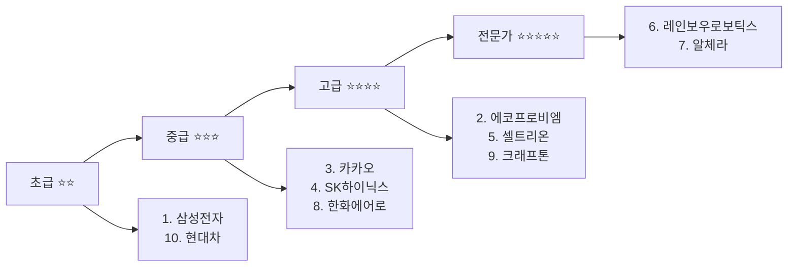

---

## 🎓 종합 학습 가이드

### 투자 원칙 체크리스트

```
□ 신호 분석 (긍정/부정 점수 계산)
□ 확실성 판단 (80+ / 50-79 / 50-)
□ 투자 비중 결정 (공격/신중/방어)
□ 진입 타이밍 (즉시/조건/관망)
□ 손절선 설정 (종목별 차등)
□ 익절 계획 (부분/전량/조건)
□ 리스크 관리 (분산/분할)
□ 감정 제어 (조건 주문 활용)
□ 포트폴리오 관리 (업종 분산)
□ 지속적 모니터링 (체크포인트)
```

### 실전 투자 시뮬레이션 활용법

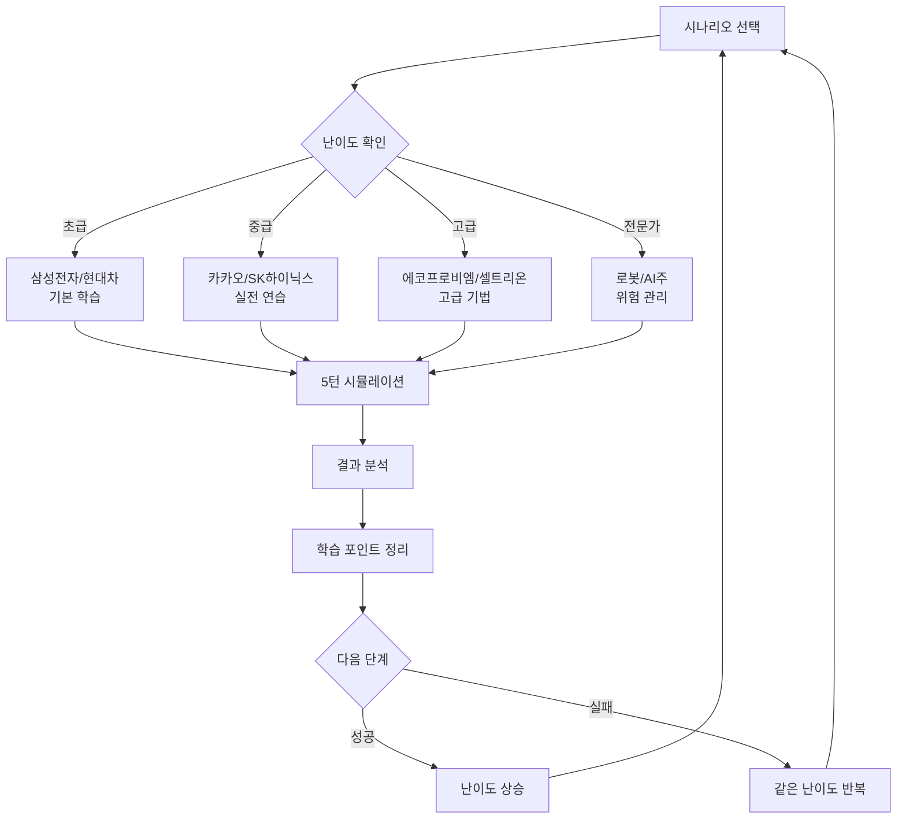

### 포트폴리오 구성 예시

#### 안정형 포트폴리오 (1,000만원)
```
1. 삼성전자 (40%): 400만원
2. 현대차 (30%): 300만원
3. SK하이닉스 (20%): 200만원
4. 현금 (10%): 100만원

목표 수익률: 연 20%
예상 변동성: ±12%
```

#### 균형형 포트폴리오 (1,000만원)
```
1. 삼성전자 (25%): 250만원
2. SK하이닉스 (20%): 200만원
3. 카카오 (15%): 150만원
4. 에코프로비엠 (15%): 150만원
5. 한화에어로 (15%): 150만원
6. 현금 (10%): 100만원

목표 수익률: 연 35%
예상 변동성: ±20%
```

#### 공격형 포트폴리오 (1,000만원)
```
1. 에코프로비엠 (25%): 250만원
2. 셀트리온 (20%): 200만원
3. 크래프톤 (15%): 150만원
4. 레인보우로보틱스 (10%): 100만원
5. SK하이닉스 (15%): 150만원
6. 알체라 (5%): 50만원
7. 현금 (10%): 100만원

목표 수익률: 연 60%
예상 변동성: ±35%
```

---

## 💡 최종 메시지

### 투자의 진리

```
🎯 10가지 황금 원칙

1. 확실성에 따라 투자하라
   - 80점 이상 → 공격적 (70-100%)
   - 50-79점 → 신중 (30-50%)
   - 50점 이하 → 방어적 (0-30%)

2. 조건 주문을 활용하라
   - 감정 배제
   - 최적 가격 포착
   - 인내심 보상

3. 부분 익절로 리스크 관리
   - 수익 일부 확정
   - 추가 기회 보유
   - 심리적 안정

4. 손절은 리스크 관리의 핵심
   - 작은 손실 > 큰 손실
   - 자본 보존 = 다음 기회
   - 원칙 고수

5. 대형주는 인내심
   - 변동성 낮음
   - 회복력 강함
   - 장기 보유 유리

6. 고변동성주는 타이밍
   - 급등 후 조정 대기
   - 과매도 진입
   - 빠른 익절

7. 테마주는 극소량만
   - 5-10%만 투자
   - 초고속 익절
   - 추격 절대 금지

8. 포트폴리오 분산
   - 업종 분산
   - 종목 수 5-7개
   - 현금 10% 유지

9. 지속적 모니터링
   - 체크포인트 확인
   - 확실성 재평가
   - 전략 수정

10. 감정 제어가 핵심
    - FOMO 극복
    - 욕심 제어
    - 원칙 고수
```

### 학습 로드맵

```
1주차: 초급 시나리오 (삼성전자, 현대차)
2주차: 중급 시나리오 (SK하이닉스, 카카오)
3주차: 고급 시나리오 (에코프로비엠, 셀트리온)
4주차: 전문가 시나리오 (로봇, AI주)
5주차: 종합 복습 및 실전 투자

목표: 10개 시나리오 모두 ⭐⭐⭐⭐ 이상 달성
```

---

## 🎯 보너스 시나리오: 엔비디아 대응 그래픽 칩 업체

### 글로벌 AI 반도체 경쟁 구도

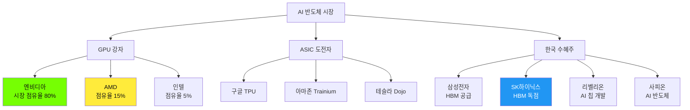

### 엔비디아 대응 업체 완전 가이드

#### 1️⃣ AMD (Advanced Micro Devices)

**📊 기업 개요**
- 시가총액: 약 300조원 (2024년 기준)
- 주요 제품: MI300X (AI GPU), Instinct 시리즈
- 시장 점유율: 15% (AI GPU)

**💡 투자 포인트**
```
강점:
+ 엔비디아 대비 가격 경쟁력 (30% 저렴)
+ 오픈소스 ROCm 플랫폼
+ 데이터센터 매출 급증 (+80% YoY)
+ 마이크로소프트, 메타 채택

약점:
- CUDA 생태계 부족
- 소프트웨어 지원 미흡
- 엔비디아 대비 성능 10-15% 낮음

투자 전략:
- 진입: 엔비디아 고평가 시 대안 투자
- 목표 수익률: +30-50%
- 리스크: 엔비디아 독주 지속 가능
```

**🎯 한국 수혜주**
- SK하이닉스: AMD에도 HBM 공급 (+10% 매출 기여)
- 삼성전자: AMD GPU 파운드리 생산

---

#### 2️⃣ 인텔 (Intel)

**📊 기업 개요**
- 시가총액: 약 200조원
- 주요 제품: Gaudi 2, Gaudi 3 (AI 가속기)
- 시장 점유율: 5% (AI GPU)

**💡 투자 포인트**
```
강점:
+ CPU 시장 1위 (데이터센터)
+ 파운드리 사업 확대 (IFS)
+ 미국 정부 지원 (CHIPS Act)
+ 가격 경쟁력 (엔비디아 대비 50% 저렴)

약점:
- AI GPU 시장 후발주자
- 성능 격차 큼 (엔비디아 대비 30% 낮음)
- 파운드리 적자 지속

투자 전략:
- 진입: 턴어라운드 기대 시
- 목표 수익률: +20-40%
- 리스크: 구조조정 장기화
```

**🎯 한국 수혜주**
- 없음 (인텔은 자체 생산)

---

#### 3️⃣ 구글 TPU (Tensor Processing Unit)

**📊 기업 개요**
- 모기업: 알파벳 (시총 2,500조원)
- 주요 제품: TPU v5, TPU v6
- 특징: 자체 사용 (외부 판매 제한적)

**💡 투자 포인트**
```
강점:
+ 구글 자체 AI 모델 최적화
+ 클라우드 서비스 (GCP) 통합
+ 전력 효율 우수 (엔비디아 대비 2배)

약점:
- 외부 판매 제한적
- 범용성 부족 (구글 모델 특화)
- 생태계 폐쇄적

투자 전략:
- 알파벳 주식 투자 (TPU는 일부)
- AI 클라우드 성장 수혜
- 목표 수익률: +15-25%
```

**🎯 한국 수혜주**
- SK하이닉스: 구글 TPU에 HBM 공급
- 삼성전자: 구글 TPU 파운드리 생산

---

#### 4️⃣ 리벨리온 (Rebellions) - 한국 AI 칩 스타트업

**📊 기업 개요**
- 시가총액: 비상장 (기업가치 1조원 추정)
- 주요 제품: ATOM (AI 추론 칩)
- 특징: 한국 대표 AI 반도체 스타트업

**💡 투자 포인트**
```
강점:
+ 삼성전자, SK하이닉스 투자 유치
+ 네이버, 카카오 채택
+ AI 추론 특화 (저전력, 고효율)
+ 국내 데이터센터 수요

약점:
- 비상장 (일반 투자 불가)
- 엔비디아 대비 성능 격차
- 글로벌 시장 진출 미미

투자 전략:
- IPO 대기 (2025년 예상)
- 상장 시 초기 투자 고려
- 목표 수익률: +100%+ (고위험)
```

**🎯 관련 투자 종목**
- 삼성전자: 리벨리온 투자 + 파운드리 생산
- SK하이닉스: 리벨리온 투자
- 네이버: 리벨리온 칩 채택 (AI 서비스)

---

#### 5️⃣ 사피온 (Sapeon) - SK텔레콤 AI 칩

**📊 기업 개요**
- 모기업: SK텔레콤
- 주요 제품: X330 (AI 추론 칩)
- 특징: 통신사 AI 서비스 특화

**💡 투자 포인트**
```
강점:
+ SK텔레콤 자체 AI 서비스 적용
+ 통신 인프라 최적화
+ 국내 시장 안정적 수요

약점:
- 외부 판매 제한적
- 글로벌 경쟁력 부족
- 범용성 낮음

투자 전략:
- SK텔레콤 주식 투자 (사피온은 일부)
- AI 서비스 성장 수혜
- 목표 수익률: +10-20%
```

**🎯 관련 투자 종목**
- SK텔레콤: 사피온 모기업
- SK하이닉스: 사피온 칩 생산 지원

---

### 엔비디아 vs 경쟁사 비교표

| 항목 | 엔비디아 | AMD | 인텔 | 구글 TPU | 리벨리온 |
|------|---------|-----|------|---------|---------|
| **시장 점유율** | 80% | 15% | 5% | 자체용 | <1% |
| **성능** | 100% | 85% | 70% | 90% | 60% |
| **가격** | 100% | 70% | 50% | 비공개 | 40% |
| **생태계** | ⭐⭐⭐⭐⭐ | ⭐⭐⭐ | ⭐⭐ | ⭐⭐ | ⭐ |
| **전력 효율** | 100% | 95% | 80% | 200% | 150% |
| **한국 수혜** | 높음 | 중간 | 낮음 | 중간 | 높음 |

### 한국 투자자 최적 전략

#### 🎯 직접 투자 (미국 주식)

```
1. 엔비디아 (NVDA)
   - 비중: 40-50%
   - 이유: 압도적 1위, 생태계 독점
   - 리스크: 고평가 (PER 60배)

2. AMD (AMD)
   - 비중: 20-30%
   - 이유: 가성비 대안, 성장 가능성
   - 리스크: 엔비디아 격차 유지

3. 알파벳 (GOOGL)
   - 비중: 10-20%
   - 이유: TPU + AI 서비스 통합
   - 리스크: AI 수익화 불확실
```

#### 🎯 간접 투자 (한국 수혜주)

```
1. SK하이닉스 (최우선 추천)
   - 비중: 40-60%
   - 이유: HBM 독점 공급 (엔비디아, AMD, 구글)
   - 수혜: AI 반도체 전체 성장 수혜
   - 목표 수익률: +30-50%

2. 삼성전자
   - 비중: 30-40%
   - 이유: HBM + 파운드리 (AMD, 구글)
   - 수혜: 다각화된 AI 반도체 수혜
   - 목표 수익률: +20-30%

3. 네이버
   - 비중: 10-20%
   - 이유: 리벨리온 투자 + AI 서비스
   - 수혜: 국내 AI 생태계 성장
   - 목표 수익률: +25-40%

4. SK텔레콤
   - 비중: 10-20%
   - 이유: 사피온 + AI 서비스
   - 수혜: 통신 AI 융합
   - 목표 수익률: +15-25%
```

### 엔비디아 대응 투자 시나리오

#### 📊 시나리오: SK하이닉스 - HBM 슈퍼사이클

**🎯 투자 논리**
```
엔비디아 성장 = SK하이닉스 성장

1. 엔비디아 H100/H200 → SK하이닉스 HBM3E 독점
2. AMD MI300X → SK하이닉스 HBM3 공급
3. 구글 TPU v5 → SK하이닉스 HBM 공급

결론: 누가 이기든 SK하이닉스는 승자!
```

**💰 투자 전략**
```
진입 조건:
- 엔비디아 실적 발표 전 (선반영)
- AI 반도체 수요 급증 시
- 조정 시 (-10-15%)

투자 비중: 40-60%

목표 수익률:
- 단기 (3-6개월): +25-35%
- 중기 (6-12개월): +50-80%

손절선: -12%

💡 핵심: 엔비디아 대응 최고 수혜주
```

---

## 🎯 엔비디아 생태계 투자 맵

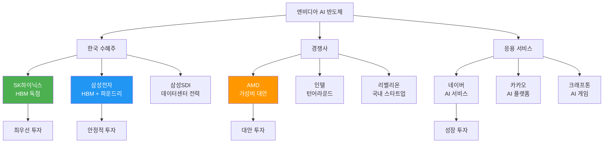

---

**"엔비디아를 이길 수 없다면, 엔비디아와 함께 성장하는 기업에 투자하라."**

**"SK하이닉스는 엔비디아의 성공을 함께 나누는 최고의 수혜주다."**

**"AI 반도체 전쟁에서 한국 기업은 핵심 부품 공급자로서 승리한다."**

---

**"주식은 확률 게임이다. 확실성을 높이고, 리스크를 관리하고, 감정을 제어하는 자가 승리한다."**

**"10가지 시나리오를 마스터하면, 어떤 상황에서도 최선의 선택을 할 수 있다."**

**"실전처럼 연습하면, 실전에서 성공한다."**

🎯 **지금 바로 시작하세요!**

