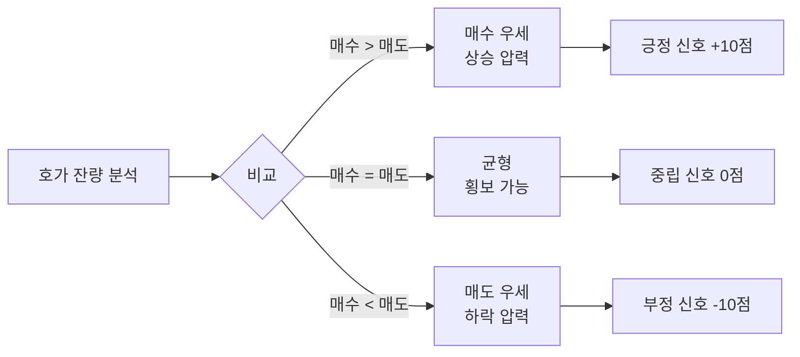
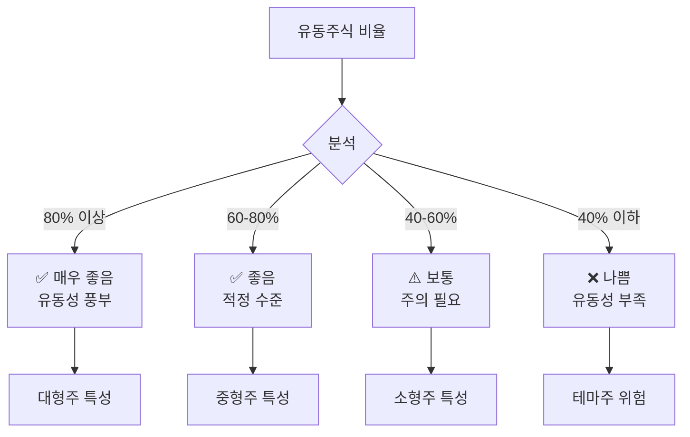
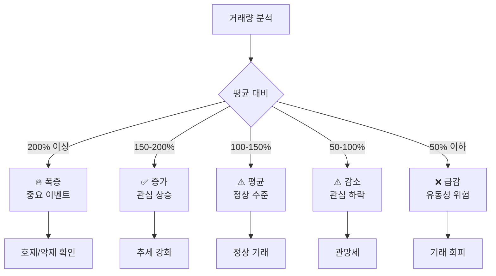
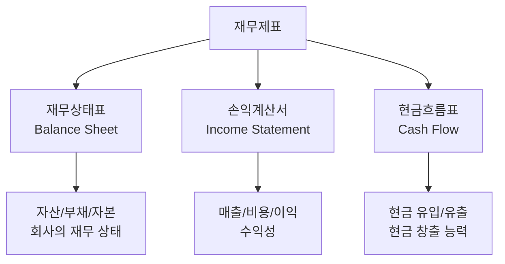
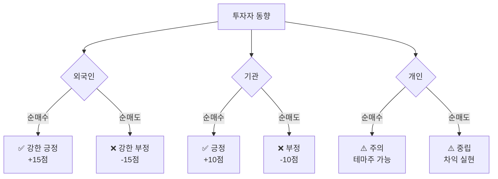
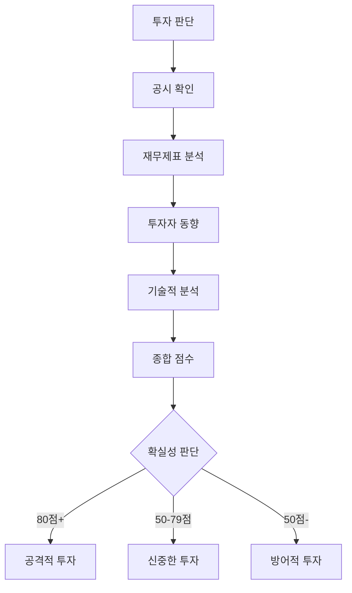

# 주식 데이터 읽는 법 - 완전 가이드

> "데이터를 읽을 줄 알아야 투자할 수 있다"

---

## 📋 목차

1. [호가창 읽는 법 (매수량/매도량)](#호가창-읽는-법)
2. [시가총액과 유동주식수](#시가총액과-유동주식수)
3. [거래량과 거래대금](#거래량과-거래대금)
4. [재무제표 읽는 법](#재무제표-읽는-법)
5. [투자자별 매매동향](#투자자별-매매동향)
6. [공시 읽는 법](#공시-읽는-법)
7. [실전 종합 분석](#실전-종합-분석)

---

## 📊 1. 호가창 읽는 법 (매수량/매도량)

### 호가창 구조

```
┌─────────────────────────────────┐
│         호가창 (삼성전자)         │
├─────────────────────────────────┤
│  매도 잔량  │  호가   │ 매수 잔량 │
├─────────────┼─────────┼──────────┤
│   15,234주  │ 72,500원│          │ ← 매도 5호가
│   23,456주  │ 72,400원│          │ ← 매도 4호가
│   45,678주  │ 72,300원│          │ ← 매도 3호가
│   67,890주  │ 72,200원│          │ ← 매도 2호가
│  123,456주  │ 72,100원│          │ ← 매도 1호가 (최우선 매도)
├─────────────┼─────────┼──────────┤
│             │ 72,000원│ 현재가    │ ← 최종 체결가
├─────────────┼─────────┼──────────┤
│             │ 71,900원│ 234,567주 │ ← 매수 1호가 (최우선 매수)
│             │ 71,800원│ 156,789주 │ ← 매수 2호가
│             │ 71,700원│  89,012주 │ ← 매수 3호가
│             │ 71,600원│  45,678주 │ ← 매수 4호가
│             │ 71,500원│  23,456주 │ ← 매수 5호가
└─────────────┴─────────┴──────────┘

📊 호가 총잔량:
매도 총잔량: 275,714주
매수 총잔량: 549,502주
→ 매수 우세 (상승 압력)
```

### 호가창 해석 방법

#### 1. 매수/매도 잔량 비교



**실전 예시:**
```
삼성전자 호가창 분석 (2024.03.15 10:30)

매도 총잔량: 275,714주
매수 총잔량: 549,502주
비율: 매수 2.0배

📊 해석:
✅ 매수 우세 (2배) → 상승 압력
💡 단기 상승 가능성 높음
⚠️ 주의: 호가는 실시간 변동

🎯 투자 판단:
- 매수 2배 이상 → 긍정 (+10점)
- 매수 1.5-2배 → 약한 긍정 (+5점)
- 매수 1-1.5배 → 중립 (0점)
- 매도 우세 → 부정 (-5 ~ -10점)
```

#### 2. 호가 벽 (매물대) 분석

```
예시 1: 매도 벽 (저항선)

매도 잔량:
- 72,500원: 15,234주
- 72,400원: 23,456주
- 72,300원: 45,678주
- 72,200원: 67,890주
- 72,100원: 500,000주 ← 🧱 매도 벽!

현재가: 72,000원

📊 해석:
⚠️ 72,100원에 대규모 매도 물량 (50만주)
💡 의미: 72,100원 돌파 어려움 (저항선)
🎯 전략: 
  - 돌파 실패 시 조정 가능
  - 돌파 성공 시 급등 가능
```

```
예시 2: 매수 벽 (지지선)

매수 잔량:
- 71,900원: 234,567주
- 71,800원: 156,789주
- 71,700원: 89,012주
- 71,600원: 45,678주
- 71,500원: 800,000주 ← 🛡️ 매수 벽!

현재가: 72,000원

📊 해석:
✅ 71,500원에 대규모 매수 물량 (80만주)
💡 의미: 71,500원 이하 하락 어려움 (지지선)
🎯 전략:
  - 71,500원 근처는 안전 마진
  - 붕괴 시 급락 위험
```

#### 3. 호가 스프레드 분석

```
좁은 스프레드 (유동성 좋음):
매도 1호가: 72,100원
매수 1호가: 71,900원
스프레드: 200원 (0.28%)

✅ 해석: 유동성 좋음, 체결 쉬움

넓은 스프레드 (유동성 나쁨):
매도 1호가: 5,500원
매수 1호가: 5,000원
스프레드: 500원 (10%)

⚠️ 해석: 유동성 나쁨, 체결 어려움
→ 소형주, 비인기 종목
```

### 호가창 실전 활용

| 상황 | 호가창 신호 | 해석 | 투자 전략 |
|------|-----------|------|----------|
| **상승 추세** | 매수 > 매도 (2배+) | 강한 매수세 | 추격 매수 고려 |
| **하락 추세** | 매도 > 매수 (2배+) | 강한 매도세 | 관망 또는 손절 |
| **매도 벽** | 특정 가격 대량 매도 | 저항선 형성 | 돌파 확인 필요 |
| **매수 벽** | 특정 가격 대량 매수 | 지지선 형성 | 안전 마진 |
| **스프레드 좁음** | 매수/매도 차이 작음 | 유동성 좋음 | 체결 쉬움 |
| **스프레드 넓음** | 매수/매도 차이 큼 | 유동성 나쁨 | 체결 어려움 |

---

## 💰 2. 시가총액과 유동주식수

### 시가총액 계산

```
시가총액 = 현재 주가 × 총 발행 주식수

예시: 삼성전자
- 현재 주가: 72,000원
- 총 발행 주식수: 5,969,782,550주
- 시가총액: 429조 8,243억원

💡 의미:
- 회사의 시장 가치
- 대형주/중형주/소형주 분류 기준
```

### 시가총액 분류

| 분류 | 시가총액 | 특징 | 대표 기업 | 변동성 | 유동성 |
|------|---------|------|----------|--------|--------|
| **초대형주** | 100조원+ | 안정적, 낮은 변동성 | 삼성전자 | ±10% | 매우 높음 |
| **대형주** | 10조-100조 | 비교적 안정적 | SK하이닉스, 현대차 | ±15% | 높음 |
| **중형주** | 1조-10조 | 중간 변동성 | 카카오, 셀트리온 | ±20% | 중간 |
| **소형주** | 1,000억-1조 | 높은 변동성 | 레인보우로보틱스 | ±40% | 낮음 |
| **초소형주** | 1,000억 이하 | 극심한 변동성 | 알체라 | ±60% | 매우 낮음 |

### 유동주식수

```
총 발행 주식수 vs 유동주식수

예시: 삼성전자
- 총 발행 주식수: 5,969,782,550주
- 최대주주 지분: 20.8% (1,241,795,570주)
- 특수관계인 지분: 0.5% (29,848,913주)
- 자기주식: 1.2% (71,637,390주)
- 유동주식수: 77.5% (4,626,500,677주)

💡 유동주식수 = 실제 거래 가능한 주식
→ 유동주식수가 많을수록 유동성 좋음
```

### 유동주식 비율 해석



**실전 예시:**
```
기업 A: 유동주식 비율 85%
✅ 해석: 유동성 풍부, 안정적 거래 가능
🎯 전략: 대량 매수/매도 가능

기업 B: 유동주식 비율 30%
⚠️ 해석: 유동성 부족, 급등락 위험
🎯 전략: 소량만 투자, 단기 트레이딩
```

### 시가총액 활용 전략

```
📊 시가총액별 투자 전략

초대형주 (100조+):
- 투자 비중: 40-60%
- 손절선: -10%
- 목표 수익: +20-30%
- 특징: 안정적, 배당 매력

대형주 (10-100조):
- 투자 비중: 30-50%
- 손절선: -12%
- 목표 수익: +25-40%
- 특징: 성장성 + 안정성

중형주 (1-10조):
- 투자 비중: 20-40%
- 손절선: -15%
- 목표 수익: +40-80%
- 특징: 고성장 가능

소형주 (1,000억-1조):
- 투자 비중: 5-20%
- 손절선: -25%
- 목표 수익: +100%+
- 특징: 고위험 고수익

초소형주 (1,000억 이하):
- 투자 비중: 5% 이하
- 손절선: -30%
- 목표 수익: +150%+
- 특징: 극도로 위험
```

---

## 📈 3. 거래량과 거래대금

### 거래량 분석

```
거래량 = 하루 동안 거래된 주식 수

예시: 삼성전자 (2024.03.15)
- 오늘 거래량: 15,234,567주
- 평균 거래량: 12,000,000주 (20일 평균)
- 비율: 127% (평균 대비 +27%)

📊 해석:
✅ 거래량 증가 (+27%)
💡 의미: 관심 증가, 변동성 확대
```

### 거래량 패턴 분석



### 거래량과 주가의 관계

| 상황 | 거래량 | 주가 | 해석 | 신호 |
|------|--------|------|------|------|
| **상승 돌파** | 폭증 (200%+) | 상승 (+5%) | 강한 매수세 | 🟢 강한 긍정 |
| **상승 지속** | 증가 (150%) | 상승 (+3%) | 추세 지속 | 🟢 긍정 |
| **상승 약화** | 감소 (80%) | 상승 (+1%) | 상승 약화 | 🟡 주의 |
| **하락 시작** | 폭증 (200%+) | 하락 (-5%) | 강한 매도세 | 🔴 강한 부정 |
| **하락 지속** | 증가 (150%) | 하락 (-3%) | 추세 지속 | 🔴 부정 |
| **하락 약화** | 감소 (80%) | 하락 (-1%) | 하락 약화 | 🟡 주의 |
| **횡보** | 감소 (70%) | 횡보 (0%) | 관망세 | ⚪ 중립 |

### 거래대금 분석

```
거래대금 = 거래량 × 평균 체결가

예시: 삼성전자 (2024.03.15)
- 거래량: 15,234,567주
- 평균 체결가: 72,000원
- 거래대금: 1조 969억원

💡 의미:
- 실제 거래된 금액
- 유동성 지표
- 기관/외국인 관심도
```

### 거래대금 순위 활용

```
📊 코스피 거래대금 순위 (2024.03.15)

1위: 삼성전자 - 1조 969억원
2위: SK하이닉스 - 8,234억원
3위: 현대차 - 5,678억원
...
10위: 카카오 - 2,345억원

✅ 해석:
- 상위권 = 시장 관심 집중
- 대량 자금 유입
- 변동성 확대 가능

🎯 활용:
- 상위 10위 = 단기 트레이딩 기회
- 순위 급상승 = 이슈 발생 확인
- 순위 급하락 = 관심 감소
```

### 실전 거래량 분석

```
시나리오 1: 거래량 폭증 + 상승

삼성전자 (2024.03.15)
- 주가: 68,000원 → 72,000원 (+5.9%)
- 거래량: 12백만주 → 25백만주 (+108%)
- 뉴스: "HBM3 엔비디아 공급 승인"

📊 분석:
✅ 호재 + 거래량 폭증 + 상승
💡 신호: 강한 긍정 (+20점)
🎯 전략: 추세 동참 고려

⚠️ 주의:
- 단기 과열 가능
- RSI 확인 필요
- 조정 후 진입 고려
```

```
시나리오 2: 거래량 폭증 + 하락

에코프로비엠 (2024.01.20)
- 주가: 280,000원 → 220,000원 (-21.4%)
- 거래량: 30만주 → 150만주 (+400%)
- 뉴스: "중국 전기차 보조금 축소"

📊 분석:
❌ 악재 + 거래량 폭증 + 하락
💡 신호: 강한 부정 (-30점)
🎯 전략: 손절 또는 관망

⚠️ 주의:
- 추가 하락 가능
- 패닉 매도 진행 중
- 안정화 대기
```

---

## 📊 4. 재무제표 읽는 법

### 재무제표 3대 핵심



### 4.1 손익계산서 (Income Statement)

#### 구조와 읽는 법

```
삼성전자 손익계산서 (2023년 4분기)

매출액                    67조원
  - 매출원가             (45조원)
─────────────────────────────
매출총이익                22조원 (매출총이익률 32.8%)
  - 판매관리비           (10조원)
  - 연구개발비            (5조원)
─────────────────────────────
영업이익                   7조원 (영업이익률 10.4%)
  + 영업외수익             1조원
  - 영업외비용            (0.5조원)
─────────────────────────────
세전이익                  7.5조원
  - 법인세               (1.5조원)
─────────────────────────────
당기순이익                 6조원 (순이익률 9.0%)
```

#### 핵심 지표 분석

**1. 매출액 성장률**
```
매출액 성장률 = (당기 매출 - 전기 매출) / 전기 매출 × 100

예시: 삼성전자
- 2023 Q4: 67조원
- 2022 Q4: 64조원
- 성장률: +4.7%

📊 해석:
✅ +10% 이상 = 고성장 (긍정 +15점)
✅ +5-10% = 성장 (긍정 +10점)
⚠️ 0-5% = 저성장 (중립 0점)
❌ 마이너스 = 역성장 (부정 -10점)
```

**2. 영업이익률**
```
영업이익률 = 영업이익 / 매출액 × 100

예시: 삼성전자
- 영업이익: 7조원
- 매출액: 67조원
- 영업이익률: 10.4%

📊 업종별 기준:

IT/반도체:
✅ 15% 이상 = 우수
⚠️ 10-15% = 양호
❌ 10% 이하 = 부진

제조업:
✅ 10% 이상 = 우수
⚠️ 5-10% = 양호
❌ 5% 이하 = 부진

유통/서비스:
✅ 5% 이상 = 우수
⚠️ 3-5% = 양호
❌ 3% 이하 = 부진
```

**3. 순이익률**
```
순이익률 = 당기순이익 / 매출액 × 100

예시: 삼성전자
- 당기순이익: 6조원
- 매출액: 67조원
- 순이익률: 9.0%

📊 해석:
✅ 영업이익률과 순이익률 차이가 작을수록 좋음
⚠️ 차이가 크면 영업외 손실 발생
```

#### 전년 대비 비교 (YoY)

```
삼성전자 실적 추이 (단위: 조원)

         2023 Q4  2022 Q4  YoY 증감
매출액      67조     64조    +4.7%
영업이익     7조      4조   +75.0%
당기순이익   6조      3조  +100.0%

📊 분석:
✅ 매출 성장: +4.7% (양호)
✅ 영업이익 급증: +75% (매우 긍정)
✅ 순이익 2배 증가: +100% (매우 긍정)

💡 종합 평가: 강한 긍정 (+30점)

🎯 투자 판단:
- 실적 개선 뚜렷
- 수익성 회복
- 매수 신호
```

### 4.2 재무상태표 (Balance Sheet)

#### 구조와 읽는 법

```
삼성전자 재무상태표 (2023년 말)

[자산]
유동자산                  200조원
  - 현금 및 현금성자산      80조원
  - 매출채권               50조원
  - 재고자산               40조원
  - 기타                   30조원

비유동자산                250조원
  - 유형자산              150조원
  - 무형자산               50조원
  - 투자자산               50조원

자산 총계                 450조원

[부채]
유동부채                  100조원
비유동부채                 50조원
부채 총계                 150조원

[자본]
자본금                     10조원
이익잉여금                250조원
기타자본                   40조원
자본 총계                 300조원

부채 + 자본               450조원
```

#### 핵심 지표 분석

**1. 부채비율**
```
부채비율 = 부채 총계 / 자본 총계 × 100

예시: 삼성전자
- 부채: 150조원
- 자본: 300조원
- 부채비율: 50%

📊 해석:
✅ 50% 이하 = 매우 안정적
✅ 50-100% = 안정적
⚠️ 100-200% = 주의 필요
❌ 200% 이상 = 위험

💡 업종별 차이:
- IT/제조: 100% 이하 권장
- 건설/유통: 200% 이하 허용
- 금융: 별도 기준 적용
```

**2. 유동비율**
```
유동비율 = 유동자산 / 유동부채 × 100

예시: 삼성전자
- 유동자산: 200조원
- 유동부채: 100조원
- 유동비율: 200%

📊 해석:
✅ 200% 이상 = 매우 안정적
✅ 150-200% = 안정적
⚠️ 100-150% = 보통
❌ 100% 이하 = 단기 유동성 위험

💡 의미:
- 단기 채무 상환 능력
- 높을수록 안정적
```

**3. 자기자본비율**
```
자기자본비율 = 자본 총계 / 자산 총계 × 100

예시: 삼성전자
- 자본: 300조원
- 자산: 450조원
- 자기자본비율: 66.7%

📊 해석:
✅ 50% 이상 = 매우 안정적
✅ 40-50% = 안정적
⚠️ 30-40% = 보통
❌ 30% 이하 = 위험

💡 의미:
- 재무 건전성
- 높을수록 안정적
```

**4. ROE (자기자본이익률)**
```
ROE = 당기순이익 / 자기자본 × 100

예시: 삼성전자 (연간)
- 당기순이익: 24조원
- 자기자본: 300조원
- ROE: 8%

📊 해석:
✅ 15% 이상 = 우수
✅ 10-15% = 양호
⚠️ 5-10% = 보통
❌ 5% 이하 = 부진

💡 의미:
- 자본 효율성
- 주주 수익률
- 높을수록 좋음
```

### 4.3 현금흐름표 (Cash Flow Statement)

#### 구조와 읽는 법

```
삼성전자 현금흐름표 (2023년)

[영업활동 현금흐름]
당기순이익                 24조원
  + 감가상각비             30조원
  - 운전자본 증가         (10조원)
영업활동 현금흐름          44조원 ✅

[투자활동 현금흐름]
  - 설비 투자            (40조원)
  - 연구개발 투자        (20조원)
  + 투자자산 처분          5조원
투자활동 현금흐름         (55조원) ⚠️

[재무활동 현금흐름]
  - 배당금 지급          (10조원)
  - 차입금 상환           (5조원)
  + 차입금 증가           15조원
재무활동 현금흐름           0조원 ⚠️

현금 증감                (11조원)
기초 현금                 91조원
기말 현금                 80조원
```

#### 핵심 분석

**1. 영업활동 현금흐름**
```
📊 해석:
✅ 양수 (+) = 본업에서 현금 창출 (건강)
❌ 음수 (-) = 본업에서 현금 유출 (위험)

예시: 삼성전자 +44조원
💡 매우 건강한 현금 창출 능력
```

**2. FCF (잉여현금흐름)**
```
FCF = 영업활동 현금흐름 - 투자활동 현금흐름

예시: 삼성전자
- 영업 CF: +44조원
- 투자 CF: -55조원
- FCF: -11조원

📊 해석:
✅ 양수 = 배당/자사주 매입 여력
⚠️ 음수 = 성장 투자 중 (일시적 허용)
❌ 지속 음수 = 재무 악화 위험

💡 삼성전자 케이스:
- 대규모 설비 투자 중 (반도체)
- 영업 CF는 건강 (+44조)
- 일시적 음수 허용 가능
```

### 4.4 주요 재무 비율 종합

| 비율 | 계산식 | 우수 | 양호 | 주의 | 위험 |
|------|--------|------|------|------|------|
| **PER** | 주가/주당순이익 | 10배↓ | 10-15배 | 15-25배 | 25배↑ |
| **PBR** | 주가/주당순자산 | 0.8배↓ | 0.8-1.2배 | 1.2-2배 | 2배↑ |
| **ROE** | 순이익/자기자본 | 15%↑ | 10-15% | 5-10% | 5%↓ |
| **부채비율** | 부채/자본 | 50%↓ | 50-100% | 100-200% | 200%↑ |
| **유동비율** | 유동자산/유동부채 | 200%↑ | 150-200% | 100-150% | 100%↓ |
| **영업이익률** | 영업이익/매출 | 15%↑ | 10-15% | 5-10% | 5%↓ |

---

## 👥 5. 투자자별 매매동향

### 투자자 분류

```
📊 투자자 3대 주체

1. 외국인 (Foreign Investors)
   - 주로 기관 투자자
   - 장기 투자 성향
   - 펀더멘털 중시

2. 기관 (Institutional Investors)
   - 국내 기관 (연기금, 보험, 자산운용)
   - 중장기 투자
   - 안정적 수익 추구

3. 개인 (Retail Investors)
   - 개인 투자자
   - 단기 투자 성향
   - 테마/뉴스 민감
```

### 투자자별 매매동향 읽는 법

```
삼성전자 투자자별 매매동향 (2024.03.15)

구분      매수      매도      순매수
외국인   5,234억   4,123억   +1,111억 ✅
기관     2,345억   2,123억    +222억 ✅
개인     6,456억   7,789억  -1,333억 ❌

📊 해석:
✅ 외국인 + 기관 순매수 = 긍정 신호
❌ 개인 순매도 = 차익 실현 또는 불안

💡 종합 판단:
- 외국인 대량 매수 (+1,111억)
- 기관 소폭 매수 (+222억)
- 개인 매도 (-1,333억)
→ 강한 긍정 신호 (+15점)
```

### 투자자별 해석 가이드



### 실전 패턴 분석

**패턴 1: 외국인 + 기관 동반 매수**
```
외국인: +1,000억
기관: +500억
개인: -1,500억

📊 해석:
✅ 가장 강한 긍정 신호
💡 의미: 펀더멘털 개선 확인
🎯 전략: 적극 매수 고려

신호 강도: +25점
```

**패턴 2: 외국인 + 기관 동반 매도**
```
외국인: -1,000억
기관: -500억
개인: +1,500억

📊 해석:
❌ 가장 강한 부정 신호
💡 의미: 펀더멘털 악화 또는 고점
🎯 전략: 매도 또는 관망

신호 강도: -25점
```

**패턴 3: 개인 주도 상승 (테마주)**
```
외국인: -200억
기관: -100억
개인: +300억

📊 해석:
⚠️ 테마주 급등 패턴
💡 의미: 단기 과열, 급락 위험
🎯 전략: 추격 금지, 조정 대기

신호 강도: -10점 (위험)
```

### 누적 순매수 분석

```
삼성전자 최근 5일 누적 순매수

구분        1일    2일    3일    4일    5일   누적
외국인    +500  +300  +800  +600  +400  +2,600억
기관      +200  +150  +300  +250  +200  +1,100억
개인    -700  -450 -1,100  -850  -600  -3,700억

📊 해석:
✅ 외국인 5일 연속 순매수 (매우 긍정)
✅ 기관 5일 연속 순매수 (긍정)
⚠️ 개인 5일 연속 순매도 (차익 실현)

💡 종합 판단:
- 외국인 + 기관 = +3,700억 유입
- 강한 상승 추세
- 추가 상승 여력 있음

신호 강도: +30점
```

---

## 📢 6. 공시 읽는 법

### 공시 종류와 중요도

| 공시 유형 | 중요도 | 영향 | 예시 |
|----------|--------|------|------|
| **실적 공시** | ⭐⭐⭐⭐⭐ | 매우 큼 | 분기 실적, 연간 실적 |
| **수주 공시** | ⭐⭐⭐⭐ | 큼 | 대규모 계약 체결 |
| **유상증자** | ⭐⭐⭐⭐ | 큼 (부정) | 신주 발행 |
| **자사주 매입** | ⭐⭐⭐ | 중간 (긍정) | 주가 방어 |
| **배당 공시** | ⭐⭐⭐ | 중간 | 배당금 결정 |
| **임원 변경** | ⭐⭐ | 작음 | CEO 교체 |
| **소송 공시** | ⭐⭐⭐⭐ | 큼 (부정) | 특허 소송 |
| **합병/인수** | ⭐⭐⭐⭐⭐ | 매우 큼 | M&A |

### 실적 공시 읽는 법

```
[공시 예시: 삼성전자 2023년 4분기 실적]

제목: 연결재무제표기준 영업(잠정)실적(공정공시)

1. 실적 개요
   - 매출액: 67조원
   - 영업이익: 7조원
   - 당기순이익: 6조원

2. 전년 동기 대비
   - 매출액: +4.7%
   - 영업이익: +75.0%
   - 당기순이익: +100.0%

3. 시장 컨센서스 대비
   - 매출액: 65조원 (예상) → 67조원 (실제) ✅
   - 영업이익: 6.5조원 (예상) → 7조원 (실제) ✅
   - 서프라이즈: +7.7%

📊 분석:
✅ 컨센서스 상회 (긍정 +20점)
✅ 전년 대비 대폭 개선 (긍정 +20점)
✅ 영업이익 +75% (매우 긍정 +15점)

💡 종합: 강한 긍정 (+55점)

🎯 투자 전략:
- 실적 발표 전 선반영 매수 추천
- 발표 후 +10-15% 상승 예상
- 목표가 상향 가능
```

### 수주 공시 읽는 법

```
[공시 예시: 한화에어로스페이스]

제목: 단일판매·공급계약체결

1. 계약 내용
   - 계약명: K9 자주포 수출
   - 계약상대방: 폴란드 국방부
   - 계약금액: 1조 2,000억원
   - 계약기간: 2024-2027년 (3년)

2. 회사 규모 대비
   - 최근 연매출: 4조원
   - 계약금액/연매출: 30%
   - 수주 잔고: 10조원 → 11.2조원

📊 분석:
✅ 대규모 수주 (연매출 30%) +25점
✅ 수주 잔고 증가 (가시성 확보) +15점
✅ 방산 수출 확대 (장기 긍정) +10점

💡 종합: 강한 긍정 (+50점)

🎯 투자 전략:
- 공시 전 루머 단계 매수 추천
- 공시 발표 후 +20-30% 상승 예상
- 추가 수주 기대감
```

### 유상증자 공시 (부정)

```
[공시 예시: A사]

제목: 주주배정 후 실권주 일반공모 유상증자

1. 증자 내용
   - 증자 방식: 주주배정 후 실권주 일반공모
   - 신주 발행: 1,000만주
   - 발행가: 10,000원
   - 모집 총액: 1,000억원

2. 희석 효과
   - 기존 발행 주식: 5,000만주
   - 신주 발행: 1,000만주
   - 희석률: 20%

📊 분석:
❌ 주식 희석 20% (부정 -20점)
❌ 주가 하락 압력 (부정 -15점)
⚠️ 자금 용도 확인 필요

💡 자금 사용처 분석:
- 설비 투자 → 중립 (성장 투자)
- 차입금 상환 → 약한 긍정 (재무 개선)
- 운영 자금 → 부정 (자금난)

🎯 투자 전략:
- 공시 후 -10-20% 하락 예상
- 하락 후 저점 매수 고려
- 자금 용도 확인 필수
```

---

## 🔍 7. 실전 종합 분석

### 종합 분석 체크리스트

```
📊 삼성전자 종합 분석 (2024.03.15)

1. 호가창 분석
   ✅ 매수 잔량 > 매도 잔량 (2배) +10점
   
2. 시가총액
   ✅ 대형주 (400조) - 안정적 +5점
   
3. 거래량
   ✅ 평균 대비 127% (증가) +10점
   
4. 재무제표
   ✅ 영업이익률 10.4% (양호) +10점
   ✅ 부채비율 50% (안정) +10점
   ✅ ROE 8% (보통) +5점
   
5. 투자자 동향
   ✅ 외국인 순매수 +1,111억 +15점
   ✅ 기관 순매수 +222억 +10점
   
6. 공시
   ✅ HBM3 공급 승인 +25점
   
7. 기술적 분석
   ⚠️ RSI 58 (중립) 0점
   ✅ 정배열 형성 +10점

📊 총점: 110점 / 150점 = 73%

🎯 확실성 판단: 🟡 애매함 (50-79점)

💡 권장 전략:
- 투자 비중: 40-50% (신중한 투자)
- 진입: 조건 매수 (조정 후)
- 손절선: -10%
- 목표가: +20-30%
```

### 실전 활용 예시

```
🎯 시나리오: 에코프로비엠 분석 (2024.01.15)

1. 호가창
   ❌ 매도 > 매수 (3배) -15점
   
2. 시가총액
   ⚠️ 중형주 (15조) - 고변동성 -5점
   
3. 거래량
   ❌ 평균 대비 400% (폭증) -10점
   💡 급락 시 거래량 폭증 = 패닉
   
4. 재무제표
   ✅ 영업이익률 12.5% (우수) +15점
   ✅ 매출 성장 +80% +20점
   ⚠️ PER 45배 (고평가) -15점
   
5. 투자자 동향
   ❌ 외국인 순매도 -500억 -15점
   ❌ 기관 순매도 -200억 -10점
   ⚠️ 개인 순매수 +700억 (테마주) -10점
   
6. 공시
   ❌ 중국 보조금 축소 (악재) -30점
   
7. 기술적 분석
   ⚠️ RSI 35 (과매도) +10점
   ❌ 20일선 붕괴 -10점

📊 총점: -65점 / 150점

🎯 확실성 판단: 🔴 매우 불확실 (-65점)

💡 권장 전략:
- 투자 비중: 0% (관망)
- 보유 중이면: 손절 고려
- 진입: 절대 금지 (추격 매수 위험)
- 대기: 안정화 후 재평가
```

---

## 💡 최종 정리

### 데이터 읽기 우선순위

```
1순위: 공시 (★★★★★)
   → 실적, 수주, 유상증자 등

2순위: 재무제표 (★★★★☆)
   → 손익계산서, 재무상태표

3순위: 투자자 동향 (★★★★☆)
   → 외국인, 기관 매매

4순위: 거래량 (★★★☆☆)
   → 평균 대비 증감

5순위: 호가창 (★★☆☆☆)
   → 단기 수급 파악
```

### 데이터 활용 전략



### 실전 체크리스트

```
투자 전 필수 확인 사항:

□ 최근 공시 확인 (3개월 이내)
□ 분기 실적 확인 (컨센서스 비교)
□ 재무비율 확인 (PER, PBR, ROE)
□ 부채비율 확인 (100% 이하?)
□ 외국인 매매 확인 (순매수?)
□ 거래량 확인 (평균 대비)
□ 호가창 확인 (매수/매도 비율)
□ 시가총액 확인 (대형/중형/소형)
□ 업종 전망 확인
□ 경쟁사 비교 확인
```

---

**"데이터를 읽을 줄 알면, 시장이 말하는 것을 들을 수 있다."**

**"숫자는 거짓말하지 않는다. 하지만 해석은 당신의 몫이다."**

**"실전 투자는 데이터 분석에서 시작된다."**

🎯 **지금 바로 데이터를 읽어보세요!**

