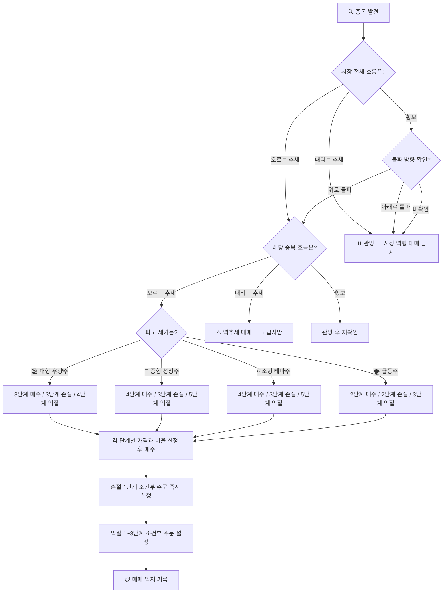
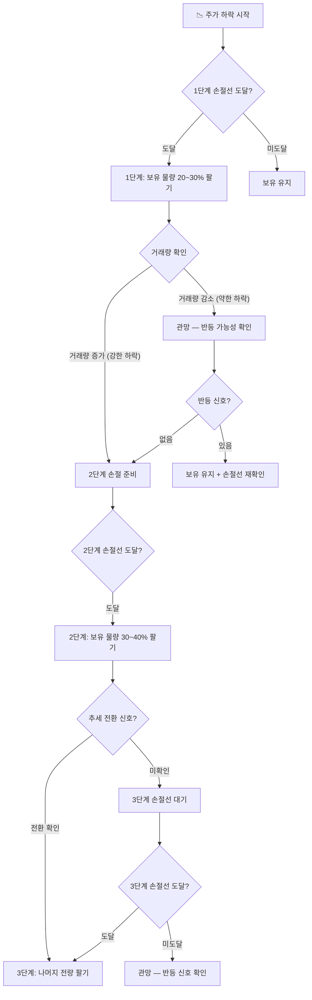
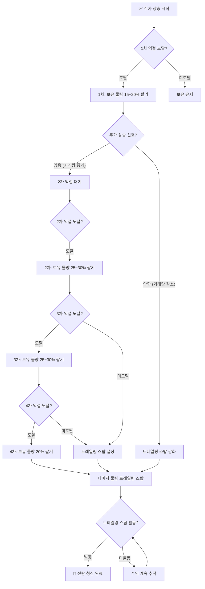
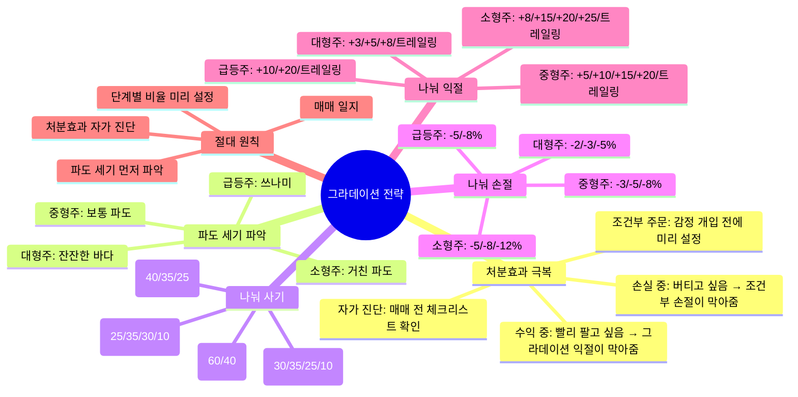

# 📈 국내 주식 기본 전략 가이드
> 파도처럼 흐르는 시장 — 올라타고, 버티고, 빠져나오는 법

---

## 🌊 주식 시장은 파도다

주식 시장은 계속 파도처럼 오르내립니다.  
파도를 무서워하는 사람은 물에 빠지고,  
파도를 이해하는 사람은 서핑을 즐깁니다.

```
        ╭──╮
       ╱    ╲        ← 올라가는 구간 (팔 준비)
      ╱      ╲
─────╯        ╲      ← 내려가는 구간 (살 준비)
               ╲──╯
```

> **핵심 원칙**: 파도의 방향을 읽고, 그 흐름에 올라타는 것이 전략의 전부입니다.

---

## 1. 조건부 주문이란?

조건부 주문은 **"특정 가격이 되면 자동으로 사거나 판다"** 는 주문 방식입니다.  
내가 직접 보지 않아도, 미리 정해둔 계획대로 자동으로 실행됩니다.

| 주문 종류 | 설명 | 목적 |
|-----------|------|------|
| **지정가 주문** | 내가 원하는 가격에 사거나 팔기 | 기본 진입/청산 |
| **손절 주문 (Stop Loss)** | 설정한 가격 아래로 떨어지면 자동으로 팔기 | 손실 막기 |
| **익절 주문 (Take Profit)** | 설정한 가격 위로 오르면 자동으로 팔기 | 수익 챙기기 |
| **트레일링 스탑** | 최고점에서 일정 % 떨어지면 자동으로 팔기 | 수익 최대화 + 보호 |

---

## 2. 🧠 처분효과 — 우리가 틀리게 사고파는 이유

> "수익 난 주식은 빨리 팔고, 손실 난 주식은 오래 들고 있는다"  
> 이것이 바로 **처분효과(Disposition Effect)** 입니다.

### 처분효과란?

처분효과는 행동경제학자 **셰프린과 스태트먼(1985)**이 발견한 심리적 편향입니다.

```
대부분의 투자자가 하는 행동:

수익 중인 주식 → 빨리 팔아버린다 (수익을 확정하고 싶은 심리)
손실 중인 주식 → 오래 들고 있는다 (손실을 인정하기 싫은 심리)
```

이것이 왜 문제일까요?

```
올바른 행동:               처분효과에 빠진 행동:
수익 → 더 오를 때까지 보유  수익 → 빨리 팔아버림 (수익 극대화 실패)
손실 → 빨리 손절           손실 → 오래 들고 있음 (손실 눈덩이)
```

### 처분효과가 생기는 이유 — 전망이론

```
사람은 이익보다 손실을 2배 더 크게 느낍니다.

+10만원 수익의 기쁨 < -10만원 손실의 고통 (2배 더 아픔)

그래서:
  수익 중일 때 → "이 기쁨이 사라질까봐" → 빨리 팔아버림
  손실 중일 때 → "손실을 확정하기 싫어" → 계속 들고 있음
```

### 처분효과가 실제로 미치는 영향

| 상황 | 처분효과에 빠진 행동 | 올바른 행동 |
|------|-----------------|-----------|
| 주가 +5% | 빨리 전량 매도 | 단계적 익절 + 트레일링 스탑 |
| 주가 -5% | "곧 오르겠지" 버팀 | 1단계 손절 실행 |
| 주가 -15% | "평균단가 낮추자" 물타기 | 2~3단계 손절 실행 |
| 주가 +30% | 이미 팔아서 없음 | 트레일링 스탑으로 계속 보유 |

### 처분효과를 이기는 방법 — 그라데이션 전략

처분효과를 이기는 가장 강력한 도구가 바로 **그라데이션 전략**과 **조건부 주문**입니다.

```
처분효과 극복 원리:

수익 중일 때 → 전량 팔고 싶은 충동 → 조건부 주문이 막아줌 (단계적으로만 팔림)
손실 중일 때 → 버티고 싶은 충동 → 조건부 주문이 막아줌 (자동으로 손절 실행)
```

> 💡 **핵심**: 감정이 개입하기 전에 미리 설정해두는 것이 처분효과를 이기는 유일한 방법입니다.

---

## 3. 🎯 그라데이션 전략 — 흑백이 아닌 조금씩 전략

> "한 번에 다 사거나 다 팔지 않는다. 파도처럼 조금씩 올라타고, 조금씩 내려온다."

대부분의 투자자는 **흑백 전략**을 씁니다.
- ❌ "손절선 도달 → 전량 매도" (하지만 처분효과로 실제로는 못 팜)
- ❌ "익절 목표 도달 → 전량 매도" (처분효과로 너무 일찍 팔아버림)

하지만 실제 파도는 한 번에 꺾이지 않습니다.  
**그라데이션 전략**은 주가 변화에 따라 조금씩 반응하면서, 동시에 처분효과도 막아줍니다.

```
흑백 전략:    ──────────────────── 🔴 전량 매도 (처분효과에 취약)
그라데이션:   ──── 20% ──── 30% ──── 30% ──── 20% 🟢 단계적 매도 (처분효과 차단)
```

### 그라데이션 전략의 핵심 원칙

```
매수: 한 번에 다 사지 않는다 → 3~5단계로 나눠 산다
손절: 한 번에 다 팔지 않는다 → 2~3단계로 나눠 판다 (단, 마지막은 결단)
익절: 한 번에 다 팔지 않는다 → 3~5단계로 나눠 판다
```

**처분효과와 그라데이션 전략의 관계**

```
익절 시 처분효과:
  "수익 났으니 빨리 팔자" → 그라데이션 익절이 막아줌
  → 1차에 20%만 팔고, 나머지는 계속 수익 추적

손절 시 처분효과:
  "손실 인정하기 싫어, 조금만 더 기다리자" → 조건부 손절이 막아줌
  → 감정 개입 전에 자동으로 1단계 손절 실행
```

> ⚠️ **손절만큼은 너무 질질 끌면 안 됩니다.**  
> 손절 1단계에서 신호가 더 강해지면 → 망설이지 말고 나머지도 빠르게 실행하세요.  
> 버티고 싶은 마음이 들수록 → 처분효과에 빠진 것입니다.

---

## 3. 🌊 파도 세기별 종목 분류

파도의 크기를 먼저 파악해야 전략을 세울 수 있습니다.

```
🏖️ 잔잔한 바다   │ 대형 우량주   │ 하루 변동폭 ±0.5~2%  │ 삼성전자, 현대차
🌊 보통 파도     │ 중형 성장주   │ 하루 변동폭 ±2~4%    │ 중견 IT, 바이오
🌀 거친 파도     │ 소형 테마주   │ 하루 변동폭 ±3~10%   │ 코스닥 소형주
🌪️ 쓰나미        │ 급등주/작전주 │ 하루 변동폭 ±10~30%  │ 상한가 근접 종목
```

**한국 주식 상·하한가 제도**: 하루 최대 ±30% (코스피/코스닥 동일)

---

## 4. 🔴 그라데이션 손절 전략 — 파도 세기별

### 손절을 나눠서 하는 이유

```
흑백 손절의 문제:
  손절선 -5%에 전량 매도 → 이후 반등해서 +10% 됨 → 억울함

그라데이션 손절의 장점:
  -3%에 30% 팔기 → -5%에 40% 팔기 → -7%에 나머지 30% 팔기
  → 반등 시 일부 물량이 살아있음
  → 추가 하락 시 손실을 단계적으로 줄임
```

> ⚠️ 단, 손절 신호가 강할수록(거래량 폭발 + 추세 전환 확인) → 더 빠르게 실행해야 합니다.

---

### 4-1. 🏖️ 잔잔한 바다 — 대형 우량주 손절 전략

**특징**: 하루 변동폭 ±0.5~2%, 예측 가능, 천천히 움직임

```
매수가: 100,000원 기준

1단계 손절 (-2%): 98,000원 → 보유 물량의 20% 팔기
  → "혹시 일시적 조정일 수 있다, 소량만 줄인다"

2단계 손절 (-3%): 97,000원 → 보유 물량의 30% 팔기
  → "추세가 약해지고 있다, 비중을 줄인다"

3단계 손절 (-5%): 95,000원 → 나머지 50% 전량 팔기
  → "추세 전환 확인, 더 이상 버티지 않는다"
```

| 단계 | 가격 | 매도 비율 | 누적 매도 | 판단 기준 |
|------|------|---------|---------|---------|
| 1단계 | -2% (98,000원) | 20% | 20% | 이동평균선 이탈 시작 |
| 2단계 | -3% (97,000원) | 30% | 50% | 거래량 증가 + 추가 하락 |
| 3단계 | -5% (95,000원) | 50% | 100% | 추세 전환 확정 |

**대형주 손절 포인트**: 20일 이동평균선 아래로 내려가면 1단계 시작

---

### 4-2. 🌊 보통 파도 — 중형 성장주 손절 전략

**특징**: 하루 변동폭 ±2~4%, 실적+테마 복합, 변동성 중간

```
매수가: 100,000원 기준

1단계 손절 (-3%): 97,000원 → 보유 물량의 25% 팔기
  → "변동성 범위 안이지만 신호 확인 중"

2단계 손절 (-5%): 95,000원 → 보유 물량의 35% 팔기
  → "하락 추세 강화, 비중 대폭 축소"

3단계 손절 (-8%): 92,000원 → 나머지 40% 전량 팔기
  → "추세 전환 확정, 전량 청산"
```

| 단계 | 가격 | 매도 비율 | 누적 매도 | 판단 기준 |
|------|------|---------|---------|---------|
| 1단계 | -3% (97,000원) | 25% | 25% | 지지선 이탈 |
| 2단계 | -5% (95,000원) | 35% | 60% | 거래량 증가 + 추세 약화 |
| 3단계 | -8% (92,000원) | 40% | 100% | 추세 전환 확정 |

---

### 4-3. 🌀 거친 파도 — 소형 테마주 손절 전략

**특징**: 하루 변동폭 ±3~10%, 급등락 잦음, 세력 개입 가능성

```
매수가: 100,000원 기준

1단계 손절 (-5%): 95,000원 → 보유 물량의 30% 팔기
  → "변동성 범위 안이지만 방향 확인 필요"

2단계 손절 (-8%): 92,000원 → 보유 물량의 40% 팔기
  → "하락 추세 강화, 빠르게 비중 축소"

3단계 손절 (-12%): 88,000원 → 나머지 30% 전량 팔기
  → "더 이상 기다리지 않는다, 전량 청산"
```

| 단계 | 가격 | 매도 비율 | 누적 매도 | 판단 기준 |
|------|------|---------|---------|---------|
| 1단계 | -5% (95,000원) | 30% | 30% | 지지선 이탈 + 거래량 확인 |
| 2단계 | -8% (92,000원) | 40% | 70% | 추가 하락 + 거래량 폭발 |
| 3단계 | -12% (88,000원) | 30% | 100% | 추세 전환 확정 |

> ⚠️ 소형주는 손절이 늦으면 -20~30%까지 순식간에 빠질 수 있습니다. 1단계 신호가 오면 빠르게 판단하세요.

---

### 4-4. 🌪️ 쓰나미 — 급등주 손절 전략

**특징**: 하루 변동폭 ±10~30%, 예측 불가, 세력 개입

```
급등주는 그라데이션 손절이 어렵습니다.
움직임이 너무 빠르기 때문입니다.

원칙: 2단계 손절로 단순화

1단계 손절 (-5%): 95,000원 → 보유 물량의 50% 팔기
  → "즉시 반응, 절반 청산"

2단계 손절 (-8%): 92,000원 → 나머지 50% 전량 팔기
  → "더 이상 기다리지 않는다"
```

| 단계 | 가격 | 매도 비율 | 누적 매도 | 판단 기준 |
|------|------|---------|---------|---------|
| 1단계 | -5% (95,000원) | 50% | 50% | 즉시 (망설이지 말 것) |
| 2단계 | -8% (92,000원) | 50% | 100% | 즉시 (망설이지 말 것) |

> 💡 급등주는 전체 자산의 5% 이하만 투자하기 때문에, 손절이 빨라도 전체 손실은 작습니다.

---

## 5. 🟢 그라데이션 익절 전략 — 파도 세기별

### 익절을 나눠서 하는 이유

```
흑백 익절의 문제:
  익절선 +10%에 전량 매도 → 이후 +30% 됨 → 아쉬움

그라데이션 익절의 장점:
  +5%에 20% 팔기 → +10%에 30% 팔기 → +20%에 30% 팔기 → 나머지 트레일링
  → 주가가 계속 오를 때도 수익에 계속 참여
  → 고점을 정확히 맞출 필요 없음
  → 심리적으로 안정됨
```

---

### 5-1. 🏖️ 잔잔한 바다 — 대형 우량주 익절 전략

**특징**: 천천히 오르고 천천히 내림, 큰 수익보다 안정적 수익

```
매수가: 100,000원 기준 (목표: 천천히 수익 쌓기)

1차 익절 (+3%): 103,000원 → 보유 물량의 20% 팔기
  → "소액 수익 확정, 심리적 안정"

2차 익절 (+5%): 105,000원 → 보유 물량의 30% 팔기
  → "수익 구간 진입, 비중 축소 시작"

3차 익절 (+8%): 108,000원 → 보유 물량의 30% 팔기
  → "추가 수익 확정"

4차 익절 (트레일링 -3%): 고점 대비 -3% → 나머지 20% 팔기
  → "끝까지 수익 추적, 자동 청산"
```

| 단계 | 가격 | 매도 비율 | 누적 매도 | 방식 |
|------|------|---------|---------|------|
| 1차 | +3% (103,000원) | 20% | 20% | 조건부 지정가 |
| 2차 | +5% (105,000원) | 30% | 50% | 조건부 지정가 |
| 3차 | +8% (108,000원) | 30% | 80% | 조건부 지정가 |
| 4차 | 고점 -3% | 20% | 100% | 트레일링 스탑 |

**대형주 익절 포인트**: 거래량 감소 + 이동평균선 이탈 시작 → 2~3차 익절 앞당기기

---

### 5-2. 🌊 보통 파도 — 중형 성장주 익절 전략

**특징**: 큰 파도를 탈 수 있지만 변동성도 큼

```
매수가: 100,000원 기준 (목표: 파도 끝까지 타기)

1차 익절 (+5%): 105,000원 → 보유 물량의 15% 팔기
  → "소량 수익 확정, 심리적 안정"

2차 익절 (+10%): 110,000원 → 보유 물량의 25% 팔기
  → "수익 구간 진입, 비중 일부 축소"

3차 익절 (+15%): 115,000원 → 보유 물량의 30% 팔기
  → "추가 수익 확정"

4차 익절 (+20%): 120,000원 → 보유 물량의 20% 팔기
  → "큰 수익 구간, 추가 확정"

5차 익절 (트레일링 -6%): 고점 대비 -6% → 나머지 10% 팔기
  → "끝까지 수익 추적, 자동 청산"
```

| 단계 | 가격 | 매도 비율 | 누적 매도 | 방식 |
|------|------|---------|---------|------|
| 1차 | +5% (105,000원) | 15% | 15% | 조건부 지정가 |
| 2차 | +10% (110,000원) | 25% | 40% | 조건부 지정가 |
| 3차 | +15% (115,000원) | 30% | 70% | 조건부 지정가 |
| 4차 | +20% (120,000원) | 20% | 90% | 조건부 지정가 |
| 5차 | 고점 -6% | 10% | 100% | 트레일링 스탑 |

---

### 5-3. 🌀 거친 파도 — 소형 테마주 익절 전략

**특징**: 빠르게 오르고 빠르게 내림, 타이밍이 핵심

```
매수가: 100,000원 기준 (목표: 빠른 수익 확정 + 일부 끝까지 보유)

1차 익절 (+8%): 108,000원 → 보유 물량의 20% 팔기
  → "빠른 수익 확정 시작"

2차 익절 (+15%): 115,000원 → 보유 물량의 25% 팔기
  → "수익 구간, 비중 축소"

3차 익절 (+20%): 120,000원 → 보유 물량의 25% 팔기
  → "추가 수익 확정"

4차 익절 (+25%): 125,000원 → 보유 물량의 20% 팔기
  → "큰 수익 구간"

5차 익절 (트레일링 -10%): 고점 대비 -10% → 나머지 10% 팔기
  → "마지막 물량 자동 청산"
```

| 단계 | 가격 | 매도 비율 | 누적 매도 | 방식 |
|------|------|---------|---------|------|
| 1차 | +8% (108,000원) | 20% | 20% | 조건부 지정가 |
| 2차 | +15% (115,000원) | 25% | 45% | 조건부 지정가 |
| 3차 | +20% (120,000원) | 25% | 70% | 조건부 지정가 |
| 4차 | +25% (125,000원) | 20% | 90% | 조건부 지정가 |
| 5차 | 고점 -10% | 10% | 100% | 트레일링 스탑 |

> 💡 소형주는 고점에서 순식간에 -20~30% 빠질 수 있습니다. 1~2차 익절을 빠르게 실행하는 것이 핵심입니다.

---

### 5-4. 🌪️ 쓰나미 — 급등주 익절 전략

**특징**: 하루에 +20~30% 오를 수 있지만, 같은 속도로 내릴 수도 있음

```
급등주는 빠른 판단이 핵심입니다.
조건부 주문보다 직접 판단 매도 비중이 높아집니다.

매수가: 100,000원 기준

1차 익절 (+10%): 110,000원 → 보유 물량의 30% 팔기
  → "빠른 수익 확정 (가장 중요)"

2차 익절 (+20%): 120,000원 → 보유 물량의 40% 팔기
  → "추가 수익 확정"

3차 익절 (트레일링 -10%): 고점 대비 -10% → 나머지 30% 팔기
  → "마지막 물량 자동 청산"
```

| 단계 | 가격 | 매도 비율 | 누적 매도 | 방식 |
|------|------|---------|---------|------|
| 1차 | +10% (110,000원) | 30% | 30% | 직접 판단 매도 |
| 2차 | +20% (120,000원) | 40% | 70% | 직접 판단 매도 |
| 3차 | 고점 -10% | 30% | 100% | 트레일링 스탑 |

---

## 6. 🛒 그라데이션 매수 전략 — 파도 세기별

### 매수를 나눠서 하는 이유

```
한 번에 다 사는 문제:
  100,000원에 전량 매수 → 이후 90,000원으로 하락 → 평균단가 높음

그라데이션 매수의 장점:
  100,000원에 30% 매수 → 95,000원에 40% 매수 → 90,000원에 30% 매수
  → 평균 매수가: 95,500원
  → 이후 반등 시 수익 구간 빨리 진입
```

---

### 6-1. 🏖️ 잔잔한 바다 — 대형 우량주 매수 전략

```
[안전 진입 — 하락 시 나눠 사기]
현재가 100,000원 기준

1차 매수 (현재가): 100,000원 → 예산의 40%
  → "진입 신호 확인, 첫 발 담그기"

2차 매수 (-1.5%): 98,500원 → 예산의 35%
  → "추가 하락 시 평균단가 낮추기"

3차 매수 (-3%): 97,000원 → 예산의 25%
  → "바닥 구간, 마지막 매수"
```

| 단계 | 가격 | 매수 비율 | 누적 매수 | 조건 |
|------|------|---------|---------|------|
| 1차 | 현재가 | 40% | 40% | 20일선 위 + 거래량 확인 |
| 2차 | -1.5% | 35% | 75% | 지지선 근처 |
| 3차 | -3% | 25% | 100% | 바닥 신호 확인 |

---

### 6-2. 🌊 보통 파도 — 중형 성장주 매수 전략

```
[추세 추종 진입 — 상승 확인 후 나눠 사기]
현재가 100,000원 기준

1차 매수 (현재가): 100,000원 → 예산의 30%
  → "추세 확인 후 소량 진입"

2차 매수 (-2%): 98,000원 → 예산의 35%
  → "조정 시 추가 매수"

3차 매수 (-4%): 96,000원 → 예산의 25%
  → "지지선 근처 추가 매수"

4차 매수 (-6%): 94,000원 → 예산의 10%
  → "바닥 구간, 마지막 소량 매수"
```

| 단계 | 가격 | 매수 비율 | 누적 매수 | 조건 |
|------|------|---------|---------|------|
| 1차 | 현재가 | 30% | 30% | 추세 확인 |
| 2차 | -2% | 35% | 65% | 조정 구간 |
| 3차 | -4% | 25% | 90% | 지지선 근처 |
| 4차 | -6% | 10% | 100% | 바닥 신호 |

---

### 6-3. 🌀 거친 파도 — 소형 테마주 매수 전략

```
[모멘텀 진입 — 상승 추세 확인 후 나눠 사기]
현재가 100,000원 기준

1차 매수 (현재가): 100,000원 → 예산의 25%
  → "모멘텀 확인 후 소량 진입"

2차 매수 (-3%): 97,000원 → 예산의 35%
  → "조정 시 추가 매수"

3차 매수 (-6%): 94,000원 → 예산의 30%
  → "지지선 근처 추가 매수"

4차 매수 (-9%): 91,000원 → 예산의 10%
  → "바닥 구간, 마지막 소량 매수"
```

| 단계 | 가격 | 매수 비율 | 누적 매수 | 조건 |
|------|------|---------|---------|------|
| 1차 | 현재가 | 25% | 25% | 거래량 폭발 + 모멘텀 확인 |
| 2차 | -3% | 35% | 60% | 조정 구간 |
| 3차 | -6% | 30% | 90% | 지지선 근처 |
| 4차 | -9% | 10% | 100% | 바닥 신호 |

> ⚠️ 소형주는 손절선(-12%)을 반드시 미리 설정하고 매수하세요.

---

### 6-4. 🌪️ 쓰나미 — 급등주 매수 전략

```
급등주는 나눠 사기가 어렵습니다.
움직임이 너무 빠르기 때문입니다.

원칙: 2단계 매수로 단순화

1차 매수 (현재가): 예산의 60%
  → "모멘텀 확인 즉시 진입"

2차 매수 (-3%): 예산의 40%
  → "소폭 조정 시 추가 진입"

손절선 (-5%): 즉시 설정 (매수와 동시에)
```

> 💡 급등주는 전체 자산의 5% 이하만 투자하기 때문에, 2단계로 단순화해도 리스크는 작습니다.

---

## 7. 📊 파도 세기별 전략 한눈에 보기

### 7-1. 종목 유형별 매수/손절/익절 비율 전체 정리

#### 🏖️ 잔잔한 바다 — 대형 우량주 (삼성전자, 현대차 등)

```
투자 비중: 전체 자산의 20~30%
하루 변동폭: ±0.5~2%

[매수 — 3단계]
현재가: 40% → -1.5%: 35% → -3%: 25%

[손절 — 3단계]
-2%: 20% 팔기 → -3%: 30% 팔기 → -5%: 나머지 50% 팔기

[익절 — 4단계]
+3%: 20% 팔기 → +5%: 30% 팔기 → +8%: 30% 팔기 → 트레일링(-3%): 20% 팔기
```

#### 🌊 보통 파도 — 중형 성장주 (중견 IT, 바이오 등)

```
투자 비중: 전체 자산의 10~20%
하루 변동폭: ±2~4%

[매수 — 4단계]
현재가: 30% → -2%: 35% → -4%: 25% → -6%: 10%

[손절 — 3단계]
-3%: 25% 팔기 → -5%: 35% 팔기 → -8%: 나머지 40% 팔기

[익절 — 5단계]
+5%: 15% 팔기 → +10%: 25% 팔기 → +15%: 30% 팔기 → +20%: 20% 팔기 → 트레일링(-6%): 10% 팔기
```

#### 🌀 거친 파도 — 소형 테마주 (코스닥 소형주 등)

```
투자 비중: 전체 자산의 5~10%
하루 변동폭: ±3~10%

[매수 — 4단계]
현재가: 25% → -3%: 35% → -6%: 30% → -9%: 10%

[손절 — 3단계]
-5%: 30% 팔기 → -8%: 40% 팔기 → -12%: 나머지 30% 팔기

[익절 — 5단계]
+8%: 20% 팔기 → +15%: 25% 팔기 → +20%: 25% 팔기 → +25%: 20% 팔기 → 트레일링(-10%): 10% 팔기
```

#### 🌪️ 쓰나미 — 급등주 (상한가 근접 종목)

```
투자 비중: 전체 자산의 5% 이하
하루 변동폭: ±10~30%

[매수 — 2단계]
현재가: 60% → -3%: 40%

[손절 — 2단계]
-5%: 50% 팔기 → -8%: 나머지 50% 팔기

[익절 — 3단계]
+10%: 30% 팔기 → +20%: 40% 팔기 → 트레일링(-10%): 30% 팔기
```

---

### 7-2. 파도 세기별 전략 비교표

| 구분 | 🏖️ 대형 우량주 | 🌊 중형 성장주 | 🌀 소형 테마주 | 🌪️ 급등주 |
|------|-------------|-------------|-------------|---------|
| **투자 비중** | 20~30% | 10~20% | 5~10% | 5% 이하 |
| **매수 단계** | 3단계 | 4단계 | 4단계 | 2단계 |
| **손절 단계** | 3단계 | 3단계 | 3단계 | 2단계 |
| **익절 단계** | 4단계 | 5단계 | 5단계 | 3단계 |
| **1차 손절** | -2% (20%) | -3% (25%) | -5% (30%) | -5% (50%) |
| **최종 손절** | -5% (전량) | -8% (전량) | -12% (전량) | -8% (전량) |
| **1차 익절** | +3% (20%) | +5% (15%) | +8% (20%) | +10% (30%) |
| **트레일링** | -3% | -6% | -10% | -10% |

---

## 8. 💡 그라데이션 전략 실전 예시

### 예시 1: 삼성전자 (대형 우량주) — 잔잔한 바다

```
상황: 삼성전자 80,000원에 1차 매수 (예산 300만원)

[매수 계획]
1차: 80,000원 × 40% = 120만원어치 매수
2차: 78,800원 (-1.5%) × 35% = 105만원어치 매수 예약
3차: 77,600원 (-3%) × 25% = 75만원어치 매수 예약

[손절 계획 — 즉시 설정]
1단계: 78,400원 (-2%) → 보유 물량의 20% 팔기
2단계: 77,600원 (-3%) → 보유 물량의 30% 팔기
3단계: 76,000원 (-5%) → 나머지 50% 전량 팔기

[익절 계획]
1차: 82,400원 (+3%) → 보유 물량의 20% 팔기
2차: 84,000원 (+5%) → 보유 물량의 30% 팔기
3차: 86,400원 (+8%) → 보유 물량의 30% 팔기
4차: 트레일링 스탑 -3% → 나머지 20% 자동 청산
```

### 예시 2: 코스닥 성장주 (중형 성장주) — 보통 파도

```
상황: 코스닥 성장주 50,000원에 1차 매수 (예산 150만원)

[매수 계획]
1차: 50,000원 × 30% = 45만원어치 매수
2차: 49,000원 (-2%) × 35% = 52.5만원어치 매수 예약
3차: 48,000원 (-4%) × 25% = 37.5만원어치 매수 예약
4차: 47,000원 (-6%) × 10% = 15만원어치 매수 예약

[손절 계획 — 즉시 설정]
1단계: 48,500원 (-3%) → 보유 물량의 25% 팔기
2단계: 47,500원 (-5%) → 보유 물량의 35% 팔기
3단계: 46,000원 (-8%) → 나머지 40% 전량 팔기

[익절 계획]
1차: 52,500원 (+5%) → 보유 물량의 15% 팔기
2차: 55,000원 (+10%) → 보유 물량의 25% 팔기
3차: 57,500원 (+15%) → 보유 물량의 30% 팔기
4차: 60,000원 (+20%) → 보유 물량의 20% 팔기
5차: 트레일링 스탑 -6% → 나머지 10% 자동 청산
```

---

## 9. 🌊 파도 전략 통합 — 전체 흐름

```
[주가 하락 구간]                    [주가 상승 구간]
    │                                     │
    ▼                                     ▼
손절 1단계 (소량) ──→ 바닥 확인 ──→ 나눠서 사기 ──→ 상승 추세 확인 ──→ 나눠서 팔기
    │                                                               │
    ▼                                                               │
손절 2단계 (중량)                                        트레일링 스탑으로 수익 보호
    │                                                               │
    ▼                                                               │
손절 3단계 (전량) ──────────────────────────────────────────────────┘
```

---

## 10. 📋 조건부 주문 vs 일반 주문 — 종목 유형별 비교표

### 10-1. 주문 방식 비교

| 구분 | 일반 주문 | 조건부 주문 |
|------|----------|-----------|
| **실행 방식** | 내가 직접 사거나 팔기 | 미리 설정한 조건 충족 시 자동 실행 |
| **감정 개입** | 높음 (공포/욕심에 흔들림) | 낮음 (자동 실행) |
| **적합한 상황** | 시장 감시 가능, 빠른 판단 필요 시 | 장중 모니터링 불가, 원칙 매매 시 |
| **장점** | 유연한 대응, 상황 판단 가능 | 원칙 지키기, 24시간 보호 |
| **단점** | 감정적 매매 위험, 타이밍 놓칠 수 있음 | 급변 시 불리한 가격에 체결 가능 |

---

### 10-2. 종목 유형별 주문 방식 전략표

| 종목 유형 | 매수 방식 | 매도 (익절) | 매도 (손절) | 추천 주문 비율 |
|-----------|---------|-----------|-----------|-------------|
| **대형 우량주** | 조건부: 지정가 나눠 사기 | 조건부: 익절 주문 (나눠 팔기) | 조건부: 손절 주문 | 조건부 80% / 일반 20% |
| **중형 성장주** | 일반 50% + 조건부 50% | 조건부: 트레일링 스탑 | 조건부: 손절 주문 | 조건부 60% / 일반 40% |
| **소형 테마주** | 일반: 시장가 즉시 진입 | 일반: 직접 판단 매도 | 조건부: 손절 주문 (필수) | 조건부 40% / 일반 60% |
| **급등주** | 일반: 시장가 즉시 진입 | 일반: 즉시 판단 매도 | 조건부: 손절 주문 (필수) | 조건부 30% / 일반 70% |

> **핵심**: 어떤 종목이든 **손절은 반드시 조건부 주문**으로 설정합니다.

---

## 11. 📋 매매 전 체크리스트

### 사기 전
- [ ] 이 종목은 어떤 파도인가? (대형/중형/소형/급등)
- [ ] 매수 단계와 비율을 미리 정했는가?
- [ ] 손절 단계와 비율을 미리 정했는가?
- [ ] 익절 단계와 비율을 미리 정했는가?
- [ ] 전체 자산 대비 몇 % 투자인가?
- [ ] 시장 전체 흐름은 어떤가?

### 팔기 전
- [ ] 몇 단계 손절/익절 신호인가?
- [ ] 거래량이 신호를 뒷받침하는가?
- [ ] 추세가 바뀌었는가?
- [ ] 계획대로 실행하고 있는가?

### 처분효과 자가 진단 (매매 전 반드시 확인)

**수익 중일 때 — 이 생각이 들면 처분효과 경고**
- [ ] "조금만 더 오르면 팔겠다"고 계속 미루고 있는가? → 트레일링 스탑 설정했는가?
- [ ] "수익이 줄어들까봐" 불안해서 빨리 팔고 싶은가? → 계획된 익절 단계 지키기
- [ ] 익절 계획 없이 감으로 팔려 하는가? → 그라데이션 익절 계획 먼저 수립

**손실 중일 때 — 이 생각이 들면 처분효과 경고**
- [ ] "곧 오를 것 같아서" 손절을 미루고 있는가? → 즉시 1단계 손절 실행
- [ ] 손절선을 아래로 내리고 싶은가? → 절대 금지, 원래 손절선 지키기
- [ ] "평균단가 낮추자"며 계획 없이 추가 매수하려는가? → 무계획 물타기 금지

---

## 12. 🧠 투자 의사결정 순서도 (Mermaid)

### 12-1. 매매 전 사고 순서도



---

### 12-2. 그라데이션 손절 순서도



---

### 12-3. 그라데이션 익절 순서도



---

## 13. 📊 종합 전략 매트릭스

| 투자 성향 | 종목 유형 | 하락 구간 | 상승 구간 | 횡보 구간 |
|-----------|---------|---------|---------|---------|
| **🛡️ 안전 추구** | 대형 우량주 | 3단계 나눠 사기 (40/35/25) | 4단계 나눠 팔기 (+3/+5/+8/트레일링) | 보유 유지, 배당 받기 |
| **🛡️ 안전 추구** | 중형 성장주 | 관망 위주, 소량 매수 | 조건부 익절 (+10%) | 관망 |
| **🛡️ 안전 추구** | 소형/급등주 | ❌ 투자 금지 | ❌ 투자 금지 | ❌ 투자 금지 |
| **⚖️ 중간** | 대형 우량주 | 3단계 나눠 사기 | 4단계 나눠 팔기 (+3/+5/+8/트레일링) | 보유 유지 |
| **⚖️ 중간** | 중형 성장주 | 4단계 나눠 사기 (30/35/25/10) | 5단계 나눠 팔기 (+5/+10/+15/+20/트레일링) | 돌파 대기 |
| **⚖️ 중간** | 소형 테마주 | 관망, 소량만 | 일반 판단 매도 (+15%) | 관망 |
| **🔥 공격적** | 대형 우량주 | 3단계 나눠 사기 | 4단계 나눠 팔기 | 보유 유지 |
| **🔥 공격적** | 중형 성장주 | 4단계 나눠 사기 | 5단계 나눠 팔기 | 돌파 대기 |
| **🔥 공격적** | 소형 테마주 | 4단계 나눠 사기 (25/35/30/10) | 5단계 나눠 팔기 (+8/+15/+20/+25/트레일링) | 모멘텀 대기 |

---

## 14. 🎯 핵심 요약



> **"파도를 예측하려 하지 말고, 파도에 반응하는 법을 배워라"**  
> 흑백이 아닌 그라데이션으로 — 조금씩 올라타고, 조금씩 내려오는 것이 진짜 전략입니다.  
> 그리고 처분효과를 항상 경계하세요 — 수익 날 때 더 오래, 손실 날 때 더 빨리.

---

*작성일: 2026년 3월*  
*참고: 이 문서는 교육 목적으로 작성되었으며, 투자 권유가 아닙니다.*
