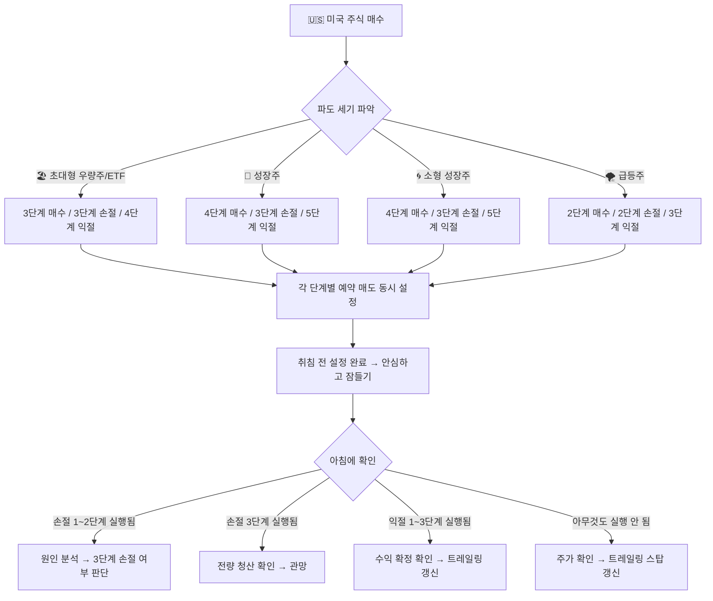

# 🇺🇸 미국 주식 조건부 주문 전략
> 내가 자는 동안에도, 일하는 동안에도 — 주문이 나 대신 일한다

---

## 왜 미국 주식은 조건부 주문이 필수인가?

미국 주식은 한국 시간으로 **밤 11시 30분 ~ 새벽 6시** (서머타임 기준)에 거래됩니다.  
내가 자고 있는 시간에 주가가 움직이기 때문에, 직접 보고 판단하는 건 사실상 불가능합니다.

그래서 미국 주식 투자자에게 조건부 주문은 **선택이 아니라 필수**입니다.

```
한국 투자자의 현실:

낮 12시  → 미국 장 마감 (전날 결과 확인)
밤 11시  → 미국 장 시작 (잠들기 직전)
새벽 1시 → 주가 급등/급락 (자고 있음)
새벽 6시 → 미국 장 마감 (아직 자고 있음)

결론: 조건부 주문 없이는 손절 타이밍을 놓친다
```

---

## 핵심 전략 방향 — 그라데이션 손절/익절

미국 주식에서 가장 중요한 원칙은 네 가지입니다.

**첫째, 손절은 무조건 조건부 주문으로 설정한다.**  
내가 자는 동안 주가가 폭락해도 자동으로 팔아주기 때문입니다.

**둘째, 손절과 익절 모두 한 번에 전량이 아니라 단계적으로 나눠서 실행한다.**  
파도는 한 번에 꺾이지 않습니다. 조금씩 반응하는 것이 더 유리합니다.

**셋째, 익절은 "고점에서 얼마나 떨어지면 팔 것인가"로 설정한다.**  
이것이 바로 **트레일링 스탑(Trailing Stop)** 입니다.

**넷째, 처분효과를 항상 경계한다.**  
미국 주식은 내가 자는 동안 움직이기 때문에, 아침에 일어나서 결과를 보고 감정적으로 반응하기 쉽습니다.  
조건부 주문이 처분효과를 막아주는 가장 강력한 도구입니다.

---

## 🧠 처분효과 — 미국 주식에서 특히 위험한 이유

> "수익 난 주식은 빨리 팔고, 손실 난 주식은 오래 들고 있는다"  
> 이것이 **처분효과(Disposition Effect)** 입니다.

### 미국 주식에서 처분효과가 더 위험한 이유

```
국내 주식: 장 중에 주가를 보면서 감정이 서서히 쌓임
미국 주식: 아침에 일어나서 결과를 한 번에 확인
           → 감정이 한꺼번에 폭발 → 충동적 결정 가능성 높음
```

**아침에 일어났을 때 흔한 처분효과 패턴**

| 상황 | 처분효과에 빠진 행동 | 올바른 행동 |
|------|-----------------|-----------|
| 밤새 +10% 상승 | "빨리 팔자!" 즉시 전량 매도 | 계획된 익절 단계 확인 후 실행 |
| 밤새 -8% 하락 | "곧 오르겠지" 손절 취소 | 조건부 손절이 이미 자동 실행됨 |
| 손절 자동 실행됨 | "다시 살까?" 즉시 재매수 | 최소 1~2일 관망 후 재진입 |
| 트레일링 스탑 발동 | "더 오를 것 같은데..." 후회 | 수익 확정 인정, 다음 종목 탐색 |

### 조건부 주문이 처분효과를 막는 원리

```
처분효과 발동 시점:        조건부 주문이 막아주는 방법:

아침에 +10% 확인           → 이미 1~2차 익절 자동 실행됨
"빨리 팔자" 충동 발생       → 나머지는 트레일링 스탑이 관리 중
                           → 충동적으로 팔 물량이 없음 ✅

아침에 -8% 확인            → 이미 1~2단계 손절 자동 실행됨
"버티자" 충동 발생          → 버틸 물량이 줄어있음
                           → 추가 하락 시 3단계 자동 실행 ✅
```

> 💡 **핵심**: 취침 전에 모든 주문을 설정해두면, 아침에 감정이 개입할 여지가 없습니다.

---

## 트레일링 스탑이 뭔지 쉽게 이해하기

### 비유: 줄 달린 연

연을 날린다고 생각해 보세요.  
연이 높이 올라갈수록 줄을 더 풀어줍니다.  
하지만 연이 아래로 내려오기 시작하면, 줄이 팽팽해지면서 잡아당깁니다.

트레일링 스탑이 딱 이 방식입니다.

```
주가가 오를 때  → 자동 매도선도 같이 올라감 (줄을 풀어줌)
주가가 내릴 때  → 자동 매도선에서 멈춤 (줄이 팽팽해짐)
설정한 % 하락   → 자동으로 매도 실행 (연을 잡아당김)
```

### 숫자로 보는 예시

```
애플 주식을 100달러에 매수
트레일링 스탑 -10% 설정

주가 100달러 → 자동 매도선: 90달러
주가 120달러 → 자동 매도선: 108달러  (자동으로 올라감)
주가 150달러 → 자동 매도선: 135달러  (계속 올라감)
주가 160달러 → 자동 매도선: 144달러  (최고점 갱신)

이후 주가가 144달러로 하락
→ 자동 매도 실행! 144달러에 팔림
→ 100달러에 샀으니 +44% 수익 확정
```

핵심은 **내가 최고점이 어딘지 몰라도 된다**는 것입니다.  
주가가 오르는 동안은 계속 보유하다가, 꺾이는 순간 자동으로 팔립니다.

---

## 🎯 그라데이션 전략 — 흑백이 아닌 조금씩 전략

> "한 번에 다 사거나 다 팔지 않는다. 파도처럼 조금씩 올라타고, 조금씩 내려온다."

미국 주식은 내가 자는 동안 움직이기 때문에, **모든 단계를 조건부 주문으로 미리 설정**해야 합니다.

```
흑백 전략 (위험):
  손절선 도달 → 전량 매도 (아침에 일어나보니 -20%)
  익절선 도달 → 전량 매도 (이후 +50% 됨 → 아쉬움)

그라데이션 전략 (안전):
  손절: -3%에 25% → -5%에 35% → -8%에 나머지 40%
  익절: +5%에 15% → +10%에 25% → +15%에 30% → 트레일링으로 나머지
```

---

## 🌊 파도 세기별 종목 분류 (미국 주식)

```
🏖️ 잔잔한 바다   │ 초대형 우량주 + ETF │ 하루 변동폭 ±0.5~2%  │ 애플, MS, SPY, QQQ
🌊 보통 파도     │ 성장주              │ 하루 변동폭 ±2~5%    │ 테슬라, 엔비디아
🌀 거친 파도     │ 소형 성장주          │ 하루 변동폭 ±3~8%    │ 중소형 기술주
🌪️ 쓰나미        │ 밈주식/급등주        │ 하루 변동폭 ±10~30%  │ 급등 중소형주
```

---

## 🔴 그라데이션 손절 전략 — 파도 세기별

### 손절을 나눠서 하는 이유 (미국 주식 특수성)

```
미국 주식의 문제:
  밤새 뉴스 하나로 -5~10% 갭다운 가능
  → 전량 손절 설정 시 불리한 가격에 전부 팔릴 수 있음

그라데이션 손절의 장점:
  1단계: 일부 팔아서 리스크 줄이기
  2단계: 추가 하락 확인 후 더 팔기
  3단계: 추세 전환 확정 시 전량 청산
  → 갭다운 시에도 단계적으로 대응 가능
```

---

### 🏖️ 잔잔한 바다 — 초대형 우량주 + ETF 손절 전략

**대표 종목**: 애플(AAPL), 마이크로소프트(MSFT), SPY, QQQ  
**특징**: 하루 변동폭 ±0.5~2%, 안정적, 예측 가능

```
매수가: 100달러 기준

1단계 손절 (-3%): 97달러 → 보유 물량의 20% 팔기
  → "정상 변동폭 벗어남, 소량 리스크 축소"

2단계 손절 (-5%): 95달러 → 보유 물량의 30% 팔기
  → "하락 추세 강화, 비중 대폭 축소"

3단계 손절 (-8%): 92달러 → 나머지 50% 전량 팔기
  → "추세 전환 확정, 전량 청산"
```

| 단계 | 가격 | 매도 비율 | 누적 매도 | 판단 기준 |
|------|------|---------|---------|---------|
| 1단계 | -3% (97달러) | 20% | 20% | 이동평균선 이탈 |
| 2단계 | -5% (95달러) | 30% | 50% | 거래량 증가 + 추가 하락 |
| 3단계 | -8% (92달러) | 50% | 100% | 추세 전환 확정 |

**토스 설정법**:
```
1단계 손절: 예약 매도 97달러, 수량 전체의 20%
2단계 손절: 예약 매도 95달러, 수량 전체의 30%
3단계 손절: 예약 매도 92달러, 수량 전체의 50%
→ 세 개의 예약 매도를 동시에 설정
```

---

### 🌊 보통 파도 — 성장주 손절 전략

**대표 종목**: 테슬라(TSLA), 엔비디아(NVDA), 메타(META)  
**특징**: 하루 변동폭 ±2~5%, 뉴스에 민감, 큰 움직임

```
매수가: 100달러 기준

1단계 손절 (-5%): 95달러 → 보유 물량의 25% 팔기
  → "변동폭 범위 벗어남, 신호 확인"

2단계 손절 (-8%): 92달러 → 보유 물량의 35% 팔기
  → "하락 추세 강화, 빠르게 비중 축소"

3단계 손절 (-12%): 88달러 → 나머지 40% 전량 팔기
  → "추세 전환 확정, 전량 청산"
```

| 단계 | 가격 | 매도 비율 | 누적 매도 | 판단 기준 |
|------|------|---------|---------|---------|
| 1단계 | -5% (95달러) | 25% | 25% | 지지선 이탈 |
| 2단계 | -8% (92달러) | 35% | 60% | 거래량 증가 + 추세 약화 |
| 3단계 | -12% (88달러) | 40% | 100% | 추세 전환 확정 |

---

### 🌀 거친 파도 — 소형 성장주 손절 전략

**대표 종목**: 중소형 기술주, 바이오텍  
**특징**: 하루 변동폭 ±3~8%, 급등락 빈번

```
매수가: 100달러 기준

1단계 손절 (-6%): 94달러 → 보유 물량의 30% 팔기
  → "변동폭 범위 벗어남, 빠른 대응"

2단계 손절 (-10%): 90달러 → 보유 물량의 40% 팔기
  → "하락 추세 강화, 대폭 축소"

3단계 손절 (-15%): 85달러 → 나머지 30% 전량 팔기
  → "추세 전환 확정, 전량 청산"
```

| 단계 | 가격 | 매도 비율 | 누적 매도 | 판단 기준 |
|------|------|---------|---------|---------|
| 1단계 | -6% (94달러) | 30% | 30% | 지지선 이탈 + 거래량 확인 |
| 2단계 | -10% (90달러) | 40% | 70% | 추가 하락 + 거래량 폭발 |
| 3단계 | -15% (85달러) | 30% | 100% | 추세 전환 확정 |

---

### 🌪️ 쓰나미 — 밈주식/급등주 손절 전략

**특징**: 하루 변동폭 ±10~30%, 예측 불가, 빠른 대응 필수

```
급등주는 그라데이션 손절을 2단계로 단순화합니다.
움직임이 너무 빠르기 때문입니다.

1단계 손절 (-7%): 93달러 → 보유 물량의 50% 팔기
  → "즉시 반응, 절반 청산"

2단계 손절 (-12%): 88달러 → 나머지 50% 전량 팔기
  → "더 이상 기다리지 않는다"
```

| 단계 | 가격 | 매도 비율 | 누적 매도 | 판단 기준 |
|------|------|---------|---------|---------|
| 1단계 | -7% (93달러) | 50% | 50% | 즉시 (망설이지 말 것) |
| 2단계 | -12% (88달러) | 50% | 100% | 즉시 (망설이지 말 것) |

---

## 🟢 그라데이션 익절 전략 — 파도 세기별

### 익절을 나눠서 하는 이유 (미국 주식 특수성)

```
미국 주식의 문제:
  +5%에 전량 익절 설정 → 이후 +50% 됨 → 아쉬움
  트레일링 스탑 하나만 설정 → 작은 조정에 일찍 팔릴 수 있음

그라데이션 익절의 장점:
  단계별로 수익을 확정하면서 → 나머지 물량은 계속 수익 추적
  → 고점을 정확히 맞출 필요 없음
  → 아침에 일어나도 이미 수익이 확정되어 있음
```

---

### 🏖️ 잔잔한 바다 — 초대형 우량주 + ETF 익절 전략

```
매수가: 100달러 기준

1차 익절 (+5%): 105달러 → 보유 물량의 20% 팔기
  → "소액 수익 확정, 심리적 안정"

2차 익절 (+8%): 108달러 → 보유 물량의 30% 팔기
  → "수익 구간 진입, 비중 축소"

3차 익절 (+12%): 112달러 → 보유 물량의 30% 팔기
  → "추가 수익 확정"

4차 익절 (트레일링 -5%): 고점 대비 -5% → 나머지 20% 팔기
  → "끝까지 수익 추적, 자동 청산"
```

| 단계 | 가격 | 매도 비율 | 누적 매도 | 방식 |
|------|------|---------|---------|------|
| 1차 | +5% (105달러) | 20% | 20% | 조건부 예약 매도 |
| 2차 | +8% (108달러) | 30% | 50% | 조건부 예약 매도 |
| 3차 | +12% (112달러) | 30% | 80% | 조건부 예약 매도 |
| 4차 | 고점 -5% | 20% | 100% | 트레일링 스탑 |

**토스 설정법**:
```
1차 익절: 예약 매도 105달러, 수량 전체의 20%
2차 익절: 예약 매도 108달러, 수량 전체의 30%
3차 익절: 예약 매도 112달러, 수량 전체의 30%
4차 익절: 트레일링 스탑 (키움/미래에셋) 또는 매일 아침 수동 갱신 (토스)
→ 네 개의 예약 매도를 동시에 설정
```

---

### 🌊 보통 파도 — 성장주 익절 전략

```
매수가: 100달러 기준

1차 익절 (+7%): 107달러 → 보유 물량의 15% 팔기
  → "소량 수익 확정"

2차 익절 (+12%): 112달러 → 보유 물량의 25% 팔기
  → "수익 구간 진입"

3차 익절 (+18%): 118달러 → 보유 물량의 30% 팔기
  → "추가 수익 확정"

4차 익절 (+25%): 125달러 → 보유 물량의 20% 팔기
  → "큰 수익 구간"

5차 익절 (트레일링 -10%): 고점 대비 -10% → 나머지 10% 팔기
  → "마지막 물량 자동 청산"
```

| 단계 | 가격 | 매도 비율 | 누적 매도 | 방식 |
|------|------|---------|---------|------|
| 1차 | +7% (107달러) | 15% | 15% | 조건부 예약 매도 |
| 2차 | +12% (112달러) | 25% | 40% | 조건부 예약 매도 |
| 3차 | +18% (118달러) | 30% | 70% | 조건부 예약 매도 |
| 4차 | +25% (125달러) | 20% | 90% | 조건부 예약 매도 |
| 5차 | 고점 -10% | 10% | 100% | 트레일링 스탑 |

---

### 🌀 거친 파도 — 소형 성장주 익절 전략

```
매수가: 100달러 기준

1차 익절 (+10%): 110달러 → 보유 물량의 20% 팔기
  → "빠른 수익 확정 시작"

2차 익절 (+18%): 118달러 → 보유 물량의 25% 팔기
  → "수익 구간"

3차 익절 (+25%): 125달러 → 보유 물량의 25% 팔기
  → "추가 수익 확정"

4차 익절 (+35%): 135달러 → 보유 물량의 20% 팔기
  → "큰 수익 구간"

5차 익절 (트레일링 -15%): 고점 대비 -15% → 나머지 10% 팔기
  → "마지막 물량 자동 청산"
```

| 단계 | 가격 | 매도 비율 | 누적 매도 | 방식 |
|------|------|---------|---------|------|
| 1차 | +10% (110달러) | 20% | 20% | 조건부 예약 매도 |
| 2차 | +18% (118달러) | 25% | 45% | 조건부 예약 매도 |
| 3차 | +25% (125달러) | 25% | 70% | 조건부 예약 매도 |
| 4차 | +35% (135달러) | 20% | 90% | 조건부 예약 매도 |
| 5차 | 고점 -15% | 10% | 100% | 트레일링 스탑 |

---

### 🌪️ 쓰나미 — 밈주식/급등주 익절 전략

```
급등주는 빠른 판단이 핵심입니다.
조건부 주문보다 직접 판단 매도 비중이 높아집니다.

매수가: 100달러 기준

1차 익절 (+15%): 115달러 → 보유 물량의 35% 팔기
  → "빠른 수익 확정 (가장 중요)"

2차 익절 (+25%): 125달러 → 보유 물량의 35% 팔기
  → "추가 수익 확정"

3차 익절 (트레일링 -12%): 고점 대비 -12% → 나머지 30% 팔기
  → "마지막 물량 자동 청산"
```

| 단계 | 가격 | 매도 비율 | 누적 매도 | 방식 |
|------|------|---------|---------|------|
| 1차 | +15% (115달러) | 35% | 35% | 직접 판단 매도 |
| 2차 | +25% (125달러) | 35% | 70% | 직접 판단 매도 |
| 3차 | 고점 -12% | 30% | 100% | 트레일링 스탑 |

---

## 🛒 그라데이션 매수 전략 — 파도 세기별

미국 주식은 내가 자는 동안 움직이기 때문에, **매수도 조건부 주문으로 미리 설정**해야 합니다.

---

### 🏖️ 잔잔한 바다 — 초대형 우량주 + ETF 매수 전략

```
현재가: 100달러 기준

1차 매수 (현재가): 100달러 → 예산의 40%
  → "진입 신호 확인, 첫 발 담그기"

2차 매수 (-2%): 98달러 → 예산의 35%
  → "조정 시 추가 매수 (조건부 예약)"

3차 매수 (-4%): 96달러 → 예산의 25%
  → "바닥 구간, 마지막 매수 (조건부 예약)"
```

| 단계 | 가격 | 매수 비율 | 누적 매수 | 방식 |
|------|------|---------|---------|------|
| 1차 | 현재가 | 40% | 40% | 즉시 매수 |
| 2차 | -2% (98달러) | 35% | 75% | 조건부 예약 매수 |
| 3차 | -4% (96달러) | 25% | 100% | 조건부 예약 매수 |

---

### 🌊 보통 파도 — 성장주 매수 전략

```
현재가: 100달러 기준

1차 매수 (현재가): 100달러 → 예산의 30%
  → "추세 확인 후 소량 진입"

2차 매수 (-3%): 97달러 → 예산의 35%
  → "조정 시 추가 매수 (조건부 예약)"

3차 매수 (-6%): 94달러 → 예산의 25%
  → "지지선 근처 추가 매수 (조건부 예약)"

4차 매수 (-9%): 91달러 → 예산의 10%
  → "바닥 구간, 마지막 소량 매수 (조건부 예약)"
```

| 단계 | 가격 | 매수 비율 | 누적 매수 | 방식 |
|------|------|---------|---------|------|
| 1차 | 현재가 | 30% | 30% | 즉시 매수 |
| 2차 | -3% (97달러) | 35% | 65% | 조건부 예약 매수 |
| 3차 | -6% (94달러) | 25% | 90% | 조건부 예약 매수 |
| 4차 | -9% (91달러) | 10% | 100% | 조건부 예약 매수 |

---

### 🌀 거친 파도 — 소형 성장주 매수 전략

```
현재가: 100달러 기준

1차 매수 (현재가): 100달러 → 예산의 25%
  → "모멘텀 확인 후 소량 진입"

2차 매수 (-4%): 96달러 → 예산의 35%
  → "조정 시 추가 매수"

3차 매수 (-8%): 92달러 → 예산의 30%
  → "지지선 근처 추가 매수"

4차 매수 (-12%): 88달러 → 예산의 10%
  → "바닥 구간, 마지막 소량 매수"
```

> ⚠️ 손절선(-15%)을 반드시 매수와 동시에 설정하세요.

---

### 🌪️ 쓰나미 — 밈주식/급등주 매수 전략

```
급등주는 2단계 매수로 단순화합니다.

1차 매수 (현재가): 예산의 60%
  → "모멘텀 확인 즉시 진입"

2차 매수 (-4%): 예산의 40%
  → "소폭 조정 시 추가 진입"

손절선 (-7%): 즉시 설정 (매수와 동시에)
```

---

## 📊 파도 세기별 전략 한눈에 보기

### 종목 유형별 매수/손절/익절 비율 전체 정리

| 구분 | 🏖️ 초대형 우량주 + ETF | 🌊 성장주 | 🌀 소형 성장주 | 🌪️ 급등주 |
|------|---------------------|---------|-------------|---------|
| **투자 비중** | 20~30% | 10~20% | 5~10% | 5% 이하 |
| **매수 단계** | 3단계 | 4단계 | 4단계 | 2단계 |
| **손절 단계** | 3단계 | 3단계 | 3단계 | 2단계 |
| **익절 단계** | 4단계 | 5단계 | 5단계 | 3단계 |
| **1차 손절** | -3% (20%) | -5% (25%) | -6% (30%) | -7% (50%) |
| **최종 손절** | -8% (전량) | -12% (전량) | -15% (전량) | -12% (전량) |
| **1차 익절** | +5% (20%) | +7% (15%) | +10% (20%) | +15% (35%) |
| **트레일링** | -5% | -10% | -15% | -12% |

---

## 토스에서 그라데이션 전략 설정하는 방법

### 토스 앱의 현실 — 직접 트레일링 스탑 기능이 없다

솔직히 말씀드리면, **토스증권은 현재 트레일링 스탑 기능을 직접 제공하지 않습니다.**  
(2026년 기준, 국내 대부분의 증권사 앱에서 미국 주식 트레일링 스탑은 지원이 제한적입니다.)

하지만 **토스에서 그라데이션 전략을 구현하는 방법**이 있습니다.

---

### 방법 1: 토스 "예약 매도" 여러 개 동시 설정

토스에서는 **예약 매도를 여러 개 동시에 설정**할 수 있습니다.  
이것을 이용해서 그라데이션 익절을 구현합니다.

**설정 순서 (성장주 예시: 100달러 매수, 100주 보유)**

```
1단계: 매수 직후 — 손절 예약 매도 설정
   1차 손절: 95달러, 25주 (25%)
   2차 손절: 92달러, 35주 (35%)
   3차 손절: 88달러, 40주 (40%)

2단계: 매수 직후 — 익절 예약 매도 설정
   1차 익절: 107달러, 15주 (15%)
   2차 익절: 112달러, 25주 (25%)
   3차 익절: 118달러, 30주 (30%)
   4차 익절: 125달러, 20주 (20%)
   → 마지막 10주는 트레일링 스탑 (수동 갱신)
```

**단점**: 매일 아침 트레일링 스탑 부분을 직접 수정해야 합니다.  
**장점**: 토스에서 바로 사용 가능, 별도 앱 불필요.

---

### 방법 2: 토스 "알림 설정" + 조건부 주문 콤보

토스에서는 **특정 가격 도달 시 알림**을 받을 수 있습니다.

```
설정 방법:
1. 토스 앱 → 해당 종목 → 알림 설정
2. "주가가 X달러 이상이 되면 알림" 설정
3. 알림 받으면 → 즉시 예약 매도 가격 수정
```

이 방법을 쓰면 매일 확인하지 않아도, **고점 갱신 시 알림을 받고 그때만 수정**하면 됩니다.

---

### 방법 3: 진짜 트레일링 스탑이 필요하다면 — 다른 증권사 활용

| 증권사 | 트레일링 스탑 지원 | 특징 |
|--------|-----------------|------|
| **키움증권 (영웅문)** | ✅ 지원 | 미국 주식 트레일링 스탑 가능 |
| **미래에셋증권** | ✅ 지원 | OCO 주문 (손절+익절 동시 설정) |
| **삼성증권** | ✅ 지원 | 조건부 주문 종류 다양 |
| **토스증권** | ⚠️ 제한적 | 예약 매도만 가능 (수동 갱신 필요) |
| **Interactive Brokers** | ✅ 완전 지원 | 전문 투자자용, 기능 가장 강력 |

> 토스가 편리하고 UI가 좋지만, 트레일링 스탑 자동화가 꼭 필요하다면  
> **키움증권이나 미래에셋증권을 병행 사용**하는 것을 추천합니다.

---

## 미국 주식 실전 전략 순서도



---

## 실전 시나리오 — 그라데이션 전략 적용

### 시나리오 1: 엔비디아 (성장주) — 보통 파도

```
상황: 엔비디아 500달러에 1차 매수 (예산 2,000달러 = 4주)

[취침 전 설정 — 조건부 주문 전부 설정]

매수 예약:
  2차: 485달러 (-3%), 1.4주 (35%)
  3차: 470달러 (-6%), 1주 (25%)
  4차: 455달러 (-9%), 0.4주 (10%)

손절 예약:
  1단계: 475달러 (-5%), 1주 (25%) 팔기
  2단계: 460달러 (-8%), 1.4주 (35%) 팔기
  3단계: 440달러 (-12%), 나머지 전량 팔기

익절 예약:
  1차: 535달러 (+7%), 0.6주 (15%) 팔기
  2차: 560달러 (+12%), 1주 (25%) 팔기
  3차: 590달러 (+18%), 1.2주 (30%) 팔기
  4차: 625달러 (+25%), 0.8주 (20%) 팔기
  마지막 0.4주: 트레일링 스탑 -10%

[이후 주가 흐름 — 상승 시나리오]
500달러 → 535달러 (+7%): 1차 익절 자동 실행 (0.6주 팔림)
535달러 → 560달러 (+12%): 2차 익절 자동 실행 (1주 팔림)
560달러 → 590달러 (+18%): 3차 익절 자동 실행 (1.2주 팔림)
590달러 → 625달러 (+25%): 4차 익절 자동 실행 (0.8주 팔림)
625달러 고점 → 562달러 (-10%): 트레일링 스탑 발동 (마지막 0.4주 팔림)

내가 한 일: 취침 전 모든 주문 설정 → 아침에 결과 확인
```

### 시나리오 2: 엔비디아 (성장주) — 하락 시나리오

```
[이후 주가 흐름 — 하락 시나리오]
500달러 → 475달러 (-5%): 1단계 손절 자동 실행 (1주 팔림, 25% 청산)
  → 아침에 확인: 원인 분석 (일시적 조정? 추세 전환?)

475달러 → 460달러 (-8%): 2단계 손절 자동 실행 (1.4주 팔림, 60% 청산)
  → 아침에 확인: 하락 추세 강화 확인

460달러 → 440달러 (-12%): 3단계 손절 자동 실행 (나머지 전량 팔림)
  → 전량 청산 완료, 손실 확정

결과: 전량 손절보다 평균 손절가가 높음 (단계적으로 팔았기 때문)
```

---

## 미국 주식 투자 루틴 — 하루 5분으로 관리하기

### 아침 루틴 (기상 후 5분)

```
1. 토스 앱 열기 → 보유 종목 확인
2. 어젯밤 주가 흐름 확인
   - 손절 1~2단계 실행됐는가? → 원인 분석, 3단계 여부 판단
   - 손절 3단계 실행됐는가? → 전량 청산 확인, 관망
   - 익절 단계 실행됐는가? → 수익 확정 확인, 트레일링 갱신
   - 아무 변화 없는가? → 트레일링 스탑 가격만 갱신
3. 끝 (5분 이내)
```

### 취침 전 루틴 (잠들기 전 5분)

```
1. 모든 단계별 손절 예약 매도 확인 (아직 살아있는지)
2. 모든 단계별 익절 예약 매도 확인
3. 트레일링 스탑 부분 — 오늘 고점 기준으로 갱신
   예) 오늘 고점 280달러, 트레일링 스탑 10%
   → 예약 매도 가격 = 280 × 0.90 = 252달러로 수정
4. 내일 주목할 이슈 확인 (실적 발표, 연준 회의 등)
5. 설정 완료 → 안심하고 잠들기
```

---

## 미국 주식 조건부 주문 전략 요약표

| 상황 | 주문 방식 | 설정 기준 | 물량 | 비고 |
|------|---------|---------|------|------|
| **매수 직후 1단계 손절** | 조건부 예약 매도 | 매수가 -3~6% | 25~30% | **절대 빠뜨리지 말 것** |
| **2단계 손절** | 조건부 예약 매도 | 매수가 -5~10% | 35~40% | 1단계와 동시 설정 |
| **3단계 손절** | 조건부 예약 매도 | 매수가 -8~15% | 나머지 전량 | 1단계와 동시 설정 |
| **1~4차 익절** | 조건부 예약 매도 | 매수가 +5~35% | 각 15~35% | 취침 전 전부 설정 |
| **마지막 익절** | 트레일링 스탑 | 고점 대비 -5~15% | 나머지 10~30% | 키움/미래에셋 권장 |
| **알림 활용** | 토스 가격 알림 | 고점 +5% 알림 설정 | - | 트레일링 갱신 타이밍 포착 |

---

## 가장 흔한 실수 — 이것만 피하면 된다

**실수 1: 손절을 설정하지 않고 잠든다**  
아침에 일어났을 때 -20%가 되어 있을 수 있습니다.  
→ **매수 직후 1단계 손절 설정이 첫 번째 행동**이어야 합니다.

**실수 2: 손절을 너무 좁게 잡는다**  
미국 주식은 밤새 뉴스 하나로 ±3~5% 움직이는 게 흔합니다.  
손절을 -2%로 잡으면 정상적인 변동에도 팔려버립니다.  
→ **종목 변동성의 1.5~2배로 1단계 손절을 설정**하세요.

**실수 3: 익절 목표를 너무 일찍 잡는다**  
+5%에 전량 익절 주문을 걸어두면, 이후 +50%가 되어도 이미 팔린 상태입니다.  
→ **그라데이션 익절 + 트레일링 스탑으로 수익을 끝까지 추적**하세요.

**실수 4: 손절 후 바로 다시 산다**  
손절이 실행됐다면, 하락 추세가 끝났는지 확인 후 재진입해야 합니다.  
→ **손절 후 최소 1~2일 관망** 후 반등 신호 확인.

**실수 5: 예약 매도를 하나만 설정한다**  
한 번에 전량 손절/익절 설정은 흑백 전략입니다.  
→ **3~5단계로 나눠서 설정**하는 그라데이션 전략을 사용하세요.

**실수 6: 아침에 손실 확인 후 손절 주문을 취소한다 (처분효과)**  
"조금만 더 기다리자"며 자동 실행 예정인 손절 주문을 취소하는 것은 처분효과입니다.  
→ **조건부 주문은 취침 전에 설정하고, 아침에 감정적으로 취소하지 마세요.**  
→ 손절 주문을 취소하고 싶다면 → 처분효과 자가 진단 먼저.

**실수 7: 아침에 수익 확인 후 전량 즉시 매도한다 (처분효과)**  
+10% 수익을 보고 "빨리 팔자"며 모든 예약 매도를 취소하고 전량 시장가 매도하는 것도 처분효과입니다.  
→ **계획된 그라데이션 익절 단계를 지키세요.**  
→ 이미 1~2차 익절이 자동 실행됐다면, 나머지는 트레일링 스탑에 맡기세요.

---

## 핵심 한 줄 요약

> **매수하면 → 3단계 손절 먼저 → 4~5단계 익절 설정 → 트레일링 스탑 → 잠든다**  
> 아침에 일어나서 결과를 확인하고, 트레일링 스탑만 갱신한다.  
> 흑백이 아닌 그라데이션으로, 처분효과를 경계하며 — 이것이 미국 주식 투자자의 가장 현명한 루틴입니다.

---

*작성일: 2026년 3월*  
*참고: 이 문서는 교육 목적으로 작성되었으며, 투자 권유가 아닙니다.*
