# ❓ 주식 자주 묻는 질문 (FAQ)
> 국내 주식 & 미국 주식 — 고등학생도 이해할 수 있는 쉬운 답변

---

## 📌 전체 구조 한눈에 보기

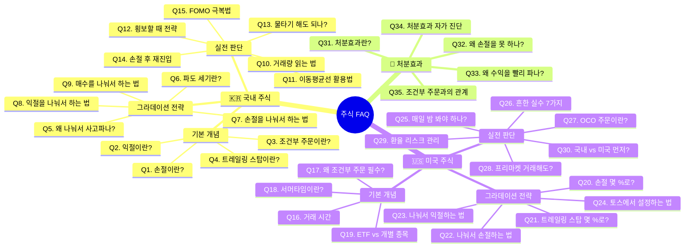
```mermaid
mindmap
  root((주식 FAQ))
    🇰🇷 국내 주식
      기본 개념
        Q1. 손절이란?
        Q2. 익절이란?
        Q3. 조건부 주문이란?
        Q4. 트레일링 스탑이란?
      그라데이션 전략
        Q5. 왜 나눠서 사고파나?
        Q6. 파도 세기란?
        Q7. 손절을 나눠서 하는 법
        Q8. 익절을 나눠서 하는 법
        Q9. 매수를 나눠서 하는 법
      실전 판단
        Q10. 거래량 읽는 법
        Q11. 이동평균선 활용법
        Q12. 횡보할 때 전략
        Q13. 물타기 해도 되나?
        Q14. 손절 후 재진입
        Q15. FOMO 극복법
    🧠 처분효과
      Q31. 처분효과란?
      Q32. 왜 손절을 못 하나?
      Q33. 왜 수익을 빨리 파나?
      Q34. 처분효과 자가 진단
      Q35. 조건부 주문과의 관계
    🇺🇸 미국 주식
      기본 개념
        Q16. 거래 시간
        Q17. 왜 조건부 주문 필수?
        Q18. 서머타임이란?
        Q19. ETF vs 개별 종목
      그라데이션 전략
        Q20. 손절 몇 %로?
        Q21. 트레일링 스탑 몇 %로?
        Q22. 나눠서 손절하는 법
        Q23. 나눠서 익절하는 법
        Q24. 토스에서 설정하는 법
      실전 판단
        Q25. 매일 밤 봐야 하나?
        Q26. 흔한 실수 7가지
        Q27. OCO 주문이란?
        Q28. 프리마켓 거래해도?
        Q29. 환율 리스크 관리
        Q30. 국내 vs 미국 먼저?
```

---

## 📌 목차

- [🇰🇷 국내 주식 FAQ (Q1~Q15)](#-국내-주식-faq)
- [🧠 처분효과 FAQ (Q31~Q35)](#-처분효과-faq)
- [🇺🇸 미국 주식 FAQ (Q16~Q30)](#-미국-주식-faq)

---

## 🇰🇷 국내 주식 FAQ

---

### Q1. 손절이 뭔가요? 꼭 해야 하나요?

**손절**은 주가가 내가 산 가격보다 떨어졌을 때, 더 큰 손실을 막기 위해 파는 것입니다.

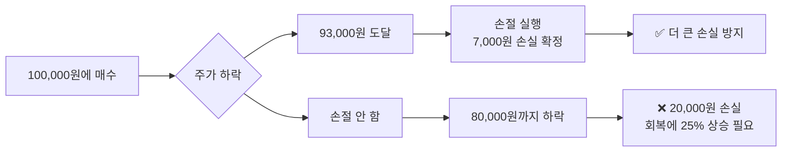
```mermaid
flowchart LR
    A["100,000원에 매수"] --> B{"주가 하락"}
    B --> C["93,000원 도달"]
    C --> D["손절 실행<br>7,000원 손실 확정"]
    D --> E["✅ 더 큰 손실 방지"]
    
    B --> F["손절 안 함"]
    F --> G["80,000원까지 하락"]
    G --> H["❌ 20,000원 손실<br>회복에 25% 상승 필요"]
```

손절이 필요한 이유:

```
10% 손실 → 회복하려면 11% 올라야 함
50% 손실 → 회복하려면 100% 올라야 함
```

손실이 클수록 회복이 훨씬 어려워집니다. 작은 손실을 인정하는 것이 큰 손실을 막는 방법입니다.

---

### Q2. 익절이 뭔가요? 한 번에 다 팔아야 하나요?

**익절**은 주가가 올랐을 때 수익을 챙기고 파는 것입니다. 한 번에 다 팔 필요는 없습니다.

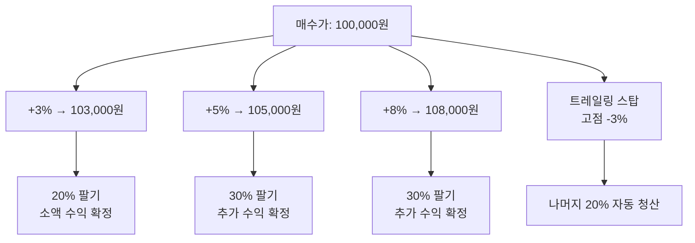
```mermaid
flowchart TD
    A["매수가: 100,000원"] --> B["+3% → 103,000원"]
    B --> C["20% 팔기<br>소액 수익 확정"]
    A --> D["+5% → 105,000원"]
    D --> E["30% 팔기<br>추가 수익 확정"]
    A --> F["+8% → 108,000원"]
    F --> G["30% 팔기<br>추가 수익 확정"]
    A --> H["트레일링 스탑<br>고점 -3%"]
    H --> I["나머지 20% 자동 청산"]
```

나눠서 팔면 주가가 계속 오를 때도 수익에 참여할 수 있고, 고점을 정확히 맞출 필요도 없습니다.

---

### Q3. 조건부 주문과 일반 주문의 차이가 뭔가요?

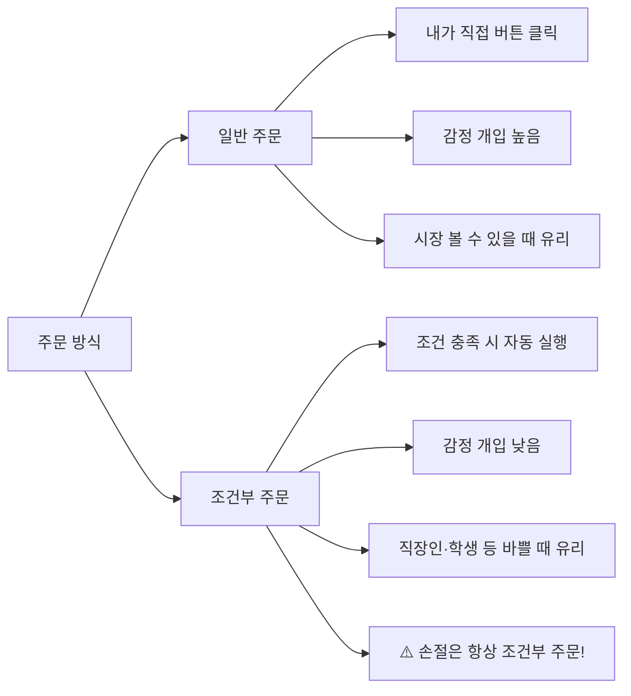
```mermaid
flowchart LR
    A["주문 방식"] --> B["일반 주문"]
    A --> C["조건부 주문"]
    
    B --> B1["내가 직접 버튼 클릭"]
    B --> B2["감정 개입 높음"]
    B --> B3["시장 볼 수 있을 때 유리"]
    
    C --> C1["조건 충족 시 자동 실행"]
    C --> C2["감정 개입 낮음"]
    C --> C3["직장인·학생 등 바쁠 때 유리"]
    
    C --> D["⚠️ 손절은 항상 조건부 주문!"]
```

**어떤 종목이든 손절만큼은 반드시 조건부 주문으로 설정하세요.** 감정이 개입되면 손절 타이밍을 놓칩니다.

---

### Q4. 트레일링 스탑이 뭔가요?

**트레일링 스탑**은 주가가 오를 때 자동 매도선도 같이 올라가다가, 주가가 꺾이면 자동으로 파는 주문입니다.

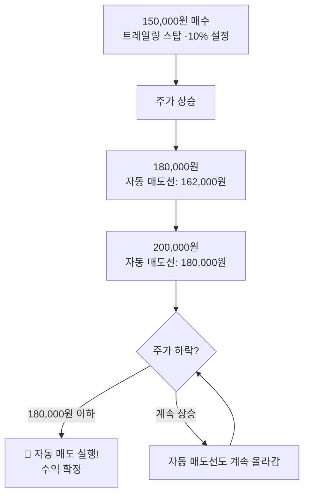
```mermaid
flowchart TD
    A["150,000원 매수<br>트레일링 스탑 -10% 설정"] --> B["주가 상승"]
    B --> C["180,000원<br>자동 매도선: 162,000원"]
    C --> D["200,000원<br>자동 매도선: 180,000원"]
    D --> E{"주가 하락?"}
    E -->|"180,000원 이하"| F["🔴 자동 매도 실행!<br>수익 확정"]
    E -->|"계속 상승"| G["자동 매도선도 계속 올라감"]
    G --> E
```

최고점이 어딘지 몰라도 됩니다. 주가가 오르는 동안 계속 보유하다가, 꺾이는 순간 자동으로 팔립니다.

---

### Q5. 왜 한 번에 다 사거나 팔지 않고 나눠서 해야 하나요? (그라데이션 전략)

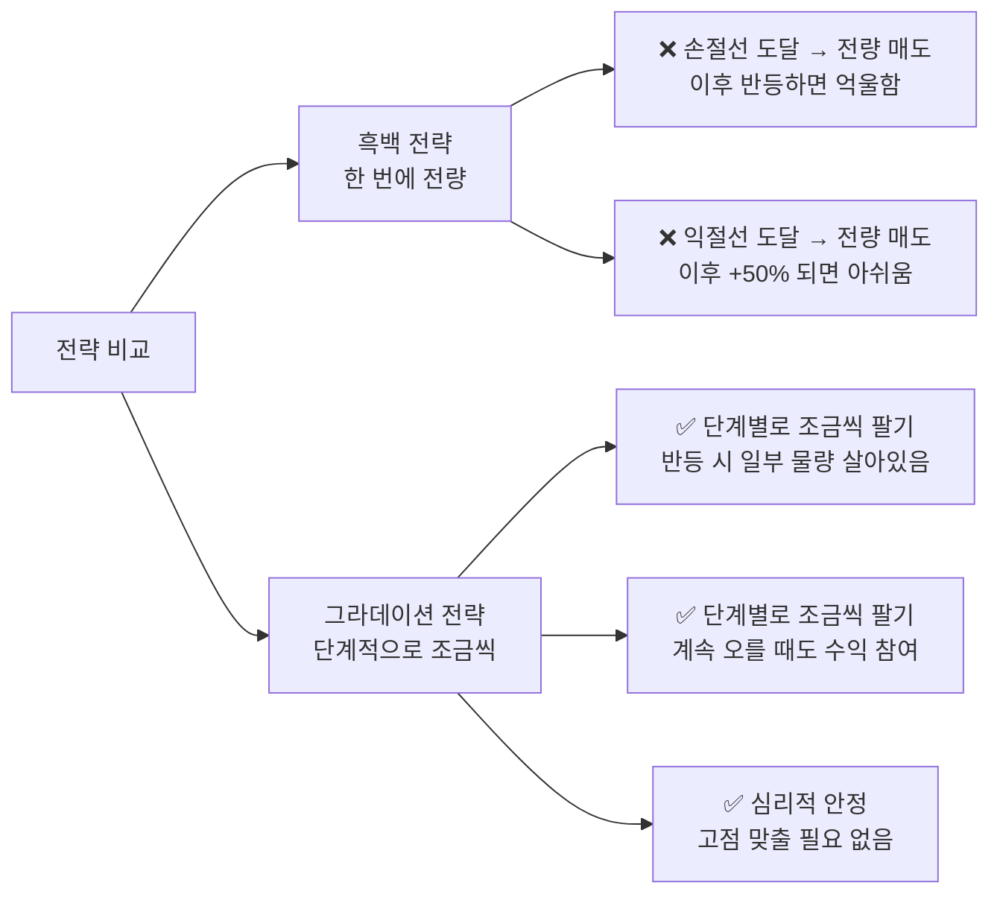
```mermaid
flowchart LR
    A["전략 비교"] --> B["흑백 전략<br>한 번에 전량"]
    A --> C["그라데이션 전략<br>단계적으로 조금씩"]
    
    B --> B1["❌ 손절선 도달 → 전량 매도<br>이후 반등하면 억울함"]
    B --> B2["❌ 익절선 도달 → 전량 매도<br>이후 +50% 되면 아쉬움"]
    
    C --> C1["✅ 단계별로 조금씩 팔기<br>반등 시 일부 물량 살아있음"]
    C --> C2["✅ 단계별로 조금씩 팔기<br>계속 오를 때도 수익 참여"]
    C --> C3["✅ 심리적 안정<br>고점 맞출 필요 없음"]
```

파도는 한 번에 꺾이지 않습니다. 조금씩 반응하는 것이 더 유리합니다.

---

### Q6. 파도 세기별 종목 분류가 뭔가요?

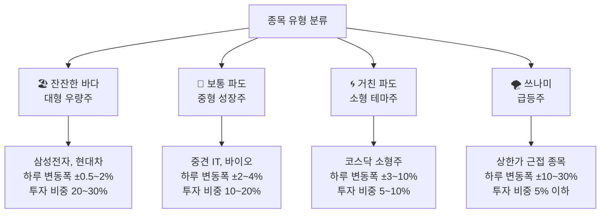
```mermaid
flowchart TD
    A["종목 유형 분류"] --> B["🏖️ 잔잔한 바다<br>대형 우량주"]
    A --> C["🌊 보통 파도<br>중형 성장주"]
    A --> D["🌀 거친 파도<br>소형 테마주"]
    A --> E["🌪️ 쓰나미<br>급등주"]
    
    B --> B1["삼성전자, 현대차<br>하루 변동폭 ±0.5~2%<br>투자 비중 20~30%"]
    C --> C1["중견 IT, 바이오<br>하루 변동폭 ±2~4%<br>투자 비중 10~20%"]
    D --> D1["코스닥 소형주<br>하루 변동폭 ±3~10%<br>투자 비중 5~10%"]
    E --> E1["상한가 근접 종목<br>하루 변동폭 ±10~30%<br>투자 비중 5% 이하"]
```

파도의 크기를 먼저 파악해야 손절/익절 비율을 정할 수 있습니다.

---

### Q7. 손절을 나눠서 하는 방법은 어떻게 되나요?

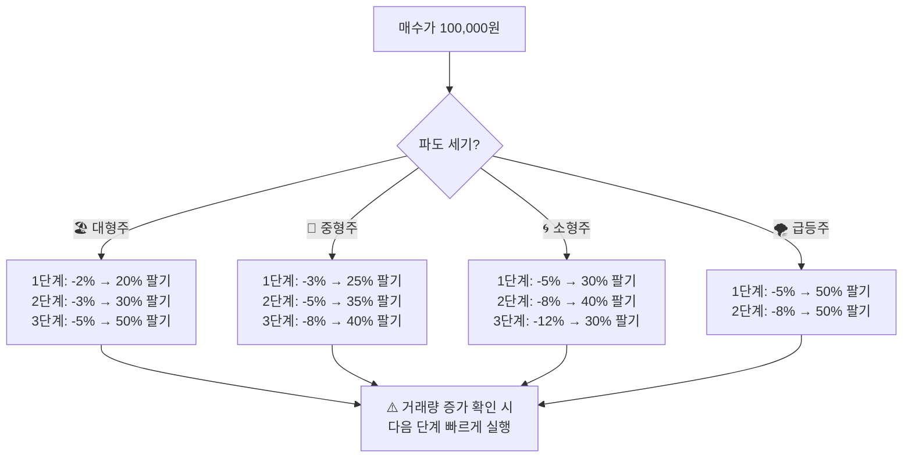
```mermaid
flowchart TD
    A["매수가 100,000원"] --> B{"파도 세기?"}
    
    B -->|"🏖️ 대형주"| C["1단계: -2% → 20% 팔기<br>2단계: -3% → 30% 팔기<br>3단계: -5% → 50% 팔기"]
    B -->|"🌊 중형주"| D["1단계: -3% → 25% 팔기<br>2단계: -5% → 35% 팔기<br>3단계: -8% → 40% 팔기"]
    B -->|"🌀 소형주"| E["1단계: -5% → 30% 팔기<br>2단계: -8% → 40% 팔기<br>3단계: -12% → 30% 팔기"]
    B -->|"🌪️ 급등주"| F["1단계: -5% → 50% 팔기<br>2단계: -8% → 50% 팔기"]
    
    C --> G["⚠️ 거래량 증가 확인 시<br>다음 단계 빠르게 실행"]
    D --> G
    E --> G
    F --> G
```

> 손절 신호가 강할수록(거래량 폭발 + 추세 전환) → 더 빠르게 다음 단계를 실행하세요.

---

### Q8. 익절을 나눠서 하는 방법은 어떻게 되나요?

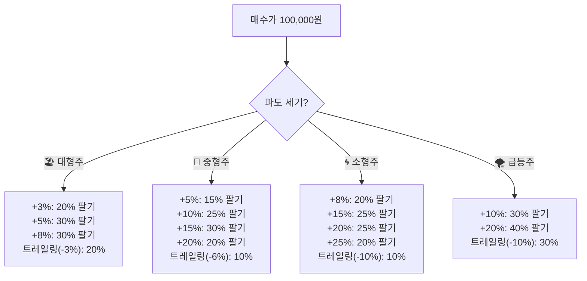
```mermaid
flowchart TD
    A["매수가 100,000원"] --> B{"파도 세기?"}
    
    B -->|"🏖️ 대형주"| C["+3%: 20% 팔기<br>+5%: 30% 팔기<br>+8%: 30% 팔기<br>트레일링(-3%): 20%"]
    B -->|"🌊 중형주"| D["+5%: 15% 팔기<br>+10%: 25% 팔기<br>+15%: 30% 팔기<br>+20%: 20% 팔기<br>트레일링(-6%): 10%"]
    B -->|"🌀 소형주"| E["+8%: 20% 팔기<br>+15%: 25% 팔기<br>+20%: 25% 팔기<br>+25%: 20% 팔기<br>트레일링(-10%): 10%"]
    B -->|"🌪️ 급등주"| F["+10%: 30% 팔기<br>+20%: 40% 팔기<br>트레일링(-10%): 30%"]
```

파도가 거칠수록 익절 목표를 크게 잡고, 더 많은 단계로 나눠서 팝니다.

---

### Q9. 매수를 나눠서 하는 방법은 어떻게 되나요?

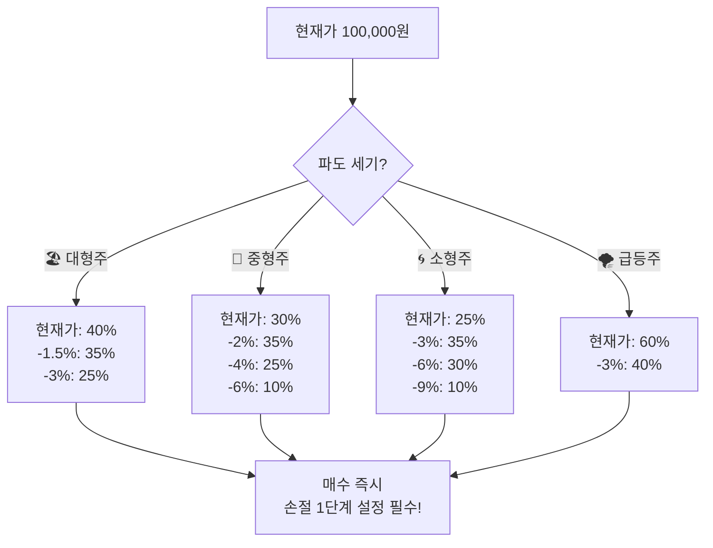
```mermaid
flowchart TD
    A["현재가 100,000원"] --> B{"파도 세기?"}
    
    B -->|"🏖️ 대형주"| C["현재가: 40%<br>-1.5%: 35%<br>-3%: 25%"]
    B -->|"🌊 중형주"| D["현재가: 30%<br>-2%: 35%<br>-4%: 25%<br>-6%: 10%"]
    B -->|"🌀 소형주"| E["현재가: 25%<br>-3%: 35%<br>-6%: 30%<br>-9%: 10%"]
    B -->|"🌪️ 급등주"| F["현재가: 60%<br>-3%: 40%"]
    
    C --> G["매수 즉시<br>손절 1단계 설정 필수!"]
    D --> G
    E --> G
    F --> G
```

---

### Q10. 거래량을 왜 봐야 하나요?

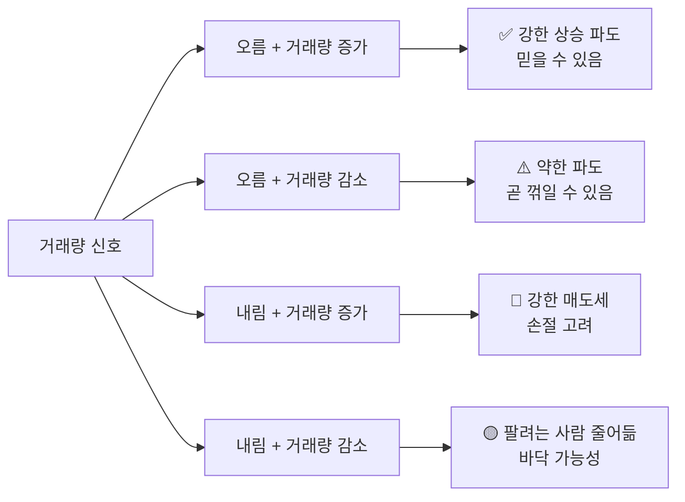
```mermaid
flowchart LR
    A["거래량 신호"] --> B["오름 + 거래량 증가"]
    A --> C["오름 + 거래량 감소"]
    A --> D["내림 + 거래량 증가"]
    A --> E["내림 + 거래량 감소"]
    
    B --> B1["✅ 강한 상승 파도<br>믿을 수 있음"]
    C --> C1["⚠️ 약한 파도<br>곧 꺾일 수 있음"]
    D --> D1["🔴 강한 매도세<br>손절 고려"]
    E --> E1["🟡 팔려는 사람 줄어듦<br>바닥 가능성"]
```

거래량 없이 오르는 주가는 믿기 어렵습니다. 반드시 거래량과 함께 확인하세요.

---

### Q11. 이동평균선이 뭔가요? 어떻게 활용하나요?

이동평균선은 최근 N일 동안의 평균 주가를 선으로 이은 것입니다.

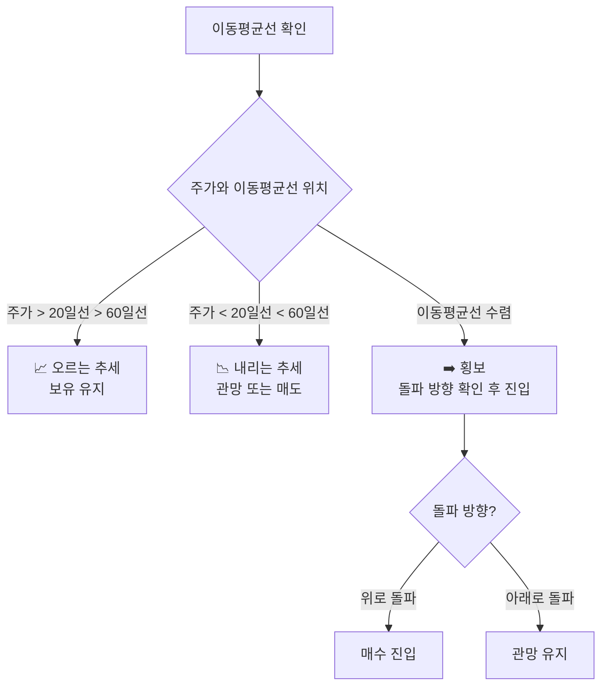
```mermaid
flowchart TD
    A["이동평균선 확인"] --> B{"주가와 이동평균선 위치"}
    
    B -->|"주가 > 20일선 > 60일선"| C["📈 오르는 추세<br>보유 유지"]
    B -->|"주가 < 20일선 < 60일선"| D["📉 내리는 추세<br>관망 또는 매도"]
    B -->|"이동평균선 수렴"| E["➡️ 횡보<br>돌파 방향 확인 후 진입"]
    
    E --> F{"돌파 방향?"}
    F -->|"위로 돌파"| G["매수 진입"]
    F -->|"아래로 돌파"| H["관망 유지"]
```

---

### Q12. 주가가 횡보할 때는 어떻게 해야 하나요?

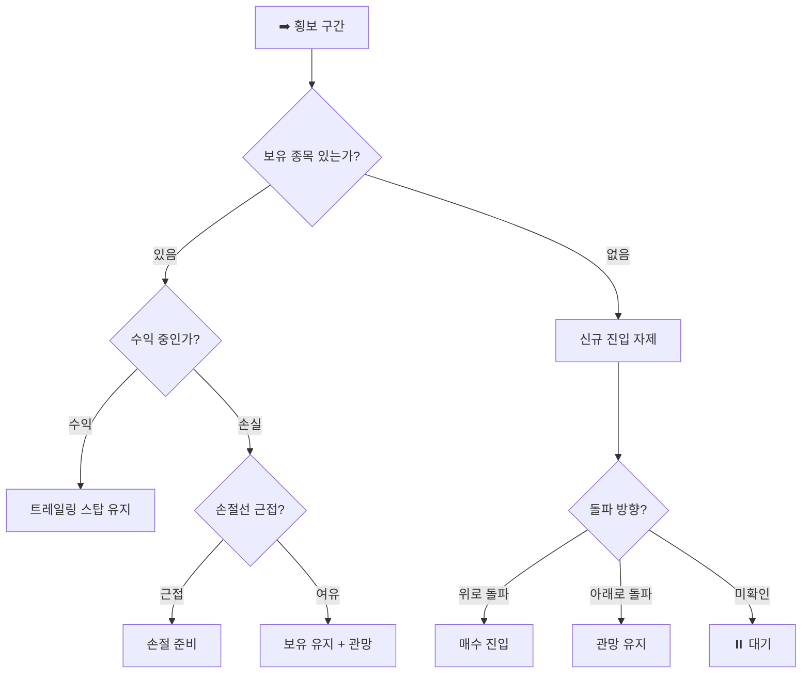
```mermaid
flowchart TD
    A["➡️ 횡보 구간"] --> B{"보유 종목 있는가?"}
    
    B -->|있음| C{"수익 중인가?"}
    C -->|수익| D["트레일링 스탑 유지"]
    C -->|손실| E{"손절선 근접?"}
    E -->|근접| F["손절 준비"]
    E -->|여유| G["보유 유지 + 관망"]
    
    B -->|없음| H["신규 진입 자제"]
    H --> I{"돌파 방향?"}
    I -->|위로 돌파| J["매수 진입"]
    I -->|아래로 돌파| K["관망 유지"]
    I -->|미확인| L["⏸️ 대기"]
```

횡보 구간에서 섣불리 사고팔면 수수료만 날립니다. 방향이 정해질 때까지 기다리는 것이 최선입니다.

---

### Q13. 물타기가 뭔가요? 해도 되나요?

**물타기**는 주가가 떨어졌을 때 추가로 더 사서 평균 매수가를 낮추는 것입니다.

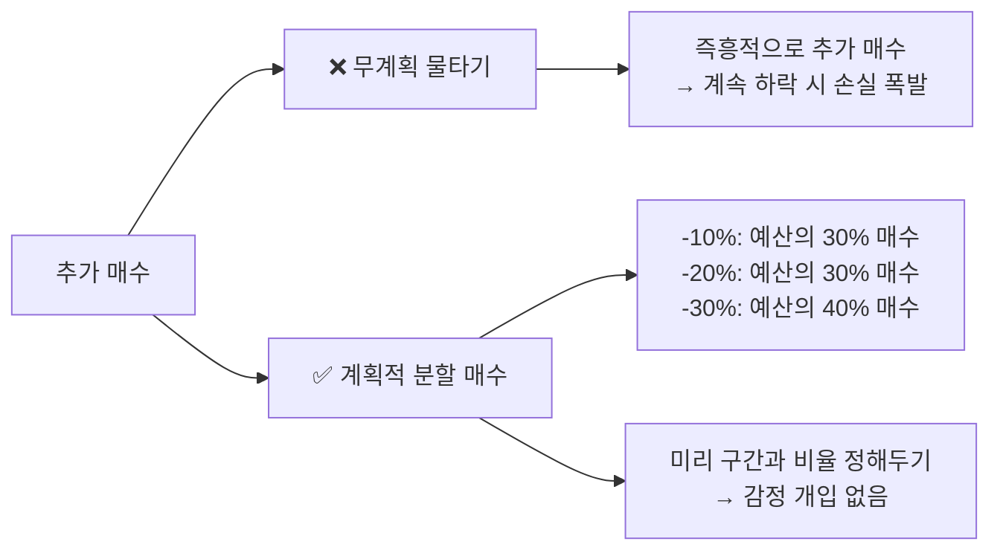
```mermaid
flowchart LR
    A["추가 매수"] --> B["❌ 무계획 물타기"]
    A --> C["✅ 계획적 분할 매수"]
    
    B --> B1["즉흥적으로 추가 매수<br>→ 계속 하락 시 손실 폭발"]
    
    C --> C1["-10%: 예산의 30% 매수<br>-20%: 예산의 30% 매수<br>-30%: 예산의 40% 매수"]
    C --> C2["미리 구간과 비율 정해두기<br>→ 감정 개입 없음"]
```

핵심은 **미리 어느 가격에 얼마나 살지 정해두는 것**입니다.

---

### Q14. 손절 후 바로 다시 사도 되나요?

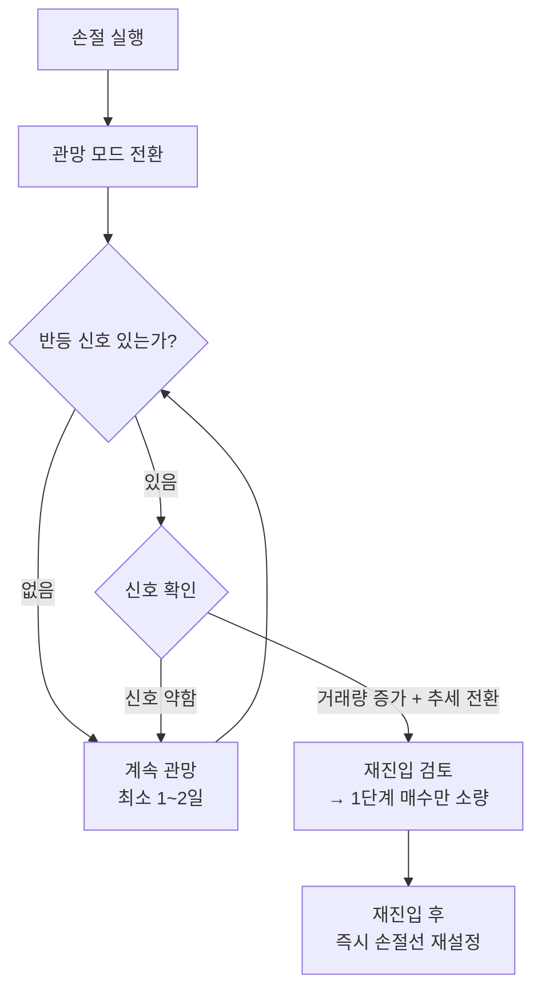
```mermaid
flowchart TD
    A["손절 실행"] --> B["관망 모드 전환"]
    B --> C{"반등 신호 있는가?"}
    
    C -->|없음| D["계속 관망<br>최소 1~2일"]
    D --> C
    
    C -->|있음| E{"신호 확인"}
    E -->|"거래량 증가 + 추세 전환"| F["재진입 검토<br>→ 1단계 매수만 소량"]
    E -->|"신호 약함"| D
    
    F --> G["재진입 후<br>즉시 손절선 재설정"]
```

손절 후 바로 다시 사면 같은 이유로 또 손절하게 됩니다. **최소 1~2일 관망** 후 반등 신호를 확인하세요.

---

### Q15. FOMO가 뭔가요? 어떻게 극복하나요?

**FOMO(Fear Of Missing Out)** 는 "나만 수익을 못 챙기는 것 같은 두려움"입니다.

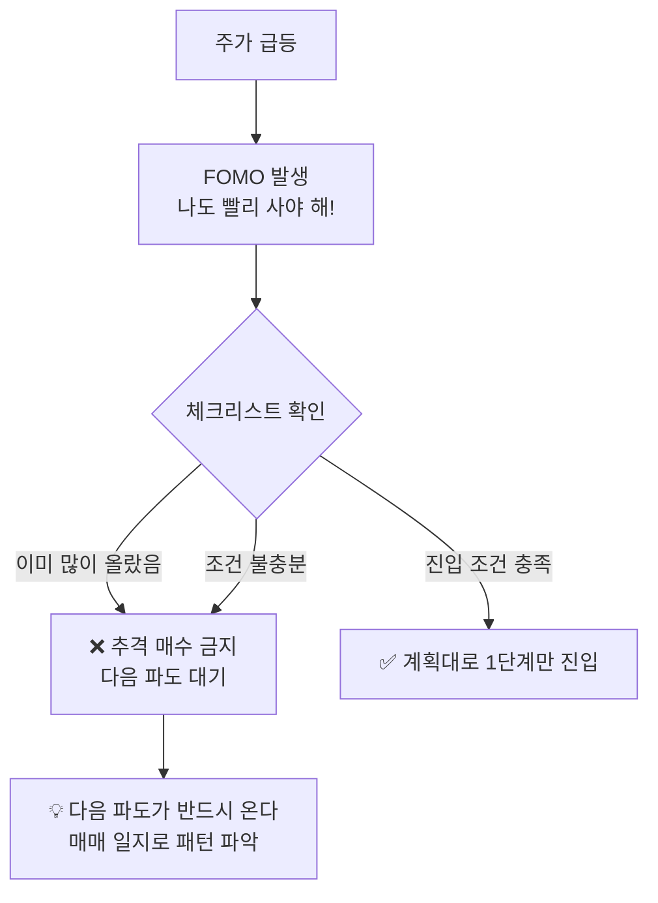
```mermaid
flowchart TD
    A["주가 급등"] --> B["FOMO 발생<br>나도 빨리 사야 해!"]
    B --> C{"체크리스트 확인"}
    
    C -->|"이미 많이 올랐음"| D["❌ 추격 매수 금지<br>다음 파도 대기"]
    C -->|"진입 조건 충족"| E["✅ 계획대로 1단계만 진입"]
    C -->|"조건 불충분"| D
    
    D --> F["💡 다음 파도가 반드시 온다<br>매매 일지로 패턴 파악"]
```

FOMO를 극복하는 방법:
- 매매 전 체크리스트를 반드시 확인하기
- 이미 많이 오른 주식은 추격 매수 금지
- "다음 파도가 반드시 온다"는 생각 갖기
- 매매 일지를 써서 감정적 매매 패턴 파악하기

---

## 🧠 처분효과 FAQ

---

### Q31. 처분효과가 뭔가요?

**처분효과(Disposition Effect)** 는 투자자가 수익 난 주식은 빨리 팔고, 손실 난 주식은 오래 들고 있는 심리적 편향입니다.

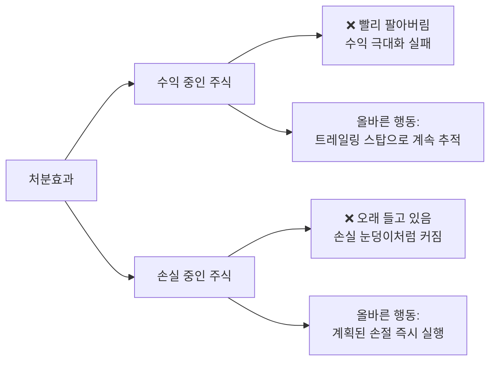
```mermaid
flowchart LR
    A["처분효과"] --> B["수익 중인 주식"]
    A --> C["손실 중인 주식"]
    
    B --> B1["❌ 빨리 팔아버림\n수익 극대화 실패"]
    B --> B2["올바른 행동:\n트레일링 스탑으로 계속 추적"]
    
    C --> C1["❌ 오래 들고 있음\n손실 눈덩이처럼 커짐"]
    C --> C2["올바른 행동:\n계획된 손절 즉시 실행"]
```

행동경제학자 **셰프린과 스태트먼(1985)**이 발견했으며, 수많은 연구에서 대부분의 개인 투자자가 이 함정에 빠진다는 것이 확인됐습니다.

---

### Q32. 왜 손실 난 주식을 손절하지 못하는 건가요?

**전망이론(Prospect Theory)** 으로 설명할 수 있습니다.

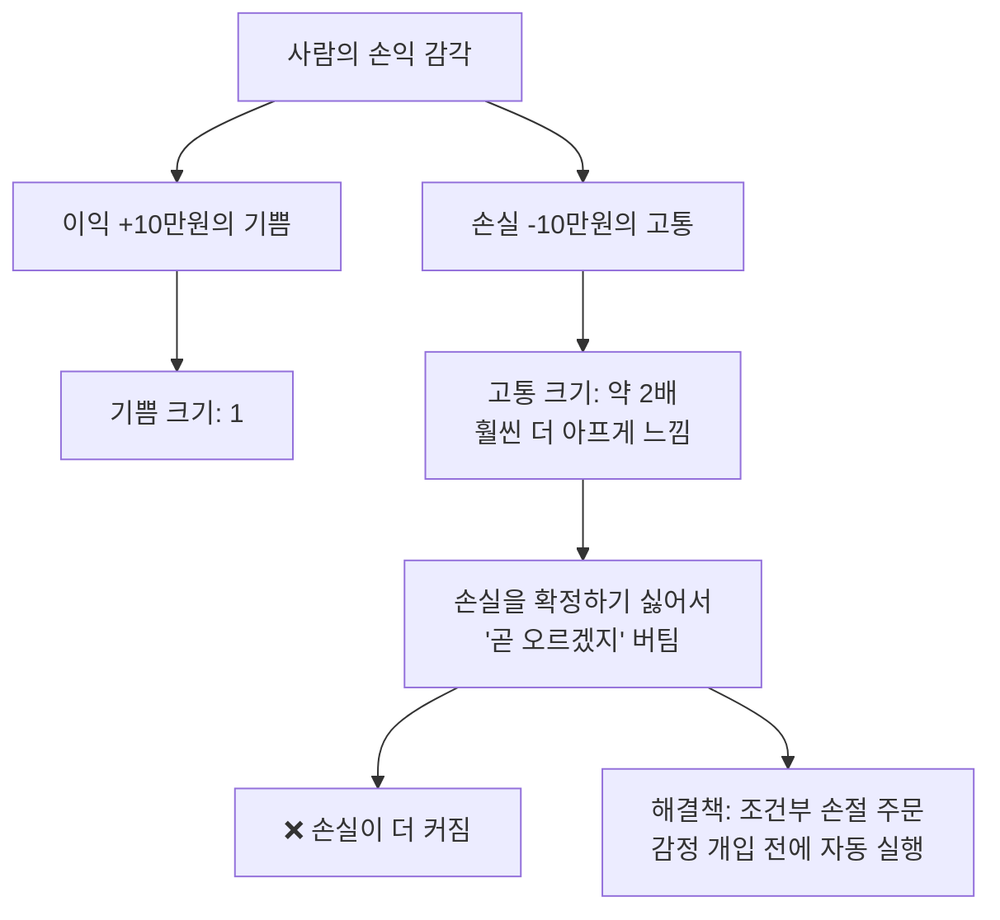
```mermaid
flowchart TD
    A["사람의 손익 감각"] --> B["이익 +10만원의 기쁨"]
    A --> C["손실 -10만원의 고통"]
    
    B --> B1["기쁨 크기: 1"]
    C --> C1["고통 크기: 약 2배\n훨씬 더 아프게 느낌"]
    
    C1 --> D["손실을 확정하기 싫어서\n'곧 오르겠지' 버팀"]
    D --> E["❌ 손실이 더 커짐"]
    
    D --> F["해결책: 조건부 손절 주문\n감정 개입 전에 자동 실행"]
```

손실을 인정하는 순간 고통이 확정되기 때문에, 뇌가 그것을 피하려 합니다. 조건부 주문은 이 고통을 느끼기 전에 자동으로 실행해줍니다.

---

### Q33. 왜 수익 난 주식을 너무 빨리 파는 건가요?

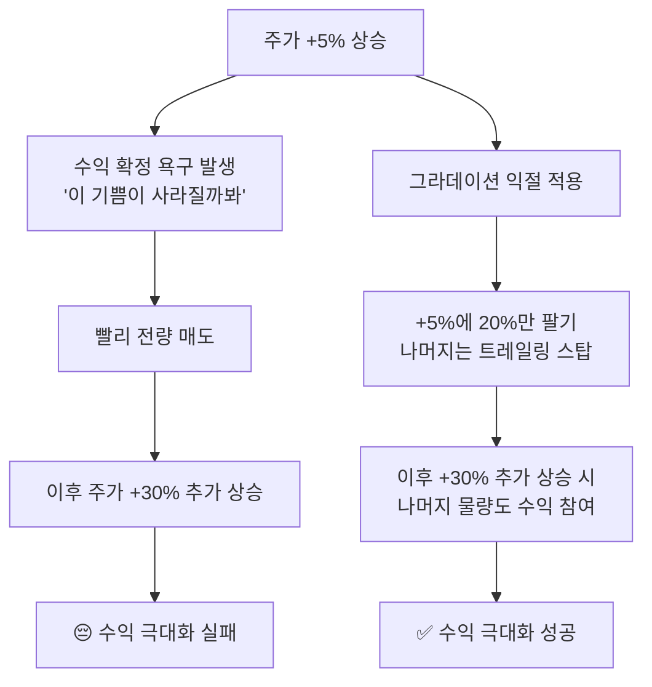
```mermaid
flowchart TD
    A["주가 +5% 상승"] --> B["수익 확정 욕구 발생\n'이 기쁨이 사라질까봐'"]
    B --> C["빨리 전량 매도"]
    C --> D["이후 주가 +30% 추가 상승"]
    D --> E["😔 수익 극대화 실패"]
    
    A --> F["그라데이션 익절 적용"]
    F --> G["+5%에 20%만 팔기\n나머지는 트레일링 스탑"]
    G --> H["이후 +30% 추가 상승 시\n나머지 물량도 수익 참여"]
    H --> I["✅ 수익 극대화 성공"]
```

수익이 줄어들까봐 두려운 마음이 처분효과를 만듭니다. 그라데이션 익절은 이 두려움을 해소하면서도 수익을 극대화합니다.

---

### Q34. 내가 처분효과에 빠졌는지 어떻게 알 수 있나요?

아래 질문에 솔직하게 답해보세요.

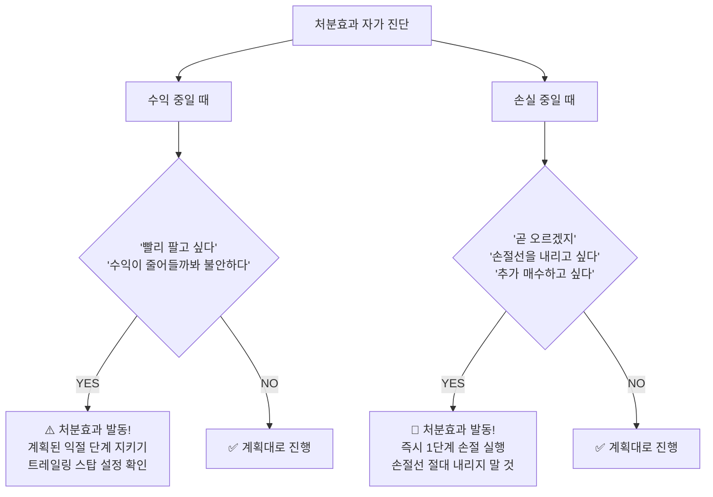
```mermaid
flowchart TD
    A["처분효과 자가 진단"] --> B["수익 중일 때"]
    A --> C["손실 중일 때"]
    
    B --> B1{"'빨리 팔고 싶다'\n'수익이 줄어들까봐 불안하다'"}
    B1 -->|"YES"| B2["⚠️ 처분효과 발동!\n계획된 익절 단계 지키기\n트레일링 스탑 설정 확인"]
    B1 -->|"NO"| B3["✅ 계획대로 진행"]
    
    C --> C1{"'곧 오르겠지'\n'손절선을 내리고 싶다'\n'추가 매수하고 싶다'"}
    C1 -->|"YES"| C2["🚨 처분효과 발동!\n즉시 1단계 손절 실행\n손절선 절대 내리지 말 것"]
    C1 -->|"NO"| C3["✅ 계획대로 진행"]
```

**수익 중 처분효과 신호**
- "조금만 더 오르면 팔겠다"고 계속 미루고 있다
- 수익이 줄어들까봐 불안해서 빨리 팔고 싶다
- 익절 계획 없이 감으로 팔려 한다

**손실 중 처분효과 신호**
- "곧 오를 것 같아서" 손절을 미루고 있다
- 손절선을 아래로 내리고 싶다
- "평균단가 낮추자"며 계획 없이 추가 매수하려 한다

---

### Q35. 처분효과를 이기는 가장 좋은 방법은 뭔가요?

```mermaid
flowchart TD
    A["처분효과 극복 방법"] --> B["1. 조건부 주문 사전 설정"]
    A --> C["2. 그라데이션 전략 사용"]
    A --> D["3. 매매 일지 작성"]
    A --> E["4. 매매 전 체크리스트 확인"]
    
    B --> B1["감정이 개입하기 전에\n자동으로 실행되게 설정\n→ 손절/익절 모두 조건부 주문"]
    
    C --> C1["한 번에 전량 팔지 않으면\n'빨리 팔고 싶은' 충동 줄어듦\n→ 단계별로 조금씩 팔기"]
    
    D --> D1["과거 처분효과 패턴 파악\n'나는 언제 처분효과에 빠지나?'\n→ 반복 실수 방지"]
    
    E --> E1["매매 전 자가 진단\n'지금 처분효과 발동 중인가?'\n→ 냉정하게 판단"]
```

가장 강력한 방법은 **조건부 주문을 미리 설정**하는 것입니다. 감정이 개입할 여지 자체를 없애버리는 것이 핵심입니다.

---

## 🇺🇸 미국 주식 FAQ

---

### Q16. 미국 주식은 언제 거래되나요?

```mermaid
timeline
    title 한국 시간 기준 하루 일과
    낮 12시 : 미국 장 마감 (전날 결과 확인)
    오후 3시 : 국내 주식 장 마감
    밤 11시 30분 : 미국 정규장 시작 (서머타임)
    새벽 1시 : 주가 급등/급락 (자고 있음)
    새벽 6시 : 미국 정규장 마감
```

```
서머타임 (3월~11월): 밤 11시 30분 ~ 새벽 6시
겨울      (11월~3월): 밤 12시 30분 ~ 새벽 7시
```

대부분의 한국 투자자는 자고 있는 시간에 미국 장이 열립니다. 그래서 **조건부 주문이 필수**입니다.

---

### Q17. 미국 주식은 왜 조건부 주문이 필수인가요?

```mermaid
flowchart TD
    A["밤 11시<br>미국 장 시작"] --> B["새벽 1시<br>주가 급등/급락<br>나는 자고 있음"]
    B --> C{"조건부 주문<br>설정했는가?"}
    
    C -->|"✅ 설정함"| D["자동으로 손절/익절 실행<br>아침에 결과만 확인"]
    C -->|"❌ 설정 안 함"| E["새벽 6시 장 마감<br>아침에 일어나보니 -20%"]
    
    D --> F["안심하고 잠들기"]
    E --> G["😱 큰 손실 확정"]
```

손절을 설정하지 않으면, 아침에 일어났을 때 -20%가 되어 있을 수 있습니다.

---

### Q18. 서머타임이 뭔가요? 주식에 어떤 영향을 주나요?

**서머타임**은 미국이 여름에 시계를 1시간 앞당기는 제도입니다.

```mermaid
flowchart LR
    A["서머타임 확인"] --> B["3월~11월<br>서머타임 적용"]
    A --> C["11월~3월<br>겨울 시간"]
    
    B --> B1["미국 장<br>밤 11시 30분 ~ 새벽 6시"]
    C --> C1["미국 장<br>밤 12시 30분 ~ 새벽 7시"]
    
    B1 --> D["⚠️ 시즌 바뀔 때<br>조건부 주문 시간 재확인 필요"]
    C1 --> D
```

---

### Q19. 미국 주식 ETF와 개별 종목 중 어느 것이 더 안전한가요?

```mermaid
flowchart LR
    A["미국 주식 선택"] --> B["ETF<br>SPY, QQQ"]
    A --> C["개별 종목<br>테슬라, 엔비디아"]
    
    B --> B1["하루 변동폭 ±0.5~2%<br>여러 종목 분산<br>손절 -3~5%<br>트레일링 -5~8%"]
    C --> C1["하루 변동폭 ±2~5%<br>한 회사에 집중<br>손절 -7~12%<br>트레일링 -10~18%"]
    
    B --> D["✅ 초보자 추천<br>SPY부터 시작"]
    C --> E["⚠️ 경험 쌓은 후 도전"]
```

처음 미국 주식을 시작한다면 SPY(S&P500), QQQ(나스닥100) 같은 ETF부터 시작하는 것을 추천합니다.

---

### Q20. 미국 주식 손절은 몇 %로 잡아야 하나요?

```mermaid
flowchart TD
    A["미국 주식 손절 기준"] --> B{"파도 세기?"}
    
    B -->|"🏖️ 초대형 우량주/ETF<br>애플, MS, SPY"| C["1단계: -3% → 20%<br>2단계: -5% → 30%<br>3단계: -8% → 50%"]
    B -->|"🌊 성장주<br>테슬라, 엔비디아"| D["1단계: -5% → 25%<br>2단계: -8% → 35%<br>3단계: -12% → 40%"]
    B -->|"🌀 소형 성장주<br>중소형 기술주"| E["1단계: -6% → 30%<br>2단계: -10% → 40%<br>3단계: -15% → 30%"]
    B -->|"🌪️ 급등주/밈주식"| F["1단계: -7% → 50%<br>2단계: -12% → 50%"]
```

**공식**: 손절 기준 = 해당 종목 평균 하루 변동폭 × 1.5~2배

---

### Q21. 미국 주식 트레일링 스탑은 몇 %로 잡아야 하나요?

```mermaid
flowchart LR
    A["트레일링 스탑 설정"] --> B["🏖️ 초대형 우량주/ETF"]
    A --> C["🌊 성장주"]
    A --> D["🌀 소형 성장주"]
    A --> E["🌪️ 급등주"]
    
    B --> B1["-5% ~ -7%<br>변동성 낮아 좁게 가능"]
    C --> C1["-10% ~ -15%<br>변동성 높아 넓게 필요"]
    D --> D1["-12% ~ -18%<br>급등락 조기 청산 방지"]
    E --> E1["-12%<br>빠른 대응 필수"]
```

**공식**: 트레일링 스탑 = 해당 종목 평균 하루 변동폭 × 2~3배

너무 좁으면 작은 조정에도 팔려버리고, 너무 넓으면 수익을 많이 반납합니다.

---

### Q22. 미국 주식 손절을 나눠서 하는 방법은?

```mermaid
flowchart TD
    A["취침 전<br>예약 매도 3개 동시 설정"] --> B["1단계 손절<br>-3~6% 구간<br>20~30% 물량"]
    A --> C["2단계 손절<br>-5~10% 구간<br>30~40% 물량"]
    A --> D["3단계 손절<br>-8~15% 구간<br>나머지 전량"]
    
    B --> E["아침에 확인"]
    C --> E
    D --> E
    
    E --> F{"어느 단계 실행됐나?"}
    F -->|"1단계만"| G["원인 분석<br>2~3단계 여부 판단"]
    F -->|"2단계까지"| H["하락 추세 강화<br>3단계 준비"]
    F -->|"3단계까지"| I["전량 청산 완료<br>관망 모드"]
```

---

### Q23. 미국 주식 익절을 나눠서 하는 방법은?

```mermaid
flowchart TD
    A["취침 전<br>예약 매도 4~5개 동시 설정"] --> B["1차 익절<br>+5~10%<br>15~20% 물량"]
    A --> C["2차 익절<br>+8~18%<br>25~30% 물량"]
    A --> D["3차 익절<br>+12~25%<br>25~30% 물량"]
    A --> E["4차 익절<br>+20~35%<br>20% 물량"]
    A --> F["마지막<br>트레일링 스탑<br>나머지 10~30%"]
    
    B --> G["아침에 확인<br>트레일링 스탑 갱신"]
    C --> G
    D --> G
    E --> G
    F --> G
```

---

### Q24. 토스에서 그라데이션 전략을 설정하는 방법은?

```mermaid
flowchart TD
    A["토스 앱"] --> B["예약 매도 여러 개 동시 설정"]
    
    B --> C["손절 예약 매도<br>3개 설정<br>각각 다른 가격과 수량"]
    B --> D["익절 예약 매도<br>3~4개 설정<br>각각 다른 가격과 수량"]
    B --> E["마지막 물량<br>트레일링 스탑<br>수동 갱신 필요"]
    
    E --> F{"트레일링 스탑 자동화 필요?"}
    F -->|"예"| G["키움증권<br>미래에셋증권 병행"]
    F -->|"아니오"| H["매일 아침 5분<br>수동 갱신 루틴"]
    
    H --> I["어제 고점 × (1 - 트레일링 %) = 새 예약 매도가"]
```

**토스 설정 예시 (성장주 100달러 매수, 100주)**

```
손절 예약 매도:
  95달러, 25주 (25%)
  92달러, 35주 (35%)
  88달러, 40주 (40%)

익절 예약 매도:
  107달러, 15주 (15%)
  112달러, 25주 (25%)
  118달러, 30주 (30%)
  125달러, 20주 (20%)
  → 마지막 10주: 매일 아침 트레일링 수동 갱신
```

---

### Q25. 미국 주식을 사고 나서 매일 밤 깨어서 봐야 하나요?

```mermaid
flowchart TD
    A["취침 전 5분 루틴"] --> B["손절 예약 매도 확인<br>아직 살아있는지"]
    A --> C["익절 예약 매도 확인"]
    A --> D["트레일링 스탑 갱신<br>오늘 고점 기준"]
    A --> E["내일 이슈 확인<br>실적 발표, 연준 회의 등"]
    
    E --> F["✅ 설정 완료<br>안심하고 잠들기"]
    
    F --> G["아침 5분 루틴"]
    G --> H{"어젯밤 결과 확인"}
    H -->|"손절 실행됨"| I["원인 분석<br>관망 모드"]
    H -->|"익절 실행됨"| J["수익 확정<br>트레일링 갱신"]
    H -->|"아무것도 없음"| K["트레일링 스탑만 갱신<br>끝"]
```

---

### Q26. 미국 주식에서 가장 흔한 실수 7가지는?

```mermaid
flowchart TD
    A["흔한 실수 7가지"] --> B["실수 1<br>손절 설정 없이 잠든다"]
    A --> C["실수 2<br>손절을 너무 좁게 잡는다"]
    A --> D["실수 3<br>익절을 너무 일찍 전량 판다"]
    A --> E["실수 4<br>손절 후 바로 다시 산다"]
    A --> F["실수 5<br>예약 매도를 하나만 설정한다"]
    A --> G["실수 6 처분효과<br>아침에 손절 주문 취소"]
    A --> H["실수 7 처분효과<br>아침에 수익 보고 전량 즉시 매도"]
    
    B --> B1["→ 매수 직후 1단계 손절 설정 필수"]
    C --> C1["→ 변동성 × 1.5~2배로 설정"]
    D --> D1["→ 그라데이션 익절 + 트레일링 스탑"]
    E --> E1["→ 최소 1~2일 관망 후 재진입"]
    F --> F1["→ 3~5단계로 나눠서 설정"]
    G --> G1["→ 취침 전 설정한 주문 아침에 감정적으로 취소 금지"]
    H --> H1["→ 계획된 그라데이션 익절 단계 지키기"]
```

---

### Q27. OCO 주문이 뭔가요?

**OCO(One Cancels the Other)** 는 손절과 익절을 동시에 설정하는 주문입니다.

```mermaid
flowchart TD
    A["100달러 매수"] --> B["OCO 주문 설정"]
    B --> C["손절: 92달러 이하 시 매도"]
    B --> D["익절: 115달러 이상 시 매도"]
    
    C --> E{"먼저 도달하는 쪽 실행"}
    D --> E
    
    E -->|"92달러 먼저 도달"| F["손절 실행<br>익절 주문 자동 취소"]
    E -->|"115달러 먼저 도달"| G["익절 실행<br>손절 주문 자동 취소"]
```

미래에셋증권 등에서 지원합니다. 손절과 익절을 동시에 걸어두고 싶을 때 유용합니다.

---

### Q28. 미국 주식에서 프리마켓/애프터마켓 거래를 해도 되나요?

```mermaid
flowchart LR
    A["거래 시간 선택"] --> B["정규장<br>밤 11:30 ~ 새벽 6시"]
    A --> C["프리마켓/애프터마켓"]
    
    B --> B1["✅ 거래량 충분<br>스프레드 좁음<br>초보자 권장"]
    
    C --> C1["⚠️ 거래량 적음<br>주가 크게 튈 수 있음<br>스프레드 넓음"]
    C --> C2["실적 발표 등<br>큰 이슈 있을 때만 활용"]
```

---

### Q29. 미국 주식 환율 리스크는 어떻게 관리하나요?

```mermaid
flowchart TD
    A["미국 주식 투자"] --> B["주가 변동<br>+10% 상승"]
    A --> C["환율 변동<br>1,300원 → 1,200원 하락"]
    
    B --> D["110달러"]
    C --> D
    D --> E["110달러 × 1,200원 = 132,000원"]
    E --> F["원래 투자금: 130,000원<br>실제 수익: +1.5%만<br>주가는 10% 올랐는데!"]
    
    F --> G["환율 리스크 관리법"]
    G --> H["환율 낮을 때 달러 환전"]
    G --> I["장기 투자로 환율 영향 줄이기"]
    G --> J["환율 변동 크면 투자 비중 조절"]
```

---

### Q30. 국내 주식과 미국 주식, 어느 것부터 시작해야 하나요?

```mermaid
flowchart TD
    A["주식 투자 시작"] --> B["1단계<br>국내 주식 ETF<br>KOSPI200 ETF 등"]
    B --> C["2단계<br>국내 개별 종목<br>대형 우량주부터"]
    C --> D["3단계<br>미국 주식 ETF<br>SPY, QQQ"]
    D --> E["4단계<br>미국 개별 종목<br>초대형 우량주부터"]
    E --> F["5단계<br>성장주, 소형주<br>경험 쌓인 후"]
    
    B --> B1["그라데이션 전략 익히기<br>손절/익절/분할 매수 연습"]
    C --> C1["파도 세기 파악 연습<br>조건부 주문 활용"]
    D --> D1["취침 전 루틴 만들기<br>예약 매도 여러 개 설정"]
    E --> E1["트레일링 스탑 활용<br>키움/미래에셋 병행"]
```

| 구분 | 국내 주식 | 미국 주식 |
|------|---------|---------|
| 거래 시간 | 낮 9시 ~ 오후 3시 30분 | 밤 11시 30분 ~ 새벽 6시 |
| 직접 모니터링 | 가능 | 어려움 |
| 조건부 주문 | 권장 | 필수 |
| 정보 접근성 | 쉬움 (한국어) | 어려움 (영어) |
| 환율 리스크 | 없음 | 있음 |

국내 주식으로 그라데이션 전략(나눠 사고팔기)을 충분히 익힌 뒤, 미국 주식으로 넘어가는 것이 좋습니다.

---

*작성일: 2026년 3월*  
*참고: 이 문서는 교육 목적으로 작성되었으며, 투자 권유가 아닙니다.*
