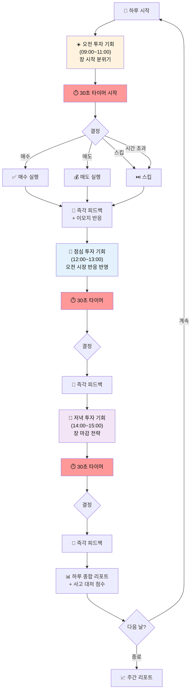
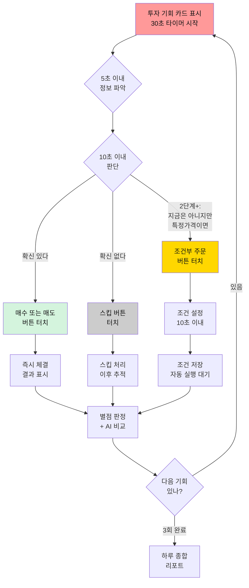
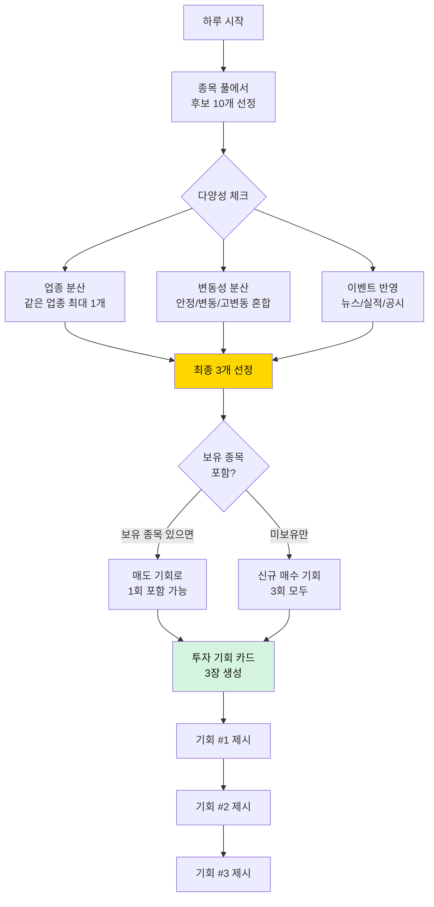
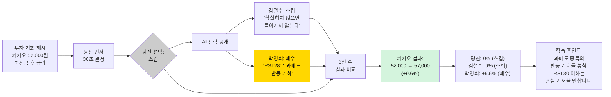
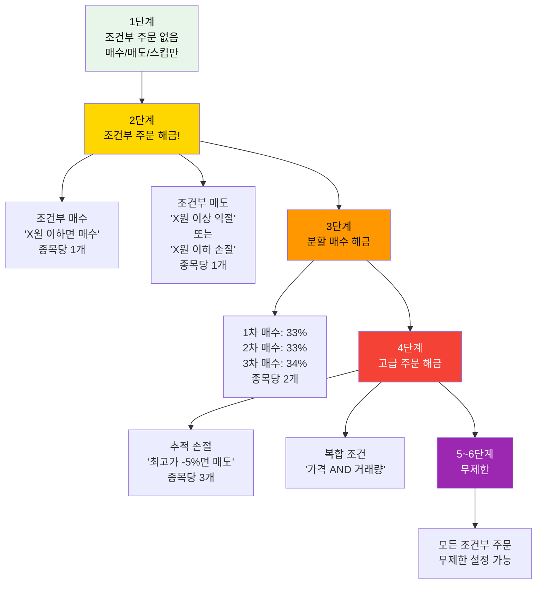
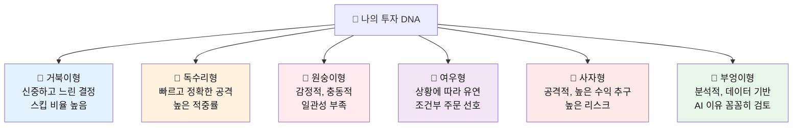
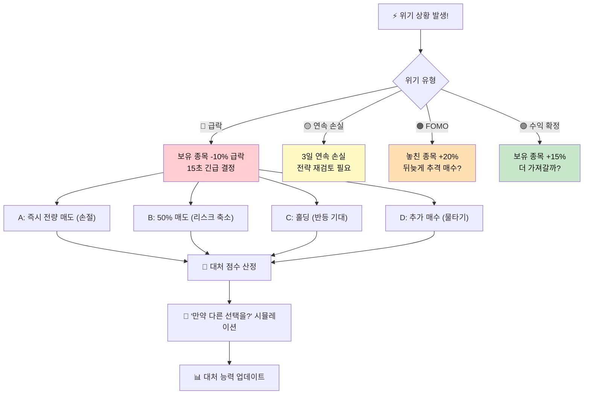
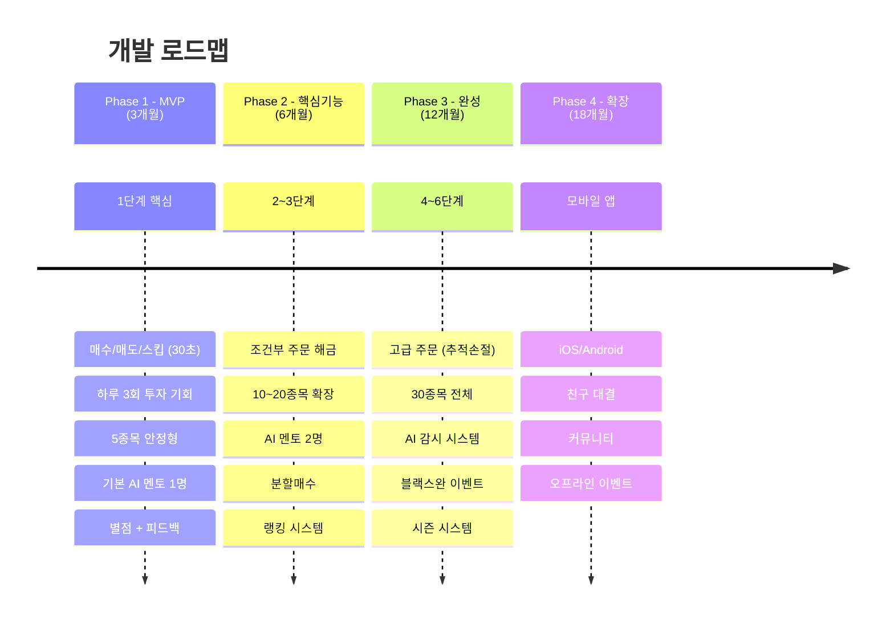
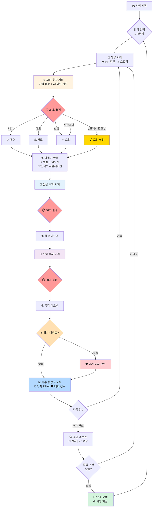

# 주식 시뮬레이션 게임 - 최종 기획안 v3.1
## "파도를 타라: 30초 투자 결정"

---

## 문서 정보

| 항목 | 내용 |
|------|------|
| **버전** | FINAL v3.1 |
| **통합 버전** | v3.0 + 사용자 피드백 (5차) |
| **최종 업데이트** | 2026.02.16 |
| **상태** | 최종 완성 |
| **핵심 변경** | 기업 정보 중심 카드, 오전/점심/저녁, 듀오링고 게임화, 사고대처 훈련, 투자 성향 분석 |

### v3.1 주요 변경사항 (v3.0 대비)

| 항목 | v3.0 | v3.1 |
|------|------|------|
| 투자 카드 정보 | 차트+기술적 지표 중심 | **기업 정보 + AI가 "왜 올랐는지" 이유 제시 (토스 스타일)** |
| 시간대 표시 | 없음 (시간 관계없이 3회) | **오전/점심/저녁 시간대 명시** |
| 게임화 | 별점 + 콤보 | **듀오링고 스타일: 캐릭터, 이모지, 스트릭, HP, 레벨** |
| 핵심 목표 | 수익률 달성 | **사고 대처 능력 훈련 (성공 보장 없음!)** |
| AI 비교 | 멘토 2명 비교 | **내 투자 성향 패턴 분석 + AI 패턴 비교** |
| 피드백 | 결과 후 피드백 | **즉각 감정 피드백 + "만약 ~했다면?" 시뮬레이션** |

### v3.0 주요 변경사항 (v2.2 대비)

| 항목 | v2.2 | v3.0 |
|------|------|------|
| 하루 투자 횟수 | 3타임 (아침/점심/저녁) | **하루 3회 투자 기회** |
| 결정 제한시간 | 2~5분 | **30초 이내** |
| 1단계 행동 | 매수/매도/조건부주문/스킵 | **매수/매도/스킵 (단순)** |
| 조건부 주문 | 1단계부터 사용 | **2단계부터 해금** |
| 투자 기회 | 고정 종목 | **다양한 기업 투자 기회 랜덤 제시** |

---

## Part 1: 게임 핵심 철학

### 게임의 목표

```
"주식은 100% 성공할 수 없다. 하지만, 대처하는 법은 배울 수 있다."

🎯 핵심 목표: 사고 대처 능력 훈련
- 하루 3번 (오전/점심/저녁), 투자 기회가 찾아옵니다.
- 기업 정보를 읽고, 30초 안에 판단하세요.
- 성공보다 중요한 것: 실패했을 때 어떻게 대응하는가.
- 틀려도 괜찮습니다. 대응이 빨라야 합니다.
```

### 핵심 교육 철학: "성공이 아닌 대처"

```
왜 사고 대처 능력인가?

현실 주식시장:
- 전문 펀드매니저도 시장 예측 적중률 55~60%
- AI 예측도 완벽하지 않음 (토스 AI도 "추정 원인"을 제시할 뿐)
- 성공 투자자와 실패 투자자의 차이 = "위기 대처 속도"

우리 게임이 키우는 3가지 능력:
1. 🧠 판단력: 제한된 정보로 빠르게 결정하기
2. 🛡️ 대처력: 틀렸을 때 빠르게 손절/전환하기
3. 💪 멘탈력: 연속 실패에도 전략을 유지하기
```

### 핵심 차별화 포인트

| 기존 주식 교육/게임 | 파도를 타라 v3.1 |
|-------------------|-----------------|
| 차트/기술적 분석 중심 | **기업 정보 + AI 이유 제시 (토스 스타일)** |
| 수익률만 평가 | **사고 대처 능력 평가 (위기 대응 점수)** |
| 복잡한 분석 도구 | 30초 즉각 판단 훈련 |
| 무제한 거래 | 하루 3회 제한 (선택의 무게) |
| 딱딱한 교육 | **듀오링고 스타일 게임화 (이모지, 캐릭터, 스트릭)** |
| 성공 체험 위주 | **실패 시나리오 + 대처 훈련** |
| 결과만 피드백 | **즉각 감정 피드백 + "만약?" 시뮬레이션** |
| 가상 기업 | 실제 한국 기업 기반 시나리오 |
| 처음부터 복잡 | 1단계 단순 → 단계별 기능 해금 |

---

## Part 2: 핵심 게임 루프 - "오전/점심/저녁 3회 투자 결정"

### 2-1. 하루 투자 흐름 (오전/점심/저녁)



### 2-2. 오전/점심/저녁 시간대 특성

| 시간대 | 시각 | 특성 | 주요 정보 | 아이콘 |
|--------|------|------|----------|--------|
| **☀️ 오전** | 09:00~11:00 | 장 시작, 전일 뉴스 반영 | 전일 실적 발표, 해외 시장, 공시 | ☀️🔔 |
| **🍚 점심** | 12:00~13:00 | 오전 흐름 반영, 추세 형성 | 오전 거래량, 외국인 동향, 업종 흐름 | 🍚📊 |
| **🌙 저녁** | 14:00~15:00 | 장 마감 전, 포지션 정리 | 당일 종합, 마감 직전 흐름 | 🌙⚡ |

```
각 시간대별 투자 기회가 다른 성격을 가집니다:

☀️ 오전: "어제 뭐가 있었지?" → 뉴스/공시 기반 기회
🍚 점심: "오전에 어떻게 흘렀지?" → 오전 흐름 기반 기회  
🌙 저녁: "오늘 마무리 어떻게 할까?" → 포지션 정리/추가 기회
```

### 2-3. 기업 정보 중심 투자 카드 (토스 AI 스타일)

**기존 주식 앱**: 차트와 기술 지표 위주 → 초보자에게 어렵다  
**토스 스타일**: "왜 오르고 있는지" 이유를 AI가 쉽게 설명 → 우리도 이 방식!

```
+-------------------------------------------------------+
| ☀️ 오전 투자 기회 #1 / 3              [30초] ████████░░ |
+-------------------------------------------------------+
|                                                       |
|  삼성전자 (005930)                 현재가: 72,000원    |
|  전일비: +2.5% (+1,800원) 📈                          |
|                                                       |
|  ┌─────────────────────────────────────────────┐      |
|  │ 🤖 AI 분석: 이 종목이 오른 이유              │      |
|  │                                              │      |
|  │ 1️⃣ HBM3 엔비디아 공급 계약 체결 (공시)      │      |
|  │    → 반도체 매출 30% 증가 예상               │      |
|  │                                              │      |
|  │ 2️⃣ 외국인 3일 연속 순매수 (수급)            │      |
|  │    → 외국인이 사고 있다 = 긍정 신호          │      |
|  │                                              │      |
|  │ 3️⃣ 거래량 +145% 폭증 (관심 급증)           │      |
|  │    → 많은 사람이 주목하고 있음               │      |
|  │                                              │      |
|  │ ⚠️ 주의: 단기 과열 가능성 있음              │      |
|  │    → 현재 RSI 68, 과매수 진입 구간           │      |
|  └─────────────────────────────────────────────┘      |
|                                                       |
|  📋 기업 한줄 요약:                                    |
|  "세계 1위 메모리 반도체, 시총 400조, 배당 2.1%"       |
|                                                       |
|  +-------------+  +-------------+  +-------------+    |
|  | 📈 [매수]   |  | 💰 [매도]   |  | ⏭️ [스킵]   |    |
|  |  150만원    |  |  (미보유)   |  |  넘기기      |    |
|  |  (30%)     |  |  비활성     |  |              |    |
|  +-------------+  +-------------+  +-------------+    |
|                                                       |
+-------------------------------------------------------+
```

### 2-4. AI 이유 제시 시스템 (토스 스타일)

```
AI가 제시하는 "이유"는 100% 맞는 것이 아닙니다!

토스 앱처럼, AI가 주가 변동의 "추정 원인"을 제시합니다:
- 공시 (실적 발표, 계약 체결, 인수합병)
- 뉴스 (규제, 정책, 업계 동향)
- 수급 (외국인/기관 매수매도, 거래량)
- 업종 흐름 (반도체 섹터 상승, 2차전지 하락 등)
- 글로벌 (미국 시장, 환율, 금리)

핵심: AI 이유가 "맞을 수도, 틀릴 수도" 있다는 것을 체험!
→ 이것이 사고 대처 능력의 시작!
→ "AI가 이렇게 말했는데 틀렸다. 그러면 어떻게 대응하지?"
```

| AI 이유 카테고리 | 아이콘 | 예시 | 신뢰도 |
|----------------|--------|------|--------|
| **공시/IR** | 📋 | "HBM3 공급 계약 체결" | 높음 (사실 기반) |
| **뉴스** | 📰 | "공정위 과징금 2,500억" | 높음 (사실 기반) |
| **수급 분석** | 📊 | "외국인 5일 순매수" | 중간 (추세 추정) |
| **업종 흐름** | 🏭 | "반도체 섹터 전체 상승" | 중간 (연관 추정) |
| **글로벌 영향** | 🌍 | "미국 금리 인하 기대감" | 낮음 (간접 영향) |
| **AI 추론** | 🤖 | "기술적 반등 구간 진입" | 낮음 (예측) |

### 2-5. 투자 기회 구성 규칙

| 항목 | 규칙 |
|------|------|
| **하루 기회 수** | 정확히 3회 (☀️오전 / 🍚점심 / 🌙저녁) |
| **기회 제시 방식** | 시간대별 서로 다른 기업 상황 제시 |
| **결정 시간** | 기회당 30초 (타이머 표시) |
| **시간 초과** | 자동 스킵 처리 |
| **정보 구성** | **기업 정보 + AI 이유 분석 + 한줄 요약** (차트 아님!) |
| **기업 선정** | 단계별 종목 풀에서 랜덤 + 알고리즘 (다양성 보장) |
| **매수 비중** | 1단계: 고정 30% / 2단계~: 선택 가능 (25%, 50%, 100%) |
| **매도** | 보유 종목이 있을 때만 표시 |
| **스킵** | 항상 가능, 스킵도 전략 |

### 2-6. "스킵도 전략이다"

```
스킵의 가치:
- 확신이 없으면 스킵하는 것이 정답
- 하루 3회를 모두 스킵해도 OK
- 스킵한 결과도 추적 → "스킵이 맞았는지" 피드백
- 훌륭한 투자자는 "안 하는 것"도 잘합니다

스킵 후 피드백 예시:
"⏭️ 스킵한 삼성전자는 이후 -3.2% 하락했습니다.
 🎉 현명한 스킵! +1 스킵 마스터 포인트"

"⏭️ 스킵한 SK하이닉스는 이후 +8.5% 상승했습니다.
 😅 아쉬운 스킵! 다음에는 도전해 보세요.
 💡 학습: AI 이유 '외국인 5일 순매수'는 신뢰도가 높았습니다."
```

---

## Part 3: 단계별 기능 해금 시스템

### 3-1. 단계별 비교표

| | 1단계 | 2단계 | 3단계 | 4단계 | 5단계 | 6단계 |
|---|---|---|---|---|---|---|
| **이름** | 새싹 투자자 | 초보 투자자 | 중급 투자자 | 고급 투자자 | 프로 투자자 | 전설 투자자 |
| **자금** | 500만원 | 1,000만원 | 5,000만원 | 1억원 | 5억원 | 10억원 |
| **행동** | **매수/매도/스킵** | 매수/매도/스킵 + **조건주문** | + 분할매수 | + 레버리지 | + 무제한 | 완전자유 |
| **종목 풀** | 안정형 5개 | 안정+변동 10개 | 전체 20개 | 전체 30개 | 전체 | 전체+선물 |
| **종목 보유** | 최대 2개 | 최대 3개 | 최대 5개 | 최대 7개 | 무제한 | 무제한 |
| **결정 시간** | 30초 | 30초 | 30초 | 30초 | 30초 | 30초 |
| **매수 비중** | 고정 30% | 25/50% 선택 | 25/50/100% | 자유 설정 | 자유 | 자유 |
| **조건부 주문** | **없음** | **해금** (종목당 1개) | 종목당 2개 | 종목당 3개 | 무제한 | 무제한 |
| **특수 기능** | - | 지정가 주문 | 분할매수 3단계 | 추적손절 | AI 감시 해제 | 선물/옵션 |
| **주간 목표** | +3% | +5% | +8% | +10% | +12% | +15% |

### 3-2. 단계별 행동 진화 흐름

```mermaid
flowchart LR
    subgraph S1["1단계: 새싹"]
        A1[매수] 
        A2[매도]
        A3[스킵]
    end
    
    subgraph S2["2단계: 초보"]
        B1[매수]
        B2[매도]
        B3[스킵]
        B4["조건부 매수<br/>(NEW)"]
        B5["조건부 매도<br/>(NEW)"]
    end
    
    subgraph S3["3단계: 중급"]
        C1[매수 - 분할 가능]
        C2[매도 - 분할 가능]
        C3[스킵]
        C4[조건부 매수 x2]
        C5[조건부 매도 x2]
        C6["분할매수 3단계<br/>(NEW)"]
    end
    
    subgraph S4["4단계+: 고급"]
        D1[모든 행동]
        D2["추적 손절<br/>(NEW)"]
        D3["레버리지<br/>(NEW)"]
    end
    
    S1 -->|"졸업 조건<br/>달성"| S2
    S2 -->|"졸업 조건<br/>달성"| S3
    S3 -->|"졸업 조건<br/>달성"| S4
    
    style B4 fill:#ffd700,color:#111
    style B5 fill:#ffd700,color:#111
    style C6 fill:#ffd700,color:#111
    style D2 fill:#ffd700,color:#111
    style D3 fill:#ffd700,color:#111
```



### 3-3. 1단계 상세 (매수/매도/스킵 Only)

```
1단계: 새싹 투자자 (가장 단순하게 시작)

목표: "매수, 매도, 스킵의 감각을 익힌다"

규칙:
- 자금: 500만원
- 종목 풀: 안정형 5종목 (삼성전자, 현대차, KB금융, KT&G, POSCO홀딩스)
- 보유 한도: 최대 2종목
- 매수 비중: 고정 30% (150만원씩)
- 결정 시간: 30초
- 하루 기회: 3회

매수 → 현재가에 30% 매수 (시장가)
매도 → 보유 중인 종목이면 전량 매도
스킵 → 이번 기회를 넘김

왜 단순한가?
- 초보자는 "살까 말까"만 판단하면 됨
- 복잡한 지정가, 분할매수는 없음
- 30초 안에 Yes/No/Skip만 결정
- 조건부 주문? 2단계에서 배운다!

졸업 조건:
- 주간 +3% 달성 2회
- 손절 5회 이상 실행 (손절 습관!)
- 별점 평균 3.0 이상
```

### 3-4. 2단계 상세 (조건부 주문 해금!)

```
2단계: 초보 투자자 (조건부 주문 입문)

해금 기능: 조건부 주문
- 투자 기회 카드에서 "조건부 매수" 버튼 추가
- "지금 바로가 아니라, 특정 조건일 때 자동 매수"
- 종목당 1개의 조건부 주문만 설정 가능

규칙:
- 자금: 1,000만원
- 종목 풀: 10종목 (안정형 + 변동형)
- 보유 한도: 최대 3종목
- 매수 비중: 25% 또는 50% 선택
- 결정 시간: 30초
- 조건부 주문: 종목당 1개

조건부 주문 사용법:
투자 기회 카드에서 [조건부 매수] 선택 시:
  → "얼마 이하일 때 매수할까요?" 입력
  → 예: 삼성전자 70,000원 이하 시 자동 매수
  → 설정 완료 → 조건 충족 시 자동 체결

조건부 매도:
  → "얼마 이상일 때 매도할까요?" (익절)
  → "얼마 이하일 때 매도할까요?" (손절)
  → 하나만 선택 가능 (종목당 1개 제한)

졸업 조건:
- 주간 +5% 달성 2회
- 조건부 주문 성공 5회
- 별점 평균 3.5 이상
```

### 3-5. 단계별 졸업 조건 전체표

| 단계 | 수익률 조건 | 기술 조건 | 실력 조건 |
|------|-----------|----------|----------|
| **1→2** | 주간 +3% x 2회 | 손절 5회 실행 | 별점 평균 3.0+ |
| **2→3** | 주간 +5% x 2회 | 조건주문 성공 5회 | 별점 평균 3.5+ |
| **3→4** | 주간 +8% x 3회 | AI 멘토 추월 1회 | TOP 100 진입 |
| **4→5** | 주간 +10% x 4회 | 블랙스완 생존 2회 | TOP 50 진입 |
| **5→6** | 주간 +12% x 5회 | AI 감시 통과 | TOP 20 진입 |
| **6 졸업** | 주간 +15% x 6회 | 24주 완주 | TOP 5 진입 |

---

## Part 4: 30초 결정 화면 상세 설계

### 4-1. 투자 기회 카드 UI (1단계)

```
+-------------------------------------------------------+
| 투자 기회 1/3                       [30] ██████████░░ |
+-------------------------------------------------------+
|                                                       |
|  현대차 (005380)                                       |
|  ──────────────────────────────────────────────       |
|  현재가: 215,000원   전일비: -1.8%                     |
|                                                       |
|  [핵심 정보 3줄]                                       |
|  1. 아이오닉6 사전예약 10만대 돌파                     |
|  2. PER 5.2배 (저평가)                                 |
|  3. 외국인 5일 연속 순매수                              |
|                                                       |
|  AI 한줄: "저평가 구간, 매수 기회 가능성 높음"          |
|                                                       |
|  +-------------+  +-------------+  +-------------+    |
|  | [매수]      |  | [매도]      |  | [스킵]      |    |
|  | 150만원     |  | (미보유)    |  | 넘기기      |    |
|  | (30%)       |  | 비활성      |  |             |    |
|  +-------------+  +-------------+  +-------------+    |
|                                                       |
|  보유: 삼성전자 100주 (+3.2%)                          |
|  현금: 350만원 / 총 자산: 510만원 (+2.0%)              |
+-------------------------------------------------------+
```

### 4-2. 투자 기회 카드 UI (2단계 - 조건부 주문 포함)

```
+-------------------------------------------------------+
| 투자 기회 2/3                       [25] ████████░░░░ |
+-------------------------------------------------------+
|                                                       |
|  카카오 (035720)                                       |
|  ──────────────────────────────────────────────       |
|  현재가: 52,000원   전일비: -3.5%                      |
|                                                       |
|  [핵심 정보 3줄]                                       |
|  1. 공정위 과징금 2,500억 부과 (악재)                  |
|  2. RSI: 28 (극과매도)                                 |
|  3. 52주 최저가 근접 (48,000원)                        |
|                                                       |
|  AI 한줄: "악재 과매도, 반등 가능하나 리스크 존재"      |
|                                                       |
|  +----------+ +----------+ +----------+ +----------+  |
|  | [매수]   | | [조건부] | | [매도]   | | [스킵]   |  |
|  | 250만원  | | [매수]   | | (미보유) | | 넘기기   |  |
|  | (25%)    | | 가격설정 | | 비활성   | |          |  |
|  +----------+ +----------+ +----------+ +----------+  |
|                                                       |
|  조건부 주문 슬롯: 0/1 (설정 가능)                     |
|  보유: 삼성전자 100주 (+5.1%)                          |
|  현금: 750만원 / 총 자산: 1,080만원 (+8.0%)            |
+-------------------------------------------------------+

[조건부 매수] 클릭 시:
+-------------------------------------------------------+
| 조건부 매수 설정 - 카카오                              |
+-------------------------------------------------------+
|                                                       |
|  현재가: 52,000원                                      |
|                                                       |
|  몇 원 이하일 때 매수할까요?                           |
|                                                       |
|  [49,000원] [-] [+] (현재가 대비 -5.8%)               |
|                                                       |
|  매수 금액: 250만원 (25%)                              |
|  유효기간: 오늘 장중                                   |
|                                                       |
|  [설정 완료]  [취소]                                   |
|                                                       |
|  남은 시간: [18초] ████░░░░░░                          |
+-------------------------------------------------------+
```

### 4-3. 30초 결정 프로세스 상세



### 4-4. 시간 초과 처리

```
타이머: 30초
- 30초 ~ 20초: 정상 (초록색 바)
- 20초 ~ 10초: 경고 (노란색 바)
- 10초 ~ 5초:  긴급 (빨간색 바 + 깜빡임)
- 5초 ~ 0초:   최후통첩 (빨간색 전체 깜빡)
- 0초:         자동 스킵 처리

시간 초과 시:
"시간 초과! 자동 스킵 처리됩니다.
 현실에서도 결정을 못 하면 기회를 놓칩니다."
```

---

## Part 5: 다양한 기업 투자 기회 시스템

### 5-1. 종목 풀 (단계별)

| 단계 | 종목 풀 | 카테고리 |
|------|---------|---------|
| **1단계** (5종목) | 삼성전자, 현대차, KB금융, KT&G, POSCO홀딩스 | 안정형 대형주 |
| **2단계** (+5종목) | + SK하이닉스, 카카오, 네이버, 기아, 현대모비스 | 변동형 대형주 |
| **3단계** (+10종목) | + 에코프로비엠, 셀트리온, 한화에어로, 크래프톤, LG에너지솔루션 등 | 성장형 |
| **4단계** (+10종목) | + 레인보우로보틱스, 알체라, 두산로보틱스, 한미약품 등 | 고변동형 |
| **5~6단계** | 전체 30+ 종목 + 선물/옵션 | 전체 개방 |

### 5-2. 투자 기회 생성 알고리즘



### 5-3. 투자 기회 유형

| 유형 | 빈도 | 설명 | 예시 |
|------|------|------|------|
| **호재 기회** | 30% | 긍정 뉴스 + 기술적 신호 | "삼성전자 HBM3 수주, 지지선 반등" |
| **악재 반등** | 20% | 과매도 후 반등 기회 | "카카오 과징금 후 RSI 28, 바닥?" |
| **추세 추종** | 20% | 상승/하락 추세 중 | "SK하이닉스 5일 연속 상승, 탈 것인가?" |
| **이벤트 대응** | 15% | 긴급 뉴스/공시 | "셀트리온 특허 소송 승소!" |
| **블랙스완** | 5% | 시장 급변 | "전체 시장 -5% 급락!" |
| **보유 종목 관리** | 10% | 매도 타이밍 | "보유 중인 현대차 +15% 도달, 익절?" |

---

## Part 6: AI 멘토 & 대결 시스템

### 6-1. AI 멘토 2명

| | 김철수 (안정왕) | 박영희 (공격왕) |
|---|---|---|
| **투자 철학** | "천천히, 확실하게" | "기회는 빠르게!" |
| **리스크 성향** | 보수적 | 공격적 |
| **평균 수익률** | +8~12%/주 | +15~30%/주 |
| **손절 기준** | -5% 엄격 | -7% 여유 |
| **포트폴리오** | 안정 70% + 변동 30% | 변동 50% + 고변동 30% + 안정 20% |
| **스킵 빈도** | 높음 (신중) | 낮음 (적극) |
| **조건부 주문** | 적극 활용 | 즉시 매수 선호 |

### 6-2. AI 비교 학습 흐름



---

## Part 7: 듀오링고 스타일 게임화 + 즉각 피드백

### 7-0. 게임화 철학: "지루하면 배울 수 없다"

```
듀오링고가 영어 학습을 게임으로 만들었듯이,
우리는 주식 투자 판단력을 게임으로 만듭니다.

핵심 게임화 요소:
🔥 스트릭 (연속 출석)     → 매일 투자하는 습관
❤️ HP (라이프)            → 큰 실패에 대한 긴장감
🏆 콤보 (연속 좋은 판단)  → 꾸준한 학습 동기
😊 캐릭터 이모지 반응     → 즉각 감정 피드백
📈 레벨/경험치           → 성장 실감
🎁 보상/뱃지             → 수집 재미
```

### 7-1. 캐릭터 & 이모지 반응 시스템

```
투자 마스코트: "파돌이" 🏄 (서핑하는 캐릭터)

파돌이가 매 결정마다 실시간으로 반응합니다:

좋은 결정:
😆 "오 대박! 완벽한 타이밍!"        (최상)
😊 "좋은 선택이에요!"                (상)
🙂 "나쁘지 않아요~"                  (중)

나쁜 결정:
😰 "으으... 조금 위험해 보여요"      (하)
😱 "앗! 이건 좀..."                  (최하)
💀 "치명적 실수! 하지만 배움이에요!" (위험)

스킵 결정:
🤔 "신중하네요! 결과를 지켜봐요"     (스킵)
😏 "좋은 스킵! 프로 냄새가 나요"     (좋은 스킵)
😅 "아쉬운 스킵! 다음엔 도전해봐요"  (아쉬운 스킵)

특수 반응:
🔥 "3연속 정답! 불이 붙었어요!"      (콤보)
💔 "HP가 줄었어요... 조심!"          (HP 감소)
🎉 "레벨 업! 새 기능 해금!"          (레벨업)
🛡️ "손절 잘했어요! 진짜 프로!"      (좋은 손절)
```

### 7-2. HP (라이프) 시스템

```
듀오링고처럼 HP 시스템으로 "틀리면 진짜 아프다"!

❤️❤️❤️❤️❤️  (5개 시작)

HP 감소 조건:
- 큰 손실 (-5% 이상): ❤️ -1
- 시간 초과 3연속: ❤️ -1  
- 손절 미설정으로 큰 손실: ❤️ -2
- 블랙스완에서 전량 손실: ❤️ -3

HP 회복 조건:
- 하루 지나면: ❤️ +1 자동 회복
- 좋은 손절 실행: ❤️ +1
- 3 COMBO 달성: ❤️ +1
- 주간 목표 달성: ❤️ 전체 회복

HP = 0이 되면:
→ "오늘은 쉬어가세요! 📚 학습 모드로 이동"
→ 투자 불가, 복습/학습만 가능
→ 다음 날 ❤️ 3개로 재시작
```

| HP 상태 | 표시 | 효과 |
|---------|------|------|
| 5/5 | ❤️❤️❤️❤️❤️ | 정상 플레이 |
| 3/5 | ❤️❤️❤️🖤🖤 | 경고 표시 |
| 1/5 | ❤️🖤🖤🖤🖤 | "신중하게!" 경고 |
| 0/5 | 🖤🖤🖤🖤🖤 | 학습 모드 강제 전환 |

### 7-3. 스트릭 (연속 출석) 시스템

```
🔥 스트릭: 매일 투자 판단을 내리면 불꽃이 쌓입니다!

🔥 1일 → 🔥🔥 2일 → 🔥🔥🔥 3일 → ...

스트릭 보상:
🔥 3일  → "초보 서퍼" 뱃지 🏄
🔥 7일  → "한 주 완주!" 뱃지 + 보너스 기회 1회
🔥 14일 → "2주 연속!" 뱃지 + HP 최대 +1 (6칸)
🔥 30일 → "한 달의 기적" 뱃지 + 특별 시나리오 해금
🔥 60일 → "전설의 서퍼" 뱃지 + 프리미엄 기능
🔥 100일 → "파도의 신" 뱃지 + 영구 HP +2

스트릭 보호:
- 하루 놓쳐도 스트릭 프리즈 1회 (주 1회 제공)
- 스킵만 해도 스트릭 유지 (참여가 핵심!)
```

### 7-4. 별점 판정 기준 (5가지)

| 기준 | ⭐ (나쁨) | ⭐⭐⭐ (보통) | ⭐⭐⭐⭐⭐ (완벽) |
|------|-----------|-----------|-----------|
| **타이밍** | 고점 매수 / 저점 매도 | 적정 가격 | 지지선 매수 / 저항선 매도 |
| **리스크 관리** | 올인, 손절 없음 | 적정 비중 | 분산 + 손절 설정 |
| **판단 속도** | 시간 초과 (자동 스킵) | 20초 이상 | 15초 이내 결정 |
| **대처 능력** | 손실 방치, 감정 매매 | 부분적 대응 | 빠른 손절, 전략 전환 |
| **스킵 판단** | 좋은 기회 스킵 | 중립 스킵 | 나쁜 기회 스킵 |

### 7-5. 즉각 피드백 UI (이모지 강화)

```
+-------------------------------------------------------+
|  🏄 파돌이: "오 대박! 완벽한 타이밍!"                 |
|                                                       |
|        ⭐⭐⭐⭐ GREAT! (4성)                            |
|      ✨ [별 폭발 애니메이션] ✨                        |
+-------------------------------------------------------+
|                                                       |
|  ☀️ 오전 | 삼성전자 매수 완료!                         |
|                                                       |
|  타이밍:    ⭐⭐⭐⭐⭐ "완벽! 지지선에서 잡았어요!"     |
|  리스크:    ⭐⭐⭐⭐   "30% 비중, 적절해요"             |
|  판단속도:  ⭐⭐⭐⭐⭐ "12초! 번개 같은 결정 ⚡"        |
|  대처능력:  ⭐⭐⭐⭐   "손절라인 잘 세웠어요 🛡️"       |
|  스킵판단:  -          (매수 선택)                     |
|                                                       |
|  🤖 AI 이유가 맞았나?                                  |
|  "HBM3 계약 체결" → 📈 실제로 +2.5% 상승 (적중!)     |
|  → 공시 기반 AI 이유는 신뢰도가 높습니다              |
|                                                       |
|  💭 만약 스킵했다면?                                   |
|  → 이후 +3.2% 추가 상승 → 기회를 잘 잡았습니다!      |
|                                                       |
|  AI 비교:                                              |
|  🧓 김철수: "대기" (신중파)                            |
|  💃 박영희: "매수 50%" (공격파)                        |
|  → 결과는 3일 후 비교합니다!                           |
|                                                       |
|  🔥🔥🔥 3 COMBO!  |  ❤️❤️❤️❤️❤️  |  🔥 Day 7   |
|  [다음 기회로 →]                                      |
+-------------------------------------------------------+
```

### 7-6. "만약 ~했다면?" 시뮬레이션 (즉각 피드백 핵심)

```
매 결정 후, "만약 다른 선택을 했다면?" 즉시 보여줍니다.

이것이 핵심 학습 도구!
사고 대처 능력을 키우려면 "다른 선택의 결과"를 봐야 합니다.

예시 1: 매수를 선택한 경우
┌────────────────────────────────────────┐
│ 💭 만약 다른 선택을 했다면?            │
│                                        │
│ 당신: 매수 → +2.5% ✅                 │
│ 만약 스킵: → 기회 놓침 (-2.5%)        │
│ 만약 매도: → 해당없음 (미보유)        │
│                                        │
│ 🎯 결론: 매수가 정답이었습니다!       │
└────────────────────────────────────────┘

예시 2: 스킵을 선택했지만 올랐을 때
┌────────────────────────────────────────┐
│ 💭 만약 다른 선택을 했다면?            │
│                                        │
│ 당신: 스킵 → 0%                       │
│ 만약 매수: → +5.2% (+26만원) 📈       │
│                                        │
│ 😅 아쉽지만 괜찮아요!                 │
│ 💡 AI 이유 "외국인 순매수"의           │
│    신뢰도를 다음에 참고해보세요.       │
└────────────────────────────────────────┘
```

### 7-7. 콤보 시스템 (듀오링고 스타일)

| 콤보 | 조건 | 보너스 | 이모지 |
|------|------|--------|--------|
| 1 COMBO | 연속 3성 이상 | +5% 포인트 | 🎯 |
| 3 COMBO | 연속 3회 3성 이상 | +15% 포인트 | 🔥 |
| 5 COMBO | 연속 5회 3성 이상 | +30% + HP 회복 | 🔥🔥 |
| 7 COMBO | 연속 7회 3성 이상 | +50% + 특수 아이템 | 🔥🔥🔥 |
| 10 COMBO | 연속 10회 3성 이상 | +100% + 레전더리 뱃지 | 💎 LEGENDARY |
| **위기 콤보** | 블랙스완에서 3연속 좋은 대처 | +200% + "위기 영웅" 뱃지 | 🛡️🦸 |

### 7-8. 뱃지 & 칭호 수집

```
🏅 뱃지 시스템 (수집 재미!)

투자 스타일:
🐢 "거북이 투자자"   - 스킵 30회 이상
🦅 "독수리 눈"       - 매수 후 +10% 이상 3회
🛡️ "철벽 수비"      - 손절 성공 10회
⚡ "번개 결정"       - 10초 이내 결정 20회
🧊 "얼음 멘탈"       - 블랙스완 생존 3회

성장:
🌱 "새싹 투자자"     - 1단계 시작
🌳 "성장하는 나무"   - 3단계 도달
🏔️ "정상의 투자자"  - 6단계 도달

소셜:
👑 "주간 왕"         - 주간 랭킹 1위
🏆 "AI 정복자"       - AI 멘토 수익률 추월
🎓 "졸업생"          - 전체 과정 완료
```

---

## Part 8: 조건부 주문 상세 (2단계~)

### 8-1. 조건부 주문 진화



### 8-2. 조건부 주문 설정 (30초 내)

```
조건부 주문도 30초 안에 설정해야 합니다!

투자 기회 카드에서 [조건부 매수] 터치 시:
→ 간편 설정 화면 (3가지 프리셋)

+-------------------------------------------------------+
| 조건부 매수 - 삼성전자           [22초] ██████░░░░░░ |
+-------------------------------------------------------+
|                                                       |
|  현재가: 72,000원                                      |
|                                                       |
|  빠른 선택:                                            |
|  [A] 68,400원 매수 (-5%)     ← AI 추천               |
|  [B] 70,000원 매수 (-2.8%)                             |
|  [C] 직접 입력: [______]원                             |
|                                                       |
|  손절 자동 설정: 매수가 -10%                           |
|                                                       |
|  [설정 완료]  [취소 → 스킵]                            |
+-------------------------------------------------------+

핵심: 프리셋으로 빠르게! 직접 입력도 가능!
```

### 8-3. 조건부 주문 실행 & 알림

```
조건부 주문이 체결되면:

+-------------------------------------------------------+
| 조건부 주문 체결!                                     |
+-------------------------------------------------------+
|                                                       |
|  삼성전자 68,400원 조건부 매수 → 체결 완료!            |
|                                                       |
|  설정 시점: 2일 전 (72,000원)                          |
|  체결 가격: 68,500원 (-4.9%)                           |
|  체결 수량: 21주                                       |
|                                                       |
|  현재가: 69,200원 (+1.0%)                              |
|  이미 +1.0% 수익!                                     |
|                                                       |
|  별점: 별별별별별 PERFECT!                             |
|  "조건부 주문이 감정 없이 최적가를 잡았습니다!"        |
|                                                       |
|  다음 투자 기회에서 확인하세요.                        |
+-------------------------------------------------------+
```

---

## Part 9: 시나리오 시스템 (실제 기업 기반)

### 9-1. 10대 시나리오 요약

| No | 시나리오명 | 기업 | 난이도 | 핵심 학습 | 단계 |
|----|----------|------|--------|----------|------|
| 1 | 반도체 슈퍼사이클 | 삼성전자 | 2/5 | 사이클 투자, 조건매수 | 1~2단계 |
| 2 | 전기차 모멘텀 | 현대차 | 2/5 | 대형주 장기보유 | 1단계 |
| 3 | AI 반도체 폭등 | SK하이닉스 | 3/5 | 실적 서프라이즈 | 2단계 |
| 4 | 빅테크 규제 악재 | 카카오 | 3/5 | 악재 대응, 과매도 반등 | 2단계 |
| 5 | 2차전지 급등락 | 에코프로비엠 | 4/5 | 고변동성 대응 | 3단계 |
| 6 | 바이오 특허 소송 | 셀트리온 | 4/5 | 소송 리스크 | 3단계 |
| 7 | 방산 수주 호재 | 한화에어로 | 3/5 | 수주 분석 | 2~3단계 |
| 8 | 게임주 신작 출시 | 크래프톤 | 4/5 | 실적 변동성 | 3~4단계 |
| 9 | 로봇 테마 광풍 | 레인보우로보틱스 | 5/5 | 테마주 함정 | 4단계 |
| 10 | AI 소형주 급등 | 알체라 | 5/5 | 소형주 위험 | 4~5단계 |

### 9-2. 시나리오 내 투자 기회 예시 (삼성전자)

```
[시나리오 1: 반도체 슈퍼사이클 - DAY 1]

투자 기회 #1 (09:00):
  삼성전자 72,000원, HBM3 공급 승인 뉴스
  → 매수 / 스킵?

투자 기회 #2 (12:00):
  SK하이닉스 98,000원, 반도체 섹터 전체 상승
  → 매수 / 스킵?

투자 기회 #3 (15:00):
  보유 중 삼성전자 74,500원 (+3.5%)
  → 매도(익절) / 보유(스킵)?

[시나리오 1: 반도체 슈퍼사이클 - DAY 2]

투자 기회 #1 (09:00):
  삼성전자 76,800원, 외국인 대량 매수
  → 추가매수 / 스킵?

투자 기회 #2 (12:00):
  카카오 52,000원, 과징금 급락
  → 매수(저점 노림) / 스킵?

투자 기회 #3 (15:00):
  [2단계 전용] 조건부 주문 기회
  삼성전자 조건부 매수 설정: "74,000원 이하 시"
  → 조건부 매수 설정 / 스킵?
```

---

## Part 10: 포트폴리오 & 분산투자 제한

### 10-1. 단계별 분산투자 규칙

| 단계 | 자금 | 최대 종목 | 종목당 최소 | 종목당 최대 | 현금 최소 |
|------|------|----------|-----------|-----------|----------|
| 1단계 | 500만원 | 2개 | 30% | 70% | 20% |
| 2단계 | 1,000만원 | 3개 | 20% | 60% | 15% |
| 3단계 | 5,000만원 | 5개 | 15% | 50% | 15% |
| 4단계 | 1억원 | 7개 | 10% | 40% | 10% |
| 5단계 | 5억원 | 무제한 | 5% | 자유 | 10% |
| 6단계 | 10억원 | 무제한 | 3% | 자유 | 5% |

### 10-2. 포트폴리오 화면

```
+-------------------------------------------------------+
| 나의 포트폴리오 (2단계: 1,000만원)                     |
+-------------------------------------------------------+
|                                                       |
| 보유 종목: 2/3개                    현금: 350만원 (35%)|
|                                                       |
| [삼성전자] 100주 x 72,000원 = 350만원 (35%)           |
|   매수가: 70,000원 / 수익: +2.9% (+10만원)            |
|   조건부 손절: 63,000원 (-10%) 설정됨                  |
|                                                       |
| [SK하이닉스] 30주 x 100,000원 = 300만원 (30%)         |
|   매수가: 98,000원 / 수익: +2.0% (+6만원)             |
|   조건부 익절: 115,000원 (+17%) 설정됨                 |
|                                                       |
| ──────────────────────────────────────────────        |
| 총 자산: 1,016만원 (+1.6%)                             |
| 주간 수익률: +3.2%                                     |
| 주간 목표: +5% [████████░░] 64%                       |
|                                                       |
| [리밸런싱] [조건주문 관리] [상세 분석]                 |
+-------------------------------------------------------+
```

---

## Part 11: 하루 종합 리포트

### 11-1. 일간 리포트 (오전/점심/저녁 통합)

```
+-------------------------------------------------------+
| 📊 오늘의 투자 리포트 (DAY 3)                         |
| 🔥 Day 7 스트릭!   ❤️❤️❤️❤️❤️   🏄 Lv.5            |
+-------------------------------------------------------+
|                                                       |
| 오늘 결과: +2.1% 😊 (좋은 하루!)                     |
| 총 자산: 1,021만원                                     |
|                                                       |
| 시간대별 요약:                                        |
| ──────────────────────────────────────────────        |
| ☀️ 오전 | 삼성전자: 매수 → +3.2%                      |
|         | ⭐⭐⭐⭐⭐ PERFECT! 🎯                         |
|         | AI 이유 "HBM3 계약" → 적중! ✅              |
|                                                       |
| 🍚 점심 | 카카오: 스킵                                |
|         | ⭐⭐⭐⭐ 현명한 스킵! 😏                       |
|         | 이후 -2.1% 하락 → 스킵 정답!               |
|                                                       |
| 🌙 저녁 | 현대차: 매수 → -0.5%                        |
|         | ⭐⭐⭐ 평범 🙂                                |
|         | AI 이유 "저평가" → 아직 모름 ⏳             |
|                                                       |
| ──────────────────────────────────────────────        |
| 🎯 평균 별점: 4.0 / 5.0                              |
| 🔥 콤보: 5 COMBO! (+30% 포인트)                      |
| 🛡️ 대처 능력: A등급 (🦅 독수리형)                    |
|                                                       |
| 🤖 AI 멘토 비교:                                      |
| 당신 🦅: +2.1%                                       |
| 김철수 🐢: +1.5% (안정파)                             |
| 박영희 🦁: +3.8% (공격파) - 오늘의 승자 👑            |
|                                                       |
| 📋 조건부 주문 현황:                                  |
| - 삼성전자 손절 63,000원: ⏳ 대기 중                  |
| - SK하이닉스 익절 115,000원: ⏳ 대기 중               |
|                                                       |
| 💡 AI 이유 적중률 (오늘):                              |
| - 적중: 1건 / 보류: 1건 / 미적중: 0건                |
| - "오늘은 공시 기반 AI 이유가 정확했어요!"            |
|                                                       |
| 🔮 내일 주목 포인트:                                   |
| "삼성전자 실적 발표 D-2, 변동성 확대 예상"             |
|                                                       |
| [▶ 내일로 진행] [📚 연습 모드] [💾 저장하고 종료]    |
+-------------------------------------------------------+
```

---

## Part 12: 특수 이벤트 시스템

### 12-1. 이벤트 종류

| 이벤트 | 발생 빈도 | 영향 | 결정 시간 | 설명 |
|--------|---------|------|----------|------|
| **긴급 뉴스** | 주 2회 | 특정 종목 급등락 | 15초 (더 짧음!) | 긴급 투자 기회 |
| **블랙스완** | 2주 1회 | 전체 시장 -5~10% | 30초 | 위기 관리 테스트 |
| **럭키 타임** | 주 1회 | 수익 1.5배 | 30초 | 보너스 기회 |
| **변동성 폭발** | 2주 1회 | 변동 2배 | 30초 | 고위험 고수익 |

### 12-2. 블랙스완 이벤트

```
+-------------------------------------------------------+
| !! 긴급 !! 블랙스완 이벤트!              [15초] ███░░ |
+-------------------------------------------------------+
|                                                       |
|  전체 시장 -7% 급락!                                   |
|                                                       |
|  "미국 연준 긴급 금리 인상 발표"                       |
|  → 코스피 전종목 급락                                  |
|  → 보유 종목 전체 평가손실                              |
|                                                       |
|  현재 보유:                                            |
|  삼성전자: 72,000 → 66,960 (-7.0%)                     |
|  SK하이닉스: 100,000 → 92,000 (-8.0%)                  |
|                                                       |
|  긴급 선택:                                            |
|  [A] 전량 매도 (손실 확정, 추가 하락 방어)             |
|  [B] 50% 매도 (리스크 축소)                            |
|  [C] 홀딩 (반등 기대)                                  |
|                                                       |
|  AI 김철수: "50% 매도 추천"                            |
|  AI 박영희: "홀딩! 반등 기회"                          |
|                                                       |
+-------------------------------------------------------+
```

---

## Part 13: AI 감시 시스템 (5~6단계)

### 13-1. 자유와 책임

```
5단계부터 종목 수 제한이 해제됩니다.
하지만 AI가 당신의 모든 거래를 감시합니다.

감시 항목:
1. 손절 설정 여부 (미설정 시 경고)
2. 포트폴리오 분산도 (1종목 올인 시 경고)
3. 레버리지 수준 (8배 초과 시 강제 청산)
4. 현금 보유율 (5% 미만 시 경고)
5. 거래 패턴 (무계획 매매 감지)

페널티:
- 1차 경고: 알림
- 2차 경고: 별점 -2
- 3차 경고: 자금 -10%, 3일 정지
- 누적 3회 페널티: 4단계 강등
```

---

## Part 14: 투자 성향 & 패턴 분석 시스템

### 14-1. 내 투자 DNA 분석

```
모든 결정이 쌓여 당신만의 "투자 DNA"를 만듭니다.

AI가 당신의 투자 패턴을 분석하여:
1. 어떤 유형의 투자자인지 알려줍니다
2. 패턴의 장단점을 피드백합니다
3. 같은 패턴을 가진 AI와 비교합니다
4. 패턴 변화 추이를 보여줍니다
```

### 14-2. 투자 성향 6가지 유형



| 유형 | 아이콘 | 특징 | 강점 | 약점 | 추천 개선 |
|------|--------|------|------|------|----------|
| **거북이형** | 🐢 | 스킵 많음, 신중 | 큰 손실 적음 | 기회 놓침 | "좋은 기회에 도전하세요" |
| **독수리형** | 🦅 | 빠른 결정, 높은 적중 | 수익률 높음 | 과신 위험 | "겸손이 필요한 순간도 있어요" |
| **원숭이형** | 🐒 | 감정적, 일관성 없음 | 직감 발달 | 전략 부족 | "규칙을 만들어 보세요" |
| **여우형** | 🦊 | 유연, 상황 대응 | 위기 대처 강함 | 명확한 원칙 부족 | "핵심 원칙을 세우세요" |
| **사자형** | 🦁 | 공격적, 수익 추구 | 큰 수익 가능 | 큰 손실 위험 | "손절 라인을 지키세요" |
| **부엉이형** | 🦉 | 분석적, 데이터 기반 | 합리적 결정 | 결정 느림 | "때로는 직감도 필요해요" |

### 14-3. 투자 성향 분석 UI

```
+-------------------------------------------------------+
| 🧬 나의 투자 DNA 분석                                  |
+-------------------------------------------------------+
|                                                       |
| 당신은 🦅 "독수리형" 투자자입니다!                     |
|                                                       |
| [레이더 차트]                                          |
|           신중성                                       |
|          80 /100                                       |
|         /     \                                        |
|   공격성       분석력                                  |
|  65/100         72/100                                 |
|         \     /                                        |
|        대처력                                          |
|        88/100                                          |
|                                                       |
| 📊 핵심 지표:                                          |
| ┌──────────────────────────────────────┐               |
| │ 평균 결정 시간: 14초 (⚡ 빠름!)     │               |
| │ 매수 적중률: 68% (📈 상위 15%)      │               |
| │ 스킵 정확도: 72% (🎯 좋음)          │               |
| │ 손절 실행률: 85% (🛡️ 훌륭)         │               |
| │ 감정 점수: 22% (🧊 냉정)            │               |
| │ 위기 대처: A등급 (🦸 뛰어남)        │               |
| └──────────────────────────────────────┘               |
|                                                       |
| 🤖 AI 패턴 비교:                                      |
| ┌──────────────────────────────────────┐               |
| │ 당신 🦅 vs 김철수 🐢 vs 박영희 🦁   │               |
| │                                      │               |
| │ 결정 속도: 당신 > 박영희 > 김철수    │               |
| │ 리스크:   박영희 > 당신 > 김철수     │               |
| │ 수익률:   당신 +12% / 김 +8% / 박 +15% │            |
| │ 손실 관리: 김철수 > 당신 > 박영희    │               |
| │                                      │               |
| │ 💡 김철수의 "손절 규칙"을 배우면     │               |
| │    수익률이 +3~5% 더 올라갈 수 있어요│               |
| └──────────────────────────────────────┘               |
|                                                       |
+-------------------------------------------------------+
```

### 14-4. 패턴 변화 추적 (성장 히스토리)

```
📈 나의 투자 DNA 변화 (12주간)

Week 1~2:  🐒 원숭이형 (감정적 매매, 일관성 부족)
Week 3~4:  🐢 거북이형 (스킵 많아짐, 신중해짐)
Week 5~8:  🦊 여우형   (상황 대응력 향상)
Week 9~12: 🦅 독수리형 (빠르고 정확한 결정!)

🎉 "12주 만에 원숭이에서 독수리로 진화했어요!"

핵심 변화:
- 감정 점수: 78% → 22% (감정 의존도 큰 폭 하락!)
- 손절 실행률: 20% → 85% (손절 습관 형성!)
- 평균 결정 시간: 28초 → 14초 (판단력 2배 향상!)
- 위기 대처: D등급 → A등급 (위기에 강해짐!)
```

### 14-5. 맞춤형 AI 코칭

```
투자 성향에 따라 AI가 맞춤 코칭을 합니다:

🐒 원숭이형에게:
"연속 매수를 하고 있어요. 한 발 쉬어가면 어떨까요?"
"이번 결정은 이전과 반대예요. 무슨 이유가 있나요?"

🐢 거북이형에게:
"3일 연속 전부 스킵! 가끔은 도전도 필요해요 🐢→🦅"
"이 종목은 AI 이유 신뢰도가 '높음'이에요. 한번 도전해보세요!"

🦁 사자형에게:
"오늘 3번 모두 매수했어요. 현금 비율이 5%밖에 안 돼요! ⚠️"
"손절라인을 설정하지 않았어요. 이전에 이렇게 해서 -8% 손실 봤죠?"
```

---

## Part 15: 사고 대처 능력 훈련 시스템

### 15-1. 핵심 철학: "위기에서 진짜 실력이 나온다"

```
주식은 성공을 보장할 수 없습니다.
프로와 아마추어의 차이는 "위기 대처 속도"입니다.

우리 게임이 훈련하는 4가지 위기 대처 시나리오:

1. 🔴 급락 대처: 갑자기 -10% 떨어졌다! 어떻게 할 것인가?
2. 🟡 손실 누적 대처: 3일 연속 손실! 전략을 바꿀 것인가?
3. 🟠 FOMO 대처: 놓친 종목이 +20% 올랐다! 뒤늦게 탈 것인가?
4. 🟢 수익 확정 대처: +15% 수익! 더 갈까, 여기서 팔까?
```

### 15-2. 위기 대처 시나리오 상세



### 15-3. 급락 대처 훈련 상세

```
+-------------------------------------------------------+
| ⚠️ 긴급 상황!                          [15초] ███░░░ |
+-------------------------------------------------------+
|                                                       |
| 🔴 보유 종목 급락!                                     |
|                                                       |
| 삼성전자: 72,000원 → 64,800원 (-10.0%)                |
| 현재 손실: -72만원                                     |
|                                                       |
| 🤖 AI 급락 원인 분석:                                  |
| ┌──────────────────────────────────────┐               |
| │ 📰 "미국 반도체 수출 규제 강화"      │               |
| │ → 반도체 섹터 전체 급락              │               |
| │ 📊 외국인 대량 매도 중               │               |
| │ ⚠️ 추가 하락 가능성: 60%            │               |
| │ 📈 반등 가능성: 40%                  │               |
| └──────────────────────────────────────┘               |
|                                                       |
| 🏄 파돌이: "위기에요! 빠르게 판단하세요!"             |
|                                                       |
| +----------+ +----------+ +----------+ +----------+   |
| |🛡️ 전량  | |⚖️ 50%  | |💎 홀딩  | |📉 물타기 |   |
| | 매도     | | 매도     | | (버틴다) | | (추가매수)|   |
| | -72만원  | | -36만원  | |          | | +150만원  |   |
| | 확정     | | 확정     | |          | | 투입     |   |
| +----------+ +----------+ +----------+ +----------+   |
|                                                       |
| 🧓 김철수: "전량 매도! 원칙을 지키세요"               |
| 💃 박영희: "50% 매도 + 반등 시 재매수"                |
|                                                       |
+-------------------------------------------------------+

결과 피드백 (선택 후):
+-------------------------------------------------------+
| 🛡️ 전량 매도를 선택하셨습니다.                       |
|                                                       |
| 3일 후 결과:                                          |
| 삼성전자: 64,800원 → 61,200원 (추가 -5.6% 하락)      |
|                                                       |
| 🎉 "정확한 손절이었습니다!"                           |
|                                                       |
| 💭 만약 다른 선택을 했다면?                            |
| ┌──────────────────────────────────────┐               |
| │ 당신: 전량 매도 → 손실 -72만원 확정  │               |
| │ 만약 홀딩: → 손실 -108만원 (더 큼!)  │               |
| │ 만약 물타기: → 손실 -150만원 (최악!) │               |
| │ 만약 50%: → 손실 -90만원             │               |
| └──────────────────────────────────────┘               |
|                                                       |
| 📊 대처 능력 점수: A+ (신속한 손절!)                  |
| 🏄 파돌이: "프로 투자자의 판단이에요! 🎯"            |
|                                                       |
+-------------------------------------------------------+
```

### 15-4. FOMO (놓친 기회 추격) 대처 훈련

```
+-------------------------------------------------------+
| 🟠 FOMO 경고!                          [30초] ████░░ |
+-------------------------------------------------------+
|                                                       |
| 3일 전 스킵한 종목이 폭등했습니다!                    |
|                                                       |
| SK하이닉스: 98,000원 → 118,000원 (+20.4%)             |
| (당신이 스킵한 가격: 98,000원)                        |
|                                                       |
| 🤖 AI 분석:                                           |
| ┌──────────────────────────────────────┐               |
| │ 📈 "AI 반도체 수요 급증 테마"        │               |
| │ → 이미 +20% 상승, 과열 구간 진입     │               |
| │ ⚠️ RSI: 78 (과매수)                 │               |
| │ 📊 거래량: 평소 3배 (과열 신호)      │               |
| └──────────────────────────────────────┘               |
|                                                       |
| 지금 매수할까요?                                      |
|                                                       |
| +----------+ +----------+ +----------+                |
| |📈 매수   | |⏭️ 스킵   | |📋 조건부 |                |
| | 118,000원 | | 넘기기    | | 매수     |                |
| | (고점?)   | | (참는다)  | | (하락시) |                |
| +----------+ +----------+ +----------+                |
|                                                       |
| 🏄 파돌이: "FOMO는 투자의 적! 냉정하게! 🧊"         |
| 🧓 김철수: "이미 늦었어요. 다음 기회를 기다리세요"   |
| 💃 박영희: "조건부 매수로 110,000원 이하 시 진입"    |
+-------------------------------------------------------+

학습 포인트:
"FOMO(놓친 기회에 대한 두려움)는 투자 최대의 적!
 고점에서 뒤늦게 추격 매수하면 대부분 손실.
 스킵한 것은 이미 지나간 일.
 다음 기회에 집중하세요! 🎯"
```

### 15-5. 대처 능력 등급 시스템

| 등급 | 조건 | 설명 | 아이콘 |
|------|------|------|--------|
| **S** | 대처 점수 95+ | 위기의 달인, 모든 상황 완벽 대처 | 🦸‍♂️ |
| **A** | 대처 점수 80+ | 우수한 대처, 대부분 적절한 판단 | 🛡️ |
| **B** | 대처 점수 65+ | 보통, 가끔 감정에 흔들림 | 🙂 |
| **C** | 대처 점수 50+ | 개선 필요, 손절 습관 부족 | 😰 |
| **D** | 대처 점수 35+ | 위험, 감정적 매매 빈번 | 😱 |
| **F** | 대처 점수 35 미만 | 심각, 기본부터 다시 학습 필요 | 💔 |

### 15-6. 대처 능력 측정 항목

| 측정 항목 | 설명 | 가중치 |
|----------|------|--------|
| **손절 속도** | 위기 시 얼마나 빠르게 손절했는가 | 25% |
| **손절 일관성** | 정한 손절 라인을 지키는가 | 20% |
| **FOMO 저항** | 놓친 기회에 추격하지 않는가 | 15% |
| **연속 손실 대응** | 연속 손실 시 전략을 유지하는가 | 15% |
| **수익 확정 판단** | 수익 구간에서 욕심부리지 않는가 | 15% |
| **멘탈 안정성** | 큰 변동에도 결정 속도 유지하는가 | 10% |

---

## Part 16: 주간/최종 리포트

### 16-1. 주간 리포트

```
━━━━━━━━━━━━━━━━━━━━━━━━━━━━━━━━━━━━━━━━
  🏆 Week 3 완료!  🔥 21일 스트릭!
━━━━━━━━━━━━━━━━━━━━━━━━━━━━━━━━━━━━━━━━

📈 수익률: +12.5%
🎮 거래: 21회 중 매수 12회, 매도 5회, 스킵 4회
⭐ 평균 별점: 4.2 / 5.0
🔥 최고 콤보: 7 COMBO
❤️ HP: 5/5 (한 번도 0 안 됨!)

🧬 투자 DNA 변화:
- 이번 주: 🦅 독수리형 (이전: 🦊 여우형)
- "더 빠르고 정확한 결정을 하고 있어요!"

🛡️ 사고 대처 능력:
- 위기 대처 등급: A (이전: B+)
- 급락 대처: 3회 중 2회 성공 (67%)
- FOMO 저항: 2회 중 2회 성공 (100%!)
- 손절 실행률: 90% (목표: 80% 달성!)

📊 AI 이유 분석:
- AI 이유 적중률: 62% (15건 중 9건 적중)
- 가장 신뢰 높은 카테고리: 공시/IR (80%)
- 가장 신뢰 낮은 카테고리: AI 추론 (40%)
- → "공시 기반 정보에 주목하세요!"

⏭️ 스킵 분석:
- 총 스킵 4회
- 현명한 스킵: 3회 (스킵 후 하락) 😏
- 아쉬운 스킵: 1회 (스킵 후 상승) 😅
- 스킵 정확도: 75%

📋 조건부 주문 분석 (2단계~):
- 설정: 8회 / 체결: 5회
- 성공 (수익): 4회 / 실패 (손실): 1회
- 조건부 주문 승률: 80%

🤖 AI 멘토 비교:
- 당신 🦅: +12.5%
- 김철수 🐢: +8.2%
- 박영희 🦁: +15.3%

🏅 이번 주 획득 뱃지:
- 🦅 "독수리 눈" - 정확한 매수 타이밍
- 🛡️ "철벽 수비" - 손절 연속 성공
- 🔥 "7 COMBO" - 7연속 좋은 판단

📊 순위: 38위 / 3,847명 (상위 1.0%)

🎯 다음 주 목표:
- 박영희 수익률 따라잡기
- 대처 능력 A+ 도전
- AI 이유 적중률 70% 활용
━━━━━━━━━━━━━━━━━━━━━━━━━━━━━━━━━━━━━━━━
```

---

## Part 17: 기술 스택 & 구현 로드맵

### 17-1. 기술 스택

| 영역 | 기술 | 역할 |
|------|------|------|
| **Frontend** | React + TypeScript | UI/UX |
| **UI 프레임워크** | Tailwind CSS | 토스 스타일 디자인 |
| **차트** | Recharts / TradingView | 주식 차트 |
| **실시간** | WebSocket | 타이머, 실시간 업데이트 |
| **Backend** | FastAPI (Python) | 게임 로직, AI |
| **DB** | PostgreSQL | 사용자 데이터, 랭킹 |
| **캐시** | Redis | 실시간 랭킹, 세션 |
| **AI/데이터** | Pandas, NumPy, TA-Lib | 주식 데이터, 기술적 분석 |
| **ML** | Scikit-learn | 패턴 인식, AI 멘토 |

### 17-2. 구현 로드맵



### 17-3. MVP (Phase 1) 핵심 기능 체크리스트

```
Phase 1 MVP - 3개월 내 구현 (필수):

[핵심 게임플레이]
- [ ] 하루 3회 투자 기회 카드 (☀️오전/🍚점심/🌙저녁)
- [ ] 30초 타이머 + 자동 스킵
- [ ] 매수/매도/스킵 3가지 행동
- [ ] 기업 정보 + AI 이유 제시 카드 (토스 스타일)
- [ ] 즉각 별점 판정 (5가지 기준)
- [ ] "만약 ~했다면?" 시뮬레이션
- [ ] 하루 종합 리포트

[듀오링고 게임화]
- [ ] 🏄 파돌이 캐릭터 이모지 반응
- [ ] ❤️ HP (라이프) 시스템
- [ ] 🔥 스트릭 (연속 출석) 시스템
- [ ] 🔥 콤보 시스템
- [ ] 🏅 뱃지 시스템 (기본 5개)
- [ ] 별점 + 이모지 애니메이션

[사고 대처 훈련]
- [ ] 급락 대처 시나리오
- [ ] FOMO 대처 시나리오
- [ ] 대처 능력 등급 (S~F)
- [ ] 대처 점수 트래킹

[투자 성향 분석]
- [ ] 기본 투자 DNA 분석 (6가지 유형)
- [ ] 레이더 차트 (성향 시각화)
- [ ] AI 패턴 비교

[종목 & 시나리오]
- [ ] 안정형 5종목 (삼성전자, 현대차, KB금융, KT&G, POSCO)
- [ ] 기본 시나리오 3개 (삼성전자, 현대차, SK하이닉스)
- [ ] 실제 기업 데이터 기반 AI 이유 카드

[AI 멘토]
- [ ] AI 멘토 1명 (김철수 🐢 - 안정왕)
- [ ] 선택 후 AI 비교 피드백

[포트폴리오]
- [ ] 최대 2종목 보유
- [ ] 500만원 시작 자금
- [ ] 고정 30% 매수 비중

[UI/UX]
- [ ] 토스 스타일 모바일 우선 UI
- [ ] 30초 타이머 애니메이션
- [ ] 이모지 + 캐릭터 반응 애니메이션
- [ ] 오전/점심/저녁 시간대 UI 테마 변경
```

---

## Part 18: 게임 플레이 전체 흐름 요약

### 최종 게임 루프 (v3.1)



---

## 최종 요약

### 핵심 공식 (v3.1)

```
☀️🍚🌙 하루 3회 투자 기회 (오전/점심/저녁)
+ 📋 기업 정보 + AI 이유 제시 (토스 스타일, 차트 아닌 정보!)
+ ⏱️ 30초 즉각 결정 (매수/매도/스킵)
+ 🏄 듀오링고 게임화 (이모지, HP, 스트릭, 콤보, 뱃지)
+ 🛡️ 사고 대처 능력 훈련 (성공이 아닌 대응력!)
+ 🧬 투자 성향 패턴 분석 (나의 투자 DNA + AI 비교)
+ 💭 "만약 ~했다면?" 즉각 시뮬레이션
+ 📈 단계별 기능 해금 (1단계: 단순 → 2단계: 조건부주문)
+ 🤖 AI 멘토 비교 학습
+ 🎯 실제 기업 시나리오 (현실감)
= "30초 안에 결정하고, 대처하는 투자자 양성 프로그램"
```

### v3.1 핵심 변경 요약

| 변경 항목 | v3.0 | v3.1 | 이유 |
|----------|------|------|------|
| 정보 제공 | 차트 + 기술 지표 | **기업 정보 + AI 이유 (토스 스타일)** | 초보자도 이해 가능, 실제 판단력 향상 |
| 시간대 | 시간 관계없음 | **☀️오전/🍚점심/🌙저녁 표시** | 실제 장 시간대 감각 체험 |
| 게임화 | 별점 + 콤보 | **듀오링고 스타일 (HP, 스트릭, 이모지, 뱃지)** | 지루함 방지, 재미 + 학습 |
| 핵심 목표 | 수익률 달성 | **사고 대처 능력 훈련** | 현실적 교육 (100% 성공은 없음) |
| AI 비교 | 멘토 비교만 | **투자 DNA 분석 + 패턴 비교** | 자기 인식 → 개선 |
| 피드백 | 결과 피드백 | **즉각 이모지 + "만약?" 시뮬레이션** | 학습 효과 극대화 |
| 위기 훈련 | 블랙스완만 | **4가지 위기 대처 시나리오** | 대응력 체계적 훈련 |
| AI 이유 | 없음 | **AI 이유 적중률 추적** | AI를 맹신하지 않는 훈련 |

### 추가 아이디어 (v3.2 후보)

| 아이디어 | 설명 | 기대 효과 |
|---------|------|----------|
| **AI vs 나 배틀 모드** | AI와 같은 시나리오로 대결, 실시간 수익률 경쟁 | 경쟁심 자극, 학습 동기 |
| **친구 대결** | 같은 시나리오를 친구와 동시 플레이 | 소셜, 바이럴 효과 |
| **되감기 기능** | 잘못된 결정 후 "되감기" (1일 1회), 다른 선택의 결과 직접 체험 | "만약?" 직접 체험 |
| **투자 일기** | 매 결정의 이유를 짧게 기록 → AI가 패턴 분석 | 의식적 투자 습관 |
| **시즌 시스템** | 3개월 단위 시즌, 시즌별 테마 (2차전지, AI, 바이오 등) | 지속적 플레이 동기 |
| **멘탈 훈련 모드** | 의도적으로 연속 손실 상황을 만들어 멘탈 관리 훈련 | 실전 멘탈 강화 |
| **역사적 시나리오** | 실제 주식 역사 (2020 코로나, 2008 금융위기) 재현 | 역사에서 배우기 |

---

**문서 버전**: FINAL v3.1  
**최종 업데이트**: 2026.02.16  
**상태**: 최종 완성  
**핵심 철학**: "주식은 100% 성공할 수 없다. 하지만 대처하는 법은 배울 수 있다."  
**개발 준비**: 완료
