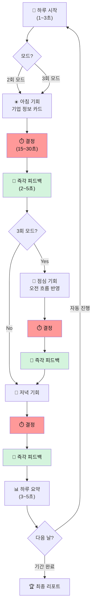
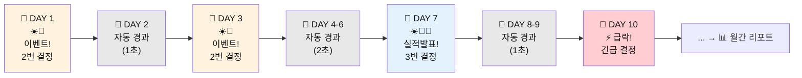
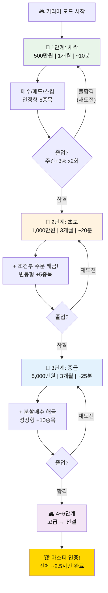
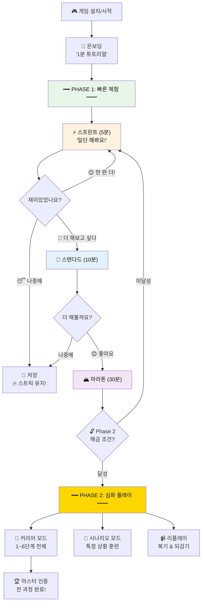

# 주식 시뮬레이션 게임 - 속도 & 유연성 기획안 v4.0
## "파도를 타라: 빠르게, 유연하게, 즉각적으로"

---

## 문서 정보

| 항목 | 내용 |
|------|------|
| **버전** | v4.0 (Speed Edition) |
| **기반** | v3.1 + 속도/유연성 피드백 (6차) |
| **최종 업데이트** | 2026.02.16 |
| **상태** | 2단계 설계 |
| **핵심 변경** | 시간 압축, 유연한 하루 구조, 5분/10분/30분 모드, 속도 기반 재설계 |

### v4.0 핵심 변경 (v3.1 대비)

| 항목 | v3.1 | v4.0 |
|------|------|------|
| 하루 구성 | 고정 3회 (오전/점심/저녁) | **유연 2~3회 (아침-저녁 / 아침-점심-저녁)** |
| 플레이 시간 | 고정 (시간 개념 없음) | **5분/10분/30분 모드 선택** |
| 시뮬레이션 기간 | 1일 = 1일 (느림) | **시간 압축 (1개월 = 5~30분)** |
| 속도감 | 30초 결정만 | **전체 게임 속도 설계 (결정 + 피드백 + 전환)** |
| 집중 유지 | 게임화만 | **속도 + 게임화 + 즉각 피드백 삼위일체** |

---

# PHASE 1: 빠른 체험 - "5분 안에 한 달 투자"

> **목표**: 누구든 5분만 투자하면 한 달 투자를 체험할 수 있다.
> 지루할 틈 없이 빠르게 진행, 즉각 피드백, 바로 결과 확인.

---

## 1. 핵심 설계 원칙

```
🎯 속도 3원칙:

1. "기다리는 시간 = 0" 
   → 결정 → 즉각 피드백 → 바로 다음 기회
   → 로딩, 대기, 빈 화면 절대 없음

2. "한 세션 = 완결"
   → 5분이든 30분이든, 시작과 끝이 있다
   → 중간에 끊겨도 OK, 다시 와도 이어짐

3. "빠를수록 재미있다"
   → 짧은 시간에 많은 판단 → 성취감
   → 듀오링고 한 판 (3분) 느낌
```

---

## 2. 스피드 모드 3가지

### 2-1. 모드 비교표

| | ⚡ 스프린트 (5분) | 🏃 스탠다드 (10분) | 🏔️ 마라톤 (30분) |
|---|---|---|---|
| **실제 플레이 시간** | 5분 | 10분 | 30분 |
| **시뮬레이션 기간** | 1개월 (20 거래일) | 3개월 (60 거래일) | 12개월 (240 거래일) |
| **시간 압축률** | 1거래일 = 15초 | 1거래일 = 10초 | 1거래일 = 7.5초 |
| **하루 투자 기회** | 2회 (아침/저녁) | 2~3회 (유연) | 3회 (아침/점심/저녁) |
| **결정 시간** | 15초 | 20초 | 30초 |
| **총 결정 횟수** | ~40회 | ~120~180회 | ~720회 |
| **피드백 속도** | 2초 (초고속) | 3초 | 5초 (상세) |
| **추천 대상** | 처음 하는 사람, 점심시간 | 출퇴근 시간, 가벼운 학습 | 주말 집중 학습, 심화 |

### 2-2. 속도 모드 선택 UI

```
+-------------------------------------------------------+
| 🏄 파도를 타라!                                       |
|                                                       |
| 오늘은 어떻게 투자할까요?                             |
|                                                       |
| ┌─────────────────────────────────────────────┐       |
| │ ⚡ 스프린트 모드                              │       |
| │ "5분 안에 한 달 투자 체험"                    │       |
| │                                              │       |
| │ ⏱️ 5분  |  📅 1개월  |  🎯 40번 결정         │       |
| │ 💡 점심시간에 딱!                             │       |
| └─────────────────────────────────────────────┘       |
|                                                       |
| ┌─────────────────────────────────────────────┐       |
| │ 🏃 스탠다드 모드                              │       |
| │ "10분으로 3개월 투자 시뮬레이션"              │       |
| │                                              │       |
| │ ⏱️ 10분  |  📅 3개월  |  🎯 120번+ 결정      │       |
| │ 💡 출퇴근 길에 딱!                            │       |
| └─────────────────────────────────────────────┘       |
|                                                       |
| ┌─────────────────────────────────────────────┐       |
| │ 🏔️ 마라톤 모드                               │       |
| │ "30분으로 1년 투자 마스터"                    │       |
| │                                              │       |
| │ ⏱️ 30분  |  📅 12개월  |  🎯 720번 결정      │       |
| │ 💡 주말 집중 학습에 딱!                       │       |
| └─────────────────────────────────────────────┘       |
|                                                       |
+-------------------------------------------------------+
```

---

## 3. 유연한 하루 구조

### 3-1. "꼭 3번 안 해도 된다"

```
핵심: 하루 투자 기회 수는 유연합니다!

모드별 / 상황별 / 설정별로 바뀝니다:

🌤️ 2회 모드 (아침-저녁):
  ☀️ 아침: 장 시작 기회
  🌙 저녁: 장 마감 기회
  → 빠르게, 핵심만

🌤️🌤️ 3회 모드 (아침-점심-저녁):
  ☀️ 아침: 장 시작 기회
  🍚 점심: 중간 점검 기회  
  🌙 저녁: 장 마감 기회
  → 더 디테일하게

📌 자동 결정 규칙:
- ⚡ 스프린트 (5분): 기본 2회 (아침/저녁)
- 🏃 스탠다드 (10분): 2~3회 (상황에 따라)
- 🏔️ 마라톤 (30분): 기본 3회 (아침/점심/저녁)
- 사용자가 직접 설정 가능!
```

### 3-2. 하루 구조 비교

| | 2회 모드 (아침-저녁) | 3회 모드 (아침-점심-저녁) |
|---|---|---|
| **총 시간** | 더 빠름 | 더 상세 |
| **☀️ 아침** | 전일 뉴스 + 장 시작 | 전일 뉴스 + 장 시작 |
| **🍚 점심** | 없음 (스킵) | 오전 흐름 반영 |
| **🌙 저녁** | 하루 종합 + 마감 전략 | 마감 전 + 포지션 정리 |
| **적합한 상황** | 빠른 테스트, 스프린트 | 심화 학습, 마라톤 |
| **결정 밀도** | 높음 (짧은 간격) | 보통 (여유 있는 간격) |

### 3-3. 유연한 하루 흐름 (시간 압축)



---

## 4. 시간 압축 시스템: "1개월 = 5분"

### 4-1. 시간 압축 원리

```
현실 1 거래일 → 게임 15초 (스프린트 모드)

15초 = 어떻게 구성?

┌──────────────────────────────────┐
│ [2초] 기업 카드 등장 + 핵심 정보 │
│ [8초] 판단 (15초 타이머 중)      │
│ [3초] 결정 실행                  │
│ [2초] 즉각 피드백 + 이모지       │
│                                  │
│ = 15초에 1번 투자 판단 완료!     │
└──────────────────────────────────┘

하루 2회 기회 = 30초
20거래일 (1개월) = 20 x 30초 = 10분

... 하지만 모든 날이 투자 기회가 있진 않다!
평소 날: 자동 스킵 (1~2초로 빠르게 경과)
이벤트 날: 투자 기회 카드 제시

실제 결정 필요 일수: 20일 중 ~12일
나머지 8일: "시장 평온, 변동 없음" (1초 자동 경과)

5분 = 약 12번 결정 x 15초 + 8일 자동 경과 + 리포트
```

### 4-2. 시간 압축 모드별 상세

| 항목 | ⚡ 스프린트 | 🏃 스탠다드 | 🏔️ 마라톤 |
|------|-----------|-----------|----------|
| **시뮬 기간** | 1개월 (20일) | 3개월 (60일) | 12개월 (240일) |
| **결정이 필요한 날** | ~12일 | ~36일 | ~120일 |
| **자동 경과 날** | ~8일 | ~24일 | ~120일 |
| **결정당 시간** | 15초 | 20초 | 30초 |
| **하루 기회** | 2회 | 2~3회 | 3회 |
| **자동 경과 속도** | 1초/일 | 0.5초/일 | 0.5초/일 |
| **피드백 시간** | 2초 | 3초 | 5초 |
| **하루 요약** | 생략 (핵심만) | 간략 (3초) | 상세 (5초) |
| **주간 리포트** | 5초 핵심만 | 10초 상세 | 15초 풀버전 |

### 4-3. 자동 경과 시스템 ("평범한 날 스킵")

```
모든 날에 투자 기회를 줄 필요 없음!
→ "평범한 날"은 자동 경과 (1~2초)

자동 경과 화면:
+-------------------------------------------------------+
|                                                       |
|  📅 DAY 5~7 (3일 자동 경과)                          |
|                                                       |
|  시장: 보합세, 큰 변동 없음                           |
|  보유 종목: 삼성전자 +0.3%, SK하이닉스 -0.2%          |
|                                                       |
|  [━━━━━━━━━━━━━━━━━━] 자동 진행 중...                |
|                                                       |
+-------------------------------------------------------+

→ 1~2초 후 다음 이벤트 날로 자동 점프!
→ 사용자는 "빠르게 진행되는 느낌" 체험
→ 지루한 구간 제로

이벤트 트리거 (이날은 반드시 기회 제시):
- 실적 발표일
- 뉴스/공시 발생일
- 급등/급락일
- 포지션 정리 필요일
- 조건부 주문 체결일
```

### 4-4. 시간 압축 흐름도



---

## 5. ⚡ 스프린트 모드 상세 (5분 완결)

### 5-1. 5분 타임라인

```
⚡ 스프린트 모드: 5분 = 1개월 투자 체험

[0:00~0:30] 🎬 게임 시작
  - 캐릭터 선택, 시나리오 선택 (첫 회만)
  - 자금 500만원, 종목 풀 5개
  - "1개월 투자를 5분 안에 체험합니다!"

[0:30~4:00] 🎮 투자 플레이 (~12번 결정)
  - 이벤트 날: 15초 결정 x 2회 = 30초/일
  - 자동 경과 날: 1초씩 빠르게 흘러감
  - 약 12일 이벤트 x 30초 + 8일 자동 x 1초 = ~4분

[4:00~4:30] 📊 월간 리포트
  - 수익률, 대처 점수, 투자 DNA
  - 뱃지 획득, AI 비교

[4:30~5:00] 🏆 결과 + 다음 도전
  - "다시 하기" / "다음 달" / "모드 변경"
  - 핵심: 끝나자마자 "한 판 더!" 욕구

━━━━━━━━━━━━━━━━━━━━━━
총 시간: 5분
결정 횟수: ~24회 (12일 x 2회)
피드백: 24회 즉각 반응
━━━━━━━━━━━━━━━━━━━━━━
```

### 5-2. 스프린트 투자 카드 (초고속 버전)

```
기존 카드: 정보가 많아서 읽는 데 시간 소요
스프린트 카드: 핵심만! 3초면 파악 가능!

+-------------------------------------------------------+
| ☀️ 아침                              [15] ██████░░░░ |
+-------------------------------------------------------+
|                                                       |
|  삼성전자  72,000원  📈+2.5%                          |
|                                                       |
|  🤖 "HBM3 엔비디아 공급 계약" (공시)                  |
|  📊 외국인 3일 순매수 | 거래량 +145%                  |
|                                                       |
|  +--------+  +--------+  +--------+                   |
|  |📈 매수 |  |💰 매도 |  |⏭️ 스킵 |                   |
|  | 150만원 |  | (없음) |  |        |                   |
|  +--------+  +--------+  +--------+                   |
+-------------------------------------------------------+

→ 핵심 정보 2줄 + AI 이유 1줄 = 3초면 읽을 수 있음
→ 15초 안에 충분히 결정 가능
```

### 5-3. 스프린트 즉각 피드백 (2초 버전)

```
결정 후 2초 피드백 (초고속):

┌──────────────────────────────┐
│ 😊 "좋은 선택!" ⭐⭐⭐⭐      │
│ 삼성전자 매수 → +2.5%       │
│ 🔥 3 COMBO!                 │
└──────────────────────────────┘
→ 2초 후 자동으로 다음 기회로!

나쁜 결정:
┌──────────────────────────────┐
│ 😰 "으... 아쉬워요" ⭐⭐     │
│ 카카오 매수 → -3.5%         │
│ 💔 콤보 끊김                 │
└──────────────────────────────┘

스킵 (좋은 스킵):
┌──────────────────────────────┐
│ 😏 "현명해요!" ⭐⭐⭐⭐      │
│ 스킵 → 이후 -2.1% 하락      │
│ 🛡️ 스킵 마스터!             │
└──────────────────────────────┘
```

---

## 6. 🏃 스탠다드 모드 상세 (10분 완결)

### 6-1. 10분 타임라인

```
🏃 스탠다드 모드: 10분 = 3개월 투자 체험

[0:00~0:30] 🎬 게임 설정
  - 자금 1,000만원, 종목 풀 10개
  - 하루 기회: 2~3회 (유연)
  - "3개월 투자를 10분 안에 체험합니다!"

[0:30~8:30] 🎮 투자 플레이 (~36일 이벤트)
  - 이벤트 날: 20초 결정 x 2~3회
  - 자동 경과 날: 0.5초씩
  - 주간 리포트: 매주 끝에 5초

[8:30~9:30] 📊 분기 리포트
  - 상세 성과 분석
  - 투자 DNA 변화 그래프
  - AI 패턴 비교

[9:30~10:00] 🏆 결과
  - 뱃지, 랭킹, 다음 도전

━━━━━━━━━━━━━━━━━━━━━━
총 시간: 10분
결정 횟수: ~80~120회
주간 리포트: 12회
━━━━━━━━━━━━━━━━━━━━━━
```

### 6-2. 스탠다드 모드 특징: "유연한 하루"

```
스탠다드 모드에서는 하루 기회 수가 유동적!

평범한 이벤트 날: 2회 (아침/저녁)
  ☀️ 아침 → 🌙 저녁

중요 이벤트 날: 3회 (아침/점심/저녁)  
  ☀️ 아침 → 🍚 점심 → 🌙 저녁
  (실적 발표, 블랙스완, 급등락 등)

왜 유연하게?
→ 중요한 날은 더 많은 판단 기회
→ 평범한 날은 빠르게 진행
→ 속도감 + 전략적 깊이 동시 달성
```

---

## 7. 🏔️ 마라톤 모드 상세 (30분 완결)

### 7-1. 30분 타임라인

```
🏔️ 마라톤 모드: 30분 = 12개월 (1년) 투자 체험

[0:00~1:00] 🎬 게임 설정 + 목표 설정
  - 자금: 단계별 설정
  - 1년 목표 수익률 설정
  - "1년 투자를 30분으로 압축합니다!"

[1:00~26:00] 🎮 투자 플레이 (12개월)
  - 월별 구조:
    ┌─────────────────────────────┐
    │ 1개월 = 약 2분             │
    │ - 이벤트 날 ~8일: 30초 x 3회│
    │ - 자동 경과: 빠르게        │
    │ - 월간 요약: 5초           │
    └─────────────────────────────┘
  - 시즌 이벤트: 분기마다 특별 시나리오
  - 블랙스완: 1~2회 포함

[26:00~28:00] 📊 연간 리포트
  - 12개월 성과 차트
  - 투자 DNA 진화 과정
  - 대처 능력 성장 곡선

[28:00~30:00] 🏆 최종 결과 + 인증
  - 종합 등급 부여
  - 뱃지 총 정리
  - 다음 도전 추천

━━━━━━━━━━━━━━━━━━━━━━
총 시간: 30분
결정 횟수: ~300~720회
위기 대처 시나리오: 6~10회
━━━━━━━━━━━━━━━━━━━━━━
```

---

## 8. 즉각 피드백 속도 설계

### 8-1. "0.5초 규칙"

```
모든 UI 전환은 0.5초 이내!

❌ 느린 게임:
  결정 → [로딩 2초] → [애니메이션 3초] → 피드백 → [로딩 1초] → 다음
  = 6초 낭비

✅ 우리 게임:
  결정 → [즉시 0.2초] → 피드백 팝업 → [자동 전환 0.3초] → 다음
  = 0.5초 전환

이것이 "빠르다"고 느끼는 핵심!
```

### 8-2. 모드별 피드백 속도

| 요소 | ⚡ 스프린트 | 🏃 스탠다드 | 🏔️ 마라톤 |
|------|-----------|-----------|----------|
| **카드 등장** | 0.3초 | 0.5초 | 0.5초 |
| **결정 타이머** | 15초 | 20초 | 30초 |
| **결정 후 피드백** | 2초 (핵심만) | 3초 (기본) | 5초 (상세) |
| **"만약?" 시뮬** | 생략 | 1줄 (2초) | 풀버전 (5초) |
| **다음 기회 전환** | 0.3초 | 0.5초 | 0.5초 |
| **하루 요약** | 생략 | 3초 핵심 | 5초 상세 |
| **주간 리포트** | 5초 핵심 | 10초 | 15초 풀 |
| **자동 경과 (1일)** | 1초 | 0.5초 | 0.5초 |

### 8-3. 피드백 레벨 비교 (모드별)

```
같은 결정이라도 모드에 따라 피드백 깊이가 다름:

⚡ 스프린트 피드백 (2초):
┌────────────────────────┐
│ 😊 ⭐⭐⭐⭐ +2.5%      │
│ 🔥 3 COMBO!            │
└────────────────────────┘

🏃 스탠다드 피드백 (3초):
┌────────────────────────────────┐
│ 😊 "좋은 선택!" ⭐⭐⭐⭐       │
│ 삼성전자 매수 → +2.5%         │
│ 💭 스킵했다면 → 기회 놓침     │
│ 🔥 3 COMBO!                   │
└────────────────────────────────┘

🏔️ 마라톤 피드백 (5초):
┌──────────────────────────────────────┐
│ 🏄 "오 대박! 완벽한 타이밍!"        │
│ ⭐⭐⭐⭐ GREAT!                       │
│                                      │
│ 삼성전자 매수 → +2.5%               │
│ 타이밍 ⭐⭐⭐⭐⭐ | 리스크 ⭐⭐⭐⭐    │
│                                      │
│ 💭 만약 스킵했다면?                  │
│ → 이후 +3.2% 추가 상승, 기회 놓침   │
│                                      │
│ 🔥 3 COMBO! | ❤️❤️❤️❤️❤️            │
└──────────────────────────────────────┘
```

---

## 9. 속도 기반 게임화 (듀오링고 + 속도)

### 9-1. 스피드 보너스

```
빠르게 결정할수록 보너스!

결정 속도 보너스 (모든 모드 공통):
⚡ 5초 이내 결정:  "번개 결정!" +20% 포인트
🔥 10초 이내 결정: "빠른 결정!" +10% 포인트
✅ 15초 이내 결정: "적절한 결정" +5% 포인트
⏰ 시간 초과:      "느린 결정..." 0% (자동 스킵)

단, 빠르다고 무조건 좋은 건 아님!
→ 빠르게 + 정확하게 = 최고 보너스
→ 빠르게 + 틀리면 = 속도 보너스만 (작음)
→ "속도 + 정확도" 균형이 핵심!
```

### 9-2. 스프린트 전용 게임 요소

```
⚡ 스프린트 모드 전용 미니게임 요소:

🎯 "퍼펙트 런" 챌린지:
- 5분 동안 모든 결정 3성 이상 → 특별 뱃지!
- 한 번이라도 1성이면 실패
- "당신은 5분 동안 완벽했습니다!"

⏱️ "타임 어택":
- 총 결정 시간 합계 기록
- 24번 결정 합계 시간으로 랭킹
- "역대 최고 기록: 평균 8.3초!"

🔥 "연속 도전":
- 스프린트 3판 연속 플레이 (15분)
- 3개월 연속 시뮬레이션
- 판마다 연결 (자산 이월)
```

### 9-3. "한 판 더!" 심리 설계

```
듀오링고 성공 비결: "한 판 더!" 유도

우리도 동일하게:

게임 종료 시:
+-------------------------------------------------------+
| 🏆 1개월 투자 완료!                                   |
|                                                       |
| 📈 수익률: +8.5%  ⭐ 평균: 3.8  🔥 최고 콤보: 5     |
|                                                       |
| 🏄 파돌이: "멋져요! 한 판 더 하면 더 잘할 수 있어요!" |
|                                                       |
| ┌──────────────┐  ┌──────────────┐                    |
| │ ⚡ 한 판 더!  │  │ 🔄 다른 모드  │                    |
| │ (다음 달)    │  │ (10분/30분)  │                    |
| └──────────────┘  └──────────────┘                    |
|                                                       |
| 🔥 스트릭: Day 7 | "내일도 오면 보상 2배!"           |
+-------------------------------------------------------+

핵심 유도 장치:
1. "한 판 더" 버튼이 가장 크고 눈에 띄게
2. "다음 달은 더 재미있는 시나리오" 티저
3. 스트릭 경고: "내일 안 하면 7일 스트릭이 끊겨요!"
4. 이전 기록 갱신 가능성: "이번엔 +10% 넘길 수 있을 것 같아요"
```

---

## 10. 투자 카드 속도별 정보 밀도

### 10-1. 정보 밀도 비교

| 정보 항목 | ⚡ 스프린트 | 🏃 스탠다드 | 🏔️ 마라톤 |
|----------|-----------|-----------|----------|
| **기업명 + 가격** | O | O | O |
| **등락률** | O | O | O |
| **AI 이유 (핵심 1줄)** | O | O | O |
| **AI 이유 (상세 2~3줄)** | X | O | O |
| **기업 한줄 요약** | X | X | O |
| **AI 이유 카테고리 아이콘** | O | O | O |
| **AI 이유 신뢰도 표시** | X | O | O |
| **AI 멘토 한줄 조언** | X | O (1명) | O (2명) |
| **보유 종목 현황** | 간략 | 기본 | 상세 |

### 10-2. 모드별 카드 UI

```
⚡ 스프린트 카드 (최소 정보, 빠른 판단):
+----------------------------------------+
| ☀️ 아침               [15] ██████░░░░ |
+----------------------------------------+
| 삼성전자  72,000원  📈+2.5%            |
| 🤖 "HBM3 계약 체결" (📋 공시)         |
| 📊 외국인 순매수 | 거래량 +145%        |
| +------+ +------+ +------+            |
| |📈매수| |💰매도| |⏭️스킵|            |
| +------+ +------+ +------+            |
+----------------------------------------+

🏃 스탠다드 카드 (기본 정보):
+-------------------------------------------------------+
| ☀️ 아침                          [20] ████████░░░░ |
+-------------------------------------------------------+
| 삼성전자 (005930)           현재가: 72,000원          |
| 전일비: +2.5% (+1,800원) 📈                          |
|                                                       |
| 🤖 AI 분석:                                           |
| 1️⃣ HBM3 엔비디아 공급 계약 (📋 공시) [신뢰도: 높음] |
| 2️⃣ 외국인 3일 연속 순매수 (📊 수급)                 |
| ⚠️ RSI 68, 단기 과열 가능                            |
|                                                       |
| 🧓 김철수: "매수 OK, 30% 이내로"                     |
|                                                       |
| +--------+ +--------+ +--------+                     |
| |📈 매수 | |💰 매도 | |⏭️ 스킵 |                     |
| | 150만원 | | (없음) | |        |                     |
| +--------+ +--------+ +--------+                     |
+-------------------------------------------------------+

🏔️ 마라톤 카드 (상세 정보 = v3.1 풀 카드):
→ v3.1의 기업 정보 + AI 이유 카드 그대로 사용
```

---

# PHASE 2: 심화 플레이 - "깊이 있는 투자 시뮬레이션"

> **목표**: Phase 1에서 빠르게 맛본 후, 더 깊은 학습을 원하는 사용자를 위한 모드.
> 시간은 더 투자하되, 학습 효과를 극대화한다.

---

## 11. Phase 2 개요

### 11-1. Phase 1 vs Phase 2 비교

| | Phase 1 (빠른 체험) | Phase 2 (심화 플레이) |
|---|---|---|
| **목적** | 맛보기, 흥미 유발, 습관 형성 | 실력 향상, 깊은 학습 |
| **속도** | 빠름 (5~30분) | 중간~느림 (시간 투자) |
| **정보 깊이** | 핵심만 | 상세 분석 |
| **피드백** | 즉각 + 간략 | 즉각 + 상세 분석 |
| **위기 대처** | 기본 시나리오 | 고급 시나리오 + 멀티 위기 |
| **투자 DNA** | 기본 유형 분류 | 상세 패턴 분석 + 코칭 |
| **조건부 주문** | 없음 (1단계) / 기본 (2단계) | 고급 조건부 + 분할매수 |
| **진입 조건** | 없음 (누구나) | Phase 1에서 특정 조건 달성 |

### 11-2. Phase 2 해금 조건

```
Phase 2는 Phase 1에서 충분히 체험한 후 열림:

해금 조건 (하나만 달성하면 OK):
🔓 스프린트 3판 완료 (15분 투자)
🔓 스탠다드 1판 완료 (10분 투자)
🔓 마라톤 1판 완료 (30분 투자)
🔓 총 결정 100회 이상
🔓 스트릭 3일 달성

→ 빠르면 10분 만에 Phase 2 해금 가능!
→ "더 깊이 배우고 싶다면, Phase 2로 오세요!"
```

---

## 12. Phase 2 모드 시스템

### 12-1. 커리어 모드 (장기 시뮬레이션)

```
Phase 1이 "한 판"이라면, Phase 2는 "커리어"

커리어 모드:
- 1단계~6단계를 순서대로 진행
- 각 단계 = 시간 압축 시뮬레이션
- 졸업 조건 달성 → 다음 단계

단계별 시뮬레이션 시간:
┌──────────────────────────────────────────┐
│ 단계 │ 시뮬 기간 │ 실제 시간 │ 하루 기회  │
├──────┼──────────┼──────────┼───────────┤
│ 1단계│  1개월   │  ~10분   │ 2회       │
│ 2단계│  3개월   │  ~20분   │ 2~3회     │
│ 3단계│  3개월   │  ~25분   │ 3회       │
│ 4단계│  6개월   │  ~30분   │ 3회       │
│ 5단계│  6개월   │  ~30분   │ 3회       │
│ 6단계│ 12개월   │  ~30분   │ 3회       │
├──────┼──────────┼──────────┼───────────┤
│ 전체 │ 31개월   │ ~145분   │           │
│      │ (~2.5년) │ (~2.5시간)│           │
└──────────────────────────────────────────┘

→ 2.5시간이면 2.5년 투자 경험!
→ 한 번에 안 해도 됨 (단계별 저장)
→ 하루 10~30분씩 일주일이면 완주 가능
```

### 12-2. 커리어 모드 진행 흐름



### 12-3. 시나리오 모드 (특정 상황 훈련)

```
커리어 모드 외에, 특정 상황만 집중 훈련:

┌─────────────────────────────────────────┐
│ 🎯 시나리오 모드 (각 5~15분)           │
├─────────────────────────────────────────┤
│                                         │
│ 🔴 위기 대처 시나리오 (5분)            │
│   "3연속 급락! 살아남을 수 있나?"       │
│   → 급락 대처 집중 훈련                │
│                                         │
│ 🟠 FOMO 극복 시나리오 (5분)            │
│   "모두가 매수할 때 나는?"              │
│   → 버블/추격매수 저항 훈련            │
│                                         │
│ 🟢 우상향 시나리오 (10분)              │
│   "모든 게 오른다! 언제 팔지?"          │
│   → 수익 확정 타이밍 훈련              │
│                                         │
│ ⚫ 블랙스완 시나리오 (5분)             │
│   "코로나, 금융위기 재현"               │
│   → 극한 상황 대처 훈련                │
│                                         │
│ 🔵 실적 시즌 시나리오 (10분)           │
│   "실적 발표 전후 3개월"                │
│   → 실적 분석/대응 훈련                │
│                                         │
│ 🟣 테마주 시나리오 (10분)              │
│   "AI, 2차전지, 로봇 광풍"              │
│   → 테마/트렌드 판단 훈련              │
│                                         │
└─────────────────────────────────────────┘
```

---

## 13. Phase 2 상세 피드백 시스템

### 13-1. 리플레이 & 복기 기능

```
Phase 2에서는 "지나간 결정"을 복기할 수 있습니다.

📹 리플레이:
- 완료된 시뮬레이션을 다시 볼 수 있음
- 각 결정 포인트에서 "되감기" 가능
- "이때 다르게 했다면?" 직접 체험

┌──────────────────────────────────────────┐
│ 📹 리플레이 모드 - DAY 7                │
│                                          │
│ 원래 결정: 삼성전자 매수 → +5.2%       │
│                                          │
│ [🔄 되감기] 다른 선택을 해보세요:       │
│                                          │
│ [📈 매수] [💰 매도] [⏭️ 스킵] [📋 조건] │
│                                          │
│ → 스킵 선택 시:                         │
│ "스킵했다면 이후 3일간 +12% 상승,       │
│  큰 기회를 놓쳤을 것입니다."            │
│                                          │
│ → 매도 선택 시:                         │
│ "이때 매도했다면 +5.2% 확정,            │
│  이후 +7% 추가 수익을 놓쳤을 것."      │
└──────────────────────────────────────────┘
```

### 13-2. 투자 일기 (의식적 투자 훈련)

```
Phase 2에서는 결정 이유를 짧게 기록:

결정 시 선택적 입력 (3초):
+-------------------------------------------------------+
| 왜 이 결정을 했나요? (선택)                            |
|                                                       |
| [🤖 AI 이유 믿음] [📰 뉴스 긍정] [📊 수급 좋음]     |
| [🎯 기술적 신호] [💡 직감]     [🛡️ 위험 회피]       |
|                                                       |
| → 태그 1개만 터치! (1초면 됨)                         |
+-------------------------------------------------------+

이유를 기록하면:
→ AI가 "당신의 결정 패턴" 분석
→ "직감 기반 결정: 적중률 45%"
→ "AI 이유 기반 결정: 적중률 68%"
→ "뉴스 기반 결정: 적중률 55%"
→ 어떤 근거로 결정할 때 더 잘하는지 분석!
```

### 13-3. AI 코칭 리포트 (Phase 2 전용)

```
Phase 2 주간 리포트에 추가되는 AI 코칭:

┌──────────────────────────────────────────┐
│ 🤖 AI 코칭 리포트 (Week 3)             │
│                                          │
│ 📋 이번 주 핵심 발견:                   │
│                                          │
│ 1. "오전에 매수한 종목 수익률이          │
│     저녁 매수보다 +3.2% 높았어요"       │
│     → 당신은 오전 판단력이 뛰어납니다   │
│                                          │
│ 2. "급락 시 15초 안에 손절하면           │
│     손실이 평균 40% 줄었어요"           │
│     → 빠른 손절 습관이 잡히고 있어요    │
│                                          │
│ 3. "FOMO 매수 3회 중 3회 손실"          │
│     → 추격 매수는 아직 위험합니다       │
│                                          │
│ 🎯 다음 주 미션:                        │
│ "오전 투자에 집중하고,                   │
│  추격 매수 0회를 도전해 보세요!"        │
└──────────────────────────────────────────┘
```

---

## 14. 전체 게임 구조 (Phase 1 + Phase 2)

### 14-1. 사용자 여정 전체 흐름



### 14-2. 시간 투자 vs 학습 효과

| 총 투자 시간 | 달성 가능 | 학습 효과 |
|-------------|----------|----------|
| **5분** | 스프린트 1판 (1개월 체험) | 기본 감각 체험 |
| **15분** | 스프린트 3판 (Phase 2 해금) | 매수/매도/스킵 판단력 |
| **30분** | 마라톤 1판 (1년 체험) | 장기 투자 감각 |
| **1시간** | 커리어 1~2단계 | 기본 투자 원칙 체화 |
| **2.5시간** | 커리어 전체 완주 | 투자 DNA 완성 |
| **5시간+** | 시나리오 전체 + 리플레이 | 위기 대처 마스터 |

### 14-3. "바쁜 사람도 할 수 있다"

```
핵심: 현대인의 시간에 맞춤!

🕐 출근 지하철 (15분):
   → 스프린트 3판 = 3개월 투자 체험

🕐 점심시간 잠깐 (5분):
   → 스프린트 1판 = 1개월 투자 체험

🕐 퇴근 버스 (10분):
   → 스탠다드 1판 = 3개월 투자 체험

🕐 주말 카페 (30분):
   → 마라톤 1판 = 1년 투자 마스터

🕐 주말 오후 (2.5시간):
   → 커리어 모드 전체 완주!

하루 5분이면 충분합니다.
하지만 하고 싶으면 2.5시간도 OK!
```

---

## 15. 속도별 UI 테마

### 15-1. 시간대 + 속도 UI 결합

```
모드별로 UI 분위기도 바뀝니다:

⚡ 스프린트:
- 배경: 다이나믹 그라데이션 (빠르게 변화)
- 전환: 스와이프 (넘기는 느낌)
- 효과: 미니멀, 빠른 애니메이션
- 느낌: "카드 넘기기 게임"

🏃 스탠다드:
- 배경: 시간대별 (아침=노란, 점심=파란, 저녁=보라)
- 전환: 부드러운 슬라이드
- 효과: 적절한 애니메이션
- 느낌: "투자 앱 같은 느낌"

🏔️ 마라톤:
- 배경: 시간대별 + 계절 변화 (봄→여름→가을→겨울)
- 전환: 풀 화면 전환
- 효과: 상세한 차트 + 데이터 시각화
- 느낌: "진짜 투자 시뮬레이터"
```

### 15-2. 빠른 전환 제스처

```
모바일 UX: 속도를 위한 제스처 설계

👆 탭: 버튼 선택 (매수/매도/스킵)
👈 왼쪽 스와이프: 스킵 (빠른 스킵!)
👉 오른쪽 스와이프: 매수 (빠른 매수!)
👇 아래 스와이프: 상세 정보 보기
👆 위로 스와이프: 다음으로 넘기기 (피드백 스킵)

→ 버튼 누르기보다 스와이프가 0.3초 더 빠름
→ 스프린트 모드에서는 스와이프 적극 추천
```

---

## 16. 기술 구현 시 속도 최적화

### 16-1. 프론트엔드 속도 최적화

| 최적화 항목 | 목표 | 방법 |
|------------|------|------|
| **첫 화면 로딩** | < 1초 | SSR + 코드 스플리팅 |
| **카드 전환** | < 0.3초 | 프리로딩 (다음 카드 미리 준비) |
| **피드백 팝업** | < 0.1초 | CSS 애니메이션 (JS 최소화) |
| **자동 경과** | < 0.5초/일 | 배치 렌더링 (여러 날 한 번에) |
| **타이머** | 16ms 정확도 | requestAnimationFrame |
| **AI 이유 생성** | 즉시 (프리로딩) | 다음 기회의 AI 이유를 미리 계산 |

### 16-2. 프리로딩 전략

```
사용자가 현재 카드를 보는 동안,
다음 카드의 모든 데이터를 미리 준비!

현재: 카드 #1 표시 중 (15~30초)
백그라운드:
  → 카드 #2 데이터 로딩 (0.5초)
  → 카드 #2 AI 이유 생성 (1초)
  → 카드 #2 UI 프리렌더링 (0.3초)
  → 피드백 시나리오 계산 (0.5초)

결과: 카드 전환 시 "이미 다 준비됨" → 0.1초 전환!
```

---

## 17. 전체 요약

### 핵심 공식 (v4.0)

```
⚡ 속도 3원칙 (기다림 = 0, 한 세션 = 완결, 빠를수록 재미)
+ 🎮 3가지 스피드 모드 (5분/10분/30분)
+ 🔄 시간 압축 (1개월 = 5분, 1년 = 30분)
+ 📅 유연한 하루 (2~3회, 상황에 따라)
+ ☀️🍚🌙 시간대 표시 (아침/점심/저녁)
+ 📋 기업 정보 + AI 이유 (토스 스타일, 모드별 정보량 조절)
+ 🎯 즉각 피드백 (2초~5초, 모드별 깊이 조절)
+ 🏄 듀오링고 게임화 (이모지, HP, 스트릭, 콤보, 뱃지)
+ 🛡️ 사고 대처 훈련 (위기 시나리오)
+ 🧬 투자 DNA 분석 (패턴 + AI 비교)
= "5분이면 충분한, 빠르고 유연한 투자 훈련 게임"
```

### Phase 1 vs Phase 2 최종 비교

| | Phase 1: 빠른 체험 | Phase 2: 심화 플레이 |
|---|---|---|
| **한 줄 요약** | "5분만 줘봐, 투자 감각 깨워줄게" | "진짜 투자자가 되고 싶다면" |
| **모드** | 스프린트/스탠다드/마라톤 | 커리어/시나리오/리플레이 |
| **시간** | 5~30분 | 10분~2.5시간 |
| **정보** | 핵심만 빠르게 | 상세 분석 + 코칭 |
| **게임화** | 풀 (HP, 콤보, 뱃지) | 풀 + 투자 일기, 리플레이 |
| **대상** | 모든 사용자 | Phase 1 졸업자 |
| **핵심 가치** | 재미 + 흥미 + 습관 | 실력 + 대처력 + 마스터 |

### 시간 압축 전체 비교표

| 실제 플레이 시간 | 시뮬레이션 기간 | 모드 | 결정 횟수 |
|----------------|---------------|------|----------|
| **5분** | 1개월 | ⚡ 스프린트 | ~24회 |
| **10분** | 3개월 | 🏃 스탠다드 | ~80~120회 |
| **30분** | 12개월 | 🏔️ 마라톤 | ~300~720회 |
| **~10분** | 1개월 | 커리어 1단계 | ~24회 |
| **~20분** | 3개월 | 커리어 2단계 | ~80회 |
| **~2.5시간** | ~31개월 | 커리어 전체 | ~1,000회+ |

---

**문서 버전**: v4.0 (Speed Edition)  
**최종 업데이트**: 2026.02.16  
**상태**: 2단계 설계 완성  
**핵심 철학**: "5분이면 충분하다. 빠르게, 유연하게, 즉각적으로."  
**개발 우선순위**: Phase 1 스프린트 모드 먼저 → 나머지 확장
